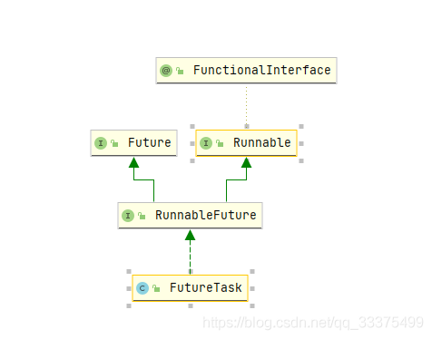
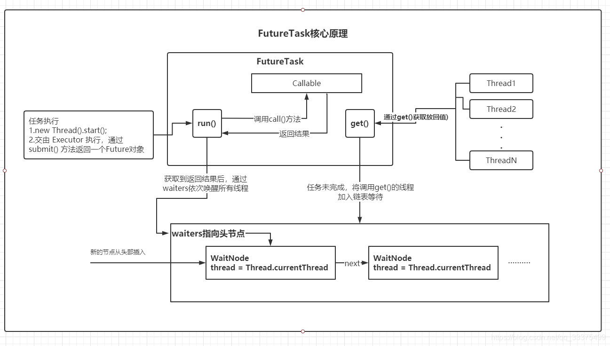

# Callable

Callable 接口类似于 Runnable，但是 **Runnable 不会返回结果，并且无法抛出返回结果的异常**，而 Callable 功能更强大一些，被线程执行后，**可以返回值，这个返回值可以被 Future 拿到，**也就是说，Future 可以通过 get()/get(long timeout, TimeUnit unit) 拿到异步执行任务的返回值.

```java
@FunctionalInterface
public interface Callable<V> {
    /**
     * Computes a result, or throws an exception if unable to do so.
     *
     * @return computed result
     * @throws Exception if unable to compute a result
     */
    V call() throws Exception;
}
```

**示例**：
不使用线程池

```java
public class CallableTest implements Callable<String> {

    public static void main(String[] args) throws Exception {
        CallableTest callable = new CallableTest();
        FutureTask<String> future = new FutureTask<>(callable);
        System.out.println("-------------start");
        new Thread(future).start();
        System.out.println(future.get());
        System.out.println("-------------end");
    }

    @Override
    public String call() throws Exception {
        Thread.sleep(1000 * 5);
        return "Hello Word";
    }
}

```

使用线程池

```java
public class CallablePollTest implements Callable<Object> {

    public static void main(String[] args) throws Exception {
        ExecutorService executorService = Executors.newFixedThreadPool(10);
        System.out.println("-------------start");
        Future<Object> future = executorService.submit(new CallablePollTest());
        System.out.println(future.get());
        System.out.println("-------------end");
    }

    @Override
    public String call() throws Exception {
        Thread.sleep(1000 * 5);
        return "Hello Word";
    }
}

```

**Callable 与 Runable主要区别**

(1) 接口 Callable 的 `call()` 方法可以有返回值(通过 Future 接口进行获得)，但 Runnable 接口的 run() 方法没有返回值。

(2) Callable 接口的 `call()` 方法可以声明抛出异常，而 Runnable 接口的 run() 方法不可以声明抛出异常。

# Future

Future 表示一个可能还没有完成的异步任务的结果，针对这个结果可以添加 Callback 以便在任务执行成功或失败后作出相应的操作。

```java
public interface Future<V> {

	/**
	 * 用来停止一个任务，如果任务可以停止（通过mayInterruptIfRunning来进行判断），则可以返回true,
	 * 如果任务已经完成或者已经停止，或者这个任务无法停止，则会返回false.
	 */
    boolean cancel(boolean mayInterruptIfRunning);
	
	/**
	 * 判断当前方法是否取消
	 */
    boolean isCancelled();

	/**
	 * 判断当前方法是否完成
	 */
    boolean isDone();

	/**
	 * 当任务结束后返回一个结果，如果调用时，工作还没有结束，则会阻塞线程，直到任务执行完毕
	 */
    V get() throws InterruptedException, ExecutionException;

	/**
	 * 等待timeout的时间返回结果，如果在timeout时间内没返回，抛出异常
	 */
    V get(long timeout, TimeUnit unit)
        throws InterruptedException, ExecutionException, TimeoutException;
}

```

## FutureTask

FutureTask 是一个可取消的异步任务。

FutureTask 提供了对 Future 的基本实现，可以调用方法去开始和取消一个任务，可以查询任务是否完成并且获取任务结果。只有当任务完成时才能获取到任务结果，一旦任务完成，任务将不能被重启或者被取消，除非调用 `runAndReset()` 方法。

除了实现了 Future 接口以外，FutureTask 还实现了 Runnable 接口，因此 FutureTask 交由 Executor 执行，也可以直接用线程调用执行(futureTask.run())。

# CompletableFuture 

CompletableFuture 是 JDK1.8 版本新引入的类，提供了非常强大的 Future 的扩展功能，它针对Future做了改进，可以传入回调对象，当异步任务完成或者发生异常时，自动调用回调对象的回调方法。



**FutureTask核心原理：**




**构建方法**

构建一个CompletableFuture

- `CompletableFuture.supplyAsync(Supplier<U> supplier)`：提供返回值；异步执行一个任务，默认用 ForkJoinPool.commonPool()；
- `CompletableFuture.supplyAsync(Supplier<U> supplier,Executor executor)`：提供返回值；异步执行一个任务，但是可以自定义线程池；
- `CompletableFuture.runAsync(Runnable runnable,Executor executor)` ：没有返回值;异步执行一个任务，但是可以自定义线程池；
- `CompletableFuture.runAsync(Runnable runnable)`：没有返回值；异步执行一个任务, 默认用 ForkJoinPool.commonPool()；

## CompletionStage

CompletionStage 是 Java8 新增得一个接口，用于异步执行中的阶段处理。CompletionStage 的接口方法可以从多种角度进行分类，从最宏观的横向划分，CompletionStage的接口主要分四类：

- 有入参无返回 **accept**
- 有入参有返回 **apply**
- 无入参无返回 **run**
- 无入参有返回 **supply**

Callable则是无入参有返回

Runnable则是无入参无返回

**纯消费类型的方法（有入参无返回）**：指依赖上一个异步任务的结果作为当前函数的参数进行下一步计算，它的特点是**不返回**新的计算值，这类的方法都包含 Accept 这个关键字。在 CompletionStage 中包含9个 Accept 关键字的方法，这9个方法又可以分为三类：依赖单个 CompletionStage 任务完成，依赖两个 CompletionStage 任务都完成，依赖两个 CompletionStage 中的任何一个完成。

```java
/***********依赖单个 CompletionStage 任务完成**************/
// 当前线程同步执行
public CompletionStage<Void> thenAccept(Consumer<? super T> action); 
// 使用ForkJoinPool.commonPool线程池执行action
public CompletionStage<Void> thenAcceptAsync(Consumer<? super T> action); 
// 使用自定义线程池执行action
public CompletionStage<Void> thenAcceptAsync(Consumer<? super T> action,Executor executor); 

/***********依赖两个 CompletionStage 任务都完成**************/
// 当前线程同步执行
public <U> CompletionStage<Void> thenAcceptBoth(CompletionStage<? extends U> other,BiConsumer<? super T, ? super U> action); 
// 使用ForkJoinPool.commonPool线程池执行action
public <U> CompletionStage<Void> thenAcceptBothAsync(CompletionStage<? extends U> other,BiConsumer<? super T, ? super U> action); 
// 使用自定义线程池执行action
public <U> CompletionStage<Void> thenAcceptBothAsync(CompletionStage<? extends U> other,BiConsumer<? super T, ? super U> action,Executor executor); 

/***********依赖两个 CompletionStage 中的任何一个完成**************/
// 当前线程同步执行
public CompletionStage<Void> acceptEither(CompletionStage<? extends T> other,Consumer<? super T> action); 
// 使用ForkJoinPool.commonPool线程池执行action
public CompletionStage<Void> acceptEitherAsync(CompletionStage<? extends T> other,Consumer<? super T> action); 
// 使用自定义线程池执行action
public CompletionStage<Void> acceptEitherAsync(CompletionStage<? extends T> other,Consumer<? super T> action,Executor executor);

```

**有返回值类型的方法（有入参有返回）**：用上一个异步任务的执行结果进行下一步计算，并且会产生一个新的有返回值的CompletionStage对象。在CompletionStage中，定义了9个带有返回结果的方法，同样也可以分为三个类型：依赖单个CompletionStage任务完成，依赖两个CompletionStage任务都完成，依赖两个CompletionStage中的任何一个完成。

```java
/***********依赖单个 CompletionStage 任务完成**************/
// 当前线程同步执行
public <U> CompletionStage<U> thenApply(Function<? super T,? extends U> fn); 
// 使用ForkJoinPool.commonPool线程池执行action
public <U> CompletionStage<U> thenApplyAsync(Function<? super T,? extends U> fn); 
// 使用自定义线程池执行action
public <U> CompletionStage<U> thenApplyAsync(Function<? super T,? extends U> fn,Executor executor); 

/***********依赖两个 CompletionStage 任务都完成**************/
// 当前线程同步执行
public <U,V> CompletionStage<V> thenCombine(CompletionStage<? extends U> other,BiFunction<? super T,? super U,? extends V> fn); 
// 使用ForkJoinPool.commonPool线程池执行action
public <U,V> CompletionStage<V> thenCombineAsync(CompletionStage<? extends U> other,BiFunction<? super T,? super U,? extends V> fn); 
// 使用自定义线程池执行action
public <U,V> CompletionStage<V> thenCombineAsync(CompletionStage<? extends U> other,BiFunction<? super T,? super U,? extends V> fn,Executor executor); 

/***********依赖两个 CompletionStage 中的任何一个完成**************/
// 当前线程同步执行
public <U> CompletionStage<U> applyToEither(CompletionStage<? extends T> other,Function<? super T, U> fn); 
// 使用ForkJoinPool.commonPool线程池执行action
public <U> CompletionStage<U> applyToEitherAsync(CompletionStage<? extends T> other,Function<? super T, U> fn); 
// 使用自定义线程池执行action
public <U> CompletionStage<U> applyToEitherAsync(CompletionStage<? extends T> other,Function<? super T, U> fn,Executor executor);

```

**不消费也不返回的方法（无入参无返回）**：同样也可以分为三个类型

```java
public CompletionStage<Void> thenRun(Runnable action); 
public CompletionStage<Void> thenRunAsync(Runnable action); 
public CompletionStage<Void> thenRunAsync(Runnable action,Executor executor); 

public CompletionStage<Void> runAfterBoth(CompletionStage<?> other,Runnable action); 
public CompletionStage<Void> runAfterBothAsync(CompletionStage<?> other,Runnable action); 
public CompletionStage<Void> runAfterBothAsync(CompletionStage<?> other,Runnable action,Executor executor); 

public CompletionStage<Void> runAfterEither(CompletionStage<?> other,Runnable action); 
public CompletionStage<Void> runAfterEitherAsync(CompletionStage<?> other,Runnable action); 
public CompletionStage<Void> runAfterEitherAsync(CompletionStage<?> other,Runnable action,Executor executor);

```

多任务组合

```java
public <U> CompletionStage<U> thenCompose(Function<? super T, ? extends CompletionStage<U>> fn); 
public <U> CompletionStage<U> thenComposeAsync(Function<? super T, ? extends CompletionStage<U>> fn); 
public <U> CompletionStage<U> thenComposeAsync(Function<? super T, ? extends CompletionStage<U>> fn,Executor executor);

```

## 异常处理

**whenComplete**
whenComplete 表示当任务执行完成后，会触发的方法，它的特点是，**不论**前置的 CompletionStage **任务是正常执行结束还是出现异常**，都能够触发特定的 action 方法，主要方法如下。

```java
public CompletableFuture<T> whenComplete(BiConsumer<? super T, ? super Throwable> action);
public CompletableFuture<T> whenCompleteAsync(BiConsumer<? super T, ? super Throwable> action);
public CompletableFuture<T> whenCompleteAsync(BiConsumer<? super T, ? super Throwable> action, Executor executor)

```

**handle**
handle 表示前置任务执行完成后，**不管前置任务执行状态是正常还是异常**，都会执行 handle 中的 fn 函数，它和 whenComplete 的作用几乎一致，不同点在于，**handle 是一个有返回值类型的方法**。主要方法如下：

```java
public <U> CompletableFuture<U> handle(BiFunction<? super T, Throwable, ? extends U> fn);
public <U> CompletableFuture<U> handleAsync(BiFunction<? super T, Throwable, ? extends U> fn);
public <U> CompletableFuture<U> handleAsync(BiFunction<? super T, Throwable, ? extends U> fn, Executor executor)

```

**exceptionally**
exceptionally 接受一个 fn 函数，当上一个 CompletionStage **出现异常时**，会把该异常作为参数传递到 fn 函数

```java
public CompletableFuture<T> exceptionally(Function<Throwable, ? extends T> fn)
```

