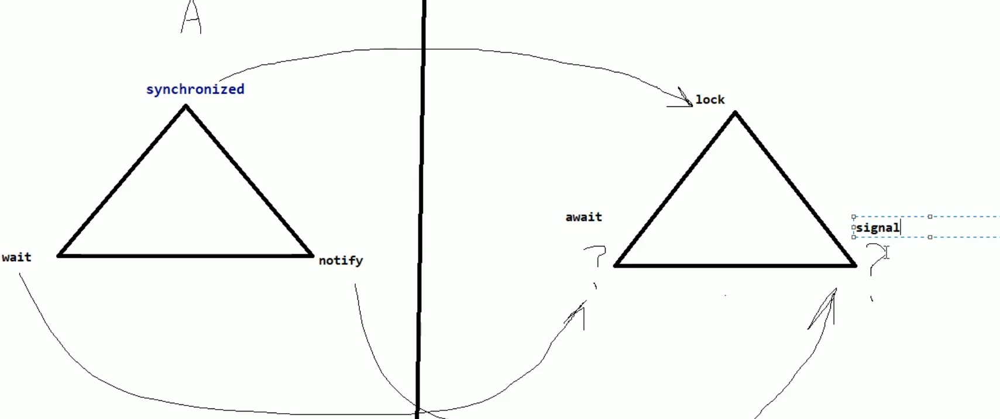
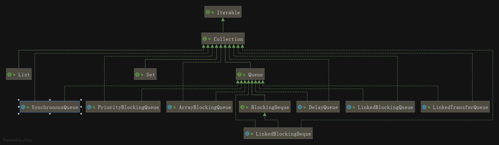
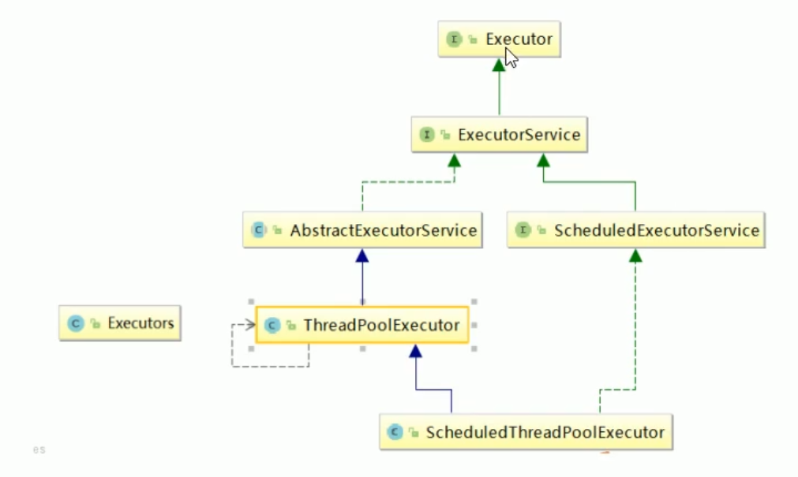
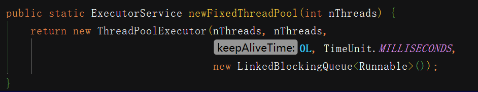
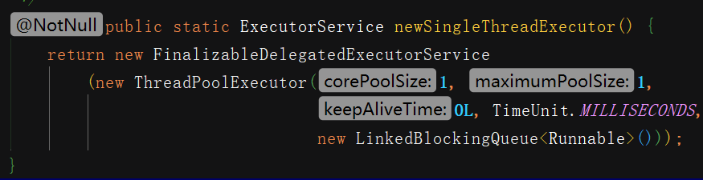
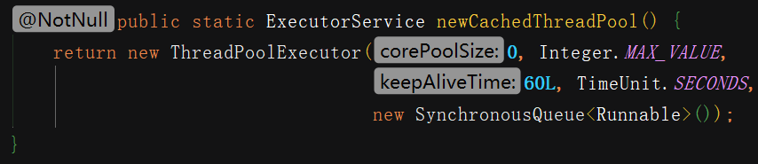
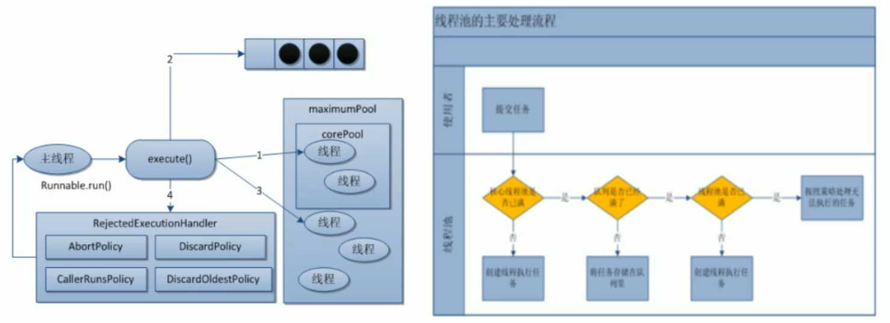
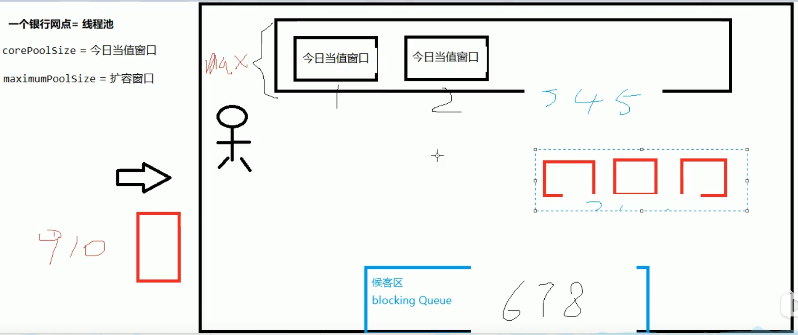
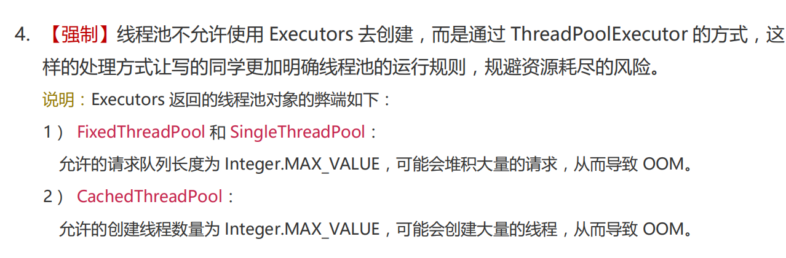
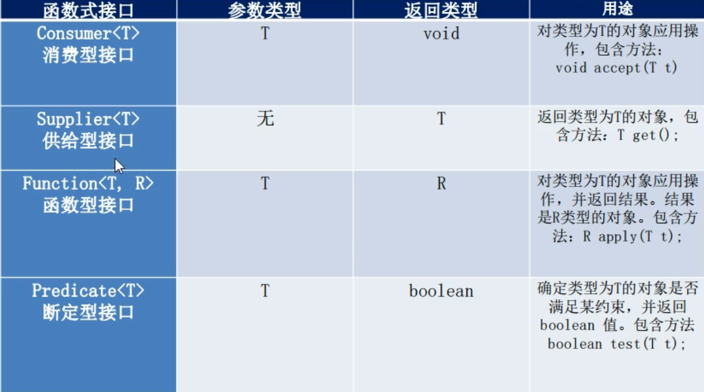

# 1.JUC是什么

- java.util.concurrent在并发编程中使用的工具类

## 进程/线程是什么？

- 进程：进程是一个具有一定独立功能的程序关于某个数据集合的一次运行活动。它是操作系统动态执行的基本单元，在传统的操作系统中，进程既是基本的分配单元，也是基本的执行单元。

- 线程：通常在一个进程中可以包含若干个线程，当然一个进程中至少有一个线程，不然没有存在的意义。线程可以利用进程所拥有的资源，在引入线程的操作系统中，通常都是把进程作为分配资源的基本单位，而把线程作为独立运行和独立调度的基本单位，由于线程比进程更小，基本上不拥有系统资源，故对它的调度所付出的开销就会小得多，能更高效的提高系统多个程序间并发执行的程度。

## 进程/线程例子？

使用QQ，查看进程一定有一个QQ.exe的进程，我可以用qq和A文字聊天，和B视频聊天，给C传文件，给D发一段语言，QQ支持录入信息的搜索。

大四的时候写论文，用word写论文，同时用QQ音乐放音乐，同时用QQ聊天，多个进程。

word如没有保存，停电关机，再通电后打开word可以恢复之前未保存的文档，word也会检查你的拼写，两个线程：容灾备份，语法检查

## 线程的状态

- NEW    新建
- RUNABLE   就绪
- BLOCKED  阻塞
- WAITING  
  - 一直等，
- TIMED_WAITING
  - 有时间，等，过时不候
- TERMINATED

## 什么是并发？什么是并行？

并发：同一时刻多个线程在访问同一个资源，多个线程对一个点
例子：小米9今天上午10点，限量抢购
春运抢票
电商秒杀...
并行：多项工作一起执行，之后再汇总
例子：泡方便面，电水壶烧水，一边撕调料倒入桶中

## wait/sleep的区别？

wait/sleep
功能都是当前线程暂停，有什么区别？
wait放开手去睡，放开手里的锁
sleep握紧手去睡，醒了手里还有锁

# 2.Lock接口

## 复习Synchronized

多线程模板：

线程  操作  资源类

高内聚  低耦合

步骤：

1.创建资源类

2.资源类里创建同步方法、同步代码块

```java
/**
 * 题目：三个售票员 卖出 30张票
 * 多线程编程的企业级套路+模板
 * 1.在高内聚低耦合的前提下，线程  操作(对外暴露的调用方法)  资源类
 */
class Ticket{//资源类
    private  int number = 30;
    public synchronized void saleTicket(){
        if (number>0){
            System.out.println(Thread.currentThread().getName()+"\t卖出第："+(number--)+"\t还剩下:"+number);
        }
    }
}

public class SaleTicket {
    public static void main(String[] args) {
        Ticket ticket = new Ticket();
        //Thread(Runnable target, String name)  传入Runnable的匿名内部类 线程名
        new Thread(new Runnable() {
            @Override
            public void run() {
                for (int i = 0; i < 40; i++) {
                    ticket.saleTicket();
                }
            }
        },"A").start();

        new Thread(new Runnable() {
            @Override
            public void run() {
                for (int i = 0; i < 40; i++) {
                    ticket.saleTicket();
                }
            }
        }, "B").start();

        new Thread(new Runnable() {
            @Override
            public void run() {
                for (int i = 0; i < 40; i++) {
                    ticket.saleTicket();
                }
            }
        }, "C").start();
    }
}
```

## Lock接口

### 是什么

Lock implementations provide more extensive locking operations than can be obtained using synchronized methods and statements. They allow more flexible structuring, may have quite different properties, and may support multiple associated Condition objects.

锁实现提供了比使用同步方法和语句可以获得的更广泛的锁操作。它们允许更灵活的结构，可能具有非常不同的属性，并且可能支持多个关联的条件对象。

### Lock接口的实现

**ReentrantLock可重入锁**

如何使用？

```java
class X {
private final ReentrantLock lock = new ReentrantLock();
// ...
public void m() {
lock.lock(); // block until condition holds
try {
// ... method body
} finally {
lock.unlock()...}
```


上述代码改写为lambda表达式,资源类中使用lock

```java
import java.util.concurrent.locks.Lock;
import java.util.concurrent.locks.ReentrantLock;

/**
 * 题目：三个售票员 卖出 30张票
 * 多线程编程的企业级套路+模板
 * 1.在高内聚低耦合的前提下，线程  操作(对外暴露的调用方法)  资源类
 */
class Ticket{//资源类
    private  int number = 30;
    private Lock lock = new ReentrantLock();

    public  void saleTicket(){
        lock.lock();
        try {
            if (number>0){
                System.out.println(Thread.currentThread().getName()+"\t卖出第："+(number--)+"\t还剩下:"+number);
            }
        } catch (Exception e) {
            e.printStackTrace();
        } finally {
            lock.unlock();
        }
    }
}

public class SaleTicket {
    public static void main(String[] args) {
        Ticket ticket = new Ticket();
        //Thread(Runnable target, String name)  传入Runnable的匿名内部类 线程名
        new Thread(() -> {for (int i = 0; i < 40; i++) ticket.saleTicket();},"A").start();
        new Thread(() -> {for (int i = 0; i < 40; i++) ticket.saleTicket();},"B").start();
        new Thread(() -> {for (int i = 0; i < 40; i++) ticket.saleTicket();},"C").start();
    }
}
```


## 创建线程的方式

### 继承Thread(不要这样写)

```java
public class SaleTicket extends Thread
java是单继承，资源宝贵，要用接口方式
```

### new Thread(不要这样写)

```java
Thread t1 = new Thread();
t1.start();
```

### Thread(Runnable target, String name) 推荐

## 实现runnable接口

### 新建类实现runnable接口

```java
class MyThread implements Runnable//新建类实现runnable接口
new Thread(new MyThread,...)
这种方法会新增类，有更新更好的方法
```

### 匿名内部类

```java
new Thread(new Runnable() {
    @Override
    public void run() {

    }
}, "your thread name").start();

这种方法不需要创建新的类，可以new接口
```

## lambda表达式(推荐)

```java
new Thread(() -> { }, "your thread name").start();这种方法代码更简洁精炼
```

# 3.lambda表达式复习

**要求**：接口只有一个方法（default，static修饰的除外）

lambda表达式，如果一个接口只有一个方法，我可以把方法名省略

```java
Foo foo = () -> {System.out.println("hello lambda");};
```

**写法口诀**

```
拷贝小括号（），写死右箭头->，落地大括号{...}
```


```java

@FunctionalInterface
interface Foo{
//    public void sayHello();
    public int add(int x,int y);

    default int div(int x,int y){
        System.out.println("hello 0022");
        return x/y;
    }
    default int div22(int x,int y){
        System.out.println("hello 0033");
        return x/y;
    }

    public static int mv(int x,int y){
        return x*y;
    }
}

/**
 * 2.lambda表达式
 * 2.1口诀：
 *     拷贝小括号，写死右箭头，落地大括号
 *
 * 2.2@FunctionalInterface
 *
 * 2.3default
 *
 * 2.4静态方法实现
 *
 */
public class LambdaExpressDemo {
    public static void main(String[] args) {
       /* Foo foo = new Foo() {
            @Override
            public void sayHello() {
                System.out.println("****hello");
            }
        };
        foo.sayHello();*/
       /*Foo foo = () -> {System.out.println("****hello");};
       foo.sayHello();*/
       Foo foo = ( x, y) -> {
           System.out.println("here");
           return x+y;
       };
        System.out.println(foo.add(3, 1));
        System.out.println(foo.div(10, 5));
        System.out.println(Foo.mv(3, 5));
    }
}

```

**接口里是否能有实现方法？**

- 可以有default方法,可以有好几个

  ```java
  接口里在java8后容许有接口的实现，default方法默认实现
  default int div(int x,int y) {
  	return x/y;
  }
  ```

  

- 静态方法实现,可以有好几个

  ```java
  public static int sub(int x,int y){
  	return x-y;
  }
  ```

  

# 4.线程间通信

面试题：两个线程打印

两个线程，一个线程打印1-52，另一个打印字母A-Z打印顺序为12A34B...5152Z,
要求用线程间通信

**线程间通信：1、生产者+消费者2、通知等待唤醒机制**

## synchronized实现

换成4个线程会导致错误，虚假唤醒

原因：在java多线程判断时，不能用if，程序出事出在了判断上面，
突然有一添加的线程进到if了，突然中断了交出控制权，
没有进行验证，而是直接走下去了，加了两次，甚至多次

解决：用while，不用if

中断和虚假唤醒是可能产生的，所以要用loop循环，if只判断一次，while是只要唤醒就要拉回来再判断一次。if换成while

口诀：

- 高内聚低耦合前提下，线程操作资源类

- 判断/干活/通知
- 多线程交互中，必须要防止多线程的虚假唤醒，也即（判断只用while，不能用if）

```java
package com.atguigu.juc;
class AirConditioner{//资源类
    private int number=0;
    public synchronized void increment() throws InterruptedException {
        while (number!=0){//1.判断
            this.wait();
        }
        number++;//2.干活
        System.out.println(Thread.currentThread().getName()+"\t"+number);
        //3.通知
        this.notifyAll();
    }

    public synchronized void decrement() throws InterruptedException {
        while (number == 0){//1.判断
            this.wait();
        }
        number--;//2.干活
        System.out.println(Thread.currentThread().getName()+"\t"+number);
        //3.通知
        this.notifyAll();
    }
}
/**
 * 题目：现在两个线程，可操作初始值为零的一个变量
 * 实现一个线程对该变量加1，一个线程对该变量减1，
 * 实现交替，来10轮，变量的初始值为零
 *
 * 1.高内聚低耦合前提下，线程操作资源类
 * 2.判断/干活/通知
 * 3.多线程交互中，必须要防止多线程的虚假唤醒，也即（判断只用while，不能用if）
 */
public class ThreadWaitNotifyDemo {
    public static void main(String[] args) {
        AirConditioner airConditioner = new AirConditioner();
        new Thread(() ->{
            for (int i = 1; i <= 10; i++) {
                try {
                    airConditioner.increment();
                } catch (InterruptedException e) {
                    e.printStackTrace();
                }
            }
        },"A").start();

        new Thread(() ->{
            for (int i = 1; i <= 10; i++) {
                try {
                    airConditioner.decrement();
                } catch (InterruptedException e) {
                    e.printStackTrace();
                }
            }
        },"B").start();
        new Thread(() ->{
            for (int i = 1; i <= 10; i++) {
                try {
                    airConditioner.increment();
                } catch (InterruptedException e) {
                    e.printStackTrace();
                }
            }
        },"C").start();

        new Thread(() ->{
            for (int i = 1; i <= 10; i++) {
                try {
                    airConditioner.decrement();
                } catch (InterruptedException e) {
                    e.printStackTrace();
                }
            }
        },"D").start();
    }
}

```

```

```



## 用Lock接口实现

```java
import java.util.concurrent.locks.Condition;
import java.util.concurrent.locks.Lock;
import java.util.concurrent.locks.ReentrantLock;

class AirConditioner{//资源类
    private int number=0;
    private Lock lock = new ReentrantLock();
    private Condition condition = lock.newCondition();
    public void increment() throws InterruptedException {
        lock.lock();
        try {
            while (number!=0){//1.判断
                condition.await(); //this.wait();
            }
            number++;//2.干活
            System.out.println(Thread.currentThread().getName()+"\t"+number);
            //3.通知
            condition.signalAll();//this.notifyAll();
        } catch (Exception e) {
            e.printStackTrace();
        } finally {
            lock.unlock();
        }
    }

    public void decrement() throws InterruptedException {
        lock.lock();
        try {
            while (number ==0){//1.判断
                condition.await(); //this.wait();
            }
            number--;//2.干活
            System.out.println(Thread.currentThread().getName()+"\t"+number);
            //3.通知
            condition.signalAll();//this.notifyAll();
        } catch (Exception e) {
            e.printStackTrace();
        } finally {
            lock.unlock();
        }
    }
}
/**
 * 题目：现在两个线程，可操作初始值为零的一个变量
 * 实现一个线程对该变量加1，一个线程对该变量减1，
 * 实现交替，来10轮，变量的初始值为零
 *
 * 1.高内聚低耦合前提下，线程操作资源类
 * 2.判断/干活/通知
 * 3.多线程交互中，必须要防止多线程的虚假唤醒，也即（判断只用while，不能用if）
 */
public class ThreadWaitNotifyDemo {
    public static void main(String[] args) {
        AirConditioner airConditioner = new AirConditioner();
        new Thread(() ->{
            for (int i = 1; i <= 10; i++) {
                try {
                    airConditioner.increment();
                } catch (InterruptedException e) {
                    e.printStackTrace();
                }
            }
        },"A").start();

        new Thread(() ->{
            for (int i = 1; i <= 10; i++) {
                try {
                    airConditioner.decrement();
                } catch (InterruptedException e) {
                    e.printStackTrace();
                }
            }
        },"B").start();
        new Thread(() ->{
            for (int i = 1; i <= 10; i++) {
                try {
                    airConditioner.increment();
                } catch (InterruptedException e) {
                    e.printStackTrace();
                }
            }
        },"C").start();

        new Thread(() ->{
            for (int i = 1; i <= 10; i++) {
                try {
                    airConditioner.decrement();
                } catch (InterruptedException e) {
                    e.printStackTrace();
                }
            }
        },"D").start();
    }
}
```

# 5.精确通知顺序访问

1、有顺序通知，需要有标识位

2、有一个锁Lock，3把钥匙Condition 

3、判断标志位

4、输出线程名+第几次+第几轮

5、修改标志位，通知下一个

```java
package com.atguigu.juc;

import java.util.concurrent.locks.Condition;
import java.util.concurrent.locks.Lock;
import java.util.concurrent.locks.ReentrantLock;

class ShareResource{
    private int number = 1;//1:A 2:B 3:C
    private Lock lock = new ReentrantLock();
    private Condition condition1 = lock.newCondition();
    private Condition condition2 = lock.newCondition();
    private Condition condition3 = lock.newCondition();

    public void print5(){
        lock.lock();
        try {
            while (number!=1){//1.判断
                condition1.await();
            }
            //2.干活
            for (int i = 1; i <=5 ; i++) {
                System.out.println(Thread.currentThread().getName()+"\t"+i);
            }
            //3.通知
            number=2;
            condition2.signal();
        } catch (Exception e) {
            e.printStackTrace();
        } finally {
            lock.unlock();
        }
    }

    public void print10(){
        lock.lock();
        try {
            while (number!=2){//1.判断
                condition1.await();
            }
            //2.干活
            for (int i = 1; i <=10 ; i++) {
                System.out.println(Thread.currentThread().getName()+"\t"+i);
            }
            //3.通知
            number=3;
            condition3.signal();
        } catch (Exception e) {
            e.printStackTrace();
        } finally {
            lock.unlock();
        }
    }

    public void print15(){
        lock.lock();
        try {
            while (number!=3){//1.判断
                condition1.await();
            }
            //2.干活
            for (int i = 1; i <=15 ; i++) {
                System.out.println(Thread.currentThread().getName()+"\t"+i);
            }
            //3.通知
            number=1;
            condition1.signal();
        } catch (Exception e) {
            e.printStackTrace();
        } finally {
            lock.unlock();
        }
    }
}
/**
 * 多线程之间按顺序调用，实现A->B->C
 * 三个线程启动，要求如下：
 *
 * AA打印5次，BB打印10次，CC打印15次
 * 接着，
 * AA打印5次，BB打印10次，CC打印15次
 * ...来10轮
 *
 *  1.高内聚低耦合前提下，线程操作资源类
 *  2.判断/干活/通知
 *  3.多线程交互中，必须要防止多线程的虚假唤醒，也即（判断只用while，不能用if）
 *  4.标志位
 */
public class ThreadOrderAccess {
    public static void main(String[] args) {
        ShareResource shareResource = new ShareResource();
        new Thread(() ->{
            for (int i = 1; i <= 10; i++) {
                shareResource.print5();
            }
        },"A").start();

        new Thread(() ->{
            for (int i = 1; i <= 10; i++) {
                shareResource.print10();
            }
        },"B").start();

        new Thread(() ->{
            for (int i = 1; i <= 10; i++) {
                shareResource.print15();
            }
        },"C").start();
    }
}
```

# 6.多线程锁

线程8锁

```java
package com.atguigu.juc;

import java.util.concurrent.TimeUnit;

class Phone{
    public static synchronized void sendEmail() throws Exception{
        //暂停一会线程  TimeUnit 可以睡多少纳秒，微秒，毫秒，秒， 分， 小时
        TimeUnit.SECONDS.sleep(4);
        System.out.println("------sendEmail");
    }
    public  synchronized void sendSMS() throws Exception{
        System.out.println("------sendSMS");
    }
    public void hello(){
        System.out.println("hello");
    }
}

/**
 * 多线程8锁
 * 1.标准访问，先打印邮件还是短信？  A先进来了，邮件
 * 2.邮件方法暂停4秒钟，先打印邮件还是短信？
 * 3.新增一个普通方法hello，先打印邮件还是hello？
 * 4.两部手机，先打印邮件还是短信？
 * 5.两个静态同步方法，同一部手机，先打印邮件还是短信？
 * 6.两个静态同步方法，两部手机，先打印邮件还是短信？
 * 7.一个普通同步方法，一个静态同步方法，一部手机，先打印邮件还是短信？
 * 8.一个普通同步方法，一个静态同步方法，两部手机，先打印邮件还是短信？
 *
 * 笔记
 * 一个对象里面如果有多个synchronized方法，某一个时刻内，只要一个线程去调用其中一个synchronized的方法了，
 * 其他线程就只能等待，换句话说，某一个时刻内，只能由唯一一个线程去访问这些synchronized方法
 * 锁的是当前对象的this,被锁定后，其他线程都不能进入到当前对象的其他的synchronized方法
 *
 * 加个普通方法后发现和同步锁无关，
 * 换成两个对象后，不是同一把锁了，情况立即发生变化
 *
 * 都换成静态同步方法后，情况又变化，
 * new this，具体的一部部手机
 * 静态 class,唯一的一个模板
 *
 * 所有的非静态同步方法用的都是同一把锁一实例对象本身
 * synchronized 实现同步的基础:Java中的每一个对象都可以作为锁。
 * 具体表现为以下3种形式
 * 对于普通同步方法,锁是当前实例对象。
 * 对于静态同步方法,锁是当前类的Class对象。
 * 对同步方法块,锁是 synchronized 括号里配置的对象。
 *
 * 一个线程试图访问同步代码块时,它首先必须得到锁,退出或抛出异常时必须释放锁。
 * 也就是说如果一个实例对象的普通同步方法获收锁后,该实例对象的其他普通问同步方法必须等待获取锁的方法释放锁后才能获取锁,
 *
 * 可是别的实例对象的普通同步方法因为跟该实例对象的普通同步方法用的是不同的锁
 * 所以无须等待该实例对象已获取锁的普通同步方法释放锁就可以获取他们自己的锁。
 *
 * 所有的静态同步方法用的也是同一把锁一类对象本身,
 * 这两把锁（this/Class）是两个不同的对象,所以静态同步方法与并静态同步方法之问是不会有竞态条件的
 * 但是一且一个静态同步方法获取锁后,其他的静态同步方法都必须等待该方法释放锁后才能获取锁
 * 而不管是同一个实例对象的静态同步方法之间,
 * 还是不同的实例对象的静态同步方法之问,只要它们同一个类的实例对象!
 *
 *
 */
public class Lock8 {
    public static void main(String[] args) throws InterruptedException {
        Phone phone = new Phone();
        Phone phone2 = new Phone();

        new Thread(() ->{
            try {
                phone.sendEmail();
            } catch (Exception e) {
                e.printStackTrace();
            }
        },"A").start();
        Thread.sleep(100);

        new Thread(() ->{
            try {
                phone.sendSMS();
//                phone.hello();
//                phone2.sendSMS();
            } catch (Exception e) {
                e.printStackTrace();
            }
        },"B").start();
    }
}
```


# 7.线程不安全

java.util.ConcurrentModificationException

## list不安全

```java

import java.util.ArrayList;
import java.util.Collections;
import java.util.List;
import java.util.UUID;
import java.util.concurrent.CopyOnWriteArrayList;

/**
 * 举例说明集合类是线程不安全的
 *
 * 故障：java.util.ConcurrentModificationException并发修改异常
 *
 * 导致原因
 *
 * 解决方案
 *     1. Vector
 *     2. Collections.synchronizedList(new ArrayList<>());
 *     3. CopyOnWriteArrayList
 *
 * 优化建议
 */
public class NotSafeDemo {
    public static void main(String[] args) {
//        List<String > list = new Vector();//Vector
//        List<String> list = Collections.synchronizedList(new ArrayList<>());
        List<String> list = new CopyOnWriteArrayList<>();
        for (int i = 1; i <=30 ; i++) {
            new Thread(() ->{
                list.add(UUID.randomUUID().toString().substring(0,8));
                System.out.println(list);//[,,]
            },String.valueOf(i)).start();
        }
    }
}
/**
 * 写时复制
 * CopyOnWrite 容器即写时复制的容器。往一个容器添加元素的时候，不直接往当前容器Object[]添加，而是
 * 先将当前容器Object[]进行copy,复制出一个新的容器Object[] newElements，然后新的容器Object[] newElements
 * 里添加元素，添加完元素后，再将原容器的引用指向新的容器 setArray(newElements)；这样做的好处是可以对
 * CopyOnWrite容器进行并发的读，而不需要加锁，因为当前容器不会添加如何元素，所以CopyOnWrite容器也
 * 是一种读写分离的思想，读和写不同的容器
 * public boolean add(E e) {
 *         final ReentrantLock lock = this.lock;
 *         lock.lock();
 *         try {
 *             Object[] elements = getArray();
 *             int len = elements.length;
 *             Object[] newElements = Arrays.copyOf(elements, len + 1);
 *             newElements[len] = e;
 *             setArray(newElements);
 *             return true;
 *         } finally {
 *             lock.unlock();
 *         }
 *     }
* */
```

## set不安全

java.util.ConcurrentModificationException

```java
public static void main(String[] args) {
    //Set<String> set = new HashSet<>();
    Set<String> set =  Collections.synchronizedSet(new HashSet<>());
    
    for (int i = 1; i <=30 ; i++) {
        new Thread(() ->{
            set.add(UUID.randomUUID().toString().substring(0,8));
            System.out.println(set);
        },String.valueOf(i)).start();
    }
}
```

## map不安全

```java
    public static void main(String[] args) {
//        Map<String,String > map = new HashMap<>();
//        Map<String,String > map = Collections.synchronizedMap(new HashMap<>());
        Map<String,String > map = new ConcurrentHashMap();
        for (int i = 1; i <=30 ; i++) {
            new Thread(() ->{
                map.put(Thread.currentThread().getName(),UUID.randomUUID().toString().substring(0,8));
                System.out.println(map);
            },String.valueOf(i)).start();
        }
    }
```

# 8.Callable接口

##  获得多线程的几种方式

（1）继承thread类（2）runnable接口 (3)Callable接口

## Callable接口与Runnable接口的区别？

*     1.是否有返回值
*     2.是否抛异常
*     3.落地方法不一样，一个是run,一个是call

```java
class MyThread2 implements Runnable{

    @Override
    public void run() {


    }
}

class MyThread implements Callable<Integer>{
    @Override
    public Integer call() throws Exception {
        System.out.println("---come in here");
        TimeUnit.SECONDS.sleep(4);
        return 1024;
    }
}
```

## 怎么用

直接替换runnable是否可行？

不可行，因为：thread类的构造方法根本没有Callable

认识不同的人找中间人

这像认识一个不认识的同学，我可以找中间人介绍。
中间人是什么？java多态，一个类可以实现多个接口！！

FutureTask< ft = new FutureTask<(new MyThread());
new Thread(ft, "AA").start();


运行成功后如何获得返回值？

## FutureTask

### 是什么

未来的任务，用它就干一件事，异步调用
main方法就像一个冰糖葫芦，一个个方法由main串起来。
但解决不了一个问题：正常调用挂起堵塞问题

例子：
（1）老师上着课，口渴了，去买水不合适，讲课线程继续，我可以单起个线程找班长帮忙买水，
水买回来了放桌上，我需要的时候再去get。
（2）4个同学，A算1+20,B算21+30,C算31*到40,D算41+50，是不是C的计算量有点大啊

### 原理

在主线程中需要执行比较耗时的操作时，但又不想阻塞主线程时，可以把这些作业交给Future对象在后台完成，
当主线程将来需要时，就可以通过Future对象获得后台作业的计算结果或者执行状态。

一般FutureTask多用于耗时的计算，主线程可以在完成自己的任务后，再去获取结果。

仅在计算完成时才能检索结果；如果计算尚未完成，则阻塞 get 方法。一旦计算完成，
就不能再重新开始或取消计算。get方法而获取结果只有在计算完成时获取，否则会一直阻塞直到任务转入完成状态，
然后会返回结果或者抛出异常。

只计算一次...

```java
class MyThread implements Callable<Integer>{
    @Override
    public Integer call() throws Exception {
        System.out.println("---come in here");
        TimeUnit.SECONDS.sleep(4);
        return 1024;
    }
}
public class CallableDemo {
    public static void main(String[] args) throws ExecutionException, InterruptedException {
        FutureTask futureTask = new FutureTask(new MyThread());
        new Thread(futureTask, "A").start();
        new Thread(futureTask, "B").start();
        System.out.println(Thread.currentThread().getName()+"***计算完成");
        System.out.println(futureTask.get());

    }
}
```

# 9.JUC强大的辅助类

## CountDownLatch减少计数

```java
public static void closeDoor() {
    for (int i = 1; i <=6 ; i++) {
        new Thread(() ->{
            System.out.println(Thread.currentThread().getName()+"\t离开教室");
        },String.valueOf(i)).start();
    }
    System.out.println(Thread.currentThread().getName()+"\t班长关门走人");
}
```

```
1	离开教室
6	离开教室
5	离开教室
2	离开教室
4	离开教室
main	班长关门走人
3	离开教室
```

加入CountDownLatch

```java
public static void main(String[] args) throws InterruptedException {
    CountDownLatch countDownLatch = new CountDownLatch(6);
    for (int i = 1; i <=6 ; i++) {
        new Thread(() ->{
            System.out.println(Thread.currentThread().getName()+"\t离开教室");
            countDownLatch.countDown();
        },String.valueOf(i)).start();
    }
    countDownLatch.await();
    System.out.println(Thread.currentThread().getName()+"\t班长关门走人");
}
```

```
2	离开教室
5	离开教室
4	离开教室
3	离开教室
1	离开教室
6	离开教室
main	班长关门走人
```

**原理**

CountDownLatch主要有两个方法，当一个或多个线程调用await方法时，这些线程会阻塞。
\* 其它线程调用countDown方法会将计数器减1(调用countDown方法的线程不会阻塞)，
\* 当计数器的值变为0时，因await方法阻塞的线程会被唤醒，继续执行。

## CyclicBarrier循环栅栏

CyclicBarrier

### 原理

\* 的字面意思是可循环（Cyclic）使用的屏障（Barrier）。它要做的事情是，
\* 让一组线程到达一个屏障（也可以叫同步点）时被阻塞，
\* 直到最后一个线程到达屏障时，屏障才会开门，所有
\* 被屏障拦截的线程才会继续干活。
\* 线程进入屏障通过CyclicBarrier的await()方法。

```java
package com.atguigu.juc;

import java.util.concurrent.BrokenBarrierException;
import java.util.concurrent.CyclicBarrier;

public class CyclicBarrierDemo {
    public static void main(String[] args) {
        //public CyclicBarrier(int parties, Runnable barrierAction)
        CyclicBarrier cyclicBarrier = new CyclicBarrier(7,()->{
            System.out.println("***召唤神龙");
        });
        for (int i = 1; i <= 7; i++) {
            final int temp=i;
            new Thread(() ->{
                System.out.println(Thread.currentThread().getName()+"\t收集到第："+temp+"颗龙珠");
                try {
                    cyclicBarrier.await();
                } catch (InterruptedException e) {
                    e.printStackTrace();
                } catch (BrokenBarrierException e) {
                    e.printStackTrace();
                }
            },String.valueOf(i)).start();
        }
    }
}

```

## Semaphore信号灯

### 原理

在信号量上我们定义两种操作：
\* acquire（获取） 当一个线程调用acquire操作时，它要么通过成功获取信号量（信号量减1），
\* 要么一直等下去，直到有线程释放信号量，或超时。
\* release（释放）实际上会将信号量的值加1，然后唤醒等待的线程。
*
\* 信号量主要用于两个目的，一个是用于多个共享资源的互斥使用，另一个用于并发线程数的控制。

```java
public static void main(String[] args) {
    Semaphore semaphore = new Semaphore(3);//模拟资源类，有3个空车位
    //Semaphore semaphore = new Semaphore(1);//换成1,相当于synchronized
    for (int i = 1; i <=6 ; i++) {
        new Thread(() ->{
            try {
                semaphore.acquire();
                System.out.println(Thread.currentThread().getName()+"\t抢到了车位");
                //暂停一会线程
                TimeUnit.SECONDS.sleep(3);
                System.out.println(Thread.currentThread().getName()+"\t离开了车位");
            } catch (InterruptedException e) {
                e.printStackTrace();
            }finally {
                semaphore.release();
            }
        },String.valueOf(i)).start();
    }
}
```

```
1	离开了车位
3	离开了车位
2	离开了车位
4	抢到了车位
6	抢到了车位
5	抢到了车位
6	离开了车位
5	离开了车位
4	离开了车位
```

# 10.ReentrantReadWriteLock读写锁

读读可共享，读写，写写要独占

```java
package com.atguigu.juc;

import java.util.HashMap;
import java.util.Map;
import java.util.concurrent.TimeUnit;

class MyCache{
    private volatile Map<String ,Object> map = new HashMap<>();
    public void put(String key,Object value){
        System.out.println(Thread.currentThread().getName()+"\t--写入数据"+key);
        //暂停一会线程
        try {TimeUnit.MICROSECONDS.sleep(300);} catch (InterruptedException e) {e.printStackTrace();}
        map.put(key,value);
        System.out.println(Thread.currentThread().getName()+"\t--写入完成");
    }
    public void get(String key){
        System.out.println(Thread.currentThread().getName()+"\t读取数据");
        //暂停一会线程
        try {TimeUnit.MICROSECONDS.sleep(300);} catch (InterruptedException e) {e.printStackTrace();}
        Object result = map.get(key);
        System.out.println(Thread.currentThread().getName()+"\t读取完成"+result);
    }
}
/**
 * 多个线程同时读一个资源没有任何问题，所以为了满足并发量，读取共享资源应该可以同时进行
 * 但是
 * 如果有一个线程想去写共享资源来，就不应该再有其它线程可以对改资源进行读或写
 * 小结：
 *     读-读能共享
 *     读-写不能共享
 *     写-写不能共享
 */
public class ReadWriteLockDemo {
    public static void main(String[] args) {
        MyCache myCache = new MyCache();
        for (int i = 1; i <=5 ; i++) {
            final int temp = i;
            new Thread(() ->{
                myCache.put(temp+"",temp+"");
            },String.valueOf(i)).start();
        }

        for (int i = 1; i <=5 ; i++) {
            final int temp = i;
            new Thread(() ->{
                myCache.get(temp+"");
            },String.valueOf(i)).start();
        }
    }
}

```
结果如下：写入还没完成就开始读取了

```
1	--写入数据1
4	--写入数据4
5	--写入数据5
2	--写入数据2
3	--写入数据3
1	读取数据
2	读取数据
4	读取数据
3	读取数据
5	读取数据
4	--写入完成
2	--写入完成
2	读取完成null
5	--写入完成
1	--写入完成
3	读取完成3
4	读取完成null
5	读取完成null
3	--写入完成
1	读取完成null
```

读写锁

```java
package com.atguigu.juc;

import java.util.HashMap;
import java.util.Map;
import java.util.concurrent.TimeUnit;
import java.util.concurrent.locks.ReadWriteLock;
import java.util.concurrent.locks.ReentrantReadWriteLock;

class MyCache{
    private volatile Map<String ,Object> map = new HashMap<>();
    private ReadWriteLock readWriteLock = new ReentrantReadWriteLock();
    public void put(String key,Object value){
        readWriteLock.writeLock().lock();
        try {
            System.out.println(Thread.currentThread().getName()+"\t--写入数据"+key);
            //暂停一会线程
            try {TimeUnit.MICROSECONDS.sleep(300);} catch (InterruptedException e) {e.printStackTrace();}
            map.put(key,value);
            System.out.println(Thread.currentThread().getName()+"\t--写入完成");
        } catch (Exception e) {
            e.printStackTrace();
        } finally {
            readWriteLock.writeLock().unlock();
        }

    }
    public void get(String key){
        readWriteLock.readLock().lock();
        try {
            System.out.println(Thread.currentThread().getName()+"\t读取数据");
            //暂停一会线程
            try {TimeUnit.MICROSECONDS.sleep(300);} catch (InterruptedException e) {e.printStackTrace();}
            Object result = map.get(key);
            System.out.println(Thread.currentThread().getName()+"\t读取完成"+result);
        } catch (Exception e) {
            e.printStackTrace();
        } finally {
            readWriteLock.readLock().unlock();
        }

    }
}
/**
 * 多个线程同时读一个资源没有任何问题，所以为了满足并发量，读取共享资源应该可以同时进行
 * 但是
 * 如果有一个线程想去写共享资源来，就不应该再有其它线程可以对改资源进行读或写
 * 小结：
 *     读-读能共享
 *     读-写不能共享
 *     写-写不能共享
 */
public class ReadWriteLockDemo {
    public static void main(String[] args) {
        MyCache myCache = new MyCache();
        for (int i = 1; i <=5 ; i++) {
            final int temp = i;
            new Thread(() ->{
                myCache.put(temp+"",temp+"");
            },String.valueOf(i)).start();
        }

        for (int i = 1; i <=5 ; i++) {
            final int temp = i;
            new Thread(() ->{
                myCache.get(temp+"");
            },String.valueOf(i)).start();
        }
    }
}
```

# 11.BlockingQueue阻塞队列

队列：先进先出

## 阻塞队列

阻塞：**必须要阻塞/不得不阻塞**
阻塞队列是一个队列，在数据结构中起的作用如下图：

线程1往阻塞队列里添加元素，线程2从阻塞队列里移除元素

当队列是空的，从队列中**获取**元素的操作将会被阻塞
当队列是满的，从队列中**添加**元素的操作将会被阻塞

视图从空的队列中获取元素的线程将会被阻塞，直到其他线程往空的队列插入新的元素

视图向已满的队列中添加新元素的线程将会被阻塞，直到其他线程从队列中移除一个或多个元素或者完全清空，使队列变得空闲起来后并后续新增

## 阻塞队列的用处

在多线程领域：所谓阻塞，在某些情况下会挂起线程（即阻塞），一旦条件满足，被挂起的线程又会自动被唤起

为什么需要BlockingQueue
好处是我们不需要关心什么时候需要阻塞线程，什么时候需要唤醒线程，因为这一切BlockingQueue都给你一手包办了

在concurrent包发布以前，在多线程环境下，我们每个程序员都必须去自己控制这些细节，尤其还要兼顾效率和线程安全，而这会给我们的程序带来不小的复杂度。



## 阻塞队列种类

**BlockingQueue接口**

- **ArrayBlockingQueue：由数组结构组成的有界阻塞队列。**
- **LinkedBlockingQueue：由链表结构组成的有界（但大小默认值为integer.MAX_VALUE）阻塞队列。**
- PriorityBlockingQueue：支持优先级排序的无界阻塞队列。
- DelayQueue：使用优先级队列实现的延迟无界阻塞队列。
- **SynchronousQueue：不存储元素的阻塞队列，也即单个元素的队列。**
- LinkedTransferQueue：由链表组成的无界阻塞队列。
- LinkedBlocking**Deque**：由链表组成的双向阻塞队列。

BlockingQueue核心方法

| 方法类型 | 抛出异常  |  特殊值  |  阻塞  |        超时        |
| :------: | :-------: | :------: | :----: | :----------------: |
|   插入   |  add(e)   | offer(e) | put(e) | offer(e,time,unit) |
|   移除   | remove(e) | poll(e)  | take() |  poll(time,unit)   |
|   检查   | element() |  peek()  | 不可用 |       不可用       |


- 抛出异常 
  - 当阻塞队列满时，再往队列里add插入元素会抛IllegalStateException:Queue full
  - 当阻塞队列空时，再往队列里remove移除元素会抛NoSuchElementException
- 特殊值 
  - 插入方法，成功ture失败false
  - 移除方法，成功返回出队列的元素，队列里没有就返回null
- 一直阻塞 
  - 当阻塞队列满时，生产者线程继续往队列里put元素，队列会一直阻塞生产者线程直到put数据or响应中断退出
  - 当阻塞队列空时，消费者线程试图从队列里take元素，队列会一直阻塞消费者线程直到队列可用
- 超时退出 
  - 当阻塞队列满时，队列会阻塞生产者线程一定时间，超过限时后生产者线程会退出

```java
package com.atguigu.juc;

import java.sql.SQLOutput;
import java.util.Collection;
import java.util.concurrent.ArrayBlockingQueue;
import java.util.concurrent.BlockingQueue;
import java.util.concurrent.TimeUnit;

public class BlockingQueueDemo {
    public static void main(String[] args) throws InterruptedException {
        BlockingQueue<String > blockingQueue = new ArrayBlockingQueue<>(3);
        /*System.out.println(blockingQueue.add("a"));
        System.out.println(blockingQueue.add("b"));
        System.out.println(blockingQueue.add("c"));
//        System.out.println(blockingQueue.add("x"));
        System.out.println(blockingQueue.remove());
        System.out.println(blockingQueue.remove());
        System.out.println(blockingQueue.remove());
        System.out.println(blockingQueue.remove());*/

        /*System.out.println(blockingQueue.add("a"));
        System.out.println(blockingQueue.add("b"));
        System.out.println(blockingQueue.element());*/

        /*        System.out.println(blockingQueue.offer("a"));//true
        System.out.println(blockingQueue.offer("b"));//true
        System.out.println(blockingQueue.offer("c"));//true
//        System.out.println(blockingQueue.offer("x"));//false
        System.out.println(blockingQueue.poll());//a
        System.out.println(blockingQueue.poll());//b
        System.out.println(blockingQueue.poll());//c
        System.out.println(blockingQueue.poll());//null*/

        /*blockingQueue.put("a");
        blockingQueue.put("a");
        blockingQueue.put("a");
//        blockingQueue.put("a");

        System.out.println(blockingQueue.take());
        System.out.println(blockingQueue.take());
        System.out.println(blockingQueue.take());
        System.out.println(blockingQueue.take());*/

        System.out.println(blockingQueue.offer("b"));
        System.out.println(blockingQueue.offer("b"));
        System.out.println(blockingQueue.offer("b"));
        System.out.println(blockingQueue.offer("a", 3L, TimeUnit.SECONDS));
    }
}

```

# 12.ThreadPool线程池

## 为什么要用线程池

例子：
10年前单核CPU电脑，假的多线程，像马戏团小丑玩多个球，CPU需要来回切换。
现在是多核电脑，多个线程各自跑在独立的CPU上，不用切换效率高。

线程池的优势：
线程池做的工作只要是控制运行的线程数量，处理过程中将任务放入队列，然后在线程创建后启动这些任务，如果线程数量超过了最大数量，超出数量的线程排队等候，等其他线程执行完毕，再从队列中取出任务来执行。

它的主要特点为：**线程复用;控制最大并发数;管理线程**。

第一：降低资源消耗。 通过重复利用已创建的线程降低线程创建和销毁造成的消耗。

第二：提高响应速度。当任务到达时，任务可以不需要等待线程池创建就能立即执行。

第三：提高线程的可管理性。线程是稀缺资源，如果无限制的创建，不仅会消耗系统资源，还会降低系统的稳定性，使用线程池可以进一步统一的分配，调优和监控。

## 线程池如何使用

### 架构说明

Java中的线程池是通过Executor框架实现的，该框架中用到了Executor，Executors，ExecutorService，ThreadPoolExecutor这几个类



### Executors.newFixedThreadPool(int)

执行长期任务性能好，创建一个线程池，一池有N个固定的线程，有固定线程数的线程

```java
import java.util.concurrent.ExecutorService;
import java.util.concurrent.Executors;

public class MyThreadPoolDemo {
    public static void main(String[] args) {
        ExecutorService threadPool = Executors.newFixedThreadPool(5);//一池5个受理线程，类似一个银行5个受理窗口
        try {
            //模拟有10个顾客来银行办理业务,目前池子里有5个工作人员提供服务
            for (int i = 1; i <=10 ; i++) {
                threadPool.execute(()->{
                    System.out.println(Thread.currentThread().getName()+"\t办理业务");
                });
            }
        }catch (Exception e){
            e.printStackTrace();
        }finally {
            threadPool.shutdown();
        }
    }
}
```

结果：

```
pool-1-thread-1	办理业务
pool-1-thread-5	办理业务
pool-1-thread-4	办理业务
pool-1-thread-3	办理业务
pool-1-thread-2	办理业务
pool-1-thread-3	办理业务
pool-1-thread-2	办理业务
pool-1-thread-5	办理业务
pool-1-thread-4	办理业务
pool-1-thread-1	办理业务
```

### Executors.newSingleThreadExecutor()

一个任务一个任务的执行，一池一线程

```java
public static void main(String[] args) {
        ExecutorService threadPool = Executors.newSingleThreadExecutor();//一池1个工作线程，类似一个银行1个受理窗口
        try {
            //模拟有10个顾客来银行办理业务,目前池子里有1个工作人员提供服务
            for (int i = 1; i <=10 ; i++) {
                threadPool.execute(()->{
                    System.out.println(Thread.currentThread().getName()+"\t办理业务");
                });
            }
        }catch (Exception e){
            e.printStackTrace();
        }finally {
            threadPool.shutdown();
        }
    }
```

结果：

```
pool-1-thread-1	办理业务
pool-1-thread-1	办理业务
pool-1-thread-1	办理业务
pool-1-thread-1	办理业务
pool-1-thread-1	办理业务
pool-1-thread-1	办理业务
pool-1-thread-1	办理业务
pool-1-thread-1	办理业务
pool-1-thread-1	办理业务
pool-1-thread-1	办理业务
```

### Executors.newCachedThreadPool()

执行很多短期异步任务，线程池根据需要创建新线程，
但在先前构建的线程可用时将重用它们。可扩容，遇强则强

```java
public static void main(String[] args) {
        ExecutorService threadPool = Executors.newCachedThreadPool();//一池N个工作线程，类似一个银行N个受理窗口
        try {
            //模拟有10个顾客来银行办理业务,目前池子里有1个工作人员提供服务
            for (int i = 1; i <=10 ; i++) {
                threadPool.execute(()->{
                    System.out.println(Thread.currentThread().getName()+"\t办理业务");
                });
            }
        }catch (Exception e){
            e.printStackTrace();
        }finally {
            threadPool.shutdown();
        }
    }
```

结果：

```
pool-1-thread-1	办理业务
pool-1-thread-4	办理业务
pool-1-thread-5	办理业务
pool-1-thread-3	办理业务
pool-1-thread-2	办理业务
pool-1-thread-6	办理业务
pool-1-thread-4	办理业务
pool-1-thread-7	办理业务
pool-1-thread-8	办理业务
pool-1-thread-5	办理业务
```

## ThreadPoolExecutor底层原理

newFixedThreadPool:固定



newSingleThreadExecutor:1个



newCachedThreadPool:可扩容



### 线程池的七大参数

源码：

```java
public ThreadPoolExecutor(int corePoolSize,
                              int maximumPoolSize,
                              long keepAliveTime,
                              TimeUnit unit,
                              BlockingQueue<Runnable> workQueue,
                              ThreadFactory threadFactory,
                              RejectedExecutionHandler handler) {
        if (corePoolSize < 0 ||
            maximumPoolSize <= 0 ||
            maximumPoolSize < corePoolSize ||
            keepAliveTime < 0)
            throw new IllegalArgumentException();
        if (workQueue == null || threadFactory == null || handler == null)
            throw new NullPointerException();
        this.acc = System.getSecurityManager() == null ?
                null :
                AccessController.getContext();
        this.corePoolSize = corePoolSize;
        this.maximumPoolSize = maximumPoolSize;
        this.workQueue = workQueue;
        this.keepAliveTime = unit.toNanos(keepAliveTime);
        this.threadFactory = threadFactory;
        this.handler = handler;
    }
```

1. corePoolSize：线程池中的**常驻核心线程数**(核心数)

2. maximumPoolSize：线程池中能够容纳同时执行的**最大线程数**，此值必须大于等于1

3. keepAliveTime：**多余的空闲线程的存活时间**。当前池中线程数量超过corePoolSize时，当空闲时间达到keepAliveTime时，多余线程会被销毁直到只剩下corePoolSize个线程为止。

4. unit：keepAliveTime的单位

5. workQueue：**任务队列**，被提交但尚未被执行的任务。用阻塞队列，相当于银行候客区

6. threadFactory：表示生成线程池中工作线程的线程工厂，用于创建线程，**一般默认的即可**

7. handler：**拒绝策略**，表示当队列（候客区）满了，并且工作线程大于等于线程池的最大线程数（maximumPoolSize）时如何来拒绝请求执行的runnable的策略

## 线程池底层工作原理⭐





**以下重要：以下重要：以下重要：以下重要：以下重要：以下重要：<br>** <br>1、在创建了线程池后，开始等待请求。<br>2、当调用**execute()**方法添加一个请求任务时，线程池会做出如下判断：<br>  2.1如果正在运行的线程数量小于**corePoolSize**，那么马上创建线程运行这个任务；<br>  2.2如果正在运行的线程数量大于或等于**corePoolSize**，那么将这个任务**放入队列**；<br>  2.3如果这个时候队列满了且正在运行的线程数量还小于**maximumPoolSize**，那么还是要创建非核心线程立刻运行这个任务；<br>  2.4如果队列满了且正在运行的线程数量大于或等于**maximumPoolSize**，那么线程池会**启动饱和拒绝策略来执行**。<br>3、当一个线程完成任务时，它会从队列中取下一个任务来执行。<br>4、当一个线程无事可做超过一定的时间（keepAliveTime）时，线程会判断：

​	如果当前运行的线程数大于corePoolSize，那么这个线程就被停掉

所以线程池的所有任务完成后，它最终会收缩到corePoolSize的大小

阿里巴巴手册对线程池的规定



## 线程池用哪个？如何设置合理参数？

### 线程池拒绝策略是什么

等待队列已经排满了，再也塞不下新任务了，同时，
线程池中的max线程也达到了，无法继续为新任务服务。

这个是时候我们就需要拒绝策略机制合理的处理这个问题

### 四大拒绝策略

- AbortPolicy(默认)：直接抛出RejectedExecutionException异常阻止系统正常运行
- CallerRunsPolicy：“调用者运行”一种调节机制，该策略既不会抛弃任务，也不会抛出异常，而是将某些任务**回退到调用者**，从而降低新任务的流量。
- DiscardOldestPolicy：抛弃队列中等待最久的任务，然后把当前任务加人队列中尝试再次提交当前任务。
- DiscardPolicy：该策略默默地丢弃无法处理的任务，不予任何处理也不抛出异常。如果允许任务丢失，这是**最好的**一种策略。

实例代码

```java
public static void main(String[] args) {
    ExecutorService threadPool = new ThreadPoolExecutor(
            2,
            5,
            2L,
            TimeUnit.SECONDS,
            new LinkedBlockingQueue<>(3),
            Executors.defaultThreadFactory(),
            new ThreadPoolExecutor.CallerRunsPolicy());
    try {

        for (int i = 1; i <=12 ; i++) {
            threadPool.execute(()->{
                System.out.println(Thread.currentThread().getName()+"\t办理业务");
            });
        }
    }catch (Exception e){
        e.printStackTrace();
    }finally {
        threadPool.shutdown();
    }
}
```

结果：

AbortPolicy:9个线程

```java
pool-1-thread-1	办理业务
pool-1-thread-4	办理业务
pool-1-thread-3	办理业务
pool-1-thread-2	办理业务
pool-1-thread-3	办理业务
pool-1-thread-4	办理业务
pool-1-thread-1	办理业务
pool-1-thread-5	办理业务
java.util.concurrent.RejectedExecutionException: ......
```

CallerRunsPolicy  12个线程

```java
pool-1-thread-2	办理业务
main	办理业务
pool-1-thread-3	办理业务
pool-1-thread-1	办理业务
pool-1-thread-3	办理业务
pool-1-thread-5	办理业务
pool-1-thread-2	办理业务
main	办理业务
pool-1-thread-4	办理业务
pool-1-thread-1	办理业务
pool-1-thread-4	办理业务
pool-1-thread-3	办理业务
```

DiscardOldestPolicy  10线程  结果中抛弃了2个等的最老的线程（最先加入阻塞队列的那2个）

```
pool-1-thread-1	办理业务
pool-1-thread-5	办理业务
pool-1-thread-4	办理业务
pool-1-thread-3	办理业务
pool-1-thread-5	办理业务
pool-1-thread-2	办理业务
pool-1-thread-4	办理业务
pool-1-thread-1	办理业务
```

DiscardPolicy  10线程  抛弃最新来的2个线程

```
pool-1-thread-1	办理业务
pool-1-thread-5	办理业务
pool-1-thread-4	办理业务
pool-1-thread-3	办理业务
pool-1-thread-2	办理业务
pool-1-thread-5	办理业务
pool-1-thread-4	办理业务
pool-1-thread-1	办理业务
```

**那么最大线程数量如何确定**

- CPU密集型

  - 大部分时间用来做计算逻辑判断等CPU动作的程序称为CPU密集型任务,主要消耗CPU资源
  - 比CPU核数多1到2

  ```java
  System.out.println(Runtime.getRuntime().availableProcessors());
  ```

  我的电脑是8核

  所以，设置maximumPoolSize为Runtime.getRuntime().availableProcessors()+1=9

- IO密集型
  - 需要执行大量的IO操作，涉及到网络、磁盘IO操作，对CPU消耗较少，其消耗的主要资源为IO
  - 磁盘 IO
  - 网络 IO
  - 线程数=CPU可以核心数/（1-阻塞系数），阻塞系数在0-1之间，比如假设阻塞耗时＝计算耗时情况下，线程数设为2倍CPU核心数

# 13.流式计算复习

## 四大函数式接口

java.util.function

java内置核心四大函数式接口



```java
public class StreamDemo {
    public static void main(String[] args) {
        /*Function<String,Integer> function = new Function<String, Integer>() {
            @Override
            public Integer apply(String s) {
                return s.length();
            }
        };*/
        Function<String,Integer> function = s ->{return s.length();};
        System.out.println(function.apply("abc"));

        /*Predicate<String> predicate = new Predicate<String>() {
            @Override
            public boolean test(String s) {
                return false;
            }
        };*/
        Predicate<String> predicate = s -> {return s.isEmpty();};
        System.out.println(predicate.test("abc"));

        /*Consumer<String> consumer = new Consumer<String>() {
            @Override
            public void accept(String s) {

            }
        };*/
        Consumer<String> consumer = s ->{System.out.println(s);};
        consumer.accept("aaa");

        /*Supplier<String> supplier = new Supplier<String>() {
            @Override
            public String get() {
                return null;
            }
        };*/
        Supplier<String> supplier = () -> {return "Java123";};
        System.out.println(supplier.get());


    }
}
interface MyInterface{
    public int myInt(int x);
    public String myString(String str);
    public boolean isOK(String str);
}
```

## Stream流

### What

流(Stream) 到底是什么呢？
是数据渠道，用于操作数据源（集合、数组等）所生成的元素序列。
“**集合讲的是数据，流讲的是计算**！”

### Why

**特点**

- Stream 自己不会存储元素
- Stream 不会改变源对象。相反，他们会返回一个持有结果的新Stream。
- Stream 操作是延迟执行的。这意味着他们会等到需要结果的时候才执行。

### How

**阶段**

- 创建一个Stream：一个**数据源**（数组、集合）
- 中间操作：一个中间操作，**处理**数据源数据
- 终止操作：一个终止操作，**执行**中间操作链，产生结果

源头=>中间流水线=>结果


```java
import java.util.ArrayList;
import java.util.Arrays;
import java.util.List;
import java.util.function.Consumer;
import java.util.function.Function;
import java.util.function.Predicate;
import java.util.function.Supplier;
import java.util.stream.Collectors;

/**
 * 找出同时满足一下条件的用户
 * 偶数ID且年龄大于24且用户名转为大写后用户名字母倒排序
 * 只输出一个用户名
 */
public class StreamDemo {
    public static void main(String[] args) {
        User u1 = new User(11,"a",23);
        User u2 = new User(12,"b",24);
        User u3 = new User(13,"c",22);
        User u4 = new User(14,"d",28);
        User u5 = new User(16,"e",26);
        List<User> list = Arrays.asList(u1,u2,u3,u4,u5);

        list.stream().filter(t -> {
            return t.getId() % 2 == 0;
        }).filter(t -> {
            return t.getAge() > 24;
        }).map(m -> {
            return m.getUserName().toUpperCase();
        }).sorted((o1, o2) -> {
            return o2.compareTo(o1);
        }).limit(1).forEach(System.out::println);

        /*List<Integer> list2 = Arrays.asList(1,2,3);
        list2 = list2.stream().map(x ->{return x*2;}).collect(Collectors.toList());
        for (Integer element : list2) {
            System.out.println(element);
        }*/


        //map(Function<? super T,? extends R> mapper)
    }
}
```


# 14.分支合并框架

## 原理

Fork：把一个复杂任务进行分拆，大事化小
Join：把分拆任务的结果进行合并

## 相关类

- ForkJoinPool
  - 分支合并池 类比=> 线程池
- ForkJoinTask
  - ForkJoinTask 类比=> FutureTask
- RecursiveTask
  - 递归任务：继承后可以实现递归(自己调自己)调用的任务

## 实例

```java
package com.atguigu.juc;

import java.io.PrintWriter;
import java.util.concurrent.ExecutionException;
import java.util.concurrent.ForkJoinPool;
import java.util.concurrent.ForkJoinTask;
import java.util.concurrent.RecursiveTask;
import java.util.function.Predicate;

class MyTask extends RecursiveTask<Integer>{
    private static final Integer ADJUST_VALUE = 10;
    private int begin;
    private int end;
    private int result;

    public MyTask(int begin,int end){
        this.begin=begin;
        this.end=end;
    }

    @Override
    protected Integer compute() {
        if (end-begin<=ADJUST_VALUE){
            for (int i = begin; i <=end ; i++) {
                result= result+i;

            }
        }else {
            int middle=(end+begin)/2;
            MyTask task01=new MyTask(begin,middle);
            MyTask task02=new MyTask(middle+1,end);
            task01.fork();
            task02.fork();
            result = task01.join()+task02.join();
        }
        return result;
    }
}
/**
 * 分支合并框架
 * ForkJoinPool
 * ForkJoinTask
 * RecursiveTask
 */
public class ForkJoinDemo {
    public static void main(String[] args) throws ExecutionException, InterruptedException {
//        ForkJoinPool
        MyTask myTask = new MyTask(0, 100);
        ForkJoinPool threadPool = new ForkJoinPool();
        ForkJoinTask<Integer> forkJoinTask = threadPool.submit(myTask);
        System.out.println(forkJoinTask.get());
        threadPool.shutdown();
    }
}
```

# 15.异步回调

我们设想一个情景，A是处理业务的一个步骤，A需要解决一个问题，这时候A可以问B，让B来告诉A答案，这期间，A可以继续做自己的事情，而不用因为B做的事而阻塞。于是，我们想到给B设置一个线程，让B去处理耗时的操作，然后处理完之后把结果告诉A。所以这个问题的要点就在于B处理完之后如何把结果告诉A。我们可以直接在A中写一个方法对B处理完的结果进行处理，然后B处理完之后调用A这个方法。这样A调用B去处理过程，B调用A的C方法去处理结果就叫做回调。

```java
package com.atguigu.juc;

import java.util.concurrent.CompletableFuture;
import java.util.concurrent.ExecutionException;

public class CompletableFutureDemo {
    public static void main(String[] args) throws ExecutionException, InterruptedException {
        CompletableFuture<Void> completableFuture = CompletableFuture.runAsync(() -> {
            System.out.println(Thread.currentThread().getName() + "没有返回值，update mysql ok");
        });

        completableFuture.get();

        //异步回调
        CompletableFuture<Integer> integerCompletableFuture = CompletableFuture.supplyAsync(() -> {
            System.out.println("Thread.currentThread().getName() + 有返回值，update mysql ok");
            int age =10/0;
            return 1024;
        });

        integerCompletableFuture.whenComplete((t,u)->{
            System.out.println("****t:"+t);
            System.out.println("****u:"+u);
        }).exceptionally(f->{
            System.out.println("****exception"+f.getMessage());
            return 4444;
        });

    }
}

```

