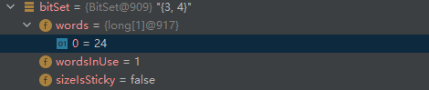
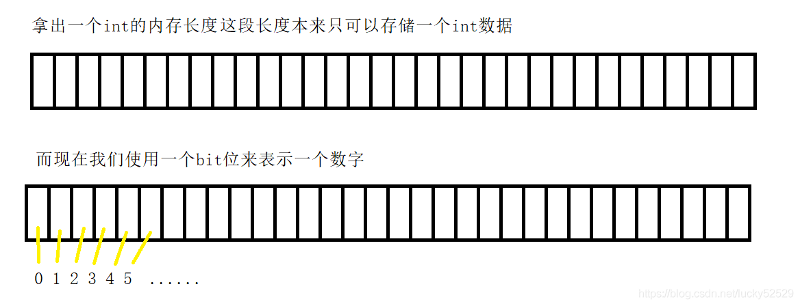

# BitSet

## BitSet

[Java中BitSet的基本用法 - 浅白 - 博客园 (cnblogs.com)](https://www.cnblogs.com/gagag/p/14056389.html)

JAVA中BitSet就是“位图(bitmap)”数据结构，根据“位图”的语义，数据的存在性可以使用bit位上的1或0来表示；一个bit具有2个值：0和1，正好可以用来表示false和true

结构：和Set没有关系，这个类中维护了一个long型（8字节）的数组，一个long占8个字节，也就是64位。

```java
public class BitSet implements Cloneable, java.io.Serializable {
    private long[] words;
	//其他属性
    //...方法
}
```


```java
BitSet bitSet = new BitSet();
bitSet.set(0, 2, true);
```

上面的代码的含义是，第**[0,2)**位会被设置成1，也就是说这个类会自动地生成一个long型的数(words[0] = 3），这个数换成二进制的形式是 1 1

如果bitSet.set(3, 5, true); , 第**[3,5)**位会被设置成1， 此时words[0] = 24, 换成二进制的形式为 1 1 0 0 0



常用的方法有

> int nextSetBit(int startIndex) // 返回第一个设置为 true 的位的索引，在指定的起始索引或之后的索引上
> int nextClearBit(int startIndex) // 返回第一个设置为 false 的位的索引 , 在指定的起始索引或之后的索引上
> void set(int index, boolean v) // 将指定索引处的位设置为指定的值
> 将指定索引处的位设置为 true

## 位图模型

[[数据结构\]——位图原理及实现_lucky52529的博客-CSDN博客_位图](https://blog.csdn.net/lucky52529/article/details/90172264)

### 位图

今天我们所介绍的数据结构叫做**位图**，在谈什么是位图之前我们先来看一道"非常简单的题"：有40亿个无符号的整型数据，现在给定一个目标数字，判断这个数字是否在这40亿数据中。题目看起来确实非常简单，有的同学说直接遍历一遍不就ok了吗？还有的同学给出了更高效的查找方式就是将这些数字排序然后进行二分查找。但是，这是有问题的，问题并不在于你搜索这个数字的效率问题，而是你在遍历也好排序也罢，这些数字在内存中放的下么？

一个整型int就是4个字节，10亿个int差不多已经需要4G的内存了，40亿个int就是16G。所以这里方法行不通的根本原因实际上是内存不够，但是我们今天的讲的位图却能很好的帮助我们处理这个问题。

### 位图模型

既然根本原因是这些数据用int放不下，那么是否有更小的东西标记这些数字呢？没错，有的同学想到了，char只占一个字节或许能表示一个数字，但是随着数字位数的增多，依旧不可能使用一个字符表示一个数字，这就意味着小于4G内存还是不能解决这个问题。
其实说到这里，我们的问题就转化为如何使用更小的内存单元来标记一个数字，而在程序中我们最小的访问单位的bit位，所以现在我们一起来看使用比特位如何标记(映射)这些数据。

现在我们发现，4个字节本来只能存储一个int，而现在使用位图我们就存了(映射)32个数字，意味着16G/32约等于500m左右我们就能映射这些数据，那么这些数据是怎么映射到位图种的呢？接着看。


