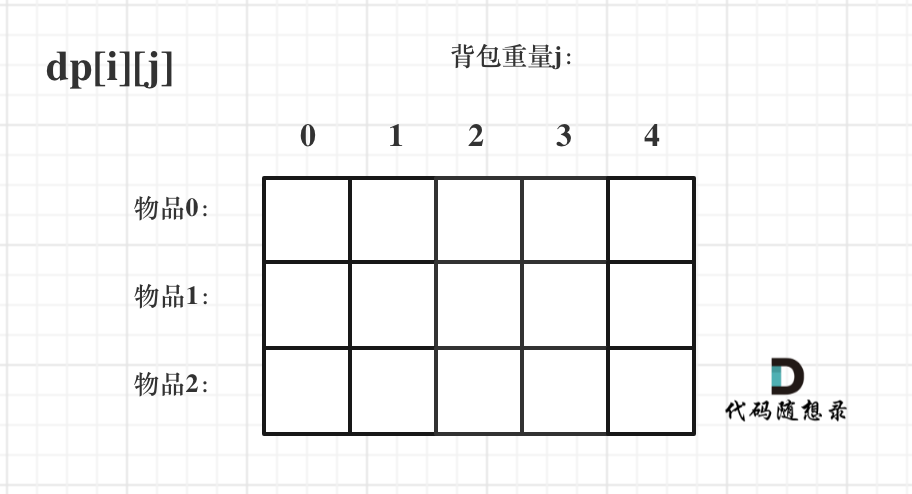

# 理论基础

0-1背包：有n种物品，每种物品一个

完全背包：有n种物品，每种物品无限多个

多重背包：有n种物品，每种物品的个数各不相同


有n 个物品，它们有各自的重量和价值，现有给定容量的背包，如何让背包里装入的物品具有最大的价值总和？
背包最大重量为4。

物品为：

|       | 重量 | 价值 |
| ----- | ---- | ---- |
| 物品0 | 1    | 15   |
| 物品1 | 3    | 20   |
| 物品2 | 4    | 30   |

**暴力解法**  回溯算法 2的n次方时间复杂度

1、dp数组以及下标的含义

dp\[i][j] 表示[0,i]的物品任取，放到容量为j的背包里，价值是dp\[i][j] 

2、递推公式

不放物品i，价值是：dp\[i-1][j]

放物品i，价值是：dp[i-1]\[j-weight[i]] + value[i]

dp\[i][j]  = max(dp\[i-1][j], dp[i-1]\[j-weight[i]] + value[i])

当前这个元素，是由正上方和左上方推导来的

3、初始化



初始化第一行和第一列


其他非零下标初始化什么都可以，不影响

4、遍历顺序

两重for循环

第一层遍历 物品，第二层遍历 背包

对于这样二维数组实现0-1背包问题，两重for循环的遍历顺序可以颠倒的

```java
public class BagProblem {
    public static void main(String[] args) {
        int[] weight = {1,3,4};
        int[] value = {15,20,30};
        int bagSize = 4;
        testWeightBagProblem(weight,value,bagSize);
    }

    /**
     * 动态规划获得结果
     * @param weight  物品的重量
     * @param value   物品的价值
     * @param bagSize 背包的容量
     */
    public static void testWeightBagProblem(int[] weight, int[] value, int bagSize){

        // 创建dp数组
        int goods = weight.length;  // 获取物品的数量
        int[][] dp = new int[goods][bagSize + 1];

        // 初始化dp数组
        // 创建数组后，其中默认的值就是0
        for (int j = weight[0]; j <= bagSize; j++) {
            dp[0][j] = value[0];
        }

        // 填充dp数组
        for (int i = 1; i < weight.length; i++) {//遍历物品
            for (int j = 1; j <= bagSize; j++) { //遍历背包
                if (j < weight[i]) {
                    /**
                     * 当前背包的容量都没有当前物品i大的时候，是不放物品i的
                     * 那么前i-1个物品能放下的最大价值就是当前情况的最大价值
                     */
                    dp[i][j] = dp[i-1][j];
                } else {
                    /**
                     * 当前背包的容量可以放下物品i
                     * 那么此时分两种情况：
                     *    1、不放物品i
                     *    2、放物品i
                     * 比较这两种情况下，哪种背包中物品的最大价值最大
                     */
                    dp[i][j] = Math.max(dp[i-1][j] , dp[i-1][j-weight[i]] + value[i]);
                }
            }
        }

        // 打印dp数组
        for (int i = 0; i < goods; i++) {
            for (int j = 0; j <= bagSize; j++) {
                System.out.print(dp[i][j] + "\t");
            }
            System.out.println("\n");
        }
    }
}

```

# 滚动数组

上一节是用二维数组实现0-1背包，这一节使用一维dp数组实现0-1背包。状态压缩。

还是上一节的例子，二维数组中，递推公式：

不放物品i，价值是：dp\[i-1][j]

放物品i，价值是：dp[i-1]\[j-weight[i]] + value[i]

dp\[i][j]  = max(dp\[i-1][j], dp[i-1]\[j-weight[i]] + value[i])

1、dp数组以及下标的含义

dp[j]：容量为j的背包，所能装的最大价值为dp[j]

2、递推公式

dp[j]表示不放物品i，

放物品i：dp[j-weight[i]] + value[i]

dp[j] = max( dp[j], dp[j-weight[i]] + value[i])

3、初始化

dp[0] = 0; 

4、遍历顺序

一维数组中，倒序遍历能保证物品不被重复添加，且只能先遍历背包

```java
for(i=0;i<物品数量;i++){ //遍历物品
    for(j=bagweight;j>weight[i];j--) {
        递推公式
    }
}
```


```java
public static void main(String[] args) {
    int[] weight = {1, 3, 4};
    int[] value = {15, 20, 30};
    int bagWight = 4;
    testWeightBagProblem(weight, value, bagWight);
}

public static void testWeightBagProblem(int[] weight, int[] value, int bagWeight){
    int wLen = weight.length;
    //定义dp数组：dp[j]表示背包容量为j时，能获得的最大价值
    int[] dp = new int[bagWeight + 1];
    //遍历顺序：先遍历物品，再遍历背包容量
    for (int i = 0; i < wLen; i++){
        for (int j = bagWeight; j >= weight[i]; j--){
            dp[j] = Math.max(dp[j], dp[j - weight[i]] + value[i]);
        }
    }
    //打印dp数组
    for (int j = 0; j <= bagWeight; j++){
        System.out.print(dp[j] + " ");
    }
}
```

