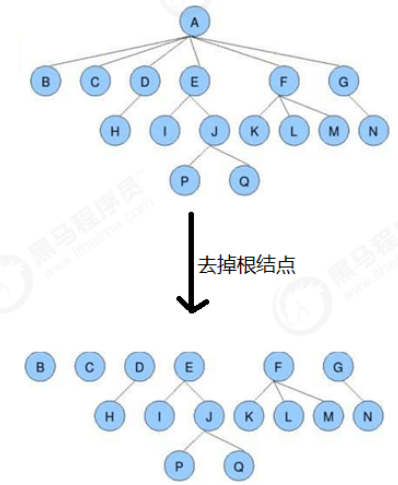
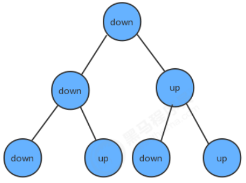
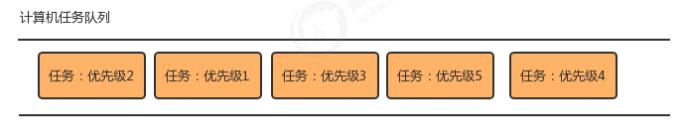
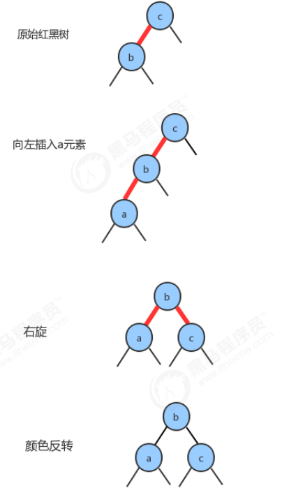
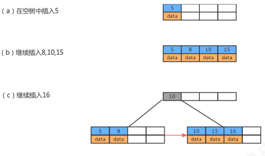
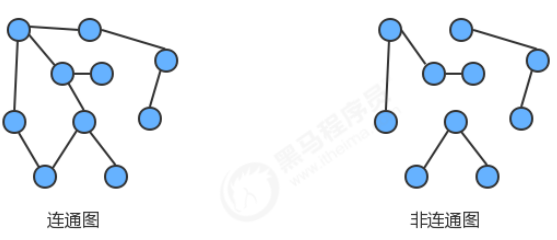
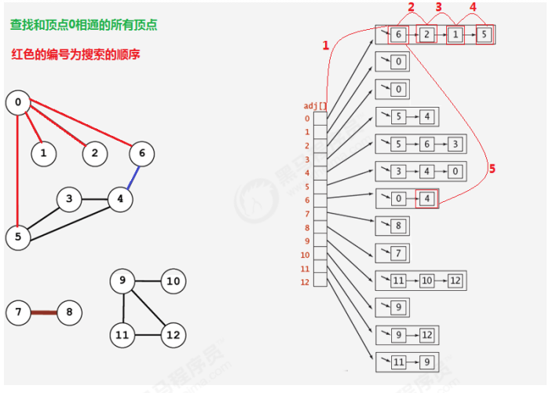
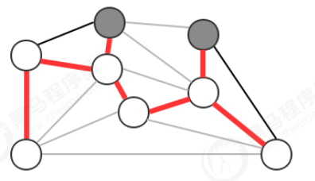
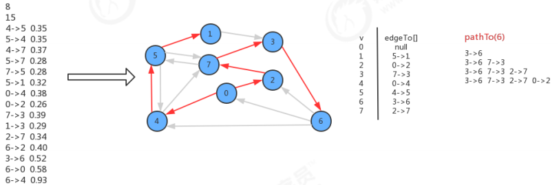

# 字符串

## kmp算法

[kmp算法解释](https://www.cnblogs.com/imzhr/p/9613963.html)

```java
public class KMP {

    /**
     * 求出一个字符数组的next数组
     * @param t 字符数组
     * @return next数组
     */
    public static int[] getNextArray(char[] t) {
        int[] next = new int[t.length];
        next[0] = -1;
        next[1] = 0;
        int k;
        for (int j = 2; j < t.length; j++) {
            k=next[j-1];
            while (k!=-1) {
                if (t[j - 1] == t[k]) {
                    next[j] = k + 1;
                    break;
                }
                else {
                    k = next[k];
                }
                next[j] = 0;  //当k==-1而跳出循环时，next[j] = 0，否则next[j]会在break之前被赋值
            }
        }
        return next;
    }

    /**
     * 对主串s和模式串t进行KMP模式匹配
     * @param s 主串
     * @param t 模式串
     * @return 若匹配成功，返回t在s中的位置（第一个相同字符对应的位置），若匹配失败，返回-1
     */
    public static int kmpMatch(String s, String t){
        char[] s_arr = s.toCharArray();
        char[] t_arr = t.toCharArray();
        int[] next = getNextArray(t_arr);
        int i = 0, j = 0;
        while (i<s_arr.length && j<t_arr.length){
            if(j == -1 || s_arr[i]==t_arr[j]){
                i++;
                j++;
            }
            else
                j = next[j];
        }
        if(j == t_arr.length)
            return i-j;
        else
            return -1;
    }

    public static void main(String[] args) {
        System.out.println(kmpMatch("abcabaabaabcacb", "abaabcac"));
    }

}
```


# 排序

## 1.简单排序

### 1.1 Comparable接口介绍

将**对象**进行排序

由于我们这里要讲排序，所以肯定会在元素之间进行比较，而Java提供了一个接口Comparable就是用来定义排序规则的，在这里我们以案例的形式对Comparable接口做一个简单的回顾。

 1.定义一个学生类Student，具有年龄age和姓名username两个属性，并通过Comparable接口提供比较规则；

 2.定义测试类Test，在测试类Test中定义测试方法Comparable getMax(Comparable c1,Comparable c2)完成测试

```java
public class TestComparable {
    public static void main(String[] args) {
        Student s1 = new Student();
        s1.setUsername("张三");
        s1.setAge(18);

        Student s2 = new Student();
        s2.setUsername("李四");
        s2.setAge(20);
        System.out.println(getMax(s1, s2));

    }
    public static Comparable getMax(Comparable c1,Comparable c2){
        int result = c1.compareTo(c2);
        //result<0,c1比c2小
        //result>0,c1比c2大
        //result==0,一样大
        if (result>0){
            return c1;
        }else {
            return c2;
        }
    }
}
```

```
Student{username='李四', age=20}
```

### 1.2 冒泡排序

Bubble Sort

#### 排序原理

1. 比较相邻的元素。如果前一个元素比后一个元素大，就交换这两个元素的位置。
2. 对每一对相邻元素做同样的工作，从开始第一对元素到结尾的最后一对元素。最终最后位置的元素就是最大值。


#### 冒泡排序API设计

| 类名     | Bubble                                                       |
| -------- | ------------------------------------------------------------ |
| 构造方法 | Bubble()：创建Bubble对象                                     |
| 成员方法 | 1.public static void sort(Comparable[] a)：对数组内的元素进行排序 <br/>2.private static boolean greater(Comparable v,Comparable w):**判断**v是否大于w<br>3.private static void exch(Comparable[] a,int i,int j)：**交换**a数组中，索引i和索引j处的值 |

#### 代码实现

```java
public class Bubble {
    //对数组a中元素进行排序
    public static void sort(Comparable[] a){
        for (int i = a.length-1; i >0; i--) {
            for (int j=0;j<i;j++){
                if (greater(a[j],a[j+1])){
                    exch(a,j,j+1);
                }
            }
        }
    }
    //比较v元素是否大于w元素
    private static boolean greater(Comparable v,Comparable w){
        return v.compareTo(w)>0;
    }
    //元素i和j交换位置
    private static void exch(Comparable[] a,int i,int j){
        Comparable t = a[i];
        a[i]=a[j];
        a[j]=t;
    }
}

public class BubbleTest {
    public static void main(String[] args) {
        Integer[] arr={4,5,6,3,2,1};
        Bubble.sort(arr);
        System.out.println(Arrays.toString(arr));//[1, 2, 3, 4, 5, 6]
    }
}
```

#### 冒泡排序的时间复杂度分析 

冒泡排序使用了双层for循环，其中内层循环的循环体是真正完成排序的代码，所以，
我们分析冒泡排序的时间复杂度，主要分析一下内层循环体的执行次数即可。
在**最坏情况**下，也就是假如要排序的元素为{6,5,4,3,2,1}逆序，那么：
元素比较的次数为：
 (N-1)+(N-2)+(N-3)+...+2+1=((N-1)+1)*(N-1)/2=N^2/2-N/2;
元素交换的次数为：
 (N-1)+(N-2)+(N-3)+...+2+1=((N-1)+1)*(N-1)/2=N^2/2-N/2;
总执行次数为：
 (N^2/2-N/2)+(N^2/2-N/2)=N^2-N;
按照大O推导法则，保留函数中的最高阶项那么最终冒泡排序的时间复杂度为O(N^2).

**试用范围**：数据较少时

### 1.3 选择排序

需求：
排序前：{4,6,8,7,9,2,10,1}
排序后：{1,2,4,5,7,8,9,10}

#### 排序原理

 1.每一次遍历的过程中，都假定第一个索引处的元素是最小值，和其他索引处的值依次进行比较，如果当前索引处
的值大于其他某个索引处的值，则假定其他某个索引出的值为最小值，最后可以找到最小值所在的索引
 2.交换第一个索引处和最小值所在的索引处的值


#### 选择排序API设计


#### 代码实现

```java
public class Selection {
    public static void sort(Comparable[] a){
        for (int i = 0; i < a.length-2; i++) {
            //定义一个变量，记录最小元素所在的索引，默认参与选择排序的第一个元素所在的位置
            int minIndex = i;
            for(int j=i+1;j<a.length;j++){
                //比较最最小索引minIndex处的值和j索引处的值
                if(greater(a[minIndex],a[j])){
                    minIndex=j;
                }
                //交换最小元素所在索引minIndex处的值和索引i处的值
                exch(a,i,minIndex);
            }
        }
    }
    //比较v元素是否大于w元素
    private static boolean greater(Comparable v,Comparable w){
        return v.compareTo(w)>0;
    }
    //元素i和j交换位置
    private static void exch(Comparable[] a,int i,int j){
        Comparable t = a[i];
        a[i]=a[j];
        a[j]=t;
    }
}
public class SelectionTest {
    public static void main(String[] args) {
        Integer[] arr ={4,6,8,7,9,2,10,1};
        Selection.sort(arr);
        System.out.println(Arrays.toString(arr));//[1, 2, 4, 6, 7, 8, 10, 9]
    }
}
```

#### 选择排序的时间复杂度分析

选择排序使用了双层for循环，其中外层循环完成了数据交换，内层循环完成了数据比较，所以我们分别统计数据
交换次数和数据比较次数：
数据比较次数：
 (N-1)+(N-2)+(N-3)+...+2+1=((N-1)+1)*(N-1)/2=N^2/2-N/2;

数据交换次数：
 N-1
时间复杂度：N^2/2-N/2+（N-1）=N^2/2+N/2-1;
根据大O推导法则，保留最高阶项，去除常数因子，时间复杂度为O(N^2);

**试用范围**：数据较少时

### 1.4 插入排序

插入排序的工作方式非常像人们排序一手扑克牌一样。开始时，我们的左手为空并且桌子上的牌面朝下。然后，我们每次从桌子上拿走一张牌并将它插入左手中正确的位置。为了找到一张牌的正确位置，我们从右到左将它与已在手中的每张牌进行比较.

需求：
排序前：{4,3,2,10,12,1,5,6}
排序后：{1,2,3,4,5,6,10,12}

#### 排序原理

1.把所有的元素分为两组，已经排序的和未排序的；
2.找到未排序的组中的第一个元素，向已经排序的组中进行插入；
3.倒叙遍历已经排序的元素，依次和待插入的元素进行比较，直到找到一个元素小于等于待插入元素，那么就把待插入元素放到这个位置，其他的元素向后移动一位；


#### 插入排序API设计


#### 代码实现

```java
public class Insertion {
    public static void sort(Comparable[] a){
        for (int i = 1; i <a.length ; i++) {
            for (int j=i;j>0;j--){
                //比较索引j处的值和j-1的值，如果j-1大则交换，如果不大，就退出循环
                if (greater(a[j-1],a[j])){
                    exch(a,j-1,j);
                }else {
                    break;
                }
            }
        }
    }
    //比较v元素是否大于w元素
    private static boolean greater(Comparable v,Comparable w){
        return v.compareTo(w)>0;
    }
    //元素i和j交换位置
    private static void exch(Comparable[] a,int i,int j){
        Comparable t = a[i];
        a[i]=a[j];
        a[j]=t;
    }
}
public class InsertionTest {
    public static void main(String[] args) {
        Integer[] arr ={4,3,2,10,12,1,5,6};
        Selection.sort(arr);
        System.out.println(Arrays.toString(arr));//[1, 2, 3, 4, 6, 5, 12, 10]
    }
}
```

#### 插入排序的时间复杂度分析

插入排序使用了双层for循环，其中内层循环的循环体是真正完成排序的代码，所以，我们分析插入排序的时间复
杂度，主要分析一下内层循环体的执行次数即可。
最坏情况，也就是待排序的数组元素为{12,10,6,5,4,3,2,1}，那么：
比较的次数为：
(N-1)+(N-2)+(N-3)+...+2+1=((N-1)+1)*(N-1)/2=N^2/2-N/2;
交换的次数为：
(N-1)+(N-2)+(N-3)+...+2+1=((N-1)+1)*(N-1)/2=N^2/2-N/2;
总执行次数为：
(N^2/2-N/2)+(N^2/2-N/2)=N^2-N;
按照大O推导法则，保留函数中的最高阶项那么最终插入排序的时间复杂度为O(N^2).

## 2.高级排序

之前我们学习过基础排序，包括冒泡排序，选择排序还有插入排序，并且对他们在最坏情况下的时间复杂度做了分析，发现都是O(N^2)，而平方阶通过我们之前学习算法分析我们知道，随着输入规模的增大，时间成本将急剧上升，所以这些基本排序方法不能处理更大规模的问题，接下来我们学习一些高级的排序算法，争取降低算法的时间复杂度最高阶次幂。

### 2.1希尔排序

希尔排序是插入排序的一种，又称“缩小增量排序”，是插入排序算法的一种更高效的改进版本。

前面学习插入排序的时候，我们会发现一个很不友好的事儿，如果已排序的分组元素为{2,5,7,9,10}，未排序的分组元素为{1,8}，那么下一个待插入元素为1，我们需要拿着1从后往前，依次和10,9,7,5,2进行交换位置，才能完成真正的插入，每次交换只能和相邻的元素交换位置。那如果我们要提高效率，直观的想法就是一次交换，能把1放到更前面的位置，比如一次交换就能把1插到2和5之间，这样一次交换1就向前走了5个位置，可以减少交换的次数，
这样的需求如何实现呢？接下来我们来看看希尔排序的原理。

需求：
排序前：{9,1,2,5,7,4,8,6,3,5}
排序后：{1,2,3,4,5,5,6,7,8,9}

#### 排序原理

 1.选定一个增长量h，按照增长量h作为数据分组的依据，对数据进行分组；
 2.对分好组的每一组数据完成插入排序；
 3.减小增长量，最小减为1，重复第二步操作。


增长量h的确定：增长量h的值每一固定的规则，我们这里采用以下规则：

```java
int h=1
    while(h<数组的长度/2){//5
        h=2h+1；//3,7
    }
//循环结束后我们就可以确定h的最大值；
h的减小规则为：
    h=h/2
```

#### 希尔排序的API设计


#### 希尔排序的代码实现

```java
public class Shell {
    public static void sort(Comparable[] a){
        //1.根据数组a的长度，确定增长量h的初始值
        int N = a.length;
        //确定增长量h的最大值
        int h=1;
        while(h<N/2){
            h=h*2+1;
        }
        //2.希尔排序
        while (h>=1){
            //找到带插入元素
            for (int i = h; i <a.length;i++) {
                //待插入的值插入到有序数列中
                for (int j = i; j>=h; j-=h) {
                    //待插入的元素是a[j],比较a[j],a[j-h]
                    if (greater(a[j-h],a[j])){
                        //交换元素
                        exch(a,j-h,j);
                    }else {
                        //待插入元素已经找到了合适的循环
                        break;
                    }
                }
            }
            //减少h的值
            h=h/2;
        }
    }

    //比较v元素是否大于w元素
    private static boolean greater(Comparable v,Comparable w){
        return v.compareTo(w)>0;
    }
    //元素i和j交换位置
    private static void exch(Comparable[] a,int i,int j){
        Comparable t = a[i];
        a[i]=a[j];
        a[j]=t;
    }
}
public class ShellTest {
    public static void main(String[] args) {
        Integer[] a={9,1,2,5,7,4,8,6,3,5};
        Shell.sort(a);
        System.out.println(Arrays.toString(a));//[1, 2, 3, 4, 5, 5, 6, 7, 8, 9]
    }
}
```

#### 时间复杂度分析

在希尔排序中，增长量h并没有固定的规则，有很多论文研究了各种不同的递增序列，但都无法证明某个序列是最好的，对于希尔排序的时间复杂度分析，已经超出了我们课程设计的范畴，所以在这里就不做分析了。
我们可以使用事后分析法对希尔排序和插入排序做性能比较。
在资料的测试数据文件夹下有一个reverse_shell_insertion.txt文件，里面存放的是从100000到1的逆向数据，我们可以根据这个批量数据完成测试。测试的思想：在执行排序前前记录一个时间，在排序完成后记录一个时间，两个时间的时间差就是排序的耗时。

希尔排序和插入排序性能比较测试代码：

```java
public class SortCompare {
    //调用不同的测试方法完成测试
    public static void main(String[] args) throws IOException {
        ArrayList<Integer> list = new ArrayList<>();
        BufferedReader reader = new BufferedReader(new InputStreamReader(Objects.requireNonNull(SortCompare.class.getClassLoader().getResourceAsStream("reverse_arr.txt"))));
        //这个文件是10万到1的降序数字，一行一个数字
        String line = null;
        while ((line=reader.readLine())!=null){
            //line是字符串，转换成Integer，存储到集合中
            int i = Integer.parseInt(line);
            list.add(i);
        }
        reader.close();
        //把ArrayList集合转化成数组
        Integer[] a = new Integer[list.size()];
        list.toArray(a);
//        testInsertion(a);//22823毫秒
        testShell(a);//24毫秒

    }
    //测试希尔排序
    private static void testShell(Integer[] a){
        long start = System.currentTimeMillis();
        Shell.sort(a);
        long end = System.currentTimeMillis();
        System.out.println("希尔排序的执行时间为："+(end-start)+"毫秒");
    }
    //测试插入排序
    private static void testInsertion(Integer[] a){
        long start = System.currentTimeMillis();
        Insertion.sort(a);
        long end = System.currentTimeMillis();
        System.out.println("插入排序的执行时间为："+(end-start)+"毫秒");
    }
}
```

### 2.2 归并排序

#### 2.2.1 递归

正式学习归并排序之前，我们得先学习一下递归算法。
定义：
定义方法时，在方法内部调用方法本身，称之为递归.

```java
public void show(){
    System.out.println("aaaa");
    show();
}
```

作用：
它通常把一个大型复杂的问题，层层转换为一个与原问题相似的，规模较小的问题来求解。递归策略只需要少量的程序就可以描述出解题过程所需要的多次重复计算，大大地**减少了程序的代码量**。
注意事项：

在递归中，不能无限制的调用自己，必须要有边界条件，能够**让递归结束**，因为每一次递归调用都会在**栈内存**开辟新的空间，重新执行方法，如果递归的层级太深，很容易造成**栈内存溢出**。StackOverflowError


需求：请定义一个方法，使用递归完成求N的阶乘；

```java
public class Test {
    public static void main(String[] args) throws Exception {
        int result = factorial(5);
        System.out.println(result);
    }
    public static int factorial(int n){
        if (n==1){
            return 1;
        }
        return n*factorial(n-1);
    }
}
```

#### 2.2.2 归并排序

归并排序是建立在归并操作上的一种有效的排序算法，该算法是采用分治法的一个非常典型的应用。将已有序的子序列合并，得到完全有序的序列；即先使每个子序列有序，再使子序列段间有序。若将两个有序表合并成一个有序表，称为二路归并。
需求：
排序前：{8,4,5,7,1,3,6,2}
排序后：{1,2,3,4,5,6,7,8}

##### 排序原理：

 1.尽可能的一组数据拆分成两个元素相等的子组，并对每一个子组继续拆分，直到拆分后的每个子组的元素个数是1为止。
 2.将相邻的两个子组进行合并成一个有序的大组；
 3.不断的重复步骤2，直到最终只有一个组为止。


##### 归并排序API设计：


##### 归并原理


##### 归并排序代码实现

```java
public class Merge {
    private static Comparable[] assist;//归并所需要的辅助数组

    public static void sort(Comparable[] a) {
        //1.初始化辅助数组assist
        assist = new Comparable[a.length];
        //2.定义一个lo变量和hi变量，分别记录数组中最小的索引和最大的索引
        int lo = 0;
        int hi = a.length-1;
        //3.调用sort重载方法完成数组a中，从索引lo到索引hi的元素的排序
        sort(a,lo,hi);
    }

    private static void sort(Comparable[] a, int lo, int hi) {
        //安全性校验
        if(hi<=lo){
            return;
        }
        //对lo到hi之间的数组分为两个组
        int mid = lo+(hi-lo)/2;
        //分别对每一组数据进行排序
        sort(a,lo,mid);
        sort(a,mid+1,hi);
        //再把两个组的数据进行归并
        merge(a,lo,mid, hi);
    }

    //对数组中，从lo到mid为一组，从mid+1到hi为一组，对这两组数据进行归并
    private static void merge(Comparable[] a, int lo, int mid, int hi) {
        //定义三个指针
        int i = lo;
        int p1 = lo;
        int p2 = mid+1;
        //遍历，移动p1指针和p2指针，比较对应索引处的值，找出最小的那个，放到辅助数组的对应索引处
        while (p1<=mid&&p2<=hi){
            if (less(a[p1],a[p2])){
                assist[i++]=a[p1++];
            }else {
                assist[i++]=a[p2++];
            }
        }
        //遍历，如果p1的指针没有走完，那么顺序移动p1指针，把对应的元素放到辅助数组的对于索引处
        while (p1<=mid){
            assist[i++]=a[p1++];
        }
        //遍历，如果p2的指针没有走完，那么顺序移动p2指针，把对应的元素放到辅助数组的对于索引处
        while (p2<=hi){
            assist[i++]=a[p2++];
        }
        //把辅助数组中数据拷贝到原数组中
        for(int index =lo;index<=hi;index++){
            a[index]=assist[index];
        }
    }

    //比较v元素是否小于w元素
    private static boolean less(Comparable v, Comparable w) {
        return v.compareTo(w) < 0;
    }
}

public class MergeTest {
    public static void main(String[] args) {
        Integer[] a={8,4,5,7,1,3,6,2};
        Merge.sort(a);
        System.out.println(Arrays.toString(a));//[1, 2, 3, 4, 5, 6, 7, 8]
    }

}
```

##### 归并排序时间复杂度分析：

归并排序是分治思想的最典型的例子，上面的算法中，对a[lo...hi]进行排序，先将它分为a[lo...mid]和a[mid+1...hi]两部分，分别通过递归调用将他们单独排序，最后将有序的子数组归并为最终的排序结果。该递归的出口在于如果一个数组不能再被分为两个子数组，那么就会执行merge进行归并，在归并的时候判断元素的大小进行排序。


用树状图来描述归并，如果一个数组有8个元素，那么它将每次除以2找最小的子数组，共拆log8次，值为3，所以树共有3层,那么自顶向下第k层有2^k个子数组，每个数组的长度为2^(3-k)，归并最多需要2^(3-k)次比较。因此每层的比较次数为 2^k * 2^(3-k)=2^3,那么3层总共为 3*2^3。
假设元素的个数为n，那么使用归并排序拆分的次数为log2(n),所以共log2(n)层，那么使用log2(n)替换上面3*2^3中的3这个层数，最终得出的归并排序的时间复杂度为：log2(n)* 2^(log2(n))=log2(n)*n,根据大O推导法则，忽略底数，最终归并排序的时间复杂度为O(nlogn);
**归并排序的缺点：**
需要申请额外的数组空间，导致空间复杂度提升，是典型的以空间换时间的操作。

##### 归并排序与希尔排序性能测试：

之前我们通过测试可以知道希尔排序的性能是由于插入排序的，那现在学习了归并排序后，归并排序的效率与希尔
排序的效率哪个高呢？我们使用同样的测试方式来完成一样这两个排序算法之间的性能比较。
在资料的测试数据文件夹下有一个reverse_arr.txt文件，里面存放的是从1000000到1的逆向数据，我们可以根据
这个批量数据完成测试。测试的思想：在执行排序前前记录一个时间，在排序完成后记录一个时间，两个时间的时
间差就是排序的耗时。
希尔排序和插入排序性能比较测试代码：

```java

public class SortCompare {
    //调用不同的测试方法完成测试
    public static void main(String[] args) throws IOException {
        ArrayList<Integer> list = new ArrayList<>();
        BufferedReader reader = new BufferedReader(new InputStreamReader(Objects.requireNonNull(SortCompare.class.getClassLoader().getResourceAsStream("reverse_arr.txt"))));
        String line = null;
        while ((line=reader.readLine())!=null){
            //line是字符串，转换成Integer，存储到集合中
            int i = Integer.parseInt(line);
            list.add(i);
        }
        reader.close();
        //把ArrayList集合转化成数组
        Integer[] a = new Integer[list.size()];
        list.toArray(a);
//        testInsertion(a);//22823毫秒
//        testShell(a);//24毫秒
        testMerge(a);//60毫秒

    }
    //测试希尔排序
    private static void testShell(Integer[] a){
        long start = System.currentTimeMillis();
        Shell.sort(a);
        long end = System.currentTimeMillis();
        System.out.println("希尔排序的执行时间为："+(end-start)+"毫秒");
    }
    //测试归并排序
    private static void testMerge(Integer[] a){
        long start = System.currentTimeMillis();
        Merge.sort(a);
        long end = System.currentTimeMillis();
        System.out.println("归并排序的执行时间为："+(end-start)+"毫秒");
    }

}
```

通过测试，发现希尔排序和归并排序在处理大批量数据时差别不是很大。

### 2.3 快速排序

快速排序是对冒泡排序的一种改进。它的基本思想是：通过一趟排序将要排序的数据分割成独立的两部分，其中一
部分的所有数据都比另外一部分的所有数据都要小，然后再按此方法对这两部分数据分别进行快速排序，整个排序
过程可以递归进行，以此达到整个数据变成有序序列。
需求：
排序前:{6, 1, 2, 7, 9, 3, 4, 5, 8}
排序后:{1, 2, 3, 4, 5, 6, 7, 8, 9}

#### 排序原理：

1.首先设定一个分界值，通过该分界值将数组分成左右两部分；
2.将大于或等于分界值的数据放到到数组右边，小于分界值的数据放到数组的左边。此时左边部分中各元素都小于或等于分界值，而右边部分中各元素都大于或等于分界值；

3.然后，左边和右边的数据可以独立排序。对于左侧的数组数据，又可以取一个分界值，将该部分数据分成左右两部分，同样在左边放置较小值，右边放置较大值。右侧的数组数据也可以做类似处理。
4.重复上述过程，可以看出，这是一个递归定义。通过递归将左侧部分排好序后，再递归排好右侧部分的顺序。当左侧和右侧两个部分的数据排完序后，整个数组的排序也就完成了。


#### 快速排序API设计


#### 切分原理：

把一个数组切分成两个子数组的基本思想：
1.找一个基准值，用两个指针分别指向数组的头部和尾部；
2.先从尾部向头部开始搜索一个比基准值小的元素，搜索到即停止，并记录指针的位置；
3.再从头部向尾部开始搜索一个比基准值大的元素，搜索到即停止，并记录指针的位置；
4.交换当前左边指针位置和右边指针位置的元素；
5.重复2,3,4步骤，直到左边指针的值大于右边指针的值停止。


#### 代码实现

```java
public class Quick {
    //对数组内的元素进行排序
    public static void sort(Comparable[] a) {
        int lo=0;
        int hi=a.length-1;
        sort(a,lo,hi);
    }
    //对数组a中从索引lo到索引hi之间的元素进行排序
    private static void sort(Comparable[] a, int lo, int hi) {
        if (hi<=lo){//安全性校验
            return;
        }
        //需要对数组中lo索引到hi索引处的元素进行分组（左子组和右子组）
        int partition = partition(a, lo, hi);//返回的是分组的分界值所在的索引，是分界值位置变化的索引
        sort(a,lo,partition-1);//让左子组有序
        sort(a,partition+1,hi);//让右子组有序
    }

    public static int partition(Comparable[] a, int lo, int hi) {
        //确定分界值
        Comparable key = a[lo];
        //定义两个指针，分别指向待切分元素的最小索引处和最大索引处的下一个位置
        int left=lo;
        int right = hi+1;
        //切分
        while (true){
            //先从右往左扫描，移动right指针，找出一个比分界值小的元素，停止
            while (less(key,a[--right])){
                if (right==lo){
                    break;
                }
            }
            //再从右往左扫描，移动left指针，找出一个比分界值大的元素，停止
            while (less(a[++left],key)){
                if (left==hi){
                    break;
                }
            }
            //判断left>=right，如果是，则证明元素扫描完毕，结束循环，如果不是，则交换元素即可
            if (left>=right){
                break;
            }else {
                exch(a,left,right);
            }
        }
        //交换分界值
        exch(a,lo,right);
        return right;
    }


    private static void exch(Comparable[] a, int i, int j) {
        Comparable t = a[i];
        a[i] = a[j];
        a[j] = t;
    }
    private static boolean less(Comparable v, Comparable w) {
        return v.compareTo(w) < 0;
    }
}

public class QuickTest {
    public static void main(String[] args) {
        Integer[] a ={6, 1, 2, 7, 9, 3, 4, 5, 8};
        Quick.sort(a);
        System.out.println(Arrays.toString(a));//[1, 2, 3, 4, 5, 6, 7, 8, 9]
    }
}
```

#### 快速排序和归并排序的区别：

快速排序是另外一种分治的排序算法，它将一个数组分成两个子数组，将两部分独立的排序。快速排序和归并排序是互补的：归并排序将数组分成两个子数组分别排序，并将有序的子数组归并从而将整个数组排序，而快速排序的方式则是当两个数组都有序时，整个数组自然就有序了。在归并排序中，一个数组被等分为两半，归并调用发生在处理整个数组之前，在快速排序中，切分数组的位置取决于数组的内容，递归调用发生在处理整个数组之后。

#### 快速排序时间复杂度分析：

快速排序的一次切分从两头开始交替搜索，直到left和right重合，因此，一次**切分**算法的时间复杂度为**O(n)**,但整个快速排序的时间复杂度和切分的次数相关。
最优情况：每一次切分选择的基准数字刚好将当前序列等分。


如果我们把数组的切分看做是一个树，那么上图就是它的最优情况的图示，共切分了logn次，所以，最优情况下快速排序的时间复杂度为O(nlogn);
最坏情况：每一次切分选择的基准数字是当前序列中最大数或者最小数，这使得每次切分都会有一个子组，那么总共就得切分n次，所以，最坏情况下，快速排序的时间复杂度为O(n^2);


平均情况：每一次切分选择的基准数字不是最大值和最小值，也不是中值，这种情况我们也可以用数学归纳法证明，快速排序的时间复杂度为O(nlogn),由于数学归纳法有很多数学相关的知识，容易使我们混乱，所以这里就不对平均情况的时间复杂度做证明了。

### 2.4 排序的稳定性

**稳定性的定义：**
数组arr中有若干元素，其中A元素和B元素相等，并且A元素在B元素前面，如果使用某种排序算法排序后，能够保证A元素依然在B元素的前面，可以说这个该算法是稳定的。


稳定性的意义：
如果一组数据只需要一次排序，则稳定性一般是没有意义的，如果一组数据需要多次排序，稳定性是有意义的。例如要排序的内容是一组商品对象，第一次排序按照价格由低到高排序，第二次排序按照销量由高到低排序，如果第二次排序使用稳定性算法，就可以使得相同销量的对象依旧保持着价格高低的顺序展现，只有销量不同的对象才需要重新排序。这样既可以保持第一次排序的原有意义，而且可以减少系统开销。

第一次按照价格从低到高排序：


第二次按照销量进行从高到低排序：


#### 常见排序算法的稳定性

**冒泡排序：**
只有当arr[i]>arr[i+1]的时候，才会交换元素的位置，而相等的时候并不交换位置，所以冒泡排序是一种**稳定**排序算法。
**选择排序:**
选择排序是给每个位置选择当前元素最小的,例如有数据{5(1)，8 ，5(2)， 2， 9 },第一遍选择到的最小元素为2，所以5(1)会和2进行交换位置，此时5(1)到了5(2)后面，破坏了稳定性，所以选择排序是一种**不稳定**的排序算法。
**插入排序：**
比较是从有序序列的末尾开始，也就是想要插入的元素和已经有序的最大者开始比起，如果比它大则直接插入在其后面，否则一直往前找直到找到它该插入的位置。如果碰见一个和插入元素相等的，那么把要插入的元素放在相等元素的后面。所以，相等元素的前后顺序没有改变，从原无序序列出去的顺序就是排好序后的顺序，所以插入排序是**稳定**的。
**希尔排序：**
希尔排序是按照不同步长对元素进行插入排序 ,虽然一次插入排序是稳定的，不会改变相同元素的相对顺序，但在不同的插入排序过程中，相同的元素可能在各自的插入排序中移动，最后其稳定性就会被打乱，所以希尔排序是**不稳定**的。
**归并排序：**
归并排序在归并的过程中，只有arr[i]<arr[i+1]的时候才会交换位置，如果两个元素相等则不会交换位置，所以它并不会破坏稳定性，归并排序是**稳定**的。
**快速排序：**
快速排序需要一个基准值，在基准值的右侧找一个比基准值小的元素，在基准值的左侧找一个比基准值大的元素，然后交换这两个元素，此时会破坏稳定性，所以快速排序是一种**不稳定**的算法。

# 线性表

线性表是最基本、最简单、也是最常用的一种数据结构。一个线性表是n个具有相同特性的数据元素的有限序列。

前驱元素：
若A元素在B元素的前面，则称A为B的前驱元素
后继元素：
若B元素在A元素的后面，则称B为A的后继元素
线性表的特征：数据元素之间具有一种“一对一”的逻辑关系。
1. 第一个数据元素没有前驱，这个数据元素被称为头结点；
2. 最后一个数据元素没有后继，这个数据元素被称为尾结点；
3. 除了第一个和最后一个数据元素外，其他数据元素有且仅有一个前驱和一个后继。
如果把线性表用数学语言来定义，则可以表示为(a1,...ai-1,ai,ai+1,...an)，ai-1领先于ai,ai领先于ai+1，称ai-1是ai的前驱元素，ai+1是ai的后继元素

线性表的分类：
线性表中数据存储的方式可以是顺序存储，也可以是链式存储，按照数据的存储方式不同，可以把线性表分为**顺序表（数组）和链表**。

## 顺序表（数组）

顺序表是在计算机内存中以数组的形式保存的线性表，线性表的顺序存储是指用一组**地址连续**的存储单元，依次存储线性表中的各个元素、使得线性表中再逻辑结构上相邻的数据元素存储在相邻的物理存储单元中，即通过数据元素**物理存储的相邻**关系来反映数据元素之间逻辑上的相邻关系。

###  顺序表的实现

| 类名     | SequenceList\<T>                                             |
| -------- | ------------------------------------------------------------ |
| 构造方法 | SequenceList(int capacity)：创建容量为capacity的SequenceList对象 |
| 成员方法 | 1.public void clear()：空置线性表 <br/>2.publicboolean isEmpty()：判断线性表是否为空，是返回true，否返回false<br/>3.public int length():获取线性表中元素的个数<br/>4.public T get(int i):读取并返回线性表中的第i个元素的值<br/>5.public void insert(int i,T t)：在线性表的第i个元素之前插入一个值为t的数据元素。<br/>6.public void insert(T t):向线性表中添加一个元素t<br/>7.public T remove(int i):删除并返回线性表中第i个数据元素。<br/>8.public int indexOf(T t):返回线性表中首次出现的指定的数据元素的位序号，若不存在，则返回-1。 |
| 成员变量 | 1.private T[] eles：存储元素的数组<br/>2.private int N:当前线性表的长度 |


```java
//顺序表代码
public class SequenceList<T> {
    //存储元素的数组
    private T[] eles;
    //记录当前顺序表中的元素个数
    private int N;
    //构造方法
    public SequenceList(int capacity){
        eles = (T[])new Object[capacity];
        N=0;
    }
    //将一个线性表置为空表
    public void clear(){
        N=0;
    }
    //判断当前线性表是否为空表
    public boolean isEmpty(){
        return N==0;
    }
    //获取线性表的长度
    public int length(){
        return N;
    }
    //获取指定位置的元素
    public T get(int i){
        if (i<0 || i>=N){
            throw new RuntimeException("当前元素不存在！");
        }
        return eles[i];
    }
    //向线型表中添加元素t
    public void insert(T t){
        if (N==eles.length){
            throw new RuntimeException("当前表已满");
        }
        eles[N++] = t;
    }
    //在i元素处插入元素t
    public void insert(int i,T t){
        if (i==eles.length){
            throw new RuntimeException("当前表已满");
        }
        if (i<0 || i>N){
            throw new RuntimeException("插入的位置不合法");
        }
        //把i位置空出来，i位置及其后面的元素依次向后移动一位
        for (int index=N;index>i;index--){
            eles[index]=eles[index-1];
        }
        //把t放到i位置处
        eles[i]=t;
        //元素数量+1
        N++;
    }
    //删除指定位置i处的元素，并返回该元素
    public T remove(int i){
        if (i<0 || i>N-1){
            throw new RuntimeException("当前要删除的元素不存在");
        }
        //记录i位置处的元素
        T result = eles[i];
        //把i位置后面的元素都向前移动一位
        for (int index=i;index<N-1;index++){
            eles[index]=eles[index+1];
        }
        //当前元素数量-1
        N--;
        return result;
    }
    //查找t元素第一次出现的位置
    public int indexOf(T t){
        if(t==null){
            throw new RuntimeException("查找的元素不合法");
        }
        for (int i = 0; i < N; i++) {
            if (eles[i].equals(t)){
                return i;
            }
        }
        return -1;
    }
}
//测试代码
public class SequenceListTest {
    public static void main(String[] args) {
        //创建顺序表对象
        SequenceList<String> sl = new SequenceList<>(10);
        //测试插入
        sl.insert("姚明");
        sl.insert("科比");
        sl.insert("麦迪");
        sl.insert(1,"詹姆斯");
        //测试获取
        String getResult = sl.get(1);
        System.out.println("获取索引1处的结果为："+getResult);
        //测试删除
        String removeResult = sl.remove(0);
        System.out.println("删除的元素是："+removeResult);
        //测试清空
        sl.clear();
        System.out.println("清空后的线性表中的元素个数为:"+sl.length());
    }
}
```

### 顺序表的遍历

在java中，遍历集合的方式一般都是用的是**foreach循环**，如果想让我们的SequenceList也能支持foreach循环，则需要做如下操作：
 1.让SequenceList实现**Iterable接口，重写iterator方法**；
 2.在SequenceList内部提供一个**内部类SIterator,实现Iterator接口**，重写hasNext方法和next方法；

```java
//顺序表代码
import java.util.Iterator;
public class SequenceList<T> implements Iterable<T>{
    //存储元素的数组
    private T[] eles;
    //记录当前顺序表中的元素个数
    private int N;
    //构造方法
    public SequenceList(int capacity){
        eles = (T[])new Object[capacity];
        N=0;
    }
    //将一个线性表置为空表
    public void clear(){
        N=0;
    }
    //判断当前线性表是否为空表
    public boolean isEmpty(){
        return N==0;
    }
    //获取线性表的长度
    public int length(){
        return N;
    }
    //获取指定位置的元素
    public T get(int i){
        if (i<0 || i>=N){
            throw new RuntimeException("当前元素不存在！");
        }
        return eles[i];
    }
    //向线型表中添加元素t
    public void insert(T t){
        if (N==eles.length){
            throw new RuntimeException("当前表已满");
        }
        eles[N++] = t;
    }
    //在i元素处插入元素t
    public void insert(int i,T t){
        if (i==eles.length){
            throw new RuntimeException("当前表已满");
        }
        if (i<0 || i>N){
            throw new RuntimeException("插入的位置不合法");
        }
        //把i位置空出来，i位置及其后面的元素依次向后移动一位
        for (int index=N;index>i;index--){
            eles[index]=eles[index-1];
        }
        //把t放到i位置处
        eles[i]=t;
        //元素数量+1
        N++;
    }
    //删除指定位置i处的元素，并返回该元素
    public T remove(int i){
        if (i<0 || i>N-1){
            throw new RuntimeException("当前要删除的元素不存在");
        }
        //记录i位置处的元素
        T result = eles[i];
        //把i位置后面的元素都向前移动一位
        for (int index=i;index<N-1;index++){
            eles[index]=eles[index+1];
        }
        //当前元素数量-1
        N--;
        return result;
    }
    //查找t元素第一次出现的位置
    public int indexOf(T t){
        if(t==null){
            throw new RuntimeException("查找的元素不合法");
        }
        for (int i = 0; i < N; i++) {
            if (eles[i].equals(t)){
                return i;
            }
        }
        return -1;
    }
    //打印当前线性表的元素
    public void showEles(){
        for (int i = 0; i < N; i++) {
            System.out.print(eles[i]+" ");
        }
        System.out.println();
    }
    @Override
    public Iterator iterator() {
        return new SIterator();
    }
    private class SIterator implements Iterator{
        private int cur;
        public SIterator(){
            this.cur=0;
        }
        @Override
        public boolean hasNext() {
            return cur<N;
        }
        @Override
        public T next() {
            return eles[cur++];
        }
    }
}
//测试代码
public class Test {
    public static void main(String[] args) throws Exception {
        SequenceList<String> squence = new SequenceList<>(5);
        //测试遍历
        squence.insert(0, "姚明");
        squence.insert(1, "科比");
        squence.insert(2, "麦迪");
        squence.insert(3, "艾佛森");
        squence.insert(4, "卡特");
        for (String s : squence) {
            System.out.println(s);
        }
    }
}
```

### 顺序表的容量可变

在之前的实现中，当我们使用SequenceList时，先new SequenceList(5)创建一个对象，创建对象时就需要指定容器的大小，初始化指定大小的数组来存储元素，当我们插入元素时，如果已经插入了5个元素，还要继续插入数据，则会报错，就不能插入了。这种设计不符合容器的设计理念，因此我们在设计顺序表时，应该考虑它的容量的伸缩性。
考虑容器的容量伸缩性，其实就是改变存储数据元素的数组的大小，那我们需要考虑什么时候需要改变数组的大小？
1.添加元素时：
添加元素时，应该检查当前数组的大小是否能容纳新的元素，如果不能容纳，则需要创建新的容量更大的数组，我们这里创建一个是原数组两倍容量的新数组存储元素。


# 符号表


键值对

符号表中，键具有唯一性。

## 符号表API设计

这里用链表来实现

**结点类：**

| 类名     | Node<Key,Value>                                              |
| -------- | ------------------------------------------------------------ |
| 构造方法 | Node(Key key,Value value,Node next)：创建Node对象            |
| 成员变量 | 1.public Key key:存储键<br/>2.public Value value:存储值<br/>3.public Node next:存储下一个结点 |

**符号表：**

| 类名     | SymbolTable<Key,Value>                                       |
| -------- | ------------------------------------------------------------ |
| 构造方法 | SymbolTable()：创建SymbolTable对象                           |
| 成员方法 | 1.public Value get(Key key)：根据键key，找对应的值<br/>2.public void put(Key key,Value val):向符号表中插入一个键值对<br/>3.public void delete(Key key):删除键为key的键值对<br/>4.public int size()：获取符号表的大小 |
| 成员变量 | 1.private Node head:记录首结点<br/>2.private int N:记录符号表中键值对的个数 |

## 1.2 符号表实现

```java
public class SymbolTable<Key,Value> {
    private Node head;//记录头节点，头节点不存数据
    private int N;//记录符号表中元素的个数

    private class Node{
        public Key key;
        public Value value;
        public Node next;

        public Node(Key key, Value value, Node next) {
            this.key = key;
            this.value = value;
            this.next = next;
        }
    }

    public SymbolTable(){
        this.head = new Node(null,null,null);
        this.N=0;
    }

    //获取符号表中键值对的个数
    public int size(){
        return N;
    }

    //往符号表中插入键值对
    public void put(Key key,Value value){
        //符号表中已经存在了key的键值对，找到该节点，只需要替换为value即可
        Node n = head;
        while (n.next!=null){
            //变换n
            n=n.next;
            //判断n节点存储的键知否为key，如果是，替换为新的值
            if (n.key.equals(key)){
                n.value=value;
                return;
            }
        }
        //如果不存在，新建节点，存入键值对，新节点插入链表的头部，head.next-->新节点
        Node newNode = new Node(key, value, null);
        Node oldFirst = head.next;
        newNode.next = oldFirst;
        head.next = newNode;
        //元素个数+1
        N++;
    }

    //删除符号表中键为key的键值对
    public void delete(Key key){
        Node n = head;
        while (n.next!=null){
            //判断n节点的下一个节点的键知否为key，如果是，删除
            if (n.next.key.equals(key)){
                n.next=n.next.next;
                N--;
                return;
            }
            //变换n
            n=n.next;
        }
    }

    //从符号表中获取key对应的值
    public Value get(Key key){
        Node n = head;
        while (n.next!=null){
            n=n.next;
            if (n.key.equals(key)){
                return n.value;
            }
        }
        return null;
    }
}

```

测试

```java
public class SymbolTableTest {
    public static void main(String[] args) {
        SymbolTable<Integer,String> symbolTable = new SymbolTable<>();
        symbolTable.put(1,"乔峰");
        symbolTable.put(2,"虚竹");
        symbolTable.put(3,"段誉");
        System.out.println("插入后，元素的个数为："+symbolTable.size());
        symbolTable.put(2,"慕容复");
        System.out.println("替换后，元素的个数为："+symbolTable.size());
        System.out.println("替换后，键2的值为："+symbolTable.get(2));
        symbolTable.delete(2);
        System.out.println("删除后，元素的个数为："+symbolTable.size());

    }
}
```


```
插入后，元素的个数为：3
替换后，元素的个数为：3
替换后，键2的值为：慕容复
删除后，元素的个数为：2
```

## 1.3 有序符号表

刚才实现的符号表，我们可以称之为无序符号表，因为在插入的时候，并没有考虑键值对的顺序，而在实际生活中，有时候我们需要根据键的大小进行排序，插入数据时要考虑顺序，那么接下来我们就实现一下有序符号表。

将符号表的put方法改一下，其余不变

```java
public void put(Key key,Value value){
    //定义两个Node变量，分别记录当前节点和当前节点的上一个节点
    Node curr = head.next;
    Node pre = head;
    while (curr!=null&&key.compareTo(curr.key)>0){
        //变换当前节点和前一个节点即可
        pre = curr;
        curr = curr.next;
    }
    //如果当前节点的key和要插入的key一样，则替换
    if (curr!=null&&key.compareTo(curr.key)==0){
        curr.value=value;
        return;
    }
    //不一样，则插入到curr之前
    pre.next = new Node(key, value, curr);
    N++;
}
```

# 二叉树入门

之前我们实现的符号表中，不难看出，符号表的增删查操作，随着元素个数N的增多，其耗时也是线性增多的，时间复杂度都是O(n),为了提高运算效率，接下来我们学习树这种数据结构。

## 1.1树的基本定义

树是我们计算机中非常重要的一种数据结构，同时使用树这种数据结构，可以描述现实生活中的很多事物，例如家谱、单位的组织架构、等等。
树是由n（n>=1）个有限结点组成一个具有层次关系的集合。把它叫做“树”是因为它看起来像一棵倒挂的树，也就是说它是根朝上，而叶朝下的。


树具有以下特点：
 1.每个结点有零个或多个子结点；
 2.没有父结点的结点为根结点；
 3.每一个非根结点只有一个父结点；
 4.每个结点及其后代结点整体上可以看做是一棵树，称为当前结点的父结点的一个子树；

## 1.2 树的相关术语

- 结点的度：
  一个结点含有的子树的个数称为该结点的度；

- 叶结点：
  度为0的结点称为叶结点，也可以叫做终端结点

- 分支结点：
  度不为0的结点称为分支结点，也可以叫做非终端结点

- 结点的层次：
  从根结点开始，根结点的层次为1，根的直接后继层次为2，以此类推

- 结点的层序编号：

  将树中的结点，按照从上层到下层，同层从左到右的次序排成一个线性序列，把他们编成连续的自然数。

- 树的度：
  树中所有结点的度的最大值

- 树的高度(深度)：
  树中结点的最大层次

- 森林：
   m（m>=0）个互不相交的树的集合，将一颗非空树的根结点删去，树就变成一个森林；给森林增加一个统一的根结点，森林就变成一棵树



- 孩子结点：
  一个结点的直接后继结点称为该结点的孩子结点
- 双亲结点(父结点)：
  一个结点的直接前驱称为该结点的双亲结点
- 兄弟结点：
  同一双亲结点的孩子结点间互称兄弟结点

## 1.3 二叉树的基本定义

二叉树就是度不超过2的树(每个结点最多有两个子结点)


**满二叉树：**
一个二叉树，如果每一个层的结点树都达到最大值，则这个二叉树就是满二叉树。


**完全二叉树：**
叶节点只能出现在最下层和次下层，并且**最下面一层的结点都集中在该层最左边**的若干位置的二叉树


## 1.4 二叉查找树的创建

### 1.4.1二叉树的结点类

根据对图的观察，我们发现二叉树其实就是由一个一个的结点及其之间的关系组成的，按照面向对象的思想，我们设计一个结点类来描述结点这个事物。

结点类API设计：

| 类名     | Node<Key,Value>                                              |
| -------- | ------------------------------------------------------------ |
| 构造方法 | Node(Key key, Value value, Node left, Node right)：创建Node对象 |
| 成员变量 | 1.public Node left:记录左子结点<br/>2.public Node right:记录右子结点<br/>3.public Key key:存储键<br/>4.public Value value:存储值 |

代码实现：

```java
private class Node<Key,Value>{
    //存储键
    public Key key;
    //存储值
    private Value value;
    //记录左子结点
    public Node left;
    //记录右子结点
    public Node right;
    public Node(Key key, Value value, Node left, Node right) {
        this.key = key;
        this.value = value;
        this.left = left;
        this.right = right;
    }
}
```

### 1.4.2 二叉查找树API设计

| 类名     | BinaryTree\<Key extends Comparable\<Key>,value>              |
| -------- | ------------------------------------------------------------ |
| 构造方法 | BinaryTree()：创建BinaryTree对象                             |
| 成员变量 | 1.private Node root:记录根结点<br/>2.private int N:记录树中元素的个数 |
| 成员方法 | 1. public void put(Key key,Value value):向树中插入一个键值对<br/>2.private Node put(Node x, Key key, Value val)：给指定树x上，添加键一个键值对，并返回添加后的新树<br/>3.public Value get(Key key):根据key，从树中找出对应的值<br/>4.private Value get(Node x, Key key):从指定的树x中，找出key对应的值<br/>5.public void delete(Key key):根据key，删除树中对应的键值对<br/>6.private Node delete(Node x, Key key):删除指定树x上的键为key的键值对，并返回删除后的新树<br/>7.public int size():获取树中元素的个数 |


### 1.4.3 二叉查找树实现

插入方法put实现思想：

1.如果当前树中没有任何一个结点，则直接把新结点当做根结点使用
2.如果当前树不为空，则从根结点开始：
 2.1如果新结点的key小于当前结点的key，则继续找当前结点的左子结点；
 2.2如果新结点的key大于当前结点的key，则继续找当前结点的右子结点；
 2.3如果新结点的key等于当前结点的key，则树中已经存在这样的结点，替换该结点的value值即可。


查询方法get实现思想：

从根节点开始：
 1.如果要查询的key小于当前结点的key，则继续找当前结点的左子结点；
 2.如果要查询的key大于当前结点的key，则继续找当前结点的右子结点；
 3.如果要查询的key等于当前结点的key，则树中返回当前结点的value。

删除方法delete实现思想：

1.找到被删除结点；
 2.找到被删除结点右子树中的最小结点minNode
 3.删除右子树中的最小结点
 4.让被删除结点的左子树称为最小结点minNode的左子树，让被删除结点的右子树称为最小结点minNode的右子树
 5.让被删除结点的父节点指向最小结点minNode


```java
package cn.hang.algorithm.tree;

public class BinaryTree<Key extends Comparable<Key>, Value> {
    private Node root;//记录根节点
    private int N;//记录树中元素的个数

    private class Node{
        //存储键
        Key key;
        //存储值
        private Value value;
        //记录左子结点
        Node left;
        //记录右子结点
        Node right;

        Node(Key key, Value value, Node left, Node right) {
            this.key = key;
            this.value = value;
            this.left = left;
            this.right = right;
        }
    }
    //获取树中元素个数
    public int size(){
        return N;
    }
    //向树中添加元素key-value
    public void put(Key key,Value value){
        root = put(root,key,value);
    }
    //向指定的树X中添加key-value，并返回添加元素后的新树
    private Node put(Node x, Key key, Value value){
        //如果X子树为空
        if (x==null){
            N++;
            return new Node(key,value,null,null);
        }
        //如果X子树不为空
        //比较X节点的键和key的大小

        int cmp = key.compareTo(x.key);
        if(cmp>0){//如果key大于X的键，继续找X的右子树
            x.right=put(x.right,key,value);
        }else if (cmp<0){  //如果key小于X的键，继续找X的左子树
            x.left=put(x.left,key,value);
        }else { //如果key等于X的键，则替换X节点的值为value即可
            x.value=value;
        }
        return x;
    }

    //查询树中指定key的value
    public Value get(Key key){
        return get(root,key);
    }
    private Value get(Node x,Key key){
        //x树为null
        if(x==null){
            return null;
        }
        //x树不为null
        //比较key和x节点的键大小
        int cmp = key.compareTo(x.key);
        if(cmp>0){//如果key大于X的键，继续找X的右子树
            return get(x.right,key);
        }else if (cmp<0){  //如果key小于X的键，继续找X的左子树
           return get(x.left,key);
        }else { //如果key等于X的键，就找到了，返回节点的值
           return x.value;
        }
    }

    //删除树中key对于的value
    public void delete(Key key){
        delete(root,key);
    }
    //删除指定树x中的key对于的value，并返回删除后的新树
    private Node delete(Node x,Key key){
        //x树为null
        if (x==null){
            return null;
        }
        //x树不为null
        //比较key和x节点的键大小
        int cmp = key.compareTo(x.key);
        if(cmp>0){//如果key大于X的键，继续找X的右子树
            x.right = delete(x.right,key);
        }else if (cmp<0){  //如果key小于X的键，继续找X的左子树
            x.left = delete(x.left,key);
        }else { //如果key等于X的键，就完成删除
            //让元素个数减一
            N--;
            //得找到右子树中最小的节点（或者左子树最大的节点也可以）
            if (x.right==null){
                return x.left;
            }
            if (x.left==null){
                return x.right;
            }
            Node minNode = x.right;
            while (minNode.left!=null){
                minNode = minNode.left;
            }
            //删除右子树最小节点
            Node n = x.right;
            while (n.left!=null){
                if(n.left.left==null){
                    n.left=null;
                }else {//变换n节点即可
                    n=n.left;
                }
            }
            //让x节点的左子树成为minNode的左子树
            minNode.left=x.left;
            //让x节点的右子树成为minNode的右子树
            minNode.right=x.right;
            //让x节点的父节点指向minNode
            x=minNode;
        }
        return x;
    }
}
```

### 1.4.4 二叉查找树其他便捷方法

#### 1.4.4.1 查找二叉树中最小的键

在某些情况下，我们需要查找出树中存储所有元素的键的最小值，比如我们的树中存储的是学生的排名和姓名数据，那么需要查找出排名最低是多少名？这里我们设计如下两个方法来完成：

| **public** **Key min()** | 找出树中最小的键                |
| ------------------------ | ------------------------------- |
| private Node min(Node x) | 找出指定树x中，最小键所在的结点 |

```java
//找出整个树中最小的键
public Key min(){
    return min(root).key;
}
//找出指定树x中最小的键所在的结点
private Node min(Node x){
    if (x.left!=null){
        return min(x.left);
    }else{
        return x;
    }
}
```

#### 1.4.4.2 查找二叉树中最大的键

在某些情况下，我们需要查找出树中存储所有元素的键的最大值，比如比如我们的树中存储的是学生的成绩和学生的姓名，那么需要查找出最高的分数是多少？这里我们同样设计两个方法来完成：

| **public** **Key max()** | 找出树中最大的键                |
| ------------------------ | ------------------------------- |
| private Node max(Node x) | 找出指定树x中，最大键所在的结点 |

```java
//找出整个树中最大的键
public Key max(){
    return max(root).key;
}
//找出指定树x中最大键所在的结点
public Node max(Node x){
    if (x.right!=null){
        return max(x.right);
    }else{
        return x;
    }
}
```

## 1.5 二叉树的基础遍历

深度优先

很多情况下，我们可能需要像遍历数组数组一样，遍历树，从而拿出树中存储的每一个元素，由于树状结构和线性结构不一样，它没有办法从头开始依次向后遍历，所以存在如何遍历，也就是按照什么样的搜索路径进行遍历的问题。


我们把树简单的画作上图中的样子，由一个根节点、一个左子树、一个右子树组成，那么**按照根节点什么时候被访问**，我们可以把二叉树的遍历分为以下三种方式：

 1.前序遍历；
先访问**根**结点，然后再访问左子树，最后访问右子树
 2.中序遍历；（从小到大有序遍历）
先访问左子树，中间访问**根**节点，最后访问右子树
 3.后序遍历；
先访问左子树，再访问右子树，最后访问**根**节点
如果我们分别对下面的树使用三种遍历方式进行遍历，得到的结果如下：


### 1.5.1 前序遍历

我们在4.4中创建的树上，添加前序遍历的API：
`public Queue<Key> preErgodic()`：使用前序遍历，获取整个树中的所有键
`private void preErgodic(Node x,Queue<Key> keys)`：使用前序遍历，把指定树x中的所有键放入到keys队列中
实现过程中，我们通过前序遍历，把,把每个结点的键取出，放入到队列中返回即可。

实现步骤：
1.把当前结点的key放入到队列中;
2.找到当前结点的左子树，如果不为空，递归遍历左子树
3.找到当前结点的右子树，如果不为空，递归遍历右子树

```java
    //获取整个树中所有的键
    public Queue<Key> preErgodic(){
        Queue<Key> keys = new LinkedList<>();
        preErgodic(root,keys);
        return keys;
    }
    //获取指定的树X的所有键，并放到key队列中
    private void preErgodic(Node x,Queue<Key> keys){
        if (x==null){
            return;
        }
        //1.把当前结点的key放入到队列中;
        keys.add(x.key);
        //2.找到当前结点的左子树，如果不为空，递归遍历左子树
        if (x.left!=null){
            preErgodic(x.left,keys);
        }
        //3.找到当前结点的右子树，如果不为空，递归遍历右子树
        if (x.right!=null){
            preErgodic(x.right,keys);
        }
    }
```


```java
public static void main(String[] args) {
        BinaryTree<String, String> bt = new BinaryTree<>();
        bt.put("E", "5");
        bt.put("B", "2");
        bt.put("G", "7");
        bt.put("A", "1");
        bt.put("D", "4");
        bt.put("F", "6");
        bt.put("H", "8");
        bt.put("C", "3");
        //遍历
        Queue<String> keys = bt.preErgodic();
        for (String key : keys) {
            String value = bt.get(key);
            System.out.println(key+"----"+value);
        }

    }
```

```
E----5
B----2
A----1
D----4
C----3
G----7
F----6
H----8
```

### 1.5.2 中序遍历

我们在4.4中创建的树上，添加前序遍历的API：
`public Queue<Key> midErgodic()`：使用中序遍历，获取整个树中的所有键
`private void midErgodic(Node x,Queue<Key> keys)`：使用中序遍历，把指定树x中的所有键放入到keys队列中

实现步骤：
1.找到当前结点的左子树，如果不为空，递归遍历左子树
2.把当前结点的key放入到队列中;
3.找到当前结点的右子树，如果不为空，递归遍历右子树

```java
//中序遍历获取树中所有的键
public Queue<Key> midErgodic(){
    Queue<Key> keys = new LinkedList<>();
    midErgodic(root,keys);
    return keys;
}
//中序遍历指定树X中的所有的键，并存放到keys中
private void midErgodic(Node x,Queue<Key> keys){
    if (x==null){
        return;
    }
    //先递归，把左子树的键放到keys中
    if (x.left!=null){
        midErgodic(x.left,keys);
    }
    //把当前结点的key放入到队列中
    keys.add(x.key);
    //递归，把右子树的键放到keys中
    if (x.right!=null){
        midErgodic(x.right,keys);
    }
}
```

```
A----1
B----2
C----3
D----4
E----5
F----6
G----7
H----8
```

### 1.5.3 后序遍历

我们在4.4中创建的树上，添加前序遍历的API：
`public Queue<Key> afterErgodic()`：使用后序遍历，获取整个树中的所有键
`private void afterErgodic(Node x,Queue<Key> keys)`：使用后序遍历，把指定树x中的所有键放入到keys队列中
实现步骤：
1.找到当前结点的左子树，如果不为空，递归遍历左子树
2.找到当前结点的右子树，如果不为空，递归遍历右子树
3.把当前结点的key放入到队列中;

```java
//后序遍历，获取整个树中的所有键
public Queue<Key> afterErgodic(){
    Queue<Key> keys = new LinkedList<>();
    afterErgodic(root,keys);
    return keys;
}
//后序遍历，把指定树x中的所有键放入到keys队列中
private void afterErgodic(Node x,Queue<Key> keys){
    if (x==null){
        return;
    }
    //1.找到当前结点的左子树，如果不为空，递归遍历左子树
    if (x.left!=null){
        afterErgodic(x.left,keys);
    }
    //2.找到当前结点的右子树，如果不为空，递归遍历右子树
    if (x.right!=null){
        afterErgodic(x.right,keys);
    }
    //3.把当前结点的key放入到队列中;
    keys.add(x.key);
}
```

```
A----1
C----3
D----4
B----2
F----6
H----8
G----7
E----5
```

## 1.6 二叉树的层序遍历

广度优先

所谓的层序遍历，就是从根节点（第一层）开始，依次向下，获取每一层所有结点的值，有二叉树如下：


那么层序遍历的结果是：EBGADFHC

我们在4.4中创建的树上，添加层序遍历的API：
`public Queue<Key> layerErgodic()`：使用层序遍历，获取整个树中的所有键

**弹的时候再把左右子节点进队**

实现步骤：
1.创建队列，存储每一层的结点；
2.使用循环从队列中弹出一个结点：
 2.1获取当前结点的key；
 2.2如果当前结点的左子结点不为空，则把左子结点放入到队列中
 2.3如果当前结点的右子结点不为空，则把右子结点放入到队列中


```java
//层序遍历
    public Queue<Key> layerErgodic(){
        //定义两个队列，分别存键和树的节点
        Queue<Key> keys = new LinkedList<>();
        Queue<Node> nodes = new LinkedList<>();
        //默认，往队列中放入根节点
        nodes.add(root);
        while (!nodes.isEmpty()){
            //弹出节点，把key放入keys中
            Node n = nodes.remove();
            keys.add(n.key);
            //判断当前节点有没有左右子节点，有则放入nodes中
            if (n.left!=null){
                nodes.add(n.left);
            }
            if (n.right!=null){
                nodes.add(n.right);
            }
        }
        return keys;
    }
```

```
E----5
B----2
G----7
A----1
D----4
F----6
H----8
C----3
```

## 1.7 二叉树的最大深度问题

需求：
给定一棵树，请计算树的最大深度（树的根节点到最远叶子结点的最长路径上的结点数）;


上面这棵树的最大深度为4。
实现：
我们在1.4中创建的树上，添加如下的API求最大深度：
`public int maxDepth()`：计算整个树的最大深度
`private int maxDepth(Node x)`:计算指定树x的最大深度

实现步骤：
1.如果根结点为空，则最大深度为0；
2.计算左子树的最大深度；
3.计算右子树的最大深度；
4.当前树的最大深度=左子树的最大深度和右子树的最大深度中的较大者+1

```java
//计算整个树的最大深度
public int maxDepth(){

    return maxDepth(root);
}
//计算指定树x的最大深度
private int maxDepth(Node x){
    if (x==null){//这也是递归的终止条件
        return 0;
    }
    int max = 0;//X的最大深度
    int maxL = 0;//左子树的最大深度
    int maxR = 0;//右子树的最大深度
    //计算X节点的左子树的最大深度
    if (x.left!=null){
        maxL = maxDepth(x.left);
    }

    //计算X节点的右子树的最大深度
    if (x.right!=null){
        maxR = maxDepth(x.right);
    }
    //比较，取大值，+1
    max = maxL>maxR?maxL+1:maxR+1;
    return  max;
}
```

## 1.8 折纸问题

需求：
请把一段纸条竖着放在桌子上，然后从纸条的下边向上方对折1次，压出折痕后展开。此时 折痕是凹下去的，即折痕突起的方向指向纸条的背面。如果从纸条的下边向上方连续对折2 次，压出折痕后展开，此时有三条折痕，从上到下依次是下折痕、下折痕和上折痕。
给定一 个输入参数N，代表纸条都从下边向上方连续对折N次，请从上到下打印所有折痕的方向 例如：N=1时，打印： down；N=2时，打印： down down up


分析：
我们把对折后的纸张翻过来，让粉色朝下，这时把第一次对折产生的折痕看做是根结点，那第二次对折产生的下折痕就是该结点的左子结点，而第二次对折产生的上折痕就是该结点的右子结点，这样我们就可以使用树型数据结构来描述对折后产生的折痕。
这棵树有这样的特点：
1.根结点为下折痕；
2.每一个结点的左子结点为下折痕；
3.每一个结点的右子结点为上折痕；



实现步骤：
 1.定义结点类
 2.构建深度为N的折痕树；
 3.使用中序遍历，打印出树中所有结点的内容；
构建深度为N的折痕树：
1.第一次对折，只有一条折痕，创建根结点；
2.如果不是第一次对折，则使用队列保存根结点；
3.循环遍历队列：
 3.1从队列中拿出一个结点；
 3.2如果这个结点的左子结点不为空，则把这个左子结点添加到队列中；
 3.3如果这个结点的右子结点不为空，则把这个右子结点添加到队列中；
 3.4判断当前结点的左子结点和右子结点都不为空，如果是，则需要为当前结点创建一个值为down的左子结点，一个值为up的右子结点。

```java

public class PaperFoldingTest {
    public static void main(String[] args) {
        //模拟折纸过程，产生树
        Node<String> tree = createTree(3);
        //遍历树，打印每个节点
        printTree(tree);
    }
    //通过模拟对折N次纸，产生树
    public static Node<String> createTree(int N){
        //定义根节点
        Node<String> root = null;
        for (int i = 0; i <N ; i++) {
            //1.当前是第一次对折
            if (i==0){
                root = new Node<>("down",null,null);
                continue;
            }
            //2.当前不是第一次对折
            //定义一个辅助队列，层序遍历，找到叶子节点，叶子节点添加节点
            Queue<Node> queue = new LinkedList<>();
            queue.add(root);
            while (!queue.isEmpty()){
                //从队列中弹出一个节点
                Node<String> tmp = queue.remove();
                //如有左或右子节点，把左或右子节点放入队列中
                if(tmp.left!=null){
                    queue.add(tmp.left);
                }
                if(tmp.right!=null){
                    queue.add(tmp.right);
                }
                //如同时没有子节点，那么该节点是叶子节点，只需要给该节点添加左子节点和右子节点即可
                if (tmp.left==null&&tmp.right==null){
                    tmp.left=new Node<>("down",null,null);
                    tmp.right=new Node<>("up",null,null);

                }
            }
        }
        return root;
    }

    //打印树中每个节点到控制台
    private static void printTree(Node root){
        //中序遍历
        if (root==null){
            return;
        }
        //左子树的节点
        if (root.left!=null){
            printTree(root.left);
        }
        //当前
        System.out.print(root.item+"\t");
        //右子树的节点
        if (root.right!=null){
            printTree(root.right);
        }
    }

    private static class Node<T>{
        public T item;//存储元素
        public Node left;
        public Node right;

        public Node(T item, Node left, Node right) {
            this.item = item;
            this.left = left;
            this.right = right;
        }
    }
}
```

```
down	down	up	down	down	up	up	
```

# 堆

## 1.1 堆的定义

堆是计算机科学中一类特殊的数据结构的统称，堆通常可以被看做是一棵完全二叉树的数组对象。

**堆的特性：**
 1.它是**完全二叉树**，除了树的最后一层结点不需要是满的，其它的每一层从左到右都是满的，如果最后一层结点不是满的，那么要求左满右不满。


 2.它通常用**数组**来实现。
具体方法就是将二叉树的结点按照**层级顺序**放入数组中，根结点在位置1，它的子结点在位置2和3，而子结点的子结点则分别在位置4,5,6和7，以此类推。


如果一个结点的位置为k，则它的父结点的位置为`[k/2]`,而它的两个子结点的位置则分别为`2k`和`2k+1`。这样，在**不使用指针**的情况下，我们也可以**通过计算数组的索引在树中上下移动**：**从a[k]向上一层，就令k等于k/2,向下一层就令k等于2k或2k+1。**

 3.每个结点都大于等于它的两个子结点。这里要注意堆中仅仅规定了**每个结点大于等于它的两个子结点(左子节点没说要比右子节点小)**，但这两个子结点的顺序并没有做规定，跟我们之前学习的二叉查找树是有区别的。

## 1.2 堆的API设计

| 类名     | Heap\<T extends Comparable\<T>>                              |
| -------- | ------------------------------------------------------------ |
| 构造方法 | Heap(int capacity)：创建容量为capacity的Heap对象             |
| 成员方法 | 1.private boolean less(int i,int j)：判断堆中索引i处的元素是否小于索引j处的元素<br/>2.private void exch(int i,int j):交换堆中i索引和j索引处的值<br/>3.public T delMax():删除堆中最大的元素,并返回这个最大元素<br/>4.public void insert(T t)：往堆中插入一个元素<br/>5.private void swim(int k):使用上浮算法，使索引k处的元素能在堆中处于一个正确的位置<br/>6.private void sink(int k):使用下沉算法，使索引k处的元素能在堆中处于一个正确的位置 |
| 成员变量 | 1.private T[] imtes : 用来存储元素的数组<br/>2.private int N：记录堆中元素的个数 |

## 1.3 堆的实现

```java
public class Heap<T extends Comparable<T>>{
    private T[] items;//存储堆中的元素
    private int N;//记录堆中元素的个数
    public Heap(int capacity){
        this.items = (T[]) new Comparable[capacity+1];
        this.N=0;
    }

    //判断堆中索引i处的元素是否小于索引j处的元素
    private boolean less(int i,int j){
        return items[i].compareTo(items[j])<0;
    }
    //交换堆中i索引和j索引处的值
    private void exch(int i,int j){
        T temp = items[i];
        items[i] = items[j];
        items[j] = temp;
    }
    //插入，上浮，删除，下沉方法......
}
```


### 1.3.1 insert插入方法的实现

堆是用数组完成数据元素的存储的，由于数组的底层是一串连续的内存地址，所以我们要往堆中插入数据，我们只能往数组中从索引0处开始，依次往后存放数据，但是堆中对元素的顺序是有要求的，每一个结点的数据要大于等于它的两个子结点的数据，所以每次插入一个元素，都会使得堆中的数据顺序变乱，这个时候我们就需要通过一些方法让刚才插入的这个数据放入到合适的位置。


所以，如果往堆中新插入元素，我们只需要不断的比较新结点a[k]和它的父结点a[k/2]的大小，然后根据结果完成数据元素的交换，就可以完成堆的有序调整。

```java
//往堆中插入一个元素
public void insert(T t){
    items[++N]=t;//数组的索引0处不用，所以是++N
    swim(N);
}
//使用上浮算法，使索引k处的元素能在堆中处于一个正确的位置
private void swim(int k){
    //循环，不断比较当前节点的值和父节点的值，如果父节点的值小，则交换位置
    while (k>1){//一直要比较到根节点
        //比较当前节点和其父节点
        if (less(k/2, k)){
            exch(k/2,k);
        }
        k=k/2;
    }
}
```


### 1.4.2 delMax删除最大元素方法的实现

由堆的特性我们可以知道，索引1处的元素，也就是**根结点就是最大的元素**，当我们把根结点的元素删除后，需要有一个新的根结点出现，这时我们可以暂时把堆中最后一个元素放到索引1处，充当根结点，但是它有可能不满足堆的有序性需求，这个时候我们就需要通过一些方法，让这个新的根结点放入到合适的位置。


所以，当删除掉最大元素后，只需要将最后一个元素放到索引1处，并不断的拿着当前结点a[k]与它的子结点`a[2k]`和`a[2k+1]`中的较大者交换位置，即可完成堆的有序调整。

```java
//删除堆中最大的元素（根节点最大）,并返回这个最大元素
    public T delMax(){
        T max = items[1];
        //交换索引1处的元素和最大索引处的元素，让完全二叉树中最右侧的元素变为临时根节点
        exch(1,N);
        //最大索引处的元素删除
        items[N]=null;
        //元素个数减一
        N--;
        //让堆重新有序，下沉调整堆
        sink(1);
        return null;
    }

    //使用下沉算法，使索引k处的元素能在堆中处于一个正确的位置
    private void sink(int k){
        //循环，对比当前k节点和其左子节点2k以及右子节点2k+1元素中较大的那个的大小，
        //如果当前节点小，则需要交换位置
        while (2*k<=N){//至少要有左子节点才能进行比较
            //获取当前节点的子节点中较大节点
            int max;//记录较大节点所在的索引
            if (2*k+1<=N){
                if (less(2*k,2*k+1)){
                    max=2*k+1;
                }else {
                    max = 2*k;
                }
            }else {
                max = 2*k;
            }
            //比较当前节点和较大节点的值
            if (!less(k,max)){
                break;
            }
            //交换k索引处的值和max索引处的值
            exch(k,max);
            //变换k的值
            k=max;
        }
    }
```

**测试**

```java
public static void main(String[] args) {
        //创建堆
        Heap<String> heap = new Heap<>(10);
        //存入数据
        heap.insert("A");
        heap.insert("B");
        heap.insert("C");
        heap.insert("D");
        heap.insert("E");
        heap.insert("F");
        heap.insert("G");
        //循环删除堆数据
        String result = null;
        while ((result =  heap.delMax())!=null){
            System.out.print(result+" ");
        }
    }
```

```
G F E D C B A 
```

## 1.4 堆排序

给定一个数组：
 String[] arr = {"S","O","R","T","E","X","A","M","P","L","E"}
请对数组中的字符按从小到大排序。

实现步骤：

1.构造堆；
2.得到堆顶元素，这个值就是最大值；
3.交换堆顶元素和数组中的最后一个元素，此时所有元素中的最大元素已经放到合适的位置；
4.对堆进行调整，重新让除了最后一个元素的剩余元素中的最大值放到堆顶；
5.重复2~4这个步骤，直到堆中剩一个元素为止。

API设计：

| 类名 | HeapSort\<T extends Comparable>                              |
| ---- | ------------------------------------------------------------ |
| 成员 | 1.public static void sort(Comparable[] source)：对source数组中的数据从小到大排序<br/>2.private static void createHeap(Comparable[] source, Comparable[] heap):根据原数组source，构造出堆heap<br/>3.private static boolean less(Comparable[] heap, int i, int j)：判断heap堆中索引i处的元素是否小于索引j处的元素<br/>4.private static void exch(Comparable[] heap, int i, int j):交换heap堆中i索引和j索引处的值<br/>5.private static void sink(Comparable[] heap, int target, int range):在heap堆中，对target处的元素做下沉，范围是0~range。 |

### 1.4.1 堆构造过程

堆的构造，最直观的想法就是另外再创建一个和新数组数组，然后从左往右遍历原数组，每得到一个元素后，添加到新数组中，并通过上浮，对堆进行调整，最后新的数组就是一个堆。

上述的方式虽然很直观，也很简单，但是我们可以用更聪明一点的办法完成它。创建一个新数组，把原数组0-length-1的数据拷贝到新数组的1~length处，再从新数组长度的一半处开始往1索引处扫描（从右往左），然后对扫描到的每一个元素做下沉调整即可。

为啥要从数组长度的一半处开始往1索引处扫描？

因为要扫描非叶子节点，非叶子节点才能下沉，叶子节点本身在最下面了下沉不了


堆构造完毕，堆有序


### 1.4.2 堆排序过程

对构造好的堆，我们只需要做类似于**堆的删除操作**，就可以完成排序。
1.将堆顶元素和堆中最后一个元素交换位置；
2.通过对堆顶元素下沉调整堆，把最大的元素放到堆顶(此时最后一个元素不参与堆的调整，因为最大的数据已经到了数组的最右边)
3.重复1~2步骤，直到堆中剩最后一个元素。


​	结果，已排序

```java
package cn.hang.algorithm.heap;

public class HeapSort<T extends Comparable<T>> {
    //判断堆中索引i处的元素是否小于索引j处的元素
    private static boolean less(Comparable[] heap, int i,int j){
        return heap[i].compareTo(heap[j])<0;
    }
    //交换堆中i索引和j索引处的值
    private static void exch(Comparable[] heap,int i,int j){
        Comparable temp = heap[i];
        heap[i] = heap[j];
        heap[j] = temp;
    }

    //根据元数据source,构造出堆heap
    private static void createHeap(Comparable[] source,Comparable[] heap){
        //把source中的元素复制到heap中，heap中的元素就形成一个无序堆
        System.arraycopy(source,0,heap,1, source.length);
        //对堆中的元素做下沉调整，从长度的一半处开始往索引1处扫描
        for (int i = (heap.length)/2; i >0 ; i--) {
            sink(heap,i,heap.length-1);
        }
    }

    //对source数组中数据从小到大排序
    public static void sort(Comparable[] source){
        //构建堆
        Comparable[] heap = new Comparable[source.length+1];
        createHeap(source,heap);
        //定义一个变量，记录未排序的元素中最大的索引
        int N = heap.length-1;
        //循环交换1索引处的元素和未排序中最大索引处元素交换
        while (N!=1){
            //交换元素
            exch(heap,1,N);
            //排除交换后最大元素所在的索引，让其不要参与堆的下沉调整
            N--;
            //对索引1处的元素进行下沉调整
            sink(heap,1,N);
        }
        //把heap中的数据复制到原数组source中
        System.arraycopy(heap,1,source, 0, source.length);
    }

    //在heap堆中，对target处的元素做下沉，范围是0-range
    private static void sink(Comparable[] heap,int target,int range){
        while (2*target<=range){
            //1.找出当前节点的较大子节点
            int max;
            if (2*target+1<=range){
                if (less(heap,2*target,2*target+1)){
                    max = 2*target+1;
                }else {
                    max = 2*target;
                }
            }else {
                max = 2*target;
            }
            //2.比较当前节点的值和较大子节点的值
            if (!less(heap,target,max)){
                break;
            }
            exch(heap,target,max);
            target=max;
        }
    }
}

```


```java
package cn.hang.algorithm.test;

import cn.hang.algorithm.heap.HeapSort;

import java.util.Arrays;

public class HeapSortTest {
    public static void main(String[] args) {
        //待排序数组
        String[] arr = {"S","O","R","T","E","X","A","M","P","L","E"};
        //HeapSort排序
        HeapSort.sort(arr);
        //打印排序后的数组
        System.out.println(Arrays.toString(arr));
    }
}
//[A, E, E, L, M, O, P, R, S, T, X]
```

# 优先队列

普通的队列是一种先进先出的数据结构，元素在队列尾追加，而从队列头删除。在某些情况下，我们可能需要找出队列中的最大值或者最小值，例如使用一个队列保存计算机的任务，一般情况下计算机的任务都是有优先级的，我们需要在这些计算机的任务中找出优先级最高的任务先执行，执行完毕后就需要把这个任务从队列中移除。普通的队列要完成这样的功能，需要每次遍历队列中的所有元素，比较并找出最大值，效率不是很高，这个时候，我们就可以使用一种特殊的队列来完成这种需求，优先队列。



优先队列按照其作用不同，可以分为以下两种：
最大优先队列：
可以获取并删除队列中最大的值
最小优先队列：
可以获取并删除队列中最小的值

## 1.1 最大优先队列

我们之前学习过堆，而堆这种结构是可以方便的删除最大的值，所以，接下来我们可以基于堆区实现最大优先队列。

### 1.1.1 最大优先队列API设计

| 类名     | MaxPriorityQueue\<T extends Comparable\<T>>                  |
| -------- | ------------------------------------------------------------ |
| 构造方法 | MaxPriorityQueue(int capacity)：创建容量为capacity的MaxPriorityQueue对象 |
| 成员方法 | 1.private boolean less(int i,int j)：判断堆中索引i处的元素是否小于索引j处的元素<br/>2.private void exch(int i,int j):交换堆中i索引和j索引处的值<br/>3.public T delMax():删除队列中最大的元素,并返回这个最大元素<br/>4.public void insert(T t)：往队列中插入一个元素<br/>5.private void swim(int k):使用上浮算法，使索引k处的元素能在堆中处于一个正确的位置<br/>6.private void sink(int k):使用下沉算法，使索引k处的元素能在堆中处于一个正确的位置<br/>7.public int size():获取队列中元素的个数<br/>8.public boolean isEmpty():判断队列是否为空 |
| 成员变量 | 1.private T[] imtes : 用来存储元素的数组<br/>2.private int N：记录堆中元素的个数 |

### 1.1.2 最大优先队列代码实现

```java
package cn.hang.algorithm.priority;

public class MaxPriorityQueue<T extends Comparable<T>>{
    private T[] items;//存储堆中的元素
    private int N;//记录堆中元素个数
    public MaxPriorityQueue(int capacity){
        this.items = (T[]) new Comparable[capacity+1];
    }
    //获取队列中元素的个数
    public int size() {
        return N;
    }
    //判断队列是否为空
    public boolean isEmpty() {
        return N == 0;
    }
    //判断堆中索引i处的元素是否小于索引j处的元素
    private boolean less(int i, int j) {
        return items[i].compareTo(items[j]) < 0;
    }
    //交换堆中i索引和j索引处的值
    private void exch(int i, int j) {
        T tmp = items[i];
        items[i] = items[j];
        items[j]= tmp;
    }
    //往堆中插入一个元素
    public void insert(T t) {
        items[++N] = t;
        swim(N);
    }
    //删除堆中最大的元素,并返回这个最大元素
    public T delMax() {
        T max = items[1];
        //交换索引1处和索引N处的值
        exch(1, N);
        //删除最后位置上的元素
        items[N] = null;
        N--;//个数-1
        sink(1);
        return max;
    }
    //使用上浮算法，使索引k处的元素能在堆中处于一个正确的位置
    private void swim(int k) {
        //如果已经到了根结点，就不需要循环了
        while (k > 1) {
            //比较当前结点和其父结点
            if (less(k / 2, k)) {
                //父结点小于当前结点，需要交换
                exch(k / 2, k);
            }
            k = k / 2;
        }
    }

    //使用下沉算法，使索引k处的元素能在堆中处于一个正确的位置
    private void sink(int k) {
        while (2*k<=N){
            int max;
            if (2*k+1<=N){
                if (less(2*k,2*k+1)){
                    max = 2*k+1;
                }else {
                    max = 2*k;
                }
            }else {
                max = 2*k;
            }
            if(!less(k,max)){
                break;
            }
            exch(k,max);
            k=max;
        }
    }
}

```

测试

```java
package cn.hang.algorithm.test;

import cn.hang.algorithm.priority.MaxPriorityQueue;

public class MaxPriorityQueueTest {
    public static void main(String[] args) {
        //创建优先队列
        MaxPriorityQueue<String> queue = new MaxPriorityQueue<>(10);
        //往队列中存储元素
        queue.insert("A");
        queue.insert("B");
        queue.insert("C");
        queue.insert("D");
        queue.insert("E");
        queue.insert("F");
        queue.insert("G");
        //获取最大的元素
        while (!queue.isEmpty()){
            String max = queue.delMax();
            System.out.print(max+" ");
        }
    }
}
//G F E D C B A 
```

## 1.2 最小优先队列

最小优先队列实现起来也比较简单，我们同样也可以基于堆来完成最小优先队列。
我们前面学习堆的时候，堆中存放数据元素的数组要满足都满足如下特性：

**1.最大的元素放在数组的索引1处。**
**2.每个结点的数据总是大于等于它的两个子结点的数据。**


其实我们之前实现的堆可以把它叫做**最大堆**，我们可以用相反的思想实现**最小堆**，让堆中存放数据元素的数组满足如下特性：

**1.最小的元素放在数组的索引1处。**
**2.每个结点的数据总是小于等于它的两个子结点的数据。**


这样我们就能快速的访问到堆中最小的数据。

### 1.2.1 最小优先队列API设计

| 类名     | MinPriorityQueue\<T extends Comparable\<T>>                  |
| -------- | ------------------------------------------------------------ |
| 构造方法 | MinPriorityQueue(int capacity)：创建容量为capacity的MinPriorityQueue对象 |
| 成员方法 | 1.private boolean less(int i,int j)：判断堆中索引i处的元素是否小于索引j处的元素<br/>2.private void exch(int i,int j):交换堆中i索引和j索引处的值<br/>3.public T delMin():删除队列中最小的元素,并返回这个最小元素<br/>4.public void insert(T t)：往队列中插入一个元素<br/>5.private void swim(int k):使用上浮算法，使索引k处的元素能在堆中处于一个正确的位置<br/>6.private void sink(int k):使用下沉算法，使索引k处的元素能在堆中处于一个正确的位置<br/>7.public int size():获取队列中元素的个数<br/>8.public boolean isEmpty():判断队列是否为空 |
| 成员变量 | 1.private T[] imtes : 用来存储元素的数组<br/>2.private int N：记录堆中元素的个数 |

### 1.2.2 最小优先队列代码实现

```java
package cn.hang.algorithm.priority;

public class MinPriorityQueue<T extends Comparable<T>>{
    private T[] items;//存储堆中的元素
    private int N;//记录堆中元素个数
    public MinPriorityQueue(int capacity){
        this.items = (T[]) new Comparable[capacity+1];
    }
    //获取队列中元素的个数
    public int size() {
        return N;
    }
    //判断队列是否为空
    public boolean isEmpty() {
        return N == 0;
    }
    //判断堆中索引i处的元素是否小于索引j处的元素
    private boolean less(int i, int j) {
        return items[i].compareTo(items[j]) < 0;
    }
    //交换堆中i索引和j索引处的值
    private void exch(int i, int j) {
        T tmp = items[i];
        items[i] = items[j];
        items[j]= tmp;
    }
    //往堆中插入一个元素
    public void insert(T t) {
        items[++N] = t;
        swim(N);
    }
    //删除堆中最小的元素,并返回这个最小元素
    public T delMax() {
        T min = items[1];
        //交换索引1处和索引N处的值
        exch(1, N);
        //删除最后位置上的元素
        items[N] = null;
        N--;//个数-1
        sink(1);
        return min;
    }
    //使用上浮算法，使索引k处的元素能在堆中处于一个正确的位置
    private void swim(int k) {
        //如果已经到了根结点，就不需要循环了
        while (k > 1) {
            //比较当前结点和其父结点
            if (less(k, k/2)) {
                //父结点小于当前结点，需要交换
                exch(k, k/2);
            }
            k = k / 2;
        }
    }

    //使用下沉算法，使索引k处的元素能在堆中处于一个正确的位置
    private void sink(int k) {
        while (2*k<=N){//通过循环比较当前节点和较小的子节点
            //1.找到子节点中较小值
            int min;
            if (2*k+1<=N){
                if (less(2*k,2*k+1)){
                    min = 2*k;
                }else {
                    min = 2*k+1;
                }
            }else {
                min = 2*k;
            }
            if(less(k,min)){
                break;
            }
            exch(k,min);
            k=min;
        }
    }
}

```

测试

```java
package cn.hang.algorithm.test;

import cn.hang.algorithm.priority.MinPriorityQueue;

public class MinPriorityQueueTest {
    public static void main(String[] args) {
        //创建优先队列
        MinPriorityQueue<String> queue = new MinPriorityQueue<>(10);
        //往队列中存储元素
        queue.insert("A");
        queue.insert("B");
        queue.insert("C");
        queue.insert("D");
        queue.insert("E");
        queue.insert("F");
        queue.insert("G");
        //获取最小的元素
        while (!queue.isEmpty()){
            String min = queue.delMax();
            System.out.print(min+" ");
        }
    }
}
//A B C D E F G 
```

## 1.3 索引优先队列

在之前实现的最大优先队列和最小优先队列，他们可以分别快速访问到队列中最大元素和最小元素，但是他们有一个缺点，就是**没有办法通过索引访问已存在于优先队列中的对象，并更新它们**。为了实现这个目的，在优先队列的基础上，学习一种新的数据结构，索引优先队列。接下来我们以最小索引优先队列举列。

### 1.3.1 索引优先队列实现思路

**步骤一：**
存储数据时，给每一个数据元素关联一个整数，例如insert(int k,T t),我们可以看做k是t关联的整数，那么我们的实现需要通过k这个值，快速获取到队列中t这个元素，此时有个k这个值需要具有唯一性。

最直观的想法就是我们可以用一个T[] items数组来保存数据元素，在insert(int k,T t)完成插入时，可以把k看做是items数组的索引，把t元素放到items数组的索引k处，这样我们再根据k获取元素t时就很方便了，直接就可以拿到items[k]即可。


**步骤二：**
步骤一完成后的结果，虽然我们给每个元素关联了一个整数，并且可以使用这个整数快速的获取到该元素，但是，items数组中的元素顺序是随机的，并不是堆有序的，所以，为了完成这个需求，我们可以增加一个数组int[]pq,来保存每个元素在items数组中的索引，pq数组需要堆有序，也就是说，pq[1]对应的数据元素items[pq[1]]要小于等于pq[2]和pq[3]对应的数据元素items[pq[2]]和items[pq[3]]。


**步骤三：**
通过步骤二的分析，我们可以发现，其实我们通过上浮和下沉做堆调整的时候，其实调整的是pq数组。如果需要对items中的元素进行修改，比如让items[0]=“H”,那么很显然，我们需要对pq中的数据做堆调整，而且是调整pq[9]中元素的位置。但现在就会遇到一个问题，我们修改的是items数组中0索引处的值，如何才能快速的知道需要挑中pq[9]中元素的位置呢？
最直观的想法就是遍历pq数组，拿出每一个元素和0做比较，如果当前元素是0，那么调整该索引处的元素即可，但是效率很低。
我们可以另外增加一个数组，int[] qp,用来存储pq的逆序。例如：
在pq数组中：pq[1]=6;
那么在qp数组中，把6作为索引，1作为值，结果是：qp[6]=1;


当有了pq数组后，如果我们修改items[0]="H"，那么就可以先通过索引0，在qp数组中找到qp的索引：qp[0]=9,那么直接调整pq[9]即可。

### 1.3.2 索引优先队列API设计

| 类名     | IndexMinPriorityQueue\<T extends Comparable\<T>>             |
| -------- | ------------------------------------------------------------ |
| 构造方法 | IndexMinPriorityQueue(int capacity)：创建容量为capacity的IndexMinPriorityQueue对象 |
| 成员方法 | 1.private boolean less(int i,int j)：判断堆中索引i处的元素是否小于索引j处的元素<br/>2.private void exch(int i,int j):交换堆中i索引和j索引处的值<br/>3.public int delMin():删除队列中最小的元素,并返回该元素关联的索引<br/>4.public void insert(int i,T t)：往队列中插入一个元素,并关联索引i<br/>5.private void swim(int k):使用上浮算法，使索引k处的元素能在堆中处于一个正确的位置<br/>6.private void sink(int k):使用下沉算法，使索引k处的元素能在堆中处于一个正确的位置<br/>7.public int size():获取队列中元素的个数<br/>8.public boolean isEmpty():判断队列是否为空<br/>9.public boolean contains(int k):判断k对应的元素是否存在<br/>10.public void changeItem(int i, T t):把与索引i关联的元素修改为为t<br/>11.public int minIndex():最小元素关联的索引<br/>12.public void delete(int i):删除索引i关联的元素 |
| 成员变量 | 1.private T[] imtes : 用来存储元素的数组<br/>2.private int[] pq:保存每个元素在items数组中的索引，pq数组需要堆有序<br/>3.private int [] qp:保存qp的逆序，pq的值作为索引，pq的索引作为值<br/>4.private int N：记录堆中元素的个数 |

### 1.3.3 索引优先队列代码实现

```java
package cn.hang.algorithm.priority;

public class IndexMinPriorityQueue<T extends Comparable<T>> {
    //存储堆中的元素
    private T[] items;
    //保存每个元素在items数组中的索引，pq数组需要堆有序
    private int[] pq;
    //保存qp的逆序，pq的值作为索引，pq的索引作为值
    private int[] qp;
    //记录堆中元素的个数
    private int N;
    public IndexMinPriorityQueue(int capacity) {
        this.items = (T[]) new Comparable[capacity + 1];
        this.pq = new int[capacity + 1];
        this.qp = new int[capacity + 1];
        this.N = 0;
        for (int i = 0; i < qp.length; i++) {
            //默认情况下，qp逆序中不保存任何索引
            qp[i] = -1;
        }
    }

    //获取队列中元素的个数
    public int size() {
        return N;
    }
    //判断队列是否为空
    public boolean isEmpty() {
        return N == 0;
    }
    //判断堆中索引i处的元素是否小于索引j处的元素
    private boolean less(int i, int j) {
        //先通过pq找出items中的索引，然后再找出items中的元素进行对比
        return items[pq[i]].compareTo(items[pq[j]]) < 0;
    }
    //交换堆中i索引和j索引处的值
    private void exch(int i, int j) {
        //先交换pq数组中的值
        int tmp = pq[i];
        pq[i] = pq[j];
        pq[j] = tmp;
        //更新qp数组中的值
        qp[pq[i]] = i;
        qp[pq[j]] = j;
    }

    //判断k对应的元素是否存在
    public boolean contains(int k) {
        //默认情况下，qp的所有元素都为-1，如果某个位置插入了数据，则不为-1
        return qp[k] != -1;
    }

    //最小元素关联的索引
    public int minIndex() {
        //pq的索引1处，存放的是最小元素在items中的索引
        return pq[1];
    }

    //往队列中插入一个元素,并关联索引i
    public void insert(int i, T t) {
//如果索引i处已经存在了元素，则不让插入
        if (contains(i)) {
            return;
        }
        //个数+1
        N++;
        //把元素存放到items数组中
        items[i] = t;
        //使用pq存放i这个索引
        pq[N] = i;
        //在qp的i索引处存放N
        qp[i] = N;
        //上浮items[pq[N]],让pq堆有序
        swim(N);
    }

    //删除队列中最小的元素,并返回该元素关联的索引
    public int delMin() {
        //获取最小元素关联的索引
        int minIndex = pq[1];
        //交换pq中索引1处和最大索引处的元素
        exch(1,N);
        //删除qp中对应的内容
        qp[pq[N]] = -1;
        //删除pq最大索引处的内容
        pq[N]=-1;
        //删除items中对应的内容
        items[minIndex] = null;
        //元素个数-1
        N--;
        //下沉调整
        sink(1);
        return minIndex;
    }
    //删除索引i关联的元素
    public void delete(int i){
        //找到i在pq中的索引
        int k = qp[i];
        //交换pq中索引k和N处的值
        exch(k,N);
        //删除qp中的内容
        qp[pq[N]]=-1;
        //删除pq中的内容
        pq[N]=-1;
        //删除items中的内容
        items[k]=null;
        //元素的数量减一
        N--;
        //堆的调整
        sink(k);
        swim(k);
    }
    //把与索引i关联的元素修改为t
    public void changeItem(int i ,T t){
        //修改items数组中i位置元素为t
        items[i]=t;
        //找到i在pq中位置
        int k = qp[i];
        //堆调整
        sink(k);
        swim(k);
    }
    //上浮，使索引k处的元素能在堆中处于一个正确的位置
    private void swim(int k) {
        while (k>1){
            if (less(k,k/2)){
                exch(k,k/2);
            }
            k = k/2;
        }
    }

    //下沉
    private void sink(int k) {
        while (2*k<=N){
            //找到子节点中较小值
            int min;
            if (2*k+1<=N){
                if (less(2*k,2*k+1)){
                    min=2*k;
                }else {
                    min=2*k;
                }
            }else {
                min = 2*k;
            }
            //比较当前节点和较小值
            if (less(k,min)){
                break;
            }
            exch(k,min);
            k=min;
        }
    }
}
```

test

```java
public class IndexMinPriorityQueueTest {
    public static void main(String[] args) {
        //索引最小优先队列
        IndexMinPriorityQueue<String> queue = new IndexMinPriorityQueue<>(10);
        queue.insert(0,"A");
        queue.insert(1,"C");
        queue.insert(2,"F");

        queue.changeItem(2,"B");
        while (!queue.isEmpty()){
            int index = queue.delMin();
            System.out.print(index+" ");
        }
    }
}
//0 2 1
```

# 树的进阶

## 1.平衡树

之前我们学习过二叉查找树，发现它的查询效率比单纯的链表和数组的查询效率要高很多，大部分情况下，确实是这样的，但不幸的是，在最坏情况下，二叉查找树的性能还是很糟糕。
例如我们依次往二叉查找树中插入9,8,7,6,5,4,3,2,1这9个数据，那么最终构造出来的树是长得下面这个样子：


我们会发现，如果我们要查找1这个元素，查找的效率依旧会很低。效率低的原因在于这个树并不平衡，全部是向左边分支，如果我们有一种方法，能够不受插入数据的影响，让生成的树都像完全二叉树那样，那么即使在最坏情况下，查找的效率依旧会很好。

### 1.1  2-3查找树

为了保证查找树的平衡性，我们需要一些灵活性，因此在这里我们允许树中的一个结点保存多个键。确切的说，我们将一棵标准的二叉查找树中的结点称为2-结点(含有一个键和两条链)，而现在我们引入3-结点，它含有两个键和三条链。2-结点和3-结点中的每条链都对应着其中保存的键所分割产生的一个区间。

#### 1.1.1 2-3查找树的定义

一棵2-3查找树要么为空，要么满足满足下面两个要求：

- 2-结点：

  含有一个键(及其对应的值)和两条链，左链接指向2-3树中的键都小于该结点，右链接指向的2-3树中的键都大于该结点。

- 3-结点：

  含有两个键(及其对应的值)和三条链，左链接指向的2-3树中的键都小于该结点，中链接指向的2-3树中的键都位于该结点的两个键之间，右链接指向的2-3树中的键都大于该结点。


#### 1.1.2 查找

将二叉查找树的查找算法一般化我们就能够直接得到2-3树的查找算法。要判断一个键是否在树中，我们先将它和根结点中的键比较。如果它和其中任意一个相等，查找命中；否则我们就根据比较的结果找到指向相应区间的连接，并在其指向的子树中递归地继续查找。如果这个是空链接，查找未命中。


#### 1.1.3 插入

##### 1.1.3.1 向2-结点中插入新键

往2-3树中插入元素和往二叉查找树中插入元素一样，首先要进行查找，然后将节点挂到未找到的节点上。2-3树之所以能够保证在最差的情况下的效率的原因在于其插入之后仍然能够保持平衡状态。如果查找后未找到的节点是一个2-结点，那么很容易，我们只需要将新的元素放到这个2-结点里面使其变成一个3-结点即可。但是如果查找的节点结束于一个3-结点，那么可能有点麻烦。


##### 1.1.3.2 向一棵只含有一个3-结点的树中插入新键

假设2-3树只包含一个3-结点，这个结点有两个键，没有空间来插入第三个键了，最自然的方式是我们假设这个结点能存放三个元素，暂时使其变成一个4-结点，同时他包含四条链接。然后，我们将这个4-结点的中间元素提升，左边的键作为其左子结点，右边的键作为其右子结点。插入完成，变为平衡2-3查找树，树的高度从0变为1。


##### 1.1.3.3 向一个父结点为2-结点的3-结点中插入新键

和上面的情况一样一样，我们也可以将新的元素插入到3-结点中，使其成为一个临时的4-结点，然后，将该结点中的中间元素提升到父结点即2-结点中，使其父结点成为一个3-结点，然后将左右结点分别挂在这个3-结点的恰当位置。


##### 1.3.1.4 向一个父结点为3-结点的3-结点中插入新键

当我们插入的结点是3-结点的时候，我们将该结点拆分，中间元素提升至父结点，但是此时父结点是一个3-结点，插入之后，父结点变成了4-结点，然后继续将中间元素提升至其父结点，直至遇到一个父结点是2-结点，然后将其变为3-结点，不需要继续进行拆分。


##### 1.3.1.5 分解根结点

当插入结点到根结点的路径上全部是3-结点的时候，最终我们的根结点会编程一个临时的4-结点，此时，就需要将根结点拆分为两个2-结点，树的高度加1。


#### 1.3.4 2-3树的性质

通过对2-3树插入操作的分析，我们发现在插入的时候，2-3树需要做一些局部的变换来保持2-3树的平衡。
一棵完全平衡的2-3树具有以下性质：

- 任意空链接到根结点的路径长度都是相等的。

- 4-结点变换为3-结点时，树的高度不会发生变化，只有当根结点是临时的4-结点，分解根结点时，树高+1。

- 2-3树与普通二叉查找树最大的区别在于，普通的二叉查找树是自顶向下生长，而2-3树是自底向上生长。

#### 1.3.5 2-3树的实现

直接实现2-3树比较复杂，因为：

需要处理不同的结点类型，非常繁琐；
需要多次比较操作来将结点下移；
 需要上移来拆分4-结点；
 拆分4-结点的情况有很多种；

2-3查找树实现起来比较复杂，在某些情况插入后的平衡操作可能会使得效率降低。但是2-3查找树作为一种比较重要的概念和思路对于我们后面要讲到的红黑树、B树和B+树非常重要。

### 1.2 红黑树

我们前面介绍了2-3树，可以看到2-3树能保证在插入元素之后，树依然保持平衡状态，它的最坏情况下所有子结点都是2-结点，树的高度为lgN,相比于我们普通的二叉查找树，最坏情况下树的高度为N，确实保证了最坏情况下的时间复杂度，但是2-3树实现起来过于复杂，所以我们介绍一种2-3树思想的简单实现：红黑树。

红黑树主要是对2-3树进行编码，红黑树背后的基本思想是用标准的二叉查找树(完全由2-结点构成)和一些额外的信息(替换3-结点)来表示2-3树。我们将树中的链接分为两种类型：

**红链接**：将两个2-结点连接起来构成一个3-结点； 

**黑链接**：则是2-3树中的普通链接。

确切的说，我们将3-结点表示为由由一条**左斜**的红色链接(两个2-结点其中之一是另一个的左子结点)相连的两个2-结点。这种表示法的一个优点是，我们无需修改就可以直接使用标准的二叉查找树的get方法。


#### 1.2.1 红黑树的定义

红黑树是含有红黑链接并满足下列条件的二叉查找树：

1. 红链接均为左链接；
2. 没有任何一个结点同时和两条红链接相连；
3. 该树是完美黑色平衡的，即任意空链接到根结点的路径上的黑链接数量相同；

下面是红黑树与2-3树的对应关系：


#### 1.2.2 红黑树结点API

因为每个结点都只会有一条指向自己的链接（从它的父结点指向它），我们可以在之前的Node结点中添加一个布尔类型的变量color来表示链接的颜色。如果指向它的链接是红色的，那么该变量的值为true，如果链接是黑色的，那么该变量的值为false。


**API设计：**

| 类名     | Node<Key,Value>                                              |
| -------- | ------------------------------------------------------------ |
| 构造方法 | Node(Key key, Value value, Node left, Node right，boolean color)：创建Node对象 |
| 成员变量 | 1.public Node left:记录左子结点<br/>2.public Node right:记录右子结点<br/>3.public Key key:存储键<br/>4.public Value value:存储值<br/>5.public boolean color:由其父结点指向它的链接的颜色 |

```java
private class Node<Key,Value>{
    //存储键
    public Key key;
    //存储值
    private Value value;
    //记录左子结点
    public Node left;
    //记录右子结点
    public Node right;
    //由其父结点指向它的链接的颜色
    public boolean color;
    public Node(Key key, Value value, Node left,Node right,boolean color) {
        this.key = key;
        this.value = value;
        this.left = left;
        this.right = right;
        this.color = color;
    }
}
```

#### 1.2.3 平衡化

在对红黑树进行一些增删改查的操作后，很有可能会出现红色的右链接或者两条连续红色的链接，而这些都不满足红黑树的定义，所以我们需要对这些情况通过旋转进行修复，让红黑树保持平衡。

##### 1.2.3.1 左旋

当某个结点的左子结点为黑色，右子结点为红色，此时需要左旋。

**前提**：当前结点为h，它的右子结点为x

**左旋过程：**

 1.让x的左子结点变为h的右子结点：h.right=x.left;
 2.让h成为x的左子结点：x.left=h;
 3.让h的color属性变为x的color属性值：x.color=h.color;
 4.让h的color属性变为RED：h.color=true;


##### 1.2.3.2 右旋

当某个结点的左子结点是红色，且左子结点的左子结点也是红色，需要右旋

**前提**：当前结点为h，它的左子结点为x；
**右旋过程：**

 1. 让x的右子结点成为h的左子结点：h.left = x.right;
 2. 让h成为x的右子结点：x.right=h;
3. 让x的color变为h的color属性值：x.color = h.color;
 4. 让h的color为RED；


#### 1.2.4 向单个2-结点中插入新键

一棵只含有一个键的红黑树只含有一个2-结点。插入另一个键后，我们马上就需要将他们旋转。

- 如果新键小于当前结点的键，我们只需要新增一个红色结点即可，新的红黑树和单个3-结点完全等价。


- 如果新键大于当前结点的键，那么新增的红色结点将会产生一条红色的右链接，此时我们需要通过左旋，把红色右链接变成左链接，插入操作才算完成。形成的新的红黑树依然和3-结点等价，其中含有两个键，一条红色链接。


#### 1.2.5 向底部的2-结点插入新键

用和二叉查找树相同的方式向一棵红黑树中插入一个新键，会在树的底部新增一个结点（可以保证有序性），唯一区别的地方是我们会用红链接将新结点和它的父结点相连。如果它的父结点是一个2-结点，那么刚才讨论的两种方式仍然适用。


#### 1.2.6 颜色反转

当一个结点的左子结点和右子结点的color都为RED时，也就是出现了临时的4-结点，此时只需要把左子结点和右子结点的颜色变为BLACK，同时让当前结点的颜色变为RED即可。


#### 1.2.7 向一棵双键树(即一个3-结点)中插入新键

这种情况有可以分为三种子情况：

1. 新键大于原树中的两个键


2. 新键小于原树中的两个键



3. 新键介于原数中两个键之间


#### 1.2.8 根结点的颜色总是黑色

之前我们介绍结点API的时候，在结点Node对象中color属性表示的是父结点指向当前结点的连接的颜色，由于根结点不存在父结点，所以每次插入操作后，我们都需要把根结点的颜色设置为黑色。

#### 1.2.9 向树底部的3-结点插入新键

假设在树的底部的一个3-结点下加入一个新的结点。前面我们所讲的3种情况都会出现。指向新结点的链接可能是3-结点的右链接（此时我们只需要转换颜色即可），或是左链接(此时我们需要进行右旋转然后再转换)，或是中链接(此时需要先左旋转然后再右旋转，最后转换颜色)。颜色转换会使中间结点的颜色变红，相当于将它送入了父结点。这意味着父结点中继续插入一个新键，我们只需要使用相同的方法解决即可，直到遇到一个2-结点或者根结点为止。


#### 1.2.10 红黑树的API设计

| 类名     | RedBlackTree<Key extends Comparable\<Key>, Value>            |
| -------- | ------------------------------------------------------------ |
| 构造方法 | RedBlackTree()：创建RedBlackTree对象                         |
| 成员方法 | 1.private boolean isRed(Node x)：判断当前结点的父指向链接是否为红色<br/>2.private Node rotateLeft(Node h):左旋调整<br/>3.private Node rotateRight(Node h):右旋调整<br/>4.private void flipColors(Node h)：颜色反转,相当于完成拆分4-结点<br/>5.public void put(Key key, Value val):在整个树上完成插入操作<br/>6.private Node put(Node h, Key key, Value val):在指定树中，完成插入操作,并返回添加元素后新的树<br/>7.public Value get(Key key):根据key，从树中找出对应的值<br/>8.private Value get(Node x, Key key):从指定的树x中，找出key对应的值<br/>9.public int size():获取树中元素的个数 |
| 成员变量 | 1.private Node root : 记录根结点<br/>2.private int N:记录树中元素的个数<br/>3.private static final boolean RED：红色链接标识<br/>4.private static final boolean BLACK:黑色链接标识 |

#### 1.2.11 红黑树的实现

```java
package cn.hang.algorithm.tree;

public class RedBlackTree<Key extends Comparable<Key>,Value> {
    private Node<Key, Value> root;//根节点
    private int N;//记录树中元素个数
    private static final boolean RED = true;//红色链接
    private static final boolean BLACK = false;//黑色链接

    private class Node<Key, Value>{//节点类
        //存储键
        Key key;
        //存储值
        Value value;
        //记录左子结点
        Node<Key, Value> left;
        //记录右子结点
        Node<Key, Value> right;
        //由其父结点指向它的链接的颜色
        boolean color;
        Node(Key key, Value value, Node<Key, Value> left, Node<Key, Value> right, boolean color) {
            this.key = key;
            this.value = value;
            this.left = left;
            this.right = right;
            this.color = color;
        }
    }

    //获取树中元素个数
    public int size(){
        return N;
    }

    //判断当前节点的父指向链是否为红石
    private boolean isRed(Node<Key, Value> x){
        if (x==null){
            return false;
        }
        return x.color==RED;
    }

    //左旋
    private Node<Key, Value> rotateLeft(Node<Key, Value> h){
        //获取h节点的右子节点，表示为x
        Node<Key, Value> x = h.right;
        //让x节点的左子节点成为h节点的右子节点
        h.right = x.left;
        //让h成为x节点的左子节点
        x.left = h;
        //让x节点的color属性等于h节点的color属性
        x.color = h.color;
        //让h节点的color属性变为红石
        h.color = RED;
        return x;
    }

    //右旋
    private Node<Key, Value> rotateRight(Node<Key, Value> h){
        //获取h节点的左子节点，表示为x
        Node<Key, Value> x = h.left;
        //让x节点的右子节点成为h节点的左子节点
        h.left = x.right;
        //让h节点成为x节点的右子节点
        x.right = h;
        //让x节点的color属性等于h节点的color属性
        x.color = h.color;
        //让h节点的color属性为红色
        h.color = RED;
        return x;
    }

    //颜色反转，相当于完成拆分4-节点
    private void flipColor(Node<Key, Value> h){
        //当前节点变为红色
        h.color=RED;
        //左子节点和右子节点变为黑色
        h.left.color= BLACK;
        h.right.color= BLACK;
    }

    //在整个树上完成插入操作
    public void put(Key key,Value value){
        root = put(root,key,value);
        //根节点的颜色总是黑色的
        root.color = BLACK;
    }
    //在指定树中，完成插入操作，并返回添加元素后新的树
    private Node<Key, Value> put(Node<Key, Value> h, Key key, Value value){
        //判断h是否为空，如果为空，直接返回一个红色节点
        if (h==null){
            N++;//节点数量加一
            return new Node<>(key,value,null,null,RED);
        }
        //比较h节点的键和key的大小
        int cmp = key.compareTo(h.key);
        if (cmp<0){
            //继续往左
             h.left = put(h.left, key, value);
        }else if (cmp>0){
            //继续往右
            h.right = put(h.right, key, value);
        }else {
            //值替换
            h.value = value;
        }
        //左旋,当前节点h的左子节点为黑色，右子节点为红石，需要左旋
        if (isRed(h.right) && !isRed(h.left)){
            h=rotateLeft(h);
        }
        //右旋,当前节点h的左子节点和左子节点的左子节点都为红色，需要右旋
        if (isRed(h.left) && isRed(h.left.left)){
            h=rotateRight(h);
        }
        //颜色反转,当前节点的左子节点和右子节点都为红色时
        if (isRed(h.left) && isRed(h.right)){
            flipColor(h);
        }
        return h;
    }

    //根据key，从树中找出对应的值
    public Value get (Key key){
        return get(root,key);
    }
    private Value get(Node<Key, Value> x, Key key){
        if (x==null){
            return null;
        }
        //比较节点的键和key的大小
        int cmp = key.compareTo(x.key);
        if (cmp<0){
            return get(x.left,key);
        }else if (cmp>0){
            return get(x.right,key);
        }else{
            return x.value;
        }
    }
}

```


test

```java
package cn.hang.algorithm.test;

import cn.hang.algorithm.tree.RedBlackTree;

public class RedBlackTreeTest {
    public static void main(String[] args) {
        //红黑树
        RedBlackTree<String, String> tree = new RedBlackTree<>();
        tree.put("1","张三");
        tree.put("2","李四");
        tree.put("3","王五");
        System.out.println(tree.get("1"));
        System.out.println(tree.get("2"));
        System.out.println(tree.get("3"));
    }
}
//张三
//李四
//王五
```

## B-树

前面我们已经学习了二叉查找树、2-3树以及它的实现红黑树。2-3树中，一个结点做多能有两个key，它的实现红黑树中使用对链接染色的方式去表达这两个key。接下来我们学习另外一种树型结构B树，这种数据结构中，一个结点允许多于两个key的存在。

B树是一种树状数据结构，它能够存储数据、对其进行排序并允许以O(logn)的时间复杂度进行查找、顺序读取、插入和删除等操作。

### 1.1 B树的特性

B树中允许一个结点中包含多个key，可以是3个、4个、5个甚至更多，并不确定，需要看具体的实现。现在我们选择一个参数M，来构造一个B树，我们可以把它称作是M阶的B树，那么该树会具有如下特点：

- 每个结点最多有M-1个key，并且以升序排列；
- 每个结点最多能有M个子结点；
- 根结点至少有两个子结点；


在实际应用中B树的阶数一般都比较大（通常大于100），所以，即使存储大量的数据，B树的高度仍然比较小，这样在某些应用场景下，就可以体现出它的优势。

### 2.2 B树存储数据

若参数M选择为5，那么每个结点最多包含4个键值对，我们以5阶B树为例，看看B树的数据存储。


### 2.3 B树在磁盘文件中的应用

在我们的程序中，不可避免的需要通过IO操作文件，而我们的文件是存储在磁盘上的。计算机操作磁盘上的文件是通过文件系统进行操作的，在文件系统中就使用到了B树这种数据结构。

#### 2.3.1 磁盘

磁盘能够保存大量的数据，从GB一直到TB级，但是 他的读取速度比较慢，因为涉及到机器操作，读取速度为毫秒级 。


**磁盘**由**盘片**构成,每个盘片有两面，又称为**盘面** 。盘片中央有一个可以旋转的主轴，他使得盘片以固定的旋转速率旋转，通常是5400rpm或者是7200rpm,一个磁盘中包含了多个这样的盘片并封装在一个密封的容器内 。盘片的每个表面是由一组称为**磁道**同心圆组成的 ，每个磁道被划分为了一组**扇区** ，每个扇区包含相等数量的数据位，通常是**512个子节**，扇区之间由一些间隙隔开,这些间隙中不存储数据 。

#### 2.3.2 磁盘IO


磁盘用磁头来读写存储在盘片表面的位，而磁头连接到一个移动臂上，移动臂沿着盘片半径前后移动，可以将磁头定位到任何磁道上，这称之为寻道操作。一旦定位到磁道后，盘片转动，磁道上的每个位经过磁头时，读写磁头就可以感知到该位的值，也可以修改值。对磁盘的访问时间分为 寻道时间，旋转时间，以及传送时间。

由于存储介质的特性，磁盘本身存取就比主存慢很多，再加上机械运动耗费，因此为了提高效率，要尽量减少磁盘I/O，减少读写操作。 为了达到这个目的，磁盘往往不是严格按需读取，而是每次都会预读，即使只需要一个字节，磁盘也会从这个位置开始，顺序向后读取一定长度的数据放入内存。这样做的理论依据是计算机科学中著名的局部性原理：当一个数据被用到时，其附近的数据也通常会马上被使用。由于磁盘顺序读取的效率很高（不需要寻道时间，只需很少的旋转时间），因此预读可以提高I/O效率。

页是计算机管理存储器的逻辑块，硬件及操作系统往往将主存和磁盘存储区分割为连续的大小相等的块，每个存储块称为一页（1024个字节或其整数倍），预读的长度一般为页的整倍数。主存和磁盘以页为单位交换数据。当程序要读取的数据不在主存中时，会触发一个缺页异常，此时系统会向磁盘发出读盘信号，磁盘会找到数据的起始位置并向后连续读取一页或几页载入内存中，然后异常返回，程序继续运行。

文件系统的设计者利用了磁盘预读原理，将一个结点的大小设为等于一个页（1024个字节或其整数倍），这样每个结点只需要一次I/O就可以完全载入。那么3层的B树可以容纳1024*1024*1024差不多10亿个数据，如果换成二叉查找树，则需要30层！假定操作系统一次读取一个节点，并且根节点保留在内存中，那么B树在10亿个数据中查找目标值，只需要小于3次硬盘读取就可以找到目标值，但红黑树需要小于30次，因此B树大大提高了IO的操作效率。

## B+树

B+树是对B树的一种变形树，它与B树的差异在于：
1. 非叶结点仅具有索引作用，也就是说，非叶子结点只存储key，不存储value；
2. 树的所有叶结点构成一个有序链表，可以按照key排序的次序遍历全部数据。

### 2.1 B+树存储数据

若参数M选择为5，那么每个结点最多包含4个键值对，我们以5阶B+树为例，看看B+树的数据存储。




### 2.2 B+树和B树的对比

**B+ 树的优点在于：**
1.由于B+树在非叶子结点上不包含真正的数据，只当做索引使用，因此在内存相同的情况下，能够存放更多的key。 

2.B+树的叶子结点都是相连的，因此对整棵树的遍历只需要一次线性遍历叶子结点即可。而且由于数据顺序排列并且相连，所以便于区间查找和搜索。而B树则需要进行每一层的递归遍历。

**B树的优点在于：**
由于B树的每一个节点都包含key和value，因此我们根据key查找value时，只需要找到key所在的位置，就能找到value，但B+树只有叶子结点存储数据，索引每一次查找，都必须一次一次，一直找到树的最大深度处，也就是叶子结点的深度，才能找到value。

### 3.3 B+树在数据库中的应用

在数据库的操作中，查询操作可以说是最频繁的一种操作，因此在设计数据库时，必须要考虑到查询的效率问题，在很多数据库中，都是用到了B+树来提高查询的效率；
在操作数据库时，我们为了提高查询效率，可以基于某张表的某个字段建立索引，就可以提高查询效率，那其实这个索引就是B+树这种数据结构实现的。

#### 3.3.1 未建立主键索引查询


执行 `select * from user where id=18` ,需要从第一条数据开始，一直查询到第6条，发现id=18，此时才能查询出目标结果，共需要比较6次；

#### 3.3.2 建立主键索引查询


#### 3.3.3 区间查询

执行` select * from user where id>=12 and id<=18` ,如果有了索引，由于B+树的叶子结点形成了一个有序链表，所以我们只需要找到id为12的叶子结点，按照**遍历链表**的方式顺序往后查即可，效率非常高。

# 并查集

并查集是一种树型的数据结构 ，并查集可以高效地进行如下操作：

- 查询元素p和元素q是否属于同一组
- 合并元素p和元素q所在的组


## 1.1 并查集结构

并查集也是一种树型结构，但这棵树跟我们之前讲的二叉树、红黑树、B树等都不一样，这种树的要求比较简单：
1. 每个元素都唯一的对应一个结点；
2. 每一组数据中的多个元素都在同一颗树中；
3. 一个组中的数据对应的树和另外一个组中的数据对应的树之间没有任何联系；
4. 元素在树中并没有子父级关系的硬性要求；


## 1.2 并查集API设计

| 类名     | UF                                                           |
| -------- | ------------------------------------------------------------ |
| 构造方法 | UF(int N)：初始化并查集，以整数标识(0,N-1)个结点             |
| 成员方法 | 1.public int count()：获取当前并查集中的数据有多少个分组<br/>2.public boolean connected(int p,int q):判断并查集中元素p和元素q是否在同一分组中<br/>3.public int find(int p):元素p所在分组的标识符<br/>4.public void union(int p,int q)：把p元素所在分组和q元素所在分组合并 |
| 成员变量 | 1.private int[] eleAndGroup: 记录结点元素和该元素所在分组的标识<br/>2.private int count：记录并查集中数据的分组个数 |

## 1.3 并查集的实现

#### 1.3.1 UF(int N)构造方法实现

1. 初始情况下，每个元素都在一个独立的分组中，所以，初始情况下，并查集中的数据默认分为N个组；
2. 初始化数组eleAndGroup；
3. 把eleAndGroup数组的索引看做是每个结点存储的元素，把eleAndGroup数组每个索引处的值看做是该结点所在的分组，那么初始化情况下，i索引处存储的值就是i


#### 1.3.2 union(int p,int q)合并方法实现

1. 如果p和q已经在同一个分组中，则无需合并
2. 如果p和q不在同一个分组，则只需要将p元素所在组的所有的元素的组标识符修改为q元素所在组的标识符即可
3. 分组数量-1


```java
package cn.hang.algorithm.uf;

public class UF {
    //记录结点元素和该元素所在分组的标识
    private int[] eleAndGroup;
    //记录并查集中数据的分组个数
    private int count;
    //初始化并查集
    public UF(int N){
        //初始情况下，每个元素都在一个独立的分组中，所以，初始情况下，并查集中的数据默认分为N个组
        this.count=N;
        //初始化数组
        eleAndGroup = new int[N];
        //初始化eleAndGroup中的元素及其所在组的标识，让eleAndGroup数组的索引作为并查集每个节点的元素，
        //并且让每个索引处的值（该元素所在组的标识符）就是该索引
        for (int i = 0; i < eleAndGroup.length; i++) {
            eleAndGroup[i]=i;
        }
    }
    //获取当前并查集中的数据有多少个分组
    public int count(){
        return count;
    }
    //元素p所在分组的标识符
    private int find(int p){
        return eleAndGroup[p];
    }
    //判断并查集中元素p和元素q是否在同一分组中
    public boolean connected(int p, int q){
        return find(p)==find(q);
    }
    //把p元素所在分组和q元素所在分组合并
    public void union(int p,int q){
        //如果p和q已经在同一个分组中，则无需合并；
        if (connected(p,q)){
            return;
        }
        //找到p所在分组的标识符
        int pGroup = find(p);
        //找到q所在分组的标识符
        int qGroup = find(q);
        //合并组，让p所在组的所有元素的组标识符变为q所在分组的标识符
        for (int i = 0; i < eleAndGroup.length; i++) {
            if (eleAndGroup[i]==pGroup){
                eleAndGroup[i]=qGroup;
            }
        }
        //让分组个数减一
        this.count--;
    }
}
```

test

```java
package cn.hang.algorithm.test;

import cn.hang.algorithm.uf.UF;

import java.util.Scanner;

public class UFTest {
    public static void main(String[] args) {
        //并查集
        UF uf = new UF(5);
        System.out.println("默认情况下并查集中有："+uf.count()+"个分组");
        //从控制台录入两个要合并的元素，调用union方法合并，观察合并后并查集中的分组是否减少
        Scanner sc = new Scanner(System.in);
        while (true){
            System.out.println("请输入第一个要合并的元素：");
            int p = sc.nextInt();
            System.out.println("请输入第二个要合并的元素：");
            int q = sc.nextInt();

            //判断这两个元素是否已经在同一组了
            if (uf.connected(p,q)){
                System.out.println(p+"元素和"+q+"元素已经在同一个组中了");
                continue;
            }
            uf.union(p,q);
            System.out.println("当前并查集中还有："+uf.count()+"个分组");
        }
    }
}

```

```
默认情况下并查集中有：5个分组
请输入第一个要合并的元素：
0
请输入第二个要合并的元素：
1
当前并查集中还有：4个分组
请输入第一个要合并的元素：
1
请输入第二个要合并的元素：
2
当前并查集中还有：3个分组
请输入第一个要合并的元素：
0
请输入第二个要合并的元素：
2
0元素和2元素已经在同一个组中了
请输入第一个要合并的元素：
2
请输入第二个要合并的元素：
3
当前并查集中还有：2个分组
请输入第一个要合并的元素：
3
请输入第二个要合并的元素：
4
当前并查集中还有：1个分组
请输入第一个要合并的元素：
3
请输入第二个要合并的元素：
1
3元素和1元素已经在同一个组中了
请输入第一个要合并的元素：
......
```

#### 1.3.4 并查集应用举

如果我们并查集存储的每一个整数表示的是一个大型计算机网络中的计算机，则我们就可以通过connected(intp,int q)来检测，该网络中的某两台计算机之间是否连通？如果连通，则他们之间可以通信，如果不连通，则不能通信，此时我们又可以调用union(int p,int q)使得p和q之间连通，这样两台计算机之间就可以通信了。

一般像计算机这样网络型的数据，我们要求网络中的每两个数据之间都是相连通的，也就是说，我们需要调用很多次union方法，使得网络中所有数据相连，其实我们很容易可以得出，如果要让网络中的数据都相连，则我们至少要调用N-1次union方法才可以，但由于我们的union方法中使用for循环遍历了所有的元素，所以很明显，我们之前实现的合并算法的时间复杂度是O(N^2)，如果要解决大规模问题，它是不合适的，所以我们需要对算法进行优化。

#### 1.3.5 UF_Tree算法优化

为了提升union算法的性能，我们需要重新设计find方法和union方法的实现，此时我们先需要对我们的之前数据结构中的eleAndGourp数组的含义进行重新设定：
1.我们仍然让eleAndGroup数组的索引作为某个结点的元素；
2.eleAndGroup[i]的值不再是当前结点所在的分组标识，而是该结点的父结点；


##### 1.3.5.1 UF_Tree API设计

| 类名     | UF_Tree                                                      |
| -------- | ------------------------------------------------------------ |
| 构造方法 | UF_Tree(int N)：初始化并查集，以整数标识(0,N-1)个结点        |
| 构造方法 | 1.public int count()：获取当前并查集中的数据有多少个分组<br/>2.public boolean connected(int p,int q):判断并查集中元素p和元素q是否在同一分组中<br/>3.public int find(int p):元素p所在分组的标识符<br/>4.public void union(int p,int q)：把p元素所在分组和q元素所在分组合并 |
| 构造方法 | 1.private int[] eleAndGroup: 记录结点元素和该元素的父结点<br/>2.private int count：记录并查集中数据的分组个数 |

##### 1.3.5.2 find(int p)查询方法实现

1.判断当前元素p的父结点eleAndGroup[p]是不是自己，如果是自己则证明已经是根结点了；
2.如果当前元素p的父结点不是自己，则让p=eleAndGroup[p]，继续找父结点的父结点,直到找到根结点为止；


##### 1.3.5.3 union(int p,int q)合并方法实现

1. 找到p元素所在树的根结点
2. 找到q元素所在树的根结点
3. 如果p和q已经在同一个树中，则无需合并；
4. 如果p和q不在同一个分组，则只需要将p元素所在树根结点的父结点设置为q元素的根结点即可；
5. 分组数量-1


##### 1.3.5.4 代码

```java
package cn.hang.algorithm.uf;

public class UF_Tree {
    //记录结点元素和该元素所的父结点
    private int[] eleAndGroup;
    //记录并查集中数据的分组个数
    private int count;
    //初始化并查集
    public UF_Tree(int N){
        //初始情况下，每个元素都在一个独立的分组中，所以，初始情况下，并查集中的数据默认分为N个组
        this.count=N;
        //初始化数组
        eleAndGroup = new int[N];
        //把eleAndGroup数组的索引看做是每个结点存储的元素，把eleAndGroup数组每个索引处的值看做是该
        //结点的父结点，那么初始化情况下，i索引处存储的值就是i
        for (int i = 0; i < N; i++) {
            eleAndGroup[i]=i;
        }
    }
    //获取当前并查集中的数据有多少个分组
    public int count(){
        return count;
    }
    //元素p所在分组的标识符
    public int find(int p){
        while (true){
            if (p==eleAndGroup[p]){
                return p;
            }
            p=eleAndGroup[p];
        }
    }

    //判断并查集中元素p和元素q是否在同一分组中
    public boolean connected(int p,int q){
        return find(p)==find(q);
    }

    //把p元素所在分组和q元素所在分组合并
    public void union(int p ,int q){
        //找到p元素和q元素所在分组对应树的根节点
        int pRoot=find(p);
        int qRoot=find(q);
        //如果p和q已经在同一分组了，则不需要合并了
        if (pRoot==qRoot){
            return;
        }
        //让p所在树的根节点的父节点为q所在树的根节点即可
        eleAndGroup[pRoot]=qRoot;
        //组数量减一
        this.count--;
    }
}

```

测试同UF

##### 1.3.5.5 优化后的性能分析

我们优化后的算法union，如果要把并查集中所有的数据连通，仍然至少要调用N-1次union方法，但是，我们发现union方法中已经没有了for循环，所以union算法的时间复杂度由O(N^2)变为了O(N)。

但是这个算法仍然有问题，因为我们之前不仅修改了union算法，还修改了find算法。我们修改前的find算法的时间复杂度在任何情况下都为O(1)，但修改后的find算法在最坏情况下是O(N)


在union方法中调用了find方法，所以在最坏情况下union算法的时间复杂度仍然为O(N^2)

#### 1.3.6 路径压缩

UF_Tree中最坏情况下union算法的时间复杂度为O(N^2)，其最主要的问题在于最坏情况下，树的深度和数组的大小一样，如果我们能够通过一些算法让合并时，生成的树的深度尽可能的小，就可以优化find方法。

之前我们在union算法中，合并树的时候将任意的一棵树连接到了另外一棵树，这种合并方法是比较暴力的，如果我们把并查集中每一棵树的大小记录下来，然后在每次合并树的时候，把较小的树连接到较大的树上，就可以减小树的深度。


只要我们保证每次合并，都能把小树合并到大树上，就能够压缩合并后新树的路径，这样就能提高find方法的效率。为了完成这个需求，我们需要另外一个数组来记录存储每个根结点对应的树中元素的个数，并且需要一些代码调整数组中的值。

##### 1.3.6.1 UF_Tree_Weighted API设计

| 类名     | UF_Tree_Weighted                                             |
| -------- | ------------------------------------------------------------ |
| 构造方法 | UF_Tree_Weighted(int N)：初始化并查集，以整数标识(0,N-1)个结点 |
| 成员方法 | 1.public int count()：获取当前并查集中的数据有多少个分组<br/>2.public boolean connected(int p,int q):判断并查集中元素p和元素q是否在同一分组中<br/>3.public int find(int p):元素p所在分组的标识符<br/>4.public void union(int p,int q)：把p元素所在分组和q元素所在分组合并 |
| 成员变量 | 1.private int[] eleAndGroup: 记录结点元素和该元素的父结点<br/>2.private int[] sz: 存储每个根结点对应的树中元素的个数<br/>3.private int count：记录并查集中数据的分组个数 |

##### 1.3.6.2 代码

```java
package cn.hang.algorithm.uf;

public class UF_Tree_Weighted {
    //记录结点元素和该元素所的父结点
    private int[] eleAndGroup;
    //记录并查集中数据的分组个数
    private int count;
    //存储每一个根节点对应的树中保存的节点个数
    private int[] sz;

    //初始化并查集
    public UF_Tree_Weighted(int N){
        //初始情况下，每个元素都在一个独立的分组中，所以，初始情况下，并查集中的数据默认分为N个组
        this.count=N;
        //初始化数组
        eleAndGroup = new int[N];
        //把eleAndGroup数组的索引看做是每个结点存储的元素，把eleAndGroup数组每个索引处的值看做是该
        //结点的父结点，那么初始化情况下，i索引处存储的值就是i
        for (int i = 0; i < N; i++) {
            eleAndGroup[i]=i;
        }
        this.sz = new int[N];
        //默认情况下，sz中每个索引处的值都是1
        for (int i = 0; i < sz.length; i++) {
            sz[i]=1;
        }
    }
    //获取当前并查集中的数据有多少个分组
    public int count(){
        return count;
    }
    //元素p所在分组的标识符
    public int find(int p){
        while (true){
            if (p==eleAndGroup[p]){
                return p;
            }
            p=eleAndGroup[p];
        }
    }

    //判断并查集中元素p和元素q是否在同一分组中
    public boolean connected(int p,int q){
        return find(p)==find(q);
    }

    //把p元素所在分组和q元素所在分组合并
    public void union(int p ,int q){
        //找到p元素和q元素所在分组对应树的根节点
        int pRoot=find(p);
        int qRoot=find(q);
        //如果p和q已经在同一分组了，则不需要合并了
        if (pRoot==qRoot){
            return;
        }
        /*//让p所在树的根节点的父节点为q所在树的根节点即可
        eleAndGroup[pRoot]=qRoot;*/
        //判断proot对于的树大，还是qroot对应的树大，最终需要把较小的树合并到较大的树中
        if (sz[pRoot]<sz[qRoot]){
            eleAndGroup[pRoot]=qRoot;
            sz[qRoot]+=sz[pRoot];
        }else {
            eleAndGroup[qRoot]=pRoot;
            sz[pRoot]+=sz[qRoot];
        }
        //组数量减一
        this.count--;
    }
}
```

#### 1.3.7 案例-畅通工

某省调查城镇交通状况，得到现有城镇道路统计表，表中列出了每条道路直接连通的城镇。省政府“畅通工程”的目标是使全省任何两个城镇间都可以实现交通（但不一定有直接的道路相连，只要互相间接通过道路可达即可）。问最少还需要建设多少条道路？
在我们的测试数据文件夹中有一个trffic_project.txt文件，它就是诚征道路统计表，下面是对数据的解释：


总共有20个城市，目前已经修改好了7条道路，问还需要修建多少条道路，才能让这20个城市之间全部相通？

解题思路：
1.创建一个并查集UF_Tree_Weighted(20);
2.分别调用union(0,1),union(6,9),union(3,8),union(5,11),union(2,12),union(6,10),union(4,8)，表示已经修建好的道路把对应的城市连接起来；
3.如果城市全部连接起来，那么并查集中剩余的分组数目为1，所有的城市都在一个树中，所以，只需要获取当前并查集中剩余的数目，减去1，就是还需要修建的道路数目；
代码：

```java
package cn.hang.algorithm.test;

import cn.hang.algorithm.uf.UF_Tree_Weighted;

import java.io.BufferedReader;
import java.io.InputStreamReader;
import java.util.Objects;

public class Traffic_Project {
    public static void main(String[] args)throws Exception {
        //创建输入流
        BufferedReader reader = new BufferedReader(new InputStreamReader(Objects.requireNonNull(Traffic_Project.class.getClassLoader().getResourceAsStream("traffic_project.txt"))));
            //读取城市数目，初始化并查集
        int number = Integer.parseInt(reader.readLine());
        UF_Tree_Weighted uf = new UF_Tree_Weighted(number);
        //读取已经修建好的道路数目
        int roadNumber = Integer.parseInt(reader.readLine());
        //循环读取已经修建好的道路，并调用union方法
        for (int i = 0; i < roadNumber; i++) {
            String line = reader.readLine();
            int p = Integer.parseInt(line.split(" ")[0]);
            int q = Integer.parseInt(line.split(" ")[1]);
            uf.union(p,q);
        }
        //获取剩余的分组数量
        int groupNumber = uf.count();
        //计算出还需要修建的道路
        System.out.println("还需要修建"+(groupNumber-1)+"道路，城市才能相通");
    }
}
//12
```

# 图的入门

## 1.1 图的实际应用

在现实生活中，有许多应用场景会包含很多点以及点点之间的连接，而这些应用场景我们都可以用即将要学习的图这种数据结构去解决。
地图：
我们生活中经常使用的地图，基本上是由城市以及连接城市的道路组成，如果我们把城市看做是一个一个的点，把道路看做是一条一条的连接，那么地图就是我们将要学习的图这种数据结构。


电路图：

下面是一个我们生活中经常见到的集成电路板，它其实就是由一个一个触点组成，并把触点与触点之间通过线进行连接，这也是我们即将要学习的图这种数据结构的应用场景


## 1.2 图的定义及分类

**定义：**图是由一组顶点和一组能够将两个顶点相连的边组成的


**特殊的图：**

1. 自环：即一条连接一个顶点和其自身的边；
2. 平行边：连接同一对顶点的两条边；


**图的分类：**
按照连接两个顶点的边的不同，可以把图分为以下两种：
无向图：边仅仅连接两个顶点，没有其他含义；
有向图：边不仅连接两个顶点，并且具有方向；

## 1.3 无向图

### 1.3.1 图的相关术语

**相邻顶点：**
当两个顶点通过一条边相连时，我们称这两个顶点是相邻的，并且称这条边依附于这两个顶点。
**度：**
某个顶点的度就是依附于该顶点的边的个数
**子图：**
是一幅图的所有边的子集(包含这些边依附的顶点)组成的图；
**路径：**
是由边顺序连接的一系列的顶点组成
**环：**
是一条至少含有一条边且终点和起点相同的路径


**连通图：**
如果图中任意一个顶点都存在一条路径到达另外一个顶点，那么这幅图就称之为连通图

**连通子图：**
一个非连通图由若干连通的部分组成，每一个连通的部分都可以称为该图的连通子图



### 1.3.2 图的存储结构

要表示一幅图，只需要表示清楚以下两部分内容即可：
1. 图中所有的顶点；
2. 所有连接顶点的边；

常见的图的存储结构有两种：邻接矩阵和邻接表

#### 1.3.2.1 邻接矩阵

1. 使用一个V*V的二维数组int\[V][V] adj,把索引的值看做是顶点；
2. 如果顶点v和顶点w相连，我们只需要将adj\[v][w]和adj\[w][v]的值设置为1,否则设置为0即可。


很明显，邻接矩阵这种存储方式的空间复杂度是V^2的，如果我们处理的问题规模比较大的话，内存空间极有可能不够用。

#### 1.3.2.2 邻接表

1.使用一个大小为V的数组 Queue[V] adj，把索引看做是顶点；
2.每个索引处adj[v]存储了一个队列，该队列中存储的是所有与该顶点相邻的其他顶点


很明显，邻接表的空间并不是是线性级别的，所以后面我们一直采用邻接表这种存储形式来表示图。

### 1.3.3 图的实现

#### 1.3.3.1 图的API设计

| 类名     | Graph                                                        |
| -------- | ------------------------------------------------------------ |
| 构造方法 | Graph(int V)：创建一个包含V个顶点但不包含边的图              |
| 成员方法 | 1.public int V():获取图中顶点的数量<br/>2.public int E():获取图中边的数量<br/>3.public void addEdge(int v,int w):向图中添加一条边 v-w<br/>4.public Queue adj(int v)：获取和顶点v相邻的所有顶点 |
| 成员变量 | 1.private final int V: 记录顶点数量<br/>2.private int E: 记录边数量<br/>3.private Queue[] adj: 邻接表 |

#### 1.3.3.2 代码实现

```java
public class Graph {
    //顶点数目
    private final int V;
    //边的数目
    private int E;
    //邻接表
    private Queue<Integer>[] adj;
    public Graph(int V){
        //初始化顶点数量
        this.V = V;
        //初始化边的数量
        this.E=0;
        //初始化邻接表
        this.adj = new Queue[V];
        //初始化邻接表中的空队列
        for (int i = 0; i < adj.length; i++) {
            adj[i] = new LinkedList<Integer>();
        }
    }
    //获取顶点数目
    public int V(){
        return V;
    }
    //获取边的数目
    public int E(){
        return E;
    }
    //向图中添加一条边 v-w,无向图中边是没有方向的
    public void addEdge(int v, int w) {
        //把w添加到v的链表中，这样顶点v就多了一个相邻点w
        adj[v].add(w);
        //把v添加到w的链表中，这样顶点w就多了一个相邻点v
        adj[w].add(v);
        //边的数目自增1
        E++;
    }
    //获取和顶点v相邻的所有顶点
    public Queue<Integer> adj(int v){
        return adj[v];
    }
}
```

### 1.3.4 图的搜索

在很多情况下，我们需要遍历图，得到图的一些性质，例如，找出图中与指定的顶点相连的所有顶点，或者判定某个顶点与指定顶点是否相通，是非常常见的需求。
有关图的搜索，最经典的算法有深度优先搜索和广度优先搜索，接下来我们分别讲解这两种搜索算法。

#### 1.3.4.1 深度优先搜索

所谓的深度优先搜索，指的是在搜索时，如果遇到一个结点既有子结点，又有兄弟结点，那么先找子结点，然后找兄弟结点。


很明显，在由于边是没有方向的，所以，如果4和5顶点相连，那么4会出现在5的相邻链表中，5也会出现在4的相邻链表中，那么为了不对顶点进行重复搜索，应该要有相应的标记来表示当前顶点有没有搜索过，可以使用一个布尔类型的数组 `boolean[V] marked`,索引代表顶点，值代表当前顶点是否已经搜索，如果已经搜索，标记为true，如果没有搜索，标记为false

**API设计：**

| 类名     | DepthFirstSearch                                             |
| -------- | ------------------------------------------------------------ |
| 构造方法 | DepthFirstSearch(Graph G,int s)：构造深度优先搜索对象，使用深度优先搜索找出G图中s顶点的所有相通顶点 |
| 成员方法 | 1.private void dfs(Graph G, int v)：使用深度优先搜索找出G图中v顶点的所有相通顶点<br/>2.public boolean marked(int w):判断w顶点与s顶点是否相通<br/>3.public int count():获取与顶点s相通的所有顶点的总数 |
| 成员变量 | 1.private boolean[] marked: 索引代表顶点，值表示当前顶点是否已经被搜索<br/>2.private int count：记录有多少个顶点与s顶点相通 |

**代码：**

```java
package cn.hang.algorithm.graph;

public class DepthFirstSearch {
    //索引代表顶点，值表示当前顶点是否已经被搜索
    private boolean[] marked;
    //记录有多少个顶点与s顶点相通
    private int count;
    //构造深度优先搜索对象，使用深度优先搜索找出G图中s顶点的所有相邻顶点
    public DepthFirstSearch(Graph G,int s){
        //初始化marked数组
        this.marked = new boolean[G.V()];
        //初始化根顶点s相通的顶点的数量
        this.count=0;
        dfs(G,s);
    }
    //使用深度优先搜索找出G图中v顶点的所有相通顶点
    private void dfs(Graph G, int v){
        //把v顶点标识为已搜索
        marked[v]=true;
        for (Integer w : G.adj(v)) {
            //判断w顶点有没有被搜索过，如果没有，则递归调用dfs进行深度搜索
            if (!marked[w]){
                dfs(G,w);
            }
        }
        //相通顶点数量加一
        count++;
    }
    //判断w顶点与s顶点是否相通
    public boolean marked(int w){
        return marked[w];
    }
    //获取与顶点s相通的所有顶点的总数
    public int count(){
        return count;
    }
}
```

测试

```java
public static void main(String[] args) {
    //无向图
    Graph G = new Graph(13);
    G.addEdge(0,5);
    G.addEdge(0,1);
    G.addEdge(0,2);
    G.addEdge(0,6);
    G.addEdge(5,3);
    G.addEdge(5,4);
    G.addEdge(3,4);
    G.addEdge(4,6);

    G.addEdge(7,8);

    G.addEdge(9,10);
    G.addEdge(9,11);
    G.addEdge(9,12);
    //深度优先搜索
    DepthFirstSearch search = new DepthFirstSearch(G, 0);
    //测试与某个顶点相通的顶点数量
    System.out.println(search.count());
    //测试某个顶点与起点是否相同
    System.out.println("顶点5是否和顶点0是否相同："+search.marked(5));
    System.out.println("顶点7是否和顶点0是否相同："+search.marked(7));
}
```

```
7
顶点5是否和顶点0是否相同：true
顶点7是否和顶点0是否相同：false
```

#### 1.3.4.2 广度优先搜索

所谓的深度优先搜索，指的是在搜索时，如果遇到一个结点既有子结点，又有兄弟结点，那么先找兄弟结点，然后找子结点。



**API设计：**

| 类名     | BreadthFirstSearch                                           |
| -------- | ------------------------------------------------------------ |
| 构造方法 | BreadthFirstSearch(Graph G,int s)：构造广度优先搜索对象，使用广度优先搜索找出G图中s顶点的所有相邻顶点 |
| 成员方法 | 1.private void bfs(Graph G, int v)：使用广度优先搜索找出G图中v顶点的所有相邻顶点<br/>2.public boolean marked(int w):判断w顶点与s顶点是否相通<br/>3.public int count():获取与顶点s相通的所有顶点的总数 |
| 成员变量 | 1.private boolean[] marked: 索引代表顶点，值表示当前顶点是否已经被搜索<br/>2.private int count：记录有多少个顶点与s顶点相通<br/>3.private Queue waitSearch: 用来存储待搜索邻接表的点 |

**代码：**

```java
package cn.hang.algorithm.graph;

import java.util.LinkedList;
import java.util.Queue;

public class BreadthFirstSearch {
    //索引代表顶点，值表示当前顶点是否已经被搜索
    private boolean[] marked;
    //记录有多少个顶点与s顶点相通
    private int count;
    //用来存储待搜索邻接表的点
    private Queue<Integer> waitSearch;
    //构造广度优先搜索对象，使用广度优先搜索找出G图中s顶点的所有相邻顶点
    public BreadthFirstSearch(Graph G, int s) {
        this.marked = new boolean[G.V()];
        this.count = 0;
        this.waitSearch = new LinkedList<Integer>();
        bfs(G,s);
    }
    //使用广度优先搜索找出G图中v顶点的所有相邻顶点
    private void bfs(Graph G, int v) {
        //把当前顶点v标识为以搜索
        marked[v]= true;
        //让顶点v进入队列，待搜索
        waitSearch.add(v);
        //循环，如果队列不为空，则从队列中弹出一个待搜索的顶点进行搜索
        while (!waitSearch.isEmpty()){
            //弹出一个待搜索的顶点
            Integer wait = waitSearch.remove();
            //遍历wait顶点的邻接表
            for (Integer w : G.adj(wait)) {
                if (!marked[w]){
                    marked[w] = true;
                    waitSearch.add(w);
                    count++;
                }
            }
        }
    }
    //判断w顶点与s顶点是否相通
    public boolean marked(int w) {
        return marked[w];
    }
    //获取与顶点s相通的所有顶点的总数
    public int count() {
        return count;
    }
}
```


### 1.3.5 案例-畅通工程续1

某省调查城镇交通状况，得到现有城镇道路统计表，表中列出了每条道路直接连通的城镇。省政府“畅通工程”的目标是使全省任何两个城镇间都可以实现交通（但不一定有直接的道路相连，只要互相间接通过道路可达即可）。目前的道路状况，9号城市和10号城市是否相通？9号城市和8号城市是否相通？

在我们的测试数据文件夹中有一个trffic_project.txt文件，它就是诚征道路统计表，下面是对数据的解释：


总共有20个城市，目前已经修改好了7条道路，问9号城市和10号城市是否相通？9号城市和8号城市是否相通？
**解题思路：**
1.创建一个图Graph对象，表示城市；
2.分别调用
addEdge(0,1),addEdge(6,9),addEdge(3,8),addEdge(5,11),addEdge(2,12),addEdge(6,10),addEdge(4,8)，表示已经修建好的道路把对应的城市连接起来；
3.通过Graph对象和顶点9，构建DepthFirstSearch对象或BreadthFirstSearch对象；
4.调用搜索对象的marked(10)方法和marked(8)方法，即可得到9和城市与10号城市以及9号城市与8号城市是否相通。

**代码：**

```java
package cn.hang.algorithm.test;

import cn.hang.algorithm.graph.DepthFirstSearch;
import cn.hang.algorithm.graph.Graph;

import java.io.BufferedReader;
import java.io.IOException;
import java.io.InputStreamReader;

public class Traffic_Project2 {
    public static void main(String[] args) throws IOException {
        //创建输入流
        BufferedReader reader = new BufferedReader(new InputStreamReader(Traffic_Project2.class.getClassLoader().getResourceAsStream("traffic_project.txt")));
        //读取城市数目，初始化Graph图
        int number = Integer.parseInt(reader.readLine());
        Graph G = new Graph(number);
        //读取已经修建好的道路数目
        int roadNumber = Integer.parseInt(reader.readLine());
        //循环读取已经修建好的道路，并调用addEdge方法
        for (int i = 0; i < roadNumber; i++) {
            String line = reader.readLine();
            int p = Integer.parseInt(line.split(" ")[0]);
            int q = Integer.parseInt(line.split(" ")[1]);
            G.addEdge(p, q);
        }
        //根据图G和顶点9构建图的搜索对象
        //BreadthFirstSearch search = new BreadthFirstSearch(G,9);
        DepthFirstSearch search = new DepthFirstSearch(G, 9);
        //调用搜索对象的marked(10)方法和marked(8)方法
        boolean flag1 = search.marked(10);
        boolean flag2 = search.marked(8);
        System.out.println("9号城市和10号城市是否已相通：" + flag1);//t
        System.out.println("9号城市和8号城市是否已相通：" + flag2);//f
    }
}
```

### 1.3.6 路径查找

在实际生活中，地图是我们经常使用的一种工具，通常我们会用它进行导航，输入一个出发城市，输入一个目的地城市，就可以把路线规划好，而在规划好的这个路线上，会路过很多中间的城市。这类问题翻译成专业问题就是：
从s顶点到v顶点是否存在一条路径？如果存在，请找出这条路径。


例如在上图上查找顶点0到顶点4的路径用红色标识出来,那么我们可以把该路径表示为 0-2-3-4。

#### 1.3.6.1 路径查找API设计

| 类名     | DepthFirstPaths                                              |
| -------- | ------------------------------------------------------------ |
| 构造方法 | DepthFirstPaths(Graph G,int s)：构造深度优先搜索对象，使用深度优先搜索找出G图中起点为 |
| 成员方法 | 1.private void dfs(Graph G, int v)：使用深度优先搜索找出G图中v顶点的所有相邻顶点<br/>2.public boolean hasPathTo(int v):判断v顶点与s顶点是否存在路径<br/>3.public Stack pathTo(int v):找出从起点s到顶点v的路径(就是该路径经过的顶点) |
| 成员变量 | 1.private boolean[] marked: 索引代表顶点，值表示当前顶点是否已经被搜索<br/>2.private int s:起点<br/>3.private int[] edgeTo:索引代表顶点，值代表从起点s到当前顶点路径上的最后一个顶点 |

#### 1.3.6.2 路径查找实现

我们实现路径查找，最基本的操作还是得遍历并搜索图，所以，我们的实现暂且基于深度优先搜索来完成。其搜索的过程是比较简单的。我们添加了edgeTo[]整型数组，这个整型数组会记录从每个顶点回到起点s的路径。
如果我们把顶点设定为0，那么它的搜索可以表示为下图：


根据最终edgeTo的结果，我们很容易能够找到从起点0到任意顶点的路径；

**代码：**

```java
package cn.hang.algorithm.test;

import cn.hang.algorithm.graph.DepthFirstPaths;
import cn.hang.algorithm.graph.Graph;

import java.io.BufferedReader;
import java.io.IOException;
import java.io.InputStreamReader;
import java.util.Stack;

public class DepthFirstPathsTest {
    public static void main(String[] args) throws IOException {
        //构建缓冲读取流
        BufferedReader br = new BufferedReader(new InputStreamReader(DepthFirstPathsTest.class.getClassLoader().getResourceAsStream("road_find.txt")));
        //读取第一行数据6
        int total = Integer.parseInt(br.readLine());
        //根据第一行数据构建一幅图Graph
        Graph G = new Graph(total);
        //读取第二行数据8
        int edgeNumbers = Integer.parseInt(br.readLine());
        //继续循环读取每一条边关联的两个顶点，调用addEdge方法添加边
        for (int i=1;i<=edgeNumbers;i++){
            String edge = br.readLine();// 0 1
            String[] str = edge.split(" ");
            int v = Integer.parseInt(str[0]);
            int w = Integer.parseInt(str[1]);
            G.addEdge(v,w);
        }
        //构建路径查找对象，并设置起点为0
        DepthFirstPaths paths = new DepthFirstPaths(G, 0);
        //调用pathTo(4)，找到从起点0到终点4路径，返回栈
        Stack<Integer> path = paths.pathTo(4);
        StringBuffer sb = new StringBuffer();
        //遍历栈对象
        for (Integer v : path) {
            sb.append(v+"-");
        }
        sb.deleteCharAt(sb.length()-1);
        System.out.println(sb);
    }
}
```

# 图的进阶

## 有向图

在实际生活中，很多应用相关的图都是有方向性的，最直观的就是网络，可以从A页面通过链接跳转到B页面，那么a和b连接的方向是a->b,但不能说是b->a,此时我们就需要使用有向图来解决这一类问题，它和我们之前学习的无向图，最大的区别就在于连接是具有方向的，在代码的处理上也会有很大的不同。

### 1.1 有向图的定义及相关术语

**定义：**
有向图是一副具有方向性的图，是由一组顶点和一组有方向的边组成的，每条方向的边都连着一对有序的顶点。
**出度**：
由某个顶点指出的边的个数称为该顶点的出度。
**入度**：
指向某个顶点的边的个数称为该顶点的入度。
**有向路径**：
由一系列顶点组成，对于其中的每个顶点都存在一条有向边，从它指向序列中的下一个顶点。
**有向环**：
一条至少含有一条边，且起点和终点相同的有向路径。


**一副有向图中两个顶点v和w可能存在以下四种关系：**

1. 没有边相连；

2. 存在从v到w的边v—>w;
3. 存在从w到v的边w—>v;
4. 既存在w到v的边，也存在v到w的边，即双向连接；

理解有向图是一件比较简单的，但如果要通过眼睛看出复杂有向图中的路径就不是那么容易了。


### 1.2 有向图API设计

| 类名     | Digraph                                                      |
| -------- | ------------------------------------------------------------ |
| 构造方法 | Digraph(int V)：创建一个包含V个顶点但不包含边的有向图        |
| 成员方法 | 1.public int V():获取图中顶点的数量<br/>2.public int E():获取图中边的数量<br/>3.public void addEdge(int v,int w):向有向图中添加一条边 v->w<br/>4.public Queue adj\<Integer>(int v)：获取由v指出的边所连接的所有顶点<br/>5.private Digraph reverse():该图的反向图 |
| 成员变量 | 1.private final int V: 记录顶点数量<br/>2.private int E: 记录边数量<br/>3.private Queue\<Integer>[] adj: 邻接表 |

在api中设计了一个反向图，其因为有向图的实现中，用adj方法获取出来的是由当前顶点v指向的其他顶点，如果能得到其反向图，就可以很容易得到指向v的其他顶点。

### 1.3 有向图实现

```java
package cn.hang.algorithm.graph;

import java.util.LinkedList;
import java.util.Queue;

public class Digraph {
    //顶点数目
    private final int V;
    //边的数目
    private int E;
    //邻接表
    private Queue<Integer>[] adj;
    public Digraph(int V){
        //初始化顶点数量
        this.V = V;
        //初始化边的数量
        this.E = 0;
        //初始化邻接表
        this.adj = new Queue[V];
        for (int i = 0; i < adj.length; i++) {
            adj[i] = new LinkedList<>();
        }
    }
    //获取顶点数目
    public int V(){
        return V;
    }
    //获取边的数目
    public int E(){
        return E;
    }
    //向有向图中添加一条边 v->w
    public void addEdge(int v, int w) {
        //只需要让顶点w出现在顶点v的邻接表中，因为边是有方向的，v->其他顶点
        adj[v].add(w);
        E++;
    }
    //获取由v指出的边所连接的所有顶点
    public Queue<Integer> adj(int v){
        return adj[v];
    }
    //该图的反向图
    private Digraph reverse(){
        //创建有向图对象
        Digraph r = new Digraph(V);
        for (int v=0;v<V;v++){
            //获取由该顶点v指出的所有边
            for (Integer w : adj[v]) {//原图中表示的是由顶点v->w的边
                r.addEdge(w,v);//w->v
            }
        }
        return r;
    }
}
```

## 拓扑排序

在现实生活中，我们经常会同一时间接到很多任务去完成，但是这些任务的完成是有先后次序的。以我们学习java学科为例，我们需要学习很多知识，但是这些知识在学习的过程中是需要按照先后次序来完成的。从java基础，到jsp/servlet，到ssm，到springboot等是个循序渐进且有依赖的过程。在学习jsp前要首先掌握java基础和html基础，学习ssm框架前要掌握jsp/servlet之类才行。


为了简化问题，我们使用整数为顶点编号的标准模型来表示这个案例：


此时如果某个同学要学习这些课程，就需要指定出一个学习的方案，我们只需要对图中的顶点进行排序，让它转换为一个线性序列，就可以解决问题，这时就需要用到一种叫**拓扑排序**的算法。

**拓扑排序：**

给定一副有向图，将所有的顶点排序，使得所有的有向边均从排在前面的元素指向排在后面的元素，此时就可以明确的表示出每个顶点的优先级。下列是一副拓扑排序后的示意图：


### 2.1 检测有向图中的环

如果学习x课程前必须先学习y课程，学习y课程前必须先学习z课程，学习z课程前必须先学习x课程，那么一定是有问题了，我们就没有办法学习了，因为这三个条件没有办法同时满足。其实这三门课程x、y、z的条件组成了一个环：

因此，如果我们要使用拓扑排序解决优先级问题，首先得保证图中没有环的存在。

#### 2.1.1 检测有向环的API设计

| 类名     | DirectedCycle                                                |
| -------- | ------------------------------------------------------------ |
| 构造方法 | DirectedCycle(Digraph G)：创建一个检测环对象，检测图G中是否有环 |
| 成员方法 | 1.private void dfs(Digraph G,int v)：基于深度优先搜索，检测图G中是否有环<br/>2.public boolean hasCycle():判断图中是否有环 |
| 成员变量 | 1.private boolean[] marked: 索引代表顶点，值表示当前顶点是否已经被搜索<br/>2.private boolean hasCycle: 记录图中是否有环<br/>3.private boolean[] onStack:索引代表顶点，使用栈的思想，记录当前顶点有没有已经处于正在搜索的有向路径上 |

#### 2.1.2 检测有向环实现

在API中添加了onStack[] 布尔数组，索引为图的顶点，当我们深度搜索时：
1. 在如果当前顶点正在搜索，则把对应的onStack数组中的值改为true，标识进栈；
2. 如果当前顶点搜索完毕，则把对应的onStack数组中的值改为false，标识出栈；
3. 如果即将要搜索某个顶点，但该顶点已经在栈中，则图中有环；


```java
package cn.hang.algorithm.graph;

public class DirectedCycle {
        //索引代表顶点，值表示当前顶点是否已经被搜索
        private boolean[] marked;
        //记录图中是否有环
        private boolean hasCycle;
        //索引代表顶点，使用栈的思想，记录当前顶点有没有已经处于正在搜索的有向路径上
        private boolean[] onStack;
        //创建一个检测环对象，检测图G中是否有环
        public DirectedCycle(Digraph G){
            this.marked = new boolean[G.V()];
            this.hasCycle = false;
            this.onStack = new boolean[G.V()];
            //找到图中每一个顶点，让每一个顶点作为入口，调用一次dfs进行搜索，
            for (int v = 0; v < G.V(); v++) {
                //判断如果当前节点还没有搜索过，则调用dfs搜索
                if (!marked[v]){
                    dfs(G,v);
                }
            }
        }
    //基于深度优先搜索，检测图G中是否有环
    private void dfs(Digraph G,int v){
       //把顶点标识为已搜索
        marked[v] = true;
        //把当前顶点进栈
        onStack[v] = true;
        //深度搜索
        for (Integer w : G.adj(v)) {
            //判断如果当前顶点w没有被搜索过，则继续递归调用dfs完成搜索
            if (!marked[w]){
                dfs(G,w);
            }
            //判断当前顶点w是否已经在栈中，如果在，说明当前顶点之前处于正在搜索的状态，
            //那么现在又要搜索一次，证明检测到环了
            if (onStack[w]){
                hasCycle = true;
                return;
            }
        }
        //当前顶点出栈
        onStack[v] = false;
    }
    //判断当前有向图G中是否有环
    public boolean hasCycle(){
        return hasCycle;
    }
}
```

### 2.2 基于深度优先的顶点排序

如果要把图中的顶点生成线性序列其实是一件非常简单的事，之前我们学习并使用了多次深度优先搜索，我们会发现其实深度优先搜索有一个特点，那就是在一个连通子图上，每个顶点只会被搜索一次，如果我们能在深度优先搜索的基础上，添加一行代码，只需要将搜索的顶点放入到线性序列的数据结构中，我们就能完成这件事。

| 类名     | DepthFirstOrder                                              |
| -------- | ------------------------------------------------------------ |
| 构造方法 | DepthFirstOrder(Digraph G)：创建一个顶点排序对象，生成顶点线性序列； |
| 成员方法 | 1.private void dfs(Digraph G,int v)：基于深度优先搜索，生成顶点线性序列<br/>2.public Stack\<Integer> reversePost():获取顶点线性序列 |
| 成员变量 | 1.private boolean[] marked: 索引代表顶点，值表示当前顶点是否已经被搜索<br/>2.private Stack\<Integer> reversePost: 使用栈，存储顶点序列 |

#### 2.2.1 顶点排序API设计

在API的设计中，我们添加了一个栈reversePost用来存储顶点，当我们深度搜索图时，每搜索完毕一个顶点，把该顶点放入到reversePost中，这样就可以实现顶点排序。


**代码：**

```java
package cn.hang.algorithm.graph;

import java.util.Stack;

public class DepthFirstOrder {
    //索引代表顶点，值表示当前顶点是否已经被搜索
    private boolean[] marked;
    //使用栈，存储顶点序列
    private Stack<Integer> reversePost;
    //创建一个检测环对象，检测图G中是否有环
    public DepthFirstOrder(Digraph G){
        this.marked = new boolean[G.V()];
        this.reversePost = new Stack<Integer>();
        //遍历图中的每个顶点，让每个顶点作为入口，完成深度优先搜索
        for (int v = 0; v < G.V(); v++) {
            if (!marked[v]){
                dfs(G,v);
            }
        }

    }
    //基于深度优先搜索，把顶点排序
    private void dfs(Digraph G, int v){
        //标记当前v已经被搜索
        marked[v] = true;
        //循环，深度搜索顶点v
        for (Integer w : G.adj(v)) {
            //判断，如果当前顶点w没有搜索，则调用搜索
            if (!marked[w]){
                dfs(G,w);
            }

        }
        //顶点v进栈
        reversePost.push(v);
    }
    //获取顶点线性序列
    public Stack<Integer> reversePost(){
        return reversePost;
    }
}
```

### 2.3 拓扑排序实现

前面已经实现了环的检测以及顶点排序，那么拓扑排序就很简单了，基于一幅图，先检测有没有环，如果没有环，则调用顶点排序即可。

**API设计**：

| 类名     | TopoLogical                                                  |
| -------- | ------------------------------------------------------------ |
| 构造方法 | TopoLogical(Digraph G)：构造拓扑排序对象                     |
| 成员方法 | 1.public boolean isCycle()：判断图G是否有环<br/>2.public Stack\<Integer> order():获取拓扑排序的所有顶点 |
| 成员变量 | 1.private Stack\<Integer> order: 顶点的拓扑排序              |

**代码：**

```java
package cn.hang.algorithm.graph;

import java.util.Stack;

public class TopoLogical {
    //顶点的拓扑排序
    private Stack<Integer> order;
    //构造拓扑排序对象
    public TopoLogical(Digraph G) {
        DirectedCycle cycle = new DirectedCycle(G);
        //判断G中有没有环，没有环进行顶点排序
        if (!cycle.hasCycle()){
            DepthFirstOrder depthFirstOrder = new DepthFirstOrder(G);
            order = depthFirstOrder.reversePost();
        }
    }
    //判断图G是否有环
    private boolean isCycle(){
        return order==null;
    }
    //获取拓扑排序的所有顶点
    public Stack<Integer> order(){
        return order;
    }
}
```

test

```java
package cn.hang.algorithm.test;

import cn.hang.algorithm.graph.Digraph;
import cn.hang.algorithm.graph.TopoLogical;
import com.sun.xml.internal.bind.v2.model.core.ID;

import java.util.Stack;

public class TopoLogicalTest {
    public static void main(String[] args) {
        //有向图
        Digraph digraph = new Digraph(6);
        digraph.addEdge(0,2);
        digraph.addEdge(0,3);
        digraph.addEdge(2,4);
        digraph.addEdge(3,4);
        digraph.addEdge(4,5);
        digraph.addEdge(1,3);
        //顶点排序
        TopoLogical topoLogical = new TopoLogical(digraph);
        //获取顶点的线性序列打印
        Stack<Integer> order = topoLogical.order();
        StringBuffer sb = new StringBuffer();
        for (Integer w : order) {
            sb.append(w+"->");
        }
        String str = sb.toString();
        int index = str.lastIndexOf("->");
        str = str.substring(0, index);
        System.out.println(str);
    }
}
//5->4->2->3->0->1
```

## 加权无向图

加权无向图是一种为每条边关联一个权重值或是成本的图模型。这种图能够自然地表示许多应用。在一副航空图中，边表示航线，权值则可以表示距离或是费用。在一副电路图中，边表示导线，权值则可能表示导线的长度即成本，或是信号通过这条先所需的时间。此时我们很容易就能想到，最小成本的问题，例如，从西安飞纽约，怎样飞才能使时间成本最低或者是金钱成本最低？
在下图中，从顶点0到顶点4有三条路径，分别为0-2-3-4,0-2-4,0-5-3-4,那我们如果要通过那条路径到达4顶点最好呢？此时就要考虑，那条路径的成本最低。


### 3.1 加权无向图边的表示

加权无向图中的边我们就不能简单的使用v-w两个顶点表示了，而必须要给边关联一个权重值，因此我们可以使用对象来描述一条边。
**API设计：**

| 类名     | Edge implements Comparable\<Edge>                            |
| -------- | ------------------------------------------------------------ |
| 构造方法 | Edge(int v,int w,double weight)：通过顶点v和w，以及权重weight值构造一个边对象 |
| 成员方法 | 1.public double weight():获取边的权重值<br/>2.public int either():获取边上的一个点<br/>3.public int other(int vertex)):获取边上除了顶点vertex外的另外一个顶点<br/>4.public int compareTo(Edge that)：比较当前边和参数that边的权重，如果当前边权重大，返回1，如果一样大，返回0，如果当前权重小，返回-1 |
| 成员变量 | 1.private final int v：顶点一<br/>2.private final int w：顶点二<br/>3.private final double weight：当前边的权重 |

代码：

```java
public class Edge implements Comparable<Edge> {
    private final int v;//顶点一
    private final int w;//顶点二
    private final double weight;//当前边的权重
    //通过顶点v和w，以及权重weight值构造一个边对象
    public Edge(int v, int w, double weight) {
        this.v = v;
        this.w = w;
        this.weight = weight;
    }
    //获取边的权重值
    public double weight(){
        return weight;
    }
    //获取边上的一个点
    public int either(){
        return v;
    }
    //获取边上除了顶点vertex外的另外一个顶点
    public int other(int vertex){
        if (vertex==v){
            return w;
        }else {
            return v;
        }
    }

    @Override
    public int compareTo(Edge that) {
        //使用一个变量记录比较的结果
        int cmp;
        //如果当前边的权重大，则让cmp=1
        if (this.weight()>that.weight()){
            cmp=1;
        }else if (this.weight()<that.weight()){
            //如果当前边的权重小，则cmp=-1
            cmp=-1;
        }else {
            //如果当前边的权重值和that边的权重一样大，cmp=0
            cmp=0;
        }
        return cmp;
    }
}
```

### 3.2 加权无向图的实现

之前我们已经完成了无向图，在无向图的基础上，我们只需要把边的表示切换成Edge对象即可。
API设计：

| 类名     | EdgeWeightedGraph                                            |
| -------- | ------------------------------------------------------------ |
| 构造方法 | EdgeWeightedGraph(int V)：创建一个含有V个顶点的空加权无向图  |
| 成员方法 | 1.public int V():获取图中顶点的数量<br/>2.public int E():获取图中边的数量<br/>3.public void addEdge(Edge e):向加权无向图中添加一条边e<br/>4.public Queue\<Edge> adj(int v)：获取和顶点v关联的所有边<br/>5.public Queue\<Edge> edges()：获取加权无向图的所有边 |
| 成员变量 | 1.private final int V: 记录顶点数量<br/>2.private int E: 记录边数量<br/>3.private Queue\<Edge>[] adj: 邻接表 |

**代码：**

```java

public class EdgeWeightedGraph {
    //顶点总数
    private final int V;
    //边的总数
    private int E;
    //邻接表
    private Queue<Edge>[] adj;
    //创建一个含有V个顶点的空加权无向图
    public EdgeWeightedGraph(int V) {
        this.V=V;
        this.E=0;
        this.adj=new LinkedList[V];
        for (int i = 0; i < adj.length; i++) {
            adj[i]=new LinkedList<Edge>();
        }
    }
    //获取图中顶点的数量
    public int V() {
        return V;
    }
    //获取图中边的数量
    public int E() {
        return E;
    }
    //向加权无向图中添加一条边e
    public void addEdge(Edge e) {
        //需要让边e同时出现在e这个边的两个顶点的邻接表中
        int v= e.either();
        int w =e.other(v);

        adj[v].add(e);
        adj[w].add(e);

        //边的数量加一
        E++;
    }
    //获取和顶点v关联的所有边
    public Queue<Edge> adj(int v) {
        return adj[v];
    }
    //获取加权无向图的所有边
    public Queue<Edge> edges() {
        //队列，存储所有的边
        Queue<Edge> allEdges = new LinkedList<>();
        //遍历图中每一个顶点，找到该顶点的邻接表，邻接表中存储了该顶点关联的每一条边
        for (int v = 0; v < V; v++) {
            //遍历v顶点的邻接表，找到每一条和v关联的边
            for (Edge e : adj(v)) {
                if (e.other(v)<v){
                    allEdges.add(e);
                }
            }
        }
        //因为无向图中，每条边对象Edge都会在两个顶点的邻接表中各出现一次，为了不重复获取，暂定一条规则：
        //除了当前顶点v，再获取边e中的另外一个顶点w，如果v<w则添加，这样可以保证同一条边只会被统计一次

        return allEdges;
    }
}
```

## 最小生成树

之前学习的加权图，我们发现它的边关联了一个权重，那么我们就可以根据这个权重解决最小成本问题，但如何才能找到最小成本对应的顶点和边呢？最小生成树相关算法可以解决。

### 4.1 最小生成树定义及相关约定

定义：

图的生成树是它的一棵含有其**所有顶点**的**无环连通子图**，一副加权无向图的最小生成树它的一棵权值(树中所有边的权重之和)最小的生成树


**约定：**

只考虑**连通图**。最小生成树的定义说明它只能存在于连通图中，如果图不是连通的，那么分别计算每个连通图子图的最小生成树，合并到一起称为**最小生成森林**。


所有边的权重都各不相同。如果不同的边权重可以相同，那么一副图的最小生成树就可能**不唯一**了，虽然我们的算法可以处理这种情况，但为了好理解，我们**约定所有边的权重都各不相同**。

### 4.2 最小生成树原理

#### 4.2.1 树的性质

1. 用一条边接树中的任意两个顶点都会产生一个新的环；


2. 从树中删除任意一条边，将会得到两棵独立的树；


#### 4.2.2 切分定理

要从一副连通图中找出该图的最小生成树，需要通过切分定理完成。
**切分**：
将图的所有顶点按照某些规则分为两个非空且没有交集的集合。
**横切边：**
连接两个属于不同集合的顶点的边称之为横切边。
例如我们将图中的顶点切分为两个集合，灰色顶点属于一个集合，白色顶点属于另外一个集合，那么效果如下


**切分定理：**

在一副加权图中，给定任意的切分，它的横切边中的权重最小者必然属于图中的最小生成树。


**注意**:一次切分产生的多个横切边中，权重最小的边不一定是所有横切边中唯一属于图的最小生成树的边。



### 4.3 贪心算法

贪心算法是计算图的最小生成树的基础算法，它的基本原理就是切分定理，**使用切分定理找到最小生成树的一条边，不断的重复直到找到最小生成树的所有边**。如果图有V个顶点，那么需要找到V-1条边，就可以表示该图的最小生成树。


计算图的最小生成树的算法有很多种，但这些算法都可以看做是贪心算法的一种特殊情况，这些算法的不同之处在于保存切分和判定权重最小的横切边的方式。

### 4.4 Prim算法

我们学习第一种计算最小生成树的方法叫Prim算法，它的每一步都会为一棵生成中的树添加一条边。一开始这棵树只有一个顶点，然后会向它添加V-1条边，每次总是将下一条连接树中的顶点与不在树中的顶点且权重最小的边加入到树中。
**Prim算法的切分规则**：
把最小生成树中的顶点看做是一个集合，把不在最小生成树中的顶点看做是另外一个集合。


#### 4.4.1 Prim算法API设计

| 类名     | PrimMST                                                      |
| -------- | ------------------------------------------------------------ |
| 构造方法 | PrimMST(EdgeWeightedGraph G)：根据一副加权无向图，创建最小生成树计算对象； |
| 成员方法 | 1.private void visit(EdgeWeightedGraph G, int v)：将顶点v添加到最小生成树中，并且更新数据<br/>2.public Queue\<Edge> edges():获取最小生成树的所有边 |
| 成员变量 | 1.private Edge[] edgeTo: 索引代表顶点，值表示当前顶点和最小生成树之间的最短边<br/>2.private double[] distTo: 索引代表顶点，值表示当前顶点和最小生成树之间的最短边的权重<br/>3.private boolean[] marked:索引代表顶点，如果当前顶点已经在树中，则值为true，否则为false<br/>4.private IndexMinPriorityQueue\<Double> pq:存放树中顶点与非树中顶点之间的有效横切边 |

#### 4.4.2 Prim算法的实现原理

Prim算法始终将图中的顶点切分成两个集合，最小生成树顶点和非最小生成树顶点，通过不断的重复做某些操作，可以逐渐将非最小生成树中的顶点加入到最小生成树中，直到所有的顶点都加入到最小生成树中。

我们在设计API的时候，使用最小索引优先队列存放树中顶点与非树中顶点的有效横切边，那么它是如何表示的呢？我们可以让最小索引优先队列的索引值表示图的顶点，让最小索引优先队列中的值表示从其他某个顶点到当前顶点的边权重。


初始化状态，先默认0是最小生成树中的唯一顶点，其他的顶点都不在最小生成树中，此时横切边就是顶点0的邻接表中0-2,0-4,0-6,0-7这四条边，我们只需要将索引优先队列的2、4、6、7索引处分别存储这些边的权重值就可以表示了。

现在只需要从这四条横切边中找出权重最小的边，然后把对应的顶点加进来即可。所以找到0-7这条横切边的权重最小，因此把0-7这条边添加进来，此时0和7属于最小生成树的顶点，其他的不属于，现在顶点7的邻接表中的边也成为了横切边，这时需要做两个操作：

 1、0-7这条边已经不是横切边了，需要让它失效：
只需要调用最小索引优先队列的delMin()方法即可完成；

 2、2和4顶点各有两条连接指向最小生成树，需要只保留一条：
4-7的权重小于0-4的权重，所以保留4-7，调用索引优先队列的change(4,0.37)即可，
0-2的权重小于2-7的权重，所以保留0-2，不需要做额外操作。


我们不断重复上面的动作，就可以把所有的顶点添加到最小生成树中。

#### 4.4.3 代码

```java

public class PrimMST {
    //索引代表顶点，值表示当前顶点和最小生成树之间的最短边
    private Edge[] edgeTo;
    //索引代表顶点，值表示当前顶点和最小生成树之间的最短边的权重
    private double[] distTo;
    //索引代表顶点，如果当前顶点已经在树中，则值为true，否则为false
    private boolean[] marked;
    //存放树中顶点与非树中顶点之间的有效横切边
    private IndexMinPriorityQueue<Double> pq;
    //根据一副加权无向图，创建最小生成树计算对象
    public PrimMST(EdgeWeightedGraph G) {
        this.edgeTo=new Edge[G.V()];
        this.distTo=new double[G.V()];
        for (int i = 0; i < distTo.length; i++) {
            distTo[i]=Double.POSITIVE_INFINITY;
        }
        this.marked=new boolean[G.V()];
        pq=new IndexMinPriorityQueue<Double>(G.V());
        //默认让顶点0进入到树中，但是树中只有一个顶点0，因此顶点0默认没有和其他顶点相连，所有让distTo对应位置存储0.0
        distTo[0]=0.0;
        pq.insert(0,0.0);
        //遍历索引最小优先队列，拿到最小横切边对应的顶点，把该顶点加入到最小生成树中
        while (!pq.isEmpty()){
            visit(G,pq.delMin());
        }
    }
    //将顶点v添加到最小生成树中，并且更新数据
    private void visit(EdgeWeightedGraph G, int v) {
        //把顶点v添加到最小生成树中
        marked[v]=true;
        //更新数据
        for (Edge e : G.adj(v)) {
            //获取e边的另外一个顶点（当前顶点是v)
            int w = e.other(v);
            //判断当前顶点是不是已经在树中，如果在，不做任何处理，如果不再，更新数据
            if (marked[w]){
                continue;
            }
            //判断边e的权重是否小于从w顶点到树中已经存在的最小边的权重
            if (e.weight()<distTo[w]){
                //更新数据
                edgeTo[w]=e;
                distTo[w]=e.weight();
                if (pq.contains(w)){
                    pq.changeItem(w,e.weight());
                }else {
                    pq.insert(w,e.weight());
                }
            }
        }
    }
    //获取最小生成树的所有边
    public Queue<Edge> edges() {
        //创建队列
        Queue<Edge> allEdges = new LinkedList<>();
        //遍历edgeTo，拿到每一条边，添加到队列中
        for (int i = 0; i < edgeTo.length; i++) {
            if (edgeTo[i]!=null){
                allEdges.add(edgeTo[i]);
            }
        }
        return allEdges;
    }
}
```

test

```java
public static void main(String[] args) throws IOException {
    //加权无向图
    BufferedReader br = new BufferedReader(new InputStreamReader((PrimMSTTest.class.getClassLoader().getResourceAsStream("min_create_tree_test.txt"))));
    int total = Integer.parseInt(br.readLine());
    EdgeWeightedGraph G = new EdgeWeightedGraph(total);
    int edgeNumbers = Integer.parseInt(br.readLine());
    for (int e = 0; e < edgeNumbers; e++) {
        String line = br.readLine();//4 5 0.35
        String[] strs = line.split(" ");
        int v = Integer.parseInt(strs[0]);
        int w = Integer.parseInt(strs[1]);
        double weight = Double.parseDouble(strs[2]);
        //构建加权无向边
        Edge edge = new Edge(v, w, weight);
        G.addEdge(edge);
    }
    //PrimMST，计算最小生成树
    PrimMST primMST = new PrimMST(G);
    //获取最小生成树的所有边
    Queue<Edge> edges = primMST.edges();
    //遍历打印
    for (Edge e : edges) {
        int v = e.either();
        int w = e.other(v);
        double weight = e.weight();
        System.out.println(v+"-"+w+"::"+weight);
    }
}
```

```
1-7::0.19
2-3::0.17
1-3::0.29
4-5::0.35
5-7::0.28
6-2::0.4
0-7::0.16
```

### 4.5 kruskal算法

kruskal算法是计算一副加权无向图的最小生成树的另外一种算法，它的主要思想是按照边的权重(从小到大)处理它们，将边加入最小生成树中，加入的边不会与已经加入最小生成树的边构成环，直到树中含有V-1条边为止。
**kruskal算法和prim算法的区别：**
Prim算法是一条边一条边的构造最小生成树，每一步都为一棵树添加一条边。

kruskal算法构造最小生成树的时候也是一条边一条边地构造，但它的切分规则是不一样的。它每一次寻找的边会连接一片森林中的两棵树。如果一副加权无向图由V个顶点组成，初始化情况下每个顶点都构成一棵独立的树，则V个顶点对应V棵树，组成一片森林，kruskal算法每一次处理都会将两棵树合并为一棵树，直到整个森林中只剩一棵树为止。


#### 4.5.1 kruskal算法API设计

| 类名     | KruskalMST                                                   |
| -------- | ------------------------------------------------------------ |
| 构造方法 | KruskalMST(EdgeWeightedGraph G)：根据一副加权无向图，创建最小生成树计算对象； |
| 成员方法 | 1.public Queue\<Edge> edges():获取最小生成树的所有边         |
| 成员变量 | 1.private Queue\<Edge> mst：保存最小生成树的所有边<br/>2.private UF_Tree_Weighted uf: 索引代表顶点，使用uf.connect(v,w)可以判断顶点v和顶点w是否在同一颗树中，使用uf.union(v,w)可以把顶点v所在的树和顶点w所在的树合并<br/>3.private MinPriorityQueue\<Edge> pq: 存储图中所有的边，使用最小优先队列，对边按照权重进行排序 |

#### 4.5.2 kruskal算法的实现原理

在设计API的时候，使用了一个MinPriorityQueue pq存储图中所有的边，每次使用pq.delMin()取出权重最小的边，并得到该边关联的两个顶点v和w，通过uf.connect(v,w)判断v和w是否已经连通，如果连通，则证明这两个顶点在同一棵树中，那么就不能再把这条边添加到最小生成树中，因为在一棵树的任意两个顶点上添加一条边，都会形成环，而最小生成树不能有环的存在，如果不连通，则通过uf.connect(v,w)把顶点v所在的树和顶点w所在的树合并成一棵树，并把这条边加入到mst队列中，这样如果把所有的边处理完，最终mst中存储的就是最小生树的所有边。


#### 4.5.3 代码

```java
package cn.hang.algorithm.graph;

import cn.hang.algorithm.priority.MinPriorityQueue;
import cn.hang.algorithm.uf.UF_Tree_Weighted;

import java.util.LinkedList;
import java.util.Queue;

public class KruskalMST {
    //保存最小生成树的所有边
    private Queue<Edge> mst;
    //索引代表顶点，使用uf.connect(v,w)可以判断顶点v和顶点w是否在同一颗树中，使用uf.union(v,w)可以把顶点v所在的树和顶点w所在的树合并
    private UF_Tree_Weighted uf;
    //存储图中所有的边，使用最小优先队列，对边按照权重进行排序
    private MinPriorityQueue<Edge> pq;
    //根据一副加权无向图，创建最小生成树计算对象
    public KruskalMST(EdgeWeightedGraph G) {
        this.mst=new LinkedList<Edge>();
        this.uf=new UF_Tree_Weighted(G.V());
        this.pq=new MinPriorityQueue<>(G.E()+1);
        //把图中所有的边存储到pq中
        for (Edge e : G.edges()) {
            pq.insert(e);
        }
        //遍历pq队列，拿到最小权重的边，进行处理
        while (!pq.isEmpty() && mst.size()<G.V()-1){
            //找到权重最小的边
            Edge e = pq.delMin();
            //找到该边的两个顶点
            int v =e.either();
            int w = e.other(v);
            //判断这两个顶点是否已经在同一棵树中，如果在，则不对该边做处理，如果不再，则让这两个顶点属于的树合并成一个树
            if (uf.connected(v,w)){
                continue;
            }
            uf.union(v,w);
            //让边e进入mst队列中
            mst.add(e);
        }
    }
    //获取最小生成树的所有边
    public Queue<Edge> edges() {
        return mst;
    }
}
```

测试

```java
public static void main(String[] args) throws IOException {
    //加权无向图
    BufferedReader br = new BufferedReader(new InputStreamReader((KruskalMSTTest.class.getClassLoader().getResourceAsStream("min_create_tree_test.txt"))));
    int total = Integer.parseInt(br.readLine());
    EdgeWeightedGraph G = new EdgeWeightedGraph(total);
    int edgeNumbers = Integer.parseInt(br.readLine());
    for (int e = 0; e < edgeNumbers; e++) {
        String line = br.readLine();//4 5 0.35
        String[] strs = line.split(" ");
        int v = Integer.parseInt(strs[0]);
        int w = Integer.parseInt(strs[1]);
        double weight = Double.parseDouble(strs[2]);
        //构建加权无向边
        Edge edge = new Edge(v, w, weight);
        G.addEdge(edge);
    }
    //KruskalMST，计算最小生成树
    KruskalMST primMST = new KruskalMST(G);
    //获取最小生成树的所有边
    Queue<Edge> edges = primMST.edges();
    //遍历打印
    for (Edge e : edges) {
        int v = e.either();
        int w = e.other(v);
        double weight = e.weight();
        System.out.println(v+"-"+w+"::"+weight);
    }
}
```

```
0-7::0.16
2-3::0.17
1-7::0.19
0-2::0.26
5-7::0.28
4-5::0.35
6-2::0.4
```

## 加权有向图

之前学习的加权无向图中，边是没有方向的，并且同一条边会同时出现在该边的两个顶点的邻接表中，为了能够处理含有方向性的图的问题，我们需要实现以下加权有向图。

### 5.1加权有向图边的表示

**API设计：**

| 类名     | DirectedEdge                                                 |
| -------- | ------------------------------------------------------------ |
| 构造方法 | DirectedEdge(int v,int w,double weight)：通过顶点v和w，以及权重weight值构造一个边对象 |
| 成员方法 | 1.public double weight():获取边的权重值<br/>2.public int from():获取有向边的起点<br/>3.public int to():获取有向边的终点 |
| 成员变量 | 1.private final int v：起点<br/>2.private final int w：终点<br/>3.private final double weight：当前边的权重 |

**代码：**

```java
public class DirectedEdge {
    private final int v;//起点
    private final int w;//终点
    private final double weight;//当前边的权重
    //通过顶点v和w，以及权重weight值构造一个边对象
    public DirectedEdge(int v, int w, double weight) {
        this.v=v;
        this.w=w;
        this.weight=weight;

    }
    //获取边的权重值
    public double weight(){
        return weight;
    }
    //获取有向边的起点
    public int from(){
        return v;
    }
    //获取有向边的终点
    public int to(){
        return w;
    }
}
```

### 5.2 加权有向图的实现

之前我们已经完成了有向图，在有向图的基础上，我们只需要把边的表示切换成DirectedEdge对象即可。

**API设计：**

| 类名     | EdgeWeightedDigraph                                          |
| -------- | ------------------------------------------------------------ |
| 构造方法 | EdgeWeightedDigraph(int V)：创建一个含有V个顶点的空加权有向图 |
| 成员方法 | 1.public int V():获取图中顶点的数量<br/>2.public int E():获取图中边的数量<br/>3.public void addEdge(DirectedEdge e):向加权有向图中添加一条边e<br/>4.public Queue\<DirectedEdge> adj(int v)：获取由顶点v指出的所有的边<br/>5.public Queue\<DirectedEdge> edges()：获取加权有向图的所有边 |
| 成员变量 | 1.private final int V: 记录顶点数量<br/>2.private int E: 记录边数量<br/>3.private Queue\<DirectedEdge>[] adj: 邻接表 |

**代码：**

```java

public class EdgeWeightedDigraph {
    //顶点总数
    private final int V;
    //边的总数
    private int E;
    //邻接表
    private Queue<DirectedEdge>[] adj;
    //创建一个含有V个顶点的空加权有向图
    public EdgeWeightedDigraph(int V) {
        this.V=V;
        this.E=0;
        this.adj=new LinkedList[V];
        for (int i = 0; i < adj.length; i++) {
            adj[i]=new LinkedList<DirectedEdge>();
        }
    }
    //获取图中顶点的数量
    public int V() {
        return V;
    }
    //获取图中边的数量
    public int E() {
        return E;
    }
    //向加权有向图中添加一条边e
    public void addEdge(DirectedEdge e) {
        //边e是有方向的，只需要让e出现在起点的邻接表中
        int v = e.from();
        adj[v].add(e);
        E++;
    }
    //获取由顶点v指出的所有的边
    public Queue<DirectedEdge> adj(int v) {
        return adj[v];
    }
    //获取加权有向图的所有边
    public Queue<DirectedEdge> edges() {
        //遍历图中的每一个顶点，得到该顶点的邻接表，遍历得到每一条边，添加到队列中返回即可
        Queue<DirectedEdge> allEdges = new LinkedList<>();
        for (int v = 0; v < V; v++) {
            for (DirectedEdge edge : adj[v]) {
                allEdges.add(edge);
            }
        }
        return allEdges;
    }
}
```

## 最短路径

有了加权有向图之后，我们立刻就能联想到实际生活中的使用场景，例如在一副地图中，找到顶点a与地点b之间的路径，这条路径可以是距离最短，也可以是时间最短，也可以是费用最小等，如果我们把 距离/时间/费用 看做是成本，那么就需要找到地点a和地点b之间成本最小的路径，也就是我们接下来要解决的最短路径问题。

### 6.1 最短路径定义及性质

**定义**：
在一副加权有向图中，从顶点s到顶点t的最短路径是所有从顶点s到顶点t的路径中总权重最小的那条路径。


**性质**：
1.路径具有方向性；
2.**权重不一定等价于距离**。权重可以是距离、时间、花费等内容，权重最小指的是成本最低
3.只考虑**连通图**。一副图中并不是所有的顶点都是可达的，如果s和t不可达，那么它们之间也就不存在最短路径，为了简化问题，这里只考虑连通图。
4.最短路径不一定是唯一的。从一个顶点到达另外一个顶点的权重最小的路径可能会有很多条，这里只需要找出一条即可。
**最短路径树**：
给定一副加权有向图和一个顶点s，以s为起点的一棵最短路径树是图的一副子图，它包含顶点s以及从s可达的所有
顶点。这棵有向树的根结点为s，树的每条路径都是有向图中的一条最短路径。

### 6.2 最短路径树API设计

计算最短路径树的经典算法是dijstra算法，为了实现它，先设计如下API：

| 类名     | DijkstraSP                                                   |
| -------- | ------------------------------------------------------------ |
| 构造方法 | public DijkstraSP(EdgeWeightedDigraph G, int s)：根据一副加权有向图G和顶点s，创建一个计算顶点为s的最短路径树对象 |
| 成员方法 | 1.private void relax(EdgeWeightedDigraph G, int v)：松弛图G中的顶点v<br/>2.public double distTo(int v):获取从顶点s到顶点v的最短路径的总权重<br/>3.public boolean hasPathTo(int v):判断从顶点s到顶点v是否可达<br/>4.public Queue pathTo(int v):查询从起点s到顶点v的最短路径中所有的边 |
| 成员变量 | 1.private DirectedEdge[] edgeTo: 索引代表顶点，值表示从顶点s到当前顶点的最短路径上的最后一条边<br/>2.private double[] distTo: 索引代表顶点，值从顶点s到当前顶点的最短路径的总权重<br/>3.private IndexMinPriorityQueue pq:存放树中顶点与非树中顶点之间的有效横切边 |

### 6.3 松弛技术

松弛这个词来源于生活：一条橡皮筋沿着两个顶点的某条路径紧紧展开，如果这两个顶点之间的路径不止一条，还有存在更短的路径，那么把皮筋转移到更短的路径上，皮筋就可以放松了。


松弛这种简单的原理刚好可以用来计算最短路径树。
在我们的API中，需要用到两个成员变量edgeTo和distTo，分别存储边和权重。一开始给定一幅图G和顶点s，我们只知道图的边以及这些边的权重，其他的一无所知，此时初始化顶点s到顶点s的最短路径的总权重disto[s]=0；顶点s到其他顶点的总权重默认为无穷大，随着算法的执行，不断的使用松弛技术处理图的边和顶点，并按一定的条件更新edgeTo和distTo中的数据，最终就可以得到最短路劲树。
**边的松弛：**
放松边v->w意味着检查从s到w的最短路径是否先从s到v，然后再从v到w？
如果是，则v-w这条边需要加入到最短路径树中，更新edgeTo和distTo中的内容：edgeTo[w]=表示v->w这条边的DirectedEdge对象，distTo[w]=distTo[v]+v->w这条边的权重；
如果不是，则忽略v->w这条边。


**顶点的松弛：**
顶点的松弛是基于边的松弛完成的，只需要把某个顶点指出的所有边松弛，那么该顶点就松弛完毕。例如要松弛顶点v，只需要遍历v的邻接表，把每一条边都松弛，那么顶点v就松弛了。

如果把起点设置为顶点0，那么找出起点0到顶点6的最短路径0->2->7>3->6的过程如下:



### 6.4 Dijstra算法实现

Disjstra算法的实现和Prim算法很类似，构造最短路径树的每一步都是向这棵树中添加一条新的边，而这条新的边是有效横切边pq队列中的权重最小的边。

```java
package cn.hang.algorithm.graph;

import cn.hang.algorithm.priority.IndexMinPriorityQueue;

import java.util.LinkedList;
import java.util.Queue;

public class DijkstraSP {
    //索引代表顶点，值表示从顶点s到当前顶点的最短路径上的最后一条边
    private DirectedEdge[] edgeTo;
    //索引代表顶点，值从顶点s到当前顶点的最短路径的总权重
    private double[] distTo;
    //存放树中顶点与非树中顶点之间的有效横切边
    private IndexMinPriorityQueue<Double> pq;
    //根据一副加权有向图G和顶点s，创建一个计算顶点为s的最短路径树对象
    public DijkstraSP(EdgeWeightedDigraph G, int s){
        this.edgeTo = new DirectedEdge[G.V()];
        this.distTo = new double[G.V()];
        for (int i = 0; i < distTo.length; i++) {
            distTo[i]=Double.POSITIVE_INFINITY;
        }
        this.pq=new IndexMinPriorityQueue<>(G.V());

        //找到图G中以顶点s为起点的最短路径树

        //默认让顶点s进入最短路径树中
        distTo[s]=0.0;
        pq.insert(s,0.0);
        //遍历pq
        while (!pq.isEmpty()){
            relax(G,pq.delMin());
        }
    }
    //松弛图G中的顶点v
    private void relax(EdgeWeightedDigraph G, int v){
        for (DirectedEdge edge : G.adj(v)) {
            //获取到该边的终点w
            int w = edge.to();
            //通过松弛技术，判断从起点s到顶点w的最短路径是否需要先从顶点s到顶点v,然后再由顶点v到顶点w
            if (distTo(v)+edge.weight()<distTo(w)){
                distTo[w]=distTo[v]+edge.weight();
                edgeTo[w]=edge;
                //判断pq中是否已经存在顶点w，如果存在，则更新权重，不存在则直接添加
                if (pq.contains(w)){
                    pq.changeItem(w,distTo(w));
                }else {
                    pq.insert(w,distTo(w));
                }
            }
        }
    }
    //获取从顶点s到顶点v的最短路径的总权重
    public double distTo(int v) {
        return distTo[v];
    }
    //判断从顶点s到顶点v是否可达
    public boolean hasPathTo(int v){
        return distTo[v]<Double.POSITIVE_INFINITY;
    }
    //查询从起点s到顶点v的最短路径中所有的边
    public Queue<DirectedEdge> pathTo(int v){
        //判断从顶点s到顶点v是否可达，如果不可达，直接返回null
        if (!hasPathTo(v)){
            return null;
        }
        //创建队列
        Queue<DirectedEdge> allEdges = new LinkedList<>();
        while (true){
            DirectedEdge e = edgeTo[v];
            if (e==null){
                break;
            }
            allEdges.add(e);
            v=e.from();
        }
        return allEdges;
    }
}
```

测试

```java
public static void main(String[] args) throws IOException {
    //加权有向图
    BufferedReader br = new BufferedReader(new InputStreamReader((DijkstraSPTest.class.getClassLoader().getResourceAsStream("min_route_test.txt"))));
    int total = Integer.parseInt(br.readLine());
    EdgeWeightedDigraph G = new EdgeWeightedDigraph(total);
    int edgeNumbers = Integer.parseInt(br.readLine());
    for (int i = 1; i < edgeNumbers; i++) {
        String line = br.readLine();//4 5 0.35
        String[] strs = line.split(" ");
        int v = Integer.parseInt(strs[0]);
        int w = Integer.parseInt(strs[1]);
        double weight = Double.parseDouble(strs[2]);
        DirectedEdge e = new DirectedEdge(v, w, weight);
        G.addEdge(e);
    }
    //Dijkstra，查找最短路径树
    DijkstraSP dijkstraSP = new DijkstraSP(G, 0);
    //查找0-6最短路径
    Queue<DirectedEdge> edges = dijkstraSP.pathTo(6);
    //遍历打印
    for (DirectedEdge edge : edges) {
        System.out.println(edge.from()+"->"+edge.to()+"::"+edge.weight());
    }
}
```

```
3->6::0.52
7->3::0.39
2->7::0.34
0->2::0.26
```

# 常用 10 种算法

## 二分查找算法(非递归)

二分查找法只适用于从有序的数列中进行查找(比如数字和字母等)，将数列排序后再进行查找

二分查找法的运行时间为对数时间 O(㏒₂n) ，即查找到需要的目标位置最多只需要㏒₂n 步，假设从[0,99]的队列(100 个数，即 n=100)中寻到目标数 30，则需要查找步数为㏒₂100 , 即最多需要查找 7 次( 2^6 < 100 < 2^7)

数组 {1,3, 8, 10, 11, 67, 100}, 编程实现二分查找， 要求使用非递归的方式完成. 

```java
public class BinarySearchNoRecursion {
    public static void main(String[] args) {
        int[] arr =  {1,3, 8, 10, 11, 67, 100};
        System.out.println("index="+binarySearch(arr,8));
    }
    //二分查找的非递归实现

    /**
     *
     * @param arr 待查找的数组，数组是升序
     * @param target 待查找的数
     * @return 返回对应下标，-1表示没有
     */
    public static int binarySearch(int[] arr,int target){
        int left=0;
        int right=arr.length-1;
        while (left<=right){//说明继续查找
            int mid =(left+right)/2;
            if (arr[mid]==target){
                return mid;
            }else if(arr[mid]>target){
                right=mid-1;//需要向左查找
            }else {
                left=mid+1;//需要向右查找
            }
        }
        return -1;
    }
}
```

## 分治算法

分治法是一种很重要的算法。字面上的解释是“分而治之”，就是把一个复杂的问题分成两个或更多的相同或相似的子问题，再把子问题分成更小的子问题……直到最后子问题可以简单的直接求解，原问题的解即子问题的解的合并。这个技巧是很多高效算法的基础，如排序算法(快速排序，归并排序)，傅立叶变换(快速傅立叶变换)……

分治算法可以求解的一些经典问题
 二分搜索
 大整数乘法
 棋盘覆盖
 合并排序
 快速排序
 线性时间选择
 最接近点对问题
 循环赛日程表
 汉诺塔

分治法在每一层递归上都有三个步骤：

1) 分解：将原问题分解为若干个规模较小，相互独立，与原问题形式相同的子问题

2) 解决：若子问题规模较小而容易被解决则直接解，否则递归地解各个子问题

3) 合并：将各个子问题的解合并为原问题的解。

分治(Divide-and-Conquer(P))算法设计模式:


**汉诺塔**

```java
public class Hanoitower {
    public static void main(String[] args) {
        hanoitower(2,'A', 'B', 'C');
    }

    /**
     * 分治算法-汉诺塔的移动，从A到C
     * @param num 盘子数量
     * @param a 柱子A
     * @param b 柱子B
     * @param c 柱子C
     */
    public static void hanoitower(int num,char a,char b,char c){
        //如果只有一个盘
        if (num==1){
            System.out.println("第1个盘从 "+a+"->"+c);
        }else {
            //盘子>=2，总是可以看作两个盘1.最下边的一个盘，2.上面的所有盘
            //1.先把 最上面的盘 A->，移动过程使用到c
            hanoitower(num-1,a,c,b);
            //2.把最下边的盘 A->C
            System.out.println("第"+num+"个盘从 "+a+"->"+c);
            //3.把 B 塔的所有盘 从 B->C，移动过程使用到A
            hanoitower(num-1,b,a,c);
        }
    }
}
//第1个盘从 A->B
//第2个盘从 A->C
//第1个盘从 B->C
```

## 动态规划算法

应用场景-背包问题

背包问题：有一个背包，容量为 4 磅 ， 现有如下物品

| 物品  | 重量 | 价格 |
| ----- | ---- | ---- |
| 吉他G | 1    | 1500 |
| 音箱S | 4    | 3000 |
| 电脑L | 3    | 2000 |

1) 要求达到的目标为装入的背包的总价值最大，并且重量不超出
2) 要求装入的物品不能重复


1) 动态规划(Dynamic Programming)算法的核心思想是：将**大问题划分为小问题**进行解决，从而一步步获取最优解的处理算法
2) 动态规划算法与分治算法类似，其基本思想也是将待求解问题分解成若干个子问题，先求解子问题，然后从这些子问题的解得到原问题的解。
3) 与分治法不同的是，适合于用动态规划求解的问题，经分解得到**子问题往往不是互相独立的**。 ( 即下一个子阶段的求解是建立在上一个子阶段的解的基础上，进行进一步的求解 )
4) 动态规划可以通过填表的方式来逐步推进，得到最优解.


思路分析

- 背包问题主要是指一个给定容量的背包、若干具有一定价值和重量的物品，如何选择物品放入背包使物品的价值最大。其中又分 01 背包和完全背包(完全背包指的是：每种物品都有无限件可用)
- 这里的问题属于 01 背包，即每个物品最多放一个。而无限背包可以转化为 01 背包。
- 算法的主要思想，利用动态规划来解决。每次遍历到的第 i 个物品，根据 w[i]和 v[i]来确定是否需要将该物品放入背包中。即对于给定的 n 个物品，设 v[i]、w[i]分别为第 i 个物品的价值和重量，C 为背包的容量。再令 v[i][j]表示在前 i 个物品中能够装入容量为 j 的背包中的最大价值。则我们有下面的结果：

```
(1) v[i][0]=v[0][j]=0; //表示 填入表 第一行和第一列是 0
(2) 当 w[i]> j 时：v[i][j]=v[i-1][j] // 当准备加入新增的商品的容量大于 当前背包的容量时，就直接使用上一个
单元格的装入策略
(3) 当 j>=w[i]时： v[i][j]=max{v[i-1][j], v[i]+v[i-1][j-w[i]]}
// 当 准备加入的新增的商品的容量小于等于当前背包的容量, // 装入的方式:
v[i-1][j]： 就是上一个单元格的装入的最大值
v[i] : 表示当前商品的价值
v[i-1][j-w[i]] ： 装入 i-1 商品，到剩余空间 j-w[i]的最大值
当 j>=w[i]时： v[i][j]=max{v[i-1][j], v[i]+v[i-1][j-w[i]]} :
```


```java
package cn.hang.algorithm.ten;

/**
 * 背包装物品问题
 */
public class Dynamic {
    public static void main(String[] args) {
        int[] w = {1,4,3};//物品重量
        int[] val = {1500,3000,2000};//物品价值
        int m = 4;//背包的容量
        int n = val.length;//物品的个数
        //二维数组，表示在前i个物品中能够转入容量为j的背包中的最大价值
        int[][] v = new int[n+1][m+1];
        //为了记录放入商品的情况，我们定一个二维数组
        int[][] path = new int[n+1][m+1];

        //初始化第一行和第一列，这里可以不去处理，因为默认就是0
        for (int i = 0; i < v.length; i++) {
            v[i][0]=0;//第一列设置为0
        }
        for (int i = 0; i < v[0].length; i++) {
            v[0][i]=0;//第一行设置为0
        }

        //动态规划处理
        for (int i = 1; i < v.length; i++) {//不处理第1行，因为全是0
            for (int j = 1; j < v[0].length; j++) {//不处理第1列，因为全是0
                if (w[i-1]>j){
                    v[i][j]=v[i-1][j];
                }else {
                    //i从1开始的，因此公式要调整
//                    v[i][j]=Math.max(v[i-1][j],val[i-1]+v[i-1][j-w[i-1]]);
                    //为了记录商品存放到背包的情况，不能直接使用上面公式
                    if(v[i - 1][j] < val[i - 1] + v[i - 1][j - w[i - 1]]) {
                        v[i][j] = val[i - 1] + v[i - 1][j - w[i - 1]];
                        //把当前的情况记录到 path
                        path[i][j] = 1;
                    } else {
                        v[i][j] = v[i - 1][j];
                    }
                }
            }
        }

        //看一下v
        for (int i = 0; i < v.length; i++) {
            for (int j = 0; j < v[i].length; j++) {
                System.out.print(v[i][j]+" ");
            }
            System.out.println();
        }
        System.out.println("============================");
        //输出最后我们是放入的哪些商品
        //遍历 path, 这样输出会把所有的放入情况都得到, 其实我们只需要最后的放入
        int i = path.length - 1; //行的最大下标
        int j = path[0].length - 1; //列的最大下标
        while(i > 0 && j > 0 ) { //从 path 的最后开始找
            if(path[i][j] == 1) {
                System.out.printf("第%d 个商品放入到背包\n", i);
                j -= w[i-1]; //w[i-1]
            }
            i--;
        }
    }
}

```

```
0 0 0 0 0 
0 1500 1500 1500 1500 
0 1500 1500 1500 3000 
0 1500 1500 2000 3500 
============================
第3 个商品放入到背包
第1 个商品放入到背包
```

