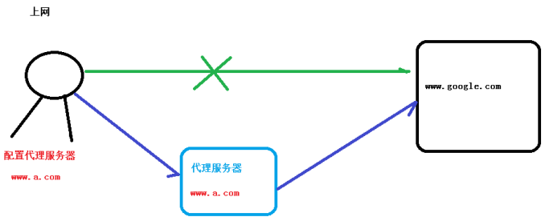
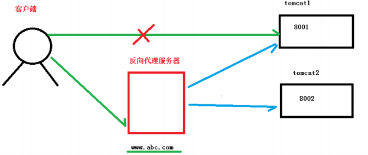
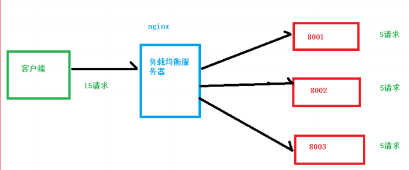
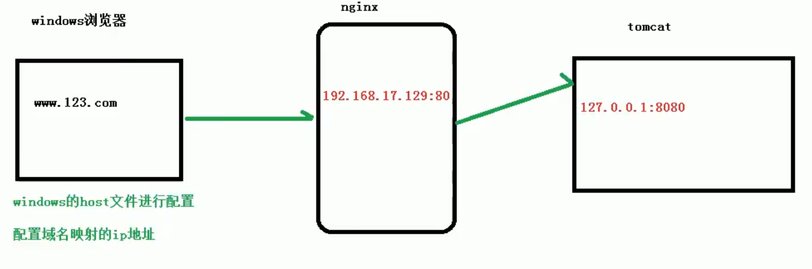
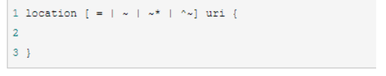
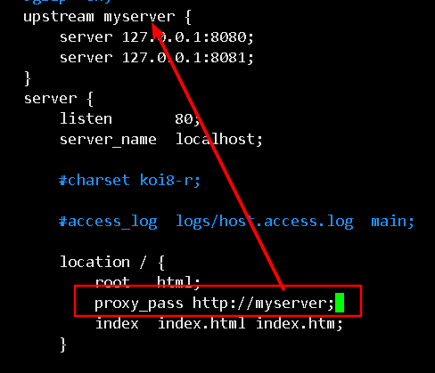
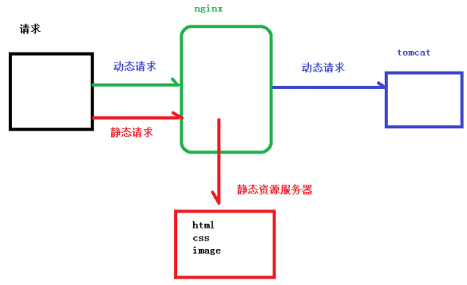
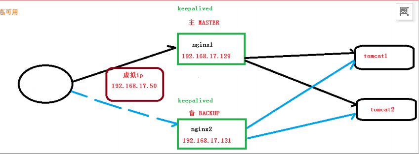
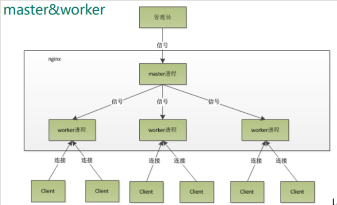
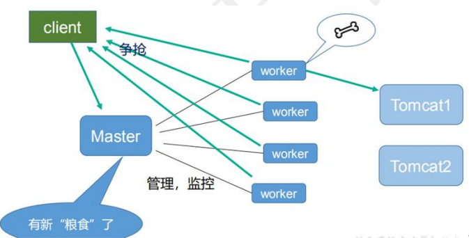

[TOC]


# 1.nginx简介

## 什么是 nginx

Nginx 可以作为静态页面的 web 服务器，同时还支持 CGI 协议的动态语言，比如 perl、php等。但是不支持 java。Java 程序只能通过与 tomcat 配合完成。Nginx 专为性能优化而开发，性能是其最重要的考量,实现上非常注重效率 ，能经受高负载的考验,有报告表明能支持高达 50,000 个并发连接数。

Nginx 是高性能的 HTTP 和反向代理的服务器，处理高并发能力是十分强大的，能经受高负
载的考验,有报告表明能支持高达 **50,000 个并发连接数**。

https://lnmp.org/nginx.html

## 正向代理

需要在客户端配置代理服务器进行指定网站访问




## 反向代理

暴露的是代理服务器地址，隐藏了真实服务器 IP 地址。

反向代理，其实客户端对代理是无感知的，因为客户端不需要任何配置就可以访问，我们只
需要将请求发送到反向代理服务器，由反向代理服务器去选择目标服务器获取数据后，在返
回给客户端，此时反向代理服务器和目标服务器对外就是一个服务器，暴露的是代理服务器
地址，隐藏了真实服务器 IP 地址。




## 负载均衡

增加服务器的数量，然后将请求分发到各个服务器上，将原先请求集中到单个服务器上的情况改为将请求分发到多个服务器上，将负载分发到不同的服务器，也就是我们所说的负载均衡




## 动静分离

为了加快网站的解析速度，可以把动态页面和静态页面由不同的服务器来解析，加快解析速
度。降低原来单个服务器的压力。


# Nginx 的安装

安装Nginx

启动：

安装目录：**/usr/local/nginx/sbin**

`./nginx`

查看进程

```bash
[root@HSQ sbin]# ps -ef|grep nginx
root      4365     1  0 14:53 ?        00:00:00 nginx: master process ./nginx
nobody    4366  4365  0 14:53 ?        00:00:00 nginx: worker process
root      4393 31710  0 14:54 pts/0    00:00:00 grep --color=auto nginx

```

打开配置文件`/usr/local/nginx/conf/nginx.conf`

```
server {
        listen       80;
        server_name  localhost;

        #charset koi8-r;

        #access_log  logs/host.access.log  main;

        location / {
            root   html;
            index  index.html index.htm;
        }

        #error_page  404              /404.html;

        # redirect server error pages to the static page /50x.html
        #
        error_page   500 502 503 504  /50x.html;
        location = /50x.html {
            root   html;
        }
}
```

防火墙开启80端口

查看开放的端口号
firewall-cmd --list-all

设置开放的端口号
firewall-cmd --add-service=http –permanent
firewall-cmd --add-port=80/tcp --permanent
重启防火墙
firewall-cmd –reload

访问：

`ip:80`

# Nginx常用命令

/usr/local/nginx/sbin

查看版本号

```bash
[root@HSQ sbin]# ./nginx -v
nginx version: nginx/1.18.0
```

启动Nginx

```bash
./nginx
```

关闭Nginx

```bash
./nginx -s stop
```

重加载

改了配置文件后，重新加载，不需要重启

```bash
./nginx -s reload
```

## Nginx配置文件

## 位置

/usr/local/nginx/conf/nginx.conf

## 组成

### 全局块

配置服务器整体运行的配置指令

从配置文件开始到 events 块之间的内容，主要会设置一些影响 nginx 服务器整体运行的配置指令，主要包括配置运行 Nginx 服务器的用户（组）、允许生成的 worker process 数，进程 PID 存放路径、日志存放路径和类型以及配置文件的引入等。
 比如上面第一行配置的：

比如` worker_processes 1`;处理并发数的配置

这是 Nginx 服务器并发处理服务的关键配置，worker_processes 值越大，可以支持的并发处理量也越多，但是会受到硬件、软件等设备的制约

### events 块

影响 Nginx 服务器与用户的网络连接
比如 `worker_connections 1024`; 支持的最大连接数为 1024

```
events {
    worker_connections  1024;
}
```


这部分的配置对 Nginx 的性能影响较大，在实际中应该灵活配置。

### http 块

实际配置最频繁的部分，还包含两部分：http 全局块，server 块

#### http 全局块

http 全局块配置的指令包括文件引入、MIME-TYPE 定义、日志自定义、连接超时时间、单链接请求数上限等。

```properties
include       mime.types;
default_type  application/octet-stream;

#log_format  main '$remote_addr - $remote_user [$time_local] "$request" '
#                  '$status $body_bytes_sent "$http_referer" '
#                  '"$http_user_agent" "$http_x_forwarded_for"';

#access_log  logs/access.log  main;

sendfile        on;
#tcp_nopush     on;

#keepalive_timeout  0;
keepalive_timeout  65;

#gzip  on;
```

#### server 块

这块和虚拟主机有密切关系，虚拟主机从用户角度看，和一台独立的硬件主机是完全一样的，该技术的产生是为了节省互联网服务器硬件成本。
 每个 http 块可以包括多个 server 块，而每个 server 块就相当于一个虚拟主机。
 而每个 server 块也分为全局 server 块，以及可以同时包含多个 locaton 块。

1、全局 server 块
 最常见的配置是本虚拟机主机的监听配置和本虚拟主机的名称或 IP 配置。
 2、location 块
 一个 server 块可以配置多个 location 块。
 这块的主要作用是基于 Nginx 服务器接收到的请求字符串（例如 server_name/uri-string），对虚拟主机名称（也可以是 IP 别名）之外的字符串（例如 前面的 /uri-string）进行匹配，对特定的请求进行处理。地址定向、数据缓存和应答控制等功能，还有许多第三方模块的配置也在这里进行。

```properties
 server {
        listen       80;
        server_name  localhost;

        #charset koi8-r;

        #access_log  logs/host.access.log  main;

        location / {
            root   html;
            index  index.html index.htm;
        }

        #error_page  404              /404.html;

        # redirect server error pages to the static page /50x.html
        #
        error_page   500 502 503 504  /50x.html;
        location = /50x.html {
            root   html;
        }

        # proxy the PHP scripts to Apache listening on 127.0.0.1:80
        #
        #location ~ \.php$ {
        #    proxy_pass   http://127.0.0.1;
        #}

        # pass the PHP scripts to FastCGI server listening on 127.0.0.1:9000
        #
        #location ~ \.php$ {
        #    root           html;
        #    fastcgi_pass   127.0.0.1:9000;
        #    fastcgi_index  index.php;
        #    fastcgi_param  SCRIPT_FILENAME  /scripts$fastcgi_script_name;
        #    include        fastcgi_params;
        #}

        # deny access to .htaccess files, if Apache's document root
        # concurs with nginx's one
        #
        #location ~ /\.ht {
        #    deny  all;
        #}
    }
```

# nginx 配置实例-反向代理

## 反向代理实例一

实现效果：使用 nginx 反向代理，访问 www.123.com 直接跳转到 127.0.0.1:8080

1. 启动tomcat，保证8080能访问



2. 在windows hosts文件中添加：

   `ip www.hsq.com`

3. 在 nginx.conf 配置文件中增加如下配置

```properties
server {
        listen       80;
        server_name  localhost;

        #charset koi8-r;

        #access_log  logs/host.access.log  main;

        location / {
            root   html;
            proxy_pass http://127.0.0.1:8080; # 增加这一行
            index  index.html index.htm;
        }
}
```

4. 重载配置文件

   ` ./nginx -s reload`

5. 访问www.hsq.com

## 反向代理实例二

实现效果：使用 nginx 反向代理，根据访问的路径跳转到不同端口的服务中
nginx 监听端口为 9001，
访问 http://127.0.0.1:9001/edu/ 直接跳转到 127.0.0.1:8081
访问 http://127.0.0.1:9001/vod/ 直接跳转到 127.0.0.1:8082

1. 准备2个tomcat服务器，一个 8001 端口，一个 8002 端口

   - 在/usr/scr下建立2个文件夹

     `mkdir tomcat8080 tomcat8081`

   - 复制原来的tomcat安装目录到tomcat8081和tomcat8080

     `cp -r /home/apache-tomcat-9.0.37/ /usr/src/tomcat8081` 

   - 修改配置 apache-tomcat-9.0.37/conf/server.xml

     - shutdown端口改为8015,这个端口负责监听关闭Tomcat的请求

       \<Server port="8015" shutdown="SHUTDOWN">

       shutdown:向以上端口发送的关闭服务器的命令字符串

     - 8080改为8081

       ```xml
       <Connector port="8081" protocol="HTTP/1.1"
                      connectionTimeout="20000"
                      redirectPort="8443" />
       ```

     - AJP端口由8009改为8019,先打开注释

       AJP端口不是给浏览器访问用的，AJP和HTTP是完全不同的协议，AJP是专门用于Apache+TOMCAT 或者NGINX+TOMCAT方式做集群负载时用的。

       ```xml
       <Connector protocol="AJP/1.3"
                      address="::1"
                      port="8019"
                      redirectPort="8443" />
       ```

   - 到tomcat的bin目录下启动

     `./startup.sh`

   - 开放8081端口，重启防火墙`firewall-cmd --reload`

   - webapp目录下分别创建edu和vod目录

     - 都放入a.html

       ```html
       <h1>8080</h1>
       ```

       ```html
       <h1>8081</h1>
       ```

   - 访问

     - http://123.56.94.155:8080/edu/a.html
     - http://123.56.94.155:8081/vod/a.html

2. 配置Nginx

```
 server {
        listen       9001;
         server_name  localhost;

        location ~ /edu/ {
            proxy_pass http:127.0.0.1:8080;
            root   html;
            index  index.html index.htm;
        }
        location ~ /vod/{
            proxy_pass http:127.0.0.1:8081;
            root   html;
            index  index.html index.htm;
        }
    }

```

重载配置文件

./nginx -s reload

3. 访问


## location 指令说明

该指令用于匹配 URL。
 语法如下：



1、= ：用于不含正则表达式的 uri 前，要求请求字符串与 uri 严格匹配，如果匹配
成功，就停止继续向下搜索并立即处理该请求。
 2、~：用于表示 uri 包含正则表达式，并且区分大小写。
 3、~*：用于表示 uri 包含正则表达式，并且不区分大小写。
 4、^~：用于不含正则表达式的 uri 前，要求 Nginx 服务器找到标识 uri 和请求字
符串匹配度最高的 location 后，立即使用此 location 处理请求，而不再使用 location 
块中的正则 uri 和请求字符串做匹配。
 注意：如果 uri 包含正则表达式，则必须要有 ~ 或者 ~* 标识。

# nginx 配置实例-负载均衡

## 1、实现效果

（1）浏览器地址栏输入地址 http://ip/edu/a.html，负载均衡效果，**平均 8080**
**和 8081 端口**中

## 2、准备工作

（1）准备两台 tomcat 服务器，一台 8080，一台 8081
（2）在两台 tomcat 里面 webapps 目录中，创建名称是 edu 文件夹，在 edu 文件夹中创建页面 a.html，用于测试

## 3、在 nginx 的配置文件中进行负载均衡的配置

在http块里面增加

```
upstream myserver {
        server 127.0.0.1:8080;  //只有一台阿里云服务器，所以设置本机地址就行
        server 127.0.0.1:8081;  //实际中，是填写的服务器内网地址
    }

```



重载配置

```
./nginx -s reload
```

访问


刷新几次：


把请求分担到不同的服务器，这就是负载均衡

## 4、nginx 分配服务器策略

随着互联网信息的爆炸性增长，负载均衡（load balance）已经不再是一个很陌生的话题，
顾名思义，负载均衡即是将负载分摊到不同的服务单元，既保证服务的可用性，又保证响应
足够快，给用户很好的体验。快速增长的访问量和数据流量催生了各式各样的负载均衡产品，
很多专业的负载均衡硬件提供了很好的功能，但却价格不菲，这使得负载均衡软件大受欢迎，
nginx 就是其中的一个，在 linux 下有 Nginx、LVS、Haproxy 等等服务可以提供负载均衡服
务，而且 Nginx 提供了几种分配方式(策略)：

1、轮询（默认）
每个请求按时间顺序逐一分配到不同的后端服务器，如果后端服务器挂掉，能自动剔除。
2、weight
weight 代表权,重默认为 1,权重越高被分配的客户端越多
指定轮询几率，weight 和访问比率成正比，用于后端服务器性能不均的情况。 例如：

```
upstream server_pool{ 
server 192.168.5.21 weight=10; 
server 192.168.5.22 weight=10; 
}
```

3、ip_hash

**每个请求按访问 ip 的 hash 结果分配**，这样每个访客固定访问一个后端服务器，可以解决 session 的问题。 例如

```
upstream server_pool{ 
ip_hash; 
server 192.168.5.21:80; 
server 192.168.5.22:80; 
}
```

4、fair（第三方）

按后端服务器的响应时间来分配请求，**响应时间短的优先分配**。

```
upstream server_pool{ 
server 192.168.5.21:80; 
server 192.168.5.22:80; 
fair; 
}
```

# nginx 配置实例-动静分离

Nginx 动静分离简单来说就是把动态跟静态请求分开，不能理解成只是单纯的把动态页面和静态页面物理分离。严格意义上说应该是动态请求跟静态请求分开，可以理解成使用 Nginx 处理静态页面，Tomcat 处理动态页面。动静分离从目前实现角度来讲大致分为两种.

一种是纯粹把**静态文件**独立成单独的域名，放在**独立的服务器**上，也是目前主流推崇的方案；

另外一种方法就是动态跟静态文件混合在一起发布，通过 nginx 来分开。通过 location 指定不同的后缀名实现不同的请求转发。

通过 expires 参数设置，可以使浏览器**缓存过期时间**，减少与服务器之前的请求和流量。具体 Expires 定义：是给一个资源设定一个过期时间，也就是说无需去服务端验证，直接通过浏览器自身确认是否过期即可，所以不会产生额外的流量。此种方法非常适合不经常变动的资源。（如果经常更新的文件，不建议使用 Expires 来缓存），我这里设置 3d，表示在这 3 天之内访问这个 URL，发送一个请求，比对服务器该文件最后更新时间没有变化，则不会从服务器抓取，返回状态码304，如果有修改，则直接从服务器重新下载，返回状态码 200。



## 准备工作

（1）在 liunx 系统中准备静态资源，用于进行访问

​	根目录下创建data目录 ，进去后创建www  image目录

​	www放入a,html  image放入01.jpg

## 具体配置

（1）在 nginx 配置文件中进行配置

​	http块下的server块中添加

        location /www/ {
            root   /data/;
            index  index.html index.htm;
        }
    
        location /image/ {
            root /data/;
            autoindex on;
        }
(2)测试


# Nginx 配置高可用的集群

1.什么是 nginx 高可用

nginx 自己也可能宕机



（1）需要两台 nginx 服务器
（2）需要 keepalived

​	yum命令在线安装

​	`yum install keepalived -y`

（3）需要虚拟 ip

(4)keepalived配置文件

cd /etc/keepalived/

keepalived.conf

配置文件详细说明

https://www.cnblogs.com/ywrj/p/9483427.html

主：

```bash
! Configuration File for keepalived              

global_defs {                        #全局定义部分
   notification_email {              #设置警报邮箱
     acassen@firewall.loc            #邮箱
     failover@firewall.loc
     sysadmin@firewall.loc
   }
   notification_email_from Alexandre.Cassen@firewall.loc    #设置发件人地址
   smtp_server 192.168.50.1        #设置smtp server地址
   smtp_connect_timeout 30         #设置smtp超时连接时间    以上参数可以不配置
   router_id LVS_DEVEL            #是Keepalived服务器的路由标识在一个局域网内，这个标识（router_id）是唯一的
}

vrrp_instance VI_1 {      #VRRP实例定义区块名字是VI_1
    state MASTER          #表示当前实例VI_1的角色状态这个状态只能有MASTER和BACKUP两种状态，并且需要大写这些字符ASTER为正式工作的状态，BACKUP为备用的状态
    interface eth0       
    virtual_router_id 51 #虚拟路由ID标识,这个标识最好是一个数字,在一个keepalived.conf配置中是唯一的, MASTER和BACKUP配置中相同实例的virtual_router_id必须是一致的.
    priority 100                #priority为优先级 越大越优先
    advert_int 1               #为同步通知间隔。MASTER与BACKUP之间通信检查的时间间隔，单位为秒，默认为1.
    authentication {           #authentication为权限认证配置不要改动,同一vrrp实例的MASTER与BACKUP使用相同的密码才能正常通信。
        auth_type PASS
        auth_pass 1111
    }
    virtual_ipaddress {         #设置虚拟IP地址,虚拟ip的前三段要和两台服务器ip在同一段，即一样
        192.168.50.16         #此格式ip a显示 ifconfig不显示
        192.168.50.17/24 dev eth0 label eth0:1    #绑定接口为eth0，别名为eth0：1
   }
#至此为止以上为实现高可用配置,如只需使用高可用功能下边配置可删除
#以下为虚拟服务器定义部分
virtual_server 192.168.50.16 80 {      #设置虚拟服务器,指定虚拟IP和端口
    delay_loop 6                           #健康检查时间为6秒
    lb_algo rr                               #设置负载调度算法 rr算法
    lb_kind NAT                            #设置负载均衡机制 #有NAT,TUN和DR三种模式可选
    nat_mask 255.255.255.0         #非NAT模式注释掉此行  注释用!号
    persistence_timeout 50           #连接保留时间,50秒无响应则重新分配节点
    protocol TCP                           #指定转发协议为TCP 
    real_server 192.168.5.150 80 {      #RS节点1
        weight 1                #权重
        TCP_CHECK {             #节点健康检查
        connect_timeout 8       #延迟超时时间
        nb_get_retry 3          #重试次数
        delay_before_retry 3    #延迟重试次数
        connect_port 80         #利用80端口检查
    }
    }
    real_server 192.168.50.149 80 {      #RS节点2
        weight 1
        TCP_CHECK {
        connect_timeout 8
        nb_get_retry 3
        delay_before_retry 3
        connect_port 80 
    }
    }
}
```

配置完毕后启动keepalived 并检测是否有虚拟端口

```bash
/etc/init.d/keepalived start
ip a | grep 192.168.50.16            #出现上述带有vip:192.168.50.16行的结果表示lb01的Keepalived服务单实例配置成功
```

从：

```bash
! Configuration File for keepalived
global_defs {
   notification_email {
    215379068@qq.com
   }
   notification_email_from Alexandre.Cassen@firewall.loc
   smtp_server 127.0.0.1
   smtp_connect_timeout 30
   router_id lb02               #此参数和lb01 MASTER不同
}
vrrp_instance VI_1 {            #和lb01 MASTER相同
    state BACKUP                #此参数和lb01 MASTER不同
    interface eth0              #和lb01 MASTER相同
    virtual_router_id 55        #和lb01 MASTER相同
    priority 90                 #此参数和lb01 MASTER不同
    advert_int 1
    authentication {
        auth_type PASS
        auth_pass 1111
    }
    virtual_ipaddress {
    192.168.50.17/24 dev eth0 label eth0:1
    }
}　　　　　　　　　　　　#以下都相同
```


2.完成高可用配置（主从配置）

（1）修改/etc/keepalived/keepalivec.conf 配置文件

(2)脚本

```bash
#!/bin/bash
A=`ps -C nginx –no-header |wc -l`
if [ $A -eq 0 ];then
        /usr/sbin/nginx
        sleep 2
        if [ `ps -C nginx --no-header |wc -l` -eq 0 ];then
                killall keepalived
        fi
fi
```

# Nginx 的原理

## mater 和 worker



worker 如何进行工作的



## 一个 master 和多个 woker 有好处

（1）可以使用 nginx –s reload 热部署，利用 nginx 进行热部署操作
（2）每个 woker 是独立的进程，如果有其中的一个 woker 出现问题，其他 woker 独立的，
继续进行争抢，实现请求过程，不会造成服务中断

## 设置多少个 woker 合适

worker 数和服务器的 cpu 数相等是最为适宜的

## 连接数 worker_connection

第一个：发送请求，占用了 woker 的几个连接数？
答案：2 或者 4 个

访问worker一来一回就2个了，如果再有tomcat，worker还要去连接tomcat，一来一回又是2个

第二个：nginx 有一个 master，有四个 woker，每个 woker 支持最大的连接数 1024，支持的
最大并发数是多少？

- 普通的静态访问最大并发数是： worker_connections * worker_processes /2，
- 而如果是 HTTP 作 为反向代理来说，最大并发数量应该是 worker_connections * 
  worker_processes/4。