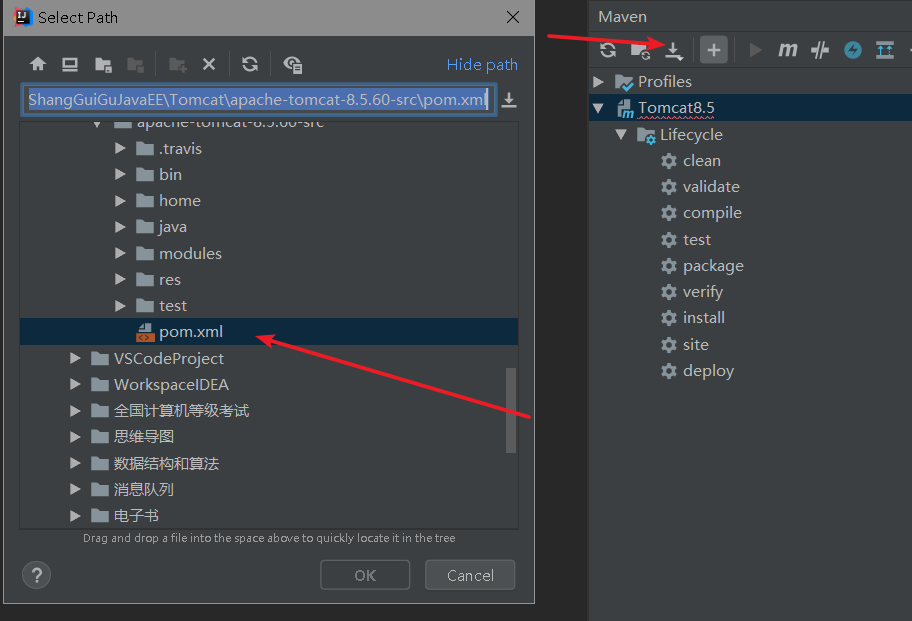
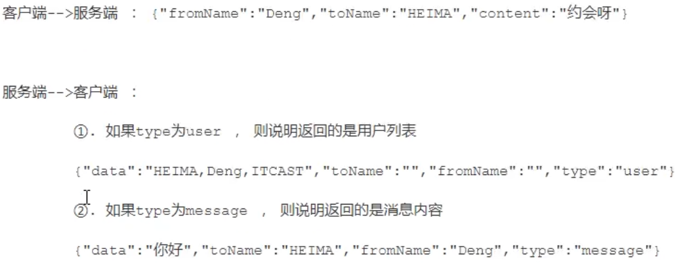

# 第1章 Tomecat基础

## web的相关概念

软件架构

- CS架构：QQ、360

- BS架构：浏览器上的网页：京东，淘宝等

资源分类：

- 静态资源

  每个用户访问后得到的结果是一样的，浏览器可以直接解析的：html，css,js, 图片视频等文件

- 动态资源

  每个用户访问相同的资源后，得到的结果可能不一样。动态资源被访问后，需要转为静态资源，再给浏览器解析
  serlet、jsp、php、asp......


网络通信三要素

- ip
- 端口
- 协议 tcp udp http

## 常见Java web服务器

- webLogic  大型的，收费,oracle
- webSphere  大型 ，收费，IBM
- JBOSS 大型，收费，JBOSS
- Tomcat ，中小型，开源免费，Apache，仅支持少量JavaEE规范servlet/jsp

## 下载安装

略

## 目录结构

**bin目录**

存放Tomcat的启动、停止等批处理脚本文件

- startup.bat，startup.sh 用于在windows和linux下的启动脚本

- shutdown.bat,shutdown.sh  用于在windows和linux下的停止脚本

**conf目录** 

用于存放Tomcat的相关配置文件

- Catalina  用于存储针对每个虚拟机的Context配置

- context.xml 用于定义所有web应用均需加载的Context配置，如果web应用指定了自己的context.xml，该文件将被覆盖

- catalina.properties  Tomcat 的环境变量配置
- catalina.policy   Tomcat 运行的安全策略配置
- logging.properties Tomcat 的日志配置文件， 可以通过该文件修改Tomcat 的日志级别及日志路径等
- server.xml   Tomcat 服务器的核心配置文件
- tomcat-users.xml  定义Tomcat默认的用户及角色映射信息配置
- web.xml Tomcat 中所有应用默认的部署描述文件， 主要定义了基础Servlet和MIME映射。

**lib目录** 

Tomcat 服务器的依赖包

**logs目录**  

Tomcat 默认的日志存放目录

**webapps目录**  

Tomcat 默认的Web应用部署目录

**work目录** 

Web 应用JSP代码生成和编译的临时目录

## **Tomcat**源码

到tomcat官网下载tomcat8的源码zip压缩包：apache-tomcat-8.5.60-src.zip

IDEA创建一个**空项目**

1） 解压zip压缩包
2） 进入解压目录，并创建一个目录，命名为home ， 并将conf、webapps目录移入
home 目录中
3） 在当前目录下创建一个 pom.xml 文件，引入tomcat的依赖包

```xml
<?xml version="1.0" encoding="UTF‐8"?>
<project xmlns="http://maven.apache.org/POM/4.0.0"
         xmlns:xsi="http://www.w3.org/2001/XMLSchema‐instance"
         xsi:schemaLocation="http://maven.apache.org/POM/4.0.0
                             http://maven.apache.org/xsd/maven‐4.0.0.xsd">
    <modelVersion>4.0.0</modelVersion>
    <groupId>org.apache.tomcat</groupId>
    <artifactId>apache‐tomcat‐8.5.42‐src</artifactId>
    <name>Tomcat8.5</name>
    <version>8.5</version>
    <build>
        <finalName>Tomcat8.5</finalName>
        <sourceDirectory>java</sourceDirectory>
        <!‐‐ <testSourceDirectory>test</testSourceDirectory>‐‐>
        <resources>
            <resource>
                <directory>java</directory>
            </resource>
        </resources>
        <!‐‐ <testResources>
        <testResource>
            <directory>test</directory>
        </testResource>
        </testResources>‐‐>
        <plugins>
            <plugin>
                <groupId>org.apache.maven.plugins</groupId>
                <artifactId>maven‐compiler‐plugin</artifactId>
                <version>2.3</version>
                <configuration>
                    <encoding>UTF‐8</encoding>
                    <source>1.8</source>
                    <target>1.8</target>
                </configuration>
            </plugin>
        </plugins>
    </build>
    <dependencies>
        <dependency>
            <groupId>junit</groupId>
            <artifactId>junit</artifactId>
            <version>4.12</version>
            <scope>test</scope>
        </dependency>
        <dependency>
            <groupId>org.easymock</groupId>
            <artifactId>easymock</artifactId>
            <version>3.4</version>
        </dependency>
        <dependency>
            <groupId>ant</groupId>
            <artifactId>ant</artifactId>
            <version>1.7.0</version>
        </dependency>
        <dependency>
            <groupId>wsdl4j</groupId>
            <artifactId>wsdl4j</artifactId>
            <version>1.6.2</version>
        </dependency>
        <dependency>
            <groupId>javax.xml</groupId>
            <artifactId>jaxrpc</artifactId>
            <version>1.1</version>
        </dependency>
        <dependency>
            <groupId>org.eclipse.jdt.core.compiler</groupId>
            <artifactId>ecj</artifactId>
            <version>4.5.1</version>
        </dependency>
    </dependencies>
</project>
```

4） 在idea中， 导入该工程。



5） 配置idea的启动类， 配置 MainClass ， 并配置 VM 参数。

main方法路径：org.apache.catalina.startup.Bootstrap

```
-Dcatalina.home=F:\ShangGuiGuJavaEE\Tomcat\apache-tomcat-8.5.60-src/home
-Dcatalina.base=F:\ShangGuiGuJavaEE\Tomcat\apache-tomcat-8.5.60-src/home
-Djava.util.logging.manager=org.apache.juli.ClassLoaderLogManager
-Djava.util.logging.config.file=F:\ShangGuiGuJavaEE\Tomcat\apache-tomcat-8.5.60-src\home\conf\logging.properties
```


6） 启动主方法， 运行Tomcat ， 访问Tomcat 。


控制台乱码问题：

https://blog.csdn.net/zhoutaoping1992/article/details/104751705/

# 第2章 Tomcat 架构

## **Http**工作原理

HTTP协议是浏览器与服务器之间的数据传送协议。作为应用层协议，HTTP是基于TCP/IP协议来传递数据的（HTML文件、图片、查询结果等），HTTP协议不涉及数据包（Packet）传输，主要规定了客户端和服务器之间的通信格式。


1） 用户通过浏览器进行了一个操作，比如输入网址并回车，或者是点击链接，接着浏览器获取了这个事件。
2） 浏览器向服务端发出TCP连接请求。
3） 服务程序接受浏览器的连接请求，并经过TCP三次握手建立连接。
4） 浏览器将请求数据打包成一个HTTP协议格式的数据包。
5） 浏览器将该数据包推入网络，数据包经过网络传输，最终达到端服务程序。
6） 服务端程序拿到这个数据包后，同样以HTTP协议格式解包，获取到客户端的意图。
7） 得知客户端意图后进行处理，比如提供静态文件或者调用服务端程序获得动态结果。
8） 服务器将响应结果（可能是HTML或者图片等）按照HTTP协议格式打包。
9） 服务器将响应数据包推入网络，数据包经过网络传输最终达到到浏览器。
10） 浏览器拿到数据包后，以HTTP协议的格式解包，然后解析数据，假设这里的数据是HTML。
11） 浏览器将HTML文件展示在页面上。
那我们想要探究的Tomcat作为一个HTTP服务器，在这个过程中都做了些什么事情呢？主要是接受连接、解析请求数据、处理请求和发送响应这几个步骤。

## Tomcat整体架构

###  Http服务器请求处理

浏览器发给服务端的是一个HTTP格式的请求，HTTP服务器收到这个请求后，需要调用服务端程序来处理，所谓的服务端程序就是你写的Java类，一般来说不同的请求需要由不同的Java类来处理


1） 图1 ， 表示HTTP服务器直接调用具体业务类，它们是紧耦合的。

2） 图2，HTTP服务器不直接调用业务类，而是把请求交给容器来处理，容器通过Servlet接口调用业务类。因此Servlet接口和Servlet容器的出现，达到了HTTP服务器与业务类解耦的目的。而Servlet接口和Servlet容器这一整套规范叫作Servlet规范。Tomcat按照Servlet规范的要求实现了Servlet容器，同时它们也具有HTTP服务器的功能。作为Java程序员，如果我们要实现新的业务功能，只需要实现一个Servlet，并把它注册到Tomcat（Servlet容器）中，剩下的事情就由Tomcat帮我们处理了。

### Servlet容器工作流程

为了解耦，HTTP服务器不直接调用Servlet，而是把请求交给Servlet容器来处理，那Servlet容器又是怎么工作的呢？

当客户请求某个资源时，HTTP服务器会用一个ServletRequest对象把客户的请求信息封装起来，然后调用Servlet容器的service方法，Servlet容器拿到请求后，根据请求的URL和Servlet的映射关系，找到相应的Servlet，如果Servlet还没有被加载，就用反射机制创建这个Servlet，并调用Servlet的init方法来完成初始化，接着调用Servlet的service方法来处理请求，把ServletResponse对象返回给HTTP服务器，HTTP服务器会把响应发送给客户端。


###  Tomcat整体架构

我们知道如果要设计一个系统，首先是要了解需求，我们已经了解了Tomcat要实现两个核心功能：
1） 处理Socket连接，负责网络字节流与Request和Response对象的转化。
2） 加载和管理Servlet，以及具体处理Request请求。
因此Tomcat设计了两个核心组件连接器（Connector）和容器（Container）来分别做这两件事情。连接器负责对外交流，容器负责内部处理。


## 连接器 - Coyote

### 架构介绍

​		Coyote 是Tomcat的连接器框架的名称 , 是Tomcat服务器提供的供客户端访问的外部接口。客户端通过Coyote与服务器建立连接、发送请求并接受响应 。

​		Coyote 封装了底层的网络通信（Socket 请求及响应处理），为**Catalina 容器**提供了统一的接口，使Catalina 容器与具体的请求协议及IO操作方式完全解耦。Coyote 将Socket 输入转换封装为 Request 对象，交由Catalina 容器进行处理，处理请求完成后, Catalina 通过Coyote 提供的Response 对象将结果写入输出流 。

​		Coyote 作为独立的模块，只负责具体协议和IO的相关操作， 与Servlet 规范实现没有直接关系，因此即便是 Request 和 Response 对象也并未实现Servlet规范对应的接口， 而是在Catalina 中将他们进一步封装为ServletRequest 和 ServletResponse 。


###  IO模型与协议

在Coyote中 ， Tomcat支持的多种I/O模型和应用层协议，具体包含哪些IO模型和应用层协议，请看下表：
Tomcat 支持的IO模型（自8.5/9.0 版本起，Tomcat 移除了 对 BIO 的支持）：


Tomcat 支持的应用层协议 ：


协议分层 ：


在 8.0 之前 ， Tomcat 默认采用的I/O方式为 BIO ， 之后改为 NIO。 无论 NIO、NIO2还是 APR， 在性能方面均优于以往的BIO。 如果采用APR， 甚至可以达到 Apache HTTP Server 的影响性能。


Tomcat为了实现支持多种I/O模型和应用层协议，一个容器可能对接多个连接器，就好比一个房间有多个门。但是单独的连接器或者容器都不能对外提供服务，需要把它们组装起来才能工作，组装后这个整体叫作Service组件。这里请你注意，Service本身没有做什么重要的事情，只是在连接器和容器外面多包了一层，把它们组装在一起。Tomcat内可能有多个Service，这样的设计也是出于灵活性的考虑。通过在Tomcat中配置多个Service，可以实现通过不同的端口号来访问同一台机器上部署的不同应用。

### 连接器组件


连接器中的各个组件的作用如下：

**EndPoint**

1） EndPoint ： Coyote 通信端点，即通信监听的接口，是具体Socket接收和发送处理器，是对传输层的抽象，因此EndPoint用来实现TCP/IP协议的。

2） Tomcat 并没有EndPoint 接口，而是提供了一个抽象类AbstractEndpoint ， 里面定义了两个内部类：Acceptor和SocketProcessor。Acceptor用于监听Socket连接请求。SocketProcessor用于处理接收到的Socket请求，它实现Runnable接口，在Run方法里调用协议处理组件Processor进行处理。为了提高处理能力，SocketProcessor被提交到线程池来执行。而这个线程池叫作执行器（Executor)，在后面的专栏会详细介绍Tomcat如何扩展原生的Java线程池。

**Processor**

Processor ： Coyote 协议处理接口 ，如果说EndPoint是用来实现TCP/IP协议的，那么Processor用来实现HTTP协议，Processor接收来自EndPoint的Socket，读取字节流解析成Tomcat Request和Response对象，并通过Adapter将其提交到容器处理，Processor是对应用层协议的抽象。

**ProtocolHandler**

ProtocolHandler： Coyote 协议接口， 通过Endpoint 和 Processor ， 实现针对具体协议的处理能力。Tomcat 按照协议和I/O 提供了6个实现类 ： AjpNioProtocol ，AjpAprProtocol， AjpNio2Protocol ， Http11NioProtocol ，Http11Nio2Protocol ，Http11AprProtocol。我们在配置tomcat/conf/server.xml 时 ， 至少要指定具体的ProtocolHandler , 当然也可以指定协议名称 ， 如 ： HTTP/1.1 ，如果安装了APR，那么将使用Http11AprProtocol ， 否则使用Http11NioProtocol 

**Adapter**

由于协议不同，客户端发过来的请求信息也不尽相同，Tomcat定义了自己的Request类来“存放”这些请求信息。ProtocolHandler接口负责解析请求并生成Tomcat Request类。但是这个Request对象不是标准的ServletRequest，也就意味着，不能用Tomcat Request作为参数来调用容器。Tomcat设计者的解决方案是引入CoyoteAdapter，这是**适配器模式**的经典运用，连接器调用CoyoteAdapter的Sevice方法，传入的是Tomcat  Request对象，CoyoteAdapter负责将Tomcat Request转成ServletRequest，再调用容器的Service方法。

## 容器 - Catalina

Tomcat是一个由一系列可配置的组件构成的Web容器，而Catalina是Tomcat的servlet容
器。

Catalina 是Servlet 容器实现，包含了之前讲到的所有的容器组件，以及后续章节涉及到的安全、会话、集群、管理等Servlet 容器架构的各个方面。它通过松耦合的方式集成Coyote，以完成按照请求协议进行数据读写。同时，它还包括我们的启动入口、Shell程序等。

### Catalina 地位


Tomcat 本质上就是一款 Servlet 容器， 因此Catalina 才是 Tomcat 的核心 ， 其他模块都是为Catalina 提供支撑的。 比如 ： 通过Coyote 模块提供链接通信，Jasper 模块提供JSP引擎，Naming 提供JNDI 服务，Juli 提供日志服务。

上面这个图和tomcat源码包是对应的：


### Catalina 结构

Catalina 的主要组件结构如下：

如上图所示，Catalina负责管理Server，而Server表示着整个服务器。Server下面有多个服务Service，每个服务都包含着多个连接器组件Connector（Coyote 实现）和一个容器组件Container。在Tomcat 启动的时候， 会初始化一个Catalina的实例

Catalina 各个组件的职责：


###  Container 结构

Tomcat设计了4种容器，分别是Engine、Host、Context和Wrapper。这4种容器不是平行关系，而是父子关系。， Tomcat通过一种分层的架构，使得Servlet容器具有很好的灵活性。


各个组件的含义 ：


我们也可以再通过Tomcat的server.xml配置文件来加深对Tomcat容器的理解。Tomcat采用了组件化的设计，它的构成组件都是可配置的，其中最外层的是Server，其他组件按照一定的格式要求配置在这个顶层容器中。


那么，Tomcat是怎么管理这些容器的呢？你会发现这些容器具有父子关系，形成一个树形结构，你可能马上就想到了设计模式中的组合模式。没错，Tomcat就是用组合模式来管理这些容器的。具体实现方法是，所有容器组件都实现了Container接口，因此组合模式可以使得用户对单容器对象和组合容器对象的使用具有一致性。这里单容器对象指的是最底层的Wrapper，组合容器对象指的是上面的Context、Host或者Engine


Container 接口中提供了以下方法（截图中知识一部分方法） ：


在上面的接口看到了getParent、SetParent、addChild和removeChild等方法。
Container接口扩展了LifeCycle接口，LifeCycle接口用来统一管理各组件的生命周期

## Tomcat 启动流程

### 流程


步骤 :
1） 启动tomcat ， 需要调用 bin/startup.bat (在linux 目录下 , 需要调用 bin/startup.sh)， 在startup.bat 脚本中, 调用了catalina.bat。
2） 在catalina.bat 脚本文件中，调用了**BootStrap** 中的main方法。
3）在BootStrap 的main 方法中调用了 init 方法 ， 来创建Catalina 及 初始化类加载器。
4）在BootStrap 的main 方法中调用了 load 方法 ， 在其中又调用了Catalina的load方
法。
5）在Catalina 的load 方法中 , 需要进行一些初始化的工作, 并需要构造Digester 对象, 用
于解析 XML。
6） 然后在调用后续组件的初始化操作 。。。
加载Tomcat的配置文件，初始化容器组件 ，监听对应的端口号， 准备接受客户端请求。


### 源码解析

####  Lifecycle

​		由于所有的组件均存在初始化、启动、停止等生命周期方法，拥有生命周期管理的特性， 所以Tomcat在设计的时候， 基于生命周期管理抽象成了一个接口 Lifecycle ，而组件 Server、Service、Container、Executor、Connector 组件 ， 都实现了一个生命周期的接口，从而具有了以下生命周期中的核心方法：

1） init（）：初始化组件
2） start（）：启动组件
3） stop（）：停止组件
4） destroy（）：销毁组件


#### 各组件的默认实现

​		上面我们提到的Server、Service、Engine、Host、Context都是接口， 下图中罗列了这些接口的默认实现类。当前对于 Endpoint组件来说，在Tomcat中没有对应的Endpoint接口， 但是有一个抽象类 AbstractEndpoint ，其下有三个实现类： NioEndpoint、Nio2Endpoint、AprEndpoint ， 这三个实现类，分别对应于前面讲解链接器 Coyote时， 提到的链接器支持的三种IO模型：NIO，NIO2，APR ， Tomcat8.5版本中，默认采用的是 NioEndpoint。


ProtocolHandler ： Coyote协议接口，通过封装Endpoint和Processor ， 实现针对具体协议的处理功能。Tomcat按照协议和IO提供了6个实现类。
AJP协议：
1） AjpNioProtocol ：采用NIO的IO模型。
2） AjpNio2Protocol：采用NIO2的IO模型。
3） AjpAprProtocol ：采用APR的IO模型，需要依赖于APR库。
HTTP协议：
1） Http11NioProtocol ：采用NIO的IO模型，默认使用的协议（如果服务器没有安装APR）。
2） Http11Nio2Protocol：采用NIO2的IO模型。
3） Http11AprProtocol ：采用APR的IO模型，需要依赖于APR库。


#### 源码入口

目录： org.apache.catalina.startup

MainClass：BootStrap ‐‐‐‐> main(String[] args)

- main方法调用Bootstrap对象的init()方法


- init()方法通过反射创建Catalina对象

```java
public void init() throws Exception {

    initClassLoaders();

    Thread.currentThread().setContextClassLoader(catalinaLoader);

    SecurityClassLoad.securityClassLoad(catalinaLoader);

    // Load our startup class and call its process() method
    if (log.isDebugEnabled())
        log.debug("Loading startup class");
    Class<?> startupClass = catalinaLoader.loadClass("org.apache.catalina.startup.Catalina");
    Object startupInstance = startupClass.getConstructor().newInstance();

    // Set the shared extensions class loader
    if (log.isDebugEnabled())
        log.debug("Setting startup class properties");
    String methodName = "setParentClassLoader";
    Class<?> paramTypes[] = new Class[1];
    paramTypes[0] = Class.forName("java.lang.ClassLoader");
    Object paramValues[] = new Object[1];
    paramValues[0] = sharedLoader;
    Method method =
        startupInstance.getClass().getMethod(methodName, paramTypes);
    method.invoke(startupInstance, paramValues);

    catalinaDaemon = startupInstance;
}
```

### 总结

​		从启动流程图中以及源码中，我们可以看出Tomcat的启动过程非常标准化， 统一按照生命周期管理接口Lifecycle的定义进行启动。首先调用init() 方法进行组件的逐级初始化操作，然后再调用start()方法进行启动。每一级的组件除了完成自身的处理外，还要负责调用子组件响应的生命周期管理方法，组件与组件之间是松耦合的，因为我们可以很容易的通过配置文件进行修改和替换。

## Tomcat 请求处理流程

### 请求流程

设计了这么多层次的容器，Tomcat是怎么确定每一个请求应该由哪个Wrapper容器里的Servlet来处理的呢？答案是，Tomcat是用Mapper组件来完成这个任务的。

Mapper组件的功能就是将用户请求的URL定位到一个Servlet，它的工作原理是：
Mapper组件里保存了Web应用的配置信息，其实就是容器组件与访问路径的映射关系，比如Host容器里配置的域名、Context容器里的Web应用路径，以及Wrapper容器里Servlet映射的路径，你可以想象这些配置信息就是一个多层次的Map。

当一个请求到来时，Mapper组件通过解析请求URL里的域名和路径，再到自己保存的Map里去查找，就能定位到一个Servlet。请你注意，一个请求URL最后只会定位到一个Wrapper容器，也就是一个Servlet。下面的示意图中 ， 就描述了 当用户请求链接 http://www.itcast.cn/bbs/findAll 之后, 是如何找到最终处理业务逻辑的servlet 。


那上面这幅图只是描述了根据请求的URL如何查找到需要执行的Servlet ， 那么下面我们再来解析一下 ， 从Tomcat的设计架构层面来分析Tomcat的请求处理。


步骤如下:
1) Connector组件Endpoint中的Acceptor监听客户端套接字连接并接收Socket。
2) 将连接交给线程池Executor处理，开始执行请求响应任务。
3) Processor组件读取消息报文，解析请求行、请求体、请求头，封装成Request对象。
4) Mapper组件根据请求行的URL值和请求头的Host值匹配由哪个Host容器、Context容器、Wrapper容器处理请求。
5) CoyoteAdaptor组件负责将Connector组件和Engine容器关联起来，把生成的Request对象和响应对象Response传递到Engine容器中，调用 Pipeline。
6) Engine容器的管道开始处理，管道中包含若干个Valve、每个Valve负责部分处理逻辑。执行完Valve后会执行基础的 Valve--StandardEngineValve，负责调用Host容器的Pipeline。
7) Host容器的管道开始处理，流程类似，最后执行 Context容器的Pipeline。
8) Context容器的管道开始处理，流程类似，最后执行 Wrapper容器的Pipeline。
9) Wrapper容器的管道开始处理，流程类似，最后执行 Wrapper容器对应的Servlet对象的 处理方法。

### 请求流程源码解析


在前面所讲解的Tomcat的整体架构中，我们发现Tomcat中的各个组件各司其职，组件之间松耦合，确保了整体架构的可伸缩性和可拓展性，那么在组件内部，如何增强组件的灵活性和拓展性呢？ 在Tomcat中，每个Container组件采用责任链模式来完成具体的请求处理。

在Tomcat中定义了Pipeline 和 Valve 两个接口，Pipeline 用于构建责任链， 后者代表责任链上的每个处理器。Pipeline 中维护了一个基础的Valve，它始终位于Pipeline的末端（最后执行），封装了具体的请求处理和输出响应的过程。当然，我们也可以调用addValve()方法， 为Pipeline 添加其他的Valve， 后添加的Valve 位于基础的Valve之前，并按照添加顺序执行。Pipiline通过获得首个Valve来启动整合链条的执行 。

# 第3章 Jasper

​		Jasper模块是Tomcat的JSP核心引擎，我们知道JSP本质上是一个Servlet。Tomcat使用Jasper对JSP语法进行解析，生成Servlet并生成Class字节码，用户在进行访问jsp时，会访问Servlet，最终将访问的结果直接响应在浏览器端 。另外，在运行的时候，Jasper还会检测JSP文件是否修改，如果修改，则会重新编译JSP文件。

# 第4章 Tomcat 服务器配置

Tomcat 服务器的配置主要集中于 tomcat/conf 下的 catalina.policy、
catalina.properties、context.xml、server.xml、tomcat-users.xml、web.xml 文件。

## server.xml

### Server

Server是server.xml的根元素，用于创建一个Server实例，默认使用的实现类是
org.apache.catalina.core.StandardServer。

```xml
<Server port="8005" shutdown="SHUTDOWN">
...
</Server>
```

port : Tomcat 监听的关闭服务器的端口。
shutdown： 关闭服务器的指令字符串。
Server内嵌的子元素为 Listener、GlobalNamingResources、Service。

默认配置的5个Listener 的含义

```xml
<!--用于以日志形式输出服务器 、操作系统、JVM的版本信息-->
<Listener className="org.apache.catalina.startup.VersionLoggerListener"/>

<!-- 用于加载（服务器启动） 和 销毁 （服务器停止） APR。 如果找不到APR库， 则会输出日志， 并不影响Tomcat启动-->
<Listener className="org.apache.catalina.core.AprLifecycleListener" SSLEngine="on" />

<!--用于避免JRE内存泄漏问题-->
<Listener className="org.apache.catalina.core.JreMemoryLeakPreventionListener" />

<!--用户加载（服务器启动） 和 销毁（服务器停止） 全局命名服务-->
<Listener className="org.apache.catalina.mbeans.GlobalResourcesLifecycleListener" />

<!--用于在Context停止时重建Executor 池中的线程， 以避免ThreadLocal 相关的内存泄漏 -->
<Listener className="org.apache.catalina.core.ThreadLocalLeakPreventionListener" />
```

GlobalNamingResources 中定义了全局命名服务：

```xml
<!--Global JNDI resources
Documentation at /docs/jndi‐resources‐howto.html
-->
<GlobalNamingResources>
    
<!--Editable user database that can also be used by
UserDatabaseRealm to authenticate users
-->
<Resource name="UserDatabase" auth="Container"
type="org.apache.catalina.UserDatabase"
description="User database that can be updated and saved"
factory="org.apache.catalina.users.MemoryUserDatabaseFactory"
pathname="conf/tomcat‐users.xml" />
</GlobalNamingResources>
```

### Service

​		该元素用于创建 Service 实例，默认使用 org.apache.catalina.core.StandardService。默认情况下，Tomcat 仅指定了Service 的名称， 值为 "Catalina"。Service 可以内嵌的元素为 ： Listener、Executor、Connector、Engine，其中 ： Listener 用于为Service添加生命周期监听器， Executor 用于配置Service 共享线程池，Connector 用于配置Service 包含的链接器， Engine 用于配置Service中链接器对应的Servlet 容器引擎。

```xml
<Service name="Catalina">
...
</Service>
```

一个Server服务器，可以包含多个Service服务。

### Executor

默认情况下，Service 并未添加共享线程池配置。 如果我们想添加一个线程池， 可以在下添加如下配置：

```xml
<Executor name="tomcatThreadPool"
          namePrefix="catalina‐exec‐"
          maxThreads="200"
          minSpareThreads="100"
          maxIdleTime="60000"
          maxQueueSize="Integer.MAX_VALUE"
          prestartminSpareThreads="false"
          threadPriority="5"
          className="org.apache.catalina.core.StandardThreadExecutor"/>
```

属性说明：


如果不配置共享线程池，那么Catalina 各组件在用到线程池时会独立创建。

### Connector

Connector 用于创建链接器实例。默认情况下，server.xml 配置了两个链接器，一个支持HTTP协议，一个支持AJP协议。因此大多数情况下，我们并不需要新增链接器配置，只是根据需要对已有链接器进行优化。

```xml
<Connector port="8080" protocol="HTTP/1.1" connectionTimeout="20000" redirectPort="8443" />
<Connector port="8009" protocol="AJP/1.3" redirectPort="8443" />
```

属性说明：
1） port： 端口号，Connector 用于创建服务端Socket 并进行监听， 以等待客户端请求链接。如果该属性设置为0，Tomcat将会随机选择一个可用的端口号给当前Connector使用。
2） protocol ： 当前Connector 支持的访问协议。 默认为 HTTP/1.1 ， 并采用自动切换机制选择一个基于 JAVA NIO 的链接器或者基于本地APR的链接器（根据本地是否含有Tomcat的本地库判定）。

如果不希望采用上述自动切换的机制， 而是明确指定协议， 可以使用以下值。
Http协议：

```
org.apache.coyote.http11.Http11NioProtocol ， 非阻塞式 Java NIO 链接器
org.apache.coyote.http11.Http11Nio2Protocol ， 非阻塞式 JAVA NIO2 链接器
org.apache.coyote.http11.Http11AprProtocol ， APR 链接器
```

AJP协议 ：

```
org.apache.coyote.ajp.AjpNioProtocol ， 非阻塞式 Java NIO 链接器
org.apache.coyote.ajp.AjpNio2Protocol ，非阻塞式 JAVA NIO2 链接器
org.apache.coyote.ajp.AjpAprProtocol ， APR 链接器
```

3） connectionTimeOut : Connector 接收链接后的等待超时时间， 单位为 毫秒。 -1 表示不超时。

4） redirectPort：当前Connector 不支持SSL请求， 接收到了一个请求， 并且也符合security-constraint 约束， 需要SSL传输，Catalina自动将请求重定向到指定的端口。

5） executor ： 指定共享线程池的名称， 也可以通过maxThreads、minSpareThreads等属性配置内部线程池。

6） URIEncoding : 用于指定编码URI的字符编码， Tomcat8.x版本默认的编码为 UTF-8 ,Tomcat7.x版本默认为ISO-8859-1。

完整的配置如下：

```xml
<Connector port="8080"
           protocol="HTTP/1.1"
           executor="tomcatThreadPool"
           maxThreads="1000"
           minSpareThreads="100"
           acceptCount="1000"
           maxConnections="1000"
           connectionTimeout="20000"
           compression="on"
           compressionMinSize="2048"
           disableUploadTimeout="true"
           redirectPort="8443"
           URIEncoding="UTF‐8" />
```

### Engine

Engine 作为Servlet 引擎的顶级元素，内部可以嵌入： Cluster、Listener、Realm、Valve和Host。

```xml
<Engine name="Catalina" defaultHost="localhost">
...
</Engine>
```

属性说明：
1） name： 用于指定Engine 的名称， 默认为Catalina 。该名称会影响一部分Tomcat的存储路径（如临时文件）。

2） defaultHost ： 默认使用的虚拟主机名称， 当客户端请求指向的主机无效时， 将交由默认的虚拟主机处理， 默认为localhost。

### Host

​		Host 元素用于配置一个虚拟主机， 它支持以下嵌入元素：Alias、Cluster、Listener、Valve、Realm、Context。如果在Engine下配置Realm， 那么此配置将在当前Engine下的所有Host中共享。 同样，如果在Host中配置Realm ， 则在当前Host下的所有Context中共享。Context中的Realm优先级 > Host 的Realm优先级 > Engine中的Realm优先级。

```xml
<Host name="localhost" appBase="webapps" unpackWARs="true"
autoDeploy="true">
...
</Host>
```

属性说明：
1） name: 当前Host通用的网络名称， 必须与DNS服务器上的注册信息一致。 Engine中包含的Host必须存在一个名称与Engine的defaultHost设置一致。

2） appBase： 当前Host的应用基础目录， 当前Host上部署的Web应用均在该目录下（可以是绝对目录，相对路径）。默认为webapps。

3） unpackWARs： 设置为true， Host在启动时会将appBase目录下war包解压为目录。设置为false， Host将直接从war文件启动。

4） autoDeploy： 控制tomcat是否在运行时定期检测并自动部署新增或变更的web应用。

通过给Host添加别名，我们可以实现同一个Host拥有多个网络名称，配置如下：

```xml
<Host name="www.web1.com" appBase="webapps" unpackWARs="true"
autoDeploy="true">
<Alias>www.web2.com</Alias>
</Host>
```

这个时候，我们就可以通过两个域名访问当前Host下的应用（需要确保DNS或hosts中添加了域名的映射配置）。

###  Context

Context 用于配置一个Web应用，默认的配置如下：

```xml
<Context docBase="myApp" path="/myApp">
....
</Context>
```

属性描述：
1） docBase：Web应用目录或者War包的部署路径。可以是绝对路径，也可以是相对于Host appBase的相对路径。

2） path：Web应用的Context 路径。如果我们Host名为localhost， 则该web应用访问的根路径为： http://localhost:8080/myApp。

它支持的内嵌元素为：CookieProcessor， Loader， Manager，Realm，Resources，
WatchedResource，JarScanner，Valve。

```xml
<Host name="www.tomcat.com" appBase="webapps" unpackWARs="true"
autoDeploy="true">
<Context docBase="D:\servlet_project03" path="/myApp"></Context>
<Valve className="org.apache.catalina.valves.AccessLogValve"
directory="logs"
prefix="localhost_access_log" suffix=".txt"
pattern="%h %l %u %t &quot;%r&quot; %s %b" />
</Host>
```

## tomcat-users.xml

该配置文件中，主要配置的是Tomcat的用户，角色等信息，用来控制Tomcat中
manager， host-manager的访问权限。

# 第5章 Web 应用配置

​		web.xml 是web应用的描述文件， 它支持的元素及属性来自于Servlet 规范定义 。 在Tomcat 中， Web 应用的描述信息包括 tomcat/conf/web.xml 中默认配置 以及 Web应用 WEB-INF/web.xml 下的定制配置。

## ServletContext 初始化参数

​		我们可以通过 添加ServletContext 初始化参数，它配置了一个键值对，这样我们可以在应用程序中使用 javax.servlet.ServletContext.getInitParameter()方法获取参数。

```xml
<contex-param>
    <param‐name>contextConfigLocation</param‐name>
    <param‐value>classpath:applicationContext‐*.xml</param‐value>
    <description>Spring Config File Location</description>
</context-param>
```

## 会话配置

​		用于配置Web应用会话，包括 超时时间、Cookie配置以及会话追踪模式。它将覆盖server.xml 和 context.xml 中的配置。

```xml
<session‐config>
    <session‐timeout>30</session‐timeout>
    <cookie‐config>
        <name>JESSIONID</name>
        <domain>localhost</domain>
        <path>/</path>
        <comment>Session Cookie</comment>
        <http‐only>true</http‐only>
        <secure>false</secure>
        <max‐age>3600</max‐age>
    </cookie‐config>
    <tracking‐mode>COOKIE</tracking‐mode>
</session‐config>
```

配置解析：

1） session‐timeout ： 会话超时时间，单位 分钟

2） cookie‐config： 用于配置会话追踪Cookie
name：Cookie的名称
domain：Cookie的域名
path：Cookie的路径
comment：注释
http‐only：cookie只能通过HTTP方式进行访问，JS无法读取或修改，此项可以增加网站访问的安全性。
secure：此cookie只能通过HTTPS连接传递到服务器，而HTTP 连接则不会传递该信息。注意是从浏览器传递到服务器，服务器端的Cookie对象不受此项影响。
max‐age：以秒为单位表示cookie的生存期，默认为‐1表示是会话Cookie，浏览器关闭时就会消失。
3） tracking‐mode ：用于配置会话追踪模式，Servlet3.0版本中支持的追踪模式：COOKIE、URL、SSL
A. COOKIE : 通过HTTP Cookie 追踪会话是最常用的会话追踪机制， 而且Servlet规范也要求所有的Servlet规范都需要支持Cookie追踪。
B. URL : URL重写是最基本的会话追踪机制。当客户端不支持Cookie时，可以采用URL重写的方式。当采用URL追踪模式时，请求路径需要包含会话标识信息，Servlet容器会根据路径中的会话标识设置请求的会话信息。如：http：//www.myserver.com/user/index.html;jessionid=1234567890。
C. SSL : 对于SSL请求， 通过SSL会话标识确定请求会话标识。

## Servlet配置

Servlet 的配置主要是两部分， servlet 和 servlet-mapping ：

```xml
<servlet>
    <servlet‐name>myServlet</servlet‐name>
    <servlet‐class>cn.itcast.web.MyServlet</servlet‐class>
    <init‐param>
        <param‐name>fileName</param‐name>
        <param‐value>init.conf</param‐value>
    </init‐param>
    <load‐on‐startup>1</load‐on‐startup>
    <enabled>true</enabled>
</servlet>
<servlet‐mapping>
    <servlet‐name>myServlet</servlet‐name>
    <url‐pattern>*.do</url‐pattern>
    <url‐pattern>/myservet/*</url‐pattern>
</servlet‐mapping>
```

配置说明：

1） servlet‐name : 指定servlet的名称， 该属性在web.xml中唯一。
2） servlet‐class : 用于指定servlet类名
3） init‐param： 用于指定servlet的初始化参数， 在应用中可以通过HttpServlet.getInitParameter 获取。
4） load‐on‐startup： 用于控制在Web应用启动时，Servlet的加载顺序。 值小于0，web应用启动时，不加载该servlet, 第一次访问时加载。
5） enabled： true ， false 。 若为false ，表示Servlet不处理任何请求。
6） url‐pattern： 用于指定URL表达式，一个 servlet‐mapping可以同时配置多个 url‐pattern。


Servlet 中文件上传配置：

```xml
<servlet>
    <servlet‐name>uploadServlet</servlet‐name>
    <servlet‐class>cn.itcast.web.UploadServlet</servlet‐class>
    <multipart‐config>
        <location>C://path</location>
        <max‐file‐size>10485760</max‐file‐size>
        <max‐request‐size>10485760</max‐request‐size>
        <file‐size‐threshold>0</file‐size‐threshold>
    </multipart‐config>
</servlet>
```

配置说明：

1） location：存放生成的文件地址。
2） max‐file‐size：允许上传的文件最大值。 默认值为‐1， 表示没有限制。
3） max‐request‐size：针对该 multi/form‐data 请求的最大数量，默认值为‐1， 表示无限制。
4） file‐size‐threshold：当数量量大于该值时， 内容会被写入文件。

## Listener配置

​		Listener用于监听servlet中的事件，例如context、request、session对象的创建、修改、删除，并触发响应事件。Listener是观察者模式的实现，在servlet中主要用于对context、request、session对象的生命周期进行监控。在servlet2.5规范中共定义了8中Listener。在启动时，ServletContextListener 的执行顺序与web.xml 中的配置顺序一致， 停止时执行顺序相反。

```xml
<listener>
    <listener-class>org.springframework.web.context.ContextLoaderListener</listener-class>
</listener>
```


## Filter配置

filter 用于配置web应用过滤器， 用来过滤资源请求及响应。 经常用于认证、日志、加密、数据转换等操作， 配置如下：

```xml
<filter>
    <filter‐name>myFilter</filter‐name>
    <filter‐class>cn.itcast.web.MyFilter</filter‐class>
    <async‐supported>true</async‐supported>
    <init‐param>
        <param‐name>language</param‐name>
        <param‐value>CN</param‐value>
    </init‐param>
</filter>
<filter‐mapping>
    <filter‐name>myFilter</filter‐name>
    <url‐pattern>/*</url‐pattern>
</filter‐mapping>
```

配置说明：

1） filter‐name： 用于指定过滤器名称，在web.xml中，过滤器名称必须唯一。
2） filter‐class ： 过滤器的全限定类名， 该类必须实现Filter接口。
3） async‐supported： 该过滤器是否支持异步
4） init‐param ：用于配置Filter的初始化参数， 可以配置多个， 可以通过FilterConfig.getInitParameter获取
5） url‐pattern： 指定该过滤器需要拦截的URL。

## 欢迎页面配置

welcome-file-list 用于指定web应用的欢迎文件列表。

```xml
<welcome‐file‐list>
    <welcome‐file>index.html</welcome‐file>
    <welcome‐file>index.htm</welcome‐file>
    <welcome‐file>index.jsp</welcome‐file>
</welcome‐file‐list>
```

尝试请求的顺序，从上到下。

## 错误页面配置

error-page 用于配置Web应用访问异常时定向到的页面，支持HTTP响应码和异常类两种形式。

```xml
<error‐page>
    <error‐code>404</error‐code>
    <location>/404.html</location>
</error‐page>
<error‐page>
    <error‐code>500</error‐code>
    <location>/500.html</location>
</error‐page>
<error‐page>
    <exception‐type>java.lang.Exception</exception‐type>
    <location>/error.jsp</location>
</error‐page>
```

# 第6章 Tomcat 管理配置

从早期的Tomcat版本开始，就提供了Web版的管理控制台，他们是两个独立的Web应用，位于webapps目录下。Tomcat 提供的管理应用有用于管理的Host的host-manager和用于管理Web应用的manager。

## host-manager

Tomcat启动之后，可以通过 http://localhost:8080/host-manager/html 访问该Web应用。 host-manager 默认添加了访问权限控制，当打开网址时，需要输入用户名和密码（conf/tomcat-users.xml中配置） 。所以要想访问该页面，需要在conf/tomcatusers.xml 中配置，并分配对应的角色：

1） admin-gui：用于控制页面访问权限
2） admin-script：用于控制以简单文本的形式进行访问

配置如下：

```xml
<role rolename="admin‐gui"/>
<role rolename="admin‐script"/>
<user username="itcast" password="itcast" roles="admin‐script,admin‐gui"/>
```

登录：


界面：


##  manager

manager的访问地址为 http://localhost:8080/manager， 同样， manager也添加了页
面访问控制，因此我们需要为登录用户分配角色为：

```xml
<role rolename="manager‐gui"/>
<role rolename="manager‐script"/>
<user username="itcast" password="itcast" roles="admin‐script,admin‐gui,manager‐gui,manager‐script"/>
```

界面：


**Server Status**


# 第7章 JVM 配置

最常见的JVM配置当属内存分配，因为在绝大多数情况下，JVM默认分配的内存可能不能够满足我们的需求，特别是在生产环境，此时需要手动修改Tomcat启动时的内存参数分配。

## JVM内存模型图


## JVM配置选项

windows 平台(catalina.bat)：

```
set JAVA_OPTS=-server -Xms2048m -Xmx2048m -XX:MetaspaceSize=256m -XX:MaxMetaspaceSize=256m -XX:SurvivorRatio=8
```

linux 平台(catalina.sh)：

```
JAVA_OPTS="-server -Xms1024m -Xmx2048m -XX:MetaspaceSize=256m -XX:MaxMetaspaceSize=512m -XX:SurvivorRatio=8"
```

参数说明 ：

| 序号 | 参数                                                    | 含义                                                         |
| ---- | ------------------------------------------------------- | ------------------------------------------------------------ |
| 1    | -Xms                                                    | 堆内存的初始大小                                             |
| 2    | -Xmx                                                    | 堆内存的最大大小                                             |
| 3    | -Xmn                                                    | 新生代的内存大小，官方建议是整个堆的3/8                      |
| 4    | -XX:MetaspaceSize                                       | 元空间内存初始大小，在JDK1.8之前配置为-XX:PerSize(永久代)    |
| 5    | -XX:MaxMetaspaceSize                                    | 元空间内存最大大小，在JDK1.8之前配置为-XX:PerSize(永久代)    |
| 6    | -XX:InitalCodeCacheSize<br />-XX:ReservedCodeCacaheSize | 代码缓存区大小                                               |
| 7    | -XX:NewRation                                           | 设置新生代和老年代的相对大小比例。这种方式的优点是新生代大小会随着整个堆大小动态扩展。如 -XX:NewRatio=3 指定老年代 新生代为 3/1。 老年代占堆大小的 3/4，新生代占 1/4 。 |
| 8    | -XX:SurivorRatio                                        | 指定伊甸园区 (Eden) 与幸存区大小比例。如XX:SurvivorRatio=10 表示伊甸园区 (Eden)是 幸存区 To 大小的 10 倍 (也是幸存区 From的 10 倍)。 所以， 伊甸园区 (Eden) 占新生代大小的 10/12， 幸存区 From 和幸存区 To 每个占新生代的 1/12 。 注意， 两个幸存区永远是一样大的。 |

配置之后, 重新启动Tomcat ,访问 :


# 第8章 Tomcat 集群

简介

​		由于单台Tomcat的承载能力是有限的，当我们的业务系统用户量比较大，请求压力比较大时，单台Tomcat是扛不住的，这个时候，就需要搭建Tomcat的集群，而目前比较流程的做法就是通过Nginx来实现Tomcat集群的负载均衡。


## 环境准备

准备Tomcat

在服务器上, 安装两台tomcat, 然后分别改Tomcat服务器的端口号 :

```
8005 ‐‐‐‐‐‐‐‐‐> 8015 ‐‐‐‐‐‐‐‐‐> 8025  shutdown端口号
8080 ‐‐‐‐‐‐‐‐‐> 8888 ‐‐‐‐‐‐‐‐‐> 9999  连接端口号
8009 ‐‐‐‐‐‐‐‐‐> 8019 ‐‐‐‐‐‐‐‐‐> 8029  AJP端口号(Tomcat与apache其他服务进行交互)
```

安装配置Nginx

在当前服务器上 , 安装Nginx , 然后再配置Nginx, 配置nginx.conf :

```
upstream serverpool{
    server localhost:8888;
    server localhost:9999;
}
server {
    listen 99;
    server_name localhost;
    location / {
    	proxy_pass http://serverpool/;
    }
}
```

## 负载均衡策略

1). 轮询

​		最基本的配置方法，它是upstream模块默认的负载均衡默认策略。每个请求会按时间顺
序逐一分配到不同的后端服务器

```
upstream serverpool{
    server localhost:8888;
    server localhost:9999;
}
```

参数说明:

| 参数         | 描述                                                         |
| ------------ | ------------------------------------------------------------ |
| fail_timeout | 与max_fails结合使用                                          |
| max_fails    | 设置在fail_timeout参数设置的时间内最大失败次数，如果在这个时间内，所有针对该服务器的请求都失败了，那么认为该服务器会被认为是停机了 |
| fail_time    | 服务器会被认为停机的时间长度,默认为10s                       |
| backup       | 标记该服务器为备用服务器。当主服务器停止时，请求会被发送到它这里 |
| down         | 标记服务器永久停机了                                         |

2). weight权重

权重方式，在轮询策略的基础上指定轮询的几率。

```
upstream serverpool{
    server localhost:8888 weight=3;
    server localhost:9999 weight=1;
}
```

​		weight参数用于指定轮询几率，weight的默认值为1；weight的数值与访问比率成正比，比如8888服务器上的服务被访问的几率为9999服务器的三倍。此策略比较适合服务器的硬件配置差别比较大的情况。

3). ip_hash

​		指定负载均衡器按照基于客户端IP的分配方式，这个方法确保了相同的客户端的请求一直发送到相同的服务器，以保证session会话。这样每个访客都固定访问一个后端服务器，可以解决session不能跨服务器的问题。

```
upstream serverpool{
    ip_hash;
    server 192.168.192.133:8080;
    server 192.168.192.137:8080;
}
```

## Session共享方案

​		在Tomcat集群中，如果应用需要用户进行登录，那么这个时候，用于tomcat做了负载均衡，则用户登录并访问应用系统时，就会出现问题 。


解决上述问题， 有以下几种方案：

### ip_hash 策略

​		一个用户发起的请求，只会请求到tomcat1上进行操作，另一个用户发起的请求只在tomcat2上进行操作 。那么这个时候，同一个用户发起的请求，都会通过nginx的ip_hash策略，将请求转发到其中的一台Tomcat

### Session复制

​		在servlet_demo01 工程中 , 制作session.jsp页面，分别将工程存放在两台 tomcat 的webapps/ 目录下：

```jsp
<%@ page contentType="text/html;charset=UTF‐8" language="java" %>
<html>
    <head>
        <title>Title</title>
    </head>
    <body>
        TOMCAT ‐ 9999 ：
        <br/>
        sessionID : <%= session.getId()%>
        <br/>
        <%
        Object loginUser = session.getAttribute("loginUser");
        if(loginUser != null && loginUser.toString().length()>0){
            out.println("session 有值, loginUser = " + loginUser);
        }else{
            session.setAttribute("loginUser","ITCAST");
            out.println("session 没有值");
        }
        %>
    </body>
</html>
```

通过nginx访问 ， http://localhost:99/demo01/session.jsp ，访问到的两台Tomcat出现的sessionID是不一样的：


上述现象，则说明两台Tomcat的Session各是各的，并没有进行同步，这在集群环境下是存在问题的。
**Session同步的配置如下：**

1） 在Tomcat的conf/server.xml 配置如下:

```xml
<Cluster className="org.apache.catalina.ha.tcp.SimpleTcpCluster"/>
```

2） 在Tomcat部署的应用程序 servlet_demo01 的web.xml 中加入如下配置 ：

```xml
<distributable/>
```

3） 配置完毕之后， 再次重启两个 Tomcat服务。


​		上述方案，适用于**较小的集群环境（节点数不超过4个）**，如果集群的节点数比较多的话，通过这种广播的形式来完成Session的复制，会**消耗大量的网络带宽**，影响服务的性能。

### SSO-单点登录

​		单点登录（Single Sign On），简称为 SSO，是目前比较流行的企业业务整合的解决方案之一。SSO的定义是在多个应用系统中，用户只需要登录一次就可以访问所有相互信任的应用系统，也是用来解决集群环境Session共享的方案之一 。


# 第9章 Tomcat 安全

## 配置安全

1） 删除webapps目录下的所有文件，禁用tomcat管理界面；

2） 注释或删除tomcat-users.xml文件内的所有用户权限；

3） 更改关闭tomcat指令或禁用；

​		tomcat的server.xml中定义了可以直接关闭 Tomcat 实例的管理端口（默认8005）。可以通过 telnet 连接上该端口之后，输入 SHUTDOWN （此为默认关闭指令）即可关闭Tomcat 实例（注意，此时虽然实例关闭了，但是进程还是存在的）。由于默认关闭Tomcat 的端口和指令都很简单。默认端口为8005，指令为SHUTDOWN 。

方案一：

```xml
更改端口号和指令：
<Server port="8456" shutdown="itcast_shut">
```

方案二：

```xml
禁用8005端口：
<Server port="‐1" shutdown="SHUTDOWN">
```

如果不禁用的话， 可以这样来远程关闭tomcat

```sh
telnet 127.0.0.1 8005
#进入 （只不过这个界面没有回显）
shutdown  #关闭tomcat
```


4） 定义错误页面

在webapps/ROOT目录下定义错误页面 404.html，500.html；然后在tomcat/conf/web.xml中进行配置 ， 配置错误页面：

```xml
<error‐page>
    <error‐code>404</error‐code>
    <location>/404.html</location>
</error‐page>
<error‐page>
    <error‐code>500</error‐code>
    <location>/500.html</location>
</error‐page>
```

​		这样配置之后，用户在访问资源时出现404,500这样的异常，就能看到我们自定义的错误页面，而不会看到异常的堆栈信息，提高了用户体验，也保障了服务的安全性。

## 应用安全

​		在大部分的Web应用中，特别是一些后台应用系统，都会实现自己的安全管理模块（权限模块），用于控制应用系统的安全访问，基本包含两个部分：认证（登录/单点登录）和授权（功能权限、数据权限）两个部分。对于当前的业务系统，可以自己做一套适用于自己业务系统的权限模块，也有很多的应用系统直接使用一些功能完善的安全框架，将其集成到我们的web应用中，如：SpringSecurity、Apache Shiro等。

## 传输安全

### HTTPS介绍

​		HTTPS的全称是超文本传输安全协议（Hypertext Transfer Protocol Secure），是一种网络安全传输协议。在HTTP的基础上加入SSL/TLS来进行数据加密，保护交换数据不被泄露、窃取。SSL 和 TLS 是用于网络通信安全的加密协议，它允许客户端和服务器之间通过安全链接通信。SSL 协议的3个特性：

1） 保密：通过SSL链接传输的数据时加密的。
2） 鉴别：通信双方的身份鉴别，通常是可选的，单至少有一方需要验证。
3） 完整性：传输数据的完整性检查。

​		从性能角度考虑，加解密是一项计算昂贵的处理，因为尽量不要将整个Web应用采用SSL链接， 实际部署过程中， 选择有必要进行安全加密的页面（存在敏感信息传输的页面）采用SSL通信。
HTTPS和HTTP的区别主要为以下四点：

1） HTTPS协议需要到证书颁发机构CA申请SSL证书, 然后与域名进行绑定，HTTP不用申请证书；

2） HTTP是超文本传输协议，属于应用层信息传输，HTTPS 则是具有SSL加密传安全性传输协议，对数据的传输进行加密，相当于HTTP的升级版；

3） HTTP和HTTPS使用的是完全不同的连接方式，用的端口也不一样，前者是8080，后者是8443。

4） HTTP的连接很简单，是无状态的；HTTPS协议是由SSL+HTTP协议构建的可进行加密传输、身份认证的网络协议，比HTTP协议安全。

HTTPS协议优势：

1） 提高网站排名，有利于SEO。谷歌已经公开声明两个网站在搜索结果方面相同，如果一个网站启用了SSL，它可能会获得略高于没有SSL网站的等级，而且百度也表明对安装了SSL的网站表示友好。因此，网站上的内容中启用SSL都有明显的SEO优势。

2） 隐私信息加密，防止流量劫持。特别是涉及到隐私信息的网站，互联网大型的数据泄露的事件频发发生，网站进行信息加密势在必行。

3） 浏览器受信任。 自从各大主流浏览器大力支持HTTPS协议之后，访问HTTP的网站都会提示“不安全”的警告信息。

### Tomcat支持HTTPS

1） 生成秘钥库文件。

```
keytool ‐genkey ‐alias tomcat ‐keyalg RSA ‐keystore tomcatkey.keystore
```


输入对应的密钥库密码， 秘钥密码等信息之后，会在当前文件夹中出现一个秘钥库文件：tomcatkey.keystore
2） 将秘钥库文件 tomcatkey.keystore 复制到tomcat/conf 目录下。
3） 配置tomcat/conf/server.xml

```xml
<Connector port="8443" protocol="org.apache.coyote.http11.Http11NioProtocol" maxThreads="150" schema="https" secure="true" SSLEnabled="true">
<SSLHostConfig certificateVerification="false">
<Certificate certificateKeystoreFile="D:/DevelopProgramFile/apache‐tomcat‐8.5.42‐windows‐x64/apache‐tomcat‐8.5.42/conf/tomcatkey.keystore" certificateKeystorePassword="itcast" type="RSA" />
</SSLHostConfig>
</Connector>
```

4）访问Tomcat ，使用https协议。 这里显示不安全是因为我们自己生成的证书，浏览器是不信任的


# 第10章 **Tomcat** 性能调优

## Tomcat 性能测试

​		对于系统性能，用户最直观的感受就是系统的加载和操作时间，即用户执行某项操作的耗时。从更为专业的角度上讲，性能测试可以从以下两个指标量化。
1). **响应时间**：如上所述，为执行某个操作的耗时。大多数情况下，我们需要针对同一个操作测试多次，以获取操作的平均响应时间。
2). **吞吐量**：即在给定的时间内，系统支持的事务数量，计算单位为 TPS。通常情况下，我们需要借助于一些自动化工具来进行性能测试，因为手动模拟大量用户的并发访问几乎是不可行的，而且现在市面上也有很多的性能测试工具可以使用，如：**ApacheBench**、**ApacheJMeter**、WCAT、WebPolygraph、LoadRunner。

介绍两款免费的工具：ApacheBench

###  ApacheBench

和JMeter类似

​		ApacheBench（ab）是一款ApacheServer基准的测试工具，用户测试Apache Server的服务能力（每秒处理请求数），它不仅可以用户Apache的测试，还可以用于测试Tomcat、Nginx、lighthttp、IIS等服务器。

1） 安装

```bash
yum install httpd‐tools
```

2） 查看版本号

```bash
ab ‐V
```

3） 部署war包， 准备环境

A. 在Linux系统上安装Tomcat
上传 ： alt + p ‐‐‐‐‐‐‐> put D:/apache‐tomcat‐8.5.42.tar.gz
解压 ： tar ‐zxvf apache‐tomcat‐8.5.42.tar.gz ‐C /usr/local
修改端口号：8005 ， 8080 ， 8009

B. 将资料中的war包上传至Tomcat的webapps下
上传： alt + p ‐‐‐‐‐‐‐‐‐> put D:/ROOT.war
启动Tomcat解压

C. 导入SQL脚本 ， 准备环境

4） 测试性能

```bash
ab ‐n 1000 ‐c 100 ‐p data.json ‐T application/json
http://localhost:9000/course/search.do?page=1&pageSize=10
```

参数说明

| 参数 | 含义描述                                                 |
| ---- | -------------------------------------------------------- |
| -n   | 在测试会话中所执行的请求个数，默认只执行一次请求         |
| -c   | 一次产生的请求个数，默认一次一个                         |
| -p   | 包含了需要POST的数据文件                                 |
| -t   | 测试所进行的最大秒数，默认没有时间限制                   |
| -T   | POST数据所需要使用的Content-Type头信息                   |
| -v   | 设置显示信息的详细程                                     |
| -W   | 以HTML表的格式输出结果，默认是白色背景的两列宽度的一张表 |

结果说明

| 指标                                                         | 含义                                                         |
| ------------------------------------------------------------ | ------------------------------------------------------------ |
| Server Software                                              | 服务器软件                                                   |
| Server Hostname                                              | 主机名                                                       |
| Server Port                                                  | 端口号                                                       |
| Document Path                                                | 测试的页面                                                   |
| Document Length                                              | 测试的页面大小                                               |
| Concurrency Level                                            | 并发数                                                       |
| Time taken for tests                                         | 整个测试持续的时间                                           |
| Complete requests                                            | 完成的请求数量                                               |
| Failed requests                                              | 失败的请求数量，这里的失败是指请求的连接服务器、发送数据、接收数据等环节发生异常，以及无响应后超时的情况。 |
| Write errors                                                 | 输出错误数量                                                 |
| Total transferred                                            | 整个场景中的网络传输量，表示所有请求的响应数据长度总和，包括每个http响应数据的头信息和正文数据的长度。 |
| HTML transferred                                             | 整个场景中的HTML内容传输量，表示所有请求的响应数据中正文数据的总和 |
| Requests per second                                          | 每秒钟平均处理的请求数（相当于 LR 中的 每秒事务数）这便是我们重点关注的吞吐率，它等于：Complete requests / Time taken for tests |
| Time per request                                             | 每个线程处理请求平均消耗时间（相当于 LR 中的 平均事务响应时间）用户平均请求等待时间 |
| Transfer rate                                                | 平均每秒网络上的流量                                         |
| Percentage of the requests served within a certain time (ms) | 指定时间里，执行的请求百分比                                 |
| Requests per second                                          | 吞吐率:服务器并发处理能力的量化描述，单位是reqs/s，指的是在某个并发用户数下单位时间内处理的请求数。某个并发用户数下单位时间内能处理的最大请求数，称之为最大吞吐率。这个数值表示当前机器的整体性能，值越大越好。 |
| Time per request                                             | 用户平均请求等待时间：从用户角度看，完成一个请求所需要的时间 |
| Time per request:across all concurrent requests              | 服务器平均请求等待时间：服务器完成一个请求的时间             |
| Concurrency Level                                            | 并发用户数                                                   |

## Tomcat 性能优化

### JVM参数调优

1） JVM内存参数

| 参数                 | 作用                                            | 优化建议                |
| -------------------- | ----------------------------------------------- | ----------------------- |
| -server              | 启动Server，以服务端模式运行                    | 服务端模式建议开启      |
| -Xms                 | 最小堆内存                                      | 建议与-Xmx设置相同      |
| -Xmx                 | 最大堆内存                                      | 建议设置为可用内存的80% |
| -XX:MetaspaceSize    | 元空间初始值                                    |                         |
| -XX:MaxMetaspaceSize | 元空间最大内存                                  | 默认无限                |
| -XX:MaxNewSize       | 新生代最大内存                                  | 默认16M                 |
| -XX:NewRatio         | 年轻代和老年代大小比值，取值为整数，默认为2     | 不建议修改              |
| -XX:SurvivorRatio    | Eden区与Survivor区大小的比值取值为整数，默认为8 | 不建议修改              |

2）GC策略

JVM垃圾回收性能有以下两个主要的指标:

- 吞吐量:工作时间(排除Gc时间)占总时间的百分比,工作时间并不仅是程序运行的时间,还包含内存分配时间。
- 暂停时间:测试时间段内,由垃圾回收导致的应用程序停止响应次数/时间。

在sun公司推出的 Hotspot jvm中,包含以下几种不同类型的垃圾收集器

| 垃圾回收器                                | 含义                                                         |
| ----------------------------------------- | ------------------------------------------------------------ |
| 串行回收器（Serial Collector)             | 单线程，使用单核CPU，无法利用多核的优势                      |
| 并行回收器Parallel Collector              | 又称为吞吐量收集器,以并行的方式执行年轻代的垃圾回收,该方式可以显著降低垃圾回收的开销(指多条垃圾收集线程并行工作,但此时用户线程仍然处于等待状态)。适用于多处理器或多线程硬件上运行的数据量较大的应用 |
| 并发回收器Concurrent Collector            | 以并发的方式执行大部分垃圾回收工作,以缩短垃圾回收的暂停时间。适用于那些响应时间优先于吞吐量的应用,因为该收集器虽然最小化了暂停时间(指用户线程与垃圾收集线程同时执行,但不一定是并行的,可能会交替进行),但是会降低应用程序的性能 |
| GMC回收器Concurrent  Mark Sweep Collector | 并发标记清除收集器,适用于那些更愿意缩短垃圾回收暂停时间并且负担的起与垃圾回共享处理器资源的应用 |
| G1回收器Garbage-First Carbage Collector   | 适用于大容量内存的多核服务器,可以在满足垃圾回收暂停时间目标的同时,以最大可能性实现高吞吐量(JDK1.7之后) |

不同的应用程序,对于垃圾回收会有不同的需求。JVM会根据运行的平台、服努器资源配置情况选择合适的垃圾收集器、堆内存大小及运行时编译器。如无法满足需求,参考以下准则

A.程序数据量较小,选择串行收集器。

B.应用运行在单核处理器上目没有暂停时间要求,可交由自行选择或选择串行收集器。

C.如果考虑应用程序的峰值性能,没有暂停时间要求,可以选择并行收集器。

D.如果应用程序的响应时间比整体吞吐量更重要,可以选择并发收集器。


查看 Tomcat中的默认的垃圾收集器

1).在 tomcat/bin/catalina.sh的配置中,加入如下配置

```sh
JAVA_OPTS="-Djava.rmi.server.hostname=192.168.202.121 -Dcom.sun.management.jmxremote.port=8999 -Dcom.sun.management.jmxremote.rmi.port=8999 -Dcom.sun.management.jmxremote.ssl=false -Dcom.sun.management.jmxremote.authenticate=false"
```


2).打开 Jconsole,查看远程的 tomcat的概要信息连接远程 tomcat


GC参数

| 参数                      | 描述                                                         |
| ------------------------- | ------------------------------------------------------------ |
| -XX:+UseSerialGC          | 启用串行收集器                                               |
| -XX:+UseParallelGC        | 启用并行垃圾收集器,配置了该选项,那么-XX:+UseParallelOldGC默认启用 |
| -XX:+UseParallelOldGC     | FullGC采用并行收集,默认禁用。如果设置了-XX:+UseParallelGC则自动启用 |
| -XX:+UseParaNewGC         | 年轻代采用并行收集器,如果设置了-XX:+UseConcMarkSweepGC选项,自动启用 |
| -XX:+UseParallelGCThreads | 年轻代及老年代垃圾回收使用的线程数。默认值依赖于使用的cpu个数 |
| -XX:+UseConcMarkSweepGC   | 对于老年代,启用CMS垃圾收集器。当并行收集器无法满足应用的延迟需求是,推荐使用CMS或G1收集器。启用该选项后,-XX:+UseParaNewGC自动启用 |
| -XX:+UseG1GC              | 启用G1收集器。G1是服务器类型的收集器,用于多核、大内存的机器。它在保持高吞吐量的情况下,高概率满足Gc暂停时间的目标。 |

我们可以在测试的时候,将JVM参数调整之后,将GC的信息打印出来,便干为我们讲行参数调整提供依据.具体参数如下

| 选项                                 | 描述                                                  |
| ------------------------------------ | ----------------------------------------------------- |
| -XX:PrintGC                          | 打印每次GC的信息                                      |
| -XX:PrintGCApplicationConcurrentTime | 打印最后一次暂停之后所经过的时间,即响应并发执行的时间 |
| -XX:PrintGCApplicationStoppedTime    | 打印GC时应用暂停时间                                  |
| -XX:PrintGCDateStamps                | 打印每次GC的日期戳                                    |
| -XX:PrintGCDetails                   | 打印每次GC的详细信息                                  |
| -XX:PrintGCTaskTimeStamps            | 打印每个GC工作线程任务的时间戳                        |
| -XX:PrintGCTimeStamps                | 打印每次GC的时间戳                                    |

在bin/catalina.sh的脚本中,追加如下配置:

```sh
JAVA_OPTS="-XX:+UseConcMarkSweepGC -XX:PrintGCDetails"
```

### Tomcat配置调优

调整 tomcat/conf/ serverl.xml关于链接器的配置可以提升应用服务器的性能。

| 参数           | 说明                                                         |
| -------------- | ------------------------------------------------------------ |
| maxConnections | 最大连接数,当到达该值后,服务器接收但不会处理更多的请求,额外的请求将会阻塞直到连接数低于maxConnections。可通过ulimit -a查看服务器限制。对于cpu要求更高(计算型)时,建议不要配置过大;对于cpu要求不是特别高时,建议配置在2000左右。当然这个需要服务器硬件的支持 |
| maxThreads     | 最大线程数,需要根据服务器的硬件情况,进行一个合理的设置       |
| acceptCount    | 最大排队等待数,当服务器接收的请求数量到达 maxconnections,此时tomcat会将后面的请求,存放在任务队列中进行排序, acceptCount指的就是任务队列中排队等待的请求数。一台 Tomcat的最大的请求处理数量,是maxConnections + acceptCount |

# 第11章 tomcat附加功能

## WebSocket

### 介绍

https://www.runoob.com/html/html5-websocket.html

​		WebSocket是HTML5新增的协议,它的目的是在浏览器和服务器之间建立一个不受限的双向通信的通道,比如说,服务器可以在任意时刻发送消息给浏览器。

​		为什么传统的HTTP协议不能做到WebSocket实现的功能?这是因为HTTP协议是一个请求-响应协议,请求必须先由浏览器发给服务器,服务器才能响应这个请求,再把数据发送给浏览器。

​		换句话说,浏览器不主动请求,服务器是没法主动发数据给浏览器的。这样一来,要在浏览器中搞一个实时聊天,或者在线多人游戏的话就没法实现了,只能借助Flash这些插件。也有人说,HTTP协议其实也能实现啊,比如用轮询或者 Comet。轮询是指浏览器通过 Javascript启动个定时器,然后以固定的间隔给服务器发请求,询问服务器有没有新消息。这个机制的缺点一是实时性不够,二是频繁的请求会给服务器带来极大的压力

​		Comet.本质上也是轮询,但是在没有消息的情况下,服务器先拖一段时间,等到有消息了再回复。这个机制暂时地解决了实时性问题,但是它带来了新的问题:以多线程模式运行的服务器会让大部分线程大部分时间都处于挂起状态,极大地浪费服务器资源。另外,一个HTTP连接在长时间没有数据传输的情况下,链路上的任何一个网关都可能关闭这个连接,而网关是我们不可控的,这就要求 Comet连接必须定期发一些ping数据表示连接”正常工作"。

​		以上两种机制都治标不治本,所以,HTML5推出了 Websocket标准,让浏览器和服务器之间可以建立无限制的全双工通信,任何一方都可以主动发消息给对方。 Websocket并不是全新的协议,而是利用了HTTP协议来建立连接。我们来看看 Web socket连接是如何创建的。


首先, Websocket连接必须由浏览器发起,因为请求协议是一个标准的HTTP请求,格式如下


该请求和普通的HTTP请求有几点不同:

1.GET请求的地址不是类似http://,而是以ws://开头的地址

2.请求头 Connectlon: Upgrade和请求头 Upgrade: websocket表示这个连接将要被转换为 Websocket连接

3.sec-WebSocket-Key是用于标识这个连接,是一个BASE64编码的密文,要求服务端响应一个对应加密的sec-WebSocketAccept头信息作为应答

4.Sec-Websocket-Version指定了 Websocket的协议版本;

5.HTTP101状态码表明服务端已经识别并切换为 WebSocket协议,sec-WebSocket-Accept是服务端与客户端一致的秘钥计算岀来的信息

### tomcat的WebSocket

Tomcat的7.0.5版本开始支持 WebSocket,并且实现了 Java WebSocket规范(JsR356),而在7.0.5版本之前(7.0.2之后)则采用自定义APT,即 WebSocketServlet实现

Java WebSocket应用由一系列的 WebSocketEndpoint组成。 Endpoint是一个java对象,代表 WebSocket链接的一端,对于服务端,我们可以视为处理具体WebSocket消息的接口,就像Servlet之与http请求一样。我们可以通过两种方式定义 Endpoint

1).第一种是编程式,即继承类 Javax, WebSocket, Endpoint并实现其方法。

2).第二种是注解式,即定义一个Pojo,并添加@ ServerEndpoint相关注解。

Endpoint实例在 WebSocket握手时创建,并在客户端与服务端链接过程中有效,最后在链接关闭时结束。在 Endpoint接口中明确定义与其生命周期相关的方法,规范实现者确保生命周期的各个阶段调用实例的相关方法。生命周期方法如下:

| 方法    | 含义                                                         | 注解     |
| ------- | ------------------------------------------------------------ | -------- |
| onOpen  | 当开启一个新的会话时调用,该方法是客户端与服务端握手成功后调用的方法。 | @onOpen  |
| onClose | 当会话关闭时调用                                             | @onClose |
| onError | 当连接过程中异常时调用。                                     | @onError |

通过为 session添加 MesshgeHandle消息处理器来接收消息,当采用注解方式定义 Endpoint时,我们还可以通过 @OnMessage注解指定接收消息的方法。发送消息则由 RemoteEndpoint完成,其实例由 session维护,根据使用情况,我们可以通过session. getBasicRemote获取同步消息发送的实例,然后调用其 sencXxx()方法就可以发送消息,可以通过session, getAsyncRemote获取异步消息发送实例。

### WebSocket DEMO案例

#### 需求

WebSocket 实现一个简易的聊天室功能

登陆界面

聊天界面

实现流程


消息格式

