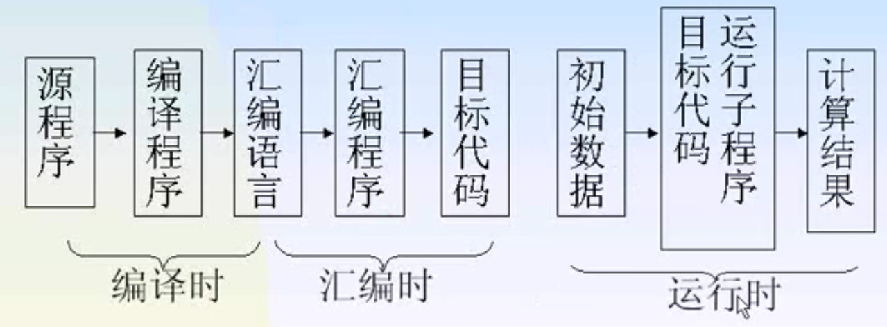

# 第一章 导论

## 学习任务

- 掌握编译的理论基础和形式化系统

- 了解编译的全过程及其具体实现方法

## 程序设计语言与编译

高级语言、汇编语言、机器语言

### 程序设计语言的转换

**翻译**：是指能把某种语言的源程序,在不改变语义的条件下,转换成另一种语言程序—目标标语言程序

**编译**：专指由高级语言转换为低级语言

**解释**：接受某高级语言的一个语句输入,进行解释并控制计算机执行,马上得到这句的执行结果,然后再接受下一句。

### 编译的转换过程  

**两阶段转换**:编译—运行

**三个阶段的转换**:编译——汇编——运行

**解释**

以源程序作为输入,不产生目标程序,一边解释一边执行。

优点:直观易懂,结构简单,易于实现人机对话

缺点:效率低

## 编译程序概述

### 编译程序的工作

先看自然语言的翻译

1.识别出句子中的一个个单词

2.分析句子的语法结构

3.根据句子的含义进行初步翻译

4.对译文进行修饰

5.写出最后译文

**编译程序的工作**：

词法分析

语法分析

语义分析和中间代码生成

优化目标代码生成

**词法分析**

任务：输入源程序,对构成源程序的字符串进行扫描和分解,识别出一个个的单词。

