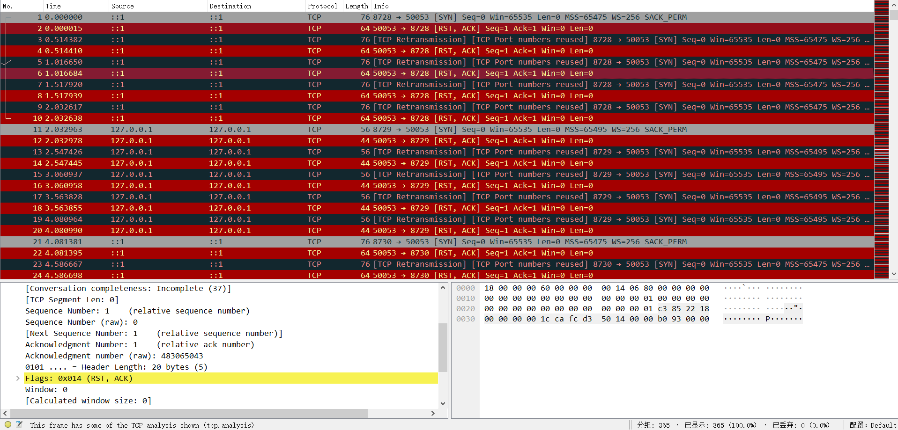
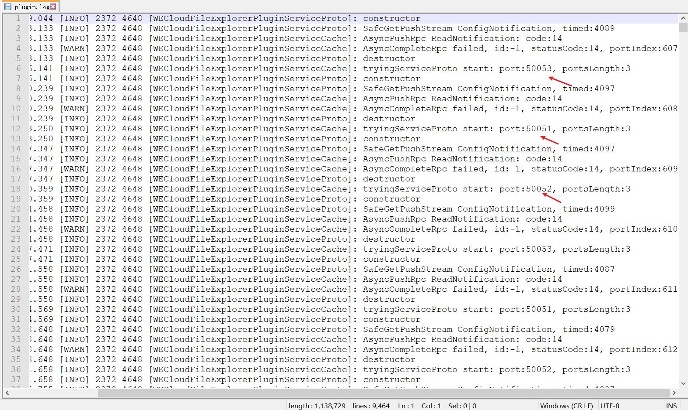
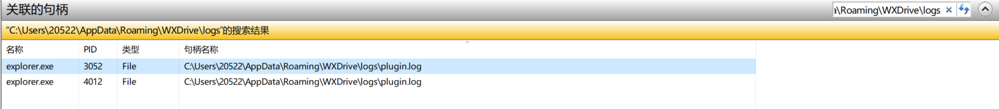

# explorer.exe疯狂建立tcp连接

参考：

- [explorer被微信企业版劫持一例_乘风破浪2021的博客-CSDN博客](https://blog.csdn.net/weixin_45462681/article/details/113072767)

- [关于PC端清除企业微信占用C盘空间的方法_wxworklocal_信陵丶公子的博客-CSDN博客](https://blog.csdn.net/qq_20583039/article/details/107333658)

源端口号是50050-50053，目标端口从8700多一直往上涨

netstat -ano |findstr 50053 执行之后发现是explorer.exe进程

一查，发现和企业微信有关。

卸载之后，发现还在刷。

打开这个目录下的文件：

"C:\Users\用户名\AppData\Roaming\WXDrive\logs\plugin.log"

好家伙，果然是你！

根据这个教程：https://blog.csdn.net/qq_20583039/article/details/107333658

下载反注册wedriveplugin插件 uninstall_plugins.zip。原理是用到了regsvr32这个命令。

运行成功后，会将explorer.exe进程杀掉，ctrl + alt + del调出任务管理器，开启新任务：explorer就行

然后再打开抓包工具，发现没有了。

