# λ演算法

**来源小故事**

λ演算法是图灵的老师邱奇提出来的，最开始的时候没有想用λ这个符号的，而是用的数学里的hat符号：

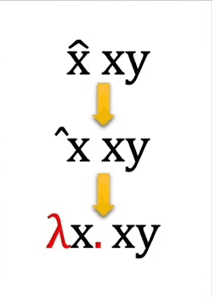

当时要发布东西，需要想手写出来，交给排版员，可能是邱奇写得比较潦草，hat符号写的比较偏，偏到了左边，再加上排版员可能不太了解数学符号，就把hat符号排版到了旁边，然后就变成了λ。

**λ演算法的最核心概念就是函数**，没有之一。

如果说数据和指令是图灵机这个世界里不可再分的原子的话，那么在λ演算法构成的世界里，函数就是那个原子。其他任何东西都是在函数之上建立起来的，比如通过函数能定义自然数0，1，2，3...，以及推演关系。

举个例子，这是个λ演算法里的一个函数：λx.xy ，这和编程语言里的函数可以对比下

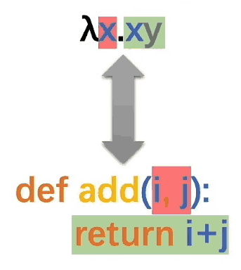

**λ后面的x就是表示函数的形参，点. 后面的那部分就是函数体了**，调用函数的时候，形参和函数体会被括号括起来，这有点像编程语言里的匿名函数的概念。

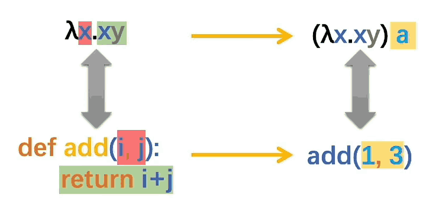

**(λx.xy)a ，a就是函数的实参，执行的时候用a把形参x给替换掉就可以了**

编程语言里的函数，函数体里写的是操作和指令，告诉计算机应该对传进来的参数进行怎么样的操作，也就是说现有数据和指令，函数是被定义在数据和指令这两个基础概念之上的。而λ演算法，函数是第一概念，最初是没有数据和指令的，**数据和指令是需要建立在函数这个概念之上的**。那么λ演算法中函数的函数体里面该写什么呢？

λx.xy 这个函数，x是形参，y是什么呢，不重要，它只是一个符号而已，重点不是符号是什么，而是这两个符号之间的关系，在这个例子里，这个关系就是：两个不一样的符号，从左到右排列，第一个符号是形参，可以被实参替代，第二个符号是什么无所谓，只要和第一个符号不一样就行。

λwyx.wyx 则表示有三个形参：w y x

用λ演算法的函数虚拟出一个图灵机的话，其实就是用函数把数据虚拟出来，用函数把指令或者对数据的操作也虚拟起来。

(λx.xy)a ，实参是符号a，当然实参还可以是一个函数.

(λx.xy)(λx.x) ==> (λx.x)y ==> y

下面举例，用函数定义出自然数，实现自然数的加法

0：λsz.z = λs.(λz.z) 左右两个等价，都可以表示0，符号可以是任何，不一定非得是s和z

1：λsz.s(z)

2：λsz.s(s(z))

3：λsz.s(s(s(z)))

4：...

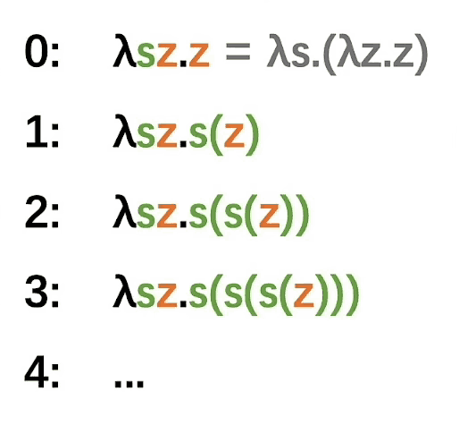

**后继函数 := λwyx.y(wyx)**

把0传入，就会得到1，把1传入就会得到2，以此类推，得到整个自然数。

**加法 :=λxysz.xs(ysz)**

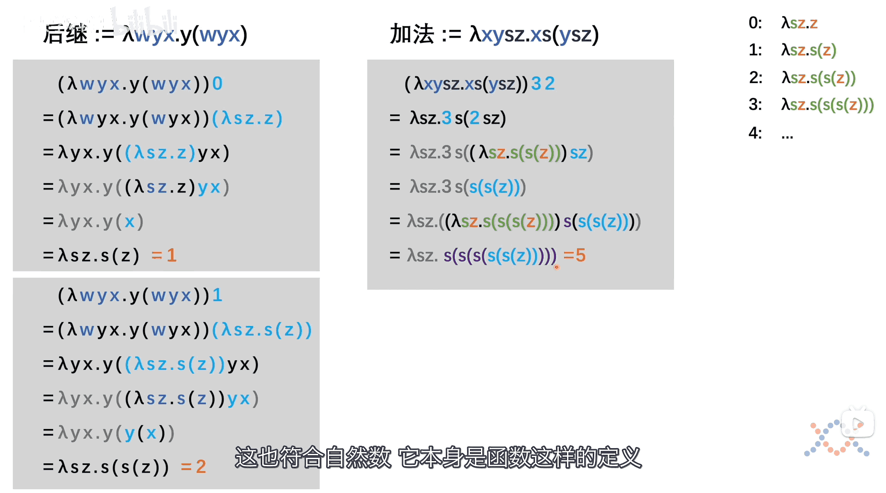

符号不同不要紧，λ演算法关心符号之间的关系。

原子不可再分吗，λ演算法告诉我们，里面还有中子和质子呢，1，2，3，4还可以拆成上述的关系。原子种类虽然多，它们内部的中子和质子的关系不一样而已。

再来看加法函数 **加法 :=λxysz.xs(ysz)**  ，它不是规定或者发明出来的，而是从数字背后的那个规律中发现出来的。

图灵机的逻辑起点是运算和操作，数据的意义是在运算和操作被定义了之后才被赋予的。

而λ演算法的逻辑起点是数字，在规定好数字背后的关系之后，运算和操作才能被发现出来。也就是说，只有我们把数字定义成上面的函数的形式，那加法操作才是现在的样子：**加法 :=λxysz.xs(ysz)** ，如果数字的定义发生变化，变成其他的了，那么加法的定义也会发生改变。

函数式编程的思想，就是来源于λ演算法。

图灵机的建模虽然容易，但是是**对已知情况的复刻**，要求你必须知道事情的全部原因和结果，对一个问题的中间变化，各种情况要了如指掌，各种不同的情境也都需要考虑到，这样才能用图灵机把现实问题在计算机中复刻出来。因为一个运算、一个操作，就是在你已经知道了真实的前因后果后定义出来的，你无法定义出你不知道结果的操作。

λ演算法复刻的就不是具体的问题了，而是这个**问题背后的逻辑和规律**，根据这个逻辑和规律去重构整个系统。

图灵机下的编程，需要考虑很多情况，程序也容易出各种bug，测试常常提出各种特殊情况，这是需要对程序进行**小修小补**。这不是说用λ演算法去做开发会一定更好，λ演算法虽然能让很多未知的情况不需要额外处理了，但是一旦发生异常情况，就是会带来天翻地覆的改变，因为**逻辑和规律**改变了。比如牛顿力学非常好用，在接近光速时就出问题了，不是小修小补就能解决的，而是**要对整个理论的基础动刀子**，带来物理学的革命。而托勒密的地心说，若遇到解释不了的情况，比如水星逆行了，也不会带来革命性的变化，打补丁就是了。

当然，也可以像图灵机一样，把各种特殊情况单独拎出来处理，不过也就把λ演算法的优势给放弃了，时间长了，特殊情况越来越多，λ演算法也就和图灵机一样了，补丁一大把。

图灵机可以面对现实各种奇奇怪怪的问题

λ演算法需要观察隐藏在数据背后的关系，寻找这些关系的**规律**

图灵机更像是个工程师，λ演算法更像是个物理学家或数学家。

函数式编程：Lisp语言

函数式编程和指令式编程，区别体现在基础数据和运算封装之上的，如何再去创建新的数据类型或者是新的运算，它们才开始表现出明显的差别的。

从面向过程到面向对象的编程，是在限制图灵机的自由，但并没有降低解决问题的能力

函数式编程和面向对象，不是一个层面上对立的东西，有了面向对象，仍然可以使用函数式编程的

现代的编程语言如python，已经将图灵机和λ演算法进行了融合。

# 元胞自动机

最早是冯诺依曼提出的

未来颠覆冯诺依曼架构的，很可能是冯诺依曼曾经自己放弃了的那个元胞自动机

生命游戏

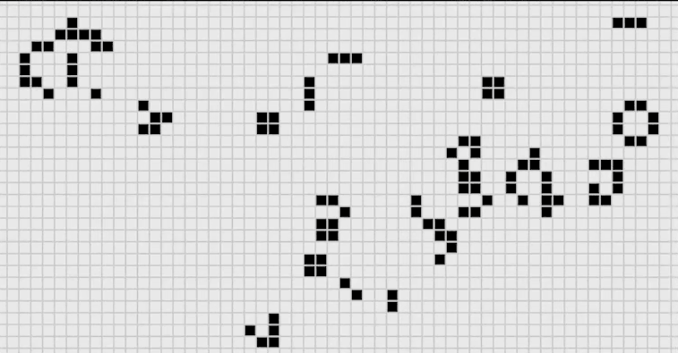

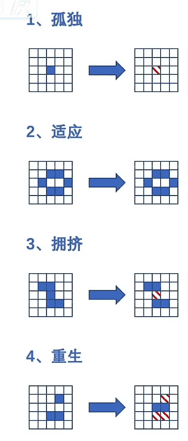

一点的不动的：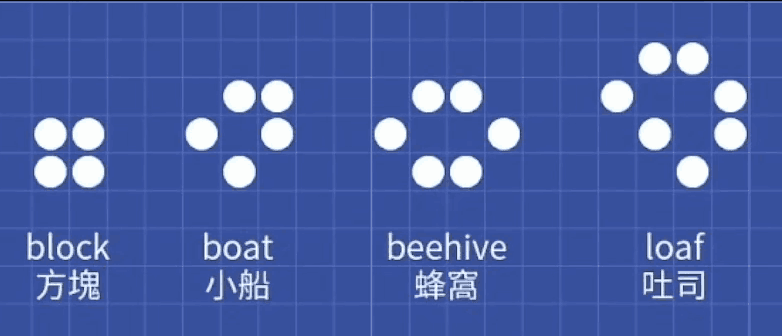

周期性：

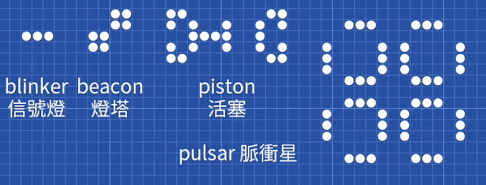

朝着某个方向移动：

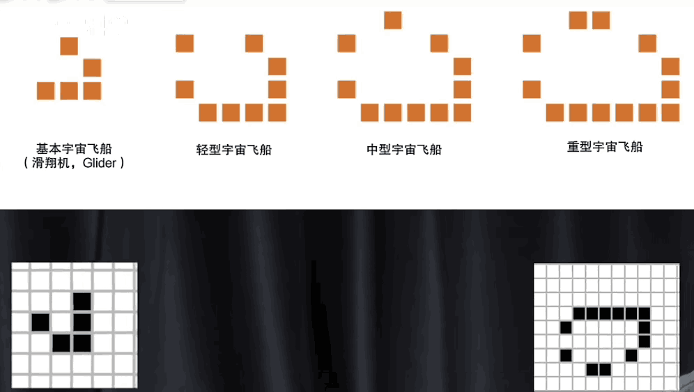

无限复制，发射出去

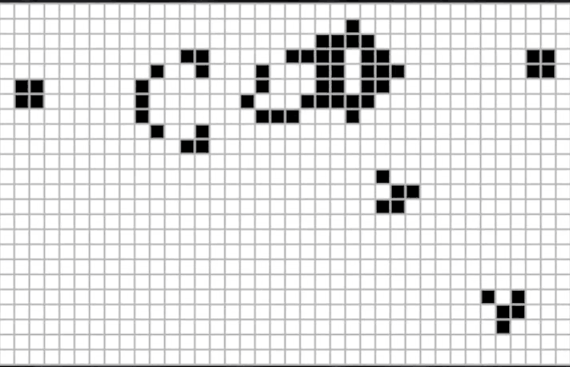

元胞自动机是如何虚拟出图灵机的

先看看是如何虚拟出逻辑运算：与或非

非运算

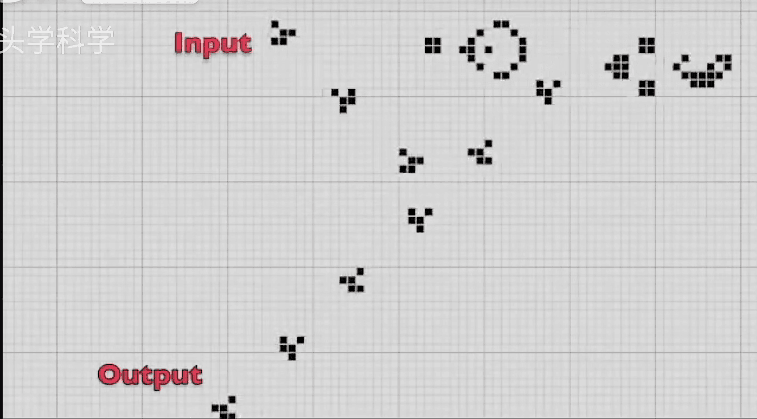

与运算：

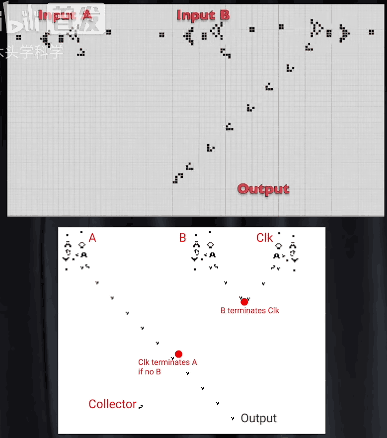

或运算

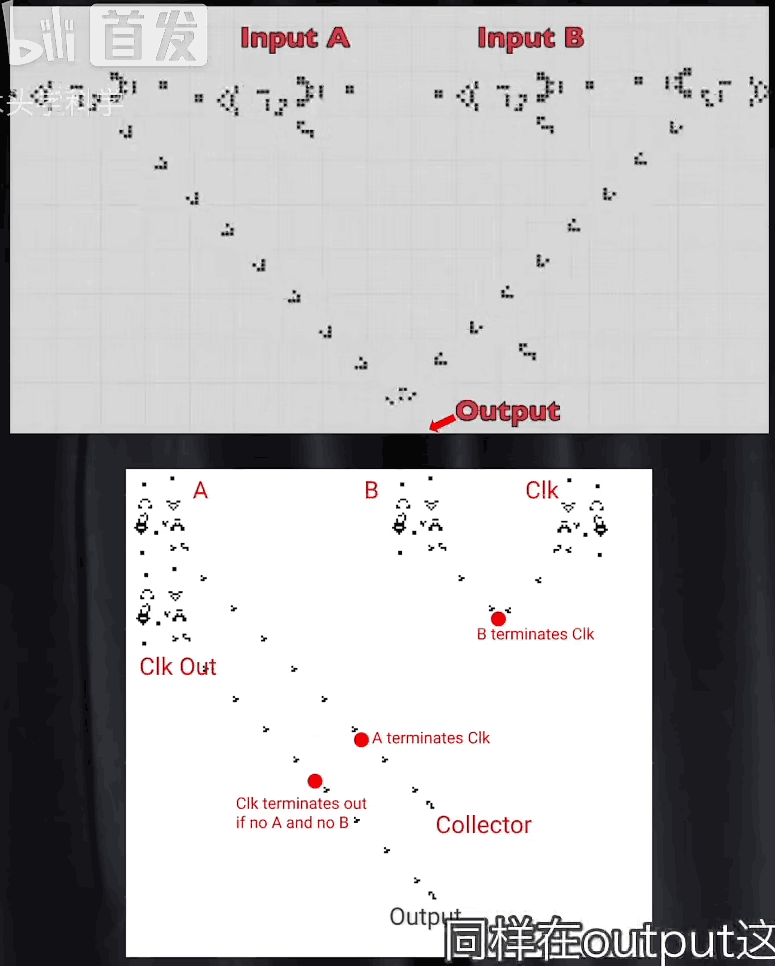

虽然元胞自动机是图灵完备的，但我们没有办法对它进行编程，没有通用的编程方案

编程是啥呢：

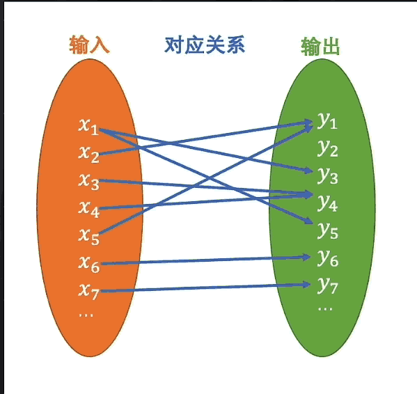

在元胞自动机里，用什么来代表数据呢。

图灵机用符号、λ演算法用关系，又决定了从输入到输出这个关系，是被发明出来的还是发现出来的

图灵机和λ演算法本质上是相通的，都是数据+指令这种形式。

数据是在输入信息里，表示**不同**的那个东西了，是符号还是关系无所谓了

指令是，在输入和输出之间选择A方案还是B方案：

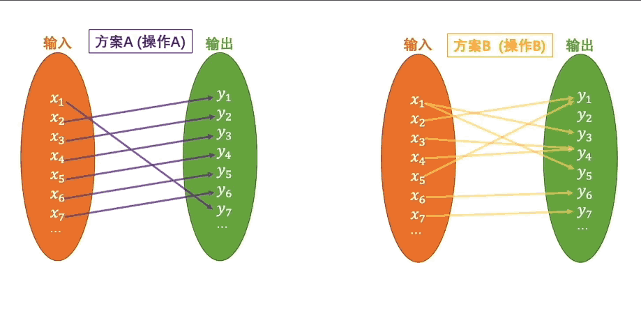

从输入到输出，拼接指令的过程，就是编程。

拿元胞自动机的逻辑与门看看：

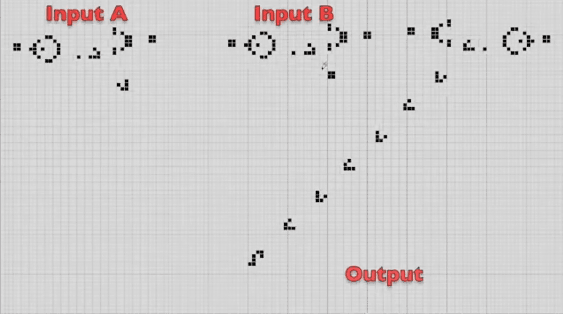

输入是什么？在A和B放置两个高斯帕机枪吗，不是，整个网格布局才是输入，输出也是整个网格布局。是一个二维的整体状态对应到另一个二维的整体状态

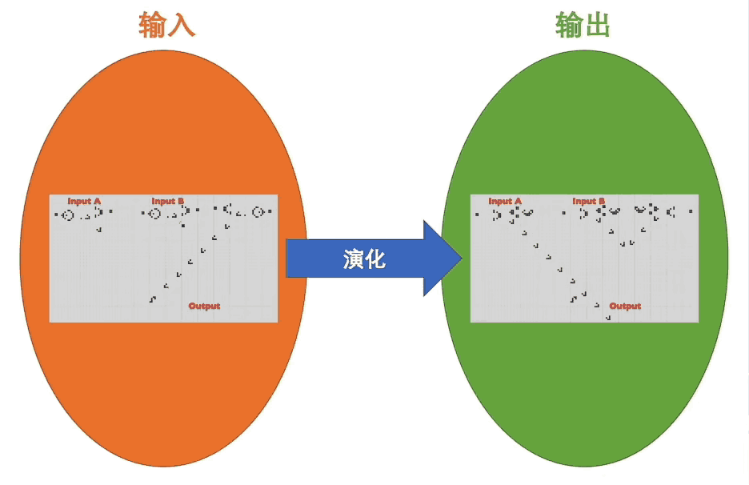

元胞自动机里，初始的输入，就已经确定好数据和指令了，输入是啥样，输出一定是啥样。是群体体现出的结果，无法还原到个体元胞上，无法区分哪部分是数据、哪部分是指令。

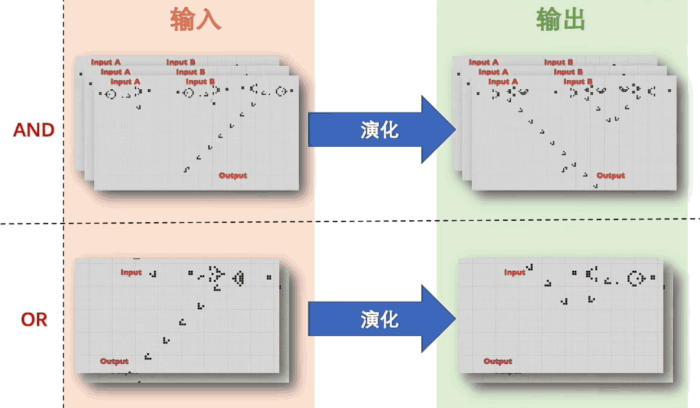

用元胞自动机虚拟出一个图灵机没有现实意义，那样的计算机性能会很差，也体现不出元胞自动机的优势。

约翰·霍兰德 吃豆问题

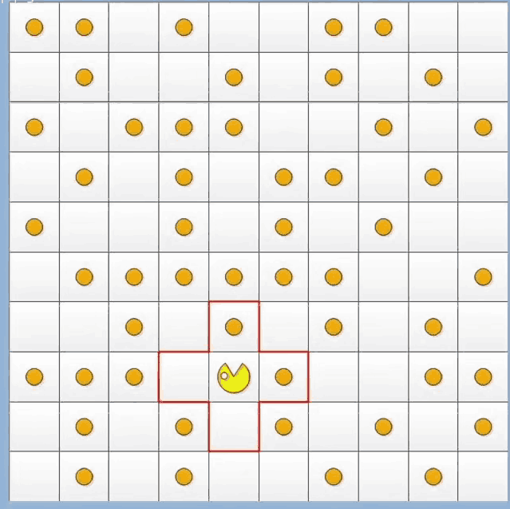

棋盘里随机分布着一些豆子，周围是墙，机器人可以根据指令进行移动和吃豆子，指令也简单，就7个：

上移、下移、左移、右移、不动、随机移动、吃豆

机器人每次只能针对上下左右和自身的5个格子

假如有50个豆子，打分规则：

- 吃到了豆子，得10分，
- 只移动位置，不扣分
- 执行吃豆动作，但格子里没有豆子减1分
- 撞到墙减5分

限制总共能做200次动作，理想情况下能拿到最高分500

找出最优的吃豆策略

理论上可以穷举出来所有策略，但策略太多，天文数字

遗传算法，1000代之后，最优的，平均分471分，策略没有办法被规约，只能以列表的情况把各种情况列出来

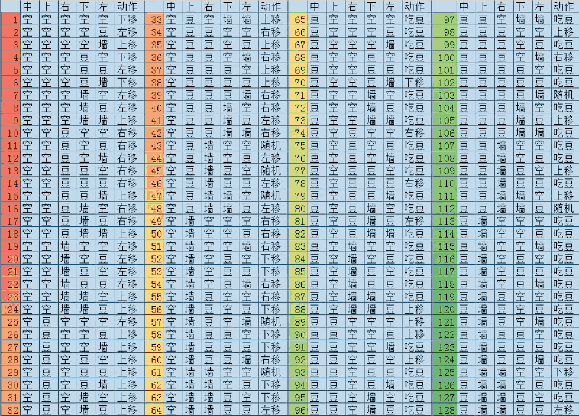

很难被泛化，不适合用图灵机，例如，棋盘不规则，策略里的一条条规则就不适应了

λ演算法虽然可以重建出底层规律，但最优策略没有办法被规约（没有办法用一个简单的规则把整个策略给统一描述出来），随着特例的不断增加，带来的效益不断递减，λ演算法的结论又趋向于图灵机的方案了

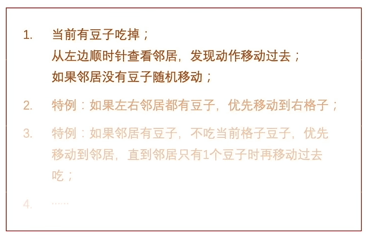

现实中很多问题都类似，现象背后的运行规律无法被规约。既然无法被规约，那这个策略是怎么来的，通过优胜劣汰演化过来的，不论是物理世界、生物世界、人类社会，甚至人脑中的观念世界，优胜劣汰就是我们这个世界基本的运行规律。我们发现的很多简单的规律，很多只能在理想情况下进行。

现实的复杂性是怎么来的？自然演化来的，那么描述一个自然演化来的问题，同样的用自然演化去解决就可以了。

演化问题，用图灵机和λ演算法就不适合了，天然和演化这种方式不兼容。

数据量的增加和CPU算力的增加，是个指数级的关系，总之不是线性的。CPU有摩尔定律，基本上可以满足指数增长的需求，CPU的处理速度是按照内存空间增长的指数这么一个量级增长的时候，这就代表了，内存和CPU他们之间交互的数据量，也是要按照指数增长的，而内存和CPU之间传输的速度是没有办法达到这个要求的，因为它们之间只能是单核单通道，就算是多核多通道，也只不过是乘了个常数n，杯水车薪，瓶颈就出现了，所以图灵机和λ演算法要去处理或模拟一个演化问题，是不占优势的，演化是一个所有个体同时进行的自然生长的过程。

元胞自动机，没有CPU这样一个全知全能的“上帝”，只有一个个的原胞，每个原胞只承担了非常少的一部分存储和计算的功能，所有原胞的并行吞吐和计算的，那冯诺依曼瓶颈也不会出现了。单个原胞非常简单，但个体的简单不会妨碍整体的复杂，丰富性和多样性是从原胞的群体中涌现出来的。

元胞自动机自己看待自己，根本没有数据和指令这样的概念，数据和指令只是图灵机和λ演算法的角度来看的。决定从输入到输出按照哪个方案进行的，只有元胞的初始状态、原胞的网络结构和原胞个体之间的相互作用。

解决图灵机困境的，还不是元胞自动机，而是元胞自动机体现出来的**群体涌现的思想**

按照这个思想，现在研究最多的就是**神经网络**，神经网络中的神经元就对应的一个个元胞，元胞自动机里，影响原胞的状态是周围的邻居，而神经元呢，靠着树突和轴突和许多神经元连接的，元胞的状态对应神经元的激活状态。

虽然现在可以在计算机上模拟神经网络，但只要硬件结构不变，是无法从根本上解决问题的，于是类脑芯片的概念就被提出来了。

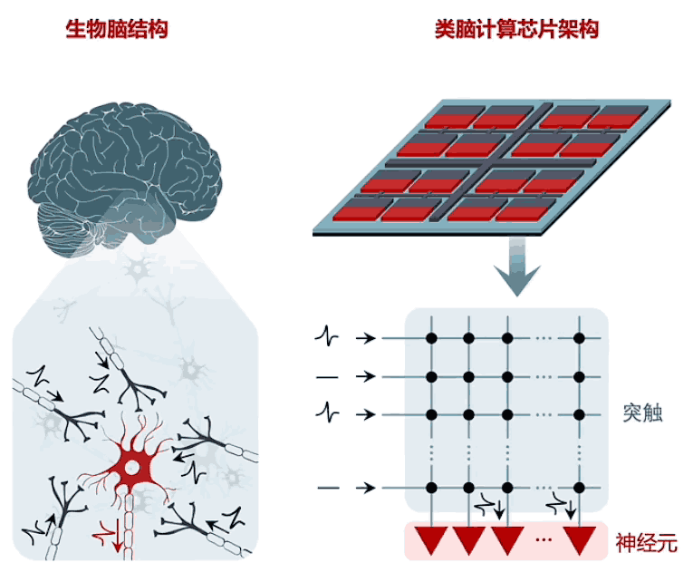

类脑芯片 存算一体  忆阻器  学习

这时的编程就是把元胞自动机、神经网络这个结构**在冯诺依曼架构上虚拟出来**，具体从输入到输出的这个过程，是**靠编程编不出来的，是要靠学习的**。

如果有一天底层硬件变了，不再是冯诺依曼架构了，而是类脑芯片，已经把神经网络这个硬件的结构都给搭好了，那么那个时候也许真的不再需要编程这件事了，就不需要程序员，而是需要一个调教人工智能的老师。

在学习算法这，还有一个颠覆，编程时学的什么快速排序、动态规划之类的算法，这些运行的**结果都是确定的**，研究它们的数学基础是**离散数学、抽象代数、图论之类的**，深度学习算法，面对的是一个非线性的演化黑盒子，用到的数学就变到了概率和统计，**从确定到不确定的**颠覆。

编程不只是在对抗真实世界，还会在赛博空间里去创造自己的理想世界，不需考虑现实是束缚，其他行业的所有工程师都被真实世界拴着镣铐，只能带着镣铐跳舞，只有软件工程师不一样，在赛博空间有绝对的自由，可以从底层重建世界。

