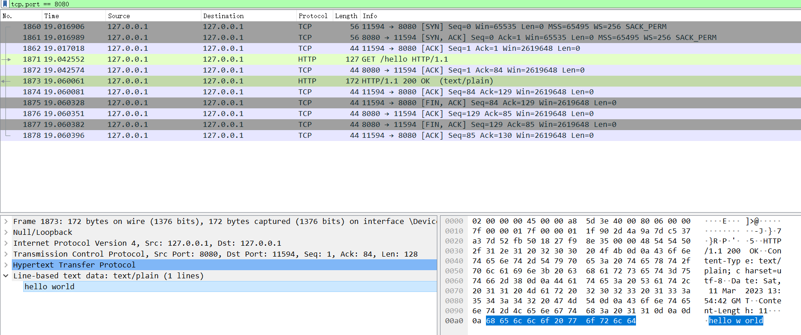
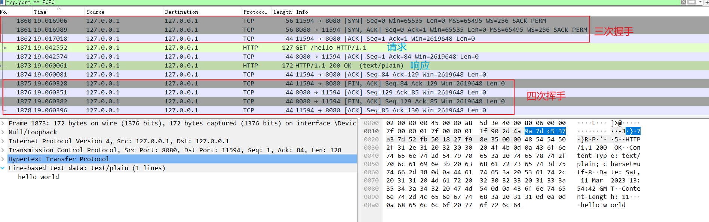
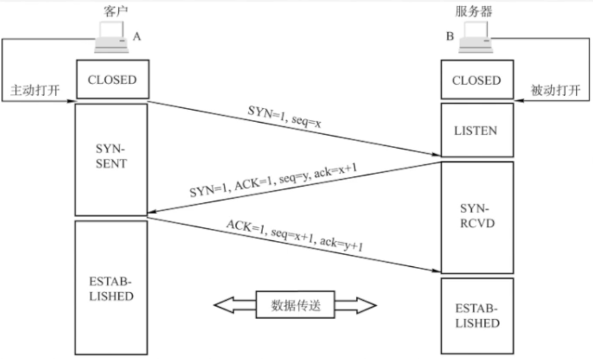
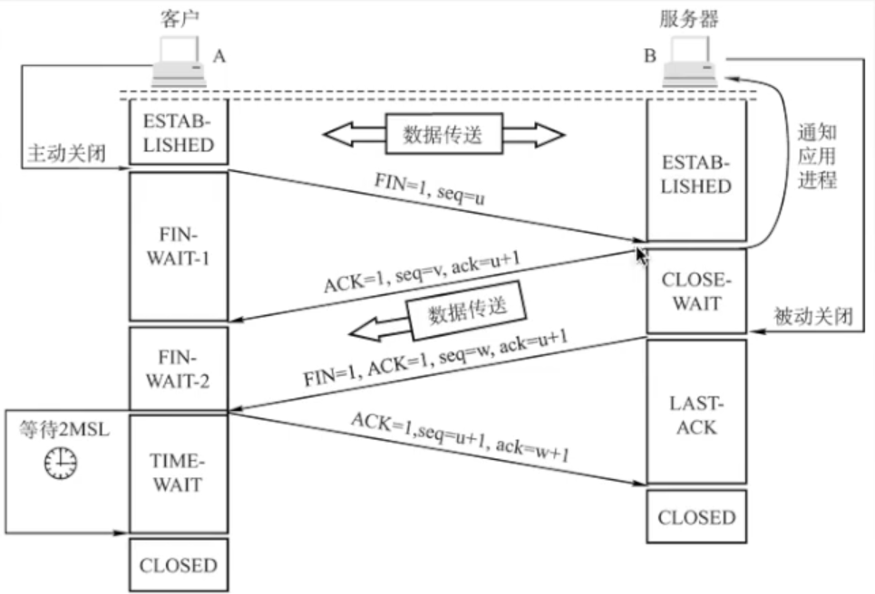
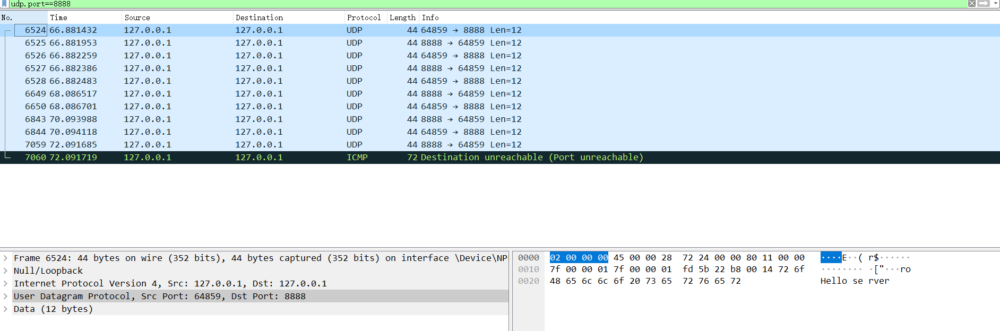

# HTTP

gin写个helloworld

```go
func main() {
    gin.SetMode(gin.ReleaseMode)
    r := gin.Default()
    r.GET("/hello", func(c *gin.Context) {
        c.String(http.StatusOK, "hello world")
    })
    // 启动HTTP服务，默认在0.0.0.0:8080启动服务
    r.Run()
}
```

执行命令：curl localhost:8080/hello

返回：hello world

抓包结果





分析过程参考：https://blog.csdn.net/dfBeautifulLive/article/details/121889271

## 三次握手



## 四次挥手



# UDP

代码：[golang 简单实现udp服务端和udp客户端_、Edgar的博客-CSDN博客](https://blog.csdn.net/weixin_44676081/article/details/108966572)

