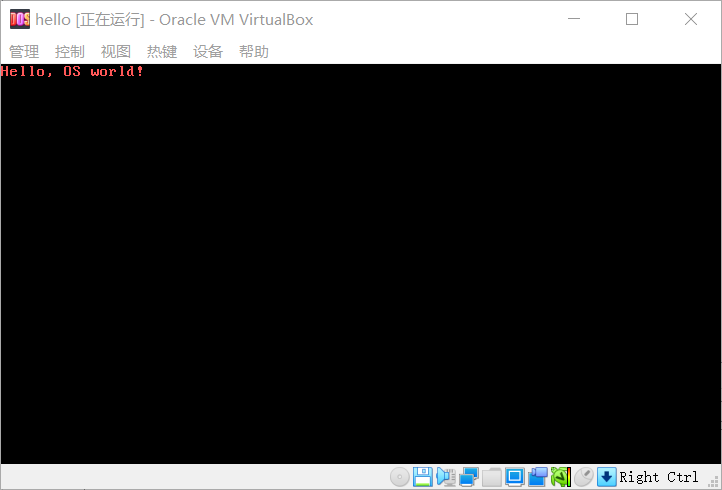
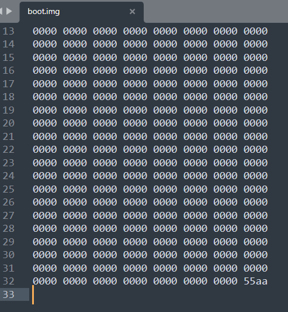
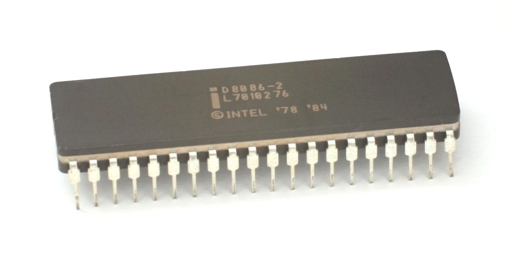
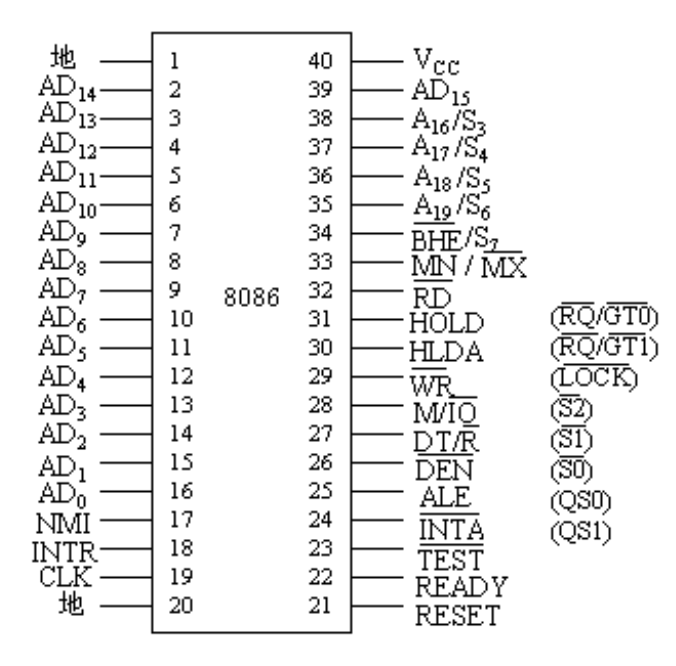
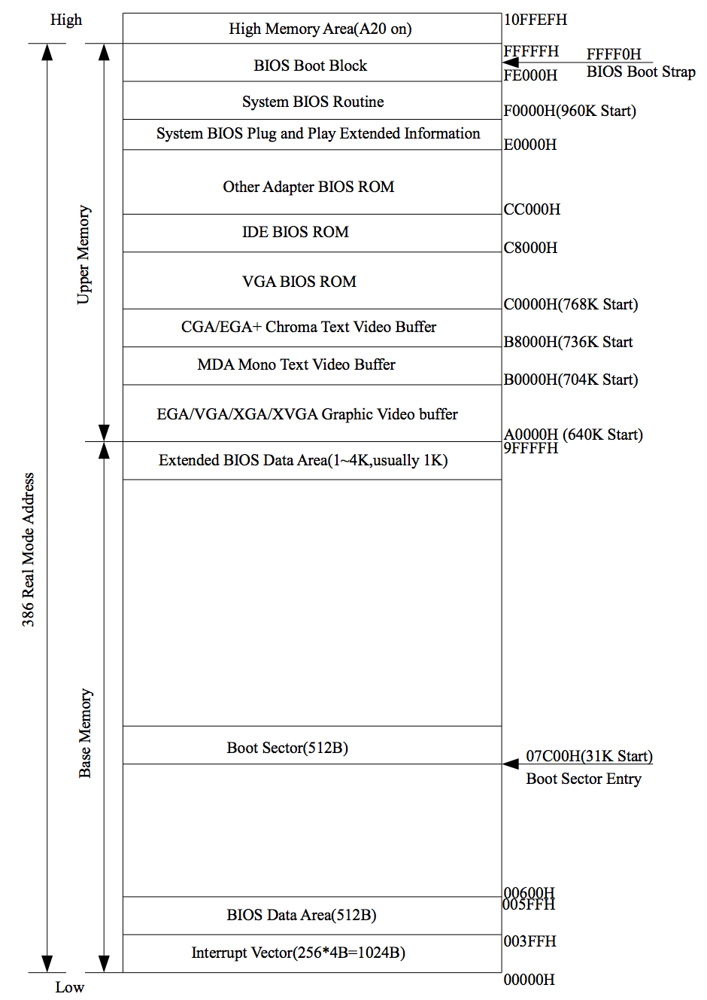

# 开发环境

windows或linux都可以

可以用虚拟机   

汇编编译器：nasm

# 计算机启动过程

参考：https://blog.csdn.net/judyge/article/details/52278384

　写操作系统看似是一个复杂的过程，但只要我们将过程分解，完成每一步，那么完成一个操作系统就是水到渠成的事了。好了，我们就看一下计算机的启动过程，看操作系统何时被启动的。

　　**第一步：读取BIOS**

　　按下电源按钮后，计算机首先读取一块ROM芯片，这块芯片里的程序是"基本输入输出系統"（Basic Input/Output System），即BIOS.

　　**第二步：硬件自检** 

　　BIOS会检查计算机硬件是否满足运行条件，如果硬件出现问题，主板会发出不同含义的蜂鸣，启动中止。

　　**第三步：启动顺序**

　　硬件检查完成后，BIOS会将控制权交给下一阶段的启动程序，注意，“下一阶段的启动程序”可能存放在硬盘中，也可能存放在CD/DVD中，或者软盘中等等，可以设置BIOS选择从哪个设备启动。

　　**第四步：主引导记录**

　　BIOS找到了“下一阶段的启动程序”所在设备，会读取该设备的第一个扇区，即读取最前面的512字节，称为主引导记录。主引导记录会告诉计算机下一步到哪里去找操作系统。

　　**第五步：bootloader**

　　计算机读取"主引导记录"前面446字节的机器码之后，运行事先安装的“启动管理器”bootloader，由用户选择启动哪个操作系统。如果你安装了多个操作系统，那么就要从这步做出选择了。

　　**第六步：加载内核**

　　好了，选择操作系统（内核）后，会加载内核，下面就交给内核去处理了

# HelloWorld（主引导记录）

参考：

https://blog.csdn.net/feixiaku/article/details/37943007

https://blog.csdn.net/judyge/article/details/52278384

《自己动手写操作系统》

上面的第一步和第二步我们不做，由虚拟机去完成；第三步“启动顺序”我们选择从软盘启动（我们用镜像代替，并不是真的软盘），需要对虚拟机做下设置，选择从软盘启动。下面重点来看第四步，我们写一下“主引导记录”，让BIOS读取我们写的主引导记录。


整个系统要做的事情就是输出一句“Hello，OS world!”，但是这样一个输出不同于printf和cout，它是完全不依赖高级语言的。

打开文本编辑器，写下以下内容：boot.asm

; 后面是注释

```assembly
	org	07c00h			; 告诉编译器程序加载到7c00处。 BIOS读入MBR后，从0x7c00h处开始执行
	; 下面部分和10h有关中断，10h中断用来显示字符
	mov	ax, cs
	mov	ds, ax
	mov	es, ax
	call	DispStr			; 调用显示字符串例程
	jmp	$			; 无限循环
DispStr:
	mov	ax, BootMessage
	mov	bp, ax			; ES:BP = 串地址
	mov	cx, 16			; CX = 串长度
	mov	ax, 01301h		; AH = 13,  AL = 01h，AH=13h表示向TTY显示字符，AL=01h表示显示方式（字符串是否包含显示属性，01h表示不包含）
	mov	bx, 000ch		; 页号为0(BH = 0) 黑底红字(BL = 0Ch,高亮)
	mov	dl, 0
	int	10h			; 10h 号中断
	ret
BootMessage:		db	"Hello, OS world!"
times 	510-($-$$)	db	0	; 填充剩下的空间，使生成的二进制代码恰好为512字节
dw 	0xaa55				; 结束标志，魔数，必须有这两个字节BIOS才确认是MBR

```

下载编译器并安装：

https://www.nasm.us/

设置环境变量path指向安装目录

编译：

```cmd
nasm boot.asm -o boot.img
```

在virtualBox中安装boot.img，运行：




以二进制方式查看boot.img:




boot.asm也可以这样写，一样的

```assembly
; 文件名 boot.asm
 
org 7c00h                     ; BIOS读入MBR后，从0x7c00h处开始执行
 
; 下面部分和10h有关中断，10h中断用来显示字符
mov ax, cs
mov es, ax
mov ax, msg
mov bp, ax                    ; ES:BP表示显示字符串的地址
mov cx, msgLen                ; CX存字符长度
mov ax, 1301h                 ; AH=13h表示向TTY显示字符，AL=01h表示显示方式（字符串是否包含显示属性，01h表示不包含）
mov bx, 000fh                 ; BH=00h表示页号，BL=0fh表示颜色
mov dl, 0                     ; 列
int 10h
  
msg: db "hello world, welcome to OS!"
msgLen: equ $ - msg           ; 字符串长度
times 510 - ($ - $$) db 0     ; 填充剩余部分
dw 0aa55h                     ; 魔数，必须有这两个字节BIOS才确认是MBR
```


## 代码解释

参考：

https://blog.csdn.net/tianwailaibin/article/details/7191623

https://blog.csdn.net/judyge/article/details/52278384

**这个代码段是存于磁盘引导扇区的系统引导（自举）程序。若存于硬盘第一个扇区，则这段代码称为：硬盘主引导记录；若存于硬盘某个分区的第一个扇区，则称为：分区引导记录；若存于软盘的第一个扇区，则称为：软盘引导记录。称为磁盘引导记录的重要标志是：**

**dw 0xaa55**

org 07c00h ;调整偏移量伪指令ORG，指定下面的指令从7c00h处开始，因为BIOS一旦发现引导扇区，就会将这512字节装载到内存0000：7c00处

### 为什么MBR要从0x7c00h处开始执行？

ORG是伪指令，org 7c00h是告诉编译器，下面代码装入到内存的起始地址0x7c00h处。为什么呢，这是因为BIOS读取主引导记录后，会从0x7c00h处开始执行，那么BIOS为什么会从0x7c00h这个地址开始执行，而不是其他地址呢，这一切都要从大明湖畔的8086cpu说起。

　　时光飞逝，容颜易老，8086却还是那个样子，如图所示：





图 8086引脚图

　　正如图中所示，8086cpu的地址总线宽度为20（AD0-AD19），可以传送220的地址信息，即可以定位220（1M）的内存地址空间，那么这1M的内存地址空间是如何分配的呢，见下图所示（图是386的，我们目前只关心实模式即1M内存地址空间分配）：



　看到0x7c00H了吗？0x0000h--0x7c00h这一段存的是BIOS中断向量和一些BIOS数据等，至于到底为什么以0x7c00h为界，本文不做讨论，有兴趣看这里http://www.glamenv-septzen.net/en/view/6。

"0x7C00"首次出现在IBM PC 5150 ROM BIOS INT 19h处理程序中。

0x7C00H是 32KiB - 1024B 

BIOS 开发团队之所以决定0x7C00，是因为：

1. 他们希望为操作系统留出尽可能多的空间，以便在32KiB中加载自身。
2. 8086/8088 使用 0x0 - 0x3FF中断向量，BIOS 数据区域紧随其后。
3. 引导扇区为 512 字节，引导程序的堆栈/数据区域需要更多 512 字节。
4. 因此，0x7C00，选择了32KiB的最后一个1024B。

加载操作系统后，内存布局将为：

```
+--------------------- 0x0
| Interrupts vectors
+--------------------- 0x400
| BIOS data area
+--------------------- 0x5??
| OS load area
+--------------------- 0x7C00
| Boot sector
+--------------------- 0x7E00
| Boot data/stack
+--------------------- 0x7FFF
| (not used)
+--------------------- (...)
```


### int 10h是干嘛的?

当出现int 10h中断时，表示要操作显示器了，此时AH寄存器表示如何显示，代码中的AH为13h，表示要在TTY（伪终端）显示字符，此时其他几个寄存器都有一定的含义，如下所示：

ES:BP -- 显示字符串的地址　　　　CX -- 显示字符串的长度

BH -- 页码　　　　            BL -- 属性(若AL=00H或 01H)

DH -- 行 　　　　　　　　　　　 DL -- 列

AL -- 显示输出方式

下面一段代码也就不难理解了：

```assembly
mov ax, cs
mov es, ax
mov ax, msg
mov bp, ax          ; ES:BP表示显示字符串的地址
mov cx, msgLen        ; CX存字符长度
mov ax, 1301h         ; AH=13h表示向TTY显示字符，AL=01h表示显示方式（字符串是否包含显示属性，01h表示不包含）
mov bx, 000fh         ; BH=00h表示页号，BL=0fh表示颜色
mov dl, 0           ; 列
int 10h
```

### $和$$是什么意思？

$  是当前位置**
**$$ 是段开始位置

下面两句就不难理解了：

```assembly
msgLen: equ $ - msg           ; 字符串长度
times 510 - ($ - $$) db 0     ; 填充剩余部分
```


### 为什么要有0xaa55h魔数？

BIOS检查完硬件后，会寻找下一个设备来启动计算机，BIOS找到一个设备后，会读取该设备的第一个扇区，也就是读取最前面的512个字节。如果这512个字节的最后两个字节是0x55和0xAA，表明这个设备可以用于启动；如果不是，表明设备不能用于启动，控制权于是被转交给"启动顺序"中的下一个设备。
