# 1.概述

## 操作系统

现代操作系统由一个或多个处理器、主存、打印机、键盘、鼠标、显示器、网络接口以及各种输入/输出设备构成。计算机操作系统是一个复杂的系统。

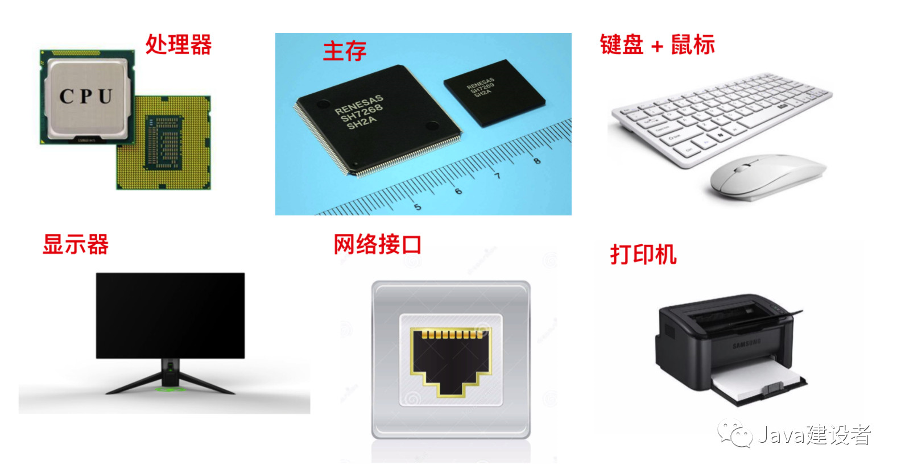

然而，程序员不会直接和这些硬件打交道，而且每位程序员不可能会掌握所有操作系统的细节，这样我们就不用再编写代码了，所以在硬件的基础之上，计算机安装了一层软件，这层软件能够通过响应用户输入的指令达到控制硬件的效果，从而满足用户需求，这种软件称之为`操作系统`，它的任务就是为用户程序提供一个更好、更简单、更清晰的计算机模型。

我们一般常见的操作系统主要有 **Windows、Linux、FreeBSD 或 OS X** ，这种带有图形界面的操作系统被称为 `图形用户界面(Graphical User Interface, GUI)`，而基于文本、命令行的通常称为 `Shell`。下面是我们所要探讨的操作系统的部件

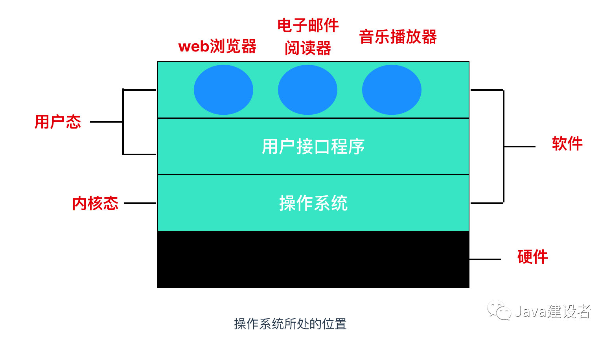

这是一个操作系统的简化图，最下面的是硬件，硬件包括芯片、电路板、磁盘、键盘、显示器等我们上面提到的设备，在硬件之上是软件。大部分计算机有两种运行模式：`内核态` 和 `用户态`，软件中最基础的部分是`操作系统`，它运行在 `内核态` 中，内核态也称为 `管态` 和 `核心态`，它们都是操作系统的运行状态，只不过是不同的叫法而已。操作系统具有硬件的访问权，可以执行机器能够运行的任何指令。软件的其余部分运行在 `用户态` 下。

`用户接口程序(shell 或者 GUI)`处于用户态中，并且它们位于用户态的最低层，允许用户运行其他程序，例如 Web 浏览器、电子邮件阅读器、音乐播放器等。而且，越靠近用户态的应用程序越容易编写，如果你不喜欢某个电子邮件阅读器你可以重新写一个或者换一个，但你不能自行写一个操作系统或者是中断处理程序。这个程序由硬件保护，防止外部对其进行修改。

## 计算机硬件简介

操作系统与运行操作系统的内核硬件关系密切。操作系统扩展了计算机指令集并管理计算机的资源。因此，操作系统因此必须足够了解硬件的运行，这里我们先简要介绍一下现代计算机中的计算机硬件。

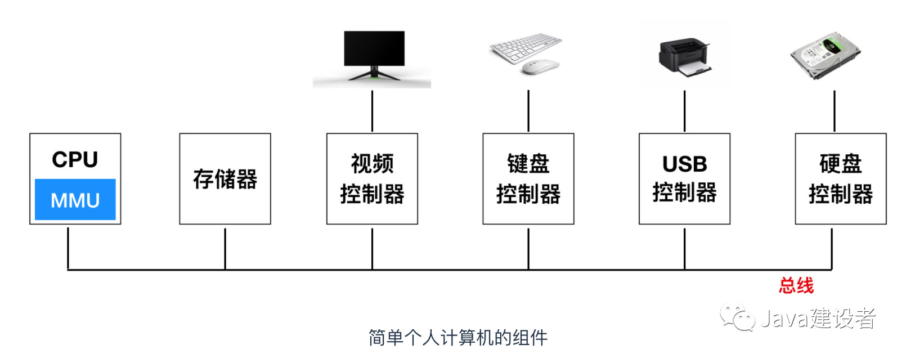

从概念上来看，一台简单的个人电脑可以被抽象为上面这种相似的模型，CPU、内存、I/O 设备都和总线串联起来并通过总线与其他设备进行通信。现代操作系统有着更为复杂的结构，会设计很多条总线，我们稍后会看到。暂时来讲，这个模型能够满足我们的讨论。

### CPU

CPU 是计算机的大脑，它主要和内存进行交互，从内存中提取指令并执行它。一个 CPU 的执行周期是从内存中提取第一条指令、解码并决定它的类型和操作数，执行，然后再提取、解码执行后续的指令。重复该循环直到程序运行完毕。

每个 CPU 都有一组可以执行的特定指令集。因此，x86 的 CPU 不能执行 ARM 的程序并且 ARM 的 CPU 也不能执行 x86 的程序。由于访问内存获取执行或数据要比执行指令花费的时间长，因此所有的 CPU 内部都会包含一些`寄存器`来保存关键变量和临时结果。因此，在指令集中通常会有一些指令用于把关键字从内存中加载到寄存器中，以及把关键字从寄存器存入到内存中。还有一些其他的指令会把来自寄存器和内存的操作数进行组合，例如 add 操作就会把两个操作数相加并把结果保存到内存中。

除了用于保存变量和临时结果的通用寄存器外，大多数计算机还具有几个特殊的寄存器，这些寄存器对于程序员是可见的。其中之一就是 `程序计数器(program counter)`，程序计数器会指示下一条需要从内存提取指令的地址。提取指令后，程序计数器将更新为下一条需要提取的地址。

另一个寄存器是 `堆栈指针(stack pointer)`，它指向内存中当前栈的顶端。堆栈指针会包含输入过程中的有关参数、局部变量以及没有保存在寄存器中的临时变量。

还有一个寄存器是 `PSW(Program Status Word)` 程序状态字寄存器，这个寄存器是由操作系统维护的8个字节(64位) long 类型的数据集合。它会跟踪当前系统的状态。除非发生系统结束，否则我们可以忽略 PSW 。用户程序通常可以读取整个PSW，但通常只能写入其某些字段。PSW 在系统调用和 I / O 中起着重要作用。

操作系统必须了解所有的寄存器。在`时间多路复用(time multiplexing)` 的 CPU 中，操作系统往往停止运行一个程序转而运行另外一个。每次当操作系统停止运行一个程序时，操作系统会保存所有寄存器的值，以便于后续重新运行该程序。

为了提升性能， CPU 设计人员早就放弃了同时去读取、解码和执行一条简单的指令。许多现代的 CPU 都具有同时读取多条指令的机制。例如，一个 CPU 可能会有单独访问、解码和执行单元，所以，当 CPU 执行第 N 条指令时，还可以对 N + 1 条指令解码，还可以读取 N + 2 条指令。像这样的组织形式被称为 `流水线(pipeline)`，

比流水线更先进的设计是 `超标量(superscalar)`CPU，下面是超标量 CPU 的设计

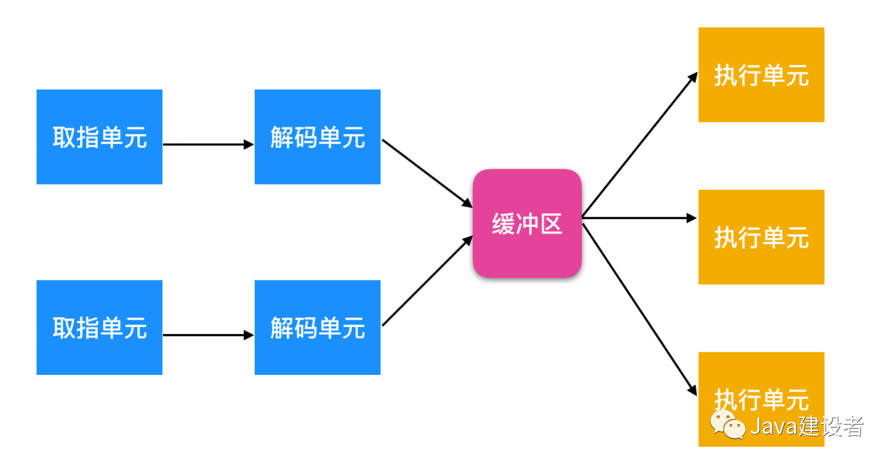

在上面这个设计中，存在多个执行单元，例如，一个用来进行整数运算、一个用来浮点数运算、一个用来布尔运算。两个或者更多的指令被一次性取出、解码并放入缓冲区中，直至它们执行完毕。只要一个执行单元空闲，就会去检查缓冲区是否有可以执行的指令。如果有，就把指令从缓冲区中取出并执行。这种设计的含义是应用程序通常是乱序执行的。在大多数情况下，硬件负责保证这种运算的结果与顺序执行指令时的结果相同。

除了用在嵌入式系统中非常简单的 CPU 之外，多数 CPU 都有`两种模式`，即前面已经提到的内核态和用户态。通常情况下，`PSW 寄存器`中的一个二进制位会控制当前状态是内核态还是用户态。当运行在内核态时，CPU 能够执行任何指令集中的指令并且能够使用硬件的功能。在台式机和服务器上，操作系统通常以内核模式运行，从而可以访问完整的硬件。在大多数嵌入式系统中，一部分运行在内核态下，剩下的一部分运行在用户态下。

用户应用程序通常运行在用户态下，在用户态下，CPU 只能执行指令集中的一部分并且只能访问硬件的一部分功能。一般情况下，在用户态下，有关 I/O 和内存保护的所有指令是禁止执行的。当然，设置 PSW 模式的二进制位为内核态也是禁止的。

为了获取操作系统的服务，用户程序必须使用 `系统调用(system call)`，系统调用会转换为内核态并且调用操作系统。`TRAP` 指令用于把用户态切换为内核态并启用操作系统。当有关工作完成之后，在系统调用后面的指令会把控制权交给用户程序。我们会在后面探讨操作系统的调用细节。

需要注意的是操作系统在进行系统调用时会存在陷阱。大部分的陷阱会导致硬件发出警告，比如说试图被零除或浮点下溢等你。在所有的情况下，操作系统都能得到控制权并决定如何处理异常情况。有时，由于出错的原因，程序不得不停止。

### 多线程和多核芯片

Intel Pentinum 4也就是奔腾处理器引入了被称为`多线程(multithreading)` 或 `超线程(hyperthreading, Intel 公司的命名)` 的特性，x86 处理器和其他一些 CPU 芯片就是这样做的。包括**SSPARC、Power5、Intel Xeon 和 Intel Core 系列** 。近似地说，多线程允许 CPU 保持两个不同的线程状态并且在`纳秒级(nanosecond)` 的时间完成切换。线程是一种轻量级的进程，我们会在后面说到。例如，如果一个进程想要从内存中读取指令(这通常会经历几个时钟周期)，多线程 CPU 则可以切换至另一个线程。多线程不会提供真正的并行处理。在一个时刻只有一个进程在运行。

对于操作系统来讲，多线程是有意义的，因为每个线程对操作系统来说都像是一个单个的 CPU。比如一个有两个 CPU 的操作系统，并且每个 CPU 运行两个线程，那么这对于操作系统来说就可能是 4 个 CPU。

除了多线程之外，现在许多 CPU 芯片上都具有四个、八个或更多完整的处理器或内核。多核芯片在其上有效地承载了四个微型芯片，每个微型芯片都有自己的独立CPU。

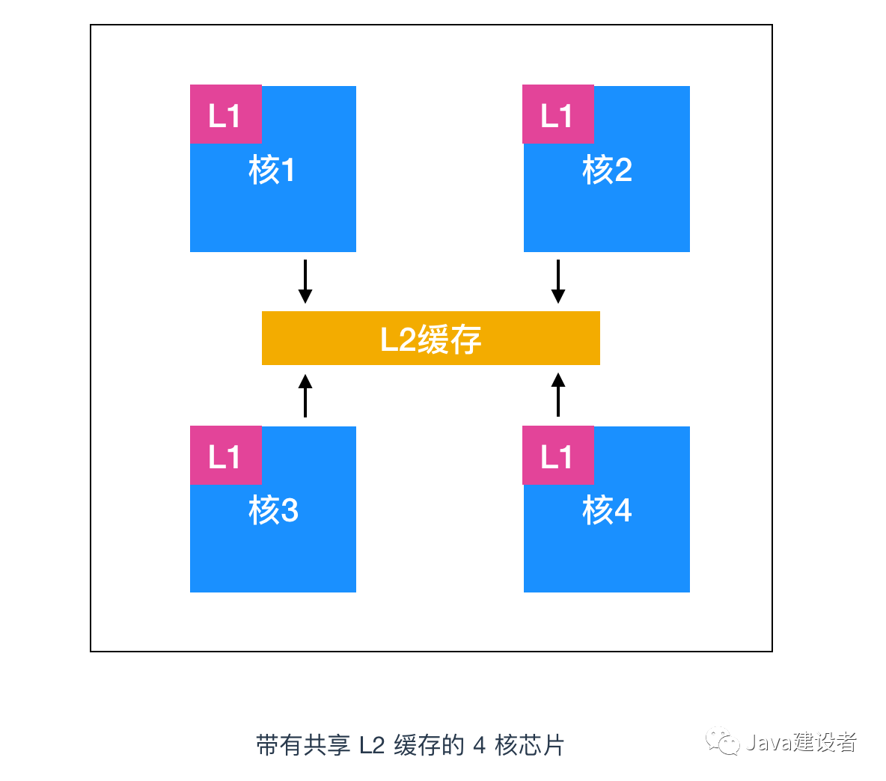

如果要说在绝对核心数量方面，没有什么能赢过现代 `GPU(Graphics Processing Unit)`，GPU 是指由成千上万个微核组成的处理器。它们擅长处理大量并行的简单计算。

### 内存

计算机中第二个主要的组件就是内存。理想情况下，内存应该非常快速(比执行一条指令要快，从而不会拖慢 CPU 执行效率)，而且足够大且便宜，但是目前的技术手段无法满足三者的需求。于是采用了不同的处理方式，存储器系统采用一种分层次的结构

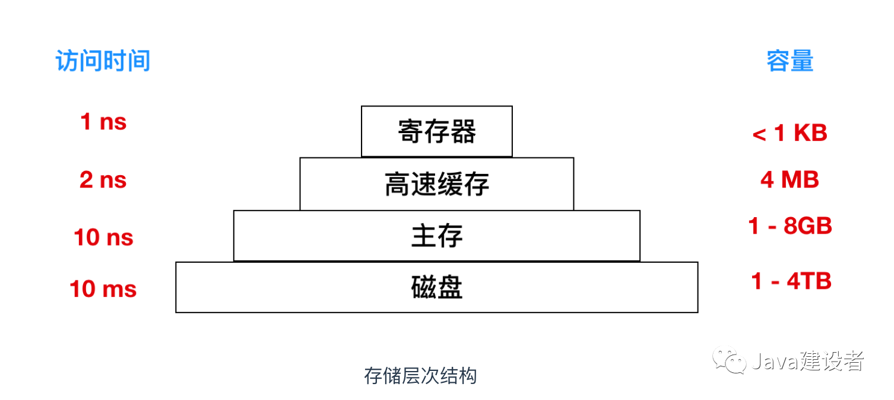

顶层的存储器速度最高，但是容量最小，成本非常高，层级结构越向下，其访问效率越慢，容量越大，但是造价也就越便宜。

#### 寄存器

存储器的顶层是 CPU 中的`寄存器`，它们用和 CPU 一样的材料制成，所以和 CPU 一样快。程序必须在软件中自行管理这些寄存器（即决定如何使用它们）

#### 高速缓存

位于寄存器下面的是`高速缓存`，它多数由硬件控制。主存被分割成`高速缓存行(cache lines)` 为 64 字节，内存地址的 0 - 63 对应高速缓存行 0 ，地址 64 - 127 对应高速缓存行的 1，等等。使用最频繁的高速缓存行保存在位于 CPU 内部或非常靠近 CPU 的高速缓存中。当应用程序需要从内存中读取关键词的时候，高速缓存的硬件会检查所需要的高速缓存行是否在高速缓存中。如果在的话，那么这就是`高速缓存命中(cache hit)`。高速缓存满足了该请求，并且没有通过总线将内存请求发送到主内存。高速缓存命中通常需要花费两个时钟周期。缓存未命中需要从内存中提取，这会消耗大量的时间。高速缓存行会限制容量的大小因为它的造价非常昂贵。有一些机器会有两个或者三个高速缓存级别，每一级高速缓存比前一级慢且容量更大。

缓存在计算机很多领域都扮演了非常重要的角色，不仅仅是 RAM 缓存行。

> 随机存储器（RAM）：内存中最重要的一种，表示既可以从中读取数据，也可以写入数据。当机器关闭时，内存中的信息会 `丢失`。

大量的可用资源被划分为小的部分，这些可用资源的一部分会获得比其他资源更频繁的使用权，缓存经常用来提升性能。操作系统无时无刻的不在使用缓存。例如，大多数操作系统在主机内存中保留（部分）频繁使用的文件，以避免重复从磁盘重复获取。举个例子，类似于 `/home/ast/projects/minix3/src/kernel/clock.c` 这样的场路径名转换成的文件所在磁盘地址的结果也可以保存缓存中，以避免重复寻址。另外，当一个 Web 页面(URL) 的地址转换为网络地址(IP地址)后，这个转换结果也可以缓存起来供将来使用。

在任何缓存系统中，都会有下面这几个噬需解决的问题

- 何时把新的内容放进缓存
- 把新的内容应该放在缓存的哪一行
- 在需要空闲空间时，应该把哪块内容从缓存中移除
- 应该把移除的内容放在某个较大存储器的何处

并不是每个问题都与每种缓存情况有关。对于 CPU 缓存中的主存缓存行，当有缓存未命中时，就会调入新的内容。通常通过所引用内存地址的高位计算应该使用的缓存行。

缓存是解决问题的一种好的方式，所以现代 CPU 设计了两种缓存。第一级缓存或者说是 `L1 cache` 总是位于 CPU 内部，**用来将已解码的指令调入 CPU 的执行引擎**。对于那些频繁使用的关键字，多数芯片有第二个 L1 cache 。典型的 L1 cache 的大小为 16 KB。另外，往往还设有二级缓存，也就是 `L2 cache`，用来存放最近使用过的关键字，一般是兆字节为单位。L1 cache 和 L2 cache 最大的不同在于是否存在延迟。访问 L1 cache 没有任何的延迟，然而访问 L2 cache 会有 1 - 2 个时钟周期的延后。

> 什么是时钟周期？计算机处理器或 CPU 的速度由时钟周期来确定，该时钟周期是振荡器两个脉冲之间的时间量。一般而言，每秒脉冲数越高，计算机处理器处理信息的速度就越快。时钟速度以 Hz 为单位测量，通常为兆赫（MHz）或千兆赫（GHz）。例如，一个4 GHz处理器每秒执行4,000,000,000个时钟周期。

计算机处理器可以在每个时钟周期执行一条或多条指令，这具体取决于处理器的类型。早期的计算机处理器和较慢的 CPU 在每个时钟周期只能执行一条指令，而现代处理器在每个时钟周期可以执行多条指令。

#### 主存

在上面的层次结构中再下一层是`主存`，这是内存系统的主力军，主存通常叫做 `RAM(Random Access Memory)`，由于 1950 年代和 1960 年代的计算机使用微小的可磁化铁氧体磁芯作为主存储器，因此旧时有时将其称为核心存储器。所有不能再高速缓存中得到满足的内存访问请求都会转往主存中。

除了主存之外，许多计算机还具有少量的非易失性随机存取存储器。它们与 RAM 不同，在电源断电后，非易失性随机访问存储器并不会丢失内容。`ROM(Read Only Memory)` 中的内容一旦存储后就不会再被修改。它非常快而且便宜。（如果有人问你，有没有什么又快又便宜的内存设备，那就是 ROM 了）在计算机中，用于启动计算机的引导加载模块（也就是 bootstrap ）就存放在 ROM 中。另外，一些 I/O 卡也采用 ROM 处理底层设备控制。

`EEPROM(Electrically Erasable PROM,)` 和 `闪存(flash memory)` 也是非易失性的，但是与 ROM 相反，它们可以擦除和重写。不过重写它们需要比写入 RAM 更多的时间，所以它们的使用方式与 ROM 相同，但是与 ROM 不同的是他们可以通过重写字段来纠正程序中出现的错误。

闪存也通常用来作为便携性的存储媒介。闪存是数码相机中的胶卷，是便携式音乐播放器的磁盘。闪存的速度介于 RAM 和磁盘之间。另外，与磁盘存储器不同的是，如果闪存擦除的次数太多，会出现磨损。

还有一类是 CMOS，它是易失性的。许多计算机都会使用 CMOS 存储器保持当前时间和日期。

#### 磁盘

下一个层次是`磁盘(硬盘)`，磁盘同 RAM 相比，每个二进制位的成本低了两个数量级，而且经常也有两个数量级大的容量。磁盘唯一的问题是随机访问数据时间大约慢了三个数量级。磁盘访问慢的原因是因为磁盘的构造不同

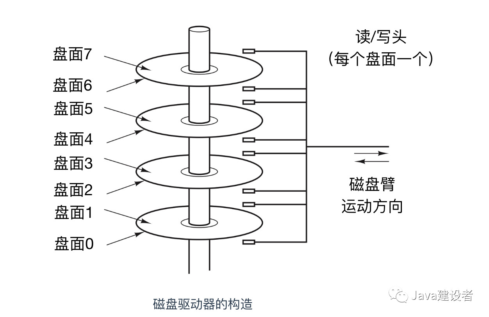

磁盘是一种机械装置，在一个磁盘中有一个或多个金属盘片，它们以 5400rpm、7200rpm、10800rpm 或更高的速度旋转。从边缘开始有一个机械臂悬横在盘面上，这类似于老式播放塑料唱片 33 转唱机上的拾音臂。信息会写在磁盘一系列的同心圆上。在任意一个给定臂的位置，每个磁头可以读取一段环形区域，称为`磁道(track)`。把一个给定臂的位置上的所有磁道合并起来，组成了一个`柱面(cylinder)`。

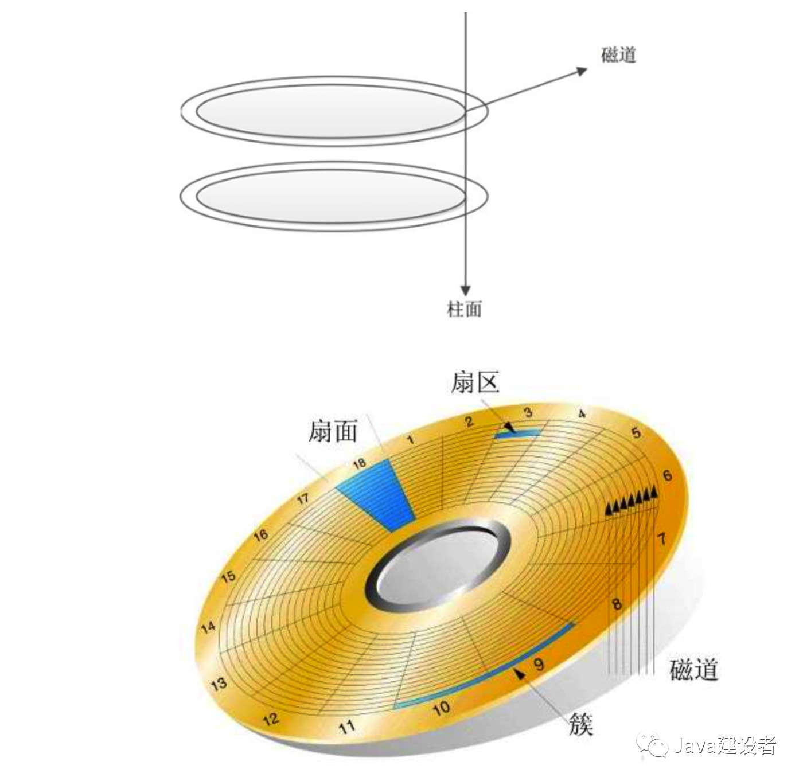

每个磁道划分若干扇区，扇区的值是 512 字节。在现代磁盘中，较外部的柱面比较内部的柱面有更多的扇区。机械臂从一个柱面移动到相邻的柱面大约需要 1ms。而随机移到一个柱面的典型时间为 5ms 至 10ms，具体情况以驱动器为准。一旦磁臂到达正确的磁道上，驱动器必须等待所需的扇区旋转到磁头之下，就开始读写，低端硬盘的速率是`50MB/s`，而高速磁盘的速率是 `160MB/s`。

> 需要注意，`固态硬盘(Solid State Disk, SSD)`不是磁盘，固态硬盘并没有可以移动的部分，外形也不像唱片，并且数据是存储在`存储器（闪存）`中，与磁盘唯一的相似之处就是它也存储了大量即使在电源关闭也不会丢失的数据。

许多计算机支持一种著名的`虚拟内存`机制，这种机制使得期望运行的存储空间大于实际的物理存储空间。其方法是将程序放在磁盘上，而将主存作为一部分缓存，用来保存最频繁使用的部分程序，这种机制需要快速映像内存地址，用来把程序生成的地址转换为有关字节在 RAM 中的物理地址。这种映像由 CPU 中的一个称为 `存储器管理单元(Memory Management Unit, MMU)`的部件来完成。

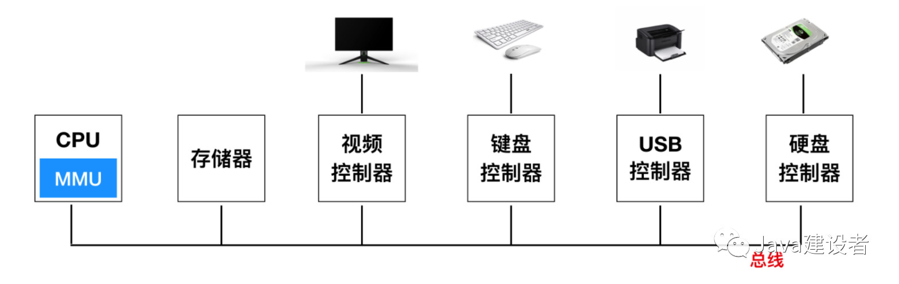

缓存和 MMU 的出现是对系统的性能有很重要的影响，在多道程序系统中，从一个程序切换到另一个程序的机制称为 `上下文切换(context switch)`，对来自缓存中的资源进行修改并把其写回磁盘是很有必要的。

### I/O 设备

CPU 和存储器不是操作系统需要管理的全部，`I/O` 设备也与操作系统关系密切。可以参考上面这个图片，I/O 设备一般包括两个部分：设备控制器和设备本身。控制器本身是一块芯片或者一组芯片，它能够控制物理设备。它能够接收操作系统的指令，例如，从设备中读取数据并完成数据的处理。

在许多情况下，实际控制设备的过程是非常复杂而且存在诸多细节。因此控制器的工作就是为操作系统提供一个更简单（但仍然非常复杂）的接口。也就是屏蔽物理细节。**任何复杂的东西都可以加一层代理来解决，这是计算机或者人类社会很普世的一个解决方案**

I/O 设备另一部分是设备本身，设备本身有一个相对简单的接口，这是因为接口既不能做很多工作，而且也已经被标准化了。例如，标准化后任何一个 SATA 磁盘控制器就可以适配任意一种 SATA 磁盘，所以标准化是必要的。`ATA` 代表 `高级技术附件(AT Attachment)`，而 SATA 表示`串行高级技术附件(Serial ATA)`。

> “
>
> AT 是啥？它是 IBM 公司的第二代个人计算机的`高级`技术成果，使用 1984 年推出的 6MHz 80286 处理器，这个处理器是当时最强大的。

像是高级这种词汇应该慎用，否则 20 年后再回首很可能会被无情打脸。

现在 SATA 是很多计算机的标准硬盘接口。由于实际的设备接口隐藏在控制器中，所以操作系统看到的是对控制器的接口，这个接口和设备接口有很大区别。

每种类型的设备控制器都是不同的，所以需要不同的软件进行控制。专门与控制器进行信息交流，发出命令处理指令接收响应的软件，称为 `设备驱动程序(device driver)`。每个控制器厂家都应该针对不同的操作系统提供不同的设备驱动程序。

为了使设备驱动程序能够工作，必须把它安装在操作系统中，这样能够使它在内核态中运行。要将设备驱动程序装入操作系统，一般有三个途径

- 第一个途径是将内核与设备启动程序重新连接，然后重启系统。这是 `UNIX` 系统采用的工作方式
- 第二个途径是在一个操作系统文件中设置一个入口，通知该文件需要一个设备驱动程序，然后重新启动系统。在重新系统时，操作系统回寻找有关的设备启动程序并把它装载，这是 `Windows` 采用的工作方式
- 第三个途径是操作系统能够在运行时接收新的设备驱动程序并立刻安装，无需重启操作系统，这种方式采用的少，但是正变得普及起来。热插拔设备，比如 USB 和 IEEE 1394 都需要动态可装载的设备驱动程序。

每个设备控制器都有少量用于通信的寄存器，例如，一个最小的磁盘控制器也会有用于指定磁盘地址、内存地址、扇区计数的寄存器。要激活控制器，设备驱动程序会从操作系统获取一条指令，然后翻译成对应的值，并写入设备寄存器中，所有设备寄存器的结合构成了 `I/O 端口空间` 。

在一些计算机中，设备寄存器会被映射到操作系统的可用地址空间，使他们能够向内存一样完成读写操作。在这种计算机中，不需要专门的 I/O 指令，用户程序可以被硬件阻挡在外，防止其接触这些存储器地址（例如，采用基址寄存器和变址寄存器）。在另一些计算机中，设备寄存器被放入一个专门的 I/O 端口空间，每个寄存器都有一个端口地址。在这些计算机中，特殊的 `IN` 和 `OUT` 指令会在内核态下启用，它能够允许设备驱动程序和寄存器进行读写。前面第一种方式会限制特殊的 I/O 指令但是允许一些地址空间；后者不需要地址空间但是需要特殊的指令，这两种应用都很广泛。

**实现输入和输出的方式有三种**。

- 在最简单的方式中，用户程序会发起系统调用，内核会将其转换为相应驱动程序的程序调用，然后设备驱动程序启动 I/O 并循环检查该设备，看该设备是否完成了工作（一般会有一些二进制位用来指示设备仍在忙碌中）。当 I/O 调用完成后，设备驱动程序把数据送到指定的地方并返回。然后操作系统会将控制权交给调用者。这种方式称为 `忙等待(busy waiting)`，这种方式的缺点是要一直占据 CPU，CPU 会一直轮询 I/O 设备直到 I/O 操作完成。
- 第二种方式是设备驱动程序启动设备并且让该设备在操作完成时发生中断。设备驱动程序在这个时刻返回。操作系统接着在需要时阻塞调用者并安排其他工作进行。当设备驱动程序检测到该设备操作完成时，它发出一个 `中断` 通知操作完成。

在操作系统中，中断是非常重要的，所以这需要更加细致的讨论一下。

如上图所示，这是一个三步的 I/O 过程，第一步，设备驱动程序会通过写入设备寄存器告诉控制器应该做什么。然后，控制器启动设备。当控制器完成读取或写入被告知需要传输的字节后，它会在步骤 2 中使用某些总线向中断控制器发送信号。如果中断控制器准备好了接收中断信号（如果正忙于一个优先级较高的中断，则可能不会接收），那么它就会在 CPU 的一个引脚上面声明。这就是步骤3

在第四步中，中断控制器把该设备的编号放在总线上，这样 CPU 可以读取总线，并且知道哪个设备完成了操作（可能同时有多个设备同时运行）。

一旦 CPU 决定去实施中断后，程序计数器和 PSW 就会被压入到当前堆栈中并且 CPU 会切换到内核态。设备编号可以作为内存的一个引用，用来寻找该设备中断处理程序的地址。这部分内存称作`中断向量(interrupt vector)`。一旦中断处理程序（中断设备的设备驱动程序的一部分）开始后，它会移除栈中的程序计数器和 PSW 寄存器，并把它们进行保存，然后查询设备的状态。在中断处理程序全部完成后，它会返回到先前用户程序尚未执行的第一条指令，这个过程如下

- 实现 I/O 的第三种方式是使用特殊的硬件：`直接存储器访问(Direct Memory Access, DMA)` 芯片。它可以控制内存和某些控制器之间的位流，而无需 CPU 的干预。CPU 会对 DMA 芯片进行设置，说明需要传送的字节数，有关的设备和内存地址以及操作方向。当 DMA 芯片完成后，会造成中断，中断过程就像上面描述的那样。我们会在后面具体讨论中断过程

当另一个中断处理程序正在运行时，中断可能（并且经常）发生在不合宜的时间。因此，CPU 可以禁用中断，并且可以在之后重启中断。在 CPU 关闭中断后，任何已经发出中断的设备，可以继续保持其中断信号处理，但是 CPU 不会中断，直至中断再次启用为止。如果在关闭中断时，已经有多个设备发出了中断信号，中断控制器将决定优先处理哪个中断，通常这取决于事先赋予每个设备的优先级，最高优先级的设备优先赢得中断权，其他设备则必须等待。

### 总线

上面的结构（简单个人计算机的组件图）在小型计算机已经使用了多年，并用在早期的 IBM PC 中。然而，随着处理器核内存变得越来越快，单个总线处理所有请求的能力也达到了上线，其中也包括 IBM PC 总线。必须放弃使用这种模式。其结果导致了其他总线的出现，它们处理 I/O 设备以及 CPU 到存储器的速度都更快。这种演变的结果导致了下面这种结构的出现。

上图中的 x86 系统包含很多总线，**高速缓存、内存、PCIe、PCI、USB、SATA 和 DMI**，每条总线都有不同的传输速率和功能。操作系统必须了解所有的总线配置和管理。其中最主要的总线是 `PCIe(Peripheral Component Interconnect Express)` 总线。

Intel 发明的 PCIe 总线也是作为之前古老的 PCI 总线的继承者，而古老的 PCI 总线也是为了取代古董级别的 `ISA(Industry Standard Architecture)` 总线而设立的。数十 Gb/s 的传输能力使得 PCIe 比它的前身快很多，而且它们本质上也十分不同。直到发明 PCIe 的 2004 年，大多数总线都是并行且共享的。`共享总线架构(shared bus architeture)` 表示多个设备使用一些相同的电线传输数据。因此，当多个设备同时发送数据时，此时你需要一个决策者来决定谁能够使用总线。而 PCIe 则不一样，它使用专门的端到端链路。传统 PCI 中使用的`并行总线架构(parallel bus architecture)` 表示通过多条电线发送相同的数据字。例如，在传统的 PCI 总线上，一个 32 位数据通过 32 条并行的电线发送。而 PCIe 则不同，它选用了`串行总线架构(serial bus architecture)` ，并通过单个连接（称为通道）发送消息中的所有比特数据，就像网络数据包一样。这样做会简化很多，因为不再确保所有 32 位数据在同一时刻准确到达相同的目的地。通过将多个数据通路并行起来，并行性仍可以有效利用。例如，可以使用 32 条数据通道并行传输 32 条消息。

在上图结构中，CPU 通过 DDR3 总线与内存对话，通过 PCIe 总线与外围图形设备 （GPU）对话，通过 `DMI(Direct Media Interface)`总线经集成中心与所有其他设备对话。而集成控制中心通过串行总线与 USB 设备对话，通过 SATA 总线与硬盘和 DVD 驱动器对话，通过 PCIe 传输以太网络帧。

不仅如此，每一个核

`USB(Univversal Serial Bus)` 是用来将所有慢速 I/O 设备（比如键盘和鼠标）与计算机相连的设备。USB 1.0 可以处理总计 12 Mb/s 的负载，而 USB 2.0 将总线速度提高到 480Mb/s ，而 USB 3.0 能达到不小于 5Gb/s 的速率。所有的 USB 设备都可以直接连接到计算机并能够立刻开始工作，而不像之前那样要求重启计算机。

`SCSI(Small Computer System Interface)` 总线是一种高速总线，用在高速硬盘，扫描仪和其他需要较大带宽的设备上。现在，它们主要用在服务器和工作站中，速度可以达到 640MB/s 。

### 计算机启动过程

那么有了上面一些硬件再加上操作系统的支持，我们的计算机就可以开始工作了，那么计算机的启动过程是怎样的呢？下面只是一个简要版的启动过程

在每台计算机上有一块双亲板，也就是母板，母板也就是主板，它是计算机最基本也就是最重要的部件之一。主板一般为矩形电路板，上面安装了组成计算机的主要电路系统，一般有 BIOS 芯片、I/O 控制芯片、键盘和面板控制开关接口、指示灯插接件、扩充插槽、主板及插卡的直流电源供电接插件等元件。

在母板上有一个称为 `基本输入输出系统(Basic Input Output System, BIOS)`的程序。在 BIOS 内有底层 I/O 软件，包括读键盘、写屏幕、磁盘I/O 以及其他过程。如今，它被保存在闪存中，它是非易失性的，但是当BIOS 中发现错误时，可以由操作系统进行更新。

在计算机`启动(booted)`时，BIOS 开启，它会首先检查所安装的 RAM 的数量，键盘和其他基础设备是否已安装并且正常响应。接着，它开始扫描 PCIe 和 PCI 总线并找出连在上面的所有设备。即插即用的设备也会被记录下来。如果现有的设备和系统上一次启动时的设备不同，则新的设备将被重新配置。

蓝后，BIOS 通过尝试存储在 `CMOS` 存储器中的设备清单尝试启动设备

> “
>
> CMOS是 `Complementary Metal Oxide Semiconductor（互补金属氧化物半导体）`的缩写。它是指制造大规模集成电路芯片用的一种技术或用这种技术制造出来的芯片，是电脑主板上的一块可读写的 RAM 芯片。因为可读写的特性，所以在电脑主板上用来保存 BIOS 设置完电脑硬件参数后的数据，这个芯片仅仅是用来存放数据的。
>
> 而对 BIOS 中各项参数的设定要通过专门的程序。BIOS 设置程序一般都被厂商整合在芯片中，在开机时通过特定的按键就可进入 BIOS 设置程序，方便地对系统进行设置。因此 BIOS 设置有时也被叫做 CMOS 设置。

用户可以在系统启动后进入一个 BIOS 配置程序，对设备清单进行修改。然后，判断是否能够从外部 `CD-ROM` 和 USB 驱动程序启动，如果启动失败的话（也就是没有），系统将从硬盘启动，boots 设备中的第一个扇区被读入内存并执行。该扇区包含一个程序，该程序通常在引导扇区末尾检查分区表以确定哪个分区处于活动状态。然后从该分区读入第二个启动加载程序，该加载器从活动分区中读取操作系统并启动它。

然后操作系统会询问 BIOS 获取配置信息。对于每个设备来说，会检查是否有设备驱动程序。如果没有，则会向用户询问是否需要插入 `CD-ROM` 驱动（由设备制造商提供）或者从 Internet 上下载。一旦有了设备驱动程序，操作系统会把它们加载到内核中，然后初始化表，创建所需的后台进程，并启动登录程序或GUI。

## 操作系统博物馆

操作系统已经存在了大半个世纪，在这段时期内，出现了各种类型的操作系统，但并不是所有的操作系统都很出名，下面就罗列一些比较出名的操作系统

### 大型机操作系统

高端一些的操作系统是大型机操作系统，这些大型操作系统可在大型公司的数据中心找到。这些计算机的 I/O 容量与个人计算机不同。一个大型计算机有 1000 个磁盘和数百万 G 字节的容量是很正常，如果有这样一台个人计算机朋友会很羡慕。大型机也在高端 Web 服务器、大型电子商务服务站点上。

### 服务器操作系统

下一个层次是服务器操作系统。它们运行在服务器上，服务器可以是大型个人计算机、工作站甚至是大型机。它们通过网络为若干用户服务，并且允许用户共享硬件和软件资源。服务器可提供打印服务、文件服务或 Web 服务。Internet 服务商运行着许多台服务器机器，为用户提供支持，使 Web 站点保存 Web 页面并处理进来的请求。典型的服务器操作系统有 Solaris、FreeBSD、Linux 和 Windows Server 201x

### 多处理器操作系统

获得大型计算能力的一种越来越普遍的方式是将多个 CPU 连接到一个系统中。依据它们连接方式和共享方式的不同，这些系统称为并行计算机，多计算机或多处理器。他们需要专门的操作系统，不过通常采用的操作系统是配有通信、连接和一致性等专门功能的服务器操作系统的变体。

个人计算机中近来出现了多核芯片，所以常规的台式机和笔记本电脑操作系统也开始与小规模多处理器打交道，而核的数量正在与时俱进。许多主流操作系统比如 Windows 和 Linux 都可以运行在多核处理器上。

### 个人计算机系统

接下来一类是个人计算机操作系统。现代个人计算机操作系统支持多道处理程序。在启动时，通常有几十个程序开始运行，它们的功能是为单个用户提供良好的支持。这类系统广泛用于字处理、电子表格、游戏和 Internet 访问。常见的例子是 Linux、FreeBSD、Windows 7、Windows 8 和苹果公司的 OS X 。

### 掌上计算机操作系统

随着硬件越来越小化，我们看到了平板电脑、智能手机和其他掌上计算机系统。掌上计算机或者 `PDA(Personal Digital Assistant)，个人数字助理` 是一种可以握在手中操作的小型计算机。这部分市场已经被谷歌的 `Android` 系统和苹果的 `IOS`主导。

### 嵌入式操作系统

嵌入式操作系统用来控制设备的计算机中运行，这种设备不是一般意义上的计算机，并且不允许用户安装软件。典型的例子有微波炉、汽车、DVD 刻录机、移动电话以及 MP3 播放器一类的设备。所有的软件都运行在 ROM 中，这意味着应用程序之间不存在保护，从而获得某种简化。主要的嵌入式系统有 Linux、QNX 和 VxWorks

### 传感器节点操作系统呢

有许多用途需要配置微小传感器节点网络。这些节点是一种可以彼此通信并且使用无线通信基站的微型计算机。这类传感器网络可以用于建筑物周边保护、国土边界保卫、森林火灾探测、气象预测用的温度和降水测量等。

每个传感器节点是一个配有 CPU、RAM、ROM 以及一个或多个环境传感器的实实在在的计算机。节点上运行一个小型但是真时的操作系统，通常这个操作系统是事件驱动的，可以响应外部事件。

### 实时操作系统

另一类操作系统是实时操作系统，这些系统的特征是将时间作为关键参数。例如，在工业过程控制系统中，工厂中的实时计算机必须收集生产过程的数据并用有关数据控制机器。如果某个动作必须要在规定的时刻发生，这就是`硬实时系统`。可以在工业控制、民用航空、军事以及类似应用中看到很多这样的系统。另一类系统是 `软实时系统`，在这种系统中，虽然不希望偶尔违反最终时限，但仍可以接受，并不会引起任何永久性损害。数字音频或多媒体系统就是这类系统。智能手机也是软实时系统。

### 智能卡操作系统

最小的操作系统运行在智能卡上。智能卡是一种包含一块 CPU 芯片的信用卡。它有非常严格的运行能耗和存储空间的限制。有些卡具有单项功能，如电子支付；有些智能卡是面向 Java 的。这意味着在智能卡的 ROM 中有一个 Java 虚拟机（Java Virtual Machine, JVM）解释器。

# 2.进程和线程

我们平常说的进程和线程更多的是基于编程语言的角度来说的，那么你真的了解什么是线程和进程吗？那么我们就从操作系统的角度来了解一下什么是进程和线程。

## 进程

操作系统中最核心的概念就是 `进程`，进程是对正在运行中的程序的一个抽象。操作系统的其他所有内容都是围绕着进程展开的。进程是操作系统提供的最古老也是最重要的概念之一。即使可以使用的 CPU 只有一个，但它们也支持（伪）并发操作。它们会将一个单独的 CPU 变换为多个虚拟机的 CPU。没有进程的抽象，现代操作系统将不复存在。

所有现代的计算机会在同一时刻做很多事情，过去使用计算机的人可能完全无法理解现在这种变化，举个例子更能说明这一点：首先考虑一个 Web 服务器，请求都来自于 Web 网页。当一个请求到达时，服务器会检查当前页是否在缓存中，如果是在缓存中，就直接把缓存中的内容返回。如果缓存中没有的话，那么请求就会交给磁盘来处理。但是，从 CPU 的角度来看，磁盘请求需要更长的时间，因为磁盘请求会很慢。当硬盘请求完成时，更多其他请求才会进入。如果有多个磁盘的话，可以在第一个请求完成前就可以连续的对其他磁盘发出部分或全部请求。很显然，这是一种并发现象，需要有并发控制条件来控制并发现象。

现在考虑只有一个用户的 PC。当系统启动时，许多进程也在后台启动，用户通常不知道这些进程的启动，试想一下，当你自己的计算机启动的时候，你能知道哪些进程是需要启动的么？这些后台进程可能是一个需要输入电子邮件的电子邮件进程，或者是一个计算机病毒查杀进程来周期性的更新病毒库。某个用户进程可能会在所有用户上网的时候打印文件以及刻录 CD-ROM，这些活动都需要管理。于是一个支持多进程的多道程序系统就会显得很有必要了。

在许多多道程序系统中，CPU 会在`进程`间快速切换，使每个程序运行几十或者几百毫秒。然而，严格意义来说，在某一个瞬间，CPU 只能运行一个进程，然而我们如果把时间定位为 1 秒内的话，它可能运行多个进程。这样就会让我们产生`并行`的错觉。有时候人们说的 `伪并行(pseudoparallelism)` 就是这种情况，以此来区分多处理器系统(该系统由两个或多个 CPU 来共享同一个物理内存)

> 再来详细解释一下伪并行：`伪并行`是指单核或多核处理器同时执行多个进程，从而使程序更快。通过以非常有限的时间间隔在程序之间快速切换CPU，因此会产生并行感。缺点是时间可能分配给下一个进程，也可能不分配给下一个进程。

我们很难对多个并行进程进行跟踪，因此，在经过多年的努力后，操作系统的设计者开发了用于描述并行的一种概念模型（顺序进程），使得并行更加容易理解和分析，对该模型的探讨，也是本篇文章的主题

### 进程模型

在进程模型中，所有计算机上运行的软件，通常也包括操作系统，被组织为若干`顺序进程(sequential processes)`，简称为 `进程(process)` 。一个进程就是一个正在执行的程序的实例，进程也包括程序计数器、寄存器和变量的当前值。从概念上来说，每个进程都有各自的虚拟 CPU，但是实际情况是 CPU 会在各个进程之间进行来回切换。

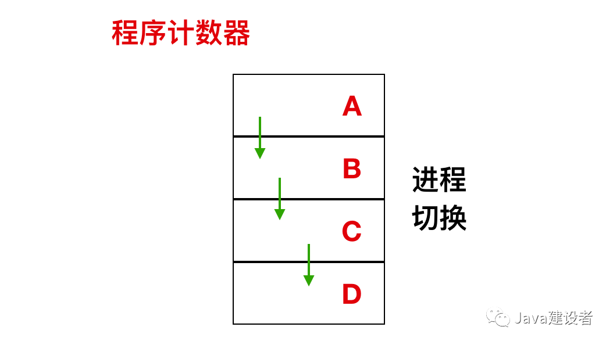

如上图所示，这是一个具有 4 个程序的多道处理程序，在进程不断切换的过程中，程序计数器也在不同的变化。

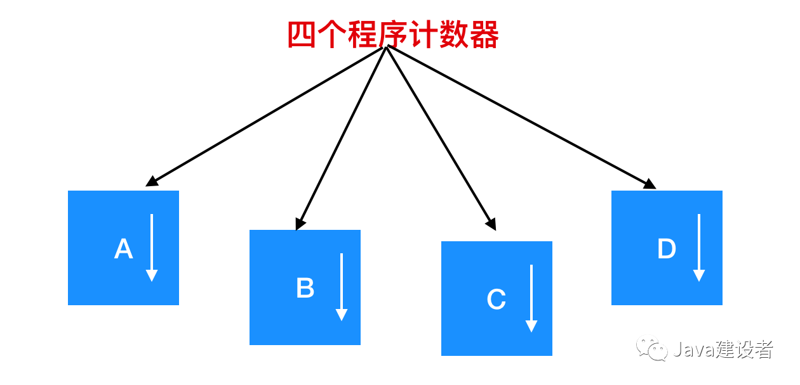

在上图中，这 4 道程序被抽象为 4 个拥有各自控制流程（即每个自己的程序计数器）的进程，并且每个程序都独立的运行。当然，实际上**只有一个物理程序计数器**，每个程序要运行时，其逻辑程序计数器会装载到物理程序计数器中。当程序运行结束后，其物理程序计数器就会是真正的程序计数器，然后再把它放回进程的逻辑计数器中。

从下图我们可以看到，在观察足够长的一段时间后，所有的进程都运行了，**但在任何一个给定的瞬间仅有一个进程真正运行**。

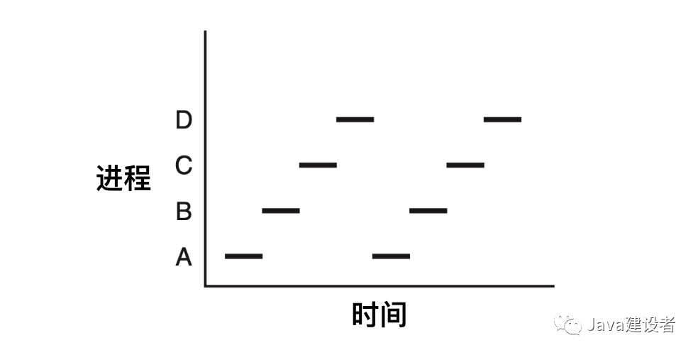

在我们接下来的讨论中，我们假设只有一个 CPU 的情形。当然，这个假设通常放到现在不会存在了，因为新的芯片通常是多核芯片，包含 2 个、4 个或更多的 CPU。但是现在，一次只考虑一个 CPU 会便于我们分析问题。因此，当我们说一个 CPU 只能真正一次运行一个进程的时候，即使有 2 个核（或 CPU），**每一个核也只能一次运行一个进程**。

由于 CPU 会在各个进程之间来回快速切换，所以每个进程在 CPU 中的运行时间是无法确定的。并且当同一个进程再次在 CPU 中运行时，其在 CPU 内部的运行时间往往也是不固定的。进程和程序之间的区别是非常微妙的，但是通过一个例子可以让你加以区分：想想一位会做饭的计算机科学家正在为他的女儿制作生日蛋糕。他有做生日蛋糕的食谱，厨房里有所需的原谅：面粉、鸡蛋、糖、香草汁等。在这个比喻中，做蛋糕的食谱就是程序、计算机科学家就是 CPU、而做蛋糕的各种原谅都是输入数据。进程就是科学家阅读食谱、取来各种原料以及烘焙蛋糕等一系例了动作的总和。

现在假设科学家的儿子跑过来告诉他，说他的头被蜜蜂蜇了一下，那么此时科学家会记录出来他做蛋糕这个过程到了哪一步，然后拿出急救手册，按照上面的步骤给他儿子实施救助。这里，会涉及到进程之间的切换，科学家（CPU）会从做蛋糕（进程）切换到实施医疗救助（另一个进程）。等待伤口处理完毕后，科学家会回到刚刚记录做蛋糕的那一步，继续制作。

这里的关键思想是`认识到一个进程所需的条件`，进程是某一类特定活动的总和，它有程序、输入输出以及状态。单个处理器可以被若干进程共享，它使用某种调度算法决定何时停止一个进程的工作，并转而为另外一个进程提供服务。另外需要注意的是，如果一个进程运行了两遍，则被认为是两个进程。

### 进程的创建