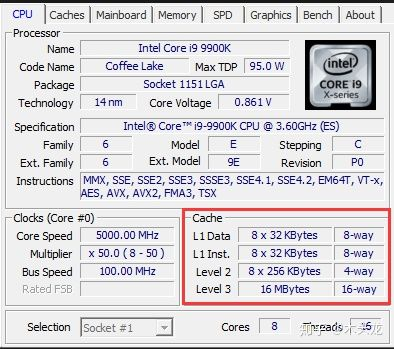

# 计算机架构

来源：https://zhuanlan.zhihu.com/p/63322067

## 冯·诺依曼架构

现代计算机，常见的有两种架构，其中一种是冯·诺依曼架构。先看图：

想象一下我们在做数学考试：

1. 输入设备就是考卷，题目都在卷子上。同样的计算机要计算哪些数据，怎么计算，都来自于输入设备。
2. 内存就是草稿纸，我们会把要计算的题目抄写到草稿纸上，用草稿纸记录计算的中间过程。同样的，计算机要把来自输入设备的数据，以及要怎么计算这些数据的指令，从输入设备载入到内存中，并且把每一步计算的结果写入到内存。
3. 运算单元是计算器，我们用计算器来计算每一步的加减乘除。同样的，计算机有专用的运算单元，来计算数据。（假设这次数学考试允许带计算器）
4. 控制单元就是我们自己了。我们根据试卷上的算式，来决定第一步是算乘法还是加法，乘法是哪两个数相乘，加法又是哪两个数相加。
5. 输出设备就是答题卡。我们计算完一道题后，需要把草稿纸上的结果抄写在答题卡上。
6. 其中，我们自己+计算器的组合，在计算机里面是同一个设备——CPU（Central Processing Unit，中央处理器）。

## 哈佛架构

另一种计算机架构，是哈佛架构。先看图：

可以看出来，哈弗架构和冯·诺依曼架构最大的不同就是内存分为独立的指令内存和数据内存。这个怎么理解呢？我们换个例子，假设我们毕业了，现在的工作是一名会计。我们的工作是根据一份财务报表制作指南，对账本上的数字进行计算各种指标，制作财务报表。

哈弗架构中指令内存中存放的，就是这份制作指南，告诉我们财务报表上的每一个指标要怎么计算；数据内存中存放的，就是我们计算指标需要用到的账本上的数据。当我们计算报表上的某个指标的时候，如果我们发现手上的账本没有相关的数据，我们可以先根据指南计算报表上的其它指标，让其它同事帮忙去找相关的账本，不用停下来浪费时间。

所以，和冯·诺依曼架构相比，哈佛架构因为指令内存的读取和数据内存的读写分开，一定程度上可以保证指令的连续性，不会因为需要访问内存上的数据造成指令堵塞。

## 改进型哈佛架构

那么我们现在的计算机，到底是那种呢？其实是这两种架构的混合体。对于一台计算机的整体来说，我们可以认为是冯·诺依曼架构，计算机中的内存是统一的，并没有明确分为指令内存还是数据内存。

但是现代计算机中，相对于CPU的速度来说，从内存读取数据和写入数据都很慢的，因此CPU内部有另外一种速度更快的存储介质来存放数据和指令，我们称之为缓存（Cache）。打个比方，存储在内存中的数据就是我们书包里面的书，在缓存中的数据就是放在桌面上的书。我们要看一本书，需要把书从书包里面拿出来，放到桌子上摊开才能看。但是桌子的大小是有限的，我们只能在桌上摊开两三本书，更多的书我们只能放到书包里面。现代计算机中缓存通常有多层，每一层都比下一层快，但比下一层可以存放的数据少。如下图：

而CPU内部，控制单元和运算单元直接访问的缓存，我们称之为一级缓存（Level 1 Cache，L1 Cache）。现代CPU的一级缓存，都是分为一级指令缓存、一级数据缓存两部分，这个可以通过CPU-Z检测软件看出来。所以事实上我们可以认为现代计算机，其真正的架构是哈佛架构。

从上图红框内容可以看到，Intel的i9-9900K，一共有8个核心，每个核心有32KB的一级数据缓存，32KB的一级指令缓存；每个核心有256KB的二级缓存，不再分为指令缓存还是数据缓存；整个CPU还有一层16MB的三级缓存。

这样的架构，称之为改进型哈佛架构。

## 丰富多样的输入/输出设备

前面提到的输入、输出设备有很多种具体的设备，最常见的输入设备有：

- 键盘：我们通过键盘向计算输入各种指令和数据。
- 鼠标：我们通过鼠标告诉计算机，在计算机显示出来的图像中，我们想对哪个元素进行什么样的操作。
- 硬盘：计算机运行存储在硬盘上的各种程序，对存放在硬盘上的各种数据进行计算。
- 网卡：我们可以直接执行来自于网上的程序，也可以直接对网上的数据进行计算。

除此之外，还有很多其它专用的输入设备，例如麦克风、摄像头、扫描仪、视频采集卡、各种传感器等等。

比较常见的输出设备有：

- 显示器：计算机把处理结果显示出来给我们看。
- 硬盘：我们把处理完毕的数据存放到硬盘上。
- 网卡：我们把处理完毕的数据传到网上。
- 打印机：把处理完毕的结果打印到纸上。

除此之外，还有其它专用的输出设备，例如音箱、各种控制器。

可以看到，上面的输入/输出设备中，像网卡、硬盘都是同时作为输出设备和输入设备存在的，而其它即使看上去是纯粹的输入设备，绝大部分都会需要接受CPU输出的控制指令、工作参数输入；纯粹的输出设备，也需要向CPU报告设备信息（例如设备类型、型号，工作状态等），所以统称为IO设备（Input/Output Devices）或者输入输出设备。

## 其它配件

除了上面提到的CPU、内存和IO设备外，一台完整的计算机，还需要：

- 主板：把上面这些部件连接在一起，让它们可以协同工作。当然，现代主板上面还有很多功能，例如集成网卡/声卡等等。
- 电源：给所有这些部件提供电力。
- 散热器：给发热较大的部件（例如CPU、高性能显卡）散热。
- 机箱：用于固定安装所有的上述部件的外壳。

# 指令集

参考来源：

https://zhuanlan.zhihu.com/p/46170108

https://blog.csdn.net/zyhse/article/details/108560397

https://blog.csdn.net/qq_34160841/article/details/105744375

## 什么是指令集

指令集，**就是CPU中用来计算和控制计算机系统的一套指令的集合**，而每一种新型的CPU在设计时就规定了一系列与其他硬件电路相配合的指令系统。而指令集的先进与否，也关系到CPU的性能发挥，它也是CPU性能体现的一个重要标志。

通俗的理解，指令集就是CPU能认识的语言，指令集运行于一定的微架构之上，不同的微架构可以支持相同的指令集，比如Intel和AMD的CPU的微架构是不同的，但是同样支持X86指令集，这很容易理解，指令集只是一套指令集合，一套指令规范，具体的实现，仍然依赖于CPU的翻译和执行。就像，同样是一段C语言代码，我们可以用不同的编译器去编译得到不同的可执行文件，当然，自然而言，效率也可能不一样。

指令集架构（Instruction Set Architectures）

目前市面上存在两种指令集架构类型:

1. **Reduced Instruction Set Computing (RISC) 精简指令集，比如ARM,MIPS等。** 这种指令集的特点是指令数目少，每条指令都采用标准字长、执行时间短、中央处理器的实现细节对于机器级程序是可见的。
2. **Complex Instruction Set Computing (CISC) 复杂指令集，比如Intel的X86等**

在CISC微处理器中，程序的各条指令是按顺序串行执行的，每条指令中的各个操作也是按顺序串行执行的。顺序执行的优点是控制简单，但计算机各部分的利用率不高，执行速度慢。

通俗的理解，RICS指令集是针对CISC指令集中的一些常用指令进行优化设计，放弃了一些复杂的指令，对于复杂的功能，需要通过组合指令来完成。自然，两者的使用场合不一样，对于复杂的系统，CISC更合适，否则，RICS更合适，且低功耗。

注意：当初本没有RICS和CISC之分，最开始，Intel X86的第一个CPU定义了第一套指令集，这就是最开始的指令集，后来，一些公司发现很多指令并不常用，所以决定设计一套简洁高效的指令集，称之为RICS指令集，从而将原来的Intel X86指令集定义为CISC指令集。所以，并不是先有RICS后来才有CISC，而是反过来的。

典型的RICS指令集的CPU有：ARM、MIPS等

典型的CICS指令集的CPU有：Intel的x86指令集，以及现在的AMD的x86-64指令集。PS：AMD的兼容CPU也支持x86指令集，反之。

当然，目前最火的当属基于RISC开发的ARM架构，在移动通信时代，凭借着低功耗打遍天下无敌手。手机，平板，自动驾驶等等等等，一招鲜吃遍天。而且RISC的构架也是ARM低功耗原因之一。RISC的CPU包含有较少的单元电路，因而面积小、功耗低；而CISC的CPU包含有丰富的电路单元，因而功能强、面积大、功耗大。

**X86**，依靠强有力的Intel，强势控制产业链，获取价值链上最丰厚的那部分利润.

**ARM**， 靠IP授权的商业模式，且技术上走与Intel差异化路线，加上一些些运气（踏对了手机这条路，谢谢TI-Nokia，Apple，Samsung for big.Little）走小而美的路线，但是凭借已经形成巨大的生态系统，占据优势.

**MIPS**，很学术很精美很帅，但是对指令集控制松散，导致生态系统分裂，没有形成合力，最终被市场抛弃。　

CPU架构是CPU商给CPU产品定的一个规范，主要目的是为了区分不同类型的CPU。目前市场上的CPU分类主要分有两大阵营，**一个是intel、AMD为首的复杂指令集CPU**，**另一个是以IBM、ARM为首的精简指令集CPU**。不同品牌的CPU，其产品的架构也不相同，

Intel、AMD的CPU是X86架构，

IBM公司的CPU是PowerPC架构，

ARM公司的CPU是ARM架构，国内的飞腾CPU也是ARM架构。此外还有MPIS架构、SPARC架构、Alpha架构。

## 指令集的发展

上面的分类是一个大致的分类，指令集是一直在发展的，在CISC指令集中，慢慢的发展了一系列的指令集：

\1. X86指令集：

X86指令集是Intel为其第一块16位CPU(i8086)专门开发的，IBM1981年推出的世界第一台PC机中的CPU—i8088(i8086简化版)使用的也是X86指令，同时电脑中为提高浮点数据处理能力而增加的X87芯片系列数学协处理器则另外使用X87指令，以后就将X86指令集和X87指令集统称为X86指令集。

\2. MMX指令集：

1997年Intel公司推出了多媒体扩展指令集MMX（MultiMedia eXtensions），它包括57条多媒体指令。MMX指令主要用于增强CPU对多媒体信息的处理能力，提高CPU处理3D图形、视频和音频信息的能力。

\3. SSE指令集：Streaming SIMD Extensions

由于MMX指令并没有带来3D游戏性能的显著提升，所以，1999年Inter公司在Pentium III CPU产品中推出了数据流单指令序列扩展指令（SSE）。SSE兼容MMX指令，它可以通过SIMD（单指令多数据技术）和单时钟周期并行处理多个浮点来有效地提高浮点运算速度。

\4. SSE2指令集：

在Pentium 4 CPU中，Inter公司开发了新指令集SSE2。这一次新开发的SSE2指令一共144条，包括浮点SIMD指令、整形SIMD指令、SIMD浮点和整形数据之间转换、数据在MMX寄存器中转换等几大部分。其中重要的改进包括引入新的数据格式，如：128位SIMD整数运算和64位双精度浮点运算等。

\5. SSE3指令集：

相对于SSE2，SSE3又新增加了13条新指令，此前它们被统称为pni(prescott new instructions)。13条指令中，一条用于视频解码，两条用于线程同步，其余用于复杂的数学运算、浮点到整数转换和SIMD浮点运算。

\6. SSE4指令集：

SSE4又增加了50条新的增加性能的指令，这些指令有助于编译、媒体、字符/文本处理和程序指向加速。

\7. 3D Now!扩展指令集：

3D Now!指令集是AMD公司1998年开发的多媒体扩展指令集，共有21条指令。针对MMX指令集没有加强浮点处理能力的弱点，重点提高了AMD公司K6系列CPU对3D图形的处理能力。由于指令有限，3D Now!指令集主要用于3D游戏，而对其他商业图形应用处理支持不足。

\8. EM64T指令集：

Intel公司的EM64T（Extended Memory 64 Technology）即64位内存扩展技术。该技术为服务器和工作站平台应用提供扩充的内存寻址能力，拥有更多的内存地址空间，可带来更大的应用灵活性，特别有利于提升音频视频编辑、CAD设计等复杂工程软件及游戏软件的应用。

\9. 3DNow!+指令集：
在原有的指令集基础上，增加到52条指令，其中包含了部分SSE指令，该指令集主要用于新型的AMD CPU上。

\10. AVX指令集：

Intel公司将为Sandy Bridge带来全新的指令扩展集Intel Advanced Vector Extensions (Intel AVX)。AVX是在之前的128bit扩展到和256bit的SIMD(Single Instruction, Multiple Data)。而Sandy Bridge的SIMD演算单元扩展到256bits的同时数据传输也获得了提升，所以从理论上看CPU内核浮点运算性能提升到了2倍。

 

总结：可以看到，CPU指令集是一只在不断发展的，随着需求的不断增加，指令集也在不断扩展，从而提高CPU的性能。RICS指令集一般用于[嵌入式](https://so.csdn.net/so/search?q=嵌入式&spm=1001.2101.3001.7020)等场合，所以指令集并没有太多的扩展。

# CPU架构解读

来源：https://zhuanlan.zhihu.com/p/65840506

我们家里用的电脑，CPU只有两家厂商在生产：Intel和AMD。每家厂商都提供很多型号的CPU，这篇文章以Intel生产的，主流市场上的旗舰型号：Core i9-9900K为例子来介绍。

## 9900K整体架构

还是先看图

9900K大概可以分为5个部分：

1. **CPU核心**：图中红框部分为一个核心，9900K一共有8个核心。早期的CPU其实就只有这么一个东西，但现在的CPU逐步发展，把一些周边的部件也集成在同一块半导体晶片上，因此传统的CPU就变成了现代CPU上的核心。此外，为了提高CPU的计算能力，单块CPU中的核心数量越来越多，就消费级市场来说，从2005第一款双核心CPU奔腾D发布到今天的单块CPU晶片有8个核心的i9-9900K。

2. **三级缓存**（Level 3 Cache，简写为L3、L3$、L3C、L3 Cache）：图中中间8个粉色块组成的三级缓存，用于临时存放内存中的一小部分数据。这里分成8小块，对应8个CPU核心。有时候L3也叫末级缓存（Last Level Cache，LLC），当然，对9900K这样具有三级缓存的CPU，L3才等同于LLC。有的老式CPU有的只有二级缓存，LLC就是L2；某些服务器使用的CPU有四级缓存，LLC则是指L4。

3. **核心显卡**：图中左边紫框部分，这个以后的文章中我们再介绍。

4. **系统代理**：图中右边绿色部分，这是负责连接CPU与其它部件的多个模块的集合。从上到下分别是：

5. 1. 显示控制器：负责核心显卡输出；
   2. PCI-e控制器：负责CPU与外部IO设备连接，以后的文章我们会另外介绍；
   3. eDRAM控制器：这个其实9900K是没有的，某些定制型号会集成有特殊的内存，称为嵌入式动态随机访问存储（Embedded Dynamic Random-Access Memory, eDRAM）。一般来说eDRAM是作为核心显卡的专用显存使用，这个控制器就是负责从eDRAM读写数据的。
   4. 内存控制器：负责CPU与内存连接，从内存中读写数据。

6. **环形总线**（RingBus）：把上面这些模块连接起来的，上图中标记着Ring的蓝色圈。

## 核心架构图

这张图看起来很复杂是不是？不用担心，我们一个一个说。当然，我们这是入门知识，不会介绍的太细。

我们上一篇文章提到，现代CPU都是改进型哈弗架构；并且举了一个会计做财务报告的例子。这里我们继续使用这个例子来介绍。但之前，我们稍微改一下做财务报告的方式，不是一个人全部做完，我们是一个团队。有的同事根据制作指南列计算步骤，有的同事根据计算步骤在小纸条上列公式，有的同事负责从账本上把数据抄到写好公式的小纸条上，有的同事对着小纸条用计算器算数并且算完了写回小纸条上，有的同事把小纸条上的数抄到最终的财务报表上。CPU里面，小纸条有一个专门的名称，叫寄存器（Register）。

### 缓存子系统（Memory Subsystem）

一家规模比较大点的企业，完整的账本很厚。我们做整年的财务报告，通常只需要每个科目的汇总数就可以了，为了方便，我们把每个科目汇总的那几页复印出来放在一起。

完整的财务报告制作指南也很厚，但一个企业可能只有其中很少一部业务。例如一家软件公司，就不涉及原材料进货、仓库存储之类的业务；很多公司也没有贷款、投资之类的业务。所以我们也只把跟公司有相关业务的部分复印出来。

同样的，内存中的数据很多，CPU只需要把计算用到的指令、数据放到缓存中——也就是图中的紫色块的缓存子系统。

### 前端（Front End）

CPU的前端其实就是我们上篇文章中的控制单元，负责对指令进行预处理。指令预处理大体上分为取指、预解码、融合、解码、分支预测、重排等操作。

**取指（Fetch）**

我们制作财务报表，第一步就是把制作指南拿出来。CPU也一样，先把指令载入进来。

**预解码（PreDecode）**

制作指南是一整页的，我们要分解出第一步算哪个数据，第二步又是算哪个数据，在小纸条上把公式列出来，一张小纸条一个公式。CPU也一样，要把程序中一整批的指令数据，拆分出来第一条是什么指令，第二条是什么指令；可能还需要对指令进行分类标志。预解码后的指令放在指令队列(Instruction Queue)里面。

**解码（Decode），又称为译码**

小纸条上的公式写着：利润=收入-支出，查帐本的同事就需要先把收入和支出数据从账本中找出来，抄到小纸条上。同样的，CPU碰到类似把内存中两个数加起来这样的指令，需要分解成：

1. 从内存载入第一个数字；
2. 从内存载入第二个数字；
3. 两个数字相加

这样三个指令。一般来说，我们把原始的指令称为宏操作(Macro-Operations)，分解后的指令称为微操作(Micro-Operations, μops)。

**指令融合（Micro-Fusion/Macro-Fusion）**

假设指南中有一个数据是算平均数的，某个按计算器的同事手上整好有一个可以直接算平均数的统计用计算器。那么，当我们在指南中看到一条类似 ![[公式]](汇编语言简介.assets/div+N.svg+xml) 这样的公式的时候，我们可以直接列算这几个数的平均数公式，注明给这位同事算。CPU也一样，某些指令是可以融合起来执行的，例如：

1. 比较A和B的大小；
2. 如果A不等于B，跳转到标志X的指令。

可以用一条指令JNE A,B,X来代替，这样的处理称之为指令融合。指令解码前的宏操作融合，称为Macro-Fusion，解码后的微操作融合，称为Micro-Fusion。

**分支预测（Branch Prediction）**

理论上，制作指南中列出的所有步骤，我们都要完成上面的这些处理。但假设制作指南中说，盈利的话要算某几个数据，亏损的话这几个数不用算，要另外算其它几个数据。当我们计算过第一季度的数据知道企业第一季度是盈利的，我们算第二季度的数据时，想偷懒就直接跳过亏损要算的那几个数据的处理了。CPU处理指令也是一样的，负责预测的模块叫分支预测器（Branch Predictor）

当然，如果算下来我们发现第二季度亏损了，还是要重新处理指南上的这些计算步骤。CPU也一样。

**指令重排，或者叫乱序执行（Out-Of-Order，OOO），或者动态执行（Dynamic Execution）**

事实上，我们不一定要完全按照指南上的步骤第一步算什么，第二步算什么这样算。只要公式列出来，数据抄出来了，就可以直接交给按计算器的同事去算。所以可能第一步要用的数据不太好找，按计算器的同事就先把第二步算出来了。

当然，这里有一个前提，就是算第二步的时候，不需要用到第一步的计算结果。

### 执行单元（Execution Engine）

执行单元也就是上一篇文章提到的运算单元了。也就是我们这个团队里抄数据、按计算器的各位同事了。其中，按计算器的同事中，有的用的计算器简单点，只能做四则计算，还只能算整数；有的用高级点的计算器，可以算小数；有的用统计专用的计算器；有的用更高级的可以算很多函数的计算器。当然，有这么多不同的计算器，什么样的小纸条给哪位同事用，我们也需要有一个人来做分配小纸条这件事情。

**数据存取单元（Load Data/Store Data)**

CPU里面也一样，有负责从缓存子系统中载入数据的Load Data单元；有把计算结果写回去缓存子系统的Store Data单元。

**计算单元**

CPU里面负责具体计算的，根据计算类型、计算的数据不同，有多种计算单元：

1. 整数算术逻辑单元（Integer Arithmetic Logic Unit，Int ALU)，算整数加减法/二进制运算；需要说明一下的，电脑里面很多小数计算也是通过移位操作处理后，用整数单元计算后再数小数位这样的方式来处理的。
2. 整数乘法器（Integer Multiplier，Int MUL），专门负责整数乘法的；
3. 整数除法器（Integer Divider，Int DIV），专门负责整数除法的；
4. 分支处理（Branch），负责各种跳转指令的；
5. 地址生成器（Address Generation Unit，AGU），这个稍微解释一下，例如制作指南中说，总收入要和上一年度的总收入对比算增长率，那么就需要翻译成“现在做2018年的年报，上一年度就是2017年度总收入”。CPU也是一样，有的指令是把内存地址A1的数和A1后面第五个地址的数相加，那么要先算出来A1后面五个地址A2到底是哪个地址。
6. 整数向量ALU（Int Vect ALU），向量是指类似空间坐标+值（x，y，z, value）这样的一组数据，其中x、y、z和value都是整数。类似整数，除了算加减法/二进制的整数向量ALU，还有整数向量乘法器、除法器（Int Vect MUL，Int Vect DIV）。
7. 浮点向量加乘融合单元（Fused multiply–add，FP FMA），这个也要解释一下。我们知道，105可以写成 ![[公式]](https://www.zhihu.com/equation?tex=1.05+%5Ctimes+10%5E%7B2%7D) 这样的形式，这种形式在计算机中称为浮点数。上面提到向量中，如果（x，y，z，value）中的一个或者多个都是浮点，就是浮点向量。而加乘融合，是指 ![[公式]](https://www.zhihu.com/equation?tex=A+%2B+B+%5Ctimes+C) 这样的计算，当然，可以算加乘融合的，自然也可以用来算加减法和乘法：A=0就是乘法，C=1就是加减法。
8. 浮点除法单元（FP DIV）：算浮点除法的，也可以算一些常用函数例如开方、对数等。
9. 其它：例如加密用的AES，字符串处理的Vect String，位查找的bit Scan（对一个二进制数据按照多种方法数0）

**调度器（Scheduler）**

有这么多不同的计算单元，CPU需要一个把不同的计算指令分配给对应计算单元的调度器。

不过呢，我们这个财务部比较特殊，分了几个小办公室，某几个同事在一个办公室里面，另外几个同事又在另一个办公室里面，而每次我们只能传一张小纸条到一个办公室。

在9900K里面，从图中可以看到，不同的计算单元在不同的端口（Port）下，就是类似的情况。

**寄存器文件（Register File）**

计算财务数据的时候，很多数据的计算是需要多步计算的，具体到每一步的计算，可能要分给不同的同事来算。如果每一步列一张小纸条，等某位同事算完第一个数，再抄到第二张小纸条给另外一位同事，这显然很慢很麻烦——直接列在一张小纸条上就好了嘛。

另外，我们有这么多同事，分配小纸条的同事每次传小纸条可以一次分配好多张——当然，前提是分给不同的同事。

因为可能一张纸条要算好几次，又有这么多纸条传来传去，因此为了不出错，我们需要标明这张小纸条给谁算，算完了，负责分配小纸条的同事根据下一步要算的，把标注的名字改一下给另外一位同事去算。

CPU中的寄存器也一样，一个数据可能需要不同的计算单元多次处理，又有那么多的计算单元分成了好几组。所以我们需要多个寄存器，这些寄存器的组合称之为寄存器文件。每个计算单元只能处理特定名称的寄存器里面的数据，因此调度器经常需要对寄存器进行分配、重命名、退出等操作。