# 文法引入：英语句子文法

**文法**：描述语言的语法结构的形式规则，也就是语言的规则，规定单词如何构成短语、语句、过程和程序。

He gave me a book.

这个英语句子的文法如下：

```
<句子>→<主语><谓语><间接宾语><直接宾语>
<主语>→<代词>
<谓语>→<动词>
<间接宾语>→<代词>
<直接宾语>→><冠词><名词>
<代词>→He
<代词>→me
<名词>→book
<冠词>→>a
<动词>→gave
```

箭头→的含有是：定义为、表示为、构成

可以根据这个文法规则，推导出产生句子的过程：以下就是逐步替换的过程

​    <句子>  
=>**<主语> <谓语> <间接宾语> <直接宾语>**  
=>**<代词> **<谓语> <间接宾语> <直接宾语>    
=>**He **<谓语> <间接宾语> <直接宾语>  
=>He **<动词>** <间接宾语> <直接宾语>  
=>He **gave** <间接宾语> <直接宾语>  
=>He gave **<代词>** <直接宾语>  
=>He gave **me** <直接宾语>  
=>He gave me **<冠词> <名词>**  
=>He gave me **a** <名词>    
=>He gave me a **book**  

# 语法描述的几个基本概念

**字母表**：一个有穷字符集，记为∑   
字母表中每个元素称为**字符**  

∑上的**字**（也叫做**字符串**）是指由∑中的字符所构成的一个有穷序列  
不包含任何字符的序列为称为**空字**，记为ε  

用∑^*^表示∑上的所有**字的全体**，包含空字ε  
例如：设∑={a,b}，则∑\*={ε,a,b,aa,ab,ba,bb,aaa,...无穷个}

∑^*^的子集U和V的连接（积）定义为：$UV=\{ αβ | α∈U \& β∈V \}$  
例如：设：U={a,aa}，V={b,bb}，则 UV={ab,abb,aab,aabb}

V自身的n次积为：V^n^=VV...V (n个V)  
V^0^={ε}，即V的0次幂是空字

V^*^是V的**闭包**：V\*=V^0^∪V^1^∪V^2^∪V^3^∪...  
V^+^是V的**正规闭包**：V^+^=VV^*^  
V的闭包和正规闭包的差别：**如果V中没有空字，则闭包中有空子，正规闭包中不会有空子**  
例如：设：U={a, aa}  
那么：U^*^={ε, a, aa, aaa, aaaa, ....}，V^+^={a, aa, aaa, aaaa, ....}

# 上下文无关文法

上下文无法文法特征：**产生式左边只有一个非终结符**

## 上下文无关文法定义

上下文无关文法G是一个四元组：G=(V~T~，V~N~，S, P)，其中：  
V~T~：**终结符**（Terminal）集合（非空），终结符是不可再分解和定义，如英语中的me, he a, book等单词  
V~N~：**非终结符**（Nonterminal）集合（非空）  

- $V_T∩V_N=\varnothing$，即不允许一个符号既是终结符又是非终结符
- 非终结符是可以再分解和定义的，如英语中的句子、主语、谓语、宾语等
- 非终结符可以由终结符和非终结符构成  

S：文法的开始符号，S∈V~N~，表示所定义的语言最终感兴趣的语法单位，对于英语文法来说，句子是文法的开始符号，对于描述程序语言的文法来说，程序这个句法单位是文法的开始符号

P：产生式集合（有限），每个产生式形式为：P→α, P∈V~N~, α∈(V~T~∪V~N~)^*^，→读成定义为

开始符S至少必须在某个产生式的左部出现一次


例子：定义只含+，*的算术表达式的文法，G = < { i, +, *, (, ) }, {E}, E, P >，其中，P由下列产生式组成：  

```
E → i
E → E + E
E → E * E
E → (E)
```

解读：

- { i, +, *, (, ) } 是终结符集合，i表示标识符；
- {E}非终结符集合，包含唯一的非终结符E，表示表达式；
- E同时也是文法的开始符号
- P则是产生式集合，包含4个产生式


除了前面描述的上下文无法文法定义形式，还有一种形式：巴克斯范式（BNF）或称巴克斯-诺尔范式  
“→” 用 “::=” 表示，（确实方便一些，→符号在键盘上不容易敲出来）  
为了简化文法，进行如下约定：  
$P→α_1\\ P→α_2\\ ...\\ P→α_m$  可缩写为：$P→α_1|α_2|...|α_n$

- 其中，“|” 读成 “或”，称为α~i~为P的一个**候选式**
- **表示一个文法时，在不引起歧义的情况下，通常只给出开始符号和产生式，终结符和非终结符根据题意进行推断**

还**约定：非终结符用大写字母表示，终结符用小写字母表示。**


于是，上面提到的例子：定义只含+，*的算术表达式的文法，G = < { i, +, *, (, ) }, {E}, E, P >, 其中P:

```
E → i
E → E + E
E → E * E
E → (E)
```

就可以简写成：G(E): E→ i|E+E|E*E|(E)


## 推导

上面提到了[He gave me a book](# 文法引入：英语句子文法) 这个英语句子的推导，下面给出文法推导的定义。  

称αAβ直接推出αγβ，即αAβ=>αγβ，仅当A→γ是一个产生式，且α，β∈(V~T~∪V~N~)^*^。  
符号解释：α、β是由任意终结符和非终结符组成的串，A是非终结符，单箭头→表示定义，双箭头=>表示推出  

如果α~1~=>α~2~=>...=>α~n~，则我们称这个序列是从α~1~到α~n~的一个**推导**。若存在一个α~1~到α~n~的推导， 则称α~1~可以推导出α~n~

对文法G(E): E→ i|E+E|E*E|(E)，则可以有如下推导过程：  
E=>(E)=>(E+E)=>(i+E)=>(i+i) 注意每次替换一个

再来一波符号定义：   
 $α_1\mathop{\Rightarrow}^*α_n$：从α~1~出发，经过0步或若干步推出α~n~  
 $α_1\mathop{\Rightarrow}^+α_n$：从α~1~出发，经过1步或若干步推出α~n~

当 $α\mathop{\Rightarrow}^*+β$，就意味着：α=β或者$α\mathop{\Rightarrow}^++β$


[He gave me a book](# 文法引入：英语句子文法) 的例子，  
可以简写为：<句子>$\mathop{\Rightarrow}^*$He gave me a book 或者<句子>$\mathop{\Rightarrow}^+$He gave me a book   
He gave <间接宾语><直接宾语>$\mathop{\Rightarrow}^+$He gave <冠词><名词>  

## 句型、句子和语言

1、假定G是一个文法,S是它的开始符号。如果
$$
S\mathop{\Rightarrow}^*α
$$
则称α是一个**句型**。

例如：<主语> <谓语> <间接宾语> <直接宾语>是一个句型，He gave **me** <直接宾语>也是一个句型，甚至文法开始符号：<句子> 也是一个句型

2、仅含终结符号的句型是一个**句子**  
比如：He gave me a book 

3、文法G所产生的句子的全体是一个**语言**，记为L(G)。  把语言定义为句子的全体，也符合我们的认识
$$
L(G)=\{α|S\mathop{\Rightarrow}^+α,α∈V^*_T\}
$$


练习题1：证明：(i\*i+i)是文法：G(E): E → i|E+E|E\*E|(E)的一个句子。  
证明：  
$S\mathop{\Rightarrow}^*α，α∈V^*_T$

```
E ⇒ (E)  
  ⇒ (E+E)
  ⇒ (E*E+E)
  ⇒ (i*E+E)
  ⇒ (i*i+E)
  ⇒ (i*i+i)
```

得证。


练习题2：设文法G~1~(A): A→c|Ab，G~1~(A)产生的语言是什么？ 
解：  

```
A ⇒ c
  ⇒ Ab
  ⇒ cb
A ⇒ Ab
  ⇒ Abb
  ⇒ Abb
  ⇒ ...
  ⇒ Ab...b
  ⇒ cb..b
```

记住，大写字母是非终结符，小写字母是终结符。  
因此，G~1~(A)产生的语言是：  

- 以c开头，后继若干个b 
- L(G~1~)={c, cb, cbb, ...}


练习题3：设文法G~2~(S):    
S→AB  
A→aA|a  
B→bB|b  
G~2~(S)产生的语言是什么？  
解：  

```
S ⇒ AB
A ⇒ a
A ⇒ aA
  ⇒ aaA
  ⇒ aaaA
  ⇒ ...
  ⇒ a...aA
  ⇒ a...aa
同理：
B ⇒ b...b
```

因此：L(G~2~)={a^n^b^m^|m, n>0}


练习题4：请给出产生语言为{a^n^b^n^|n>=1}的文法  
解：  

G~3~(S): S→ab，S→aSb  
还从递归的角度看：  
G~3~(S): S→aSb，S→ab   

计算思维的典型方法-递归

- 问题的解决又依赖于类似问题的解决，只不过后者的复杂程度或规模较原来的问题更小
- 一旦将问题的复杂程度和规模化简到足够小时，问题的解法其实非常简单


练习题5：请给出产生语言为{a^m^b^n^|1≤n≤m≤2n}的文法  
答：  
G~4~(S):   
S→ab|aab  
S→aSb|aaSb   

## 推导与语法树

从一个句型到另一个句型的推导往往不唯一  

E + E => i + E => i + i  
E + E => E + i => i + i

**最左推导**：任何一步α=> β都是对中的最左非终结符进行替换  
**最右推导**：任何一步α=> β都是对中的最右非终结符进行替换  

**语法树**：用一张图表示一个句型的推导，称为语法树  
对于只有+和\*以及括号的算术表达式文法：G(E): E→ i|E+E|E\*E|(E) 推导出 (i\*i+i)    


树的生长过程和每一步的推导过程一致，而且采用最推导时，产生的树是一样的，只是树的生长顺序不同。  
最左推导时：树的生长是从上往下，从左往右的  
最右推导时：树的生长是从上往下，从右往左的  
**一棵语法树是不同推导过程的共性抽象**  


那么，一个句型是否对应唯一的一棵语法树呢？

## 语法树与二义性

ambiguity

一个句型是否对应唯一的一棵语法树呢？


（假设没有定义*号和+号的运算优先级）

出现这种情况，那么就是这个文法是二义的(ambiguity)  

**文法的二义性**：如果一个文法存在某个句子对应两棵不同的语法树，则说这个文法是二义的。  
G(E): E→ i|E+E|E\*E|(E) 是二义文法  
**语言的二义性**：一个语言是二义的，如果对它不存在无二义的文法  
对于语言L,可能存在G和G′,使得L(G)=L(G′)=L,有可能其中一个文法为二义的另一个为无二义的，那么这个语言就不是二义性的。

二义性的根源来自语言，而不是文法。语言的二义性是比文法的二义性更强的概念。

John saw Mary in a boat.这个英语句子就是二义性的，in a boat既可以修饰saw，又可以修饰Mary。   
百度翻译：约翰看见玛丽在船上。谷歌翻译：约翰在船上看到玛丽。  
实际上，不仅仅是英语，我们大多数的自然语言都是二义性的。自然语言的二义性的自然语言处理困难的根本原因之一。  

二义性文法G(E): E→ i|E+E|E\*E|(E)   
无二义性文法G′(E):  

```
E → T | E + T
T → F | T * F
F → (E) | i
```

E：表达式，T：项，F：因子  

```
表达式 → 项 | 表达式 + 项
项 → 因子 | 项 * 因子
因子 → (表达式) | i
```

考虑句子(i*i+i)在无二义性文法G′(E)时的推导：  

```
E ⇒ T ⇒ F ⇒ (E) ⇒ (E+T) ⇒ (T*F+T) ⇒ (F*F+T) ⇒ (i*F+T) ⇒ (i*i+T) ⇒ (i*i+F)
  ⇒ (i*i+i)
```


计算机科学中有这样的结论：二义问题是不可判定问题，即不存在一个算法，能在有限步骤内，确切判定一个文法是否是二义的。

但是**可以找到一组无二义文法的充分条件**，不满足这个条件，可能是二义性的，也可能不是。后续的学习中，会接触到很多这样的条件。  

# 0、1、2、3型文法

乔姆斯基( Chomsky)是美国当代有重大影响的语言学家 www.chomsky.info

乔姆斯基于1956年建立形式语言体系，他把文法分成四种类型：0，1，2，3型，最初建立这套体系是用来描述自然语言的，但其影响也深入到了计算机程序设计语言。  
上面学习的上下文无法文法，就是2型文法。

与上下文无关文法一样,它们都由四部分组成但对产生式的限制有所不同

G=(V~T~，V~N~，S, P)

- V~T~：**终结符**（Terminal）集合（非空）
- V~N~：**非终结符**（Nonterminal）集合（非空） ，且$V_T∩V_N=\varnothing$
- S：文法的开始符号,S∈V~N~
- P：产生式集合(有限)

四种类型的前三项的定义都是一样的，都是终结符集合、非终结符集合和文法的开始符号，差别在于产生式不同。  


**0型（短语文法、图灵机）**

- 产生式形如：α→β
- 其中，α∈(V~T~∪V~N~)^*^且至少含有一个非终结符；β∈(V~T~∪V~N~)^*^

**1型（上下文有关文法，线性界限自动机）**

- 产生式形如：α→β
- 其中|α|≤|β|，仅S→ε例外。（|α|表示α这个串的长度）

**2型（上下文无关文法，非确定下推自动机）**

- 产生式形如：A→β
- 其中：A∈V~N~；β∈(V~T~∪V~N~)^*^

下推自动机：利用栈先进后出的特性进行，后面还会讲到

**3型（正规文法，有限自动机）**

右线性文法：

- 产生式形如：A→αB或A→α ，即非终结符只能出现在最右边或只有终结符
- 其中：α∈V~T~^*^；A、B∈V~N~

左线性文法：

- 产生式形如：A→Bα或A→α ，即非终结符只能出现在最左边或只有终结符
- 其中：α∈V~T~^*^；A、B∈V~N~

**右线性文法和左线性文法是等价的**。


四种类型文法描述能力比较



## 上下文无关、有关文法

$L_5={a^nb^n|n≥1}$不能由**正规文法**产生，但可由**上下文无关文法**产生。  
G~5~(S):  
  S→aSb|ab


$L_6={a^nb^nc^n|n≥1}$不能由**上下文无关文法**产生，但可由**上下文无有关文法**产生。
G~6~(S):  S→aSBC|aBC  
  CB→BC  
  aB→ab  
  bB→bb  
  bc→bc  
  cC→cc   

来一个推导的例子

```
⇒ aSBC ⇒ aaSBCBC ⇒ aaaBCBCBC ⇒ aaaBBCCBC ⇒ aaaBBCBCC
⇒ aaaBBBCCC ⇒ aaabBBCCC ⇒ aaabbBCCC ⇒ aaabbbCCC
⇒ aaabbbcCc ⇒ aaabbbccC ⇒ aaabbbccc
```

## 四种类型描述能力比较

程序设计语言不是上下文无关语言，甚至不是上下文有关语言

$L_7={αcα|α∈\{a,b\}^*}$不能由上下文无关文法产生，甚至连上下文有关文法 也不能产生，**只能由0型文法产生。**

- 标识符引用
- 过程调用过程中，“形-实参数的对应性”(如个数,顶序和类型一致性)

对于现今程序设计语言，在编译程序中，仍然采用**上下文无关文法**来描述其语言结构。

对于上下文无关文法仍然不能描述的，放到后面的语义分析的阶段去做或者其他手段。

计算思维的典型方法：

- 理论可实现 VS 实际可实现
- 理论研究重在探寻问题求解的方法，对于理论成果的研究运用又需要在能力和运用中作出**权衡**
