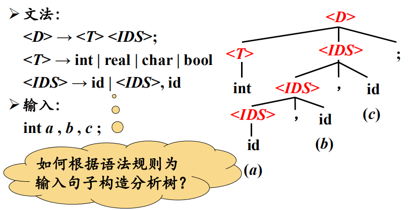
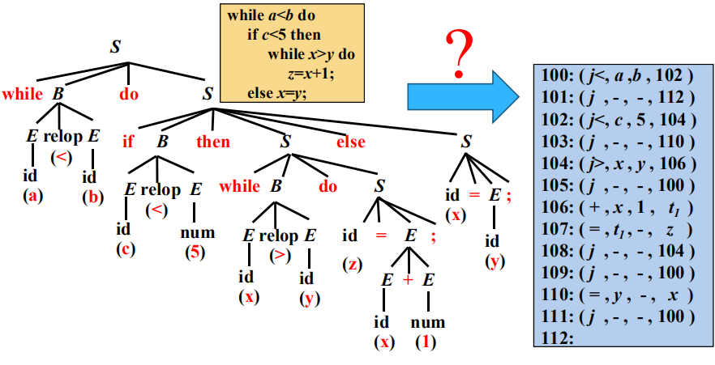

# 第1章 绪论

## 编译器在语言处理系统中的位置


人工英汉翻译的例子


## 编译系统的结构

第1步 分析源语言

1. 词法分析（Lexical Analysis）
2. 语法分析（Syntax Analysis）
3. 语义分析（Semantic Analysis）

第2步 生成目标语言


## 词法分析/扫描(Scanning) 概述

词法分析的主要任务

从左向右逐行扫描源程序的字符，识别出各个单词，确定单词的类型。
将识别出的单词转换成统一的机内表示——词法单元(token)形式
token：< 种别码，属性值 >

|      | 单词类型 | 种别                                                         | 种别码               |
| ---- | -------- | ------------------------------------------------------------ | -------------------- |
| 1    | 关键字   | program、if、else、then、…                                   | 一词一码             |
| 2    | 标识符   | 变量名、数组名、记录名、过程名、…                            | 多词一码             |
| 3    | 常量     | 整型、浮点型、字符型、布尔型、…                              | 一型一码             |
| 4    | 运算符   | 算术（ + - * / ++ -- ）<br />关系（ > < == != >= <= ）<br />逻辑（& \| ~） | 一词一码 或 一型一码 |
| 5    | 界限符   | ; ( ) = { } …                                                | 一词一码             |

例：词法分析后得到的token序列

输入 while(value!=100){num++;}

输出

```
1 	while 	< WHILE , - >
2 	( 		< SLP , - >
3 	value 	< IDN , value >
4 	!= 		< NE , - >
5 	100 	< CONST , 100 >
6 	) 		< SRP , - >
7 	{ 		< LP , - >
8 	num 	< IDN , num >
9 	++ 		< INC , - >
10  ; 		< SEMI , - >
11  } 		< RP , - >
```

## 语法分析 ( parsing)概述


语法分析器(parser)从词法分析器输出的token序列中**识别出各类短语**，并**构造语法分析树**(parse tree)

例1：赋值语句的分析树

```
position = initial + rate * 60 ;
<id, position> <=> <id,initial> <+> <id, rate> <*> <num,60> <;>
```


例2：变量声明语句的分析树

D：表示声明语句，T：表示类型，IDS：表示标识符序列



将在第4章进行解释

## 语义分析概述

### 语义分析的主要任务

- 收集标识符的属性信息

  - 种属 (Kind)

    简单变量、复合变量（数组、记录、…）、过程、…

  - 类型 (Type)

    整型、实型、字符型、布尔型、指针型、…

  - 存储位置、长度

    位置是相对地址

  - 值

  - 作用域

  - 参数和返回值信息

    参数个数、参数类型、参数传递方式、返回值类型、…

    **符号表**是用于存放标识符的属性信息的数据结构

- 语义检查

  - 变量或过程未经声明就使用
  - 变量或过程名重复声明
  - 运算分量类型不匹配
  - 操作符与操作数之间的类型不匹配
  - 数组下标不是整数
  - 对非数组变量使用数组访问操作符
  - 对非过程名使用过程调用操作符
  - 过程调用的参数类型或数目不匹配
  - 函数返回类型有误

## 中间代码生成及编译器后端概述


### 三地址码 (Three-address Code)

三地址码由类似于汇编语言的指令序列组成，

每个指令最多有**三个操作数**(operand)

语法结构树/语法树 (Syntax Trees)

#### 常用的三地址指令

| 序号 | 指令类型       | 指令形式                         |
| ---- | -------------- | -------------------------------- |
| 1    | 赋值指令       | x = y **op** z <br/>x = **op** y |
| 2    | 复制指令       | x = y                            |
| 3    | 条件跳转       | if x **relop** y goto n          |
| 4    | 非条件跳转     | **goto** n                       |
| 5    | 参数传递       | **param** x                      |
| 6    | 过程调用       | **call** p, n                    |
| 7    | 过程返回       | **return** x                     |
| 8    | 数组引用       | x = y[i]                         |
| 9    | 数组赋值       | x[i] = y                         |
| 10   | 地址及指针操作 | x =& y<br/>x =* y<br/>*x =y      |

地址可以具有如下形式之一

- 源程序中的名字(name)
- 常量(constant)
- 编译器生成的临时变量(temporary)

#### 三地址指令的表示

- 四元式 (Quadruples)
  (op, y, z, x)
- 三元式 (Triples)
- 间接三元式 (Indirect triples)

三地址指令序列唯一确定了运算完成的顺序

##### 四元式 (Quadruples) 

(op, y, z, x)

| 序号 | 指令类型       | 指令形式                         | 四元式                           |
| ---- | -------------- | -------------------------------- | -------------------------------- |
| 1    | 赋值指令       | x = y **op** z <br/>x = **op** y | (op, y, z, x)<br />(op, y, _, x) |
| 2    | 复制指令       | x = y                            | (=, y, _, x)                     |
| 3    | 条件跳转       | if x **relop** y goto n          | (reop, x, y, n)                  |
| 4    | 非条件跳转     | **goto** n                       | (goto, _, _,n)                   |
| 5    | 参数传递       | **param** x                      | (param, _, _x)                   |
| 6    | 过程调用       | **call** p, n                    | (call, p, n,)                    |
| 7    | 过程返回       | **return** x                     | (return, _, _, x)                |
| 8    | 数组引用       | x = y[i]                         | (=[], y, i, x)                   |
| 9    | 数组赋值       | x[i] = y                         | ([]=, y, x, i)                   |
| 11   | 地址及指针操作 | x =& y                           | (&, y, _, x)                     |
|      |                | x =* y                           | (=*, y, _, x)                    |
|      |                | *x =y                            | (*=, y, _, x)                    |

中间代码生成的例子



### 目标代码生成

目标代码生成以源程序的**中间表示形式**作为输入，并把它映射到**目标语言**
目标代码生成的一个重要任务是为程序中使用的变量**合理分配寄存器**

### 代码优化

为改进代码所进行的**等价程序变换**，使其**运行得更快一些**、**占用空间更少一些**，或者二者兼顾

# 第2章 程序设计语言及其文法 

## 基本概念

### 字母表 (Alphabet)

#### 定义

字母表∑是一个**有穷符号集合**
符号：字母、数字、标点符号、…

例：
➢二进制字母表：{ 0,1 }
➢ASCII字符集
➢Unicode字符集

#### 字母表上的运算

- 字母表∑~1~和∑~2~的**乘积**( product)

  ∑~1~∑~2~ ={ab|a ∈ ∑~1~, b ∈ ∑~2~}

  例： {0, 1} {a, b} ={0a, 0b, 1a, 1b}

- 字母表∑的**n次幂**( power)

  - ∑^0^ ={ ε }  (ε表示空串)

  - ∑^n^=∑^n-1^ ∑ , n ≥ 1

    例： {0, 1}^3^ ={0, 1} {0, 1} {0, 1}={000, 001, 010, 011, 100, 101, 110, 111}

  **字母表的n次幂：长度为n的符号串构成的集合**

- 字母表∑的正闭包( positive closure)

  ∑^+^ = ∑ ∪ ∑^2^ ∪ ∑^3^ ∪ …

  例：{a, b, c, d }^+^= {a, b, c, d, aa, ab, ac, ad, ba, bb, bc, bd, …, aaa, aab, aac, aad, aba, abb, abc, …}

  **字母表的正闭包：长度正数的符号串构成的集合**

- 字母表∑的克林闭包(Kleene closure)

  ∑^*^= ∑^0^ ∪ ∑^+^ = ∑^0^ ∪ ∑ ∪ ∑^2^ ∪ ∑^3^ ∪ …

  例：{a, b, c, d }^*^= {ε, a, b, c, d, aa, ab, ac, ad, ba, bb, bc, bd, …, aaa, aab, aac, aad, aba, abb, abc, …}

  **字母表的克林闭包：任意符号串（长度可以为零）构成的集合**

### 串(String)

#### 定义

设∑是一个字母表，存在x∈∑^*^，x称为是cunzai∑上的一个**串**，**串是字母表中符号的一个有穷序列**

串s的**长度**，通常记作|s|，是指s中**符号的个数**,例: |aab|=3

空串是长度为0的串，用 ε（epsilon）表示,|ε|= 0

#### 串上的运算——连接

如果 x和y是串，那么x和y的连接(concatenation)是把y附加到x后面而形成的串，记作xy

例如，如果 x=dog且 y=house，那么xy=doghouse

空串是连接运算的单位元( identity)，即，对于任何串s都有，εs = sε = s

设x,y,z是三个字符串，如果 x=yz，则称y是x的**前缀**，z是x的**后缀**

#### 串上的运算——幂

$$
\begin{cases}
s^0= ε,\\
s^n = s^{n-1}s, n≥1
\end{cases}
$$

$s^1 = s^0s=ϵs=s$，$s^2=ss$，$s^3=sss$，...

例：如果 s =ba，那么s^1^= ba，s^2^=baba，s^3^=bababa，…

**串s的n次幂：将n个s连接起来**

## 文法的定义

### 自然语言的例子——句子的构成规则

这是一个简化版描述英语句子的描述：

- <句子>→<名词短语><动词短语>
- <名词短语>→<形容词><名词短语>
- <名词短语>→<名词>
- <动词短语>→<动词><名词短语>
- <形容词>→little   (little：未用尖括号括起来的，表示**语言的基本符号**)
- <名词>→boy
- <名词>→apple
- <动词>→eat  （<动词>：用尖括号括起来的，**语法成分**）

### 文法的形式化定义

$$
G = (V_T, V_N, P , S )
$$

- G：表示文法

- V~T~：**终结符集合**    V~T~ ∩V~N~= Φ，终结符集合和非终结符集合是不相交的

​	终结符（terminal symbol）是文法所定义的**语言的基本符号**，有时也称为**token**

​	例: V~T~= { apple, boy, eat, little }

- V~N~:**非终结符集合**   V~T~∪V~N~：文法符号集

  非终结符(nonterminal) 是用来表示**语法成分**的符号，有时也称为“ **语法变量**”

  例: V~N~ = { <句子>, <名词短语>, <动词短语>, <名词>, … }

- P ：**产生式**集合

  **产生式**( production)描述了将终结符和非终结符组合成串的方法产生式的一般形式：

  **α→β**

  读作：α定义为β

  α∈(V~T~∪V~N~^)+^，且α中至少包含V~N~中的一个元素：称为产生式的**头**(head )或**左部**(left side)

  β∈(V~T~∪V~N~^)*^  称为产生式的**体**(body)或**右部**(right side)

  例： P = {<句子>→<名词短语> <动词短>, 
  <名词短语>→<形容词 <名词短语>，
  …}

- S ：**开始符号**

  S∈V~N~。开始符号(start symbol)表示的是该文法中最大的语法成分

  例：S = <句子>

  

下面这个是简化版（加法和乘法）的，用来表示算术表达式的文法


id：标识符，+：加号，*：乘号、E：表达式Expression，P：产生式集合

#### 产生式的简写

对一组有**相同左部**的α产生式

​					α→β~1~, α→β~2~, … , α→β~n~

可以简记为：

​					α→β~1~,|β~2~| … |β~n~

读作：α**定义为**β1，或者β2，…，或者βn 。

β~1~，β~2~，…，β~n~称为α的**候选式**(Candidate)


#### 符号约定

**下述符号是终结符**

➢(a) 字母表中**排在前面的小写字母**，如 a、b、c
➢(b) 运算符，如 +、*等
➢(c) 标点符号，如括号、逗号等
➢(d) 数字0、1、. . . 、9
➢(e) 粗体字符串，如id、if等

**下述符号是非终结符**

➢(a) 字母表中**排在前面的大写字母**，如A、B、 C
➢(b) 字母S。通常表示开始符号
➢( c ) 小写、斜体的名字，如 *expr*、*stmt*等
➢(d) 代表程序构造的大写字母。如E(表达式)、T(项)和F(因子)

字母表中**排在后面的大写字母**（如X、Y、Z）表示**文法符号**（即终结符或非终结符）

字母表中**排在后面的小写字母**（主要是u、v、. . . 、z）表示**终结符号串**（包括空串）

小写希腊字母，如α、β、γ，表示**文法符号串**（包括空串）

除非特别说明，第**一个产生式的左部**就是**开始符号**


## 语言的定义

### 推导 (Derivations)和归约(Reductions)


有了文法（语言规则），如何判定某一词串是否是该语言的句子？

均根据规则

- 句子的**推导**（派生） 从**生成**语言的角度
- 句子的**归约**                 从**识别**语言的角度

### 句型和句子


例


### 语言的形式化定义


例


无符号整数：

1. S→T
2. T→TD
3. D→0|1|2|3|…|9

浮点数：

1. S→T
2. T→DLD
3. D→0|1|2|3|…|9
4. L→.

### 语言上的运算


## 文法的分类

Chomsky 文法分类体系

➢0型文法 (Type-0 Grammar)
➢1型文法 (Type-1 Grammar)
➢2型文法 (Type-2 Grammar)
➢3型文法 (Type-3 Grammar)

### 0型文法 (Type-0 Grammar)

就是前面定义的文法

$$
α→β
$$


0型文法也称为**无限制文法**(Unrestricted Grammar) 或**短语结构文法**(Phrase Structure Grammar, PSG )

∀α → β∈P， α中至少包含1个非终结符

**0型语言**   由0型文法G生成的语言L(G )

### 1型文法 (Type-1 Grammar)


### 2型文法 (Type-2 Grammar)


上下文无关语言（2型语言）

由上下文无关文法 (2型文法) G生成的语言L(G )

### 3型文法 (Type-3 Grammar)


这两个例子都是生成标识符的


### 四种文法之间的关系

不考虑空串各级是包含关系


## CFG的分析树

CFG：上下文无关文法

从左边的5个式子到右边的树，这样的树不止一种，这里只是举出一种例子


### 分析树是推导的图形化表示


### （句型的）短语

给定一个句型，其分析树中的每一棵**子树的边缘**称为该句型的一个**短语**（phrase）  
如果子树只有父子两代结点，那么这棵子树的边缘称为该句型的一个直接短语(immediate phrase)  


### 二义性文法

Ambiguous Grammar

如果一个文法可以为某个句子生成**多棵分析树**，则称这个文法是**二义性**的  


**二义性文法的判定**

对于任意一个上下文无关文法，不存在一个算法， 判定它是无二义性的；但能给出一组充分条件， 满足这组**充分条件**的文法是无二义性的 

➢满足，肯定无二义性 

➢不满足，也未必就是有二义性的

## 正则表达式


