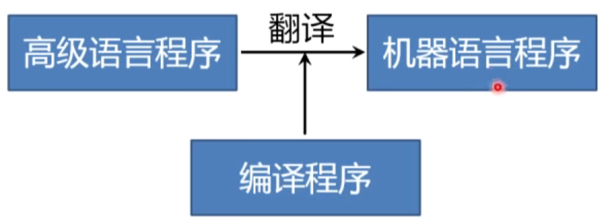

# 第1章 绪论

课程：

https://www.bilibili.com/video/BV12741147J3

https://www.bilibili.com/video/BV1zW411t7YE

编译：将高级语言翻译成汇编语言或机器语言的过程
源语言：高级语言翻译 目标语言：汇编语言或机器语言

## 编译程序

**翻译程序**( Translator)把某一种语言程序(称为**源语言程序**)等价地转換成另一种语言程序(称为**目标语言程序**)的程序


**编译程序**（Compiler）

编译程序也是一种翻译程序，把某一种**高级语言程序**等价地转换成另一种**低级语言程序**(如汇编语言或机器语言程序)的程序。



编译程序根据用途或侧重，进行分类：

- 诊断编译程序（Diagnostic Compiler）：帮助程序员进行开发和调试，发现程序中的错误
- 优化编译程序（Optimizing Compiler）：侧重于提高目标代码的执行效率

运行编译程序的计算机叫做**宿主机**，运行目标语言程序的计算机称为**目标机**。一般，宿主机和目标机是同一个。

- 交叉编译程序（Cross Compiler） ：编译程序产生不同于宿主机的机器代码。
- 可变目标编译程序（Retargetable Compiler）：针对不同的目标平台，生成不同的对应的目标机器代码。

## 解释程序

Interpreter

把源语言写的源程序作为输入,但不产生目标程序,而是**边解释边执行**源程序。


## 计算思维

包括：

- 抽象
- 自动化
- 问题分解
- 递归
- 权衡
- 保护、冗余、容错、纠错和恢复
- 利用启发式推理来寻求解答
- 在不确定情况下的规划、学习和调度
- ......

### 抽象

Abstraction

- 忽略一个主题中与当前问题(或目标)无关的那些方面,以便更充分地注意与当前问题(或目标)有关的方面

- 从众多的事物中抽取出共同的、本质性的特征,舍弃其非本质的特征
- 是一种从个体把握一般、从现象把握本质的认知过程和思维方法


计算机科学中的抽象：

**图灵机**是对计算的抽象  
一条无限长的纸带、一个读写头、一个状态寄存器、一套控制读写头工作的规则  
可计算=图灵可计算

编译原理中的抽象

- 有限自动机
- 形式文法
- ...

### 自动化

Automation

- 将抽象思维的结果在计算机上实现,是一个将计算思维成果物化的过程,也是将理论成果应用于技术的实践。  
- 自动化的思维方法不仅体现在编译程序本身的工作机制上,更体现在了编译程序的生成工具的研究和设计上。

编译原理中的“自动化”

- 有限自动机
- 预测分析程序
- 算符优先分析
- LR分析
- ...

### 分解

Decompostion

将大规模的复杂问题分解成若干个较小规模的、更简单的问题加以解决。  
对问题本身进行明确描述,并对问题解法作出全局性决策。  
把问题分解成相对独立的子问题。  
再以同样的方式对每个子问题进一步分解,直到获得对问题的明确的解答


层次化管理：


编译原理中的“问题分解”：  
为什么编译程序引入中间语言？  
为什么编译分成多个阶段？  
为什么分析过程分成很多遍？

### 递归

Recursion

问题的解决依赖于类似问题的解决,只不过后者的复杂程度或规模较原来的问题更小。  
一旦将问题的复杂程度和规模化简到足够小时,问题的解法其实非常简单。

编译原理中的“递归”：

- 递归下降分析
- 基于树遍历的属性计算
- 语法制导翻译

### 权衡

权衡（折衷，Tradeoff）

理论可实现VS实际可实现  
理论硏究重在探寻问题求解的方法,对于理论成果的研究运用又需要在能力和运用中作出权衡。  

编译原理中的“权衡”：

- 用上下文无关文法来描述和处理高级程序设计语言

- 优化措施的选择

## 编译原理和方法的应用

- HTML/XML分析
- 语言处理工具（单词拼接检查、句子语法检查、在线翻译、搜索引擎）
- Shell命令解释器
- 查询语言：SQL
- 网络协议

## 编译过程

编译程序是怎样把高级语言(如C++)翻译成低级语言(如机器指令)的?

以翻译英文句子为例：

The compiler can translate aprogram trom sourcelanguage to target language.==》

编译程序能够把一个程序从源语言翻译成目标语言。

| 英译中过程                 | 编译过程     |
| -------------------------- | ------------ |
| 识别出句子中的一个个单词   | 词法分析     |
| 分析句子的语法结构         | 语法分析     |
| 根据句子的含义进行初步翻译 | 中间代码产生 |
| 对译文进行修饰             | 优化         |
| 写出最后的译文             | 目标代码产生 |

### 词法分析

任务：输入源程序,对构成源程序的字符串进行扫描和分解，识别出**单词符号**

依循的原则：构词规则

描述工具：有限自动机

例如：

```
for     i   :=     1     to    1oo   do
基本字 标识符 赋值号 整常数 基本字 整常数 基本字
```

### 语法分析

任务：在词法分析的基础上，根据语法规则把单词符号串分解成各类**语法单位(语法范畴)**。

依循的原则：语法规则

描述工具：上下文无关文法


### 中间代码产生

任务：对各类语法单位i按语言的**语义**进行初步翻译

依据的原则：语义规则

描述工具：属性文法

中间代码：三元式、四元式、树、...

Z := X = 0.618 * Y 翻译四元式为：

| 序号  | OPR  | OPN1  | OPN1 | RESULT | 解释        |
| ----- | ---- | ----- | ---- | ------ | ----------- |
| （1） | *    | 0.618 | Y    | T1     | T1:=0.618*Y |
| （2） | +    | X     | T1   | T2     | T2:=X+T1    |
| （3） | :=   | T2    |      | Z      | Z:=T2       |

### 优化

有时候，程序员为了写出可读性高的代码，没考虑到执行效率，这是由编译器进行优化。

任务：对前阶段产生的中间代码进行加工变换以期在最后阶段产生更高效的目标代码

依循的原则：程序的等价变换规则

优化例子：

```
FOR K:= 1 TO 100 DO
BEGIN
    X:=I+1; //X每次循环时都不变，可以优化
    M := I + 10 * K;
    N := J + 10 * K;
END
```

翻译：

| 序号 | OPR  | OPN1 | OPN1 | RESULT | 解释                 |
| ---- | ---- | ---- | ---- | ------ | -------------------- |
| (1)  | :=   | 1    |      | K      | K:=1                 |
| (2)  | j<   | 100  | K    | (10)   | if (100<K) goto (10) |
| (3)  | +    | I    | 1    | X      | X:=I+1               |
| (4)  | *    | 10   | K    | T1     | T1=10*K              |
| (5)  | +    | I    | T1   | M      | M:=I+T1              |
| (6)  | *    | 10   | K    | T2     | T2=10*K              |
| (7)  | +    | J    | T2   | N      | N:=J+T2              |
| (8)  | +    | K    | 1    | K      | K:=K+1               |
| (9)  | J    |      |      | (2)    | goto (2)             |
| (10) |      |      |      |        |                      |

（2）~（9）是循环，每次循环都要执行4个加法和2个乘法，总计：400次加法和200次乘法

优化后的等价代码：

| 序号 | OPR  | OPN1 | OPN1 | RESULT | 解释                 |
| ---- | ---- | ---- | ---- | ------ | -------------------- |
| (1)  | :=   | I    | 1    | K      | X:=I+1               |
| (2)  | :=   | I    |      | M      | M:=I                 |
| (3)  | :=   | J    |      | N      | M:=J                 |
| (4)  | :=   | 1    |      | K      | K:=1                 |
| (5)  | j<   | 100  | K    | (10)   | if (100<K) goto (10) |
| (6)  | +    | M    | 10   | M      | M:=M+10              |
| (7)  | +    | N    | 10   | N      | N:=N+10              |
| (8)  | +    | K    | 1    | K      | K:=K+1               |
| (9)  | J    |      |      | (5)    | goto (5)             |
| (10) |      |      |      |        |                      |

- X:=I+1拿到循环外面了
- M、N赋了初始值
- M := I + 10 * K 优化为 M:=M+10

总计301次加法。

或者再进一步优化，编译时直接计算出M和N的结果

### 目标代码产生

任务：把中间代码变换成特定机器上的目标代码

依赖于硬件系统结构和机器指令的含义

目标代码三种形式

- 汇编指令代码：需要进行汇编
- 绝对指令代码：可直接运行
- 可重新定位指令代码：需要连接

例子：

b = a + 2

```asm
mov a R1
ADD #2,R1
MOV R1,b
```

```
操作码  寄存器操作数 操作数标志	第二操作数（地址）
0001    01        00          00000000* (*表示相对地址)
0011    01        10          00000010
0001    01        00          00000100*
```

假设本模块的起始地址是：L = 00001111，那么，操作数地址加上起始地址：

```
0001    01        00          000001111*
0011    01        10          00000010
0001    01        00          000010011*
```

## 编译程序的结构


这里先提一下出错处理程序：

出错处理程序

- 发现源程序中的错误,把有关错误信息报告给用户

语法错误

- 源程序中不符合语法(或词法)规则的错误
- 非法字符、括号不匹配、缺少; 。。。

语义错误

- 源程序中不符合语义规则的错误
- 说明错误、作用域错误、类型不一致、。。。

## 相关概念

### 遍（pass）

所谓"遍"，就是对源程序或源程序的中间表示从头到尾扫描一次。编译的每个阶段都对上阶段输出的“遍”，实际中，可以将若干阶段合到一起，这若干阶段可以穿插进行。

- 一遍可以由若干段组成。
- 一个阶段也可以分若干遍来完成

### 前端和后端

以编译过程中的中间语言为界，把编译分解成前端和后端


**编译前端**  与源语言有关，如词法分析，语法分析，语义分析与中间代码产生，与机器无关的优化

**编译后端**  与目标机有关，与目标机有关的优化，目标代码产生

带来的好处：

- 程序逻辑结构清晰
- 优化更加充分，有利于移植

体现了分解和权衡这两种计算思维。

编译前端实现：词法分析、语法分析、中间代码生成、与目标机器无关的优化

编译后端：与目标机器相关的优化、中间代码生成

## 编译程序的生成

以机器语言和汇编语言为工具  
优点：可以针对具体的机器，充分发挥计算机的系统功能；生成的程序效率高。  
缺点：程序难读、难写、易出错、难维护、生产效率低

高级语言书写


程序易读、易理解、任意维护、生产的效率高


**利用已有的某种语言的编译程序实现另一语言的编译程序**


**移植**方法，把一种机器上的编译程序移植到另一种机器上


**自编译方式**


编译程序自动产生

- 编译程序-编译程序，编译程序产生器，编译程序书写系统
- LEX：词法分析程序产生器
- YACC：语法分析程序产生器


