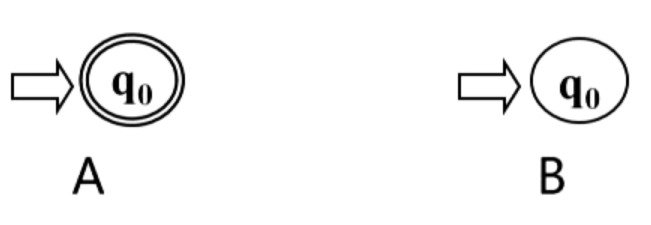

# 词法分析概述



**词法分析的任务**：从左至右逐个字符地对源程序进行扫描，产生一个个单词符号  
**词法分析器**( Lexical analyzer)：也叫**扫描器**( Scanner)，执行词法分析的程序  
功能：输入源程序、输出单词符号  

单词符号的种类：

- 基本字：如begin, repeat, for
- 标识符：用来表示各种名字，如变量名、数组名和过程名
- 常数：各种类型的常数
- 运算符：+、-、*、/
- 界符：逗号、分号、括号和空白

输出的单词符号的表示形式：是二元组：(单词种别，单词自身的值)  

单词种别通常用整数编码表示：

- 若一个种别只有一个单词符号，则种别编码就代表该单词符号。假定**基本字、运算符和界符**都是**一符一种**。
- 若一个种别有多个单词符号，则对于每个单词符号，给出种别**编码**和**自身的值**。
  - **标识符**单列一种；标识符自身的值表示成按机器字节划分的内部码
  - **常数**按类型分种；常数的值则表示成标准的二进制形式

例1：PASCAL程序

```pascal
if(5=m) goto 100
```

输出单词符号：

- if             (34, -)  即种别编码是34，没有自身的值用”-“表示
- 左括号    (2, -)
- 整常数    (20,  '5'的二进制)
- 等号    （6，-）
- 标识符  (26, 'm')
- 右括号  (16, -)
- goto     (30, -)
- 标号   （19，'100'的二进制）


例2：C程序

```c
while (i>=j) i--;
```

输出单词符号：

- \< while, - >
- \< (, - >
- \< id, 指向i的符号表项的指针 >
- \< >=, - >
- \< id, 指向j的符号表项的指针 >
- \< ) , - >
- \< -- , ->
- \< ; , ->


**词法分析作为一个独立子程序**

词法分析作为一个独立的**阶段** ：结构清晰简洁，有利于集中考虑词法分析一些枝节题

但不一定不作为单独的**一遍**：将其处理为一个子程序，也就是随用随调


**词法分析在编译器中地位**

编译器中起主导地位的是语法分析器，语法分析需要下一个单词时，就调用词法分析器。这一过程体现了计算思维中的：分解和权衡



# 词法分析器的结构


预处理子程序作用：

- 剔除无用的空白跳格、回车和换行等编辑性字符

- 区分标号区、捻接续行和给出句未符等

扫描缓冲区：存放了经过预处理的，比较规范的字符串，扫描器就在该缓冲区中识别单词符号。

扫描器通过两个指针：起点指示器、搜索指示器进行扫描

起点指示器指向马上要扫描的单词的开始位置  
搜索指示器从开始位置前进寻找单词的结尾  
这里有个问题：如果单词比较长，那单词的前半部分可能在扫描缓冲区中，而后半段还没有进来。  
一种解决是：把扫描缓冲区加长，但是不论加多长，都不敢保证是否由更长的单词，甚至一个很短的单词也可能被很长的缓冲区打断。  
为了解决，我们把缓冲区一分为二，两个半区互补使用   
如果一个单词在一个半区找不到单词的末尾，那么在下一个半区一定能找到  
而有些语言规定，标识符的长度不能超过128，这样就能确定扫描缓冲区的长度是256


# 单词符号的识别：超前搜索

1、**基本字**的识别

例如，一个语言的基本字有：DO IF，考虑如下语句  
DO99k = 1, 10    就是 DO 99 k = 1, 10  
DO99k = 1.10      
遇到了”, “才知道DO99k要拆开成 DO 99 k, DO是基本字  
遇到了"."才知道DO99k 是标识符

类似的：  
IF(5.EQ.M)GOTO55  就是    IF (5.EQ.M)  GOTO 55  
IF(5)=55  
如果”)“后面是字母，那么IF就是基本字  
如果”)“后面是等号，那么IF是标识符  

上述情况，需要超前搜索才能确定哪些是基本字（关键字还能用在标识符上，瞎折腾）  

2、**标识符**识别：字母开头的字母数字串、后跟界符或算符  

3、**常数**识别：识别出算术常数并将其转变为二进制内码表示   
如：5.EQ.M是测试5是否和M相等，5.E08是5乘以10的8次方的科学计数法表示 ，这两个例子都需要看E后面的是字母还是数字才能确定5.是常数还是数字的小数部分

4、**算符和界符**的识别：把多字符组成的算符和界符拼合成一个单词符号

如：   :=、 **、 .EQ. 、 ++ 、 -- 、 >= 这些由多个字符构成的算符都需要向前看几个字符才能确定

总之，超前搜索给词法分析带来了不少的麻烦

设计程序语言时，大多加上几点限制，**目的是不必使用超前搜索**

- **所有基本字都是保留字，用户不能用它们作自己的标识符**，这样IF、DO这样的就不能作为标识符了
- **基本字作为特殊的标识符来处理**，使用保留字表
- 如果基本字、标识符和常数(或标号)之间没有确定的运算符或界符作间隔,则必须**使用一个空白符作间隔**DO99K=1,10要写成DO 99 K=1,10

这些要求，不仅仅减轻了词法分析的负担，也加强了程序的可读性

# 状态转换图

## 概念

状态转换图是一张有限方向图

- **节点**代表**状态**，用圆圈表示
- 状态之间用**箭弧（箭头）**连结，箭弧上的标记(字符)，代表射出结状态下可能出现的输入**字符**或**字符类**
- 一张转换图只包含**有限个状态**，其中有一个为**初态**至少要有一个**终态**，大的空白箭头表示初态，双圆圈表示终态。


- 状态转换图可用于识别(或接受)一定的字符串。若存在一条从初态到某一终态的道路，且这条路上所有弧上的标记符连接成的字等于α，则称α被该状态转换图所**识别(接受)**

  

  

## 状态转换图在词法分析中的应用

一个简单的程序设计语言，该语言所有合法的字都在该单词表内描述：

| 单词符号 | 种别编码 | 助记符  | 内码值         |
| -------- | -------- | ------- | -------------- |
| DIM      | 1        | $DIM    | —              |
| IF       | 2        | $IF     | —              |
| DO       | 3        | $DO     | —              |
| STOP     | 4        | $STOP   | —              |
| END      | 5        | $END    | —              |
| 标识符   | 6        | $ID     | 内部字符串     |
| 常数     | 7        | $INT    | 标准二进制形式 |
| =        | 8        | $ASSIGN | —              |
| +        | 9        | $PLUS   | —              |
| *        | 10       | $STAR   | —              |
| **       | 11       | $POWER  | —              |
| ,        | 12       | $COMMA  | —              |
| (        | 13       | $LPAR   | —              |
| )        | 14       | $RPAR   | —              |

可为单词表设计如下状态转移图


- 状态2识别关键字和标识符，加一些if判断就能知道是不是关键字
- 状态4识别常数
- 状态5~12识别操作符和括号
- 状态13为出错状态
- 那么，可以由此图对该语言的所有代码进行词法分析

**几点限制不必使用超前搜索**

- **所有基本字都是保留字**，用户不能用它们作自己的标识符
- **基本字作为特殊的标识符来处理**，使用保留字表
- 如果基本字、标识符和常数(或标号)之间没有确定的运算符或界符作间隔，则必须**使用一个空白符作间隔**DO99K=1,10要写成DO 99 K=1,10

## 状态转换图的代码实现

每个状态结点对应一小段程序

1、**不含回路的分叉结点**，可用一个CASE语句或一组IF-THEN-ELSE语句实现


```c
GetChar();
if (IsLetter()){
    //状态j对应的程序段
}else if(IsDigit()){
    //状态k对应的程序段
}else if(ch='/'){
    //状态m对应的程序段
}else{
    //错误处理
}
```

2、**含回路的状态结点**，可以使用while、if以及状态机的代码


```c
GetChar();
while(IsLetter() or IsDigit())
    GetChar();
//状态j对应的程序段
```

3、**终态节点**，表示识别出某种单词符号，对应**返回**语句  


```c
RETURN(C,VAL)
```

其中，C为单词，VAL为单词自身值

定义全局变量与过程

- ch字符变量，存放最新读入的源程序字符
- strToken字符数组，存放构成单词符号的字符串
- GetChar子程序过程，把下一个字符读入到ch中
- GetBC子程序过程，跳过空白符，直至ch中读入非空白符
- Concat子程序，把ch中的字符连接到 strToken
- IsLetter和 IsDisgital布尔函数,判断ch中字符是否为字母和数字
- Reserve整型函数,对于 strToken中的字符串查找保留字表,若它是保留字则给出它的编码,否则回送0
- Retract子程序,把搜索指针回调一个字符位置
- InsertId整型函数,将 strtoken中的标识符插入符号表,返回符号表指针
- InsertConst整型函数过程,将 strToken中的常数插入常数表,返回常数表指针


```c
int code,value;
strToken := "";//置 strToken 为空串
GetChar();GetBC();
if(IsLetter())
begin
    while(IsLetter() or IsDigit())
    begin
        Concat();GetChar();
    end
    Retract();
    code := Reserve();
    if(code=0)
    begin
        value := InsertId(strToken);
        return ($ID,value);
    end
    else
        return (code,-);
end
```


```c
else if(IsDigit())
begin
    while(IsDigit())
    begin
        Concat();GetChar();
    end
    Retract();
    value := InsertConst(strToken);
    return($Int,value);
end
else if(ch = '=') return ($ASSIGN, -)
else if(ch = '+') return ($PLUS, -)
```


```c
else if(ch =‘*’)
begin
    GetChar();
    if(ch='*') return ($POWER,-);
    Retract(); return ($STAR, -);
end
else if(ch =‘,’) return ($COMMA,-);
else if(ch =‘(’) return ($LPAR,-);
else if(ch =‘)’) return ($RPAR,-);
else ProcError(); //出错处理
```

## 状态转换图的代码一般化


- 变量curState用于保存现有的状态
- 用二维数组表示状态图：stateTrans\[state][ch]

```c
curState = 初态
GetChar();
while(stateTrans[curState][ch]有定义){
    //存在后继状态，读入、拼接
    Concat();
    //转换入下一状态，读入下一字符
    curState=stateTrans[curState][ch];
    if curState是终态 then 返回strToken中的单词
    GetChar();
}
```

只是个框架，还有很多细节需要考虑。是否有自动的方法产生词法分析程序？

## 小结

- 词法分析器的功能：输入源程序、输出单词符号
- 词法分析器的设计
  - 给出程序设计语言的单词规范——单词表
  - 对照单词表设计识别该语言所有单词的状态转换图
  - 根据状态转换图编写词法分析程序

# 正规表达式与有限自动机

## 回顾几个基本概念

**字母表**：一个有穷字符集，记为∑

**字母表**中的每个元素称为**字符**

∑上的字（也叫字符串）是指由∑中的字符所构成的一个有穷序列

不包含任何字符的序列称为**空字**，记为ϵ

用∑*表示∑上的所有**字的全体**，包含空字ϵ  *
*例如：设∑={a,b}，则∑\*={ϵ,a,b,aa,ab,ba,bb,aaa,...}

用∑^*^表示∑上的所有**字的全体**，包含空字ε  
例如：设∑={a,b}，则∑\*={ε,a,b,aa,ab,ba,bb,aaa,...无穷个}

∑^*^的子集U和V的连接（积）定义为：$UV=\{ αβ | α∈U \& β∈V \}$  
例如：设：U={a,aa}，V={b,bb}，则 UV={ab,abb,aab,aabb}

V自身的n次积为：V^n^=VV...V (n个V)  
V^0^={ε}，即V的0次幂是空字

V^*^是V的**闭包**：V\*=V^0^∪V^1^∪V^2^∪V^3^∪...  
V^+^是V的**正规闭包**：V^+^=VV^*^  

## 单词集合、正规集和正规式

程序设计语言的单词符号都是一些特殊的字符串

描述单词

- 正规集，简单理解就是程序语言定义的合法单词的集合
- 正规表达式（简称正规式）

**正规集**可以用**正规式**表示

正规式是表示正规集一种方法

一个字集合是**正规集**当且仅当它能用**正规式**表示


### 正规集和正规式的递归定义

对给定的字母表∑

1）ϵ(空字)和Ø(空集合)都是∑上的正规式，它们所表示的正规集为{ϵ}和Ø.  
因此，说ϵ是字或正规式都对；说Ø是集合或正规式都对

2）任何a∈∑，a是∑上的正规式，它所表示的正规及为{a}；  
因此，说a(a∈∑) 是字符或字或正规式都对

3）假定e~1~和e~2~都是∑上的正规式，它们所表示的正规集为L(e~1~)和L(e~2~)，则  

- i) (e~1~|e~2~)为正规式，它所表示的正规集为L(e~1~)∪L(e~2~)
- Ii) (e~1~ · e~2~)为正规式，它所表示的正规集为L(e~1~)L(e~2~)
- Iii) (e~1~)\*为正规式，它所表示的正规集为L(e~1~)\*，\*号表示闭包

仅由**有限次**使用上述三步骤而定义的表达式才是Σ上的正规式，仅由这些正规式表示的字集才是Σ上的正规集。

在不影响理解时，可以省略括号


### 正规式的等价性

若两个正规式所表示的正规集相同,则称这两个正规式等价。如 b(ab)*=(ba)\*b，推导如下：

```
L(b(ab)*)
=L(b)L((ab)*)
=L(b)(L(ab))*
=L(b)(L(a)L(b))*
={b}{ab}*
={b}{ϵ,ab,abab,ababab, ...}
={b,bab,babab,bababab, ...}
```

```{b
L(ba)*b
=L((ba)*)L(b)
=(L(ba))*L(b)
=(L(b)L(a))*L(b)
={ba}*{b}
={ϵ,ab,abab,ababab, ...}{b}
={b,bab,babab,bababab, ...}
```

因为：L(b(ab)\*)=L(ba)\*b

因此：b(ab)*=(ba)\*b

作业：利用正规式与正规集的对应关系,证明(a\*b\*)\*=(a|b)\*

### 正规式的性质

对正规式，下列等价成立

- e~1~|e~2~ = e~2~|e~1~ 或运算交换率
- e~1~|(e~2~|e~3~) = (e~1~|e~2~)|e~3~  或运算结合律
- e~1~(e~2~e~3~) = (e~1~e~2~)e~3~  连接运算结合律
- e~1~(e~2~|e~3~) = e~1~e~2~|e~1~e~3~  连接对于或运算的分配律
- (e~2~|e~3~)e~1~ = e~2~e~1~|e~3~e~1~  或对连接运算的分配律
- eϵ = ϵe = e  e~1~e~2~ <>e~2~e~1~  <>表示不等于

## 确定有限自动机DFA

[前面提到了，状态转换图的代码一般化](# 状态转换图的代码一般化)


### 定义

对状态图进行形式化定义：

**确定有限自动机**（Deterministic Finite Automata DFA）M是一个五元式，M=(S，∑，f，S~0~，F)，其中：

- S：有穷状态集
- ∑：输入字母表(有穷)
- f：**状态转换函**数，为S×∑→S的**单值部分映射**，f(s，a)=s‘表示：当现现行状态为s，输入字符为a时，将状态转换到状态s'，s'称为的一个后继状态
- S~0~∈S是唯一的一个**初态**
- F⊆S：终态集（可空），也就是DFA可以没有终止状态

例子：DFA M=({0, 1, 2, 3}, {a, b}, f, 0, {3})，其中f定义如下：  
f(0, a) = 1    f(0, b) = 2  
f(1, a) = 3    f(1, b) = 2  
f(2, a) = 1    f(2, b) = 3  
f(3, a) = 3    f(3, b) = 3  
f写成**状态转换矩阵**如下：  

|      | a    | b    |
| ---- | ---- | ---- |
| 0    | 1    | 2    |
| 1    | 3    | 2    |
| 2    | 1    | 3    |
| 3    | 3    | 3    |

f画成状态转换图如下：


### DFA表示为状态转换图

- 假定DFAM含有m个状态和n个输入字符

- 对应的状态转换图含有**m个状态结点**，每个结点顶多含有**n条箭弧射出**，且每条箭弧用Σ上的不同的输入字符来作标记

对于∑*中的任何字α，若存在一条从初态到某终态的道路，且这条路上所有弧上的标记符连接成的字等于α，则称为DFA M所**识别(接收)**

DFA M所识别的字的全体记为L(M)

例1：下图，所识别的字的全体是什么


- 状态1开始
- 状态2：读入0
- 状态3：读入1、只要是1都进来
- 状态3：读取两次0、连续多次读入0

所以L{M}={以00结尾的串}


例2：图中的DFA M识别的L(M)是什么？


- 状态0开始
- 状态1：刚刚读入a，但不是连续的两个a
- 状态2：刚刚读入b，但不是连续的两个b
- 状态3：前面是连续的两个a或者连续的两个b

L{M}={含aa或bb的字}


例3：哪个DFA识别{ϵ}？答案是A，而B识别空集Ø



### DFA的程序实现


```c
curState = 初态
GetChar();
while(stateTrans[curState][ch]有定义){
    //存在后继状态，读入、拼接
    Concat();
    //转换入下一状态，读入下一字符
    curState=stateTrans[curState][ch];
    if curState是终态 then 返回strToken中的单词
    GetChar();
}
```

## 非确定有限自动机NFA

### 定义

**非确定有限自动机**（Nondeterministic Finite Automata NFA）M是一个五元式，M=(S，∑，f，S~0~，F)，其中：

- S：有穷状态集
- ∑：输入字母表(有穷)
- f：**状态转换函**数，为S×∑*→2^S^的部分映射，f(s，a)=s‘表示：当现现行状态为s，输入字符为a时，将状态转换到状态s'，s'称为的一个后继状态
- S~0~⊆S是非空的**初态集**，对比DFA的S~0~只有一个
- F⊆S：终态集（可空），也就是NFA可以没有终止状态，和DFA一样

非确定体现在：1.初态不唯一 2.状态转义映射不唯一

### NFA表示为状态转换图


从状态图看NFA和DFA的区另：

- NFA可以有多个**初态**
- 弧上的标记可以是Σ*中的一个**字**(甚至可以是一个**正规式**)，而**不一定是单个字符**
- **同一个字**可能出现在同状态射出的**多条弧**上

DFA是NFA的特例


- 对于Σ*中的任何字α，若存在一条从初态到某一终态的道路，且这条路上所有弧上的标记字连接成的字等于α(忽略那些标记为ε的弧)，则称α为NFA M所**识别(接收)**
- NFA M所识别的字的全体记为L(M)


例1：图中NFA M1识别的L(M~1~)是什么？B  
A.L(M~1~)={以aa或bb开头的字}  
B.L(M~1~)={含aa或bb的字}  
C.L(M~1~)={以aa或bb结尾的字}


这个字的全体，也可以由DFA来识别，图，前面也提到过：


{含aa或bb的字}，NFA更有优势，更加直观


例2：图中NFA M~2~识别的L(M~2~)是什么？C  
A L(M~2~)={ab^n^| n≥1}  
B L(M~2~)=a^n^b^n^| n≥1)  
C.L(M~2~)={a^m^b^n^| m, n≥1}


定义：对于任何两个有限自动机M和M′,如果L(M)=L(M′)，则称M与M′**等价**。即两个有限自动机所接受的字的全体相等就是等价。

自动机理论中一个重要的结论：**判定两个自动机等价性的算法是存在的**。

**DFA与NFA识别能力相同**

- 对于每个NFA M存在一个DFA M'，使得L(M)=L(M’)


# NFA转换成DFA

对于每个NFA M存在一个DFA M'，使得L(M)=L(M’)

- 等价性证明
- NFA的确定化

思路：NFA和DFA的差别

|            | NFA               | DFA  |
| ---------- | ----------------- | ---- |
| 初始状态   | 不唯一            | 唯一 |
| 弧上的标记 | 字（单字符字、ϵ） | 字符 |
| 转换关系   | 非确定            | 确定 |

## 等价性证明


