# 语法分析基本概念

https://blog.csdn.net/qq_35507234/article/details/88734314


对语言的语法结构进行描述

采用**正规式**和**有限自动机**描述和识别语言的**单词符号**

用**上下文无关文法**来描述**语法规则**

## 回顾文法概念

上下文无关文法G是一个四元组：G=(V~T~，V~N~，S， P)，其中：  
V~T~：**终结符**（Terminal）集合（非空），终结符是不可再分解和定义，如英语中的me， he a， book等单词  
V~N~：**非终结符**（Nonterminal）集合（非空）  

- $V_T∩V_N=\varnothing$，即不允许一个符号既是终结符又是非终结符
- 非终结符是可以再分解和定义的，如英语中的句子、主语、谓语、宾语等
- 非终结符可以由终结符和非终结符构成  

S：文法的开始符号，S∈V~N~，表示所定义的语言最终感兴趣的语法单位，对于英语文法来说，句子是文法的开始符号，对于描述程序语言的文法来说，程序这个句法单位是文法的开始符号

P：产生式集合（有限），每个产生式形式为：P→α， P∈V~N~， α∈(V~T~∪V~N~)^*^，→读成定义为

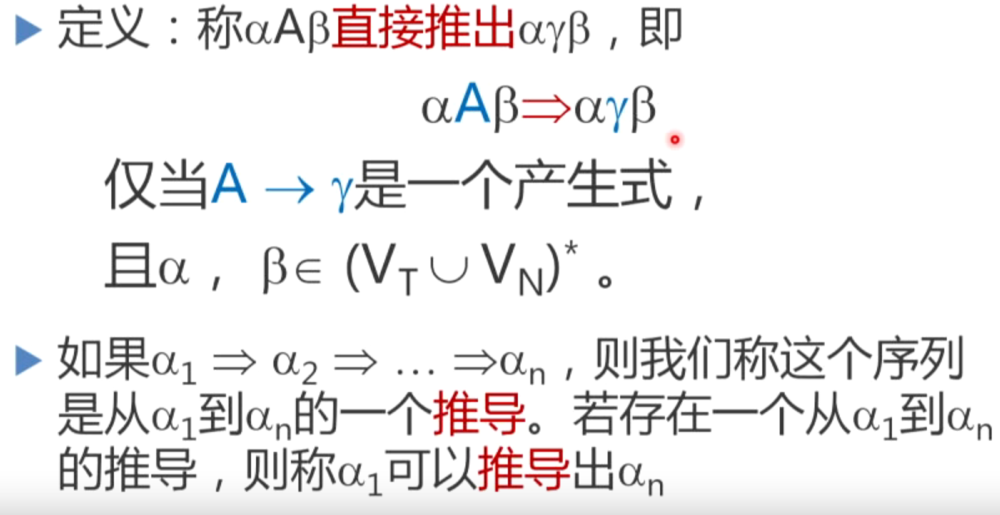

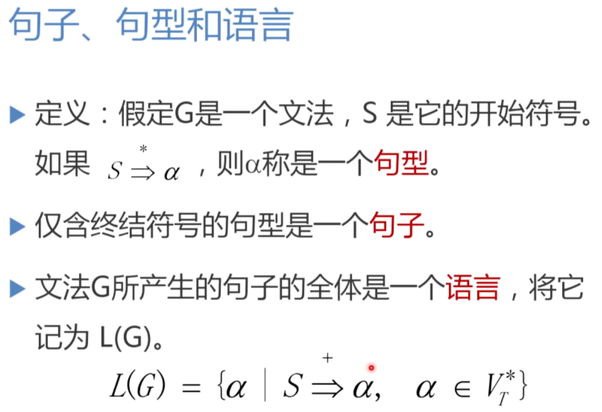

**语法分析的任务**

- 分析一个文法的句子的结构

**语法分析器的功能**

- 按照文法的产生式i语言的语法规则)，识别输入符号串是否为一个句子(合式程序)

语法分析器在编译器中起主导地位：

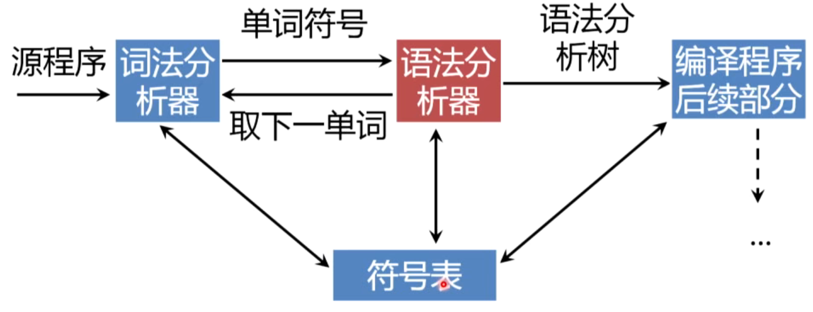


## 语法分析方法

**自下而上（Bottom-up）**

- 从输入串开始，逐步进行归约直到文法的开始符号

- 归约:根据文法的产生式规则，把串中出现的产生式的右部替换成左部符号
- 从树叶节点开始，构造语法树
- **算符优先分析法**、**LR分析法**

**自上而下（Top-down）**

- 从文法的开始符号出发，反复使用各种产生式，寻找"匹配"的推导

- 推导:根据文法的产生式规则，把串中出现的产生式的左部符号替换成右部

- 从树的根开始，构造语法树

- **递归下降分析法**、**预测分析程序**

# 自上而下分析

基本思想

从文法的开始符号出发，向下推导，推出句子

针对输入串，试图用一切可能的办法，从文法开始符号(根结点)出发，自上而下地为输入串建立一棵语法树

A有两个候选

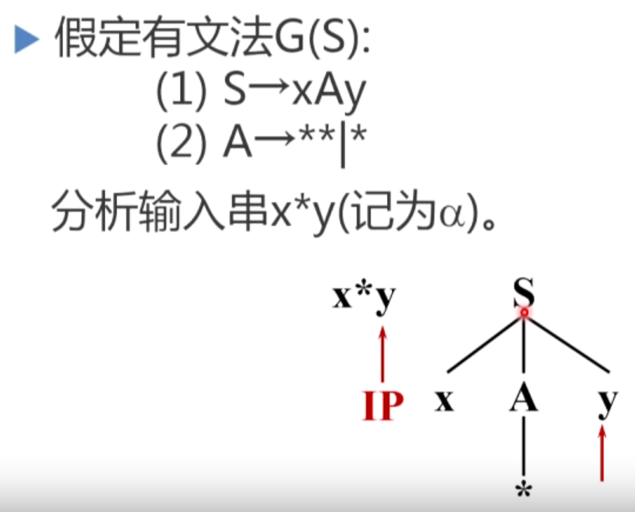

## 自上而下分析面临的问题

### 多个产生式候选带来的问题--回溯

回溯问题：

分析过程中，当一个非终结符用某一个候选匹配成功时，这种匹配可能是暂时的

出错时，不得不"**回溯**"

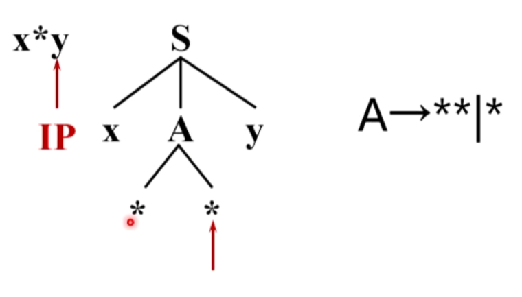


### 文法左递归问题

会导致程序死循环

一个文法是含有左递归的,如果存在非终结符P:
$$
P\mathop{\Rightarrow}^+Pα
$$
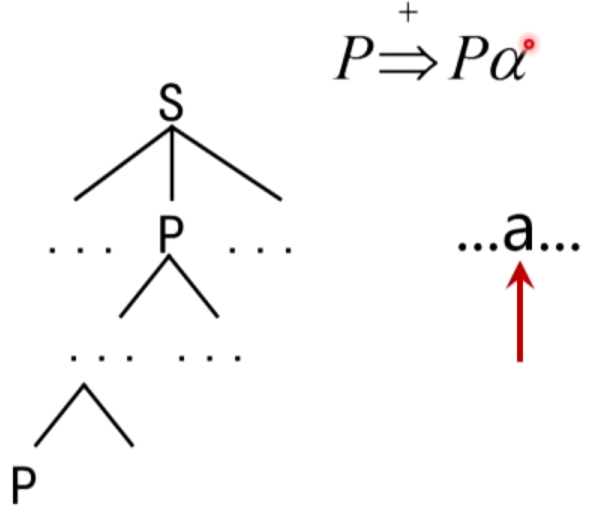


接下来，介绍解决方法，构造不带回溯的自上而下分析算法

- 消除文法的左递归性
- 消除回溯

## 消除直接左递归

见诸于产生式中的直接左递归：P→Pα|β（β不以P开头）

```
P=>Pα
 =>Pαα
...
 =>Pα...α
```

左递归变右递归：P→βP'，然后

P'→βP'|ε

```
P=>βP'
 =>βαP'
 =>βααP'
...
 =>βα...αP'
 =>βα...α

```

一般情况：

假定P关于的全部产生式是
$$
P→Pα_1|Pα_2|...|Pα_m|β_1|β_2|...|β_n
$$
（每个α都不等于ε，每个β都不以P开头）

左递归变右递归：
$$
P→β_1P'|β_2P'|...|β_nP' \\
P'→α_1P'|α_2P'|...|α_mP'|ε
$$

**习题**

给定文法G(E)：  
E→E+T|T  
T→T*F|F  
F→(E)|i  
请消除其直接左递归  

## 消除间接左递归

给定文法G(S)：  
S→Qc|c  
Q→Rb|b  
R→Sa|a  
没有直接左递归，但S、Q、R都是左递归的

S=>Qc=>Rbc=>Sabc

一个文法消除左递归的条件：

- 不含以ε为右部的产生式
- 不含回路

$$
P\mathop{\Rightarrow}^+P
$$

逐步减少圈中的结点

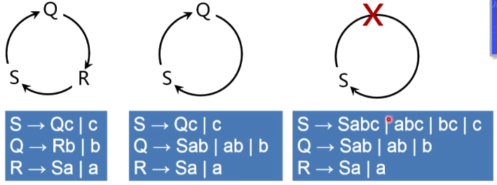

**消除左递归的算法**

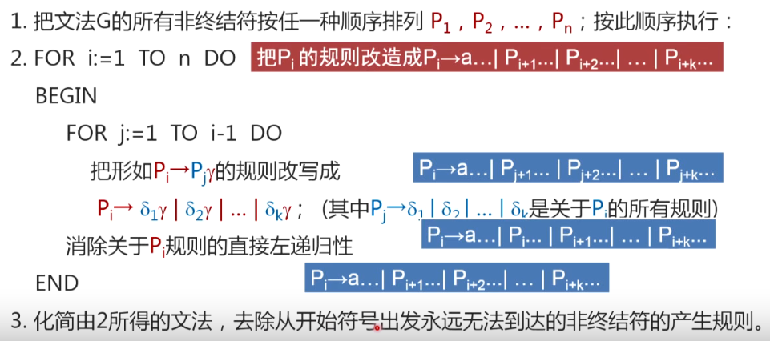


**习题**  消除文法G(S)的左递归

S-> Qc|c  
Q-> Rb|b  
R->  Sa|a  

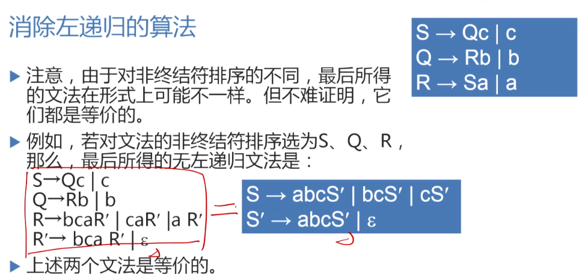

## 消除回溯

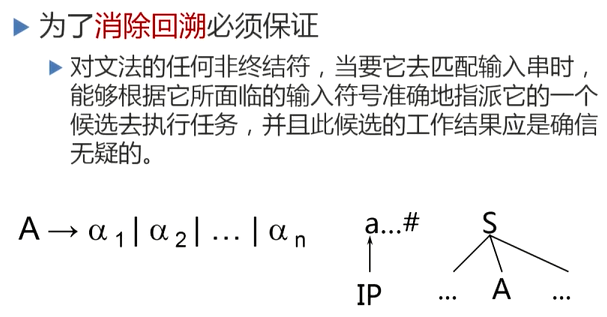

### FIRST集合

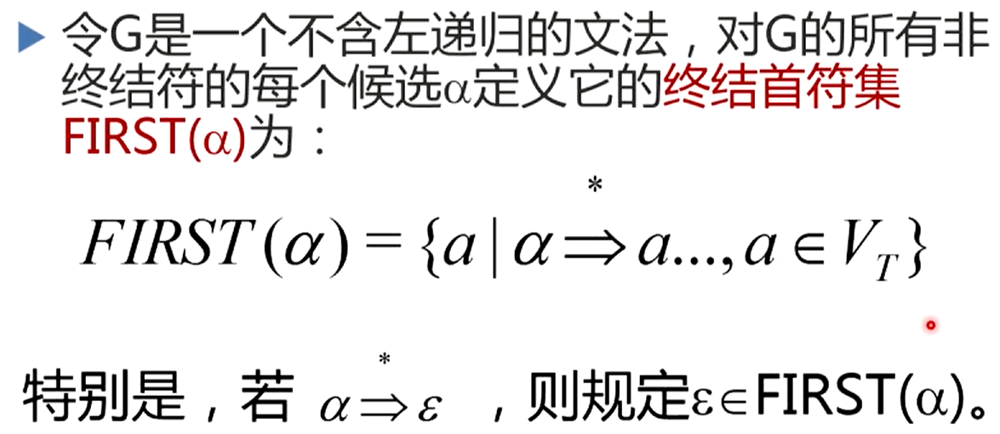

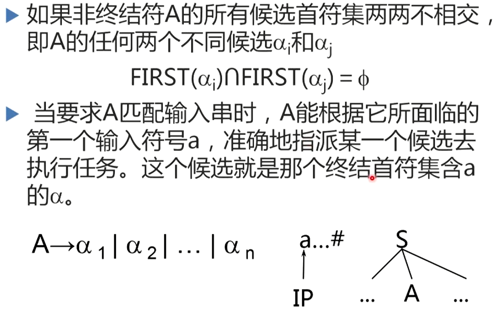


### 提取公共左因子

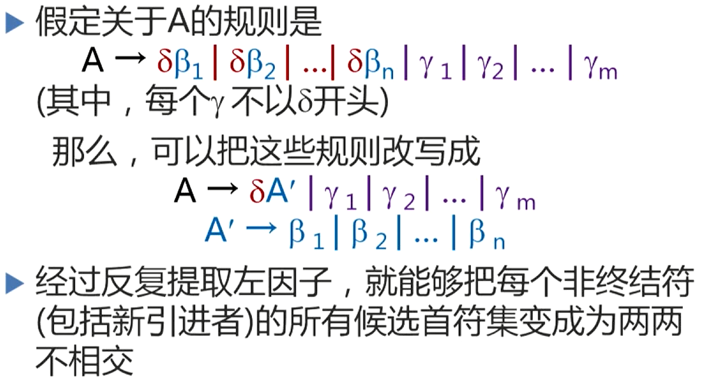

### FOLLOW集合

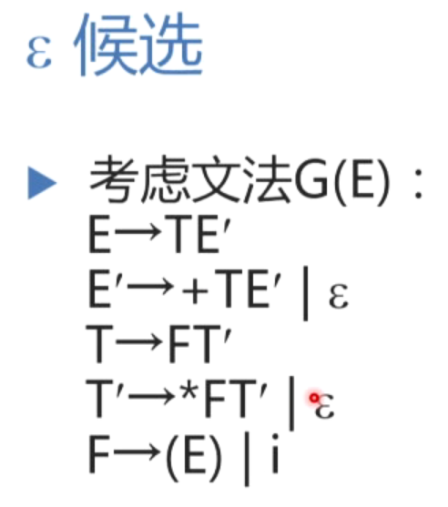


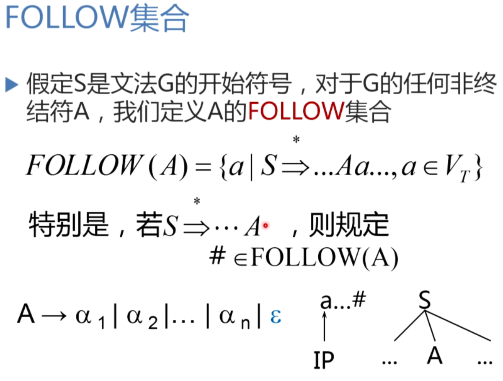

## LL(1)文法

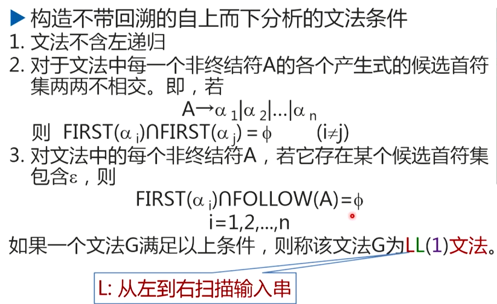


第2个L表示最左推导，1表示每一步只需向前查看一个符号

### LL(1)分析法

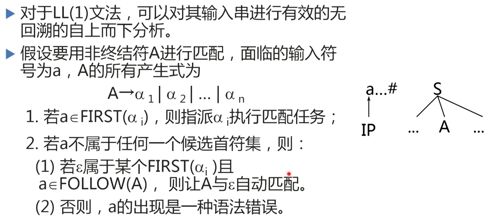


1

