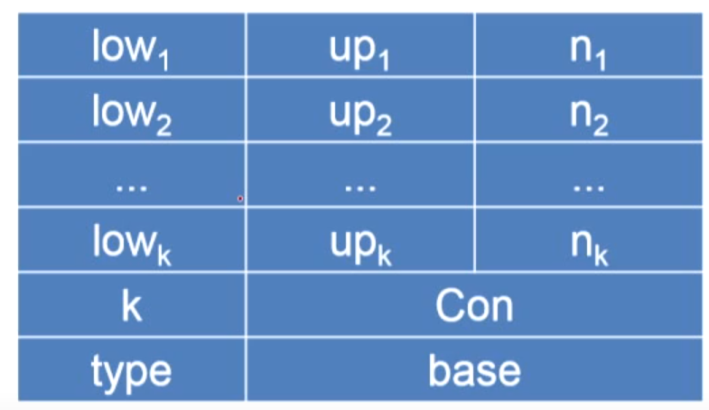

# 常用的高级程序设计语言

| 语言      | 特点                  |
| --------- | --------------------- |
| FORTRAN   | 数值计算              |
| COBOL     | 事务处理              |
| PASCAL    | 结构化程序设计        |
| LISP      | 函数式程序设计        |
| PROLOG    | 逻辑程序设计          |
| C         | 系统程序设计          |
| Smalltalk | 面向对象程序设计      |
| Java      | Internet应用,可移植性 |
| Python    | 解释型                |

如果一个语言不能改变你进行编程的思维方法，那么就不值得去了解这个语言。

# 程序设计语言的定义

容易混淆的概念：

标识符是语法概念，名字是语义概念。

程序设计语言的定义：语法、语义、语用

## 语法

程序本质上是一定字符集上的字符串  
语法:一组规则,用它可以形成和产生一个合式(well- formed)的程序

**词法规则**：**单词符号**的形成规则

单词符号是语言中具有独立意义的最基本结构

一般包括：常数、标识符、基本字、算符、界符等

描述工具：有限自动机


**语法规则**：语法单位的形成规则

语法单位通常包括：表达式、语句、分程序、过程、函数、程序等

描述工具：上下文无法文法


语法的例子：描述算术表达式

```
E→i
E→E+E
E→E*E
E→(E)
```

E表示算术表达式，→表示定义关系，i表示标识符

- **语法规则**和**词法规则**定义了程序的形式结构

- 定义语法单位的意义属于**语义**问题

## 语义

一组规则，用它可以定义一个程序的意义

描述方法：

- 自然语言描述：二义性、隐藏错误和不完整性

- 形式描述
  - 操作语义
  - 指称语义
  - 代数语义

下面哪些属于程序语言的语义定义?

A.表达式中圆括号必须匹配  
B.类的声明必须以class开头    
C.关于函数调用时参数传递方法的描述  √ （A,B,C都是对程序形式上的要求，属于语法的定义）  
D.函数体必须用 return语句结尾

## 程序语言的基本功能和层次结构

程序,本质上说是描述一定数据的处理过程。  
程序语言的基本功能：描述数据和对数据的运算。  
**程序的层次结构**


## 程序语言成分的逻辑和现实意义

抽象的逻辑的意义：数学意义  
计算机实现的意义：具体实现  

计算思维和数学思维的不同

# 高级语言的一般特性

## 高级语言的分类

- 强制式语言( mperative Languge)/过程式语言

  一个语句接一个语句，描述如何对数据进行操作

- 应用式语言( Applicative Language)

  注重程序所表示的功能，描述函数的构造来实现对数据的处理，如：LISP、ML

- 基于规则的语言(Rue-based Language)

  检查一定的条件，当它满足值时，则执行适当的操作，如：Prolog

- 面向对象语言( Object-Oriented Language)

  封装、继承和多态性，如：SmallTalk、Java、C++

## 程序结构

**FORRAN**语言：第一个高级语言

- 一个程序由一个主程序段和若干辅程序段组成，
- 辅程序段可以是子程序、函数段或数据块
- 每个程序段由一系列的说明语句和执行语句组成，各段可以独立编译
- 模块结构，没有嵌套和递归

- 各程序段中的字相互独段中代表不同的名字

主程序

```
PROGRAM ...
...
end
```

辅程序1

```
SUBROUTINE ...
...
end
```

辅程序2

```
FUNCTION ...
...
end
```


**PASCAL**：结构化程序设计语言的代表

- PASCAL程序本身可以看成是一个操作系统调用的过程,过程可以嵌套和递归

- 一个 PASCAL过程

  ```
  过程头
      说明段(由一系列的说明语句组成)
  begin
      执行体(由一系列的执行语句组成)
  end
  ```

**作用域**

- 同一个标识符在不同过程中代表不同的名字

- 作用域名字能被使用的区域范围
- 名字作用域规则—"**最近嵌套原则“**

**最近嵌套原则**

- 一个在子程序B1中说明的名字X只在B1中有效(局部于B1)
- 如果B2是B1的一个内层子程序且B2中对标识符X没有新的说明,则原来的名字X在B2中仍然有效
- 如果B2对Ⅹ重新作了说明那么,B2对X的任何引用都是指重新说明过的这个Ⅹ

## 数据源结构与操作

数据类型通常包括三要素：  
用于区别这种类型数据对象的**属性**  
这种类型的数据对象可以具有的**值**  
可以作用于这种类型的数据对象的**操作**

初等数据类型

- **数值类型**：整型、实型、复数、双精度；**运算**：+、-、*、/等
- **逻辑类型**：true、false；布尔**运算**：与、或、非等
- **字符类型**：符号处理
- **指针类型**

## 标识符与名字

标识符：以字母开头的、由字母数字组成的字符串。

名字：标识程序中的对象

标识符和数据对象的关联就是绑定（binding），就称为了所指代的数据对象的名字。

名字具有确切的意义和属性，值：单元中的内容；属性：类型和作用域

名字的说明方式：

- 由说明语句来明确规定的，int score
- 隐含说明：FORTRAN以I,J,K,...N为首的名字代表整型，否则为实型
- 动态确定：走到哪里，是什么、算什么，比如Python

## 数据结构

### 数组

逻辑上，数组是由同一类型数据组成的某种n维矩形结构，沿着每一维的距离，称为**下标**

数组可变与不可变：编译时能否确定其存贮空间的大小

访问：给出数组名和下标值，如A[10,i+j]

存放方式：按行存放，按列存放

C和PASCAL是按行存放、FORTRAN是按列存放。

按行存放，按列存放的不同会影响到 数组元素地址计算

数组A[10,20的首地址为a,每个元素占1字节,各维下标从1开始,按行存放,那么A[i,j]地址为：


通用的数组元素地址计算公式

设A为n维数组,按行存放,每个元素宽度为W

- low~i~为第i维的下界
- up~i~为第维的上界
- n~i~为第i维可取值的个数(n~i~=up~i~-low~i~+1)
- base为A的第一个元素相对地址

元素A[i~1~，i~2~，...，i~k~]相对地址公式
$$
((...i_1n_2+i_2)n_3+i_3)...)n_k+i_k)×w+base-((...((low_1n_2+low_2)n_3+low_3)...)n_k+low_k)×w
$$
公式中的+base后面都是不变的部分，记为con，然后编程程序中有两部分代码来计算这个公式

**内情向量**

登记维数，各维的上、下限,首地址，以及数组(元素)的类型等信息



### 记录

或称为结构体

由已知类型的数据组合在一起的一种结构，记录或者结构的元素，也叫做域（field）

```
record{
    char name[20];
    integer age;
    bool married;
}cards[1000]
```

访问：复合名 cards[k].name

存储：连续存放

域的地址计算，相对于记录结构起点的相对数OFFSET


### 字符串、表格、栈

字符串:符号处理、公式处理

表格:本质上是一种记录结构

线性表:一组顺序化的记录结构

栈:一种线性表;后进先出, POP PUSH

### 抽象数据类型

**抽象数据类型**：抽象数据类型由数据集合、及其相关的操作组成，这些操作有明确的定义，而且定义不依赖于具体的实现。

一个抽象数据类型包括：

- 数据对象集合
- 作用于这些数据对象的抽象运算的集合
- 这种类型对象的封装,即,除了使用类型中所定义的运算外,用户不能对这些对象进行操作

方式：

- Ada语言通过程序包（package）提供了数据封装的支持
- 面向对象语言通过类（Class）对抽象数据类型提供支持

## 语句与控制结构

### 表达式

- 表达式由运算量(也称操作数,即数据引用或函数调用)和算符(运算符,操作符)组成

- 形式:
  - 中缀：X*Y
  - 前缀：-A
  - 后缀：P↑或称p->
- 表达式形成规则：
  - 变量(包括下标变量)、常数是表达式。
  - 若E~1~、E~2~为表达式，θ是一个二元算符，则E~1~θE~2~是表达式。
  - 若E是表达式，θ为一元算符，则θE(或Eθ)是表达式
  - 若E是表达式，则(E)是表达式。

算符的优先次序，一般的规定：

- PASCAL：左结合A+B+C=(A+B)+C
- FORTRAN：对于满足左、右结合的算符可任取种，如A+B+C就可以处理成(A+B)+C,也可以处理成A+(B+C)

代数性质：

- 代数性质能引用到什么程度视具体的语言而定

- 在数学上成立的代数性质在计算机上未必完全成立，如A+B=B+A，在程序中未必正确，如函数调用，先调用A函数后调用B函数，反过来结果可能完全不同。

### 语句

**赋值语句**  

- A := B
- 名字的**左值**：该名字代表的存储单元的**地址**
- 名字的**右值**：该名字代表的存贮单元的**内容**

左值和右值，在C语言中,下面选项只具有右值、不具有左值的是()

A.变量  B.下标变量  C.a+5  D.指针变量P  E.*P(P是指针变量)

**控制语句**

无条件转义语句 goto

条件语句： if else

循环语句 while、for

**过程调用语句**

call、函数调用

**返回语句**  return (E)


**语句的分类**

功能上分：

- 执行语句：描述程序的动作
- 说明语句：定义各种不同数据类型的变量或运算定义名字的性质

形式上分：

- 简单句:不包含其他语句成分的基本句，比如 A=B+C； goto 105;
- 复合句:句中有句的语句，比如while语句


