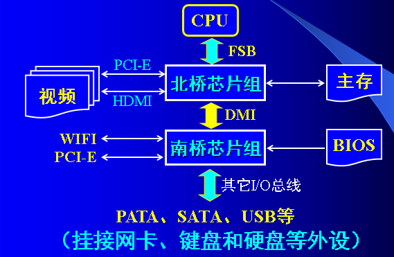
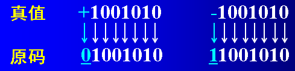
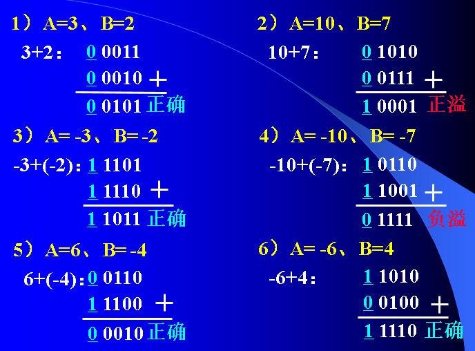
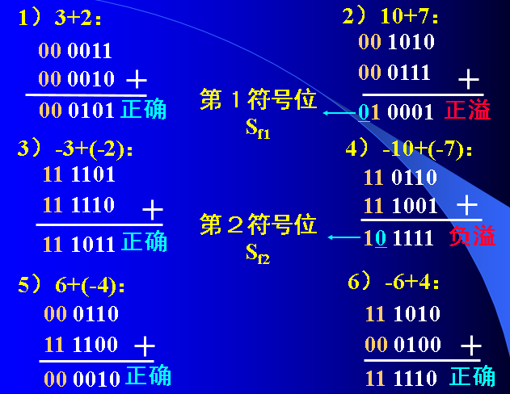
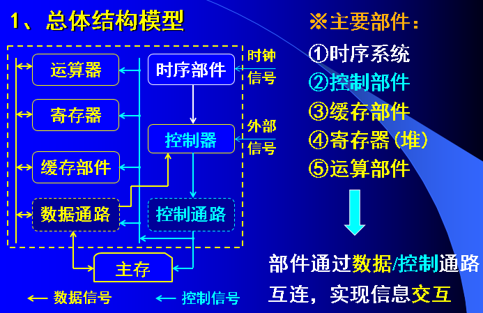
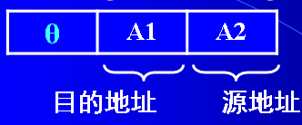
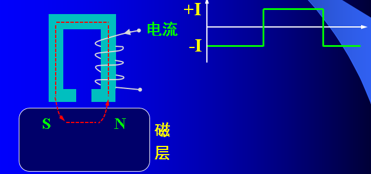

https://www.icourse163.org/course/UESTC-1001543002

# 第1章  计算机系统概述

## 冯 · 诺依曼体系

约翰·冯·诺依曼 

EDVAC（冯·诺依曼思想）

冯 · 诺依曼体系

**1.用二进制代码表示程序和数据；**

任何复杂运算和操作都转换成用二进制代码表示的指令，数据也用二进制代码来表示；

**2.采用存储程序的工作方式**

将程序和数据存储起来（存储程序），让计算机自动地执行指令，完成各种复杂的运算操作（核心思想）。

**3. 新型的现代计算机硬件组成**

存储器、运算器、控制器、输入设备和输出设备

## 硬件组成


### CPU

主要由运算器、控制器等部件组成

运算器

- 完成两类（算术和逻辑）运算

- 主要由ALU (算术逻辑单元)构成，执行算术、逻辑运算以及移位循环等操作，是CPU功能的主要执行部件。
- ALU以全加器为核心，具有多种运算功能。
- 运算的位数越多,计算精度就越高,但器件也更复杂。
- 运算器的数据宽度一般是：8位、16位、32位或64位。

控制器

（2）控制器
 1）功能：产生控制命令(微命令)，控制全机操作。
 2）基本组成：


### 存储器

1）功能：存储数据和数字化后的程序。

- **存储单元**：在存储器中保存一个n位二进制数的n个存储电路，组成一个存储单元。
- **地址**：存储器由许多存储单元组成,每个存储单元的编号，称为地址。

- 存储容量：存储器所有存储单元的总数。
- **内存储器**：即**主存**，是一种用来存放直接为CPU提供服务的程序和数据存储器
- **外存储器**：即辅存， 为计算机配备的存储容量很大的辅助存储器。

### 输入/输出设备

  功能：执行输入/输出信息的转换。         

输入时：原始信息 ----->二进制代码，送入主机；

输出时：处理结果（二进制代码）  ---->用户能够直接感知的形式(字符、图像、声音),并输出给用户；

### 总线（Bus）

能为多个部件分时共享的一组信息传送通路。

根据传送的信息不同，可分三类：
① 传送各种数据信息的**数据总线**(Data Bus);
② 传送各种地址信息的**地址总线**(Address Bus);
③ 传送各种控制信号的**控制总线**(Control Bus);

### 接口

外设的种类、数量了变，为了将总线与各类外设连接，须在两者之间设置一些部件，具有**缓冲、转换、连接**等功能，这些部件就是接口。


## 计算机硬件的典型架构

### 微型计算机：南-北桥架构



### 小型计算机：多处理器架构


### 超级计算机(超算)：集群式架构


天河-2号的计算节点剖析


### 总结：多处理机系统结构

特点：用多处理器CPU构成

根据处理器之间连接的紧密程度，又分为：

①紧密偶合型多机系统
②松散偶合型多机系统

**※紧密偶合型多机系统**


LM ：局部存储器

特点：多个（CPU+LM）组，通过系统总线构成多机系统，且有共享的全局主存储器；

**※松散偶合多机系统**


特点：多个计算节点，由通信系统连接成的多机系统，无全局的主存储器。

## 软件系统 

软件类别：系统程序和应用程序。 

- 系统程序：负责系统调度管理，提供运行和开发环境、各种服务，确保系统运行良好。

- 应用程序：利用计算机来解决应用问题所编制的程序,如工程设计程序、数据处理程序、自动控制程序、企业管理程序、情报检索程序、科学计算程序等等。

## 硬、软件系统层次结构

计算机系统是一个由多层次的软件+硬件组成的系统，基本结构如下所示：


## 软件与硬件的逻辑等价性 

※软件的特点：
易于实现各种逻辑和运算功能，但是常受到速度指标和软件容量的制约；

※硬件的特点： 
可以高速实现逻辑和运算功能，但是难以实现复杂功能或计算，受到控制复杂性指标的制约。

计算机中的软件，理论上都可以“**固化**”或“**硬化**”成硬件，以高执行速度；

## 计算机系统的性能指标

**1.基本字长**

※指一次数据操作的基本位数。
※它会影响计算的精度、指令的功能。

一般4位、8位、16位、32位、64位，等等；

**2.外频**

先介绍外频的概念

外部频率或基频，也叫**系统时钟频率**。


**3.常用的CPU性能指标**

（1）CPU的主频=外频×倍频系数；

（2）IPS，每秒执行指令数；MIPS：每秒执行多少百万次定点指令

（3）CPI，即Clock-cycle Per Instruction 每个指令执行需要的时钟周期数量，越大越慢 ；

（4）FLOPS，每秒执行浮点运算的次数；

比如， 天河2号, 其实测速度: 33.86PFLOPS (LINPACK)

（5）CPU的功耗

动态功耗：粗略计算 P = C×U^2×f    C：负载电容；U：工作电压；f：工作频率；

静态功耗

**4. 数据传输率**

带宽 = 位宽×工作频率  /8 (B/S)

物理含义：单位时间内数据的传输量。

注意：计算PCI-E总线的带宽时，一般还要考虑编码方式、单双工模式和通道路数等。

【例题】

| 指令类型     | 占比 | CPI  |
| ------------ | ---- | ---- |
| 传输类指令   | 40%  | 15   |
| 双操作数指令 | 30%  | 20   |
| 单操作数指令 | 20%  | 15   |
| 转移类指令   | 10%  | 10   |

假设该I/O程序由200条指令构成，CPU每次执行该程序可并行输出4KB数据。CPU主频32MHz，求I/O带宽。

解答：

平均CPI=15×40%+20×30%+15×20%+10×10%=16 

程序的时钟周期数T=200×16=3200

每秒可执行程序的次数=主频÷每次的时钟周期=32M÷3200

I/O带宽=(32M÷3200)×4KB=40MBps

 **5. 存储器的容量**

※内存(主存)容量
指可编址的存储单元个数（**取决于地址码位数**）×存储单元的位宽（**表明编址单位**）

※外存(辅存)容量
指存储器能存储的最大数据量;常表示为：Byte、KB、MB、GB、TB
外存容量与总线地址码的位数无关。

**其他指标**

①吞吐量：一台计算机在某一时间内能够处理的信息量。

②响应时间： 从输入有效到系统产生响应的时间

③利用率： 给定的时间间隔内系统被实际使用的时间所占的百分百

④处理机字长：运算器中一次能够运算二进制数的位数

⑤总线宽度：cpu中连接运算器与存储器的内部总线二进制位数

⑥存储器带宽：单位时间内从存储器中读出的二进制信息量，一般用字节数/秒表示

⑦cpu主频：主时钟产生信号的固定频率，其倒数是cpu的时钟周期

⑧cpu执行时间=cpu时钟周期数*cpu时间

⑨MIPS：每秒执行多少百万次定点指令

⑩FLOPS：每秒钟浮点操作的次数

# 第2章 数据表示、运算与校验

主要介绍：
①数字型数据的计数制、符号数的表示、定点数和浮点数；
②基本的运算方法；
③字符的表示；
④常用的数据校验方法；

## 2.1 数值型数据的表示

### 2.1.1 进位计数制

※ 数制的基与权

在任一数制中，每一个数位上允许使用的记数符号的个数被称为该数制的基数。

每1位都对应1个表示该位在数码中的位置的值，这个值就称为数位的权值w。

[例] 128（10），1101（2）

最高位的1  W=10^2^，W=2^3^

1.常用的几种进位制

（1）2进制：0、1
（2）8进制：0、1、2、…、7
（3）16进制：0、…、9、A、B、C、D、E、F

2.进制之间的转换

（1）整数 10 --> 2 (除2取余法)
（2）小数 10 --> 2 (乘2取整法)
（3）整数  2 --> 10(按权相加)
（4）小数  2 --> 10(按权相加)
（5）16进制↔2进制(逐位转换/分组转换)


### 2.1.2 带符号数的表示

数的符号表示规则：
“0”表示正号“+”，“1”表示负号“-”

二进制数的码制：原码、反码、补码和移码

#### 1、原码

一个二进制数，用0-1代码表示符号，数值位不变就得到与该二进制数真值对应的原码



**字长为8位的原码**
表示范围为：-127～+127

[+127]原 =0 1111111
[–127]原 =1 1111111

数值“0”有两种原码形式：

[+0]原=0 0000000
[-0 ]原=1 0000000

#### 2、反码

**① 正数情况**
X反=X原（X≥0）

[例] X= +1101001  (真值+105)
        X反=X原=0 1101001

**② 负数情况**
符号位保持为“1”，数值位分别“按位取反”

[例] X= -1101001  (真值-105)

X原=1 1101001

X反=1 0010110

**字长8位的反码**
表示范围为：-127 ～ +127
	[+127]反=0 1111111
	[- 127]反=1 0000000

数值“0”也有两反码形式:

[+0]反=0 0000000
[-0 ]反=1 11111111

#### 3、补码

编码定义：[X]补=X+2^n^  (模2^n^)，n为编码位数

※补码的编码规则：

(a)对于正数(字长8位)
		**[X]补=[X]原     (即X≥0时)**


(b)对于负数(字长8位)
**符号位仍保持为“1”**
其余各数值位“**按位取反,末位再加1**”
    [X]补=[X]反+…1   (即X<0时)

**字长8位的补码**
表示范围为：-128 ～ +127
		[+127]补=0 1111111；
		[- 128]补=1 0000000

※注意
补码比原码和反码多表示1个负值，即-128

**数值“0”只有1种补码形式：因为1 0000000用来表示-128的补码去了**
		[+0]补=[-0]补= 0 0000000


#### 4、原码和补码之间的转换

**(1)已知[X]原，求[X]补**
[例]已知[X]原= 10011010，求[X]补

解： [X]原= 10011010  原码为负数   

符号位不变，其余各位变反  11100101

末位加1    [X]补=11100110


**(2)已知[X]补，求[X]原**

   **[[X]补]补=[X]原**

[例]已知[X]补=11101100，求[X]原

解：[X]补= 11101100   补码为负数

符号位不变，其余各位变反    10010011

末位加1    [X]原 =10010100


**(3)求补(变补)，即已知[X]补，求[-X]补**  

[X]补的代码连同符号位一起变反，末位再加1，即得到[-X]补

[例]已知[X]补=01010110，求[-X]补

解：[X]补=01010110  不区分正负数

连同符号位一起变反  10101001

末位加1    [-X]补=10101010

#### 5、移(增)码

移码通常用于表示**浮点数的阶码**。
**阶码**一般为整数，故移码通常只用于表示整数

对定点整数x，它的移码是：
         **[x]移＝2^n-1^＋x，其中-2^n-1^ < x < 2^n-1^**
这里的n为X~原~位数

上述规则等价于**将x正向平移或者增加2^n-1^** ，因此称之为移码或增码。


**移码**表示范围与补码一致，**0也只有1个移码**。

- 正数：将原码符号位变反，即得到移码。

- 负数：将原码连同符号位一起变反，末位再加1，即得到移码(与变补等效)。

- **补码和移码: 符号相反、数值位相同**

### 2.1.3 定点数与浮点数

#### 1、定点数的表示

数的**小数点固定在同一位置不变**。

①带符号的定点小数
约定所有数的小数点的位置，固定在符号位之后。


字长 n+1位，则表示范围为：

-(1-2^-n^) ～1-2^-n^

②带符号的定点整数

小数点的位置固定在最低数值位之后


字长n+1位，则数的表示范围为：

- (2^n^ -1) ～2^n^ -1

③无符号定点整数

小数点的位置固定在最低数值位之后

若代码序列为X~n~X~n-1~…X~1~X~0~，共n+1位，则有：

典型值                             真值                  代码序列

最大正数                     2^n+1^-1                       11…1111
最小非零正数             1                                00….001

表示范围为:

 0 ~（2^n+1^-1）

分辨率为: 1

**※字长8位的定点数的表示范围**

无符号数：00000000 ～11111111         对应  0~255

定点整数:  11111111原～01111111原   对应  -127~127

定点小数:  1.1111111原～0.1111111原  对应 -(1-2^-7^) ~  (1-2^-7^)

​                   1.0000000补～0.1111111补  对应 -1~  (1-2^-7^)

#### 2、浮点数的表示原理

##### ①浮点表示中，小数点的位置可按需浮动

格式模型：


##### ②引入浮点数表示的意义

[例]某字长为8位的原码二进制数

定点数：11111111 ~ 01111111

整数：-127         127      精度：1
小数：-(1-2^-7^)     1-2^-7^    精度：2-7

浮点数：5位阶码+3位尾数

01111 111 ~ 01111 011

2^15^×(-0.75) ~ 2^15^×0.75     精度：11111 001=2^-15^×0.25

相同字长时，浮点数的表示范围更大、精度更高！

##### ③浮点数的机器(存储)格式

浮点数真值：N =±R^E^ ×M   科学计数法


R：阶码的底数，隐含约定为2。

E：阶码，定点整数，补码或移码表示，其位数决定了数值的范围；

M：尾数，为定点小数，原码或补码表示，其位数决定着数的精度；

数符表示数的正负。

##### ④尾数M的规格化表示

规格化的目的 → 使浮点数的表示代码“唯一”

128=0.128×10^3^=1.28×10^2^=12.8×10^1^ ，…

科学计数法约定：1≤|M|<10

则规范形式：128=1.28×10^2^  （唯一）

3.2=1.6×2^1^=0.8×2^2^=0.4×2^3^ , …

可以表示成任意多个代码形式→ 计算不便

约定尾数M的值域，使数的表示是唯一的、确定的

→尾数M的“规格”化


对于**原码**：**规格化以后尾数的最高有效位为“1”**

M原=0.**1**000，1.**1**010

~~M原=0.**0**010，1.**0**110~~ 非规格化

对于**补码**：

正数，规格化后最高数值位为“1”, 如0.**1**010(0.625),  0.**1**110(0.875)

负数，规格化后最高数值位为“0”, 如1.**0**010(-0.875),  1.**0**000(-1)


#### 3、※IEEE754格式的浮点数

有32位浮点数（单精度）和64位浮点数（双精度）

① 32位短浮点数：

| 31          | 30~23     | 22~0      |
| ----------- | --------- | --------- |
| S（符号位） | E（阶码） | M（尾数） |

在上述的表示格式中：

- Ｓ=浮点数的符号位，0表示正数，1表示负数；
- Ｅ=阶码，8位，采用移码表示，阶符隐含；
- Ｍ=尾数，23位，纯小数表示，且真值=1+M；
- 阶码E采用移码形式，但只偏移2^7^-1 （不是2^7^）。 

② 64位长浮点数：

| 63          | 62~52     | 51~0      |
| ----------- | --------- | --------- |
| S（符号位） | E（阶码） | M（尾数） |

在上述表示格式中：

- Ｓ=浮点数的符号位，0表示正数，1表示负数；
- Ｅ=阶码，11位，采用移码方式，阶符隐含；
- Ｍ=尾数，52位，用纯小数表示；
- 对阶码E编码时，只偏移2^10^-1 （标准移码偏移2^10^）。

※补充说明：    

（1）为了确保浮点数表示的唯一性，约定 0≤M<1；

（2）E为全0且M非全0：非规范浮点数（E偏移126），则：F真=(-1)^S^×M×2^E-126^

（3）E为全0且M为全0：表示浮点数 0

（4）1≤E≤254：数是规范浮点数（E偏移127），
则：F真=(-1)^S^×(1+M)×2^E-127^

（5）E为全1（255）：M为全0，则F真=±∞

（6）E为全1（255）：M非全0时，代码无效(NaN)；


## 2.2字符表示方法

### 2.2.1 ASCII码

ASCII (American Standard Code for Information Interchange)。

- 字符总数：128

- 包含数字0~9，大小写英文字母，运算符，标点符号，标示符，格式控制符等等。

- 代码宽度：7b

- 存储宽度：7b(有效位)+1b(奇偶校验位)=8b ,所以说用一个字节表示字符 ,对应编程语言中char类型

ASCII码示例

① 数字型

| **16**进制 | **30** | **31** | **32** | **33** | **34** | **35** | **36** | **37** | **38** | **39** |
| ---------- | ------ | ------ | ------ | ------ | ------ | ------ | ------ | ------ | ------ | ------ |
| 数字       | 0      | 1      | 2      | 3      | 4      | 5      | 6      | 7      | 8      | 9      |

② 字符型

| 16进制 | **41** | **42** | **43** | **44** | **45** | **46** | **47** | **48** | **49** | **4A** |
| ------ | ------ | ------ | ------ | ------ | ------ | ------ | ------ | ------ | ------ | ------ |
| 字符   | A      | B      | C      | D      | E      | F      | G      | H      | I      | J      |

③ 其它型

| **16**进制 | **25** | **28** | **29** | **2A** | **3C** | **3D** | **3E** | **3F** | **40** | **7F** |
| ---------- | ------ | ------ | ------ | ------ | ------ | ------ | ------ | ------ | ------ | ------ |
| 字符       | %      | (      | )      | *      | <      | =      | \>     | ?      | @      | DEL    |

### 2.2.2汉字编码

#### 1.汉字的输入码

包括：数字码、拼音码、字形码

**①数字输入码**  

√常用的是国标区位码，用数字串代表汉字；

√将**6763个二级汉字**分为94个区，每区94位，把汉字表示成二维数组，数组下标就是**区位码**。

※数字编码输入的优缺点：

无重码，输入码与内部码的转换方便，代码难以记忆。

[例]平↔3829（位于码表38区、29位）

**②拼音输入码**

以汉字拼音为基础的输入方法（如微软拼音）

※拼音输入码的优缺点：

√简单方便；
√同音字多，重码率高，影响输入速度。

**③字形输入码**

根据汉字的书写形状来进行编码（如五笔字型）。

√把汉字的笔划部件用字母或数字进行编码，按笔划顺序依次输入，就能对应一个汉字。

※字形输入码的优缺点：

√简单方便，符合书写习惯；
√重码率高，需要记住字形结构。

#### 2.汉字的内码

Unicode？？

用于汉字信息的存储、交换、检索等操作的计算机内代码,一般用两个字节表示。

√机内码的基础是国标码

国标码：**10进制区位码转成16进制**，再**加2020H**

机内码：国标码+**8080H**(与ASCII区别)，或者区位码转成**16进制+A0A0H**

[例]“啊”的区位码1601~10~=1001H
国标码=1001H+2020H=3021H
机内码=1001H+A0A0H=B0A1H

#### 3.汉字字模码

字模码用点阵表示的汉字字形代码,是汉字的**输出形式**。


#### ※特别说明：

①字模点阵用来构成汉字库，并非而机内存储。
②字库中存储每个汉字的点阵代码，用于汉字的显示输出或打印输出。
③当显示输出或打印输出时才检索字库，输出字模点阵，得到字形。

√汉字的输入码、内码、字模码分别是用于计算机输入、内部处理、输出三种不同用途的编码；

√各有用途，不能混为一谈。

## 2.3数据存储与处理

### 1、移位操作


①正数补码\原码移位规则

※移位规则

数符不变  (单：符号位不变；双：第1符号位不变)

空位补0   (右移时第2符号位移至尾数最高位)


②负数补码移位

（1）移位规则

数符不变   (单：符号位不变；双：第1符号位不变)

左移空位补0

右移空位补1   （第二符号位移至尾数最高位）。

这是为了达到向左移动几位，就扩大为2的几次方倍的效果


### 2、舍入方法

① **0舍1入（原码、补码）** **类比四舍五入**

［例］保留4位尾数：        

0 0010**0**原 ——>0 0010原     

1 0010**1**原 ——> 1 0011原                

1 1101**1**补 ——> 1 1110补               

② **末位恒置1（原码、补码）**

［例］保留4位尾数：        

0 0010**0**原 ——>0 001**1**原     

1 0010**1**原 ——> 1 001**1**原                

1 1101**1**补 ——> 1 111**1**补        

### 3、数位扩展与压缩

比如在32位计算机中的数据是32位，要把这数据放到64位计算机中，要扩展成64位，反之，压缩

（1）**符号扩展**  直接把符号位（0/1）填充到扩展位

000A ——>**0000**000A  

800A——>**FFFF**800A

（2）**0-扩展**  高位均全补0  （针对无符号数）

002A——>**0000**002A

F12C——>**0000**F12C

（3）**位数压缩**  弃高位、留低位  有误差

**F12B**800A——>800A

**02A0**F12C——>F12C

### 4、数据存储(按字节编址)

（1）小端模式/ Little-Endian （便于数据转换）

小地址单元存储数据的低位(即尾端)

​    FF       FF       00        01 ===》**FFFF0001**

#103   #102   #101    #100

（2）大端模式/ Big-Endian（便于数据类型的符号判断）

大地址单元存储数据的低位(即尾端)

FF       FF       00        01 ===》0100FFFF

#103   #102   #101    #100

### 5、数据字的对齐(Alignment)

要求数据的地址是相应的边界地址

 ※按边界对齐 

优点：较少的读取次数

（假定存储字宽度为32位，按字节编址，字长32位）

- ​    字地址：4的倍数(低两位为0)
- ​    半字地址：2的倍数(低位为0)
- ​    字节地址：任意

※不按边界对齐

 例如 int i, short k, double x, char c


试分析访存次数的变化情况

按边界对齐，这四个数需要5次读取

不按边界对齐，这四个数需要6次读取

 思考下列问题:

1、在32位机器上输出si, usi, i, ui的十进制（真值）和十六进制值（补码机器数）是什么？

```c
short  si = -32768;
unsigned short  usi = si;
int  i = si;
unsingned  int ui = usi ;
```

## 2.4基本运算方法

- 定点数运算
  - 补码（+、–、 ×、÷ ）

- 浮点数运算
  - 原码（+、 –、 ×、÷）
  - 移码（+、 –）

### 2.4.1 定点数的运算

定点数一般用补码表示；
符号位参加运算。

重点：基于补码的加、减乘、除法

#### 1、补码的加减法

 ( X + Y )补  = X补  +  Y补             （1）
 ( X -  Y )补  = X补  +  (-Y)补         （2）

数学依据：

(X+Y)补=X+Y+2^n^=X+Y+2^n^+2^n^=X补+Y补

(X-Y)补=X-Y+2^n^=X-Y+2^n^+2^n^=X补+(-Y)补

全过程以2n为模，即除以2n后取余数。

其中，(-Y)补 = [Y补]变补

**(-Y)补:Y的符号置反后再表示成补码**

[Y补]变补:Y补连同符号一起变反、末尾+1


※补码表示与变补运算的区别


（2）补码加减运算流程

- 操作数用补码表示,符号位参加运算
  - ADD   X补+Y补
  - SUB    X补+(-Y)补

- 得到补码表示的结果，符号位指示结果的正负

（3）逻辑实现


（4）溢出判断

＊溢出的判断规则

思考：在什么情况下可能产生溢出？

［假设］补码表示的Ａ、B两数做加减运算

补码，故符号位也参加运算     

- A：4位尾数，1位符号(SA)
- B：4位尾数，1位符号(SB)     

结果的符号，记为S~f~
符号位的进位，记为C~f~
尾数最高位的进位，记为C



①硬件判断逻辑一(根据S~A~、S~B~与S~f~的关系)


②硬件判断逻辑二(根据C~f~与C的关系)


**溢出逻辑= C~f~⊕C**   异或

③硬件判断逻辑三(从双符号位)



**溢出逻辑= S~f1~⊕S~f2~**

00/11-正确；01-正溢；10-负溢；

#### 2、原码加减运算

[符号位单独处理、数值位加减] 

先比较两数符号：

- ①加法：同号数值位求和，异号求差；
  - 求和  3原+2原         3原-[-2]原
  - 求差  3原+[-2]原     3原 -  2原
- ②减法：异号数值位求和，同号求差；

※求和时：数值位相加，和的符号取被加数（被减数）符号[若最高位产生进位，则结果有溢出。

※求差时：被加数（被减数）与加数（减数）求补后相加。

- ⊙最高数值位有进位，相加结果为正，数值位正确；符号取被加数（被减数）的符号。
- ⊙最高数值位无进位，相加结果为负，得到数值位的补码，需对结果求补还原为绝对值形式的数值位；符号位与被加数（被减数）的符号相反。

[例]已知 [X]原 = 1.0011，[Y]原 = 1.1010，计算[X+Y]原
解：由原码加减运算规则知：同号相加，则求和，和的符号同被加数符号。
     和的数值位为：0011 + 1010 = 1101
     和的符号位为：1
                  [X+Y]原 = 1.1101
[例]已知 [X]原 = 1.0011，[Y]原 = 1.1010，要求计算[X–Y]原 

解：由原码加减运算规则知：同号相减，则数值位求差
     差的数值位为：0011+(1010)求补 = 0011 + 0110 = 1001 
     最高数值位无进位，表明加法结果为负，需对1001求补，还 原为绝对值形式的数值位。即：(1001)求补= 0111
     差的符号位为[X]原的符号位取反，即
                  [X–Y]原 = 0.0111

#### 3、标准移码的加减


**※补码和移码：符号位相反、数值位相同**

因此，可得到移码的下列加减法则：

① 加法：直接将[E1]移和[E2]移进行模2^n^加，结果的符号取反。
② 减法：先将减数[E2]移求补，然后再与被减数 [E1]移进行模2^n^加，结果的符号取反。

[溢出判断]
进行模2^n^相加时，如果两个加数与和数符号全相同，则发生了溢出。


### 2.4.2 定点数乘法

√原码一位乘

√补码一位乘

√原码两位乘

#### 1、原码一位乘

原码乘法——》部分积累加、移位。

[例] 0.1101×1.1011

乘积 P  = |X|×|Y|

符号 S~P~= S~X~⊕S~Y~


-  原码1位乘法

（1）算法原理[每次将1位乘数所对应的部分积与原部分积的累加和相加，并移位]

设置寄存器：
        A：存放部分积累加和、乘积高位
        B：存放被乘数
        C：存放乘数、乘积低位    

设置初值：

A = 00.0000
B = |X| = 00.1101
C = |Y| =      .1011    


#### 2.补码一位乘法

※Booth（比较法）

[XY]补=[An]补+(Y~1~-Y~0~)×[X]补

| Y~n~(高位) | Y~n+1~(低位) | 运算操作       |
| ---------- | ------------ | -------------- |
| 0          | 0            | ½ ×A补         |
| 0          | 1            | ½ × (A补+X补)  |
| 1          | 0            | ½ × (A补- X补) |
| 1          | 1            | ½ × A补        |

＊乘数尾添加Y~n+1~，循环判别Y~n~Y~n+1~,累加如表情况的的校正值，再整体右移1位（ 即½ × ）。


※补码1位乘法除了比较法，还有校正法。

①乘数Y补为正，乘以X补累加，结果不校正；

②乘数Y补为负，乘以X补累加，结果-X补校正；

（请参考教材）

### 2.4.3 定点数的除法

√补码不恢复余数除法

√补码恢复余数的除法

√原码恢复/不恢复余数除法

#### 1.补码不恢复余数除法


### 2.4.4 IEEE754浮点四则运算

浮点运算的实现：

低档微机，通过子程序

中档微机，通过浮点处理器（协处理器）

高档微机，通过专门的浮点运算部件

[以IEEE754浮点数为例]


#### 0、IEEE754短浮点数阶码的加减


#### 1、浮点的加减运算

假设：A=2^AE^ ×A~M~，B=2^BE^ ×B~M~ 

调整阶码和尾数：AE →E ←BE、A~M~、B~M~  

A+B= (A~M~+B~M~  )×2^E^  

浮点加减法的思路：

浮点数的加减

- →移位操作
- →尾数原码加减

(1)检测能否简化操作

判操作数是否为0

- 尾数为0
- 阶码下溢(归0)

(2)计算阶差

(3)对阶


[目的]使两数阶码相等(小数点实际位置对齐，尾数对应权值相同)。

[规则]小阶向大阶对齐。

※对阶操作：小阶的阶码增大，尾数右移。
[例]AE>BE，则BE+1→BE，BM，直到BE=AE

※阶码比较：比较线路或减法。

（4）尾数加减.

AM±BM→AM

（5）结果规格化

尾数M左右移动，使： 
1≤|M|<2

 |M|<1  应左移规格化

|M| ≥2  应右移规格化

溢出判断

以下情况下，可能会导致阶码溢出

- 左规（阶码 - 1）时 
  左规时：先判断阶码是否为全0，若是，则直接置阶码下溢；否则，阶码减1后判断阶码是否为全0，若是，则阶码下溢。
- 右规（阶码 +1）时
  右规（+ 1）时，先判断阶码是否为全1，若是，则直接置阶码上溢；否则，阶码加1后判断阶码是否为全1，若是，则阶码上溢。 


#### 2、浮点数的乘法

设：A=2^AE^×A~M~，B=2^BE^ ×B~M~ 

则：A×B= (A~M~×B~M~)×2^AE+BE^  

浮点乘法→分解成：移码加法、原码乘法；

※运算步骤：

①求阶和AE+BE

②尾数相乘，

③结果规格化。不需左规！最多右规1次！

④其它处理：
如舍入、置0、阶码溢出判断

#### 3、浮点数的除法

设：A=2^AE^×A~M~，B=2^BE^ ×B~M~ 

则：A÷B=(A~M~/B~M~)×2^AE-BE^

浮点除法→分解成：移码减法、原码除法

※运算步骤：

①求阶差AE-BE

②尾数相除，

③结果规格化。需右规？？

④其它处理：
如舍入、置0、阶码溢出判断

## 2.5 数据的校验

（1）奇偶校验

（2）海明校验

（3）循环冗余校验

### 2.5.1 奇偶校验

（1）编码规则

增设1位校验位，从而使1的个数是奇或偶数

待编码信息            1011 0001

奇校验编码            1011 0001**1**     5个“1”       **校验位**

偶校验编码            1011 0001**0**     4个“1”

（2）偶校验电路逻辑


### 2.5.2 海明校验

√是一种**多重分组奇偶校验**；

√将代码组织为若干分组，每组进行奇偶校验；

√能够检验是否出错，也能定位出错位；

（1）分成几组？每组包含多少校验位？

[假设]待编码信息K位，分成r组，每组1个校验位

校验码位数:r位;

海明编码总长:N=k+r位;

海明编码时：

各组单独进行奇偶校验编码，以确定各组的校验位。


代码检验时：每组能产生1个指误码

→ r位指误码  比如：G~3~G~2~G1G~~0~

→ 2^r^种可能的指误代码 如0000、0001、0010、….

指误码为全0 ←→ 海明编码无错;

其余(2^r^-1)种指误代码：→分别用于指示(2r-1)种只有1位错的情况

※各参数应满足：N = k+r ≤ 2^r^-1

若k = 4, 则 r ≥ 3满足上述定理，可组成7位海明码。

（2）分组方法


（3）编码规则

每组均采用偶校验，填入校验码，组内具有偶数个1

[例如]4比特有效码(待编码数据)1001

(k=4,r=3)海明编码：**00**1**1**001

（4）检错与纠错

[例如]读取到数据：0011011


据此推断第6位出错，0011011-->0011001定位+纠错

增加分组，能提高检错和纠错能力

### 2.5.3 循环冗余校验

即CRC, Cyclic Redundancy Check；

[校验原理]用待校验数据除以某个约定代码，能除尽则表明数据正确，否则通过循环移位校正出错位。

#### (1)编码方法

①将待编码的k位有效数据M(x)左移r位得到全编码多项式M(x)·x^r^，空出r位，以装填r位余数；

②选取一个r+1位的生成多项式G(x)，对M(x)·x^r^进行模2除运算，得到商Q(x)和余数R(x)的代码；

③将左移r位的待编码信息，与余数R(x)模2加，可拼接成为包含有效数据在内的CRC编码。


[例]将4位有效信息（1100）编成CRC码，使用生成多项式为代码（1011）

※CRC编码过程：

①先确定G(x)和M(x)·x^r^


②计算R(x)并编码


#### （2）生成多项式G(x)的说明

不同的G(x)，产生不同的余数特性

①G(x)的最高位和最低位必须为1
②CRC码中任何1位出错，根据G(x)得到余数不为全0
③不同数位发生错误，G(x)得到的余数互不相同
④余数继续做模2运算，应能使余数循环出现


#### （3）CRC余数的特性分析（最多1位出错时）


#### ※CRC余数特性归纳：

【最多有1位数据出错时】

①余数为全0时，数据无错；

②余数非全0时，数据有错，且余数与出错位存在“一一对应”关系，余数001对应最低位出错的模式。

③相邻两个非0余数，对应的出错位也相邻； 

④任何一个非0余数，循环执行余数低位补0并重新计算余数，余数会循环出现，对应的出错位也在随之循环左移，循环周期T=2r-1。 

[作用启发]利用这些特性，进行检错和纠错。 

#### （4）CRC的检错和纠错

码制(n = 7，k = 4)、生成多项式G(x)=1011

这里n为CRC编码的总长，k为有效数据的位数

※CRC码中仅有1位数据出错时，余数与出错位的对应关系，只与码制(n, k)和G(x)相关。

[基本原理]

计算编码与G(x)模2运算的初始余数R：

①R为全0，表明数据无错

②R非全0，表明数据有错

有错时执行循环：余数补0计算新余数、CRC数据循环左移，新余数为001时D0变反，R再次出现时停止。


#### ※纠错方法的特点

最多1位错、(n=7, k=4)码制、G(x)=1011

①始终将余数001作为出错位D~0~的定位依据；
②每一步循环中，余数补0产生新余数，数据需循环左移1位，以保持余数和出错位的对应关系；
③当余数001第1次出现时，将当前D~0~变反；
④初始余数再次出现时，结束循环，刚好是2^r^-1步；
⑤无须定位出错位(与海明不同)，仅通过1次码位变反(固定为D~0~) 和2^r^-1次循环操作，即可校正出错位。

一般不会试图去纠正多位数据错误，代价太高！

# 第3章 CPU子系统

## 3.1  CPU概述  

※CPU在计算机中的角色


CPU是计算机中的核心部件

- ①数据运算功能
- ②系统控制功能

### 3.1.1 CPU的基本结构



2、CPU的主要部件  

从硬件的角度，CPU内部的主要部件包括：  

(1)运算部件
(2)缓存部件 
(3)寄存器
(4)控制器
(5)时序部件

通过数据通路/控制通路互相连接 

各种功能部件，分别通过数据通路/控制通路互相连接形成CPU的硬件架构→CPU的微架构

#### (1)运算部件

对操作数进行运算，主要是算术运算/逻辑运算

基本组成如下：


#### (2)缓存部件 

为提高CPU从主存中读取指令/数据的效率，在CPU内部集成了多级缓存部件。

[作用]缓存从主存中读取的部分指令/数据 


#### (3)寄存器组(堆)

存储各种用途的数据信息。

[部件选用]一般用小容量的多端口存储器来构成寄存器组，其中1个存储单元作为1个寄存器。        

基本类型如下：

**①通用寄存器**：多个

通用寄存器有全局唯一地址，可通过地址码访问，可在机器指令中直接使用。

[功能]提供操作数、地址码、存放运算结果等。

**②暂存器**
[特征]多个，内部专用，无需分配地址码，不能在机器指令中显式使用。
[主要用途]用来暂存产生的临时数据，以备在后续操作过程中使用。

**③指令寄存器**（IR）
[主要用途]
只有1个，用于存放指令代码。

从存储器(或者指令缓存)中读取到指令以后，就直接存入到指令寄存器中。

**④程序计数器**（PC）
[主要用途]仅1个，用来指明指令在存储器中的存放位置，即存储单元的地址码。


**⑤程序状态字寄存器**（PSW）
[主要用途]
仅1个，记录现行程序的运行状态和程序的工作模式。

 PSW-特征位
也叫标志位，反映CPU的当前状态。
指令执行时，根据情况自动设置这些特征位，作为后续操作的判断依据，通常有5类:


 PSW-编程设定位
PSW中某些位或字段可通过程序来设定，以决定程序的调试、对中断的响应、程序的运行模式等。


⑥**地址寄存器**（MAR）
[主要用途]
只有1个，读写存储器时，先要定位存储单元，因此设置MAR来存放目标单元的地址码。
先将有效地址送入MAR，再启动后续的读写操作。

⑦**数据缓冲寄存器**（MBR）

[主要用途]
只有1个，过渡性地存放CPU与主存之间交换的数据。
无论是从主存读取的数据，还是写入到主存的数据，都要经过MBR。

⑧**堆栈指针**（SP）


#### (4)控制器

[主要作用]

根据指令、时钟信号、外部信号等信息，产生各种控制信号(微命令)，以便控制各种功能部件协同工作，完成指令的功能。


根据产生微命令的方式，有两类控制单元：

①组合逻辑控制器  组合逻辑硬件电路→控制信号
②微程序控制器      微程序译码      →控制信号

#### (5)时序部件

①时序信号

[定义]周期、节拍、脉冲等频率型信号序列。
产生时序信号的部件称为时序发生器或时序系统，由1个低频振荡器和倍频逻辑组成。


低频信号振荡器：它是一个低频脉冲源，能输出固定频率的基准脉冲信号(外频)，作为系统时钟信号。

系统时钟信号经过倍频放大以后，产生执行指令所需要的各种时序信号：
①节拍信号，即CPU时钟周期信号；
②工作周期信号，即机器周期信号；
③指令周期信号。


指令周期包括若干(≥2)机器周期。

机器周期包括若干(≥1)时钟周期。

### 3.1.2 CPU的工作原理

1、主要功能

处理指令-控制指令的执行顺序；
执行操作-产生控制信号控制部件工作；
控制时间-控制各步操作的时序；
数据运算-算术和逻辑运算；

2、执行指令的流程

读取指令-从存储器中读取；
指令译码-通过控制器进行、产生控制信号；
指令执行-寻址、取数、运算；
后续工作-保存结果、响应外部请求等；

3、部件的控制方式

CPU是计算机内部技术最复杂的子系统：

→部件众多
→架构复杂
→功能多样

如何控制这些部件协同工作，完成指令功能？

①同步控制方式；

②异步控制方式；

※同步控制方式的特点

√每步操作都向统一的外部时序信号对齐；

√各步操作之间无交互。

[举例]发出地址、送出数据与写入R的协同


三个操作靠外部时钟信号的驱动来实现协同！

※异步控制方式的特点

√每步√各步操作之间通过交互应答来实现协同作都不需向统一的外部时序信号对齐；

[举例]发地址信号、送出数据与写入R的协同


三个操作靠相互之间的控制信号来实现协同

### 3.1.3 外部连接与I/O控制任务

1、外部连接类型


√单处理机系统：通过前端总线与北桥芯片组连接；                

√多处理机系统：高性能CPU中集成了主存、视频和PCI-E接口，CPU之间通过QPI、与芯片组之间通过DMI总线互连。               

2、在I/O控制中的任务

主机←接口→外围设备

主机与外设之间进行数据输入/输出操作时，在不同的I/O控制模式下，CPU承担的任务各不相同：

①**程序传送模式**：  CPU直接执行I/O指令

②**中断模式**：  CPU执行中断服务程序

③**DMA模式**：CPU管理DMA控制器、善后处理；

④**IOP和PPU模式**：CPU组织I/O程序，管理IOP与PPU，以及善后处理；

##  3.2 指令系统  

设计CPU的一般过程：

 指令系统→数据通路→控制器→CPU定型

− 基于MIPS32架构

- 指令：instruction，计算机执行某类操作的信息的集合，是CPU工作的主要依据。

- 指令集：instruction set，处理器能执行的全体指令的集合（CISC、RISC）

  √ 决定了 计算机的硬件功能√ 计算机中软硬件的分界面

-  指令/数据字：指令/数据的一组二进制代码。

-  指令/数据字长：指令/数据二进制代码位数

- 机器字长：计算机能够直接处理的二进制数据的位数= 寄存器的宽度。

### 3.2.1 指令集类型

1、CISC (Complex Instruction Set Computing)

复杂指令集计算

早期计算机部件昂贵、速度慢，为了扩展硬件功能，不得不将更多更复杂指令加入到指令系统，以提高计算机的处理能力→ 复杂指令集

2、RISC(Reduced Instruction Set Computing)

精简指令集计算

随着半导体技术进步，80年代开始逐渐直接通过硬件方式，而不是扩充指令来实现复杂功能，指令规模逐渐缩小、指令进一步简化→ 精简指令集

※CISC→RISC的技术背景

- ①2－8规律

CISC中的不同指令使用频率悬殊：

简单指令(约占20%的)约占80%的使用频率，复杂指令(约占80%)只占大约20%的使用频率。

- ②不利于VLSI工艺

为实现大量的复杂指令，控制逻辑极不规整，给VLSI工艺造成很大困难。

- ③ 主存技术的发展

一般通过保存在控制存储器中的微程序来实现复杂指令，70年代后期开始用DRAM做主存，使主存与控制存储器的速度相当，因此很多复杂指令不必再用微程序来实现，可用简单指令构成的子程序实现等效功能。

→**CISC的特点**：

①指令数量多；
②指令长度可以不固定，指令格式和寻址方式多样；
③很多指令会涉及存储器读写操作，指令周期长；
④一般在通用处理器中使用；

→**RISC的特点**：

①指令数量少；
②指令长度固定，指令格式和寻址方式种类也少；
③一般只有少量指令(如取数/存数) 才会读写存储器，其余指令只涉及CPU内部寄存器，指令周期短；
④一般在高端服务器中使用；

### 3.2.2 指令格式

指令的基本格式


#### 1.指令字长

- 定长指令格式    规整、便于控制
- 变长指令格式   合理利用存储空间、提高取指令的效率，如超长指令集

#### 2.操作码结构

(1)定长操作码
各指令θ的位置、位数固定相同。

(2)扩展操作码
各指令θ的位置、位数不固定，根据需要变化  (设置扩展标志)。

(3)复合型操作码

基本特征：
操作码分为几段，每段表示一种二级操作。

[例]某机的算术逻辑运算指令格式


#### 3.地址结构

指令中提供的地址

- 地址偏移量/立即数

- 寄存器编号

（1）指令中提供地址的方式

- 显式地址方式

  →指令中明确指明地址码   (直接/间接给出)

- 隐式地址方式

  →地址码隐含约定，不在指令中出现。

使用隐式地址，可以减少指令中的地址数量，从而简化地址结构。

（2） 常见的地址结构类型

 **四地址结构指令**


功能：

(A1)θ(A2)→A3

A4→PC

一般用PC寄存器指示下条指令的地址。

四地址结构指令在RISC中很少会使用。

**三地址结构指令**


功能：

(A1)θ(A2)→A3

(PC)+ →PC     如：ADD  rd, rs, rt

自动修改PC的内容，使PC指向下一条指令

**二地址结构指令**



功能：

(A1)θ(A2)→A1

(PC)+ →PC   如：ADD R1, R0

自动修改PC的内容，使PC指向下一条指令

 **一地址结构指令**


 **零地址结构指令**


#### 4. 指令可能会涉及到的操作数类型

① 地址码数据
寄存器编号或者存储器地址，无符号整数。

② 数值型数据
定点数、浮点数等，一般用补码表示。

③ 字符型数据
通常表示为ASCII码/汉字内码格式。

④ 逻辑型数据
常规二进制代码，不具有数值含义。

#### 5. MIPS32架构的指令格式

- RISC
- 指令字长为：32位
- 寄存器数量：32个


### 3.2.3 指令中的寻址方式

※指形成操作数地址或寻找操作数的方式；

※1条指令，可能会涉及多种寻址方式；

#### 1、常见寻址方式


※变址与基址的区别：

有效地址=
寄存器内容(R)+指令中的立即数D

变址寻址：
指令提供基准量，寄存器提供偏移量；

基址寻址：
指令提供偏移量，寄存器提供基准量；


##### （5）PC相对寻址(PC-relative addressing)

指令给出偏移量，PC当前值与偏移量相加得到有效地址。


S =((PC)+D)

是一种特殊的基址寻址方式

有效地址相对于PC浮动,编程方便。

##### （6）页面寻址（伪直接寻址）

指令给出位移量，PC的高位部分与位移量拼接，形成有效地址。


#### 2.指令中的寻址方式约定

(1)操作码可隐含说明不同寻址方式

[例]某机指令操作码的最高两位

00：RR型指令，寄存器-寄存器寻址
01：RX型指令，寄存器-变址寻址
10：SI型指令，基址-立即寻址
11：SS型指令，基址-基址寻址

MIPS指令，一般都是采用这种方式。

（2）指令中可设置寻址方式字段

[例]某机指令的每个地址字段中各设置一个3位的寻址方式说明字段。


### 3.2.4 指令的功能和类型

(1)按指令格式
PDP-11：单、双操作数指令等；

(2)按操作数寻址方式
IBM 370： 
RR型（寄存器-寄存器）
RX型（寄存器-变址寄存器）
…

(3)按指令功能
传送、访存、I/O、算数逻辑运算、程序控制、处理机控制等指令。

#### 数据传送类指令

源地址对应的存储单元   数据    目的地址对应的存储单元

主要包括:

取数指令、存数指令、数据传送(单字、成组)、数据交换和堆栈操作等。

主要用来实现:

寄存器之间、存储器单元之间以及寄存器-存储器单元的数据传送。

设计传送指令时需要考虑：

（1）规定传送范围

（2）指明传送单位

（3）设置寻址方式

MIPS32中
只有lw和sw这两个指令可以访问存储器

#### 输入/输出(I/O)指令

主机    信息    外部设备

设计时需考虑：

(1)I/O指令对设备的适应性

如何用通用I/O指令实现对各种具体设备的控制？

- I/O指令中留有扩展余地
  - 指令中某些字段事先不定义，需要时再约定其含义。
  - 用于外设种类、数量不多的场合。

- 把设备抽象化、透明化处理（接口中设置控制/状态/数据寄存器）

（2）主机对外设的寻址方式

寻找I/O接口中的**寄存器**的方式。  I/O端口

该类寄存器的**编号**，也称为I/O端口的地址（简称端口地址）

如何为I/O端口分配地址？

- 单独编址

- 统一编址

（3）I/O指令的设计思路

思路1：设计专用的I/O指令   （显式I/O指令）

针对端口自行单独编址，用I/O指令访问I/O端口。
指令中说明I/O类型，并给出端口地址。

思路2：用传送指令替代I/O指令  （隐式I/O指令）

针对端口和主存统一编址，用访存指令访问I/O端口，故不必再设计专用的I/O指令。

思路3：通过IOP进行I/O操作控制

需设计两级I/O指令

- CPU控制IOP(如启动、停止等)
- IOP控制具体I/O操作(如保存等)

#### 算术\逻辑运算指令

（1）算术运算指令

设计时需考虑操作数**类型、符号、进制**等，运算结束后设置CPU相应状态标志寄存器。

如基本的加法(add, addi)，减法(sub)等指令

（2）逻辑运算指令

如与(and)，或(or)，异或(xor)等指令

常用来对码位的设置和条件判断等操作。

#### 程序控制类指令

主要作用：控制指令的执行流程。

（1）转移指令

- 无条件转移：操作码+转移地址
- 条件转移：操作码+转移地址+转移条件
- 循环：转移条件为循环计数值

（2）转子指令与返回指令

- 转子：即调用，操作码+子程序入口

- 返回：操作码+返回地址（堆栈的顶单元中）

- 同一条返回指令应能提供多个不同的返回地址（条件返回）， 一般用堆栈存放返回地址。

#### 软中断指令

早期主要用于**程序的调试**。

现在常常用于系统功能调用。

常以INT n的指令形式出现在程序中。

n表示不同功能号

程序...软中断指令

调试程序 系统调用

#### 控制处理机的专用指令

如CPU状态字标志位的清楚、修改，空操作指令NOP、暂停HLT、等待WAIT、总线锁定LOCK等。

#### 面向操作系统的指令

提供给操作系统专用，如访问系统寄存器、检查保护属性、存储管理等。

## 3.3 加法器与运算部件 

需解决的关键问题：
    如何以加法器为基础，实现各种类型的算术逻辑运算处理。
解决思路：
      复杂运算  四则运算  加法运算

解决方法：
    在加法器的基础上，增加移位传送功能，并且输入运算控制条件。

### 3.3.1 加法器及其进位

#### 1、加法单元


构造全加器


#### 2、进位链逻辑

进位的基本逻辑:


#### 3、串行加法器

（1）特点：低位向高位依次传递进位信号。
[例]先看一个8位数串行相加的例子


（2）影响运算速度的主要因素
  进位信号的传递

（3）进位逻辑
  特点：进位信号逐位形成。
  设n位加法器


#### 4、并行加法器

 [特点]各位进位信号同时形成

 n位加法器，进位逻辑如下：


 结构举例


#### 5、分组进位：组内并行、组间并行

  设16位加法器，4位一组，分为4组：


### 3.3.2  算术逻辑运算单元ALU

#### 1、ALU的外部特性


#### 2、ALU的标志位

常常为ALU设计5个有用的输出标志位，
分别如下：：

(1) 0标志-ZF：结果为0则ZF=1；
(2)进/借位标志-CF：有进/借位则CF=1
(3)溢出标志-OF：有溢出则OF=1；
(4)符号标志-SF：结果为负数则SF=1；
(5)奇偶标志-PF：结果中有偶数个1则PF=1；

标志位的应用：判断任意两数的大小关系


(1)无符号数，ALU执行A-B：

ZF=1  →  A=B

ZF=0且CF=0  →  A>B

CF=1  →  A<B


(2)符号数，ALU执行A-B，检查：

OF=0且SF=0且ZF=0，或OF=1且SF=1 →  A>B

ZF=1 →  A=B

OF=0且SF=1，或OF=1且SF=0 →  A<B


1、带多路选择器的运算器


2、带输入锁存器的运算器


3、位片式运算器


## 3.4MIPS32指令架构的CPU设计-MIPS32指令架构

MIPS（Micro-processor without interlocked piped stages），一种无内部互锁流水级微处理器。

### 3.4.1 MIPS32的指令

总体情况：

- (1)存储器按字节编址
- (2)可用寄存器32个，宽度32位
- (3)RISC架构

结合高级语言编程，考虑处理器应该有哪些类型的指令？

运算?  访存?  转移?

 ※可提供的寄存器列表


#### 1.指令格式与指令集

指令字长固定为32位，寄存器型寻址，指令中给出寄存器号。


##### R型指令(Register)


操作数和保存结果均通过寄存器进行；

- op：操作码，所有R型指令中都全为0；
- rs：寄存器编号，对应第1个源操作数；

- rt：寄存器编号，对应第2个源操作数；
- rd：寄存器编号，据此保存结果；
- sa：常数，在移位指令中使用；
- func：功能码，指定指令的具体功能；

##### I型指令(Immediate)


操作数中涉及立即数，结果保存到寄存器；

- op：标识指令的操作功能；

- rs：第1个源操作数，是寄存器操作数；

- rt：目的寄存器编号，用来保存运算结果；

- imm：第2个源操作数，立即数；

##### J型指令(Jump)


实现无条件转移；

- op：确定指令的功能；

- address：转移目标地址的偏移量字段；

# 第4章 存储子系统

## 4.1 概述

### 1.存储系统的层次结构


（1）主存（内存）

主要存放CPU当前使用的指令和数据。

- 能随机访问

- 工作速度快
- 有足够的存储容量

（2）辅存（外存）

存放大量的后备程序和数据

- 速度较慢
- 容量较大

（3）高速缓冲存储器(Cache)

存放CPU在当前一小段时间内多次使用的程序和数据，以缓解CPU和主存的速度差异。

- 速度非常快
- 容量却很小


### 2.物理存储器与虚拟存储器

物理存储器:
物理形态上真实存在的存储器，简称为实存，其地址称为物理地址或实地址。

虚拟存储器:
虚拟存储器是一个逻辑模型，并非物理存在，基于物理存储器并靠硬件+操作系统的映射来实现。


逻辑上能提供比物理存储器更大的虚拟存储空间，相关地址称为虚地址或逻辑地址。

### 3.存储器的分类(按存储介质)

（1）半导体存储器

静态存储器:利用双稳态触发器的两个稳定状态存储信息,信息易失

动态存储器:依靠电容上的电荷暂存信息，主存

（2）磁表面存储器

利用磁层上不同方向的磁化区域表示信息,容量大,非破坏性读出,长期保存信息,速度慢,外存

例如：IDE硬盘，SATA硬盘

（3）光盘存储器

利用光斑的有无/晶相等变化表示信息,容量很大，非破坏性读出,长期保存信息,速度慢,外存

※只读型光盘CD-ROM
※一次写入型光盘WORM
※可擦除/重写型光盘

### 4.存储器的分类(按存取方式)

（1）随机存取存储器(RAM，ROM)

随机存取：

按地址访问存储器中的任一单元，访问时间与存储单元的地址无关。

- RAM  可读可写

  例如，主存     如：SDR/DDR/DDR2-4

- ROM  只读型

  - 固化型：用户不能写入数据
  - PROM：用户可写入一次
  - EPROM：可多次编程（紫外线擦除）
  - EEPROM：可多次写入（电擦除）

例如，微程序控制器中的控制存储器（CM）

FLASH Memory（闪存）

速度指标：频率-存取周期或读/写周期(ns)

通常用作主存、高速缓存。

（2）顺序存取存储器（SAM）

访问时读/写部件按顺序查找目标地址，访问时间与数据的存储位置有关。

例如：磁带机（录音机）、电影胶片。

两步操作

- 定位操作

- 数据读/写操作

速度指标

- 平均定位时间(ms)
- 数据传输率(b/s)

（3）直接存取存储器（DAM）

访问时读/写部件先粗定位一个小区域，再在该区域内顺序查找。

访问时间与数据位置有关，例如: 硬盘。

三步操作

- 定位（寻道）操作

- 等待（旋转）操作

- 读/写操作

速度指标

- 平均定位（平均寻道）时间(ms)

- 平均等待（平均旋转）时间(ms)

- 数据传输率(b/s)

### 5.存储器的技术指标

(1)存取时间

从存储器收到读写命令，到存储器读出（写入）信息所需要的时间，TA

(2)存取周期

存储器做连续访问操作过程中一次完整的存取操作所需的总时间，TM    (通常TM > TA)


(2)数据传输率−R

单位时间内存取信息的数据量，也叫带宽或频宽

【例】某双通道DDR-4内存传输频率为3200MHz，位宽64比特，则其有效带宽为：

R~DDR-4~ =(64b×3200MHz÷8)×2 = 51.2GBps

## 4.4  磁表面存储原理

根据电磁感应现象的原理，写时，电流跳变，有感应电动势，磁化。读数据时，运动产生相应感应电流。根据编码方式不同，0、1表示也不同。

### 4.4.1 存储介质与磁头

1、基体与磁层

存储介质：磁层材料

读/写磁头：



2、读写原理

（1）两种磁化方式:水平磁化\垂直磁化


（2）读写原理

存储介质：磁层；   读/写部件：磁头；

 数据写入

磁头线圈中加磁化电流（写入电流），磁层移动，形成连续的小段磁化区（位单元区）。

 读出数据

线圈中不加电流，磁层移动。当位单元的**转变区**经过磁头下方时，线圈两端会产生感应电势e

转变区：磁通量Φ变化


### 4.4.2 磁记录的编码方式

采用某种变化规律，将一串二进制代码序列转换成记录磁层中相应的磁化状态。

几种常见的记录方式：

-  不归零-1制（NRZ1）

-  调相制（相位调制PM，相位编码PE）

-  调频制（FM）

-  改进型调频制（MFM或M2F）

-  群码制（GCR）

(1)不归零-1制（NRZ1，no return to zero-1）

写0：电流不变；写1：电流翻转


外加同步信号。无电势：0；有电势：1

(2)调相制（相位调制PM，相位编码PE, phase）

写0：在中间位置让写入电流负跳变
写1：在中间位置让写入电流正跳变


自带同步信号。电势为正：0；电势为负：1

(3)调频制（FM, frequency modulation）

每位的起始处写入电流跳变1次，以作为同步信号，在中间位置：写0则不变、写1则跳变


读数据时，时间窗当中：无电势：0；有电势：1

## 4.5 磁盘存储器及其接口

### 4.5.1 磁盘存储器及其接口

磁盘系统包括以下几个部分：

（1）硬件

盘片（存储体）

磁盘驱动器

磁盘控制器与接口

（2）软件

主要是硬盘驱动程序，固化在ROM中

1、软盘（略）

2、硬盘

适用于调用较频繁的场合，常作为主存的直接后援。

 盘片：单面或者双面记录;

 盘组：多个盘片组装成1个盘组；

 磁盘阵列(RAID)：多个盘组形成。

磁盘

- 磁盘控制器+ 接口——》磁盘适配器

- 磁盘驱动器
  - 盘片、磁头
  - 定位系统、传动系统


※硬盘信息分布与寻址信息

1）信息分布

盘组：多个盘片，双面记录。

圆柱面：各记录面上相同序号的磁道构成一个圆柱面（柱面数=道数/面）   

数据块

- 扇区（定长记录格式）   
- 记录块(不定长记录格式)，无扇区划分；   

2）寻址方式

驱动器号→圆柱面号→磁头号→扇区号→字节序号

确定硬盘   确定柱面   确定磁面   定位扇区   定位字节

3）记录格式（磁道的格式）


盘面上各磁道的容量相同,因此各磁道的位密度不同,故内圈的位密度最高。 

①非格式化容量=盘面数×磁道数/面×内圈周长×内圈位密度

②格式化容量

=盘面数×磁道数/面×扇区数/道×字节数/扇区

=圆柱面数×磁道数/柱面×扇区数/道×字节数/扇区

4)硬盘的基本操作

①数据寻址

寻找磁道(磁头径向移动)   →寻找扇区(盘片旋转)  

②数据读写

串行读/写   →格式转换→输入/输出( DMA)  

### 4.5.2 硬盘的技术指标

（1）记录密度

磁道密度：盘面上单位径向长度内的磁道数

位密度：磁道上单位长度可记录的比特数量

（2）存储容量

格式化容量：通过扇区来计算

非格式化容量：通过位密度来计算

（3）速度指标

平均存取时间(寻道+旋转)、数据传输率(带宽)


(4)磁表面存储器的校验

海明校验
循环冗余校验（CRC）

### 4.5.3  磁盘适配器


※功能与作用

面向总线：提供符合总线标准的接口逻辑

面向磁盘驱动器：提供与磁盘驱动器匹配的接口逻辑

※工业标准

SCSI、IDE、 SATA等等

※硬盘的发展趋势

新材料+新技术

→更大容量(MB、GB、TB)

→更高带宽(几MB/s，数百MB/s)

→更小体积(14/8/5.25/3.5/2.5/1.8/1.3英寸)

普通磁表面硬盘(HDD)、固态(半导体)硬盘(SSD)

→混合型硬盘：HDD 容量大+ SSD速度快

## 4.7三级存储体系

### 4.7.1 总体概述

计算机中的存储系统，分为三个层次：


外存：确保计算机具有足够大的存储容量；确保数据能脱机保存；

内存：存储运行期指令/数据，确保CPU能快速读取；

CACHE：强化CPU快速读取指令和数据的速度；

**※Cache和内存的关联**

内存中的数据，调入Cache，Cache中的数据，写回内存

以数据块为单位整体操作：

直接映射、全相联映射、组相联映射

**※内存和外存的关联**

外存中的数据，调入内存；内存中的数据，写回外存

虚拟存储技术：页式、段式、段页式

### 4.7.2 Cache与主存映射

#### 1.设置Cache的原因

- 为解决CPU和主存速度不匹配而采用的一项技术，使访问主存的平均速度接近于访问Cache的速度。

- 由硬件系统实现，对用户透明。

- 已在CPU内集成，两级以上的Cache系统。

#### 2.Cache的前提条件

- 指令的执行具有局部性特征：

  CPU从主存中取指令、数据，在一定时间内地址范围常局限于主存的某个小区域。

因此可以将正在使用的部分（热点区指令和数据），提前预取并存储到一个高速的、小容量的Cache中。

CPU访问Cache

[技术效果]

能使CPU读写指令、数据的速度大大提高。

#### 3.主存与Cache的地址映射

[说明]
主存↔Cache之间是以固定大小的**数据块**为单位进行**整体调度**（交换）；

基于下列条件，分析3种**主存↔Cache映射**：

-  存储器均按字节编址：1B/每个地址；
-  **数据块大小：512B**；
-  Cache容量：8KB→分成16块（2^13^/2^9^）
-  主存容量大小：1MB→分成2048块（2^20^/2^9^）

##### （1）直接映射

Cache：**只分块、不分组**
主存：**既分块、也分组**（**每组的块数 = Cache块数**）

[映射规则]主存的每一个数据块，只能映射到与其组内序号相同的Cache数据块位置。

如果：K为Cache的块序号，J为主存块的序号，C为Cache块号的位数。

 则 K=J mod 2^c^ =J mod 2^4^

直接映射的规则


##### （2）全相联映射

- Cache：只分块、不分组

- 主  存：只分块、不分组

[映射规则]主存任何一个块都可以映射到Cache的任何一个数据块位置上

存在的缺点：

Cache标记太长，判断时间太长。

硬件复杂、成本高、实现相对困难。


##### （3）组相联映射

Cache：既分块、也分组

主  存：既分块、也分组（组内块数 = Cache组数）

[映射规则]

主存数据块，映射到与自己组内块序号相同的Cache分组，可占据Cache分组中的任意数据块位置。

定位Cache的分组：直接映射；

定位Cache数据块：全相联映射；

→直接映射和全相联映射的折衷

速度快、硬件简单、成本低、易实现


[举例]某计算机的Cache共有16块，采用2路-组相联映射方式(即每组包括2块)。存储器按字节编址，每个主存块大小为32字节，那么129号主存单元所在的主存块应装入到的Cache组号是(    )：

  A. 0    B. 2    **C. 4**     D.6

[解题分析]

Cache如何分组、分块？

Cache分8组，每组2块，每块32B

Cache分8组，每组2块，每块32B

主存分若干组，每组又分成8块

129=10000001-->0…0**100**00001（组内块序号100）

#### 4.常用的替换算法

（1）最不经常使用(LFU, Least-Frequently Used)

将一段时间内被访问次数最少的那块从Cache中置换出去。

（2）最久被使用(LRU, Least-Recently Used)

将**近期内**最久末被访问过的Cache块置换出去。

（3）随机替换

随机确定将哪块从Cache中替换出去。

#### 5. Cache的读/写操作

##### Cache的写操作

当CPU发出写请求时，如果Cache命中，可以有两种处理方案：

①Cache单元和主存单元**同时写**，使Cache和主存保持一致，称为**通写**(write-through)。

②**只修改Cache单元**，并用标志将该块加以注明，直到该块从Cache中替换出来时才一次性写入主存，称为**回写**(write-back)。

##### Cache的读操作

① 旁路式读 (Look-Aside)

CPU**向Cache和主存同时发读**命令和地址。

Cache命中，则Cache回送数据并中断读主存命令；

Cache未命中，则直接访问主存读取数据。 

② 通过式读(Look-Through)

CPU首**先向Cache发读**命令和地址。

Cache命中，则从Cache中读出数据；

Cache未命中，再将读命令和地址传给主存并读主存。

[讨论]命中率、平均访问时间和访问效率?

### 4.7.3 内存与外存的映射

#### 虚拟存储的基本概念

在内存和外存之间,由操作系统存储管理模块及相关硬件(存储器管理部件)实现的一种存储映射技术。


逻辑上能提供比物理存储器更大的虚拟存储空间，相关地址称为虚拟地址或逻辑地址。


#### 1、页式虚拟存储管理

主存和外存统一分页后进行管理。

> **※页表**

记录**虚地址页号与实地址页号的对应关系**，即虚页面调入主存时被安排在主存中的位置（实页号）

页表中的每一行，称为页表项；


> ※页表基址寄存器

**记录页表在主存中的起始地址**；

页表项的地址a=页表基址b+页号n×表项的字节数w


> **※快表**(TLB, Translation Look-aside Buffer)

把活跃的页表项用高速存储器单独存储，访问速度更快，它是**页表的子集**。


#### 2、段式虚拟存储器管理

虚存中的**程序分段**（按照**代码段、数据段和共享段**等）进行管理。

为了将虚拟地址变换成主存实地址，操作系统创建1个段表。

每段在段表中都占有一登记项，内容包括：
段号、段起点、段长、装入位等。

根据虚段号查段表→在内存中的首地址

虚实地址变换,如后图示


#### 3、段页式虚拟存储管理

每个程序按逻辑模块分段，每段再分页，页面大小与内存页面相同；

由操作系统创建两表：段表、页表；

- 虚地址格式：段号+页号+页内地址
- 实地址格式：页号+页内地址

内存地址

- 先查段表→页表首地址
- 再查页表→内存实页号

要经过两次查表才能完成地址转换，速度较慢；


> 请综合分析CPU读写硬盘数据的过程

计算机通常采用三级存储体系，即CACHE-内存-外存。

磁盘是一种目前计算机系统标配的外存储器。CPU通常不能直接访问外存储器, 因此请从三级存储体系的角度， 分析CPU是如何借助主存和CACHE来实现对磁盘数据进行读写的。

先从外存储器写入虚拟存储器，再由虚拟存储器写入主存，再由主存写入CACHE。对数据时反过来。当程序加载进内存后，指令放在code段，数据放在data段。data段中数据的地址由段寄存器和该数据偏移组成。code段的地址由cs和ip寄存器组成。

## 4.8 其它高性能存储器介绍

常用来改进存储系统性能的措施：

更高速主存或加长存储器字长
多端口存储器
采用多级Cache
采用交叉存并行储器
…

### 4.8.1 双端口存储器 

[主存速度与CPU处理速度存在差距]　

低速主存无法为CPU提供快速服务。如需同时需要用访问2个主存单元时，更限制了CPU高速处理信息能力的发挥。

为了使CPU缩短等待时间，通常采取一些加速CPU和存储器之间数据传输的特殊措施，如双端口存储器等。

**1、双端口存储器的逻辑结构** 

双端口存储器：同一个存储器具有两组独立的读写控制线路，两个端口分别具有各自的地址线、数据线和控制线，可进行独立的存取操作。


**2、无冲突读写控制** 

当两端口地址不同时，在两端口上进行读写，不会发生冲突，可同时进行读写。

**3.有冲突读写控制**

[问题]当两个端口同时存取同一存储单元时，会发生端口间的读写冲突。

[解决方法]设置BUSY标志，采用仲裁逻辑，由芯片上的判断逻辑决定由哪个端口优先进行读写操作，而暂时关闭另一个被延迟的端口。

### 4.8.2 磁盘冗余阵列

https://blog.csdn.net/fsx2550553488/article/details/79819164

https://www.cnblogs.com/jimlau/p/11917969.html

Redundant Arrays of Independent   RAID  独立磁盘冗余阵列

RAID级别

RAID级别仅仅代表磁盘组织方式不同(应用不同场景需求)，没有上下之分。考虑因素：数据传输速度，完整性，可靠性，安全性等。

#### RAID0：条带技术


- 原理：将多块磁盘组合在一起形成一个大容量的存储。当我们要写数据的时候，会将数据分为N份，以独立的方式实现N块磁盘的读写，那么这N份数据会同时并发的写到磁盘中，因此执行性能非常的高。

- 优势：RAID0 的读写性能理论上是单块磁盘的N倍（仅限理论，因为实际中磁盘的寻址时间也是性能占用的大头）

- 缺点：如果任意一个磁盘损坏，此文件就无法使用，这也大大降低了磁盘存储的可靠性。

#### RAID1：磁盘镜像技术


- 原理：RAID1 是磁盘阵列中单位成本最高的一种方式。因为它的原理是在往磁盘写数据的时候，将同一份数据无差别的写两份到磁盘，分别写到工作磁盘和镜像磁盘，那么它的实际空间使用率只有50%了，两块磁盘当做一块用，这是一种比较昂贵的方案。

- 优势：RAID1其实与RAID0效果刚好相反。RAID1 这种写双份的做法，就给数据做了一个冗余备份。这样的话，任何一块磁盘损坏了，都可以再基于另外一块磁盘去恢复数据，数据的可靠性非常强。
- 缺点：性能就没那么好了

#### RAID4：校验码技术


- 原理：磁盘群提供一个校验码盘，负责记录其他磁盘存储的总和数据，如：在上图，存储数据磁盘上分别存储1、2、2，则在校验码盘存储5(1+2+2)；如果存储数据盘有一个损坏，有能通过校验码盘和其他正常工作的盘，恢复出损坏盘的数据。校验码技术，提升了读写速度，并且有一定的可靠性(坏一块磁盘并不影响数据完整性)。

- 优势：提示了读写速度，具有一定的可靠性
- 缺点：校验码盘容易成为整个技术的瓶颈

#### RAID5：轮流校验码技术

**用得最多**


RAID5和RAID4很相似，差别在于：RAID5的校验码盘不是固定的，即磁盘群内，互为校验码盘，这样就缓解了RAID4暴露出来的问题(固定的校验码盘容易成为整个技术的瓶颈)。

#### RAID6:双重校验

在RAID5的基础上再次改进，引入了双重校验的概念。

RAID6除了每块磁盘上都有同级数据XOR校验区以外，还有针对每个数据块的XOR校验区，这样的话，相当于每个数据块有两个校验保护措施，因此数据的冗余性更高了。

但是RAID6的这种设计也带来了很高的复杂度，虽然数据冗余性好，读取的效率也比较高，但是写数据的性能就很差。因此RAID6在实际环境中应用较少

#### RAID10：RAID1与RAID0合体


RAID10兼备了RAID1和RAID0的有优点。首先基于RAID1模式将磁盘分为2份，当要写入数据的时候，将所有的数据在两份磁盘上同时写入，相当于写了双份数据，起到了数据保障的作用。且在每一份磁盘上又会基于RAID0技术讲数据分为N份并发的读写，这样也保障了数据的效率。

但也可以看出RAID10模式是有一半的磁盘空间用于存储冗余数据的，浪费的很严重，因此用的也不是很多。

#### RAID对比

| 级别   | 应用技术              | 允许磁盘损坏程度 | 性能表现                                                     |
| ------ | --------------------- | ---------------- | ------------------------------------------------------------ |
| RAID0  | 条带技术              | 不允许磁盘坏     | 传输速度快(读写性能提升N倍)，可靠性极差(没有冗余(错)能力)    |
| RAID1  | 磁盘镜像技术          | 坏一块不影响     | 传输速度慢(写性能下降，读性能提升)，可靠性高(较强的冗余能力) |
| RAID2  | 汉明码技术            | 不允许磁盘坏     | 在0的基础上，提升读写数据时的纠错能力                        |
| RAID3  | 汉明码技术            | 坏一块不影响     | 在1的基础上，提升读写数据时的纠错能力                        |
| RAID4  | 校验码技术            | 坏一块可修复     | 传输速度快(读写性能提升)，具备冗余能力(不高)，修复危险度高   |
| RAID5  | 轮流校验码技术        | 坏一块可修复     | 同4，避免单一校验硬盘成为瓶颈问题                            |
| RAID6  | 双重校验              |                  |                                                              |
| RAID10 | 条带技术+磁盘镜像技术 |                  |                                                              |

### 4.8.3 并行存储系统 

1.单体多字并行存储器


2.多体交叉并行存储器 

(1)顺序编址方式

※有多个容量相同的独立存储模块；

※模块中的存储单元，依次分配连续的地址码；


顺序编址方式的特点：

① 顺序访问地址连续的存储单元时，只能单模块工作（模块串行），其它模块处于空闲状态；

② 某个模块发生故障时，一般也不会影响其它模块正常工作，存储器容错性好；

③ 通过增加存储分体的数量，来扩展存储器容量比较方便，存储器扩展性好；

④ 模块之间是按串行方式工作的，使存储器的带宽受到限制；

### 4.8.4 相联(联想)存储器  

1.基本原理

根据存储单元所存内容的一部分作为检索项(即关键字项)，去检索存储器，并对存储器中与该检索项符合的存储单元内容进行读出或写入。

根据存储的内容进行寻址。
寻址字段叫叫做关键字。
存储的内容：关键字+数据，其中关键字是地址，数据则是被读写的信息。

2.联想存储器的组成 


3.联想存储器的应用 

在计算机系统中，联想存储器(Associative Memory)主要用于存放需要快速查找的内容，如：虚拟存储器中存放段表、页表和快表等；在高速缓冲存储器中，相联存储器作为存放cache的行地址之用。

# 第5章 总线与I/O子系统

## 5.1 概 述

### 5.1.1 总线与接口简介

总线(bus)：一种用来连接各功能部件并承当部件之间信息传送任务的信息公共通路。

分时共享:同一个时刻，只能有一个部件占用总线，其他的等待

  数据总线  地址总线  控制总线

I/O接口：主机和外设的衔接部分，位于总线和外部设备之间。


> I/O接口的基本功能

(1)**设备寻址**

接收CPU送来的地址码，选择接口中的寄存器供CPU访问。

(2)**数据缓冲**

实现主机与外设的速度匹配,缓冲深度与传送的数据量有关。 

(3)**预处理功能**

串-并格式转换（串口）

数据通路宽度转换（并口）

高-低电平转换

(4)**控制逻辑功能**

接收主机CPU的控制命令、保存状态信息，协助主机实现对I/O传送操作的控制。


> 对接口中寄存器编址

(1)单独编址

为接口中的每个寄存器(**I/O端口**)分配独立的端口地址（可与主存地址重叠）

需设置标志区分访问的对象，如

M/IO  (IO上面还有个横线，只不过这里打不上去)

- =1 访问存储器

- =0 访问I/O端口

用专用的I/O指令(显式I/O指令)实现I/O操作

(2)与主存统一编址

把接口中的寄存器(I/O端口)当成特殊的主存单元，并与其它主存单元统一编址。

I/O端口地址将占据主存的部分地址空间。

编址的基本原则：

- 低端地址→主存单元

- 高端地址→I/O端口

可用普通访存指令(**隐式I/O指令**)实现I/O操作


> I/O接口的分类

- 1.按数据传送格式划分
  - (1)**并行接口**    **接口两侧均并行传输数据**。

    适用于设备本身并行工作，距主机较近的场合。

  - (2)**串行接口   接口与外设一侧串行传送。**	

    适用于设备本身串行工作，或距主机较远，或需减少传送线的情况。

- 2.按时序控制方式划分

  - （1）同步接口

    接口与系统总线的信息传送采用同步方式控制

  - （2）异步接口

    接口与系统总线的信息传送采用异步方式控制

- 3.按I/O操作的控制方式：
  - （1）PIO接口（Programed I/O，程控方式）
  - （2）中断接口（可采用查询方式）
  - （3）DMA接口（可插入中断做DMA善后处理）
  - （4）IOP/PPU接口（专用处理器/机方式）

### 5.1.2 输入输出控制 


对主机而言，仅考虑第1级控制

 直接程序传送
 中断方式
 DMA方式
 IOP/PPU方式

## 5.2 总  线

一种用来连接各功能部件并承当部件之间信息传送任务的公共信息通道。

### 5.2.1 总线的特性与分类

> 总线的特性

- 物理特性：几何尺寸、形状、引脚数、排列等
- 功能特性：规定信号线的功能
- 电气特性：信号方向，电平范围

- 时间特性：何时有效，持续时间、时序约定。

> 总线的逻辑连接及作用

（1）单总线结构


特点：它是部件之间信息交互的唯一通路。

竞争激烈、响应慢

现在的系统，很少再使用这种单总线结构！

（2）**多总线结构**


特点：有多组总线，分摊负载，传输效率高！

现在的系统，普遍都使用多总线结构！

> 总线的分类

（1）按功能分类

-  内总线  芯片内

- 局部总线  板卡内

- 系统总线  计算机内

- 外总线   多机集群

（2）按数据传送格式分类

- 并行总线 
- 串行总线

（3）按时序控制方式分类

-  同步总线 
- 异步总线

### 5.2.2 总线的标准

#### 1、为何要制定总线标准？

√为了使不同部件都连接到总线上并与之交互通信，就必须制定公共的技术规范。

√便于灵活组成计算机系统。


采用总线结构的好处:

① 技术工程角度：简化硬件设计、易于扩充; 
② 从用户的角度：具有“易获得性”;
③ 从厂商的角度：易于批量生产、降低成本。

#### 2、总线标准包括哪些方面？

- 机械结构规范
  约定模块尺寸、形状、引脚数及位置等。

- 功能规范
  约定引脚的名称和功能、相互作用时应遵守的协议及工作过程等。

- 电气规范
  约定引脚工作时的有效电平、转换时间、负载能力、额定值和最大值等。

#### 3、常见的总线标准 

 QPI、DMI、PCI、ISA、EISA、SCSI、USB，等等


### 5.2.3 总线设计要素

#### 1、总线宽度和频率

宽度：总线各功能组中的信号线数量，32或64；
频率：每秒数据传输的次数，33M、66M、133M等；

带宽(bandwidth)：

BW=(f×w×d×L×E) ÷8(Bps)

f-总线频率、w-总线位宽、d-工作模式、L-通道数、E-编码方式

【例】PCI-E 3.0总线，频率8GHz，位宽为1b，全双工，16通道，128/130编码，求带宽。

BW =(8G×1×2×16×128/130) ÷8≈32GBps

#### 2.总线周期与操作过程

- 总线周期：通过总线完成一次完整数据传输的时间；
- 主设备：申请并掌握总线权限的设备。
- 从设备：与主设备对应的设备。

※总线操作的基本步骤

- ①主设备申请总线，仲裁器裁决并批准；
- ②主设备掌握总线，启动总线周期，初始化；
- ③从设备响应，主从设备之间数据传输；

- ④主设备释放总线，结束总线周期。

※总线上的数据传输模式：

- 单周期模式

  传输特点：申请1次，只分配1个总线周期，只传送1次数据；

- 突发模式(burst)

  传输特点：申请1次，分配多个总线周期，可传输多个数据字。

#### 3.总线的时序和控制

（1）同步总线

由统一的时序信号控制总线上的传送操作。

在固定时钟周期内完成传送，由同步脉冲定时打入。


（2）异步总线

√无固定的时钟周期划分；

√总线周期由传送的实际需要决定；


（3）扩展的同步总线

以时钟周期为时序基础，允许总线周期中时钟数可变。


#### 4.总线的仲裁

总线上可能挂接多个设备，为了解决总线控制权的竞争问题，必须有总线仲裁部件，以某种规则裁决、分配总线的控制权。

多个主设备提出总线控制请求时，一般采用优先级或公平策略进行仲裁。 

按照总线仲裁电路的位置不同，仲裁方式分为：

-  集中式仲裁；
-  分布（散）式仲裁；

#####  集中式仲裁

集中式仲裁中每个模块有两条线连到中央仲裁器：

- 一条是送往仲裁器的总线请求（BR）信号线；
- 一条是仲裁器送出的总线授权（BG）信号线。

常用三种仲裁方式：

- 链式查询；
- 计数器定时查询；
- 独立请求方式；

（1）链式查询集中式总线仲裁


总线授权信号被依次串行地传送到所连接的外围设备上进行比较。 

离总线控制器的逻辑距离决定，越近优先级越高。

（2）计数器定时查询方式总线仲裁 


当查询计数器计数值与发出请求的设备编号一致时，中止查询，该设备获总线控制权。

优先级灵活：计数器初值、设备编号可通过程序设定，优先次序可用程序控制。

（3）独立请求方式总线仲裁


各设备均通过专用请求信号线与仲裁器连接，且通过独立的授权信号线接收总线批准信号。

#####  分布式仲裁

设备需要控制总线时，发请求信号，并监听其它请求信号，各设备能判别自己的优先级、以及能否在下一周期控制总线。
缺点：信号线复杂；优点：防止总线时间浪费


### 5.2.4 PCI-E总线介绍

PCIE(Peripheral Component Interconnect)外围组件快速互连

1、背景介绍

一种高速异步串行总线：差分线路、端到端的设备连接、多通路（1×~32×）、全双工。Intel公司2001年在PIC基础上提出；

2003由PIC-SIG发布，逐渐成为主流总线标准。

PCI1.0:工作频率33MHz,传输率为132MB/s;

PCI2.1:工作频率66MHz,传输率为264/528MB/s;

PCI-X: 64位，66/133MHz,传输率高达1.06GB/s;

PCI-E 1.0: 串行，2.5GHz、1×：单工250MB/s；

2.0、3.0（8GHz、128/130编码）、4.0、5.0(32GT/s)

2、PCI-E硬件协议

事务层；数据链路层；物理层；


3、基于PCI-E的系统架构


4、端口仲裁和虚通道仲裁

PCI-E采用基于Lane(通路)的端到端连接，收发报文。

设备不需独占总线的全部Lanes资源。

RC/Switch：仲裁端口的优先级；

虚通道(VC，Virtual Channel)：根据报文中的TC标签，仲裁报文转发的优先级；

§端口仲裁规则：
Hardware-fixed，如轮询(RR, Round Robin)；
Weighted-RR;
Time-based WRR;

§VC仲裁规则：
Strict Priority; RR; WRR。