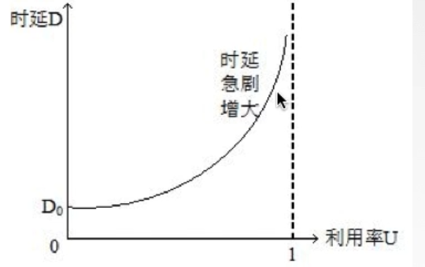
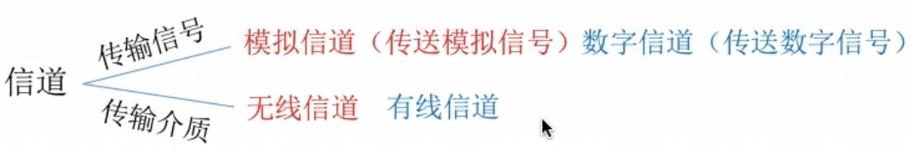
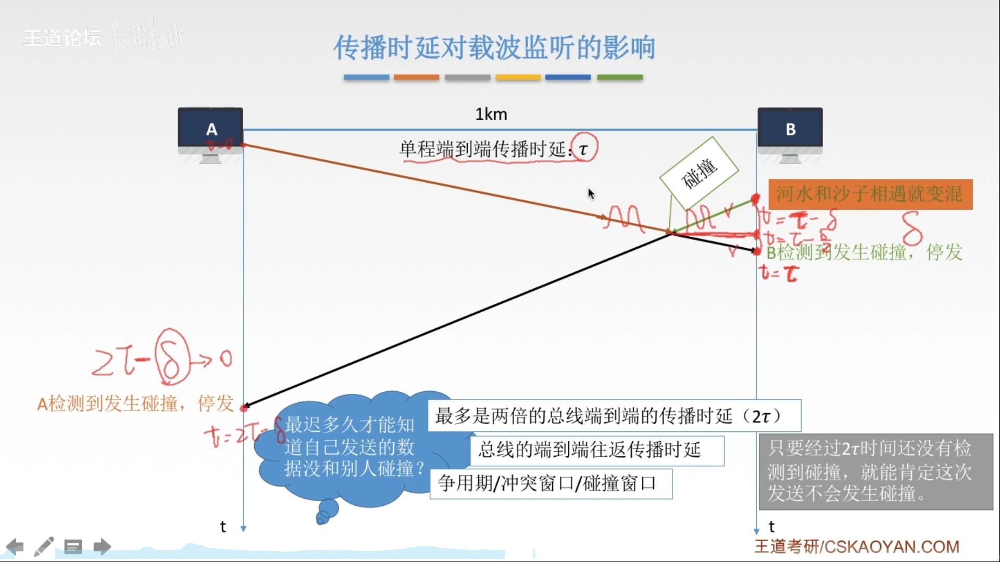
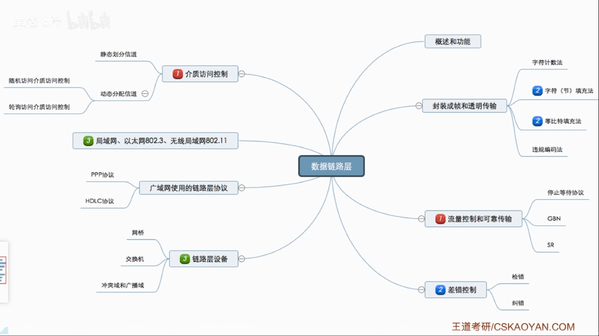
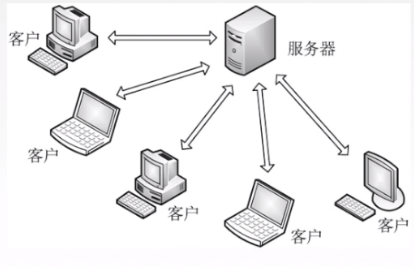
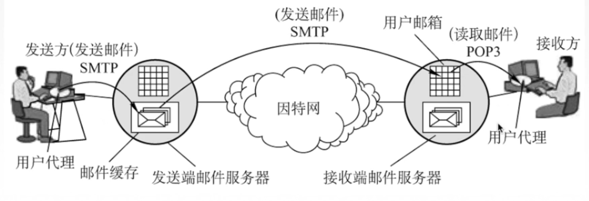

[TOC]

# 概述

## 计算机网络的组成

1.组成部分：硬件、软件、协议

2.工作方式

​	边缘部分：用户直接使用（C/S方式，P2P方式）

​	核心部分：为边缘部分服务

3.功能组成

通信子网：实现数据通信

资源子网：实现资源共享/数据处理

## 分类

1.按分布范围分

广域网WAN（交换技术）     城域网MAN    局域刚WAN（广播技术）   个人区域网PAN

2.按使用者分

共用网：中国电信等

专用网：军队、政府等

3按交换技术

分电路交换    报文交换    分组交换

4.按拓扑结构分

网状型通常用于广域网

5.按传输技术分 

广播式网络   :共享公共通信信道 

点对点网络   ：使用分组存储转发和路由选择机制

## 小结

## 标准化工作

**标准分类**

法定标准：由权威机构制定的正式的、合法的标准OS

事实标准：某些公司的产品在竞争中占据了主流, TCP/IP时间长了,这些产品中的协议和技术就成了标准

RFC (Request For Comments)

**相关组织**

国际标准化组织ISO：参考模型、HDLC协议

国际电信联盟ITU   ：制定通信规则

国际电气电子工程师协会IEEE：学术机构、IEEE802系列标准、5G

Internet工程任务组IETF    负责因特网相关标准的制定RFC XXXX

## 性能指标

### 速率

速率即数据率或称数据传输率或**比特率**。

比特1/0位

连接在计算机网络上的**主机**在数字信道上传送数据**位数的速率**

单位是b/s,kb/s,Mb/s,Gb/s,Tb/s

存储容量1Byte（字节）=8bit比特

### 带宽

(1)“带宽”原本指某个信号具有的频带宽度,即最高频率与最低频率之差,单位是赫兹(Hz)

(2)计算机网络中,带宽用来表示网络的通信线路传送数据的能力,通常是指单位时间内从网络中的某一点到另一点所能通过的“**最高数据率**”。单位是“比特每秒”,b/s,kb/s,Mb/s,Gb/s

母鸡生蛋速度变快了，蛋下落的速度不会变

### 吞吐量

表示在**单位时间**内通过**某个网络(或信道、接口)**的数据量。单位b/s,kb/s,Mb/s等。吞吐量受网络的带宽或网络的额定速率的限制。

### 时延

指数据(报文/分组/比特流)从网络(或链路)的一端传送到另一端所需的时间。也叫延迟或迟延。单位是s。

分为：

| 名称     | 描述                                         | 计算公式                          |
| -------- | -------------------------------------------- | --------------------------------- |
| 发送时延 | 数据从主机到信道上所用的时间                 | 发送的数据长度/发送速率           |
| 传播时延 | 数据在信道上传播所花费的时间                 | 信道长度/电磁波在信道上传播的速率 |
| 排队时延 | 数据在路由器前等待前面数据处理的时间         | 无计算方式                        |
| 处理时延 | 数据在路由器中处理需求的时间（检错，找出口） | 无计算方式                        |

计算时，这四种时延加起来

使用高速链路(提高网速)，**只能减小发送时延**，无法减少其他三个时延

### 时延带宽积

公式：时延带宽积=**传播时延**x带宽

意思是**链路上有多少比特的数据**

时延带宽积又称为以比特为单位的链路长度。“某段链路现在有多少比特”。

容量

### 往返时间RTT

从发送方发送数据开始，到接收方确认收到为止所花费的时间（接收方收到数据后立即发送确认）
RTT=**传播时延**x2+处理时间(有时可能直接忽略)

RTT越大,在收到确认之前,可以发送的数据越多。

### 利用率

**信道利用率**

信道利用率=有数据通过**时间**/(有+无数据通过**时间**)

**网络利用率**

网络利用率=所有信道利用率加权求平均值

时延和利用率的关系图

## 分层结构

###  为什么要分层，分层要做什么

（1）发起通信的计算机必须将数据通信的通路进行**激活**。
（2）要告诉网络如何识别目的主机。
（3）发起通信的计算机要查明目的主机是否开机，并且与网络连接正常。
（4）发起通信的计算机要弄清楚，对方计算机中文件管理程序是否已经做好准备工作。
（5）确保差错和意外可以解决。

### 分层的基本原则

1.各层之间相互独立,每层只实现一种相对独立的功能。

2.每层之间界面自然清晰,易于理解,相互交流尽可能少。

3.结构上可分割开。每层都采用最合适的技术来实现

4.保持下层对上层的独立性,上层单向使用下层提供的服务

5.整个分层结构应该能促进标准化工作。

### 正式认识分层结构

网络体系结构是从功能上描述计算机网络结构。

计算机网络体系结构简称网络体系结构是分层结构。

每层遵循某个/些网络协议以完成本层功能

计算机网络体系结构是计算机网络的各层及其协议的集合

第n层在向n+1层提供服务时,此服务不仅包含第n层本身的功能,还包含由下层服务提供的功能。

仅仅在相邻层间有接口,且所提供服务的具体实现细节对上一层完全屏蔽。

体系结构是抽象的,而实现是指能运行的一些软件和硬件。

## 参考模型

分层结构分类：7层OSI参考模型（法定标准）      4层TCP/IP参考模型（事实标准）

===》5层的系统结构（学习用）

### OSI参考模型

| 名称       | 英文               | 作用                                                         |
| ---------- | ------------------ | ------------------------------------------------------------ |
| 应用层     | Application Layer  | 直接为用户的应用进程（例如电子邮件、文件传输和终端仿真）提供服务。如HTTP、SMTP、FTP、DNS等（所有能和用户交互产生网络流量的程序） |
| 表示层     | Presentation Layer | 把数据转换为能与接收者的系统格式兼容并适合传输的格式，即让两个系统可以交换信息。功能：数据格式变换（比如二进制变换到图片），数据加密解密，数据压缩和恢复 |
| 会话层     | Session Layer      | 负责在数据传输中设置和维护计算机网络中两台计算机之间的通信连接。向表示层实体/用户进程提供建立连接并在连接上有序地传输数据。这是会话,也是**建立同步(SYN)**。功能：建立、管理、终止会话,使用校验点可使会话在通信失效时从校验点/同步点继续恢复通信,实现数据同步(传输大文件）ADSP、ASP。 |
| 传输层     | Transport Layer    | 负责**主机中两个进程**的通信,即端到端的通信。传输单位是报文段或用户数据报。负责端到端通讯，**可**靠传输，不可靠传输 ，**差**错控制，**流**量控制，复**用**分用（巧记：可差的也能留用？）。TCP、UDP |
| 网络层     | Network Layer      | 负责选择路由最佳路径，规划IP地址(ipv4和ipv6变化只会影响网络层)，拥塞控制。主要任务是把分组从源端传到目的端,为分组交换网上的不同主机提供通信服务。网络层传输单位是数据报。路由选择（最佳路径），流量控制，差错控制，拥塞控制。IP、IPX、ICMP、IGMP、ARP、RARP、OSPF |
| 数据链路层 | Data Link Layer    | 主要任务是把网络层传下来的数据报**组装成帧**。数据链路层/链路层的传输单位是**帧**。功能：成帧，差错控制（帧错+位错），流量控制，访问（接入）控制。SDLC、HDLC、PPP、STP |
| 物理层     | Physical Layer     | 主要任务是在物理媒体上实现比特流的透明传输。物理层传输单位是比特。**透明传输**:指不管所传数据是什么样的比特组合都应当能够在链路上传送。功能：定义接口特性，定义传输模式（单工、双工、半双工），定义传输速率，比特同步，比特编码。Rj45、802.3 |

### TCP/IP参考模型

### 5层参考模型

## 小结

# 物理层

## 基本概念

物理层解决如何在连接各种计算杋的传输媒体上传输数据比特流,而不是指具体的传输媒体。物理层主要任务:确定与传输媒体接口有关的一些特性→定义标准

**机械特性**  定义物理连接的特性,规定物理连接时所采用的规格、接口形状、引线数目、引脚数量和排列情况。

**电气特性**规定传输二进制位时,线路上信号的**电压范围**、阻抗匹配、传输速率和距离限制等。

**功能特性**指明某条线上出现的**某一电平表示何种意义**,接口部件的信号线的用途。

**规程特性**(过程特性)定义各条物理线路的工作**规程和时序**关系。

## 数据通信基本知识

### 一个数据通信例子

### 相关术语

通信的目的是传送消息。

**数据**:传送信息的实体,通常是有意义的符号序列。

**信号**:数据的电气/电磁的表现,是数据在传输过程中的存在形式。数字信号、模拟信号

**信源**:产生和发送数据的源头。

**信宿**:接收数据的终点。

**信道**:信号的传输媒介。一般用来表示向某一个方向传送信息的介质,因此一条通信线路往往包含条发送信道和一条接收信道。

### 三种通讯方式

| 名称       | 英文        | 定义                                     | 需要信道条数 |
| ---------- | ----------- | ---------------------------------------- | ------------ |
| 单工通信   | Simplex     | 只能一个发一个收                         | 一条         |
| 半双工通信 | half-duplex | 都可以发或者收，但是同一时间只能进行一个 | 两条         |
| 全双工通信 | duplex      | 都可以同时收发数据                       | 两条         |

### 两种数据传输方式

| 传输方式 | 特点                                             |
| -------- | ------------------------------------------------ |
| 串行传输 | 速度慢，省钱，适合**远**距离                     |
| 并行传输 | 速度快，耗钱，适合**近**距离（打印机、扫描仪等） |

### 码元（Symbol）

码元是指用一个**固定时长**的**信号波形(**数字脉冲),代表不同离散数值的基本波形,是数字通信中数字信号的计量单位,这个时长内的信号称为k进制码元,而该时长称为码元宽度。当码元的离散状态有M个时(M大于2),此时码元为M进制码元。

1码元可以**携带多个比特的信息量**。例如,在使用二进制编码时,只有两种不同的码元,一种代表0状态,另一种代表1状态。

### 速率

速率也叫数据率,是指数据的**传输速率**,表示单位时间内传输的数据量。可以用**码元传输速率**和**信息传输速率**表示。

1)码元传输速率:别名码元速率、波形速率、调制速率、符号速率等,忄它表示单位时间内数字通信系统所传输的码元个数(也可称为**脉冲个数或信号变化的次数**),单位是波特(Baud)。1波特表示数字通信系统每秒传输一个码元。这里的**码元可以是多进制的**,也可以是二进制的,但码元速率与进制数无关。
1秒传输多少个码元

2)信息传输速率:别名信息速率、比特率等,表示单位时间内数字通信系统传输的二进制码元个数(即比特数)单位是比特/秒(b/s)。1s传输多少个比特

关系:若一个码元携带nbit的信息量,则 M Baud的码元传输速率所对应的信息传输速率为M×nbit/s。带宽:表示在单位时间内从网络中的某一点到另一点所能通过的“**最高数据率**”,常用来表示网络的通信线路所能传输数据的能力。单位是b/s。

**波特（Baud）**

1波特=1秒传输多少个码元

### 练习

某一数字通信系统传输的是四进制码元,4s传输了8000个码元,求系统的码元传输速率是多少?信息传输速率是多少?若另一通信系统传输的是十六进制码元,6s传输了7200个码元求他的码元传输速率是多少?信息传输速率是多少?并指出哪个系统传输速率快?

2000Baud,4000b/s;1200Baud,4800b/s;十六进制更快

四进制码元系统

码元传输速率就是8004=2000Baud,信息传输速率就是20000g24=4000bit/s

十六进制码元系统

码元传输速率就是7200/6=1200Baud,信息传输速率就是1200*og216=4800bti/s

系统传输的是**比特流**,通常比较的是信息传输速率,所以传输十六进制码元的通愔系统传输速率较快,如果用该系统去传输四进制码元会有更高的码元传输速率。

### 奈式准则（Nyquist）

**奈氏准则**(奈奎斯特定理):在理想低通(无噪声,带宽受限)条件下,为了避免码间串扰,极限码元传输速率为2 W Baud,w是信道带宽,单位是Hz。

**只有这两个公式这带宽才用Hz**

1.在任何信道中,**码元传输的速率是有上限的**。若传输速率超过此上限,就会出现严重的码间串扰问题,使接收端对码元的完全正确识别成为不可能

2信道的频带越宽(即能通过的信号高频分量越多),就可以用更高的速率进行码元的有效传输。

3.奈氏准则给出了码元传输速率的限制,但并没有对信息传输速率给出限制

4.由于码元的传输速率受奈氏准则的制约,所以要提高数据的传输速率,就必须设法使每个码元能携带更多个比特的信息量,这就需要采用多元制的调制方法。

### 香农定理（Shannon）

是在**有噪声的信道中**得出的结论

噪声存在于所有的电子设备和通信信道中。由于噪声随机产生,它的瞬时值有时会很大,因此噪声会使接收端对码元的判决产生错误。但是噪声的影响是相对的,若信号较强,那么噪声影响相对较小。因此,**信噪比**就很重要

信噪比=信号的平均功率/噪声的平均功率,常记为S/N,并用分贝(dB)作为度量单位,即:

香农定理:在带宽受限且有噪声的信道中,为了不产生误差,信息的数据传输速率有上限值。

1.信道的带宽或信道中的信噪比越大,则信息的极限传输速率就越高。

2对一定的传输带宽和一定的信噪比,信息传输速率的上限就确定了。

3只要信息的传输速率低于信道的极限传输速率,就一定能找到某种方法来实现无差错的传输。

4香农定理得出的为极限信息传输速率,实际信道能达到的传输速率要比它低不少。

5从香农定理可以看出,若信道带宽w或信噪比S/N没有上限(不可能),那么信道的极限信息传输速率也就没有上限

计算取最小值8000b/s

## 编码和调制

###  基带信号和宽带/带通信号

**信道**:信号的传输媒介。一般用来表示向某一个方向传送信息的介质,因此一条通信线路往往包含条发送信道和一条接收信道。

传输信号：模拟信道(传送模拟信号)数字信道(传送数字信号)

传输介质：无线信道 有线信道

信道上传送的信号：

**基带信号**：将**数字信号**1和o直接用两种不同的电压表示,再送到数字信道上去传输(基带传输)**来自信源的信号**,像计算机输出的代表各种文字或图像文件的数据信号都属于基带信号。基带信号就是发出的**直接表达了要传输的信息的信号**,比如我们说话的声波就是基带信号。

**宽带信号**：将基带信号进行调制后形成的频分复用模拟信号,再传送到**模拟信道**上去传输(宽带传输）把基带信号经过**载波调制**后,把信号的**频率范围搬移**到**较高的频段**以便在信道中传输(即仅在一段频率范围内能够通过信道)。

在传输距离较近时,计算机网络采用**基带传输**方式(近距离衰减小,从而信号内容不易发生变化)

在传输距离较远时,计算机网络采用**宽带传输**方式(远距离衰减大,即使信号变化大也能最后过滤出来基带信号)

### 编码与调制

**编码：**数据---->数字信号

**调制**：数据---->模拟信号

数字数据（通过数字发送器）---->数字信号  编码

数字数据（通过调制器）---->模拟信号  调制

模拟数据（通过PCM编码器）---->数字信号  编码

模拟数据（通过放大器调制器）---->模拟信号  调制

### 数字数据编码为数字信号

(1)非归零编码【NRz】

(2)曼彻斯特编码

将一个码元分成两个相等的间隔,前一个间隔为低电平后一个间隔为高电平表示码元1;码元0则正好相皮。也可以采用相反的规定。该编码的特点是在每一个码元的中间出现电平跳变,位中间的跳变既作时钟信号(可用于同步)又作数据信号,但它所占的频带宽度是原始的基带宽度的两倍。每一个码元都被调成两个电平,所以数据传输速率只有调制速率的1/2

(3)差分曼彻斯特编码

**同1异0**常用于局域网传输,其规则是:若码元为1,则前半个码元的电平与上一个码元的后半个码元的电平相同,若为0,则相反。该编码的特点是,在每个码元的中间,都有一次电平的跳转,可以实现自同步,且抗干扰性强于曼彻斯特编码。

(4)归零编码【RZ】

(5)反向不归零编码【NRz】

(6)4B/5B编码

比特流中插入额外的比特以打破连串的0或1,就是用5个比特来编码4个比特的数据,之后再传给接收方,因此称为4B/5B。编码效率为80%。

### 数字数据调制为模拟信号

数字数据调制技术在发送端将数字信号转换为模拟信号,而在接收端将模拟信号还原为数字信号,分别对应于调制解调器的调制和解调过程

**调幅+调相(QAM)**某通信链路的波特率是1200Baud,采用4个相位,每个相位有4种振幅的QAM调制技术,则该链路的信息传输速率是多少?4800b/s

### 模拟数据编码为数字信号

计算机内部处理的是二进制数据,处理的都是**数字音频**,所以需要将模拟音频通过采样、量化转换成有限个数字表示的离散序列(即实现音频数字化)。

最典型的例子就是对音频信号进行编码的脉码调制(**PCM**),在计算机应用中,能够达到**最高保真水平**的就是PCM编码,被广泛用于素材保存及音乐欣赏,CD、DVD以及我们常见的WA文件中均有应用。它主要包括三步:抽样、量化、编码。

1.**抽样**:对模拟信号周期性扫描,把时间上连续的信号变成时间上离散的信号。为了使所得的离散信号能无失真地代表被抽样的模拟数据,要使用**采样定理**进行采样:**采样频率>=2信号最高频率**

2.**量化**:把抽样取得的电平幅值按照一定的分级标度转化为对应的数字值,并取整数,这就把连续的电平幅值转换为离散的数字量

3.**编码**:把量化的结果转换为与之对应的二进制编码。

### 模拟数据调制为模拟信号

为了实现传输的有效性,可能需要较高的频率。这种调制方式还可以使用频分复用技术,充分利用带宽资源。在电话机和本地交换机所传输的信号是采用模拟信号传输模拟数据的方式;模拟的声音数据是加载到模拟的载波信号中传输的

## 物理层传输介质

传输介质也称传输媒体/传输媒介,它就是数据传输系统中在发送设备和接收设备之间的**物理通路**。

**传输媒体并不是物理层。**

传输媒体在物理层的下面,因为物理层是体系结构的第一层,因此有时称传输媒体为0层。在传输媒体中传输的是信号,但传输媒体并不知道所传输的信号代表什么意思。但物理层规定了**电气特性**,因此能够识别所传送的比特流。

物理层是傻瓜,传输媒体连傻瓜都不如

| 导向性传输介质       | 电磁波沿着固体媒介（铜线or光纤）被导向传播 |
| -------------------- | ------------------------------------------ |
| **非导向性传输介质** | **自由空间，如真空、空气，水等等**         |

### 导向性传输介质-双绞线

双绞线是古老、又最常用的传输介质,它由两根采用一定规则并排绞合的、相互绝缘的铜导线组成。

为了进一步提髙抗电磁干扰能力,可在双绞线的外面再加上一个由金属丝编织成的屏蔽层,这就是屏蔽双绞线(STP),无屏蔽层的双绞线就称为非屏蔽双绞线(UTP)。

双绞线价格**便宜**,是最常用的传输介质之一,在局域网和传统电话网中普遍使用。模拟传输和数字传输都可以使用双绞线,其通信距离一般为几公里到数十公里。距离太远时,对于**模拟传输**,要用**放大器**放大衰减的信号;对于**数字传输**,要用**中继器**将失真的信号整形。

### 导向性传输介质-同轴电缆

同轴电缆由**导体铜质芯线、绝缘层、网状编织屏蔽层和塑料外层**构成。按特性阻抗数值的不同,通常将同轴电缆分为两类:50Ω同轴电缆和75Ω同轴电缆。其中,50Ω同轴电缆主要用于传送基带数字信号,又称为**基带同轴电缆**,它在局域网中得到广泛应用;75Ω同轴电缆主要用于传送宽带信号,又称为**宽带同轴电缆**,它主要用于有线电视系统。

同轴电缆∨双绞线

由于外导体屏蔽层的作用,同轴电缆**抗干扰特性**比双绞线好,被广泛用于传输较高速率的数据,其传输距离更远,但价格较双绞线**贵**。

### 导向性传输介质-光纤

光纤通信就是利用光导纤维(简称光纤)传递光脉冲来进行通信。有**光脉冲**表示1,无光脉冲表示0。而可见光的频率大约是10^8MHz,因此光纤通信系统的**带宽远远大于**目前其他各种传输媒体的带宽

光纤在发送端有光源,可以采用发光二极管或半导体激光器,它们在电脉冲作用下能产生出光脉冲;在接收端用光电极管做成光检测器,在检测到光脉冲时可还原出电脉冲。

光纤主要由**纤芯(实心的!)**和**包层**构成,光波通过纤芯进行传导,包层较纤芯有较低的折射率。当光线从高折射率的介质射向低折射率的介质时,其折射角将大于入射角。因此,如果入射角足够大,就会出现**全反射**,即光线碰到包层时候就会折射回纤芯、这个过程不断重复,光也就沿着光纤传输下去。

超低损耗，传送超远距离

光纤的特点:

1传输损耗小,中继距离长,对远距离传输特别经济

2抗雷电和电磁干扰性能好。

3无串音干扰,保密性好,也不易被窃听或截取数据。

4体积小,重量轻。

### 非导向性传输介质

## 物理层设备

### 中继器

诞生原因:由于存在损耗,在线路上传输的信号功率会逐渐衰减,衰减到一定程度时将造成信号失真,因此会导致接收错误。

**中继器的功能**:对信号进行**再生和还原,**对衰减的信号进行放大,保持与原数据相同,以增加信号传输的距离,延长网络的长度。

**中继器的两端**:两端的网络部分是网段,而不是子网,适用于完全相同的**两类**网络的互连,且两个网段速率要相同。

中继器只将任何电缆段上的数据发送到另一段电缆上,它仅作用于信号的电气部分,并不管数据中是否有错误数据或不适于网段的数据

两端可连相同媒体,也可连不同媒体

中继器两端的网段一定要是同一个协议。(中继器不会存储转发,傻)

**5-4-3规则**:网络标准中都对信号的延迟范围作了具体的规定,因而中继器只能在规定的范围内进行,否则会网络故障。

### 集线器（多口中继器）

集线器是个大的冲突域，同时**只能有两个设备进行通讯**，只会传输信号，没有智能。

**再生,放大信号**

**集线器的功能**:对信号进行再生放大转发,对衰减的信号进行放大,接着转发到其他所有(除输入端口外)处于工作状态的端口上,以增加信号传输的距离,延长网络的长度。不具备信号的定向传送能力,是一个共享式设备

# 数据链路层

## 1.功能概述

数据链路层在物理层提供服务的基础上**向网络层提供服务**,其最基本的服务是将源自网络层来的数据可靠地传输到相邻节点的目标机网络层。其主要作用是**加强物理层传输原始比特流的功能**,将物理层提供的可能出错的物理连接改造成为**逻辑上无差错的数据链路**,使之对网络层表现为一条无差错的链路。

## 2.封装成帧和透明传输

**封装成帧**就是在一段数据的前后部分添加首部和尾部,这样就构成了一个帧。接收端在收到物理层上交的比特流后,就能根据首部和尾部的标记,从收到的比特流中识别帧的开始和结束。

首部和尾部包含许多的控制信息,他们的一个重要作用:**帧定界**(确定帧的界限)。

**帧同步**:接收方应当能丛接收到的二进制比特流中区分出帧的起始和终止。

**组帧的四种方法**:1字符计数法,2字符(节)填充法,3.零比特填充法,4.违规编码法。

**透明传输**

透明传输是指不管所传数据是什么样的比特组合,都应当能够在链路上传送。因此,链路层就“看不见”有什么妨碍数据传输的东西。

当所传数据中的比特组合恰巧与某一个控制信息完全一样时,就必须采取适当的措施,使收方不会将这样的数据误认为是某种控制信息。这样才能保证数据链路层的传输是透明的

### 透明传输的应用

#### 字符计数法

帧首部使用一个计数字段(第一个字节,八位)来标明帧内字符数。

痛点:鸡蛋装在一个篮子里了。

#### 字符填充法

解决：在数据部分中的控制字符前加个转义字符，这一过程是数据链路层负责添加的

发送端填充转移字符，接收端再去掉转移字符

#### 零比特填充法

#### 违规编码法

因为曼彻斯特编码不使用高-高，低-低来表示，所以如果使用高-高，低-低来表示帧起始和终止就**不会与数据冲突**

可以用“高-高”,“低低”来定界帧的起始和终止由于字节计数法中 Count字段的脆弱性(其值若有差错将导致灾难性后果)及字符填充实现上的复杂性和不兼容性,目前较普遍使用的帧同步法是**比特填充和违规编码法**。

## 3.差错控制（检错编码）

数据链路层的差错检测的是**比特**的错误

### 差错是什么，从哪来的

概括来说,传输中的差错都是由于噪声引起的。

全局性1.由于线路本身电气特性所产生的随机噪声(热噪声),是信道固有的,随机存在的。
解决办法:提高信噪比来减少或避免干扰。(对传感器下手)

局部性2.外界特定的短暂原因所造成的冲击噪声,是产生差错的主要原因。
解决办法:通常利用编砥技术来解决。

**差错**

- 位错  比特位出错，1变成0，0编程1 
- 帧错[#1]-[#2]-[#3]
  - 丢失：收到[#1]-[#3],2丢掉了
  - 重复：收到[#1]-[#2]-[#2]-[#3]
  - 失序：[#1]-[#3]-[#2]

链路层为网络层提供服务:

通信质量好，有线传输链路：

- 无确认无连接服务  

通信质量差的无线传输链路

- 有确认无连接服务

- 有确认面向连接服务

**为什么要在数据链路层进行差错控制？**

因为错误可以尽早发现，不会让一个错误的数据包发送了很长时间到达最终目的地之后才被发现，从而导致网络资源的浪费

**差错控制**（比特错）

- 检错编码
  - 奇偶校验码
  - 循环冗余码CRC
- 纠错编码
  - 海明码

数据链路层编码和物理层的数据编码与调制不同。**物理层编码**针对的是**单个比特**,解决传输过程中比特的同步等问题,如曼彻斯特编码。而数**据链路层**的编码针对的是**一组比特**,它通过冗余码的技术实现一组二进制比特串在传输过程是否出现了差错。

在数据发送之前,先按某种关系**附加**上一定的**冗余位**,构成一个符合某一规则的码字后再发送。当要发送的有效数据变化时,相应的冗余位也随之变化,使码字遵从不变的规则。接收端根据收到码字是否仍符合原规则,从而判断是否出错。

### 检错编码-奇偶校验码

如果一个字符S的ASCII编码从低到高依次为1100101,采用奇校验,在下述收到的传输后字符中,哪种错误不能检测?

A.11000011    B.11001010    C.11001100   D.11010011

1100101前面再加上1，变成5个1，这就是奇校验，A  B   C都只有4个1，就检测出错误，D还是5个1不知道有没有错

缺点：只能检测出1，3，5，7…等等奇位数错误，检测成功率位50%

### 检错编码-循环冗余码CRC

例:要发送的数据是1101011011,采用CRC校验,生成多项式是10011,那么最终发送的数据应该是?

**最终发送的数据：要发送的数据+帧检验序列FCS**

在数据链路层仅仅使用循环冗余检验CRC差错检测技术,只能做到对帧的无差错接收,即“犀是接收端数据链路层接受的帧,我们都能以非常接近于1的概率认为这些帧在传输过程中没有产生差错”。接收端丢弃的帧虽然曾收到了,但是最终还是因为有差错被丢弃。“凡是接收端数据链路层接收的帧均无差错”。

“可靠传输”:数据链路层发送端发送什么,接收端就收到什么。

链路层使用CRC检验,能够实现无比特差错的传输,但这还不是可靠传输。

### 纠错编码-海明码

海明码:**发现双**比特错,**纠正单**比特错。

工作原理：动一发而牵全身

**工作流程**

- 确认校验码位数r
- 确定校验码和数据的位置
- 求出校验码的值
- 检测并纠错

#### 第一步 确认校验码位数r

####  第二步 确定校验码和数据的位置

注释：
1.为什么是10为数据位？因为4位校验码+6位信息位=10位
2.校验码放到2的几次方的位置，其他的地方按顺序放已知的信息位

假设这4为校验码分别为P~1~,P~2~,P~3~,P~4~；数据从左到右为D~1~,D~2~,......,D~6~

P~1~,P~2~,P~3~,P~4~放到2的几次方位置，D~1~,D~2~,......,D~6~按序把空填满

| 数据位 | 1    | 2    | 3    | 4    | 5    | 6    | 7    | 8    | 9    | 10   |
| ------ | ---- | ---- | ---- | ---- | ---- | ---- | ---- | ---- | ---- | ---- |
| 代码   | P~1~ | P~2~ | D~1~ | P~3~ | D~2~ | D~3~ | D~4~ | P~1~ | D~5~ | D~6~ |
| 实际值 |      |      | 1    |      | 0    | 1    | 1    |      | 0    | 1    |

####  第三步 求出校验码的值

| 二进制 | 0001 | 0010 | 0011 | 0100 | 0101 | 0110 | 0111 | 1000 | 1001 | 1010 |
| ------ | ---- | ---- | ---- | ---- | ---- | ---- | ---- | ---- | ---- | ---- |
| 数据位 | 1    | 2    | 3    | 4    | 5    | 6    | 7    | 8    | 9    | 10   |
| 代码   | P~1~ | P~2~ | D~1~ | P~3~ | D~2~ | D~3~ | D~4~ | P~1~ | D~5~ | D~6~ |
| 实际值 |      |      | 1    |      | 0    | 1    | 1    |      | 0    | 1    |

注释
1.先是通过二进制位确定有几位。本题中因为最大位10的二进制是1010，所以是4为，将其标注
2.然后从p1开始看，看p1的二进制位的数值和所有信息位的对应位置的数值是否相同，然后找出来这些位
这里有点难理解，这里以p1为例辅助理解，这里找出来的就是P1,D1,D2,D4,D5

#### 第四步 检错并纠错

**小结**

## 4.⭐数据链路层的流量控制和可靠传输

**较髙的发送速度**和**较低的接收能力**的不匹配,会造成传输出错,因此流量控制也是数据链路层的一项重要工作。

数据链路层的流量控制是点对点的,而传输层的流量控制是端到端的。

**数据链路层**流量控制手段:接收方收不下就不回复确认。

**传输层**流量控制手段:接收端给发送端一个窗口公告。

### 流量控制的方法

- 停止等待协议

  每发送完一个帧就停止发送,等待对方的确认,在收到确认后再发送下一个帧。

  发送窗口大小=1，接收窗口大小=1

  ACK

  

- 滑动窗口协议
  - 后退N帧协议（GBN）

    发送窗口大小>1，接收窗口大小=1

  - 选择重传协议（SR）

    发送窗口大小>1，接收窗口大小>1

可靠传输:发送端发啥,接收端收啥。

流量控制:控制发送速率,使接收方有足够的缓冲空间来接收每一个帧。

滑动窗口解决：

- 流量控制（收不下就不给确认，想发也发不了）
- 可靠传输（发送方自动重传）

### 停止等待协议

1.为什么要有停止等待协议?

除了**比特出差错**,底层信道还会出现**丢包**问题。

丢包:物理线路故障、设备故障、病毒攻击、路由信息错误等原因,会导致数据包的丢失。

2.研究停等协议的前提?

虽然现在常用全双工通信方式,但为了讨论问题方便,仅考虑一方发送数据(发送方),一方接收数据(接收方)。
因为是在讨论可靠传输的原理,所以并不考虑数据是在哪一个层次上传送的。
“停止-等待”就是每发送完一个分组就停止发送,等待对方确认,在收到确认后再发送下一个分组。

3.停等协议有几种应用情况?

无差错情况&有差错情况

#### 停止等待协议的**无差错**情况

#### 停止等待协议的**有差错**情况

**1.数据帧丢失或检测到帧出错**

**2.ACK丢失**

**3.ACK迟到**

**停止等待协议的特点**
1.简单
2.信道利用率低。大部分时间数据都在路上，发送方很长时间闲置，资源浪费

**信道利用率**

### 后退N帧协议（GBN）

因为停止等待协议太浪费时间了，所以尝试采用GBN，发送连续多个数据帧，以增大信道利用率
注释：
累计确认：就是收到一个确认帧，那么**它和它之前的所有帧**都默认已收到，反之，如果某个确认帧没收到，那么**它和它之后的所有帧**都默认丢失（即使收到了也丢掉），进行重传

**后退N帧协议中的滑动窗口**

**GBN发送方必须响应的三件事**

1.上层的调用

上层要发送数据时,发送方先检査发送窗口是否已满,如果**未满**,则产生一个帧并将其发送;如果窗口**已满,**发送方只需将数据返回给上层,暗示上层窗口已满。上层等一会再发送。(实际实现中,发送方可以缓存这些数据,窗口不满时再发送帧

2.收到了一个ACK

GBN协议中,对n号帧的确认采用**累积确认**的方式,标明接收方已经收到n号帧和它之前的全部帧。

3.超时事件

协议的名字为后退N帧/回退N帧,来源于出现丢失和时延过长帧时发送方的行为。就像在停等协议中一样,定时器将再次用于恢复数据帧或确认帧的丢失。如果岀现超时,发送方重传所有已发送但未被确认的帧。

**GBN接收方要做的事**

如果正确收到n号帧,并且按序,那么接收方为n帧发送一个ACK,并将该帧中的数据部分交付给上层。

其余情况都丢弃帧,并为最近按序接收的帧重新发送ACK。接收方无需缓存仼何失序帧,只需要维护一个信息: expected seq num(下一个按序接收的帧序号）

**运行中的GBN**

出现超时：发送方重传所有已发送但未被确认的帧

发送窗口不能无限大，与使用的编号的比特数有关
很简单，就是1比特编号0和1,同理2比特编号0-3，如果用1比特编号，却要4个窗口长度，那么窗口内数据编号都编不过来，直接乱套了

**GBN协议重点总结**

1.累积确认（偶尔捎带确认）

2.接收方只按顺序接收帧,不按序无情丢弃

3.确认序列号最大的、按序到达的帧

4.发送窗口最大为201,接收窗口大小为1

练习

数据链路层采用了后退N帧(GBN)协议,发送方已经发送了编号为0~7的帧。当计时器超时时,若发送方只收到0、2、3号帧的确认,则发送方需要重发的帧数是()

A.2	B.	3	**C.4**	D.5

优缺点：

因连续发送数据帧而提高了信道利用率

在重传时必须把原来已经正确传送的数据帧重传,是传送效率降低。

### 选择重传协议（SR）

为了解决GBN的缺点，我们打算尝试只重传错误的帧，这样的话就不用浪费资源吧已经收到的帧再重传一次了。和GBN相比，两者都有窗口了，和GBN的区别其实就是做了一个数据缓存，已经收到的帧不用扔了，等待之前因意外丢失的帧收到的时候确认即可，但是只能缓存窗口尺寸内的包含的帧（PS，缓存咋可能无限大）
SR运行过程
注释：2帧丢失之后仍然在发送，但是2帧丢失之后只是缓存，并没有移动窗口，直至最后2帧收到后一次性确认2-5帧

**可不可以只重传出错的帧?**

解决办法:设置**单个确认**,同时加大接收窗口,设置**接收缓存**,缓存乱序到达的帧。

**选择重传协议中的滑动窗口**

**SR发送方必须要响应的三件事**

1.上层的调用

从上层收到数据后,SR发送方检查下一个可用于该帧的序号,如果序号位于发送窗口内,则发送数据帧;否则就像GBN一样,要么将数据**缓存**,要么**返回给上层**之后再传输。

2.收到了一个ACK

如果收到ACK,加入该帧序号在窗口内,则SR发送方将那个被确认的帧标记为已接收。如果该帧序号是窗口的下界(最左边第一个窗口对应的序号),则窗口向前移动到具有最小序号的未确认帧处。如果窗口移动了并且有序号在窗口内的未发送帧,则发送这些帧。

3.超时事件

每个帧都有自己的定时器,一个超时事件发生后**只重传一个帧**。

**SR接收方要做的事**

来者不拒(窗口內的帧)

SR接收方将确认一个正确接收的帧而**不管其是否按序**。失序的帧将被**缓存**,并返回给发送方一个该帧的确认帧【**收谁确认谁**】,直到所有帧(即序号更小的帧)皆被收到为止,这时才可以将一批帧按序交付给上层,然后**向前移动滑动窗口**。

其他情况，忽略该帧

**运行中SR**

**滑动窗口的长度**

小结

1.对数据帧逐一确认,收一个确认一个

2.只重传出错帧

3.接收方有缓存

4.W~Tmax~=W~Rmax~=2^n-1^

习题

数据链路层采用了选择重传(SR)协议,发送方已经发送了编号为0~3的帧。现已收到1号帧的确认,而0、2号帧依次超时,则发送方需要重传的帧个数是()

**A.2**    B.3    C.4   D.5

## 5.介质访问控制技术

**传输数据使用的两种链路**

- 点对点链路

  两个相邻节点通过一个链路相连,没有第三者     应用:PPP协议,常用于**广域网**。

- 广播式链路

  所有主机共享通信介质。

  应用:早期的总线以太网、无线局域网,常用于**局域网**。

  典型拓扑结构:总线型、星型(逻辑总线型)

**介质访问控制**

介质访问控制的内容就是,采取一定的措施,使得两对节点之间的通信不会发生互相干扰的情况

- 静态划分通道----信道划分介质访问控制
  - 频分多路复用FDM
  - 时分多路复用TDM
  - 波分多路复用WDM
  - 码分多路复用CDM
- 动态划分通道
  - 轮询访问介质访问控制----令牌传递协议
  - 随机访问介质访问控制
    - ALOHA协议
    - CSMA协议
    - **CMA/CD协议**
    - **CSMA/CA协议**

### 5.1信道划分介质访问控制

信道划分介质访问控制:将使用介质的每个设备与来自同一信道上的其他设备的通信隔离开,把**时域和频域**资源合埋地分配给网络上的设备。

#### 5.1.1频分多路复用FDM

用户在分配到一定的频带后,在通信过程中自始至终都占用这个频带。频分复用的所有用户在同样的时间占用不同的带宽(频率带宽)资源.充分利用传输介质带宽,系统效率较高;由于技术比较成熟,实现也比较容易。

#### 5.1.2时分复用

TDM帧是在物理层传送的比特流所划分的帧,标志一个周期

将时间划分为一段段等长的时分复用帧(TDM帧)。每一个时分复用的用户在每一个TDM帧中占用**固定序号的时隙**,所有用户轮流占用信道

#### 5.1.3改进的时分复用一一统计时分复用STDM

每一个STDM帧中的时隙数小于连接在集中器上的用户数。各用户有了数据就随时发往集中器的输入缓存,然后集中器按顺序依次扫描输入缓存,把缓存中的输入数据放入STDM帧中,一个STDM帧满了就发出。**STDM帧不是固定分配时隙,而是按需动态分配时隙。**

#### 5.1.4波分多路复用WDM

波分多路复用就是**光的频分多路复用**,在一根光纤中传输多种不同波长(频率)的光信号,由于波长(频率)不同,所以各路光信号互不干扰,最后再用波长分解复用器将各路波长分解出来。

#### 5.1.5码分多路复用CDM

**码分多址**(CDMA)是码分复用的一种方式

1个比特分为多个码片/芯片(chip),每个站点被指定一个唯一的m位的芯片序列。

送1时站点发送芯片序列,发送0时发送芯片序列反码(通常把0写成-1)

如何不打架:多个站点同时发送数据的时候,要求各个站点芯片序列**相互正交**。

如何分离:合并的数据和源站规格化内积。

### 5.2随机访问介质访问控制

所有用户都可以随机发送信息，发送时可以占用全部带宽，理论上个人使用时比静态分配信道的速度更快.

#### 5.2.1ALOHA协议

##### 纯 ALOHA协议

纯 ALOHA协议思想:不监听信道,不按时间槽发送,随机重发。想发就发

纯ALOHA协议缺点：太随性，导致效率低

冲突如何检测?

如果发生冲突,接收方在就会检测出差错,然后不予确认,发送方在一定时间内收不到就判断发生冲突。

冲突如何解决?

超时后等一随机时间再重传。

##### 时隙ALOHA协议

时隙 ALOHA协议的思想:把时间分成若干个相同的时间片,所有用户在时间片开始时刻同步接入网络信道,若发生冲突,则必须等到下一个时间片开始时刻再发送。

相对于纯ALOHA协议就是固定了发送的时间（只能在一个时间片的开始），提高了效率

**控制想发就发的随意性**

1.纯 ALOHA比时隙 ALOHA吞吐量更低,效率更低。

2.纯 ALOHA想发就发,时隙 ALOHA只有在时间片段开始时才能发。

#### 5.2.2 CSMA协议

载波监听多路访问协议CSMA( carrier sense multiple access)

CS:载波侦听/滥监听,每一个站在发送数据之前要检测一下总线上是否有其他计算机在发送数据。

当几个站同时在总线上发送数据时,总线上的信号**电压摆动值**将会增大(互相叠加)个站检测到的信号电压摆动值超过一定门限值时,就认为总线上至少有两个站同时在发送数据,表明产生了碰撞,即发生了冲突

MA:多点接入,表示许多计算机以多点接入的方式连接在一根总线上。

**协议思想**:发送帧之前,**监听**信道。

##### 1-坚持CSMA

坚持指的是对于监听信道**忙**之后的坚持。

1-坚持CSMA思想:
如果一个主机要发送消息,那么它先监听信道。
**空闲则直接传输,不必等待。**
**忙则一直监听,直到空闲马上传输。**
如果有冲突(一段时间内未收到肯定回复),则等待一个随机长的时间再监听,重复上述过程。

优点:只要媒体空闲,站点就马上发送,避免了媒体利用率的损失。

缺点:假如有两个或两个以上的站点有数据要发送,冲突就不可避免。

##### 非坚持CSMA

非坚持指的是对于监听信道**忙**之后就不继续监听

非坚持CSMA思想:
如果一个主机要发送消息,那么它先监听信道。
**空闲则直接传输,不必等待。**
**忙则等待一个随机的时间之后再进行监听**

优点:采用随机的重发延迟时间可以减少冲突发生的可能性。
缺点:可能存在大家都在延迟等待过程中,使得媒体仍可能处于空闲状态,媒体使用率降低。

##### p-坚持CSMA

p-坚持指的是对于监听信道**空闲**的处理

p-坚持CSMA思想:
如果一个主机要发送消息,那么它先监听信道。
**空闲则以p概率直接传输,不必等待;概率1-p等待到下一个时间槽再传输。**

优点:既能像非坚持算法那样减少冲突,又能像1-坚持算法那样减少媒体空闲时间的这种方案

缺点：发生冲突后还是要坚持把数据帧发送完,造成了浪费。

##### 三种CSMA对比总结

|          | 1-坚持CSMA   | 非坚持CSMA                     | p-坚持CSMA                                 |
| -------- | ------------ | ------------------------------ | ------------------------------------------ |
| 信道空闲 | 马上发       | 马上发                         | p概率马上发 1-p概率等到下一个时隙在发 |
| 信道忙   | 继续坚持监听 | 放弃监听，等一个随机时间再监听 | 放弃监听，等一个随机时间再监听             |

信道划分介质访问控制( **MAC** Multiple Access Control)协议:

基于**多路复用**技术划分资源。

网络负载重:共享信道效率高,且公平
网络负载轻:共享信道效率低

随机访问MAC协议:用户根据意愿**随机**发送信息,发送信息时可独占信道带宽。网络负载重:产生冲突开销冈络负载轻:共享信道效率高,单个结点可利用信道全部带宽

轮询访问MAC协议/轮流协议/轮转访问MAC协议既要**不产生冲突**,又要发送时**占全部带宽**。

#### 5.2.3 CSMA/CD协议

就是因为链路实际有长短，发送数据需要时间，这个时间内可能就被其他节点当成空闲状态导致发生碰撞
知道自己发生碰撞的最长时间是2τ（两倍的**传播时延**），就是一去一回

载波监听多点接入/碰撞检测CSMA/CD( carrier sense multiple access with collision detection)

CS:载波侦听/监听,每一个站在**发送数据之前**以及**发送数据时**都要检测一下总线上是否有其他计算机在发送数据

MA:多点接入,表示许多计算机以多点接入的方式连接在一根总线上。**总线型网络**

CD:碰撞检测(冲突检测),“**边发送边监听**”,适配器边发送数据边检测信道上信号电压的变化情况,以便判断自己在发送数据时其他站是否也在发送数据。**半双工网络**

**传播时延对载波监听的影响**

**如何确定碰撞后的重传时机**

**最小帧长问题**

A站发了一个很短的帧，但发生了碰撞，不过帧在发送完毕后才检测到发生碰撞，没法停止发送

因为发完了。。

#### 5.2.4 CSMA/CA协议

载波监听多点接入/碰撞避免 CSMA/CA( carrier sense multiple access with collision avoidance)

##### 为什么要有CSMA/CA？

无线局域网

- 无法做到360°全面检测碰撞
- 隐蔽站    当A和C都检测不到信号,认为信道空闲时,同时向终端B发送数据帧,就会导致冲突

##### 工作原理

发送数据前,先检测信道是否空闲。

空闲则发岀**RTS( request to send)**,RS包括发射端的地址、接收端的地址、下一份数据将持续发送的时间等信息;信道忙则等待。

接收端收到RTS后,将响应**CTS( clear to send)**

发送端收到CTS后,开始发送数据帧(同时**预约信道**:发送方告知其他站点自已要传多久数据)

接收端收到数据帧后,将用CRC来检验数据是否正确,正确则响应**ACK帧**

发送方收到ACK就可以进行下一个数据帧的发送,若没有则一直重传至规定重发次数为止(采用**二进制指数退避算法**来确定随机的推迟时间)。

1**.预约信道	2.ACK帧	3.RTS/CTS帧(可选)**

#### 5.2.5 CSMA/CD 与 CSMA/CA的区别

**相同点**:CSMA/CD与 CSMA/CA机制都从属于CSMA的思路,其核心是**先听再说**。换言之,两个在接入信道之前都须要进行监听。当发现信道空闲后,才能进行接入

**不同点**:

1.**传输介质不同**: CSMA/CD用于总线式以太网【有线】,而 CSMA/CA用于无线局域网【无线】

2.**载波检测方式不同**:因**传输介质不同**, **CSMA/CD与 CSMA/CA的检测方式也不同**。 CSMA/CD通过电缆中电压的变化来检测,当数据发生碰撞时,电缆中的电压就会随着发生变化:而 CSMA/CA采用能量检测(ED)、载波检测(CS)和能量载波混合检测三种检测信道空闲的方式

3 .**CSMA/CD检测冲突, CSMA/CA避免冲突**,二者出现冲突后都会进行**有上限的重传**

### 5.3 轮询访问介质访问控制

主要包括两大类，一个是**轮询协议**，另一个是**令牌传递协议**

#### 5.3.1 轮询协议

#### 5.3.2 令牌传递协议

令牌:一个特殊格式的MAC控制帧,不含任何信息。控制信道的使用,确保同一时刻只有一个结点独占信道。**令牌环网无碰撞**

每个结点都可以在一定的时间内(令牌持有时间)获得发送数据的权利,并不是无限制地持有令牌

问题:1令牌开销2.等待延迟3单点故障

应用于令牌环网(物理星型拓扑,逻辑环形拓扑)。采用令牌传送方式的网络常用于**负载较重、通信量较大**的网络中。

注释：在节点之间没有收发数据的需求时，令牌在节点之间循环。
发送数据的流程
》当一个节点需要时就可以获得这个令牌。然后修改这个令牌的状态（空闲->占用）
》再将令牌与数据帧结合，让其在节点构成的环之间流动
》不是目的地的节点收到令牌也不接受，直接略过，目标节点收到信息并复制一份到本地（传输完成），因为是个闭环，所以发送节点最后得到令牌
》最后，发送令牌的节点对令牌的内容进行检查，如果发现数据出错还要重新发一遍
问题基本和轮询协议相同

**小结**

## 6.局域网

### 6.1 局域网的概念

概括：范围大小，速度快，延迟低，节点平等

局域网( Local Area Network):简称**LAN**,是指在某一区域内由多台计算机互联成的计算机组,使用**广播信道**。

特点1:覆盖的地理范围较小,只在一个相对独立的局部范围内联,如一座或集中的建筑群内

特点2:使用专门铺设的传输介质(双绞线、同轴电缆)进行联网,数据传输速率高(10Mb/s~10Gb/s)。

特点3:通信延迟时间短,误码率低,可靠性较高。

特点4:各站为平等关系,共享传输信道。

特点5:多采用分布式控制和广播式通信,能进行广播和组播。

决定局域网的主要要素为:**网络拓扑**,传输介质与**介质访问控制方法**。

#### 6.1.1 局域网的网络拓扑结构

#### 6.1.2 局域网的传播介质

| 局域网     | 常用介质               |
| ---------- | ---------------------- |
| 有线局域网 | 双绞线，同轴电缆，光纤 |
| 无线局域网 | 电磁波                 |

#### 6.1.3 局域网介质访问方法

1.CSMA/CD常用于**总线型局域网**,也用于树型网络

2.**令牌总线**常用于**总线型局域网**,也用于树型网络它是把总线型或树型网络中的各个工作站按一定顺序如按接口地址大小排列形成个逻辑环。只有令牌持有者才能控制总线,才有发送信息的权力

3.**令牌环**用于**环形局域网**,如令牌环网

### 6.2 局域网的分类

1.以太网以太网是应用最为广泛的局域网,包括标准以太网(10Mbps)、快速以太网(100Mbps)、千兆以太网(1000Mbps)和10G以太网,它们都符合lE802.3系列标准规范。逻辑拓扑总线型,物理拓扑是星型或拓展星型。使用 CSMA/CD.

2.令牌环网物理上采用了星形拓扑结构,逻辑上是环形拓扑结构。已是“明日黄花”

3.FDDI网( Fiber distrbuted data interfac)物理上采用了双环拓扑结构,逻辑上是环形拓扑结构。4.ATM网( Asynchronous Transter Mode)较新型的单元交换技术使用53字节固定长度的单元进行交换。

5.无线局域网( Wireless local Area network;WLAN)采用IEEE802.11标准。

### 6.3 IEEE802标准

lEE802系列标准是EE802 LAN/MAN标准委员会制定的局域內、城域网技术标准(1980年2月成立)。其中最广泛使用的有以太网、令牌环、无线局域网等。这一系列标准中的每一个子标准都由委员会中的一个专门工作组负责。

#### EEE802现有标准

IEEE802.1:局域网体系结构、寻址、网络互联和网络
IEEE802.1A:概述和系统结构
IEEE802.1B:网络管理和网络互连
IEEE802.2:逻辑链路控制子层(LLc)的定义。
IEEE802.3.:**以太网介质访问控制协议**( CSMACD)及物理层技术规范2
IEEE802.4:令牌总线网( Token-bus)的介质访问控制协议及物理层技术规范。
IEEE802.5:**令牌环网**( Token-ring)的介质访问控制协议及物理层技术规范。
IEEE802.6:城域网介质访问控制协议DQDB( Distn buted Queue Dual Bus分布式队列双总线)及物理层技术规范。
IEEE802.7:宽带技术咨询组,提供有关宽带联网的技术咨询。
IEEE802.8:**光纤技术咨询组**,提供有关光纤联网的技术咨询。
IEEE802.9:综合声音数据的局域网(ⅣDLAN)介质访问控制协议及物理层技术规范。
IEEE802.10:网络安全技术咨询组,定义了网络互操作的认证和加密方法。
IEEE802.11:**无线局域网**(WLAN)的介质访问控制协议及物理层技术规范。
IEEE802.11,1997年,原始标准(2MbMs,播在24GHz)。
IEEE802.11a,1999年,物理层54 Mbit/s,播在5GHz)
IEEE802.11b,1999年,物理层补充(11Mb/s播在2.4GHz)

#### MAC子层和LLC子层

EE802标准所描述的局域网参考模型只对应OSI参考模型的数据链路层与物理层,它将数据链路层划分为逻辑链路层LLC子层和介质访问控制MAC子层。

LLC负责识别网络层协议,然后对它们进行封装。LLC报头告诉数据链路层一旦帧被接收到时,应当对数据包做何处理。为网络层提供服务:无确认无连接、面向连接、带确认无连接、高速传送。

MAC子层的主要功能包括数据帧的封装/卸装,帧的寻址和识别,帧的接收与发送,链路的管理,帧的差错控制等。MAC子层的存在屏蔽了不同物理链路种类的差异性。

### 6.4以太网

#### 6.4.1 以太网概念

以太网( Ethernet指的是由 Xerox公司创建并由 Xerox、nte|和DEC公司联合开发的**基带总线局域网规范**,是当今现有局域网采用的最通用的通信协议标准。以太网络使用 CSMA/CD(载波监听多路访问及冲突检测)技术。

1.造价低廉(以太网网卡不到100块)

2.是应用最广泛的局域网技术

3.比令牌环网、ATM网便宜,简单

4.满足网络速率要求:10Mb/s~10Gb/s

**以太网两个标准**

DIX Ethernet V2:第一个局域网产品(以太网)规约。

**IEEE802.3**:IEEE802委员会802.3工作组制定的第一个EE的以太网标准。(帧格式有一丢丢改动)

**以太网提供无连接、不可靠的服务**

无连接:发送方和接收方之间无“握手过程”。

不可靠:不对发送方的数据帧编号,接收方不向发送方进行确认,差错帧直接丢弃,差错纠正由高层负责。

以太网只实现无差错接收,不实现可靠传输。

#### 6.4.2 以太网的发展

粗同轴电缆-------->细同轴电缆-------->双绞线+集线器

物理拓扑：总线型--->星型

使用集线器的以太网在逻辑上仍是一个总线网,各站共享逻辑上的总线,使用的还是 CSMA/CD协议。以太网拓扑:**逻辑**上**总**线型,**物理**上**星**型

10BASE-T以太网

10 BASE-T是传送**基带信号**的双绞线以太网,T表示采用双绞线,现10 BASE-T采用的是**无屏蔽双绞线**UTP),传输速率是10Mb/s。

物理上采用星型拓扑,逻辑上总线型,每段双绞线最长为100m。

采用曼彻斯特编码。

采用 CSMA/CD介质访问控制。

#### 6.4.3 适配器和MAC地址

#### 6.4.4 以太网MAC帧

注释：
1.这里的mac层指的是数据链路层
2.之前说过数据链路层将上一层ip数据包加头加尾
头就是目标地址（6字节），源地址（6字节），类型（2字节）
尾就是FCS（帧检验序列），（4字节）
3.前导码**不是MAC帧的一部分**，目的是使时钟同步
4.为什么数据长度时46~1500？
因为有最小传输字节64字节，mac占用6+6+2+4=18，所以数据最小为64-18=46，1500则是规定的默认最大字节，没有理由

与EEE8023的区别:1第三个字段是长度/类型2.当长度/类型字段值小于0x0600时,数据字段必须装入LLC子层。

#### 6.4.5 高速以太网

速率≥100Mb/s的以太网称为高速以太网。

1.100 BASE-T以太网在双绞线上传送100Mb/s基带信号的星型拓扑以太网,仍使用EEE802.3的 CSMA/CD协议。支持全双工和半双工,可在全双工方式下工作而无冲突。

2.吉比特以太网在光纤或双绞线上传送1Gb/s信号。支持全双工和半双工,可在全双工方式下工作而无冲突。

3.10吉比特10吉比特以太网在光纤上传送10Gb/s信号。

### 6.5 IEEE802.11无线局域网

lEE802.11是无线局域网通用的标准,它是由IEEE所定义的无线网络通信的标准。

IEEE802.11,1997年,原始标准(2Mbit/s,工作在2.4GHz)
IEEE802.11a,1999年,物理层补充(54Mbit/s,工作在5.2GHz)
IEEE802.11b,1999年,物理层补充(11Mbi/ts工作在2.4GHz)

IEEE802.11c,符合802.1D的媒体接入控制层桥接( MAC Layer Bridging)
IEEE802.11d,根据各国无线电规定做的调整。
IEEE802.11e,对服务等级( Quality of Service,QoS)的支持。
IEEE802.11,基站的互连性(IAPP, Inter-access Point Protocol),2006年2月被IEEE批准撤销。IEEE802.11g,2003年,物理层补充(54 Mbit/s,工作在24.GHz)
IEEE802.11h,2004年,无线覆盖半径的调整,室内( indoor)和室外( outdoor)信道(5.2GHz频段)。

#### 802.11的MAC帧头格式

#### 6.5.1 两种无线局域网

## 7.广域网

### 7.1 广域网的概述

概括一下，一个字大

广域网(WAN, Wide area Network),通常跨接很大的物理范围,所覆盖的范围从几十公里到几千公里,它能连接多个城市或国家,或横跨几个洲并能提供远距离通信,形成国际性的远程网络。广域网的通信子网主要使用**分组交换**技术。广域网的通信子网可以利用公用分组交换网、卫星通信网和无线分组交换网,它将分布在不同地区的局域网或计算机系统互连起来,达到资源共享的目的。如因特网( Internet)是世界范围内最大的广域网。

### 7.2 PPP协议（Point-to-Point Protocol）

PPP协议是目前**使用最广泛**的数据链路层协议，拨号基本都是PPP协议
PPP协议**仅支持全双工**链路

#### 7.2.1 PPP协议需要满足的要求

**简单**对于链路层的帧,无需纠错,无需序号,无需流量控制。

**封装成帧**：帧定界符

**透明传输 **与帧定界符一样比特组合的数据应该如何处理:异步线路用字节填充,同步线路用比特填充。

**多种网络层协议**  封装的IP数据报可以采用多种协议多种类型链路串行/并行,同步/异步,电/光…

**差错检测**   错就丢弃。

**检测连接状态 ** 链路是否正常工作。

**最大传送单元 ** 数据部分最大长度MTU。

**网络层地址协商**知道通信双方的网络层地址。

**数据压缩协商**

#### 7.2.2 PPP协议不需要满足的要求

纠错	流量控制	序号	不支持多点线路

#### 7.2.3 PPP协议组成成分以及功能

1.一个将P数据报封装到串行链路(同步串行/异步串行)的方法。

2.链路控制协议LCP:建立并维护数据链路连接。**身份验证**

3.网络控制协议NCP:PPP可支持多种网络层协议,每个不同的网络层协议都要一个相应的NCP来配置,为网络层协议建立和配置逻辑连接。

#### 7.2.4 PPP协议的帧格式

### 7.3 HDLC协议（High-Level Data Link Control）

#### 7.3.1 HDLC协议概述

高级数据链路控制(High- Level Data Link Control或简称HDLC),是一个在同步网上传输数据、面向比特的数据链路层协议,它是由国际标准化组织(so)根据|BM公司的SDLC( Synchronous Data Link Control)协议扩展开发而成的数据报文可透明传输,用于实现透明传输的“0比特插入法”易于硬件实现**采用全双工通信**

所有帧采用CRC检验,对信息帧进行顺序编号,可防止漏收或重份,传输可靠性高。

#### 7.3.2 HDLC的三种站

主站、从站、复合站

1.主站的主要功能是发送命令(包括数据信息)帧、接收响应帧,并负责对整个链路的控制系统的初启、流程的控制、差错检测或恢复等

2.从站的主要功能是接收由主站发来的命令帧,向主站发送响应帧,并且配合主站参与差错恢复等链路控制。

3.复合站的主要功能是既能发送,又能接收命令帧和响应帧,并且负责整个链路的控制。

**三种数据操作方式**

1.正常响应方式    2.    异步平衡方式    3.异步响应方式7.3.3 HDLC的帧格式

#### 7.3.3 HDLC的帧格式

”无奸细“

### 7.4 PPP协议和HDLC协议对比

为什么HDLC协议更可靠，但是我们使用PPP协议？
因为现在网络要求高，数据链路层本来就是不可靠的尽力传输，差错控制这些复杂的交给了TCP等

## 8. 链路层设备

**物理层扩展以太网**

### 8.1 集线器（Hub）

可以扩展以太网，但是集线器会无脑将一个设备的所有消息转发到集线器所连的所有设备，故会将所连接的**所有设备**变成一个大的冲突域，同时只能有两台设备进行通信，且设备越多，冲突越多。由此诞生了网桥

### 8.2 网桥（Bridge）

使用网桥时，由于网桥会根据mac地址进行过滤，所以**不会形成冲突域**

**链路层扩展以太网**

**网桥**根据MAC帧的目的地址对帧进行**转发和过滤**。当网桥收到一个帧时,并不向所有接口转发此帧,而是先检査此帧的目的MAC地址,然后再确定将该帧转发到螂一个接口,或者是把它丢弃(即过滤)。

#### 8.2.1 两种网桥

#### 透明网桥

通过**自学习**来构建转发表。每一个通过网桥的数据包都会被记录下网桥收到数据时**数据对应的地址**和**网桥自己的接口**，通过许许多多的数据包的构造的缓存，网桥就可以知道哪个数据包在哪个接口，以后如果要穿数据包就知道要往哪个接口发送数据包了

#### 源路由网桥

在发送时，直接将最佳路径放到帧首部。那么网桥如何获得最佳路径？通过广播方式想目标地址发送广播，此时可能会经过不同路由产生不同的路径，目标地址收到后再将每一条路径都发一个响应帧给网桥，网桥经过对比就知道哪个接口最快了

### 8.3 交换机

网桥接口越来越多，网桥就变成了交换机

以太网交换机的两种交换方式

**直通式交换机**

查完目的地址(6B)就立刻转发

**延迟小**,可靠性低,无法支持具有不同速率的端口的交换。

**存储转发式交换机**

将帧放入高速缓存,并检査否正确,正确则转发,错误则丢弃。

延迟大,**可靠性高,可以支持具有不同速率的端口的交换。**

### 8.4 冲突域和广播域

冲突域:在同一个冲突域中的每一个节点都能收到所有被发送的帧。简单的说就是同一时间内只能有一台设备发送信息的范围。

广播域:网络中能接收任一设备发出的广播帧的所有设备的集合。简单的说如果站点发出广播信号,所有能接收收到这个信号的设备范围称为一个广播域

## 9. 本章总结思维导图

# 网络层

## 1.概述

主要任务是把分组从源端传到目的端,为分组交换网上的不同主机提供通信服务。网络层传输单位是数据报。

功能一:路由选择与分组转发最佳路径

功能二:异构网络互联

功能三:拥塞控制

若所有结点都来不及接受分组,而要丢弃大量分组的话,网络就处于**拥塞**状态。因此要采取一定措施缓解这种拥塞。

WAY1:开环控制    静

WAY2;闭环控制    劫

| OSI参考模型 | 各层次的传输单元                               |
| ----------- | ---------------------------------------------- |
| 应用层      | 报文                                           |
| 传输层      | 报文段                                         |
| 网络层      | IP数据报，分组（如果IP数据报太大就切割成分组） |
| 数据链路层  | 帧                                             |
| 物理层      | 比特流                                         |

## 2. 数据交换方式

为什么要进行数据交换？因为每个节点之间都拉网线太麻烦了也不实际，所以通过大量交换设备互联进行数据交换

### 2.1 电路交换

常见的例子：打电话
注释：
链路支持多路复用（可参考数据链路层的TDM等）
特点是独占资源，因为两者建立了连接

### 2.2 报文交换

注释：报文发送的过程
1.源先根据报文加上ip地址，物理地址等，通过物理层发送
2.交换机收到报文之后，先进行存储，等待链路空闲之后进行转发，但是转发的路径不是固定的，是比较随机的
3.最后通过许多交换机最终到达目的地

**优点**

1无需建立连接

2存储转发,动态分配线路

3线路可靠性较高

4线路利用率较高

5多目标服务

**缺点**:

1有存储转发时延

2报文大小不定,需要网络节点有较大缓存空间

### 2.3 分组交换

分组交换和报文交换基本相同，就是将报文切割之后再进行发送

分组:把大的数据块分割成小的数据块。

优点:

1无需建立连接

2存储转发,动态分配线路

3线路可靠性较高

4线路利用率较高

5相对于报文交换,存储管理更容易

缺点:

1有存储转发时延

2需要传输额外的信息量

3乱序到目的主机时,要对分组排序重组

### 2.4 分组交换和报文交换的具体计算对比

注释：是怎么计算的？
报文交换：一共三段，每段都需要10000bit/1000bps=10s，三段就是3x10=30s
分组交换：可以分为两段，一个是第一个数据开始发到最后一个数据从源发出，一段是最后一个数据到达目的地。第一段总时间是10000bit/1000bps=10s，第二段总时间是（10/1000）*2=0.02s，所以总时间是10.02s。
理解一下，这里就是报文交换的时候，由于报文没有分割，所以即使先到的数据也不能先发走，只能等到最后一段报文全部到了之后才能一起走，相对于分组交换明显拖慢了前面数据的速度，所以导致报文交换明显慢于分组交换
可以看到分组交换明显快于报文交换，所以我们通常使用分组交换

**三种数据交换方式比较总结**

1报文交换和分组交换都采用存储转发。

2传送数据量大,且传送时间远大于呼叫时,选择电路交换。电路交换传输时延最

3从信道利用率看,报文交换和分组交换优于电路交换,其中分组交换时延更小。

### 2.5 分组传输的两种传输方式-数据报与虚电路

#### 数据报

数据报方式为网络层提供**无连接服务**

虚电路方式为网络层提供**连接服务**

**无连接服务**:不事先为分组的传输确定传输路径,每个分组独立确定传输路径,不同分组传输路径可能不同。

每个分组携带源和目的地址

路由器根据分组的目的地址转发分组:基于路由协议/算法构建转发表;检索转发表:每个分组独立选路。

连接服务:首先为分组的传输确定传输路径(建立连接),然后沿该路径(连接)传输系列分组,系列分组传输路径相同,传输结束后拆除连接。

#### 虚电路

虚电路将数据报方式和电路交换方式结合,以发挥两者优点。

虚电路:一条源主机到目的主机类似于电路的路径(逻辑连接),路径上所有结点都要维持这条虚电路的建立,都维持一张虚电路表,每一项记录了一个打开的虚电路的信息。

## 3.IP数据报格式⭐

**TCP/IP协议栈**

### 3.1   IP数据报格式

**固定部分20字节**

**版本**：IPv4,IPv6

**首部长度**:单位是**4B**,最小为5。

**区分服务**:指示期望获得哪种类型的服务。

**总长度**:首部+数据,单位是**1B**

**生存时间(TL)**:IP分组的保质期。经过一个路由器-1,变成0则丢弃。

**协议**：数据部分的协议

| 协议名 | CIMP | IGMP | TCP   | EGP  | IGP  | UDP    | IPv6 | ESP  | OSPF |
| ------ | ---- | ---- | ----- | ---- | ---- | ------ | ---- | ---- | ---- |
| 字段值 | 1    | 2    | **6** | 8    | 9    | **17** | 41   | 50   | 89   |

**首部检验和**：只检验首部

**源IP地址和目的IP地址**:都是32位。

**可选字段**:0~40B,用来支持排错测量以安全等措施。

**填充**:,全0,把首部补成4B的整数倍。

### 3.2IP数据报分片

#### 最大传送单元 MTU

链层数据帧可封装数据的上限。以太网的MTU是1500字节。

如果传送的数据报长度超过某链路的MTU值？**分片**

**标识**：用同一数据报的分片使用同一标识

**标志**:只有2位有意义x_ _

- 中间位DF( Don't Fragment):  DF=1,禁止分片       DF=0,允许分片

- 最低位MF( More Fragment)MF=1,后面“还有分片”MF=0,代表最后一片/没分片

**片偏移**:指出较长分组分片后某片在原分组中的相对位置。以**8B**位单位。

除了最后一个分片,每个分片长度一定是**8B的整数倍**。

#### 例题

#### IP数据报长度单位小结

总长度单位是1B

片偏移单位是8B

首部长度单位是4B

### 3.3  IPv4地址

IP编址的历史阶段

- 分类的IP地址
- 子网的划分
- 构成超网（无分类编址方法）

IP地址:全世界唯一的**32位/4字节**标识符,标识路由器主机的**接口**。路由器的不同接口具有不同的IP地址

IP地址::={<网络号>,<主机号>}

11011111  00000001  00000001  00000001=223.1.1.1 **点分十进制**

#### 分类的IP地址

A类最大网络数为啥要-2？  全0的是本网络，127指的是环回地址，这两个不算A类

每个网络中最大主机数为啥要-2？全0不行和全1不行

##### 特殊IP地址

##### 私有IP地址

本地局域网上的IP

路由器对目的地址是私有IP地址的数据报一律不进行转发

### 3.4网络地址转换NAT

网络地址转换NAT( Network Address Translation):在**专用网**连接到**因特网**的路由器上安装NAT软件,安装了NAT软件的路由器叫**NAT路由器**,它**至少有一个**有效的**外部全球P地址**。

### 3.5 子网划分与子网掩码

分类的P地址的弱点:

1.IP地址空间的利用率有时很低。

2.两级IP地址不够灵活。

#### 子网划分

#### 子网掩码

网络号写全1，主机号写全0

#### 习题

72  =0100 1000

102=1100 0000

224=1110 0000

与：0100 0000 = 64

​        1100 0000 = 64

网络地址为：131.14.64.0

例2.某主机的P地址为180.80.77.55,子网掩码为255.255.252.0。若该主机向其所在子网发送**广播分组**,则目的地址可以是()

A.180.80.76.0     B.180.80.76.255     C.180.80.77.255    **D.180.80.79.255**

**广播分组**主机号全是1，排除A

180开头是B类IP，网络号为180.80.0.0  16位

252 =  1111 1100

77  =   0100 1101

与运算0100 1100 = 76  子网号有6位

**广播分组**主机号全是1，因此是0100 1111 = 79

#### 使用子网时分组转发

### 3.6无分类编址CIDR（构成超网）

#### 无分类域间路由选择CIDR

1.消除了传统的A类,B类和C类地址以及划分子网的概念

CIDR记法:IP地址后加上“/”,然后写上网络前缀(可以任意长度)的位数。eg.128.14.32.0/20

2.融合子网地址与子网掩码,方便子网划分。CIDR把**网络前缀都相同**的连续的IP地址组成一个“CIDR地址块”

128.14.35.7/20是某CIDR地址块中的一个地址

二进制:    **10000000 00111000 0010**0011 00000111

最小地址:**10000000 00111000 0010**0000 00000000  =  128.14.32.0    本网络

最大地址:**10000000 00111000 0010**1111 11111111  =  28.14.47.255  广播地址

共有2^12^个地址

128.14.32.7/20  “/20地址块”

地址掩码(子网掩码)：11111111 11111111 11110000 00000000

#### 构成超网

将多个子网聚合成一个较大的子网,叫做构成超网,或路由聚合。

方法:将网络前缀缩短。

##### 最长前缀匹配

使用CIDR时,査找路由表可能得到几个匹配结果,应选择具有最长网络前缀的路由。前缀越长,地址块越小路由越具体。

路由器R0的路由表见下表:若进入路由器R0的分组的目的地址为132.19.237.5,请问该分组应该被转发到哪一个下一跳路由器()。A. R1    **B. R2**    C. R3     D. R4

某网络的IP地址空间为192.168.5.0/24,采用定长子网划分,子网掩码为255.255.255.248,则该网络中的最大子网个数、每个子网内的最大可分配地址个数分别是()。

A.32,  8	**B.32,  6**	C.8,  32	D.8,  30

192.168.5.0/24   最后一个字节进行子网划分

这道题是在CIDR基础上再进行子网划分

248 = 11111000  2^5^=32个子网

每个子网的可分配地址数：2^3^-2=6  全0和全1不要

### 3.7 ARP协议

由于在实际网络的链路上传送数据帧时,最终必须使用MAC地址。

ARP协议:完成主机或路由器|P地址到MAC地址的映射。解决下一条走哪的问题

ARP协议使用过程:

检查**ARP高速缓存**,有对应表项则写入MAC帧,没有则用目的MAC地址为 FF-FF-FF-FF-FF-FF的帧封装并**广播ARP请求分组**,**同一局域网中**所有主机都能收到该请求。目的主机收到请求后就会向源主机**单播一个ARP响应分组**,源主机收到后将此映射**写入ARP缓存**(10-20min更新一次)。

ARP协议4种典型情况:

1.主机A发给**本网络**上的主机B:用ARP找到主机B的硬件地址;

2.主机A发给**另一网络**上的主机B:用ARP找到本网络上一个路由器(网关)的硬件地址

3.路由器发给**本网络**的主机A:用ARP找到主机A的硬件地址;

4.路由器发给**另一网络**的主机B:用ARP找到本网络上的一个路由器的硬件地址。

**ARP协议自动进行**

局域网内发送数据：

ARP高速缓存：放的局域网内的IP地址和MAC地址映射

如果高速缓存里没有主机3的MAC地址，就要广播ARP问到主机3的MAC地址

外网发送数据：

**习题**

### 3.8 DHCP协议

动态主机配置协议

主机如何获取IP地址？

动态主机配置协议DHCP是**应用层**协议,使用**客户/服务器**方式,客户端和服务端通过**广播**方式进行交互,基于**UDP**。

DHCP提供**即插即用**联网的机制,主机可以从服务器动态获取P地址、子网掩码、默认网关、DNS服务器名称与IP地址,允许**地址重用**,支持**移动用户加入网络**,支持**在用地址续租**。

1.主机广播**DHCP发现**报文 

2.DHCP服务器广播**DHCP提供**报文

3.主机广播**DHCP请求**报文

4.DHCP服务器广播**DHCP确认**报文

 “有没有DHCP服务器呀?”    试图找到网络中的服务器,服务器获得一个P地址。

“有!”“有!”“有!”    服务器拟分配给主机一个地址及相关配置,先到先得。

“我用你给我的P地址啦?”  主机向服务器请求提供IP地址。

“用吧!”   正式将IP地址分配给主机。

### 3.9   ICMP协议

网际控制报文协议

#### ICMP差错报告报文（5种）

1.**终点不可达**:当路由器或主机不能交付数据报时就向源点发送终点不可达报文。**无法交付**

2.**源点抑制**:当路由器或主机由于拥塞而丢弃数据报时,就向源点发送源点抑制报文,使源点知道应当把数据报的发送速率放慢。**拥塞丢失数据**，其中源点抑制已废弃不用

3.**时间超过**:当路由器收到生存时间TTL=0的数据报时,除丢弃该数据报外,还要向源点发送时间超过报文。当终点在预先规定的时间内不能收到一个数据报的全部数据报片时,就把已收到的数据报片都丢弃,并向源点发送时间超过报文。TTL=0

4.**参数问题**:当路由器或目的主机收到的数据报的首部中有的字段的值不正确时,就丢弃该数据报,并向源点发送参数问题报文。**首部字段有问题**

5.**改变路由(重定向)**:路由器把改变路由报文发送给主机,让主机知道下次应将数据报发送给另外的路由器(可通过更好的路由)。**值得更好的路由**

##### ICMP差错报告报文如何与IP数据报结合

##### 四种不发送ICMP差错报文的情况

1.对**ICMP差错报告报文**不再发送ICMP差错报告报文。

2.对第一个分片的数据报片的所有**后续数据报片**都不发送ICMP差错报告报文。

3.对具有**组播地址**的数据报都不发送ICMP差错报告报文

4.对具有**特殊地址**(如127.0.0.0或0.0.0.0)的数据报不发送ICMP差错报告报文。

#### ICMP询问报文（四种）

1.回送请求和回答报文

主机或路由器向特定目的主机发出的询问,收到此报文的主机必须给源主机或路由器发送lMP回送回答报文。**测试目的站是否可达以及了解其相关状态。**

2.时间戳请求和回答报文

请某个主机或路由器回答当前的日期和时间。**用来进行时钟同步和测量时间。**

3.掩码地址请求和回答报文  **不再使用**

4.路由器询问和通告报文  **不再使用**

#### ICMP应用

PING   测试两个主机之间的连通性,使用了**ICMP回送请求和回答报文**

Traceroute 跟踪一个分组从源点到终点的路径,使用了**ICMP时间超过差错报告报文**。

[traceroute命令讲解](https://blog.csdn.net/llq_200/article/details/81034345)

## 4.IPv6

### 为什么会有IPv6

- 就是IPV4地址用完了，从根本上增加ip地址数目，之前讲的**NAT和CIDR**也只是在IPV4的基础上扩展了IPV4地址数目，**治标不治本**

- IPv6：从根本上解决地址耗尽问题

  NAT和CIDR技术：住房很小，在墙上装了很多柜子来放东西，治标不治本

  IPv6：有钱了，换个更大的房子

- 改进首部格式

- 快速处理/转发数据报

- 支持Qos

  QoS( Quality of Service,服务质量)指个网络能够利用各种基础技术,为指定的网络通信提供更好的服务能力,是网络的一种安全机制,是用来解决网络延迟和阻塞等问题的一种技术。

### IPv6数据报格式

### IPv6和IPv4

1.IPV6将地址从**32位(4B)**扩大到128位(16B),更大的地址空间。

2.IPV6将IPv4的**校验和字段彻底移除**,以减少每跳的处理时间

3.IPv6将IPv4的可选字段移出首部,变成了扩展首部,成为灵活的首部格式,路由器通常不对扩展首部进行检查,大大提高了路由器的处理效率

4.IPv6支持**即插即用(**即自动配置),不需要DHCP协议。

5.IPv6首部长度必须是**8B的整数倍**,IPv4首部是**4B的整数倍**。

6.IPv6**只能在主机处分片**,IPv4可以在路由器和主机处分片。

7.ICMPv6:附加报文类型“分组过大”。

8.IPv6支持资源的预分配,支持实时视像等要求,保证一定的带宽和时延的应用

9.IPv6取消了协议字段,改成下一个首部字段。

10.IPv6取消了总长度字段,改用有效载荷长度字段。

11.IPv6取消了服务类型字段。

### IPv6地址表示形式

**一般形式**：冒号十六进制记法:4BF5:AA120216 FEBC：BA5F：039A：BE9A：2170

遇到有连续的0可以压缩，每组只留一个0

**压缩形式**：4BF5:0000：0000：BA5F:039A:000A:2176 = 4BF5:0:0:0:BA5F:39A:A:2176。

**零压缩**:一连串连续的0可以被一对冒号取代

FF05:0:0:0:0:0:0:B3=FF05::B3双冒号表示法在一个地址中仅可出现一次

### IPv6基本地址类型

| 名称 | 作用                                             | 要求                 |
| ---- | ------------------------------------------------ | -------------------- |
| 单播 | 一对一通信                                       | 可做源地址，目的地址 |
| 多播 | 一对多通信，以前的广播地址当做覆盖所有主机的多播 | 可做目的地址         |
| 任播 | 一对多当中的一个通信，看似一对多，实则一对一     | 可做目的地址         |

### IPV4和IPV6之间的过渡

**双栈协议**

双协议栈技术就是指在一台设备上**同时启用Pv4协议栈和Pv6协议栈**。这样的话,这台设备既能和PV4网络通信,又能和IPv6网络通信。如果这台设备是一个**路由器**,那么这台路由器的不同接口上,分别配置了PV4地址和IPv6地址,并很可能分别连接了IPV4网络和IPv6网络。如果这台设备是一个**计算机**,那么它将同时拥有IPV4地址和IPv6地址,并具备同时处理这两个协议地址的功能。

**隧道技术**
通过使用互联网络的基础设施在网络之间传递数据的方式。使用隧道传递的数据(或负载)可以是不同协议的数据帧或包。隧道协议将其它协议的数据帧或包**重新封装**然后通过隧道发送。

### 小结

## 5.路由算法和路由协议

### 概述

#### 路由算法

路由算法就是让路由知道收到报文之后下一步怎么走

**最佳路由**:“最佳”只能是相对于某一种特定要求下得出的较为合理的选择而已。

#### 路由算法分类

- **静态路由算法**（非自适应路由算法)管理员手工配置路由信息。

  简便、可靠,在负荷稳定、拓扑变化不大的网络中运行效果很好,广泛用于高度安全性的军事网络和**较小**的商业网络。路由更新慢,不适用大型网络。

- **动态路由算法**（自适应路由算法）路由器间彼此交换信息,按照路由算法优化岀路由表项。

  路由更新快,适用大型网络,及时响应链路费用或网络拓扑变化.算法复杂,增加网络负担。

  - **全局性** 链路状态路由算法**OSPF**

    所有路由器掌握完整的网络拓扑和链路费用信息。

  - **分散性** 距离向量路由算法**RIP**

    路由器只掌握物理相连的邻居及链路费用

#### 分层次的路由选择协议

(1)因特网规模很大

(2)许多单位不想让外界知道自己的路由选择协议,但还想连入因特网

**自治系统AS**:在单一的技术管理下的一组路由器,而这些路由器使用一种AS内部的路由选择协议和共同的度量以确定分组在该AS内的路由,同时还使用一种AS之间的路由协议以确定在AS之间的路由。

一个AS内的所有网络都属于一个行政单位来管辖,一个自治系统的所有路由器在本自治系统内都必须连通

路由选择协议

- 内部网关协议IGP   一个AS内使用的 RIP、OSPF

- 外部网关协议EGP  AS之间使用的   BGP  BGP-4

  

### RIP协议与距离向量算法

#### RIP协议

RIP是一种分布式的基于**距离向量**的路由选择协议,是因特网的协议标准,最大优点是**简单**。RIP协议要求网络中每一个路由器都维护**从它自己到其他每一个目的网络的唯一最佳距离记录**(即一组距离)。

距离:通常为“跳数”,即从源端口到目的端口所经过的路由器个数,经过一个路由器跳数+1。特别的,从一路由器到直接连接的网络距离为1。RIP允许一条路由最多只能包含15个路由器,因此距离为**16表示网络不可达**

RIP协议只适用于小互联网

#### RIP协议和谁交换，多久交换一次，交换什么

1.仅和相邻路由器交换信息。

​	“我到Net1网络的(最短)距离是5跳,下一跳应该走R1路由器.”

2.路由器交换的信息是自己的路由表。

3.**每30秒**交换一次路由信息,然后路由器根据新信息更新路由表。若超过180s没收到邻居路由器的通告,则判定邻居没了,并更新自己路由表。

​	路由器刚开始工作时,只知道直接连接的网络的距离(距离为1),接着每一个路由器也只和数目非常有限的相邻路由器交换并更新路由信息。

经过若干次更新后,所有路由器最终都会知道到达本自治系统任何一个网络的最短距离和下一跳路由器的地址,即“**收敛**”。

#### 距离向量算法

1.修改相邻路由器发来的**RIP**报文中**所有表项**

对地址为X的相邻路由器发来的RIP报文,修改此报文中的所有项目:把“下一跳”字段中的地址改为X,并把**所有的“距离”字段+1**。

2.对修改后的RIP报文中的每一个项目,进行以下步骤:

(1)R1路由表中若没有Net3,则把该项目填入R1路由表

(2)R1路由表中若有Net3,则查看下一跳路由器地址:

若下一跳是X,则**用收到的项目替换源路由表中的项目**;
若下一跳**不是X,原来距离比从X走的距离远则更新,否则不作处理。**

3.若**180s**还没收到相邻路由器X的更新路由表,则把X记为不可达的路由器,即把距离设置为16。

4.返回

#### 练习

图中写错了，应该是更新R6的路由表

题中向量是指该路由到到其他6个路由的距离，自己到自己的距离是0

C到B，再到其他各个路由的距离：（5，0，8，12，6，2）+C到B的延迟6 = （11，6，14，18，12，8）

同理，C到D，再到其他各个路由的距离 ：（16，12，6，0，9，10）+3 = （19，15，9，3，12，13）

同理，C到E，再到其他各个路由的距离 ：（7，6，3，9，0，4）+5 = （12，11，9，8，14，5，9）

​       A     B     C     D     E     F

（11，6，14，18，12，8）

（19，15，9，3，12，13）

（12，11，9，8，14，5，9）

取最小的，C到C取0，所以=（11，6，0，3，5，8）

#### RIP协议的报文格式

#### RP协议好消息传得快,坏消息传得慢

### OSPF协议与链路状态算法

#### OSPF协议

开放最短路径优先OSPF协议:“开放”标明OSPF协议不是受某一家厂商控制,而是**公开发表**的;“最短路径优先”是因为使用了 **Dijkstra**提出的**最短路径算法SPF**。

OSPF最主要的特征就是使用分布式的**链路状态协议**

OSP的特点:

和谁交换？  

1.使用**洪泛法**向自治系统内所有路由器发送信息,即路由器通过输出端口向所有相邻的路由器发生信息。每一个相邻路由器又再次将此信息发往其所有的相邻路由器。**广播**    最终整个区域内所有路由器都得到了这个信息的一个副本。

交换什么?

2.发送的信息就是与本路由器**相邻的所有路由器的链路状态**(本路由器和哪些路由器相邻,以及该链路的度量代价一一费用、距离、时延、带宽等)。

多久交换？

3.只有当**链路状态发生变化时**,路由器才向所有路由器洪泛发送此信息交换?

最后,所有路由器都能建立一个**链路状态数据库**,即**全网拓扑图**。

链路状态路由算法

1.每个路由器发现它的邻居结点【 HELLO问候分组】,并了解邻居节点的网络地址

2.设置到它的每个邻居的成本度量 metric

3.构造【DD数据库描述分组】,向邻站给出自己的链路状态数据库中的所有链路状态项目的摘要信息。

4.如果DD分组中的摘要自己都有,则邻站不做处理;如果有没有的或者是更新的,则发送【LSR链路状态请求分组】请求自己没有的和比自己更新的信息。

5.收到邻站的LSR分组后,发送【LSU链路状态更新分组】进行更新。

6.更新完毕后,邻站返回一个【 LSACK链路状态确认分组】进行确认。

**只要一个路由器的链路状态发生变化**

5.泛洪发送【LSU链路状态更新分组】进行更新。

6.更新完毕后,其他站返回一个【 LSACK链路状态确认分组】进行确认。

7.使用 Dijkstra根据自己的链路状态数据库构造到其他节点间的最短路径。

#### OSPF的区域

为了使OSPF能够用于规模很大的网络,OSPF将一个自治系统再划分为若干个更小的范围,叫做区域。每一个区域都有一个32位的区域标识符(用点分十进制表示)。区域也不能太大,在一个区域内的路由器最好不超过200个。

#### OSPF分组

#### OSPF其他特点

1.每隔30min,要刷新一次数据库中的链路状态。

2.由于一个路由器的链路状态只涉及到与相邻路由器的连通状态,因而与整个互联网的规模并无直接关系。因此当**互联网规模很大时**,OSPF协议要比距离向量协议RIP好得多

3.OSPF不存在坏消息传的慢的问题,它的**收敛速度很快**。

### BGP协议

**和谁交换**    与其他AS的邻站BGP发言人交换信息。

**交换什么**    交换的网络可达性的信息,即要到达某个网络所要经过的一系列AS。

**多久交换**    发生变化时更新有变化的部分。

#### BGP协议交换信息的过程

了解即可，只需要知道BGP交换协议里面交换的是一组路径向量

BGP所交换的网络可达性的信息就是要**到达某个网络所要经过的一系列AS**。当BGP发言人互相交换了网络可达性的信息后,各BGP发言人就根据所采用的策略从收到的路由信息中找岀到达各AS的较好路由。

#### BGP协议报文格式

一个BGP发言人与其他自治系统中的BGP发言人要交换路由信息,就要先建立TcP连接,即通过TCP传送,然后在此连接上交换BGP报文以建立BGP会话( session),利用BGP会话交换路由信息。

**BGP是应用层协议**

#### BGP协议特点

BGP支持**CIDR**,因此BGP的路由表也就应当包括目的网络前缀、下一跳路由器,以及到达该目的网络所要经过的各个自治系统序列。

在BGP刚刚运行时,BGP的邻站是交换整个的BGP路由表。但以后只需要在**发生变化时更新有变化的部分**。这样做对节省网络带宽和减少路由器的处理开销都有好处。

#### BGP-4的四种报文

1.**OPEN(打开)报文**:用来与相邻的另一个BGP发言人建立关系,并认证发送方

2.**UPDATE(更新)报文**:通告新路径或撤销原路径。

3.**KEEPALIVE(保活)报文**:在无 UPDATE时,周期性证实邻站的连通性;也作为OPEN的确认。

4.**NOTIFICATION(通知)报文**:报告先前报文的差错;也被用于关闭连接。

### 三种路由协议的比较

**RIP**是一种分布式的基于距离向量的内部网关路由选择协议,通过广播**UDP**报文来交换路由信息。巧记：RU  （RUA，RIP协议用UDP报文）

**OSPF**是一个内部网关协议,要交换的信息量较大,应使报文的长度尽量短,所以不使用传输层协议(如UDP或TCP),而是直接采用IP。 巧记：OI（操作系统的OI）

**BGP**是一个外部网关协议,在不同的自治系统之间交换路由信息,由于网络环境复杂,需要保证可靠传输,所以采用TCP。巧记：BT （变态）

## 6.IP组播（多播）

### IP数据报的三种传输方式

**单播**

单播用于发送数据包到单个目的地,且每发送一份单播报文都使用一个单播P地址作为目的地址。是一种**点对点**传输方式

**广播**

广播是指发送数据包到同一广播域或子网内的所有设备的一种数据传输方式,是一种**点对多点**传输方式。

**组播（多播）**

当网络中的某些用户需要特定数据时,组播(多播)组播数据发送者仅发送一次数据,借助组播路由协议为组播数据包建立组播分发树,被传递的数据到达距离用户端尽可能近的节点后才开始复制和分发,是一种**点对多点**传输方式。

辅助理解：单播所占资源多

组播明显减轻了压力

### IP组播地址

Ip组播地址让源设备能够将分组发送给一组设备。属于多播组的设备将被分配**一个组播组P地址**(**一群共同需求主机的相同标识**)。

组播地址范围为224.0.0.0~239.255.255.255(0类地址),一个D类地址表示一个组播组。只能用作分组的**目标地址**。源地址总是为**单播地址**

1.组播数据报也是“尽最大努力交付”,不提供可靠交付,应用于UDP。

2.对组播数据报不产生CMP差错报文。

3.并非所有D类地址都可以作为组播地址

### 硬件组播

就像全F的mac地址代表广播一样，00-10-5E打头的MAC地址就代表组播
为什么最大是00-10-5E-7F-FF-FF？因为只有最后23位决定

同单播地址一样,组播地址也需要相应的组播MAC地址在本地网络中实际传送帧。组播MAC地址以十六进制值01-00-5E打头,余下的6个十六进制位是根据P组播组地址的最后23位转换得到的。TCP/P协议使用的以太网多播地址的范围是

从01-00-5E-00-00-00到01-005E-7F-FF-FF

收到多播数据报的主机,还要在IP层利用软件进行过滤,把不是本主机要接收的数据报丢弃。

### IGMP协议与组播路由选择协议

#### IGMP工作的两个阶段

ROUND 1:

某主机要加入组播组时,该主机向组播组的组播地址发送一个IGMP报文,声明自己要称为该组的成员。本地组播路由器收到IGMP报文后,要利用组播路由选择协议把这组成员关系发给因特网上的其他组播路由器

ROUND 2:

本地组播路由器周期性探询本地局域网上的主机,以便知道这些主机是否还是组播组的成员。只要有一个主机对某个组响应,那么组播路由器就认为这个组是活跃的;如果经过几次探询后没有一个主机响应,组播路由器就认为本网络上的没有此组播组的主机,因此就不再把这组的成员关系发给其他的组播路由器

组播路由器知道的成员关系只是所连接的局域网中有无组播组的成员

#### 组播路由选择协议

有了这个，成员可以自行找到转发组，自行决定参加哪个组播（就像电视机选台一样）

组播路由协议目的是找出以源主机为根节点的**组播转发树**。

构造树可以避免在路由器之间兜圈子。

对不同的多播组对应于不同的多播转发树;同一个多播组,对不同的源点也会有不同的多播转发树。

**组播路由选择协议常使用的三种算法:**

基于链路状态的路由选择

基于距离-向量的路由选择

协议无关的组播(稀疏/密集)

## 7. 移动IP

移动IP**不等于**动态IP（DHCP获得的）
移动IP的可以让用户因为地理原因等等，即使不在内网也可以访问内网的东西

### 移动IP的相关术语

移动技术是移动结点(计算机/服务器等)以固定的网络IP地址,实现跨越不同网段的漫游功能,并保证了基于网络|P的网络权限在漫游过程中不发生任何改变。

**移动结点**具有永久P地址的移动设备。

**归属代理(本地代理)**一个移动结点拥有的就“居所”称为**归属网络**,在归属网络中代表移动节点执行移动管理功能的实体叫做归属代理。

**外部代理(外地代理)**在**外部网络**中帮助移动节点完成移动管理功能的实体称为外部代理。

**永久地址(归属地址/主地址)**移动站点在归属网络中的原始地址。

**转交地址(辅地址)**移动站点在外部网络使用的临时地址

### 移动IP通信过程

## 8.网络层设备

### 路由器

#### 路由器的构造

路由器是一种具有多个输入端口和多个输出端口的专用**计算机**,其任务是转发分组。

#### 路由器的输入输出端口构造

### 集线器，网桥，路由表几层设备比较

**路由器**可以互联两个不同网络层协议的网段。

**网桥**可以互联两个物理层和链路层不同的网段

**集线器** 不能互联两个物理层不同的网段。

|                                    | 能否隔离冲突域 | 能否隔离广播域 |
| ---------------------------------- | -------------- | -------------- |
| 物理层设备【傻瓜】(中继器、集线器) | X              | X              |
| 链路层设备【路人】(网桥、交换机)   | √              | X              |
| 网络层设备【大佬】(路由器)         | √              | √              |

### 路由器的路由表和转发表

这里实际上就是对前面知识的复习了

路由表根据**路由选择算法**得岀的,主要用途是路由选择,总用软件来实现。

转发表由**路由表**得来,可以用软件实现,也可以用特殊的硬件来实现。转发表必须包含完成转发功能所必需的信息,在转发表的每一行必须包含从要到达的目的网络到输出端口和某些MAC地址信息的映射。

本章常用名词中英文对照
Forwarding table 转发表
Virtual-circuit networks 虚电路网络
Datagram networks 数据报网络
Signaling message 信令报文
Active queue management 主动队列管理
Head-of-the-line 队头
Classless interdomain routing (CIDR) 无类域间路由
Plug-and-play 即插即用
Anycast 任播
Interior gateway protocols 内部网关协议
Routing information Protocol 路由信息协议（RIP）
Open shortest Path First OSPF 开放最短路径优先
Area border routers 区域边界路由器
Circuit Switching 电路转换
Packet Switching 分组交换

# 传输层

## 1.概述

### 传输层的意义

网络层可以把数据从一个主机传送到另一个主机，但是没有和进程建立联系。
传输层就是讲进程和收到的数据联系到一起，使数据能够为应用服务
所以说传输层是主机才有的层次

只有主机才有的层次

传输层的功能:

1.传输层提供进程和进程之间的逻辑通信。(网络层提供主机之间的逻辑通信)

2.复用和分用

3.传输层对收到的报文进行差错检测。

4.传输层的两种协议。TCP  UDP

### 传输层的两种协议

**面向连接的传输控制协议TCP**

可靠,面向连接,时延大,适用于大文件。

传送数据之前必须建立连接,数据传送结束后要释放连接。不提供广播或多播服务。由于TCP要提供可靠的面向连接的传输服务,因此不可避免增加了许多开销:确认、流量控制、计时器及连接管理等。

**无连接的用户数据报协议UDP**

不可靠,无连接,时延小,适用于小文件。

传送数据之前不需要建立连接,收到UDP报文后也不需要给出任何确认。

### 传输层的寻址和端口

IP地址---MAC地址---端口号

端口号只用于计算机分辨本地进程，总共有2^16=65536种端口号，端口号有很多种，不能随便使用

复用:应用层所有的应用进程都可以通过传输层再传输到网络层。

分用:传输层从网络层收到数据后交付指明的应用进程。

**逻辑端口/软件端口**      端口是传输层的SAP,标识主机中的应用进程。

端口号只有本地意义,在因特网中不同计算机的相同端口是没有联系的。

端口号长度为16bit,能表示65536个不同的端口号。

**端口号按范围分**

- **服务端**使用的端口号

  - 熟知端口号:给TCP/IP最重要的一些应用程序,让所有用户都知道**。0~1023**

  - 登记端口号:为没有熟知端口号的应用程序使用的。**1024~49151**

- **客户端**使用的端口号

  仅在客户进程运行时才动态选择。端口号**49152~65535**

#### 常见的应用程序端口号

| 应用程序   | FTP  | TELNET | SMTP | DNS  | TFTP | HTTP | SNMP |
| ---------- | ---- | ------ | ---- | ---- | ---- | ---- | ---- |
| 熟知端口号 | 21   | 23     | 25   | 53   | 69   | 80   | 161  |

​                                 发现			谈恋爱           删好友		打电话							还要再现

​								**F**TP	            **T**ELNET        **S**MTP          **D**NS                                **H**TTP

在网络中采用发送方和接收方的套接字组合来识别端点,**套接字**唯一标识了网络中的一个主机和它上面的一个进程

**套接字 Socket=(主机IP地址,端口号)**

## 2. UDP协议⭐

### 用户数据报协议UDP概述

UDP只在IP数据报服务之上增加了很少功能,即复用分用和差错检测功能。

UDP的主要特点

1.UDP是**无连接**的,减少开销和发送数据之前的时延。

2.UDP使用最大努力交付,即**不保证可靠交付**。

3.UDP是**面向报文**的,适合一次性传输少量数据的网络应用。

4.UDP无拥塞控制,适合很多实时应用。

5.UDP首部开销小,8B,TCP20B。

 

### UDP首部格式

分用时,找不到对应的目的端口号,就丢弃报文,并给发送方发送CMP“端口不可达”差错报告报文。

### UDP的校验

这里的伪首部只是用来计算检验和的，计算完了就丢弃，可以见下UDP的校验方式

伪首部只有在计算检验和时才出现,不向下传送也不向上递交。

17:封装UDP报文的P数据报首部协议字段是17。

UDP长度:UDP首部8B+数据部分长度(不包括伪首部)

**校验和**

**在发送端**

1.填上伪首部

2.全0填充检验和字段

3.全0填充数据部分(UDP数据报要看成许多4B的字串接起来)

4.伪首部+首部+数据部分采用二进制反码求和[二进制反码求和运算](https://www.cnblogs.com/jcchan/p/10400504.html)

5.把和求反码填入检验和字段

6.去掉伪首部,发送

在接收端：

1.填上伪首部

2.伪首部+首部+数据部分采用进制反码求和

3.结果全为1则无差错,否则丢弃数据报/交给应用层附上出差错的警告。

## 3.TCP协议⭐

面向**连接**的**可靠**的传输

### TCP协议的特点

TCP必须要建立连接之后才可以进行数据交换，所以TCP是面向连接的

1.TCP是面向连接(虚连接)的传输层协议。打call

2.每一条TCP连接只能有两个端点,每一条TCP连接只能是点对点的。

3.TCP提供可靠交付的服务,无差错、不丢失、不重复、按序到达。**可靠有序,不丢不重**

4.TCP提供全双工通信。

**发送缓存**    准备发送的数据&已发送但尚未收到确认的数据

**接收缓存**     按序到达但尚未被接受应用程序读取的数据&不按序到达的数据

5.TCP面向字节流

TCP把应用程序交下来的数据看成仅仅是一连串的**无结构的字节流**。

流:流入到进程或从进程流出的字节序列。

### TCP报文首段格式

**序号seq**:**seq**uence number, 在一个TCP连接中传送的字节流中的每一个字节都按顺序编号,本字段表示本报文段所发送数据的第一个字节的序号。

**确认号ack(小写)**:期望收到对方下一个报文段的第一个数据字节的序号。若确认号为N,则证明到序号N-1为止的所有数据都已正确收到。

**数据偏移(首部长度)**:TCP报文段的数据起始处距离TcP报文段的起始处有多远,以4B位单位,即1个数值是4B。

**6个控制位**

- **紧急位URG**:URG=1时,标明此报文段中有紧急数据,是高优先级的数据,应尽快传送,不用在缓存里排队,配合紧急指针字段使用。
- **确认位ACK**:(**Ack**nowledge Character 确认字符)ACK=1时确认号有效,在连接建立后所有传送的报文段都必须把ACK置为1。
- 推送位PSH:PSH=1时,接收方尽快交付接收应用进程,不再等到缓存填满再向上交付。
- 复位RST:Rs=1时,表明TCP连接中出现严重差错,必须释放连接,然后再重新建立传输链接。
- **同步位SYN**   同步序列编号（**Syn**chronize Sequence Numbers）:SYN=1时,表明是一个**连接请求/连接接受报文**。
- **终止位FN**:FN=1时,表明此报文段发送方数据已发完,要求释放连接

**窗口**:指的是发送本报文段的一方的接收窗口,即现在允许对方发送的数据量

**检验和**:检验首部+数据,检验时要加上12B伪首部,第四个字段为6

**紧急指针**:URG=1时才有意义,指出本报文段中紧急数据的字节数。

**选项**:最大报文段长度MSS、窗口扩大时间戳、选择确认.

填充：填充0，直到4字节的整数倍

### TCP连接管理

TCP连接传输三个阶段：

连接建立---->数据传送---->连接释放

TCP连接的建立采用**客户服务器方式**,主动发起连接建立的应用进程叫做客户,而被动等待连接建立的应用进程叫服务器

#### TCP连接的建立（三次握手）

假设运行在一台主机(客户)上的一个进程想与另一台主机(服务器)上的一个进程建立一条连接,客户应用进程首先通知客户TCP,他想建立一个与服务器上某个进程之间的连接,客户中的TCP会用以下步骤与服务器中的TCP建立一条TCP连接:

- ROUND 1  客户端发送**连接请求报文段**,无应用层数据。SYN=1,seq=x(随机)

- ROUND 2  服务器端为该TCP连接**分配缓存和变量,**并向客户端返回**确认报文段**,允许连接,无应用层数据。 SYN=1,ACK=1,seq=y(随机),ack=x+1

- ROUND 3客户端为该TCP连接**分配缓存和变量**,并向服务器端返回确认的确认,可以携带数据。

  SYN=0, ACK=1, seq=X+1, ack=y+ 1

注释：
第一段的意思是
SYN=1：(A)要建立连接了！**Syn**chronize Sequence Numbers
seq=x（随机）：因为还没有数据，所以写什么都无所谓**seq**uence number

第二段的意思是
SYN=1：我(B)同意你(A)建立连接！
ACK=1：连接建立了，之后的ACK必须都置为1  **Ack**nowledge Character 
seq=y（随机）：因为还没有数据，所以写什么都无所谓
ack=x+1：之前发送方(A)说发送的是第x位数据（虽然发送方是瞎说的），所以我(B)要的是x+1位数据

第三段的意思是
SYN=0：SYN只有在建立连接时才为1，其他时候均设为0
ACK=1：连接建立了，之后的ACK必须都置为1
seq=x+1：我(A)发送的报文段的第一个字节就是x+1
ack=y+1：之前接收方(B)说发送的是第y位数据（虽然接收方是瞎说的），所以我(A)要的是y+1位数据

注意一下，TCP是双向的，所以不存在绝对不变的发送方接收方，这里的两台主机都同时是发送方和接收方

**SYN洪泛攻击**

SYN洪泛攻击发生在OS第四层,这种方式利用TCP协议的特性,就是三次握手。攻击者发送TCP SYN,SYN是TCP三次握手中的**第一个数据包,**而当服务器返回ACK后,该攻击者就不对其进行再确认,那这个TCP连接就处于挂起状态,也就是所谓的半连接状态,服务器收不到再确认的话,还会重复发送ACK给攻击者。这样更加会浪费服务器的资源。攻击者就对服务器发送非常大量的这种TCP连接,由于每一个都没法完成三次握手,所以在服务器上,这些TCP连接会因为挂起状态而消耗cPU和内存,最后服务器可能死机,就无法为正常用户提供服务了

SYN cookie

**为啥要3次握手**

保证能建立以恶搞安全可靠的连接

两次握手后，客户端知道我发的信息服务端能收到，但是服务端不知道它发的信息客户端能不能收到，所以要进行第三次握手

客户端回应服务端，这下服务端知道了

#### TCP连接的释放（四次挥手）

为了让对方的资源释放

注释：
第一段的意思是
FIN=1：(A)要释放连接了！
seq=u：发了好多数据，这里只是用u指代一下，这里u是有确定值的

第二段的意思是
ACK=1：连接建立了，之后的ACK必须都置为1
seq=v：发了好多数据，这里只是用v指代一下，这里v是有确定值的
ack=u+1：之前发送方(A)说发送的是第u位数据，所以我(B)要的是u+1位数据（尽管此时A已经决定释放连接了）

第三段的意思是
FIN=1：(B)要释放连接了！
ACK=1：连接建立了，之后的ACK必须都置为1
seq=w：发了好多数据，这里只是用w指代一下，这里w是有确定值的
ack=u+1：之前发送方(A)说发送的是第u位数据，所以我(B)要的是u+1位数据（因为A直接不发数据了，所以第二段第三段的ack都是u+1）

第四段的意思是
ACK=1：连接建立了，之后的ACK必须都置为1
seq=u+1：之前发的数据时第u位数据，B也要第u+1位数据，所以我发第u+1位数据
ack=w+1：之前发送方(B)说发送的是第w位数据，所以我(A)要的是w+1位数据

为什么需要等待计时2MSL？
因为这样可以保证B可以收到A的终止报文段进而进入关闭状态
比如说如果A的第四段报文丢失，那么等待一个MSL之后B就会重传第三段报文，花费小于1MSL之后A就会再收到第三段报文，之后就可以再次向B发送第四段报文提示B关闭连接

ROUND 1客户端发送**连接释放报文段**,停止发送数据,主动关闭TCP连接。FIN=l, seq=u

ROUND 2:服务器端回送一个确认报文段,客户到服务器这个方向的连接就释放了一一半关闭状态。ACK=l, seq=v, ack=u+1

ROUND 3:服务器端发完数据,就发出连接释放报文段,主动关闭TCP连接。FIN=1, ACK=1, seg=w, ack=u+1

ROUND 4:客户端回送一个确认报文段,再等到时间等待计时器设置的2MSL(最长报文段寿命)后,连接彻底关闭。ACK=1, seq=u+1, ack=w+1

**为什么是4次**

客户端发送FIN=1断开连接的报文后，服务端收到后，可能没准备好，还有数据要发送，所以此时服务端只能先进行要xian确认ACK=1。

等会，服务端发送一个断开连接的报文FIN=1，ACK=1，然后客户端再会一个确认报文ACK=1

#### TCP可靠传输

TCP是提供可靠传输，UDP这种本身还是不可靠传输的就再靠应用层解决了

##### 序号

就是TCP根据下方数据链路层的MTU（最大传输单元）来随即将数据切割成好几端并且进行编号

##### 确认

发送方每一次发送数据之后都需要接收方进行确认。
TCP使用的是累计确认机制，就是从第一个丢失的字节开始请求丢失的报文段。如图中456丢失，78到达，但仍然请求发送的数据序号是4

##### 重传

为什么要使用自适应算法？网络环境太复杂，路径又长又短，RTT设置短了照顾不了距离远的，RTT设置长了又导致网络利用率降低，所以使用RTTs

确认重传不分家,TCP的发送方在**规定的时间**内**没有收到确认**就要重传已发送的报文段。**超时重传**

重传时间

TCP采用自适应算法,动态改变重传时间RTTs(加权平均往返时间)。等太久了!!!

**冗余ACK(冗余确认)**

每当比期望序号大的失序报文段到达时,发送一个**冗余ACK**,指明下一个期待字节的序号。
发送方己发送1,2,3,4,5报文段
接收方收到1,返回给1的确认(确认号为2的第一个字节)
接收方收到3,仍返回给1的确认(确认号为2的第一个字节)
接收方收到4,仍返回给1的确认(确认号为2的第一个字节)
接收方收到5,仍返回给1的确认(确认号为2的第一个字节)
发送方收到3个对于报文段1的冗余ACK   

认为2报文段丢失,重传2号报文段     **快速重传**

### TCP流量控制

流量控制:让**发送方慢点**,要让接收方来得及接收。

TCP利用**滑动窗口**机制实现流量控制。

在通信过程中,接收方根据自己**接收缓存的大小**,动态地调整发送方的发送窗口大小,即接收窗口rwnd(接收方设置确认报文段的**窗口字段**来将rwnd通知给发送方),**发送方的发送窗口取接收窗口rwnd和拥塞窗口cwnd的最小值**

例子

###  TCP拥塞控制

流量控制是对单独一个来说的，拥塞控制是一群

出现拥塞的条件对资源需求的总和>可用资源

网络中有许多资源同时呈现供应不足--->网络性能变坏--->网络吞吐量将随输入负荷增大而下降

拥塞控制:防止过多的数据注入到网络中。**全局性**

拥塞控制&流量控制

**拥塞控制四种算法**

这里虽然是四种算法，但是通常是两两结合进行使用

慢开始--拥塞避免

快重传--快恢复

假定:

1数据单方向传送,而另一个方向只传送确认

2.接收方总是有足够大的缓存空间,因而发送窗口大小取决于拥塞程度

发送窗口=Min{接收窗口rwnd,拥塞窗口 cwnd}

**接收窗口**    **接收方**根据接受缓存设置的值,并告知给发送方,反映接收方容量。

**拥塞窗口 **  **发送方**根据自己估算的网络拥塞程度而设置的窗口值,反映网络当前容量。

#### 慢开始和拥塞避免

这里开始时以**指数形式增长**，ssthresh的意思是慢开始门限，代表从这个地方注入的报文段就比较多了，需要开始慢速增加了。
之后一段都是**线性增长**，每次增加1，直至达到网络拥塞状态
瞬间将cwnd设置为1，同时调整原来的ssthresh的值到之前达到网络拥塞状态的1/2,（这里是24降到12）
重复以上步骤，但是注意此时ssthresh变了之后线性增长的转折点也变了

#### 快重传和快恢复

这里和上面的慢开始和拥塞避免的一开始步骤差不多，都是先指数增长再转变为线性增长。
不同的点是快重传和快恢复算法是在收到**连续的ack确认**之后执行，这里的ack就是**冗余ack**，冗余ack的特点是如果多次对某一段请求的数据没有被收到，达到一定数目之后就会立即执行重传。但是此时只是降到现在cwnd的一半，再重新线性增长。而不是像慢开始和拥塞避免的从头开始

## 本章内容

# 应用层

## 1.概述

因为不同的网络应用之间需要有一个确定的通信规则

应用层对应用程序的通信提供服务。

应用层协议**定义**：

应用进程交换的报文类型,请求还是响应?

各种报文类型的语法,如报文中的各个字段及其详细描述

字段的语义,即包含在字段中的信息的含义。

进程何时、如何发送报文,以及对报文进行响应的规则。

应用层的**功能**:                                 应用层的**重要协议**

- 文件传输、访问和管理          FTP
- 电子邮件                                  SMTP、POP3
- 虚拟终端                                   HTTP
- 查询服务和远程作业登录        DNS

### 两种常用的网络应用模型

#### 客户/服务器模型（Client/Server）

**C/S**

服务器:**提供计算服务**的设备

- 1.永久提供服务

- 2.永久性访问地址/域名

客户机:**请求计算服务**的主机。

- 1.与服务器通信,使用服务器提供的服务

- 2.间歇性接入网络
- 3.可能使用动态IP地址
- 4.不与其他客户机直接通信

应用:Web,文件传输FTP,远程登录,电子邮件

#### P2P模型（Peer-to-Peer）

网络健壮性指的是P2P模型不容易坏掉，即使一个节点坏了也没问题，可以有其他节点代替

不存在永远在线的服务器

每个主机既可以**提供服务**,也可以**请求服务**

任意端系统/节点之间可以**直接通讯**

节点间歇性接入网络

节点可能改变IP地址

可扩展性好

网络健壮性强

## 2.域名系统协议（DNS）

DNS就是将打在地址栏的域名转化为IP地址的东西

### 域名

域名就是www.xxx.com，当然这是最简单的一种
.com之后还可以有东西，com后面其实还有个点，称之为根
域名从左向右，级别逐渐增高

二级域名还包括自己注册的域名，比如baidu

### 域名服务器（DNS服务器）

DNS服务器有很多台，根据层次结构分为三层，根域名服务器，顶级域名服务器，权限域名服务器
本地域名服务器不算层次结构，特点是里主机比较近，当主机和另一台比较近的主机通信时，就不用走哪些更高级的服务器了
根域名服务器并不是一个域名只有一台，而是一个域名对应多台域名服务器，全世界一共有13个这样的域名，分别是a.rootservers.net，b.rootservers.net，c.rootservers.net，~m.rootservers.net
在权限域名服务器中，虽然看似abc.com比y.abc.com少了一位，但是他们的**地位仍是对等的**，对应的两台权限域名服务器

先从本地域名服务器查询，如果查不到，找根域名服务器，返回需要的顶级域名服务器所在地址，再。。。

根域名服务器：13个，一台根域名服务器对应好几台机器

a.rootservers.net

b.rootservers.net

。。。。。。

m.rootservers.net

#### 递归查询

在上图中
主机先是想本地域名服务器发送请求，如果查不到的话，
**本地域名服务器**向根域名服务器发送请求（找别人），如果还是查不到的话，
**根域名域名服务器**向顶级域名服务器发送请求（找别人），如果还是查不到的话，
**顶级域名服务器**向权限域名服务器发送请求（找别人）
可以看到每一次向下一个查询的服务器都变了，不是主机一个个去问，而是**服务器自己一个个问下去**

#### 迭代查询

在上图中
主机先是想本地域名服务器发送请求，如果查不到的话，
本地域名服务器就让**主机**去向根域名服务器发送请求（主机去找，本地域名给目标根域名服务器的IP地址），如果还是查不到的话，
根域名域名服务器让**主机**去向对应的顶级域名服务器发送请求（主机去找，根域名给目标顶级域名服务器的IP地址），如果还是查不到的话，
顶级域名服务器让**主机**去向权限域名服务器发送请求（主机去找，顶级域名给目标权限域名服务器的IP地址）
可以看到这里是**主机**一个个挨个问的地址

#### 高速缓存

为了减少多次查询同一个域名的资源浪费，**本地域名服务器**会存储最近使用的ip地址解析，下次再访问同一个域名就不需要这么多查询步骤了。同时这个高速缓存**主机本身也有存储**
同时本地域名服务器还可以对顶级域名服务器，权限域名服务器的地址进行缓存，下一次即使是不知道的ip地址，查询也可以更快
高速缓存为了保持正确性，需要定时更新

## 3. 文件传输协议（FTP，TFTP）

**文件传送协议FTP**( File transfer protocol) 提供不同种类主机系统(硬、软件体系等都可以不同)之间的文件传输能力。

简单文件传送协议TFTP( Trivial File Transfer protocol)

TFTP是一个轻量的，比较容易实现的，面对小文件的，UDP的文件传输协议
这里我们重点是FTP协议

### FTP的服务端和客户端

FTP是基于客户/服务器(C/S)的协议。

用户通过一个客户机程序连接至在远程计算机上运行的服务器程序。

依照FTP协议提供服务,进行文件传送的计算机就是**FTP服务器。**

连接FTP服务器,遵循FTP协议与服务器传送文件的电脑就是**FTP客户端**。

Windows自带FTP命令

### FTP的工作原理

为什么有匿名登陆：对于一些公共服务器来说，增加验证阶段就是增加资源开销，减少验证阶段就可以节省资源来更好地服务
主进程和从属进程的区别：主进程是打开端口，让外部发送的数据可以进来，并且将这些数据逐个分配各从属进程。从属进程则是单独为这些数据服务

**登陆**   ftp地址   用户名&密码

**匿名登录**

互连网中有很大一部分FTP服务器被称为“匿名”( Anonymous)FTP服务器。这类服务器的目的是向公众提供文件拷贝服务,不要求用户事先在该服务器进行登记注册,也不用取得FTP服务器的授权。Anonymous(匿名文件传输)能够使用户与远程主机建立连接并以匿名身份从远程主机上拷贝文件,而不必是该远程主机的注册用户。用户使用特殊的用户名“ anonymous"登陆FTP服务,就可访问远程主机上公开的文件。

FTP使用TCP实现可靠传输。

先注释一下这里的主进程被忽略掉了，只是没标在上面，不是没有啊
这里客户端和服务器端先建立TCP连接，端口是21，称为控制连接
然后看情况是主动建立连接还是被动建立连接
主动建立连接是指服务器端主动发送请求和客户端进行连接，此时端口号固定是20
被动连接是指客户端发送请求和服务器端建立数据传送连接，此时端口号是不确定，有两者协商得到
数据传输完成之后，数据连接断开，控制连接继续保持，直至两边发送断开请求

**FTP传输模式**  了解即可

文本模式:ASC模式,以文本序列传输数据

二进制模式: Binary模式,以二进制序列传输数据。

## 4. 电子邮件

###  概述

#### 电子邮件系统的组成结构

注释：
用户代理的四个功能解释：
撰写就是给用户编辑信件的环境
显示就是可以看到自己写的和自己收的信件内容
处理就是对信件进行操作，包括删除，打印，转发等等
通信就是可以将邮件发送到**邮件服务器当中**，同时可以**从邮件服务器当中**读取邮件

邮件服务器的功能注释
邮件服务器端的发送和接受是指从自己的**用户代理处接收邮件**，之后**向对面的邮件服务器发送邮件**
邮件服务器的报告邮件发送结果就是投递是否成功这种情况
邮件服务器既可以作为客户端又可以作为服务器端，使用的是C/S方式

协议的功能注释
发邮件用的是SMTP
收邮件的是POP3或者IMAP

### 几个邮件协议

#### 简单邮件传送协议SMTP

注意一下，这里STMP客户和服务器不是固定死的，可以也可以成为服务器，服务器也可以成为用户，由发送方和接收方决定，发送方就是客户，接收方就是服务器

SMTP规定了在两个相互通信的**SMTP进程**之间应如何交换信息。

负责发送邮件的SMTP进程就是**SMTP客户**,负责接收邮件的进程就是**SMTP服务器**。

SMTP规定了14条命令(几个字母)和21种应答信息(三位数字代码+简单文字说明)。

TCP连接   **端口号25**     C/S

MTP通信三个阶段

连接建立-----邮件传送-----连接释放

#### 改进SMTP缺点的MIME协议

MIME改善SMTP发送数据的缺点，是SMTP的功能性扩展
MIME协议已经逐渐开始应用到浏览器当中，通过对不同文件类型用不同的标识符标识，来让浏览器读取通过MIME的相关文件

SMTP的缺点

1.SMTP不能传送可执行文件或者其他二进制对象。

2.SMTP仅限于传送7位ASC码,不能传送其他非英语国家的文字。

3.SMTP服务器会拒绝超过一定长度的邮件

**通用因特网邮件扩MIME**

使电子邮件系统可以支持声音、图像、视频、多种国家语言等等。使得传输内容丰富多彩

#### 邮局协议POP3

这里接收方是客户端，邮件服务器是服务器端
POP3确实很简单，但是有不少缺点，比较难受的就是邮件一旦下载就自动删除了

#### 比较复杂的读取邮件的协议——IMAP协议

**网际报文存取协议IMAP**

IMAP协议比POP协议复杂。当用户PC上的IMAP客户程序打开IMAP服务器的邮箱时,用户可以看到邮箱的首部,若用户需要打开某个邮件,该邮件才上传到用户的计算机上

IMAP可以让用户在不同的地方使用不同的计算机随时上网阅读处理邮件,还允许只读取邮件中的某一个部分(先看正文,有WFi的时候再下载附件)。

### 基于万维网的电子邮件

与之前的不同的地方就是，基于万维网的电子邮件的**邮件服务器端可以不同**

同时，发送邮件使用的SMTP/MIME和收邮件时的POP3/IMAP协议都**换成了HTTP协议**

方便

## 5.万维网和HTTP协议

### 万维网概述

URL用来标识整个互联网当中的某一个资源（文字，视屏，音频等）的位置

HTTP用来将这些资源传送给用户

HTML帮助设计者来设计页面，让不同设计者设计的页面都可以在界面上显示

### HTTP协议

超文本传输协议

#### HTTP协议的过程

这张图里讲了HTTP的具体过程

服务器通过TCP 80端口来监听HTTP请求

注意HTTP可以不一次性下载完页面的所有资源，可以只下载文本部分，其他音频视频等待用户下一步请求之后再传输

#### HTTP协议的特点

- HTTP协议是**无状态**的。

  但是在实际工作中,一些万维网站点常常希望能够识别用户。淘宝→**Cookie**小饼干

  Cookie是存储在用户主机中的文本文件,记录一段时间内某用户(使用识别码识别,如“123456”)的访问记录

  提供个性化服务

- HTTP采用TCP作为运输层协议,但**HTTP协议本身是无连接**的(通信双方在交换HTTP报文之前不需要先建立HTTP连接）

- HTTP的连接方式 

  - Keep-alive持久连接
    - 非流水线
    - 流水线
  - 非流水线持久连 Close

 **HTTP的连接方式——持久连接和非持久连接**

**持久连接的两种方式——非流水线和流水线**

非流水线就是发一个，确认一个，才能再发下一个
流水线就是一个个连着发，然后多个确认
和之前说过的停止等待协议，后退N帧协议和选择重传协议很像.

#### HTTP的报文结构

HTTP的报文

- 请求报文
- 响应报文

HTTP报文是面向文本的,因此在报文中的每一个字段都是一些ASCII码串。

请求报文的方法是指命令，就是对所请求的对象进行什么操作，如获取/删除等等
URL就是之间说的资源标识符
版本是指使用的是什么版本的HTTP协议

CRLF相当于我们程序里面的`；`，标识一行的结束。同时，在整个首部行结束时，为了区别首部行和实体主体还会有一行单独的CRLF

这里举了请求报文的例子，和一些常用的状态码

## 本章思维导图

# Linux实验

tcpdump

# 抓包

[计算机网络抓包实验记录和总结_抓包实验的心得体会_代码对我温柔点的博客-CSDN博客](https://blog.csdn.net/jachinleon/article/details/127146124)
