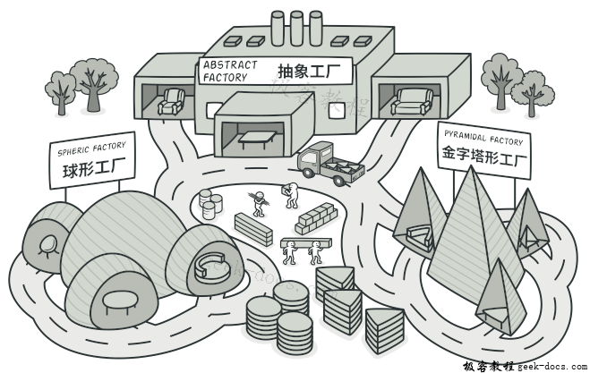
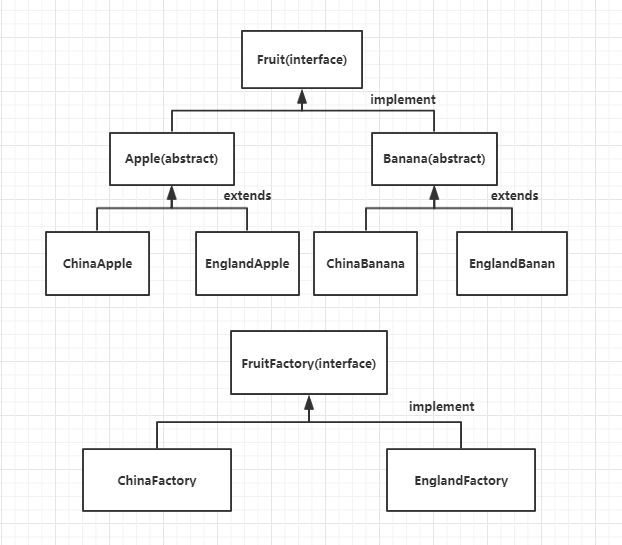

# 抽象工厂模式

## 抽象工厂模式

为每一类工厂提取出抽象接口，使得新增工厂、替换工厂变得非常容易。

**抽象工厂模式**(Abstract Factory Pattern)提供一个创建一系列相关或相互依赖对象的接口，而无须指定它们具体的类。抽象工厂模式又称为Kit模式，属于对象创建型模式。



### 案例

抽象工厂模式，对方法工厂模式进行抽象。世界各地都有自己的水果园，我们将这些水果园抽象为一个水果园接口，在中国、英国和美国都有水果园，种植不同的水果，比如苹果、香蕉和梨等。这里将苹果进行抽象，所以，苹果又分为中国苹果，英国苹果和美国苹果。中国的水果园中有苹果、香蕉和梨等。抽象工厂中声明生产苹果、香蕉和梨等水果，那么具体的工厂相当于中国、英国和美国的水果园，各个水果园负责生产水果、香蕉和梨等。

- **产品等级结构：**产品的继承结构，与类的继承相似。例如苹果是一个抽象的类，那么中国苹果、美国苹果和英国的苹果就是其子类。
- **产品族：**指同一个工厂生产的，位于不同的产品等级结构的一组产品。例如苹果、香蕉和梨都产自中国，水果的等级结构不同，构成一个产品族。
- **抽象工厂：**是一个接口，抽象工厂模式的核心，包含对多个产品等级结构的声明，任何工厂类都必须实现这个接口。
- **具体工厂：**是抽象工厂的实现，负责实例化某个产品族中的产品对象。例如中国工厂生产苹果、香蕉和梨这些产品。





```java
public interface Fruit {
    //水果 接口
    public void get();
}

//苹果 抽象类
public abstract class Apple implements Fruit{
    public abstract void get();
}

public class ChinaApple extends Apple {
//苹果 子类一
    @Override
    public void get() {
        System.out.println("中国的苹果...");
    }
}
public class EnglandApple extends Apple {
//苹果 子类二
    @Override
    public void get() {
        System.out.println("英国的苹果...");
    }
}
//香蕉抽象类（实现水果接口），香蕉类（中国的，英国的） 。。。。。。
```


```java
//创建抽象工厂
public interface FruitFactory {
    //实例化苹果
    public Fruit getApple();
    //实例化香蕉
    public Fruit getBanana();
}

//具体工厂 中国的
public class ChinaFactory implements FruitFactory {
    @Override
    public Fruit getApple() {
        return new ChinaApple();
    }
    @Override
    public Fruit getBanana() {
        return new ChinaBanana();
    }
}
//具体工厂 英国的
public class EnglandFactory implements FruitFactory {
    @Override
    public Fruit getApple() {
        return new EnglandApple();
    }
    @Override
    public Fruit getBanana() {
        return new EnglandBanana();
    }
}
```


```java
public class MainClass {
//测试  生产水果
    public static void main(String[] args){
        //创建中国工厂
        FruitFactory chinaFactory = new ChinaFactory();
        //通过中国工厂生产中国苹果实例
        Fruit apple = chinaFactory.getApple();
        apple.get();
        //通过中国工厂生产中国香蕉实例
        Fruit banana = chinaFactory.getBanana();
        banana.get();        
        //创建英国工厂
        FruitFactory englandFactory = new EnglandFactory();
        //通过英国工厂生产英国苹果实例
        Fruit apple1 = englandFactory.getApple();
        apple1.get();
        //通过英国工厂生产英国香蕉实例
        Fruit banana2 = englandFactory.getBanana();
        banana2.get();
    }
}
```

### 优缺点

**优点**

便于横向的扩展，例如我们想添加一个美国工厂来生产苹果和香蕉，只需要新建美国苹果，美国香蕉和生产这两种水果的具体工厂--美国工厂。

你可以确保同一工厂生成的产品相互匹配。
你可以避免客户端和具体产品代码的耦合。
单一职责原则。 你可以将产品生成代码抽取到同一位置， 使得代码易于维护。
开闭原则。 向应用程序中引入新产品变体时， 你无需修改客户端代码。

**缺点**

就是不利于纵向的扩展，例如我们想在工厂中生产梨，这就需要修改抽象工厂，各个具体工厂也同时需要修改。

由于采用该模式需要向应用中引入众多接口和类， 代码可能会比之前更加复杂。