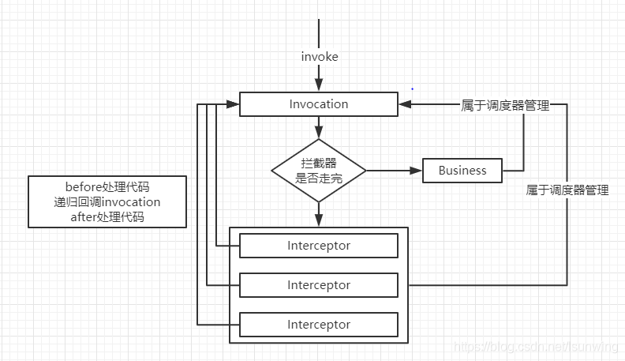

#  拦截器模式

来源：[设计模式之——拦截器模式_做最亮的星星-CSDN博客_拦截器模式](https://blog.csdn.net/lsunwing/article/details/103759728)

## 概念

拦截器模式（Interceptor Pattern），是指提供一种通用的扩展机制，可以在业务操作前后提供一些切面的（Cross-Cutting）的操作。这些切面操作通常是和业务无关的，比如日志记录、性能统计、安全控制、事务处理、异常处理和编码转换等。

拦截器模式和面向切面编程(AOP)很像，拦截器模式的特点：其命名能更加表达前置处理和后置处理的含义，拦截器的添加和删除更加灵活。

## 适用场景

一般在框架代码中的固定业务逻辑，这部分逻辑通常不会变化，比如：服务调用的拦截处理，拦截服务的参数，参数国际化处理，拦截服务的异常，记录服务的调用结果等等。

## 组成部分

拦截器模式有三个重要的元素：调度器，拦截器，业务逻辑，只要充分理解这三个元素，拦截器模式就很简单了。



**调度器(Invocation)**

一个业务逻辑可以有N个拦截器，这些拦截器是怎么运行的，自然是需要有一个调度器从中调度。

**拦截器(Interceptor)**

拦截器就只是负责拦截业务代码，在业务代码前后做一些操作，至于拦截器和业务代码的关系，拦截器不会直接调用业务代码，因为会耦合，拦截器在处理完自己的逻辑，会通知调度器，由调度器负责后续的操作，是继续拦截，还是调用业务逻辑。

**业务逻辑**

业务代码这一块没啥好说的。

## 例子

举个代码最少的例子，业务场景：服务调用，拦截服务调用记录日志，以及做异常处理。

既然有两个拦截器，自然要有一个拦截器接口。

### 1、拦截器接口

```java
public interface Interceptor {
    void before(Invocation invocation);
 
    String intercept(Invocation invocation);
 
    void after(Invocation invocation);
}
```

### 2、日志拦截器

```java
public class LogInterceptor implements Interceptor {
 
    @Override
    public void before(Invocation invocation) {
        System.out.println("LogInterceptor before...");
    }
 
    @Override
    public String intercept(Invocation invocation) {
        this.before(invocation);
        invocation.invoke();
        this.after(invocation);
        return null;
    }
 
    @Override
    public void after(Invocation invocation) {
        System.out.println("LogInterceptor after...");
    }
}
```

### 3，异常拦截器

```java
public class ExceptionInterceptor implements Interceptor {
 
    @Override
    public void before(Invocation invocation) {
        System.out.println("ExceptionInterceptor before...");
    }
 
    @Override
    public String intercept(Invocation invocation) {
        this.before(invocation);
        // 实际代码应该是try catch，在catch中做事情
        invocation.invoke();
        this.after(invocation);
        return null;
    }
 
    @Override
    public void after(Invocation invocation) {
        System.out.println("ExceptionInterceptor after...");
    }
}
```

### 4、调度器

```java
public class Invocation {
    int index = 0;
    // 调度器管理业务
    private BusinessService bs;
    // 调度器管理拦截器List
    private List<Interceptor> interceptions = new ArrayList<Interceptor>();
    
    public Invocation() {
        interceptions.add(new LogInterceptor());
        interceptions.add(new ExceptionInterceptor());
    }
    
    public void invoke() {
        if (index == interceptions.size()) {
            bs.perform();
        }
        else {
            Interceptor interceptor = interceptions.get(index);
            index++;
            interceptor.intercept(this); // 传this(调度器)用于回调
        }
    }
    
    public void setBusinessService(BusinessService bs) {
        this.bs = bs;
    }
}
```

### 5、业务代码

```java
public class BusinessService {
 
    public void perform() {
        System.out.println("服务调用。。。");
    }
}
```

### 6，测试方法

```java
public static void main(String[] args) {
    Invocation invocation = new Invocation(); // 直接在构造里面就把两个拦截器加上
    invocation.setBusinessService(new BusinessService()); // 加上业务逻辑

    invocation.invoke();
}
```

结果：

```
LogInterceptor before...
ExceptionInterceptor before...
服务调用。。。
ExceptionInterceptor after...
LogInterceptor after...
```

