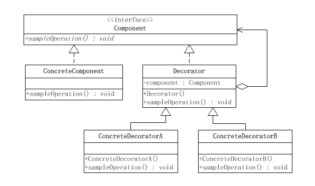
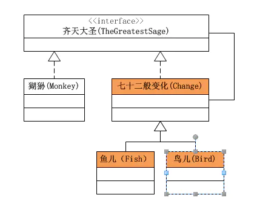
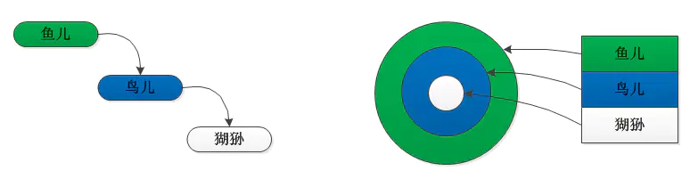
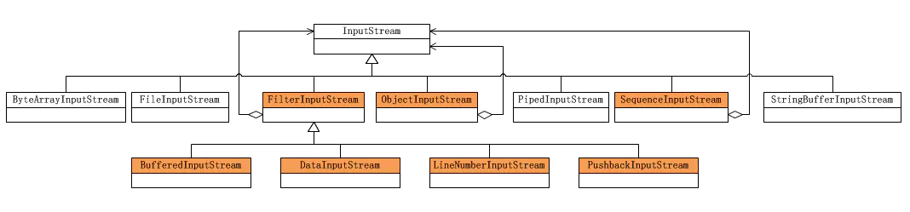

# 概念

来源：https://www.jianshu.com/p/d7f20ae63186

装饰者模式又名包装(Wrapper)模式。装饰者模式以对客户端透明的方式扩展对象的功能，是继承关系的一个替代方案。

装饰者模式动态地将责任附加到对象身上。若要扩展功能，装饰者提供了比继承更有弹性的替代方案。

装饰者模式以对客户透明的方式动态地给一个对象附加上更多的责任。换言之，客户端并不会觉得对象在装饰前和装饰后有什么不同。装饰者模式可以在不使用创造更多子类的情况下，将对象的功能加以扩展。

装饰者模式的类图如下：



　在装饰模式中的角色有：

●　　抽象构件(Component)角色：给出一个抽象接口，以规范准备接收附加责任的对象。

●　　具体构件(ConcreteComponent)角色：定义一个将要接收附加责任的类。

●　　装饰(Decorator)角色：持有一个构件(Component)对象的实例，并定义一个与抽象构件接口一致的接口。

●　　具体装饰(ConcreteDecorator)角色：负责给构件对象“贴上”附加的责任。


**抽象构件角色**


```csharp
public interface Component {
    
    public void sampleOperation();
    
}
```

**具体构件角色**


```java
public class ConcreteComponent implements Component {

    @Override
    public void sampleOperation() {
        // 写相关的业务代码
    }
}
```

**装饰角色**


```java
public class Decorator implements Component{
    private Component component;
    
    public Decorator(Component component){
        this.component = component;
    }

    @Override
    public void sampleOperation() {
        // 委派给构件
        component.sampleOperation();
    }   
}
```

**具体装饰角色**

```java
public class ConcreteDecoratorA extends Decorator {

    public ConcreteDecoratorA(Component component) {
        super(component);
    }
    
    @Override
    public void sampleOperation() {
      // 写相关的业务代码
　　　super.sampleOperation();
     // 写相关的业务代码
    }
}
```

## 装饰者模式实例演示

**齐天大圣的例子**
孙悟空有七十二般变化，他的每一种变化都给他带来一种附加的本领。他变成鱼儿时，就可以到水里游泳；他变成鸟儿时，就可以在天上飞行。

本例中，Component的角色便由鼎鼎大名的齐天大圣扮演；ConcreteComponent的角色属于大圣的本尊，就是猢狲本人；Decorator的角色由大圣的七十二变扮演。而ConcreteDecorator的角色便是鱼儿、鸟儿等七十二般变化。




**抽象构件角色“齐天大圣”接口定义了一个move()方法，这是所有的具体构件类和装饰类必须实现的。**

```java
//大圣的尊号
public interface TheGreatestSage {
    
    public void move();
}
```

**具体构件角色“大圣本尊”猢狲类**

```java
public class Monkey implements TheGreatestSage {

    @Override
    public void move() {
        //代码
        System.out.println("Monkey Move");
    }
}
```

**抽象装饰角色“七十二变”**

```java
public class Change implements TheGreatestSage {
    private TheGreatestSage sage;
    
    public Change(TheGreatestSage sage){
        this.sage = sage;
    }
    @Override
    public void move() {
        // 代码
        sage.move();
    }
}
```

**具体装饰角色“鱼儿”**


```java
public class Fish extends Change {
    
    public Fish(TheGreatestSage sage) {
        super(sage);
    }

    @Override
    public void move() {
        // 代码
        System.out.println("Fish Move");
    }
}
```

**具体装饰角色“鸟儿”**


```java
public class Bird extends Change {
    
    public Bird(TheGreatestSage sage) {
        super(sage);
    }

    @Override
    public void move() {
        // 代码
        System.out.println("Bird Move");
    }
}
```

**客户端调用**


```cpp
public class Client {

    public static void main(String[] args) {
        TheGreatestSage sage = new Monkey();
        // 第一种写法  单层装饰
        TheGreatestSage bird = new Bird(sage);
        TheGreatestSage fish = new Fish(bird);
        // 第二种写法 双层装饰
        //TheGreatestSage fish = new Fish(new Bird(sage));
        fish.move(); 
    }
}
```

“大圣本尊”是ConcreteComponent类，而“鸟儿”、“鱼儿”是装饰类。要装饰的是“大圣本尊”，也即“猢狲”实例。

上面的例子中，第二种些方法：系统把大圣从一只猢狲装饰成了一只鸟儿（把鸟儿的功能加到了猢狲身上），然后又把鸟儿装饰成了一条鱼儿（把鱼儿的功能加到了猢狲+鸟儿身上，得到了猢狲+鸟儿+鱼儿）。




如上图所示，大圣的变化首先将鸟儿的功能附加到了猢狲身上，然后又将鱼儿的功能附加到猢狲+鸟儿身上。

## 装饰者模式在Java IO流中的应用

装饰者模式在Java语言中的最著名的应用莫过于Java I/O标准库的设计了。

由于Java I/O库需要很多性能的各种组合，如果这些性能都是用继承的方法实现的，那么每一种组合都需要一个类，这样就会造成大量性能重复的类出现。而如果采用装饰者模式，那么类的数目就会大大减少，性能的重复也可以减至最少。因此装饰者模式是Java I/O库的基本模式。

Java I/O库的对象结构图如下，由于Java I/O的对象众多，因此只画出InputStream的部分。



根据上图可以看出：

●　　抽象构件(Component)角色：由InputStream扮演。这是一个抽象类，为各种子类型提供统一的接口。

●　　具体构件(ConcreteComponent)角色：由ByteArrayInputStream、FileInputStream、PipedInputStream、StringBufferInputStream等类扮演。它们实现了抽象构件角色所规定的接口。

●　　抽象装饰(Decorator)角色：由FilterInputStream扮演。它实现了InputStream所规定的接口。

●　　具体装饰(ConcreteDecorator)角色：由几个类扮演，分别是BufferedInputStream、DataInputStream以及两个不常用到的类LineNumberInputStream、PushbackInputStream。