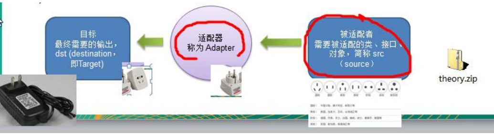

# 一.七大原则

## 1.依赖倒置原则

高层模块不应该依赖于底层模块，二者都应该依赖其抽象

## 2.单一职责原则

对类来说的，即**一个类应该只负责一项职责**。如类A 负责两个不同职责：职责1，职责2。当职责1 需求变更
而改变A 时，可能造成职责2 执行错误，所以需要将类A 的粒度分解为A1，A2

以交通工具案例:

### 案例：初始不遵守

交通工具，有些在公路上，有些在水上，有些在天上...

```java
public class SingleResponsibility1 {
    public static void main(String[] args) {
        Vehicle vehicle = new Vehicle();
        vehicle.run("摩托车");
        vehicle.run("汽车");
        vehicle.run("飞机");
    }
}
// 交通工具类
// 方式1
// 1. 在方式1 的run 方法中，违反了单一职责原则
// 2. 解决的方案非常的简单，根据交通工具运行方法不同，分解成不同类即可
class Vehicle {
    public void run(String vehicle) {
        System.out.println(vehicle + " 在公路上运行....");
    }
}
```

### 案例：遵守但改动很大

```java
public class SingleResponsibility2 {
    public static void main(String[] args) {
        RoadVehicle roadVehicle = new RoadVehicle();
        roadVehicle.run("摩托车");
        roadVehicle.run("汽车");
        AirVehicle airVehicle = new AirVehicle();
        airVehicle.run("飞机");
    }
}
//方案2 的分析
//1. 遵守单一职责原则
//2. 但是这样做的改动很大，即将类分解，同时修改客户端
//3. 改进：直接修改Vehicle 类，改动的代码会比较少=>方案3
class RoadVehicle {
    public void run(String vehicle) {
        System.out.println(vehicle + "公路运行");
    }
}
class AirVehicle {
    public void run(String vehicle) {
        System.out.println(vehicle + "天空运行");
    }
}
class WaterVehicle {
    public void run(String vehicle) {
        System.out.println(vehicle + "水中运行");
    }
}
```

### 案例：在方法级别遵守

```java
public class SingleResponsibility3 {
    public static void main(String[] args) {
        Vehicle2 vehicle2 = new Vehicle2();
        vehicle2.run("汽车");
        vehicle2.runWater("轮船");
        vehicle2.runAir("飞机");
    }
}
//1. 这种修改方法没有对原来的类做大的修改，只是增加方法
//2. 这里虽然没有在类这个级别上遵守单一职责原则，但是在方法级别上，仍然是遵守单一职责
class Vehicle2 {
    public void run(String vehicle) {
        //处理
        System.out.println(vehicle + " 在公路上运行....");
    }
    public void runAir(String vehicle) {
        System.out.println(vehicle + " 在天空上运行....");
    }
    public void runWater(String vehicle) {
        System.out.println(vehicle + " 在水中行....");
    }
    //方法2.
    //..
    //..
    //...
}
```

### 单一职责原则注意事项和细节

1) 降低类的复杂度，一个类只负责一项职责。
2) 提高类的可读性，可维护性
3) 降低变更引起的风险
4) 通常情况下，我们应当遵守单一职责原则，只有逻辑足够简单，才可以在代码级违反单一职责原则；只有类中
方法数量足够少，可以在方法级别保持单一职责原则

## 3.接口隔离原则

一个接口不要包含过多的职责，应合理划分，跟单一职责原则相辅相成

## 4.里氏替换原则

在引用父类的地方，都可以替换为其子类。从而可以实现子类间的动态切换。换句话说就是要有面向接口的编程思维

## 5.开闭原则

### 5.1基本介绍

1) 开闭原则（Open Closed Principle）是编程中**最基础、最重要**的设计原则

2) 一个软件实体如类，模块和函数应该对**扩展开放**(对提供方)，对**修改关闭**(对使用方)。用抽象构建框架，用实

现扩展细节。

3) 当软件需要变化时，尽量**通过扩展软件**实体的行为来实现变化，而不是**通过修改**已有的代码来实现变化。

4) 编程中遵循其它原则，以及使用设计模式的目的就是遵循开闭原则。

### 5.2看下面一段代码


```java
package com.atguigu.principle.ocp;
public class Ocp {
    public static void main(String[] args) {
//使用看看存在的问题
        GraphicEditor graphicEditor = new GraphicEditor();
        graphicEditor.drawShape(new Rectangle());
        graphicEditor.drawShape(new Circle());
        graphicEditor.drawShape(new Triangle());
    }
}
//这是一个用于绘图的类 [使用方]
class GraphicEditor {
    //接收 Shape 对象，然后根据 type，来绘制不同的图形
    public void drawShape(Shape s) {
        if (s.m_type == 1)
            drawRectangle(s);
        else if (s.m_type == 2)
            drawCircle(s);
        else if (s.m_type == 3)
            drawTriangle(s);
    }
    //绘制矩形
    public void drawRectangle(Shape r) {
        System.out.println(" 绘制矩形 ");
    }
    //绘制圆形
    public void drawCircle(Shape r) {
        System.out.println(" 绘制圆形 ");
    }
    //绘制三角形
    public void drawTriangle(Shape r) {
        System.out.println(" 绘制三角形 ");
    }
}
//Shape 类，基类
class Shape {
    int m_type;
}
class Rectangle extends Shape {
    Rectangle() {
        super.m_type = 1;
    }
}
class Circle extends Shape {
    Circle() {
        super.m_type = 2;
    }
}
//新增画三角形
class Triangle extends Shape {
    Triangle() {
        super.m_type = 3;
    }
}
```

### 5.3方式 1 的优缺点

1) 优点是比较好理解，简单易操作。

2) 缺点是违反了设计模式的 ocp 原则，即对扩展开放(提供方)，对修改关闭(使用方)。即当我们给类增加新功能的时候，尽量不修改代码，或者尽可能少修改代码. 3) 比如我们这时要新增加一个图形种类 三角形，我们需要做如下修改，修改的地方较多

4) 代码演示

### 5.4改进的思路分析

**思路**：把创建 **Shape** **类做成抽象类**，并提供一个**抽象的** **draw** 方法，让**子类去实现即可**，这样我们有新的图形种类时，只需要让新的图形类继承 Shape，并实现 draw 方法即可，**使用方的代码就不需要修** -> 满足了开闭原则

**改进后的代码**：

```java
package com.atguigu.principle.ocp.improve;
public class Ocp {
    public static void main(String[] args) {
//使用看看存在的问题
        GraphicEditor graphicEditor = new GraphicEditor();
        graphicEditor.drawShape(new Rectangle());
        graphicEditor.drawShape(new Circle());
        graphicEditor.drawShape(new Triangle());
        graphicEditor.drawShape(new OtherGraphic());
    }
}
//这是一个用于绘图的类 [使用方]
class GraphicEditor {
    //接收 Shape 对象，调用 draw 方法
    public void drawShape(Shape s) {
        s.draw();
    }
}
//Shape 类，基类
abstract class Shape {
    int m_type;
    public abstract void draw();//抽象方法
}
class Rectangle extends Shape {
    Rectangle() {
        super.m_type = 1;
    }
    @Override
    public void draw() {
// TODO Auto-generated method stub
        System.out.println(" 绘制矩形 ");
    }
}
class Circle extends Shape {
    Circle() {
        super.m_type = 2;
    }
    @Override
    public void draw() {
// TODO Auto-generated method stub
        System.out.println(" 绘制圆形 ");
    }
}
//新增画三角形
class Triangle extends Shape {
    Triangle() {
        super.m_type = 3;
    }
    @Override
    public void draw() {
// TODO Auto-generated method stub
        System.out.println(" 绘制三角形 ");
    }
}
//新增一个图形
class OtherGraphic extends Shape {
    OtherGraphic() {
        super.m_type = 4;
    }
    @Override
    public void draw() {
// TODO Auto-generated method stub
        System.out.println(" 绘制其它图形 ");
    }
}
```


## 6.迪米特法则

### 6.1基本介绍

1) 一个对象应该对其他对象保持最少的了解

2) 类与类关系越密切，耦合度越大

3) 迪米特法则(Demeter Principle)又叫**最少知道原则**，即一个类对自己依赖的类知道的越少越好。也就是说，对于被依赖的类不管多么复杂，都尽量将逻辑封装在类的内部。对外除了提供的 public 方法，不对外泄露任何信息

4) 迪米特法则还有个更简单的定义：只与直接的朋友通信

5) **直接的朋友**：每个对象都会与其他对象有耦合关系，只要两个对象之间有耦合关系，我们就说这两个对象之间是朋友关系。耦合的方式很多，依赖，关联，组合，聚合等。其中，我们称出现**成员变量，方法参数，方法返回值**中的类为**直接的朋友**，而出现在局部变量中的类不是直接的朋友。也就是说，**陌生的类最好不要以局部变量的形式出现在类的内部**。

### 6.2应用实例

1) 有一个学校，下属有各个学院和总部，现要求打印出学校总部员工 ID 和学院员工的 id
2) 编程实现上面的功能, 看代码演示
3) 代码演示

```java
package com.atguigu.principle.demeter;

import java.util.ArrayList;
import java.util.List;

public class Demeter1 {
    public static void main(String[] args) {
//创建了一个 SchoolManager 对象
        SchoolManager schoolManager = new SchoolManager();
//输出学院的员工 id 和 学校总部的员工信息
        schoolManager.printAllEmployee(new CollegeManager());
    }
}
//学校总部员工类
class Employee {
    private String id;
    public void setId(String id) {
        this.id = id;
    }
    public String getId() {
        return id;
    }
}
//学院的员工类
class CollegeEmployee {
    private String id;
    public void setId(String id) {
        this.id = id;
    }
    public String getId() {
        return id;
    }
}
//管理学院员工的管理类
class CollegeManager {
    //返回学院的所有员工
    public List<CollegeEmployee> getAllEmployee() {
        List<CollegeEmployee> list = new ArrayList<CollegeEmployee>();
        for (int i = 0; i < 10; i++) { //这里我们增加了 10 个员工到 list
            CollegeEmployee emp = new CollegeEmployee();
            emp.setId("学院员工 id= " + i);
            list.add(emp);
        }
        return list;
    }
}
//学校管理类
//分析 SchoolManager 类的直接朋友类有哪些 Employee、CollegeManager
//CollegeEmployee 不是 直接朋友 而是一个陌生类，这样违背了 迪米特法则
class SchoolManager {
    //返回学校总部的员工
    public List<Employee> getAllEmployee() {
        List<Employee> list = new ArrayList<Employee>();
        for (int i = 0; i < 5; i++) { //这里我们增加了 5 个员工到 list
            Employee emp = new Employee();
            emp.setId("学校总部员工 id= " + i);
            list.add(emp);
        }
        return list;
    }
    //该方法完成输出学校总部和学院员工信息(id)
    void printAllEmployee(CollegeManager sub) {
		//分析问题
		//1. 这里的 CollegeEmployee 不是 SchoolManager 的直接朋友
		//2. CollegeEmployee 是以局部变量方式出现在 SchoolManager
		//3. 违反了 迪米特法则
		//获取到学院员工
        List<CollegeEmployee> list1 = sub.getAllEmployee();
        System.out.println("------------学院员工------------");
        for (CollegeEmployee e : list1) {
            System.out.println(e.getId());
        }
		//获取到学校总部员工
        List<Employee> list2 = this.getAllEmployee();
        System.out.println("------------学校总部员工------------");
        for (Employee e : list2) {
            System.out.println(e.getId());
        }
    }
}

```


### 6.3应用实例改进

1) 前面设计的问题在于 SchoolManager 中，**CollegeEmployee** **类并不是** **SchoolManager** 类的直接朋友 (分析)

2) 按照迪米特法则，应该避免类中出现这样非直接朋友关系的耦合

3) 对代码按照迪米特法则 进行改进. (看老师演示)

4) 代码演示

```java
package com.atguigu.principle.demeter.improve;

import java.util.ArrayList;
import java.util.List;

public class Demeter1 {
    public static void main(String[] args) {
        System.out.println("使用迪米特法则的改进");
		//创建了一个 SchoolManager 对象
        SchoolManager schoolManager = new SchoolManager();
		//输出学院的员工 id 和 学校总部的员工信息
        schoolManager.printAllEmployee(new CollegeManager());
    }
}

//学校总部员工类
class Employee {
    private String id;
    public void setId(String id) {
        this.id = id;
    }
    public String getId() {
        return id;
    }
}

//学院的员工类
class CollegeEmployee {
    private String id;
    public void setId(String id) {
        this.id = id;
    }
    public String getId() {
        return id;
    }
}
//管理学院员工的管理类

class CollegeManager {
    //返回学院的所有员工
    public List<CollegeEmployee> getAllEmployee() {
        List<CollegeEmployee> list = new ArrayList<CollegeEmployee>();
        for (int i = 0; i < 10; i++) { //这里我们增加了 10 个员工到 list
            CollegeEmployee emp = new CollegeEmployee();
            emp.setId("学院员工 id= " + i);
            list.add(emp);
        }
        return list;
    }
    //输出学院员工的信息
    public void printEmployee(){
        List<CollegeEmployee> list1 = getAllEmployee();
        System.out.println("------------学院员工------------");
        for (CollegeEmployee e : list1) {
            System.out.println(e.getId());
        }
    }
}

//学校管理类
//分析 SchoolManager 类的直接朋友类有哪些 Employee、CollegeManager
//CollegeEmployee 不是 直接朋友 而是一个陌生类，这样违背了 迪米特法则
class SchoolManager {
    //返回学校总部的员工
    public List<Employee> getAllEmployee() {
        List<Employee> list = new ArrayList<Employee>();
        for (int i = 0; i < 5; i++) { //这里我们增加了 5 个员工到 list
            Employee emp = new Employee();
            emp.setId("学校总部员工 id= " + i);
            list.add(emp);
        }
        return list;
    }
    //该方法完成输出学校总部和学院员工信息(id)
    void printAllEmployee(CollegeManager sub) {
		//分析问题
		//1. 将输出学院的员方法封装到CollegeManager
        sub.printEmployee();
		//获取到学校总部员工
        List<Employee> list2 = this.getAllEmployee();
        System.out.println("------------学校总部员工------------");
        for (Employee e : list2) {
            System.out.println(e.getId());
        }
    }
}

```

### 6.4迪米特法则注意事项和细节

1) 迪米特法则的核心是降低类之间的耦合

2) 但是注意：由于每个类都减少了不必要的依赖，因此迪米特法则只是要求降低类间(对象间)耦合关系， 并不是要求完全没有依赖关系

## 7.合成复用原则

Composite Reuse Principle

### 7.1基本介绍

原则是尽量使用合成/聚合的方式，而不是使用继承


这七种设计原则核心思想

1) 找出应用中可能需要变化之处，把它们独立出来，不要和那些不需要变化的代码混在一起。

2) 针对接口编程，而不是针对实现编程。

3) 为了交互对象之间的**松耦合**设计而努力

# 二、UML类图

## 3.1 UML 基本介绍

1) UML——Unified modeling language UML (统一建模语言)，是一种用于软件系统分析和设计的语言工具，它用于帮助软件开发人员进行思考和记录思路的结果

2) UML 本身是一套符号的规定，就像数学符号和化学符号一样，这些符号用于描述软件模型中的各个元素和他们之间的关系，比如类、接口、实现、泛化、依赖、组合、聚合等，如右图:


3) 使用 UML 来建模，常用的工具有 Rational Rose , 也可以使用一些**插件**来建模

## 3.2UML 图

画 UML 图与写文章差不多，都是把自己的思想描述给别人看，关键在于思路和条理，UML 图分类：

1) 用例图(use case)

2) 静态结构图：**类图**、对象图、包图、组件图、部署图

3) 动态行为图：交互图（时序图与协作图）、状态图、活动图

 说明：

1) 类图是描述类与类之间的关系的，是 UML 图中最核心的

2) 在讲解设计模式时，我们必然会使用类图，为了让学员们能够把设计模式学到位，需要先给大家讲解类图

3) 温馨提示：如果已经掌握 UML 类图的学员，可以直接听设计模式的章节

## 3.3UML 类图

1) 用于描述系统中的类(对象)本身的组成和类(对象)之间的各种静态关系。
2) 类之间的关系：依赖、泛化（继承）、实现、关联、聚合与组合。
3) 类图简单举例

```java

public class Person{ //代码形式->类图
    private Integer id;
    private String name;
    public void setName(String name){
        this.name=name;
    }
    public String getName(){
    	return name;
    }
}
```


## 3.4类图—依赖关系（Dependence）

只要是在**类中用到了对方，那么他们之间就存在依赖关系**。如果没有对方，连编绎都通过不了。

依赖关系内含有：

- 关联关系
  - 聚合关系
    - 组合关系

```java
package com.atguigu.uml.dependence;

public class PersonServiceBean {
    private PersonDao personDao;//类
    public void save(Person person){}
    public IDCard getIDCard(Integer personid){
        return null;
    }
    public void modify(){
        Department department = new Department();
    }
}

```


**小结**

1) 类中用到了对方

2) 如果是**类的成员属性**

3) 如果是**方法的返回类**型

4) 是方法**接收的参数类**型

5) **方法中使用**到

## 3.5类图—泛化关系(generalization）

**泛化关系实际上就是继承关系**，他是**依赖关系的特**例

```java
package com.atguigu.uml.generalization;

public abstract class DaoSupport{
    public void save(Object entity){
    }
    public void delete(Object id){
    }
}

```

```java
package com.atguigu.uml.generalization;

public class PersonServiceBean extends  DaoSupport {
}
```


小结:

1) 泛化关系实际上就是继承关系

2) 如果 A 类继承了 B 类，我们就说 A 和 B 存在泛化关系

## 3.6类图—实现关系（Implementation）

实现关系实际上就**是** **A** **类实现** **B** **接口**，他是**依赖关系的特**例

```java
package com.atguigu.uml.implementation;

public interface PersonService {
    public void delete(Integer id);
}

```

```java
package com.atguigu.uml.implementation;

public class PersonServiceBean implements PersonService {
    @Override
    public void delete(Integer id) {
        System.out.println("delete...");
    }
}

```


## 3.7类图—关联关系（Association）


## 3.8类图—聚合关系（Aggregation）

聚合关系（Aggregation）表示的是**整体和部分的关系**，**整体与部分可以分开**。聚合关系是**关联关系的特例**，所以他具有关联的**导航性与多重性**。如：一台电脑由键盘(keyboard)、显示器(monitor)，鼠标等组成；组成电脑的各个配件是可以从电脑上分离出来的，使用带空心菱形的实线来表示：

（类  名称（后面没有new））

如果下面是

private Mouse mouse=  new Mouse;

private Monitor monitor =  new Monitor ;

那就变成组合关系


## 3.9类图—组合关系（Composition）

组合关系：也是整体与部分的关系，但是整体与部分不可以分开。再看一个案例：在程序中我们定义实体：Person 与 IDCard、Head, 那么 Head 和 Person 就是 组合，IDCard 和Person 就是聚合。

（类  名称  =  new  类（））

但是如果在程序中 Person 实体中定义了对 IDCard 进行级联删除，即删除 Person 时连同 IDCard 一起删除，那么 IDCard 和 Person 就是组合了. 

```java
public class Person{
	private IDCard card;
	private Head head = new Head();
}
public class IDCard{}
public class Head{}
```


案例二：

```java
public class Computer {
	private Mouse mouse = new Mouse(); //鼠标可以和 computer 不能分离
	private Moniter moniter = new Moniter();//显示器可以和 Computer 不能分离
	public void setMouse(Mouse mouse) {
		this.mouse = mouse;
	}
	public void setMoniter(Moniter moniter) {
		this.moniter = moniter;
	}
}
public class Mouse {
}
public class Moniter {
}
```


# 三、设计模式概述

## 掌握设计模式的层次

1) 第 1 层：刚开始学编程不久，听说过什么是设计模式

2) 第 2 层：有很长时间的编程经验，自己写了很多代码，其中用到了设计模式，但是自己却不知道

3) 第 3 层：学习过了设计模式，发现自己已经在使用了，并且发现了一些新的模式挺好用的

4) 第 4 层：阅读了很多别人写的源码和框架，在其中看到别人设计模式，并且能够领会设计模式的精妙和带来的好处。

5) 第 5 层：代码写着写着，自己都没有意识到使用了设计模式，并且熟练的写了出来。


## 设计模式介绍

1) 设计模式是程序员在面对同类软件工程设计问题所总结出来的有用的经验，**模式不是代码**，而是**某类问题的通用解决方案**，设计模式（Design pattern）代表了最佳的实践。这些解决方案是众多软件开发人员经过相当长的一段时间的试验和错误总结出来的。

2) 设计模式的本质提高 **软件的维护性，通用性和扩展性，并降低软件的复杂度**。

3) <<**设计模式**>> 是经典的书，作者是 Erich Gamma、Richard Helm、Ralph Johnson 和 John Vlissides Design（俗称 “四人组 GOF”）

4) 设计模式并不局限于某种语言，java，php，c++ 都有设计模式. 


## 设计模式分类

设计模式分为**三种类型**，共 **23** **种**

1) **创建型**模式：**单例模式**、抽象工厂模式、原型模式、建造者模式、**工厂模式**。

2) **结构型**模式：适配器模式、桥接模式、**装饰模式**、组合模式、外观模式、享元模式、**代理模式**。

3) **行为型**模式（关系型）：

- 父类与子类关系：模版方法模式、策略模式
- 类之间的关系：**观察者模式**、迭代器模式、职责链模式(责任链模式)、命令模式
- 类的状态：备忘录模式、状态模式
- 通过中间类：访问者模式、中介者模式、解释器模式（Interpreter 模式）

注意：不同的书籍上对分类和名称略有差别

# 4.单例模式⭐

## 4.1单例设计模式介绍

所谓类的单例设计模式，就是**采取一定的方法保证在整个的软件系统中，对某个类只能存在一个对象实例**，并且该类只提供一个取得其对象实例的方法(静态方法)。

比如 Hibernate 的 SessionFactory，它充当数据存储源的代理，并负责创建 Session 对象。SessionFactory 并不是轻量级的，一般情况下，一个项目通常只需要一个 SessionFactory 就够，这是就会使用到单例模式。

## 4.2单例设计模式八种方式

**1)** **饿汉式**(**静态常量**)

**2)** **饿汉式（静态代码块）**

3) 懒汉式(线程不安全)

4) 懒汉式(线程安全，同步方法)

5) 懒汉式(线程安全，同步代码块)

**6)** **双重检查**

**7)** **静态内部类**

**8)** **枚举**

## 4.3饿汉式（静态常量）

**步骤如下**：

1) 构造器私有化 (防止 new )

2) 类的内部创建对象

3) 向外暴露一个静态的公共方法。getInstance

4) 代码实现

```java
package com.atguigu.singleton.type1;

public class SingletonTest01 {
    public static void main(String[] args) {
        //测试
        Singleton instance = Singleton.getInstance();
        Singleton instance2 = Singleton.getInstance();
        System.out.println(instance == instance2); // true
        System.out.println("instance.hashCode=" + instance.hashCode());
        System.out.println("instance2.hashCode=" + instance2.hashCode());
    }
    //饿汉式(静态变量)
    static class Singleton{
        //1.构造器私有化，外部不能new
        private Singleton(){}
        //2.在本类内部创建对象实例
        private final static Singleton instance = new Singleton();
        //3.提供一个公有的静态方法，返回实例对象
        public static Singleton getInstance() {
            return instance;
        }
    }
}

```

优缺点说明：
        1) 优点：这种写法比较简单，就是在类装载的时候就完成实例化。避免了线程同步问题。
        2) 缺点：在类装载的时候就完成实例化，没有达到 Lazy Loading 的效果。如果从始至终从未使用过这个实例，则
        会造成内存的浪费
        3) 这种方式基于 classloder 机制避免了多线程的同步问题，不过，instance 在类装载时就实例化，在单例模式中大
        多数都是调用 getInstance 方法，但是导致类装载的原因有很多种，因此不能确定有其他的方式（或者其他的静
        态方法）导致类装载，这时候初始化 instance 就没有达到 lazy loading 的效果
        4) 结论：这种单例模式可用，可能造成内存浪费

## 4.4饿汉式（静态代码块）

```java
package com.atguigu.singleton.type2;

public class SingletonTest02 {
    public static void main(String[] args) {
//测试
        Singleton instance = Singleton.getInstance();
        Singleton instance2 = Singleton.getInstance();
        System.out.println(instance == instance2); // true
        System.out.println("instance.hashCode=" + instance.hashCode());
        System.out.println("instance2.hashCode=" + instance2.hashCode());
    }
}

class Singleton {
    //1. 构造器私有化, 外部不能 new
    private Singleton() {
    }
    //2.本类内部创建对象实例
    private static Singleton instance;
    static { // 在静态代码块中，创建单例对象
        instance = new Singleton();
    }
    //3. 提供一个公有的静态方法，返回实例对象
    public static Singleton getInstance() {
        return instance;
    }
}
```

优缺点说明：
1) 这种方式和上面的方式其实类似，只不过将类实例化的过程放在了静态代码块中，也是在类装载的时候，就执行静态代码块中的代码，初始化类的实例。优缺点和上面是一样的。
2) 结论：这种单例模式可用，但是可能造成内存浪费

## 4.5懒汉式(线程不安全)

```java
package com.atguigu.singleton.type3;

public class SingletonTest03 {
    public static void main(String[] args) {
        System.out.println("懒汉式 1 ， 线程不安全~");
        Singleton instance = Singleton.getInstance();
        Singleton instance2 = Singleton.getInstance();
        System.out.println(instance == instance2); // true
        System.out.println("instance.hashCode=" + instance.hashCode());
        System.out.println("instance2.hashCode=" + instance2.hashCode());
    }
}
class Singleton {
    private static Singleton instance;
    private Singleton() {}
    //提供一个静态的公有方法，当使用到该方法时，才去创建 instance
//即懒汉式
    public static Singleton getInstance() {
        if(instance == null) {
            instance = new Singleton();
        }
        return instance;
    }
}

```

优缺点说明：
1) 起到了 Lazy Loading 的效果，但是只能在单线程下使用。
2) 如果在多线程下，一个线程进入了 if (singleton == null)判断语句块，还未来得及往下执行，另一个线程也通过
了这个判断语句，这时便会产生多个实例。所以在多线程环境下不可使用这种方式
3) 结论：在实际开发中，不要使用这种方式.

## 4.6懒汉式(线程安全，同步方法)

```java
package com.atguigu.singleton.type4;

public class SingletonTest04 {
    public static void main(String[] args) {
        System.out.println("懒汉式 2 ， 线程安全~");
        Singleton instance = Singleton.getInstance();
        Singleton instance2 = Singleton.getInstance();
        System.out.println(instance == instance2); // true
        System.out.println("instance.hashCode=" + instance.hashCode());
        System.out.println("instance2.hashCode=" + instance2.hashCode());
    }
}
// 懒汉式(线程安全，同步方法)
class Singleton {
    private static Singleton instance;
    private Singleton() {}
    //提供一个静态的公有方法，加入同步处理的代码，解决线程安全问题
//即懒汉式
    public static synchronized Singleton getInstance() {
        if(instance == null) {
            instance = new Singleton();
        }
        return instance;
    }
}

```

优缺点说明：
1) 解决了线程安全问题
2) 效率太低了，每个线程在想获得类的实例时候，执行 getInstance()方法都要进行同步。而其实这个方法只执行
一次实例化代码就够了，后面的想获得该类实例，直接 return 就行了。方法进行同步效率太低
3) 结论：在实际开发中，不推荐使用这种方式

## 4.7懒汉式(线程安全，同步代码块)


不推荐使用。还是线程不安全

**双重检查**

```java
package com.atguigu.singleton.type6;

public class SingletonTest06 {
    public static void main(String[] args) {
        System.out.println("双重检查");
        Singleton instance = Singleton.getInstance();
        Singleton instance2 = Singleton.getInstance();
        System.out.println(instance == instance2); // true
        System.out.println("instance.hashCode=" + instance.hashCode());
        System.out.println("instance2.hashCode=" + instance2.hashCode());

    }
}
// 懒汉式(线程安全，同步方法)
class Singleton {
    private static volatile Singleton instance;
    private Singleton() {}
    //提供一个静态的公有方法，加入双重检查代码，解决线程安全问题, 同时解决懒加载问题
//同时保证了效率, 推荐使用
    public static Singleton getInstance() {
        if(instance == null) {
            synchronized (Singleton.class) {
                if(instance == null) {
                    instance = new Singleton();
                }
            }
        }
        return instance;
    }
}

```

**volatile**关键字的作用：保证了变量的可见性（visibility）。被volatile关键字修饰的变量，**如果值发生了变更，其他线程立马可见**，避免出现脏读的现象。

优缺点说明：
1) Double-Check 概念是多线程开发中常使用到的，如代码中所示，我们进行了两次 if (singleton == null)检查，这
样就可以保证线程安全了。
2) 这样，实例化代码只用执行一次，后面再次访问时，判断 if (singleton == null)，直接 return 实例化对象，也避
免的反复进行方法同步. 

3) 线程安全；延迟加载；效率较高
4) 结论：在实际开发中，推荐使用这种单例设计模式

## 4.8静态内部类

外部类被加载的时候，静态内部类不会被加载，静态代码块会被加载

```java
package com.atguigu.singleton.type7;

public class SingletonTest07 {
    public static void main(String[] args) {
        System.out.println("使用静态内部类完成单例模式");
        Singleton instance = Singleton.getInstance();
        Singleton instance2 = Singleton.getInstance();
        System.out.println(instance == instance2); // true
        System.out.println("instance.hashCode=" + instance.hashCode());
        System.out.println("instance2.hashCode=" + instance2.hashCode());
    }
}
// 静态内部类完成， 推荐使用
class Singleton {
    private static volatile Singleton instance;
    //构造器私有化
    private Singleton() {}
    //写一个静态内部类,该类中有一个静态属性 Singleton
    private static class SingletonInstance {
        private static final Singleton INSTANCE = new Singleton();
    }
    //提供一个静态的公有方法，直接返回 SingletonInstance.INSTANCE
    public static Singleton getInstance() {
        return SingletonInstance.INSTANCE;
    }
}

```

优缺点说明：

1) 这种方式采用了类装载的机制来保证初始化实例时只有一个线程。

2) 静态内部类方式在 Singleton 类被装载时并不会立即实例化，而是在需要实例化时，调用 getInstance 方法，才会装载 SingletonInstance 类，从而完成 Singleton 的实例化。

3) 类的静态属性只会在第一次加载类的时候初始化，所以在这里，JVM 帮助我们保证了线程的安全性，在类进行初始化时，别的线程是无法进入的。

4) 优点：**避免了线程不安全，**利用**静态内部类特点实现延迟加载，效率**高

5) 结论：**推荐**使用. 

## 4.9枚举

```java
package com.atguigu.singleton.type8;

public class SingletonTest08 {
    public static void main(String[] args) {
        Singleton instance = Singleton.INSTANCE;
        Singleton instance2 = Singleton.INSTANCE;
        System.out.println(instance == instance2);
        System.out.println(instance.hashCode());
        System.out.println(instance2.hashCode());
        instance.sayOK();
    }
}
//使用枚举，可以实现单例, 推荐
enum Singleton {
            INSTANCE; //属性
    public void sayOK() {
        System.out.println("ok~");
    }
}

```

优缺点说明：
1) 这借助 JDK1.5 中添加的枚举来实现单例模式。不仅能避免多线程同步问题，而且还能防止反序列化重新创建
新的对象。
2) 这种方式是 Effective Java 作者 Josh Bloch 提倡的方式
3) 结论：推荐使用

## 4.10单例模式在 JDK 应用的源码分析

1) 我们 JDK 中，java.lang.Runtime 就是经典的单例模式(饿汉式)

2) 代码分析+Debug 源码+代码说明


## 4.11单例模式注意事项和细节说明

1) 单例模式保证了 系统内存中该类只存在一个对象，节省了系统资源，对于一些需要频繁创建销毁的对象，使用单例模式可以提高系统性能

2) 当想实例化一个单例类的时候，必须要记住使用相应的获取对象的方法，而不是使用 new

3) 单例模式**使用的场景**：需要**频繁的进行创建和销毁的对象**、创建对象时耗时过多或耗费资源过多(即：重量级对象)，但又经常用到的对象、**工具类对象**、频繁访问数据库或文件的对象(比如**数据源、session工厂**等)

# 5.工厂模式⭐

## 5.1简单工厂模式

分为三种

- 普通简单工厂模式
- 多方法简单工厂模式
- 静态方法简单工厂模式

这三种模式从上到下逐步抽象，并且更具有一般性

### 5.1.1普通简单工厂模式

普通简单工厂模式就是建立一个具体工厂类，对实现了同一接口的一些类进行实例的创建，首先看下 uml 类图（这里以发送短信、邮件、快递为例）：

```java
//首先，创建一个三者共有的接口：
public interface Sender {
    public void Send();
}
//然后，创建实现类：
public class EmailSender implements Sender{
    @Override
    public void Send() {
        System.out.println("发送邮件");
    }
}
public class SmsSender implements Sender{
    @Override
    public void Send() {
        System.out.println("发送短信");
    }
}

public class ExpressSender implements Sender {
    @Override
    public void Send() {
        System.out.println("发送快递");
    }
}
//再然后，我们创建一个工厂类来产出这几种 “产品”：
public class SendFactory {
    public Sender produce(String type) {
        if (type == null) {
            return null;
        } else if ("email".equalsIgnoreCase(type)) {
            return new EmailSender();
        } else if ("sms".equalsIgnoreCase(type)) {
            return new SmsSender();
        } else if ("express".equalsIgnoreCase(type)) {
            return new ExpressSender();
        } else {
            return null;
        }
    }
}
```

```java
public class Main {
//接下来，调用下测试：
    public static void main(String[] args) {
        SendFactory sendFactory = new SendFactory();
        Sender senderSms = sendFactory.produce("sms");
        senderSms.Send(); // 发送短信

        Sender senderEmail = sendFactory.produce("email");
        senderEmail.Send(); // 发送邮件

        Sender senderExpress = sendFactory.produce("express");
        senderExpress.Send(); // 发送快递
    }
}
```

### 5.1.2多方法简单工厂模式

多方法简单工厂是在普通简单工厂模式的基础上该进来的，普通简单工厂模式在使用时，如果 type 类型传递错误则不能正确创建对象，多方法直接将 produce 中的逻辑展开到具体的方法中，从而避免该问题。接下来看下我们的改进：


针对上面代码，我们只需调整 SendFactory 类即可：

```java
public class SendFactory {
    public Sender produceSms(){
        return new SmsSender();
    }

    public Sender produceEmail(){
        return new EmailSender();
    }

    public Sender produceExpress() {
        return new ExpressSender();
    }
}
```

````java
public class Main {
//测试
    public static void main(String[] args) {
        SendFactory sendFactory = new SendFactory();
        Sender senderEmail = sendFactory.produceEmail();
        senderEmail.Send(); // 发送邮件

        Sender senderSms = sendFactory.produceSms();
        senderSms.Send(); // 发送短信

        Sender senderExpress = sendFactory.produceExpress();
        senderExpress.Send(); // 发送快递
    }
}
````

### 5.1.3静态方法简单工厂模式

普通简单工厂模式和多方法简单工厂模式有一个弊端，就是需要频繁的实例化工厂类，一般我们会将 “多方法” 设置为静态的，从而避免类的频繁实例化，拿来即用。


````java
public class Main {

    public static void main(String[] args) {
        //SendFactory sendFactory = new SendFactory();
        Sender senderEmail = SendFactory.produceEmail();
        senderEmail.Send(); // 发送邮件

        Sender senderSms = SendFactory.produceSms();
        senderSms.Send(); // 发送短信

        Sender senderExpress = SendFactory.produceExpress();
        senderExpress.Send(); // 发送快递
    }
}
````

### 5.1.4简单工厂模式缺点

工厂类集中了所有实例的创建逻辑，明显违背开闭原则。

### 5.1.5JDK源码中简单工厂模式应用

Calendar cal = Calendar.getInstance();

jdk源码：

````java
public static Calendar getInstance()
{
    return createCalendar(TimeZone.getDefault(), Locale.getDefault(Locale.Category.FORMAT));
}
````

```java
private static Calendar createCalendar(TimeZone zone,
                                           Locale aLocale)
    {
        CalendarProvider provider =
            LocaleProviderAdapter.getAdapter(CalendarProvider.class, aLocale)
                                 .getCalendarProvider();
        if (provider != null) {
            try {
                return provider.getInstance(zone, aLocale);
            } catch (IllegalArgumentException iae) {
                // fall back to the default instantiation
            }
        }    
	Calendar cal = null;

    if (aLocale.hasExtensions()) {
        String caltype = aLocale.getUnicodeLocaleType("ca");
        if (caltype != null) {
            switch (caltype) {
            case "buddhist":
            cal = new BuddhistCalendar(zone, aLocale);
                break;
            case "japanese":
                cal = new JapaneseImperialCalendar(zone, aLocale);
                break;
            case "gregory":
                cal = new GregorianCalendar(zone, aLocale);
                break;
            }
        }
    }
    if (cal == null) {
        // If no known calendar type is explicitly specified,
        // perform the traditional way to create a Calendar:
        // create a BuddhistCalendar for th_TH locale,
        // a JapaneseImperialCalendar for ja_JP_JP locale, or
        // a GregorianCalendar for any other locales.
        // NOTE: The language, country and variant strings are interned.
        if (aLocale.getLanguage() == "th" && aLocale.getCountry() == "TH") {
            cal = new BuddhistCalendar(zone, aLocale);
        } else if (aLocale.getVariant() == "JP" && aLocale.getLanguage() == "ja"
                   && aLocale.getCountry() == "JP") {
            cal = new JapaneseImperialCalendar(zone, aLocale);
        } else {
            cal = new GregorianCalendar(zone, aLocale);
        }
    }
    return cal;
}
```


## 5.2工厂方法模式

工厂方法模式(Factory Method Pattern)又称为工厂模式，也叫虚拟构造器(Virtual Constructor)模式或者多态工厂(Polymorphic Factory)模式，它属于类创建型模式。在工厂方法模式中，工厂父类负责定义创建产品对象的公共接口，而工厂子类则负责生成具体的产品对象，这样做的目的是将产品类的实例化操作延迟到工厂子类中完成，即通过工厂子类来确定究竟应该实例化哪一个具体产品类。

### 5.2.1工厂方法模式类图

工厂方法模式包含如下角色：

- Product：抽象产品
- ConcreteProduct：具体产品
- Factory：抽象工厂
- ConcreteFactory：具体工厂


### 5.2.2代码

将原先存在于一个工厂类中的逻辑抽调出来，创建一个接口和多个工厂类。这样，一旦功能有新增，比如说我们要加一个 “发送导弹” 的功能，只需要加一个 “导弹发送工厂类”，该类实现 produce 接口返回实例化的 “导弹发送类”，再在 “导弹发送类” 中，实现具体的发送逻辑即可，无需修改之前的业务代码，拓展性较好。


```java
public interface Sender {
    public void Send();
}

//具体实现类
    @Override
    public void Send() {
        System.out.println("发送短信");
    }
}
public class ExpressSender implements Sender {
    @Override
    public void Send() {
        System.out.println("发送快递");
    }
}
public class EmailSender implements Sender{
    @Override
    public void Send() {
        System.out.println("发送邮件");
    }
}
```

```java
public interface Provider {
    //统一一下工厂类的接口行为：
    public Sender produce();
}

//定义几个工厂实现上面这种 “行为约束”：
public class ExpressSendFactory implements Provider {
    @Override
    public Sender produce() {
        return new ExpressSender();
    }
}
public class EmailSendFactory implements Provider{
    @Override
    public Sender produce() {
        return new EmailSender();
    }
}
public class SmsSendFactory implements Provider {
    @Override
    public Sender produce() {
        return new SmsSender();
    }
}
```

```java
public class Main {
//测试
    public static void main(String[] args) {
        Provider providerSms = new SmsSendFactory();
        Sender senderSms = providerSms.produce();
        senderSms.Send(); // 发送短信

        Provider providerEmail = new EmailSendFactory();
        Sender senderEmail = providerEmail.produce();
        senderEmail.Send(); // 发送邮件

        Provider providerExpress = new ExpressSendFactory();
        Sender senderExpress = providerExpress.produce();
        senderExpress.Send(); // 发送快递
    }
}
```

工厂方法模式中，核心的工厂类（这里为 Provider 接口）不再负责所有产品的创建，而是将具体创建的工作交给子类去做，该核心类仅扮演抽象工厂的角色，负责给出具体工厂子类必须实现的接口，而不接触哪一个产品类应该被实例化的细节，拓展性较简单工厂模式提升明显。

### 5.2.3工厂方法模式优缺点

工厂方法模式优点

- 在工厂方法模式中，工厂方法用来创建客户所需要的产品，同时还向客户隐藏了哪种具体产品类将被实例化这一细节，用户只需要关心所需产品对应的工厂，无须关心创建细节，甚至无须知道具体产品类的类名。

  

- 基于工厂角色和产品角色的多态性设计是工厂方法模式的关键。它能够使工厂可以自主确定创建何种产品对象，而如何创建这个对象的细节则完全封装在具体工厂内部。工厂方法模式之所以又被称为多态工厂模式，是因为所有的具体工厂类都具有同一抽象父类。

- 使用工厂方法模式的另一个优点是在系统中加入新产品时，无须修改抽象工厂和抽象产品提供的接口，无须修改客户端，也无须修改其他的具体工厂和具体产品，而只要添加一个具体工厂和具体产品就可以了。这样，系统的可扩展性也就变得非常好，完全符合“开闭原则”。

工厂方法模式缺点

- 在添加新产品时，需要编写新的具体产品类，而且还要提供与之对应的具体工厂类，系统中类的个数将成对增加，在一定程度上增加了系统的复杂度，有更多的类需要编译和运行，会给系统带来一些额外的开销。
- 由于考虑到系统的可扩展性，需要引入抽象层，在客户端代码中均使用抽象层进行定义，增加了系统的抽象性和理解难度，且在实现时可能需要用到DOM、反射等技术，增加了系统的实现难度。

### 5.2.4工厂方法模式适用场景

- 一个类不知道它所需要的对象的类
  在工厂方法模式中，客户端不需要知道具体产品类的类名，只需要知道所对应的工厂即可，具体的产品对象由具体工厂类创建；客户端需要知道创建具体产品的工厂类。
- 一个类通过其子类来指定创建哪个对象
  在工厂方法模式中，对于抽象工厂类只需要提供一个创建产品的接口，而由其子类来确定具体要创建的对象，利用面向对象的多态性和里氏代换原则，在程序运行时，子类对象将覆盖父类对象，从而使得系统更容易扩展。
- 将创建对象的任务委托给多个工厂子类中的某一个，客户端在使用时可以无须关心是哪一个工厂子类创建产品子类，需要时再动态指定，可将具体工厂类的类名存储在配置文件或数据库中。

### 5.2.5总结

- 工厂方法模式又称为工厂模式，它属于类创建型模式。在工厂方法模式中，工厂父类负责定义创建产品对象的公共接口，而工厂子类则负责生成具体的产品对象，这样做的目的是将产品类的实例化操作延迟到工厂子类中完成，即通过工厂子类来确定究竟应该实例化哪一个具体产品类。
- 工厂方法模式包含四个角色：抽象产品是定义产品的接口，是工厂方法模式所创建对象的超类型，即产品对象的共同父类或接口；具体产品实现了抽象产品接口，某种类型的具体产品由专门的具体工厂创建，它们之间往往一一对应；抽象工厂中声明了工厂方法，用于返回一个产品，它是工厂方法模式的核心，任何在模式中创建对象的工厂类都必须实现该接口；具体工厂是抽象工厂类的子类，实现了抽象工厂中定义的工厂方法，并可由客户调用，返回一个具体产品类的实例。
- 工厂方法模式是简单工厂模式的进一步抽象和推广。由于使用了面向对象的多态性，工厂方法模式保持了简单工厂模式的优点，而且克服了它的缺点。在工厂方法模式中，核心的工厂类不再负责所有产品的创建，而是将具体创建工作交给子类去做。这个核心类仅仅负责给出具体工厂必须实现的接口，而不负责产品类被实例化这种细节，这使得工厂方法模式可以允许系统在不修改工厂角色的情况下引进新产品。
- 工厂方法模式的主要优点是增加新的产品类时无须修改现有系统，并封装了产品对象的创建细节，系统具有良好的灵活性和可扩展性；其缺点在于增加新产品的同时需要增加新的工厂，导致系统类的个数成对增加，在一定程度上增加了系统的复杂性。
- 工厂方法模式适用情况包括：一个类不知道它所需要的对象的类；一个类通过其子类来指定创建哪个对象；将创建对象的任务委托给多个工厂子类中的某一个，客户端在使用时可以无须关心是哪一个工厂子类创建产品子类，需要时再动态指定。

## 5.3抽象工厂模式

**抽象工厂模式**(Abstract Factory Pattern)提供一个创建一系列相关或相互依赖对象的接口，而无须指定它们具体的类。抽象工厂模式又称为Kit模式，属于对象创建型模式。


### 5.3.1案例

抽象工厂模式，对方法工厂模式进行抽象。世界各地都有自己的水果园，我们将这些水果园抽象为一个水果园接口，在中国、英国和美国都有水果园，种植不同的水果，比如苹果、香蕉和梨等。这里将苹果进行抽象，所以，苹果又分为中国苹果，英国苹果和美国苹果。中国的水果园中有苹果、香蕉和梨等。抽象工厂中声明生产苹果、香蕉和梨等水果，那么具体的工厂相当于中国、英国和美国的水果园，各个水果园负责生产水果、香蕉和梨等。

- **产品等级结构：**产品的继承结构，与类的继承相似。例如苹果是一个抽象的类，那么中国苹果、美国苹果和英国的苹果就是其子类。
- **产品族：**指同一个工厂生产的，位于不同的产品等级结构的一组产品。例如苹果、香蕉和梨都产自中国，水果的等级结构不同，构成一个产品族。
- **抽象工厂：**是一个接口，抽象工厂模式的核心，包含对多个产品等级结构的声明，任何工厂类都必须实现这个接口。
- **具体工厂：**是抽象工厂的实现，负责实例化某个产品族中的产品对象。例如中国工厂生产苹果、香蕉和梨这些产品。


### 5.3.2代码

```java
public interface Fruit {
    //水果 接口
    public void get();
}

//苹果 抽象类
public abstract class Apple implements Fruit{
    public abstract void get();
}

public class ChinaApple extends Apple {
//苹果 子类一
    @Override
    public void get() {
        System.out.println("中国的苹果...");
    }
}
public class EnglandApple extends Apple {
//苹果 子类二
    @Override
    public void get() {
        System.out.println("英国的苹果...");
    }
}
//香蕉抽象类（实现水果接口），香蕉类（中国的，英国的） 。。。。。。
```

```java
//创建抽象工厂
public interface FruitFactory {
    //实例化苹果
    public Fruit getApple();
    //实例化香蕉
    public Fruit getBanana();
}

//具体工厂 中国的
public class ChinaFactory implements FruitFactory {
    @Override
    public Fruit getApple() {
        return new ChinaApple();
    }
    @Override
    public Fruit getBanana() {
        return new ChinaBanana();
    }
}
//具体工厂 英国的
public class EnglandFactory implements FruitFactory {
    @Override
    public Fruit getApple() {
        return new EnglandApple();
    }
    @Override
    public Fruit getBanana() {
        return new EnglandBanana();
    }
}
```

````java
public class MainClass {
//测试  生产水果
    public static void main(String[] args){
        //创建中国工厂
        FruitFactory chinaFactory = new ChinaFactory();
        //通过中国工厂生产中国苹果实例
        Fruit apple = chinaFactory.getApple();
        apple.get();
        //通过中国工厂生产中国香蕉实例
        Fruit banana = chinaFactory.getBanana();
        banana.get();        
        //创建英国工厂
        FruitFactory englandFactory = new EnglandFactory();
        //通过英国工厂生产英国苹果实例
        Fruit apple1 = englandFactory.getApple();
        apple1.get();
        //通过英国工厂生产英国香蕉实例
        Fruit banana2 = englandFactory.getBanana();
        banana2.get();
    }
}
````

结果：

中国的苹果

中国的香蕉

英国的苹果

英国的香蕉

### 5.3.3优缺点

**优点**

便于横向的扩展，例如我们想添加一个美国工厂来生产苹果和香蕉，只需要新建美国苹果，美国香蕉和生产这两种水果的具体工厂--美国工厂。

你可以确保同一工厂生成的产品相互匹配。
你可以避免客户端和具体产品代码的耦合。
单一职责原则。 你可以将产品生成代码抽取到同一位置， 使得代码易于维护。
开闭原则。 向应用程序中引入新产品变体时， 你无需修改客户端代码。

**缺点**

就是不利于纵向的扩展，例如我们想在工厂中生产梨，这就需要修改抽象工厂，各个具体工厂也同时需要修改。

由于采用该模式需要向应用中引入众多接口和类， 代码可能会比之前更加复杂。

## 5.4工厂模式小结

工厂模式的意义

将实例化对象的代码提取出来，放到一个类中统一管理和维护，达到和主项目的依赖关系的解耦。从而提高项目的扩展和维护性。

2) 三种工厂模式 (简单工厂模式、工厂方法模式、抽象工厂模式)

3) 设计模式的依赖抽象原则

 创建对象实例时，不要直接 new 类, 而是把这个 new 类的动作放在一个工厂的方法中，并返回。有的书上说，变量不要直接持有具体类的引用。

 不要让类继承具体类，而是继承抽象类或者是实现 interface(接口)

 不要覆盖基类中已经实现的方法。

# 6.原型模式

## 6.1案例引入

现在有一只羊 tom，姓名为: tom, 年龄为：1，颜色为：白色，请编写程序创建和 tom 羊 属性完全相同的 10只羊。

传统方式解决克隆羊问题

````java
public class Client {
public static void main(String[] args) {
//传统的方法
Sheep sheep = new Sheep("tom", 1, "白色");
Sheep sheep2 = new Sheep(sheep.getName(), sheep.getAge(), sheep.getColor());
Sheep sheep3 = new Sheep(sheep.getName(), sheep.getAge(), sheep.getColor());
Sheep sheep4 = new Sheep(sheep.getName(), sheep.getAge(), sheep.getColor());
Sheep sheep5 = new Sheep(sheep.getName(), sheep.getAge(), sheep.getColor());
//.... System.out.println(sheep);
System.out.println(sheep2);
System.out.println(sheep3);
System.out.println(sheep4);
System.out.println(sheep5);
//... }
}
````

传统的方式的优缺点

1) 优点是比较好理解，简单易操作。

2) 在创建新的对象时，总是需要重新获取原始对象的属性，如果创建的对象比较复杂时，效率较低

3) 总是需要重新初始化对象，而不是动态地获得对象运行时的状态, 不够灵活

4) 改进的思路分析

**思路**：Java 中 Object 类是所有类的根类，Object 类提供了一个 **clone()**方法，该方法可以将一个 Java 对象复制一份，但是需要实现 clone 的 Java 类必须要**实现一个接口 Cloneable**，该接口表示该类能够复制且具有复制的能力 =>

## 6.2原型模式概念

**原型模式**（Prototype Pattern）是一种创建型设计模式，使你能够复制已有对象， 而又无需使代码依赖它们所属的类。原型模式是实现了一个原型接口，该接口用于创建当前对象的克隆。当直接创建对象的代价比较大时，则采用原型模式。

1) 原型模式(Prototype 模式)是指：用**原型实例指定创建对象的种类，并且通过拷贝这些原型，创建新的**对象

2) 原型模式是一种创建型设计模式，允许一个对象再创建另外一个可定制的对象，无需知道如何创建的细节

3) 工作原理是:通过将一个原型对象传给那个要发动创建的对象，这个要发动创建的对象通过请求原型对象拷贝它们自己来实施创建，即 **对象.clone**()

4) 形象的理解：孙大圣拔出猴毛， 变出其它孙大圣


原理结构图说明

1) Prototype : 原型类，声明一个克隆自己的接口

2) ConcretePrototype: 具体的原型类, 实现一个克隆自己的操作

3) Client: 让一个原型对象克隆自己，从而创建一个新的对象(属性一样）

## 6.3代码

````java
public class Sheep implements Cloneable {
    private String name;
    private int age;
    private String color;
    private String address = "蒙古羊";
    public Sheep friend; //是对象, 克隆是会如何处理, 默认是浅拷贝
    public Sheep(String name, int age, String color) {
        this.name = name;
        this.age = age;
        this.color = color;
    }
    public String getName() {return name;}
    public void setName(String name) {this.name = name;}
    public int getAge() {return age;}
    public void setAge(int age) {this.age = age;}
    public String getColor() {return color;}
    public void setColor(String color) {this.color = color;}
    @Override
    public String toString() {
        return "Sheep [name=" + name + ", age=" + age + ", color=" + color + ", address=" + address + "]";
    }
    //克隆该实例，使用默认的 clone 方法来完成
    @Override
    protected Object clone() {
        Sheep sheep = null;
        try {
            sheep = (Sheep)super.clone();
        } catch (Exception e) {
            System.out.println(e.getMessage());
        }
        return sheep;
    }
}
package com.atguigu.prototype.improve;
public class Client {
    public static void main(String[] args) {
        System.out.println("原型模式完成对象的创建");
        Sheep sheep = new Sheep("tom", 1, "白色");
        sheep.friend = new Sheep("jack", 2, "黑色");
        Sheep sheep2 = (Sheep)sheep.clone(); //克隆
        Sheep sheep3 = (Sheep)sheep.clone(); //克隆
        Sheep sheep4 = (Sheep)sheep.clone(); //克隆
        Sheep sheep5 = (Sheep)sheep.clone(); //克隆
        System.out.println("sheep2 =" + sheep2 + "sheep2.friend=" + sheep2.friend.hashCode());
        System.out.println("sheep3 =" + sheep3 + "sheep3.friend=" + sheep3.friend.hashCode());
        System.out.println("sheep4 =" + sheep4 + "sheep4.friend=" + sheep4.friend.hashCode());
        System.out.println("sheep5 =" + sheep5 + "sheep5.friend=" + sheep5.friend.hashCode());
    }
}
````

结果：

原型模式完成对象的创建
sheep2 =Sheep [name=tom, age=1, color=白色, address=蒙古羊]sheep2.friend=1163157884
sheep3 =Sheep [name=tom, age=1, color=白色, address=蒙古羊]sheep3.friend=1163157884
sheep4 =Sheep [name=tom, age=1, color=白色, address=蒙古羊]sheep4.friend=1163157884
sheep5 =Sheep [name=tom, age=1, color=白色, address=蒙古羊]sheep5.friend=1163157884

## 6.4原型模式在Spring框架中的应用

bean的创建，就是原型模式的应用

beans.xml

```xml
<bean id="id01" class="com.atguigu.spring.bean,Monster" scope="prototype"/>
```

scope="prototype"即原型模式，scpoe还可以配置单例模式


## 6.5Object类的clone()方法

clone方法是被native修饰的，简单的讲就是被Native修饰的方法在被调用时指向的是一个非java代码的具体实现，这个实现可能是其他语言或者操作系统。

clone规则：

```
1、 基本类型(相当于深拷贝)  
    如果变量是基本类型，则拷贝其值，比如int、float等。
2、 对象  (浅拷贝) 
    如果变量是一个实例对象，则拷贝其地址引用，也就是说新对象和原来对象是共用实例变量的。
3、 String字符串  (虽然也是对象，但也相当于深拷贝) 
    若变量为String字符串，则拷贝其地址引用。但是在修改时，它会从字符串池中重新生成一个新的字符串，原有的对象保持不变。复制代码
```

1. 实现clone方法的步骤：

   - 实现Cloneable接口 

   - 重载Object类中的clone()方法，重载时需定义为public 

   -  在重载方法中，调用super.clone()复制代码

   ```java
   public class Book implements Cloneable {
       private int id;
       private String name;
       public Book() {}
       public Book(int id, String name) {
           this.id = id;
           this.name = name;
       }
       public int getId() {return id;}
       public void setId(int id) {this.id = id;}
       public String getName() { return name; }
       public void setName(String name) {this.name = name;}
       @Override
       public Object clone() throws CloneNotSupportedException {
           return (Book)super.clone();
       }
   
       public static void main(String[] args) throws CloneNotSupportedException {
           Book book1 = new Book(123,"基础系列1");
           Book book2 = (Book) book1.clone();
   
           System.out.println("图书1:" + book1.getName()+",id:"+book1.getId());//图书1:基础系列1,id:123
           System.out.println("图书2:" + book2.getName()+",id:"+book2.getId());//图书2:基础系列1,id:123
   
           book2.setName("基础系列2");
           System.out.println("图书1:" + book1.getName()+",id:"+book1.getId());//图书1:基础系列1,id:123
           System.out.println("图书2:" + book2.getName()+",id:"+book2.getId());//图书2:基础系列2,id:123
   
           book2.setId(456);
           System.out.println("图书1:" + book1.getName()+",id:"+book1.getId());//图书1:基础系列1,id:123
           System.out.println("图书2:" + book2.getName()+",id:"+book2.getId());//图书2:基础系列2,id:456
   
       }
   }
   ```

   从运行结果看这应该是深克隆的，但为什么是浅克隆呢？从*string不可变*（原对象和克隆对象中的string属性引用的是同一地址）的角度出发结果应该是浅克隆，但从结果出发却又是深克隆，所以从这一角度来说clone对string是深克隆。因为若变量为String字符串，则拷贝其地址引用。但是在修改时，它会从字符串池中重新生成一个新的字符串，原有的对象保持不变。复制代码

   注意事项：如果没有implements Cloneable的类调用Object.clone()方法就会抛出CloneNotSupportedException

   浅克隆：

   

   示例二：

   ```java
   public class Book implements Cloneable {
   
       //在示例1的基础上增加bookBorrow的引用
       private BookBorrow bookBorrow;
   
       public Book() {}
   
       public Book(int id, String name, BookBorrow bookBorrow) {
           this.id = id;
           this.name = name;
           this.bookBorrow = bookBorrow;
       }
       public BookBorrow getBookBorrow() {return bookBorrow;}
       public void setBookBorrow(BookBorrow bookBorrow) {this.bookBorrow = bookBorrow;}
       @Override
       public Object clone() throws CloneNotSupportedException {
           Book book = (Book)super.clone();
           //这里注释掉就是浅克隆，否则就是深克隆
           book.bookBorrow = (BookBorrow)bookBorrow.clone();
           return book;
       }
       @Override
       public String toString() {
           return "BOOK[id="+id+",name="+name+",bookBorrow:"+bookBorrow+"]";
       }
       public static void main(String[] args) throws CloneNotSupportedException {
           BookBorrow bookBorrow = new BookBorrow(1,1);
           Book book1 = new Book(1,"基础系列1",bookBorrow);
           Book book2 = (Book) book1.clone();
   
           System.out.println("图书1:" + book1.toString());
           System.out.println("图书2:" + book2.toString());
   
           book2.setName("基础系列2");
           book2.setBookBorrow(new BookBorrow(5,5));
   
           System.out.println("图书1:" + book1.toString());
           System.out.println("图书2:" + book2.toString());
           //图书1:BOOK[id=1,name=基础系列1,bookBorrow:BookBorrow[id=1,borstate=1]]
   		//图书2:BOOK[id=1,name=基础系列1,bookBorrow:BookBorrow[id=1,borstate=1]]
   		//图书1:BOOK[id=1,name=基础系列1,bookBorrow:BookBorrow[id=1,borstate=1]]
   		//图书2:BOOK[id=1,name=基础系列2,bookBorrow:BookBorrow[id=5,borstate=5]]
       }
   }
   public class BookBorrow  implements Cloneable{
   
       private int id;
       private int borstate;
       public BookBorrow(int id, int borstate) {
           this.id = id;
           this.borstate = borstate;
       }
       public int getId() {return id;}
       public void setId(int id) {this.id = id;}
       public int getBorstate() {return borstate;}
       public void setBorstate(int borstate) {this.borstate = borstate;}
       @Override
       public Object clone() throws CloneNotSupportedException {
           return (BookBorrow)super.clone();
       }
       @Override
       public String toString() {
           return "BookBorrow[id="+id+",borstate="+borstate+"]";
       }
   
   }
   ```

   从结果看这里是一个标准的深克隆实现，深克隆实现的一个主要前提是当前对象引用的对象 或对象的对象引用的对象都实现了*常规用法1***并且在重载clone方法中调用其引用对象的clone方法**。

   ```java
   @Override
       public Object clone() throws CloneNotSupportedException {
           Book book = (Book)super.clone();
           //这里注释掉就是浅克隆，否则就是深克隆
           book.bookBorrow = (BookBorrow)bookBorrow.clone();
           return book;
       }
   ```

   注意事项：示例2给出的例子是相对简单且常见的类，在实际开发中clone的对象可能依赖第三方的jar包或者引用层级过深不好修改的对象，如果是这种情况则建议采用示例3的做法，使用序列化clone。

   深克隆

   

   示例3：序列化clone类

   ```java
   public class CloneUtils {
   
       public static <T extends Serializable> T clone(T obj){
   
           T cloneObj = null;
           try {
               //写入字节流
               ByteArrayOutputStream out = new ByteArrayOutputStream();
               ObjectOutputStream obs = new ObjectOutputStream(out);
               obs.writeObject(obj);
               obs.close();
   
               //分配内存，写入原始对象，生成新对象
               ByteArrayInputStream ios = new ByteArrayInputStream(out.toByteArray());
               ObjectInputStream ois = new ObjectInputStream(ios);
               //返回生成的新对象
               cloneObj = (T) ois.readObject();
               ois.close();
           } catch (Exception e) {
               e.printStackTrace();
           }
   
           return cloneObj;
       }
   }
   
   public class BookBorrow implements Serializable{
       ...
       //去掉clone方法，继承Serializable
   
   }
   
   public class Book implements Serializable {
       ...
       //去掉clone方法，继承Serializable
   
       public static void main(String[] args) throws CloneNotSupportedException {
   
           BookBorrow bookBorrow = new BookBorrow(1,1);
           Book book1 = new Book(1,"基础系列1",bookBorrow);
           Book book2 = CloneUtils.clone(book1);
   
           System.out.println("图书1:" + book1.toString());
           System.out.println("图书2:" + book2.toString());
   
           book2.setName("基础系列2");
           book2.setBookBorrow(new BookBorrow(5,5));
   
           System.out.println("图书1:" + book1.toString());
           System.out.println("图书2:" + book2.toString());
   //图书1:BOOK[id=1,name=基础系列1,bookBorrow:BookBorrow[id=1,borstate=1]]
   //图书2:BOOK[id=1,name=基础系列1,bookBorrow:BookBorrow[id=1,borstate=1]]
   //图书1:BOOK[id=1,name=基础系列1,bookBorrow:BookBorrow[id=1,borstate=1]]
   //图书2:BOOK[id=1,name=基础系列2,bookBorrow:BookBorrow[id=5,borstate=5]]
       }
   }
   ```

   

## 6.6浅拷贝

1) 对于数据类型是**基本数据类型**的成员变量，浅拷贝会直接进行值传递，也就是将该属性值**复制一份**给新的对象。
2) 对于数据类型是**引用数据类型**的成员变量，比如说成员变量是某个数组、某个类的对象等，那么浅拷贝会进行**引用传递**，也就是只是将该成员变量的引用值（内存地址）复制一份给新的对象。因为实际上两个对象的该成员变量都指向同一个实例。在这种情况下，在一个对象中修改该成员变量会影响到另一个对象的该成员变量值

3) 前面我们克隆羊就是浅拷贝

4) 浅拷贝是使用默认的 clone()方法来实现

sheep = (Sheep) super.clone();

## 6.7深拷贝的实现

1) 复制对象的所有基本数据类型的成员变量值

2) 为所有引用数据类型的成员变量申请存储空间，并复制每个引用数据类型成员变量所引用的对象，直到该对象

可达的所有对象。也就是说，**对象进行深拷贝要对整个对象(包括对象的引用类型)**进行拷贝

3) 深拷贝实现方式 1：重写 **clone** 方法来实现深拷贝

```java
import java.io.Serializable;
import java.util.Date;

 //原型类：被克隆的类型
public class User2 implements Cloneable,Serializable{
	private String name;
	private Date birth;
	private int age;
    
	public String getName() {return name;}
	public void setName(String name) {this.name = name;}
	public Date getBirth() {return birth;}
	public void setBirth(Date birth) {this.birth = birth;}
	public int getAge() {return age;}
	public void setAge(int age) {this.age = age;}
    
    //实现深度克隆(deep clone) 的方法
    @Override
	public Object clone() throws CloneNotSupportedException{
		Object object = super.clone();//Object类的clone()方法
		// 实现深度克隆(deep clone)
		User2 user = (User2)object;
		user.birth = (Date) this.birth.clone();
		return object;
	}
}
```


4) 深拷贝实现方式 2：通过**对象序列化**实现深拷贝(推荐)

```java
    public Object deepClone() {
		//创建流对象
        ByteArrayOutputStream bos = null;
        ObjectOutputStream oos = null;
        ByteArrayInputStream bis = null;
        ObjectInputStream ois = null;
        try {
			//序列化
            bos = new ByteArrayOutputStream();
            oos = new ObjectOutputStream(bos);
            oos.writeObject(this); //当前这个对象以对象流的方式输出
			//反序列化
            bis = new ByteArrayInputStream(bos.toByteArray());
            ois = new ObjectInputStream(bis);
            DeepProtoType copyObj = (DeepProtoType)ois.readObject();
            return copyObj;
        } catch (Exception e) {
            e.printStackTrace();
            return null;
        } finally {
			//关闭流
            try {
                bos.close();
                oos.close();
                bis.close();
                ois.close();
            } catch (Exception e2) {
                System.out.println(e2.getMessage());
            }
        }
    }
}
```

```java
public class Client {
    public static void main(String[] args) throws Exception {
        DeepProtoType p = new DeepProtoType();
        p.name = "宋江";
        p.deepCloneableTarget = new DeepCloneableTarget("大牛", "小牛");
        DeepProtoType p2 = (DeepProtoType) p.deepClone();
        System.out.println("p.name=" + p.name + "p.deepCloneableTarget=" + p.deepCloneableTarget.hashCode());
        System.out.println("p2.name=" + p.name + "p2.deepCloneableTarget=" + p2.deepCloneableTarget.hashCode());
    }
}
```

## 6.8优缺点

1) 创建新的对象比较复杂时，可以利用原型模式简化**对象的创建过程，同时也能够提高**效率

2) 不用重新初始化对象，而是**动态地获得对象运行时**的状态

3) 如果原始对象发生变化(增加或者减少属性)，其它克隆对象的也会发生相应的变化，无需修改代码

4) 在实现深克隆的时候可能需要比较复杂的代码

5) **缺点**：需要为每一个类配备一个克隆方法，这对全新的类来说不是很难，但对已有的类进行改造时，需要修改其源代码，违背了 ocp 原则，这点请同学们注意.

# 7.建造者模式

## 7.1没有使用建造者模式案例

1) 需要建房子：这一过程为打桩、砌墙、封顶

2) 房子有各种各样的，比如普通房，高楼，别墅，各种房子的过程虽然一样，但是要求不要相同的. 3) 请编写程序，完成需求. 

```java
public abstract class AbstractHouse {
   public abstract void buildBasic();
   public abstract void buildWalls();
   public abstract void roofed();
   public void build() {
      buildBasic();
      buildWalls();
      roofed();
   }
}

public class CommonHouse extends AbstractHouse {
	@Override
	public void buildBasic() {System.out.println("普通房子打地基");}
	@Override
	public void buildWalls() {System.out.println("普通房子砌墙");}
	@Override
	public void roofed() {System.out.println("普通房子封顶");}
}

public class Client {
	public static void main(String[] args) {
		CommonHouse commonHouse = new CommonHouse();
		commonHouse.build();
	}
}

```


1) 优点是比较好理解，简单易操作。

2) 设计的程序结构，过于简单，没有设计缓存层对象，程序的扩展和维护不好. 也就是说，这种设计方案，把产品(即：房子) 和 创建产品的过程(即：建房子流程) 封装在一起，耦合性增强了。

3) 解决方案：将产品和产品建造过程解耦 => **建造者模式**. 

## 7.2建造者模式基本介绍

1) 建造者模式（**Builder Pattern**） 又叫**生成器模式**，是一种对象**构建模式**。它可以将复杂对象的建造过程抽象出来（抽象类别），使这个抽象过程的不同实现方法可以构造出不同表现（属性）的对象。

2) 建造者模式 是一步一步创建一个复杂的对象，它允许用户只通过指定复杂对象的类型和内容就可以构建它们，用户不需要知道内部的具体构建细节。

建造者模式的四个角色

1) Product（产品角色）： 一个具体的产品对象。

2) Builder（抽象建造者）： 创建一个 Product 对象的各个部件指定的 **接口/抽象类**。

3) ConcreteBuilder（具体建造者）： 实现接口，构建和装配各个部件。

4) Director（指挥者）： 构建一个使用 Builder 接口的对象。它主要是用于创建一个复杂的对象。它主要有两个作用，一是：隔离了客户与对象的生产过程，二是：负责控制产品对象的生产过程。


## 7.3代码实现

```java
//产品->Product
public class House {
   private String baise;
   private String wall;
   private String roofed;
   public String getBaise() {return baise;}
   public void setBaise(String baise) {this.baise = baise;}
   public String getWall() {return wall;}
   public void setWall(String wall) {this.wall = wall;}
   public String getRoofed() {return roofed;}
   public void setRoofed(String roofed) {this.roofed = roofed;}
}
// 抽象的建造者
public abstract class HouseBuilder {
	protected House house = new House();
	//将建造的流程写好, 抽象的方法
	public abstract void buildBasic();
	public abstract void buildWalls();
	public abstract void roofed();
	//建造房子好， 将产品(房子) 返回
	public House buildHouse() {return house;}
}
//普通房子
public class CommonHouse extends HouseBuilder {
	@Override
	public void buildBasic() {System.out.println(" 普通房子打地基5米 ");}
	@Override
	public void buildWalls() {System.out.println(" 普通房子砌墙10cm ");}
	@Override
	public void roofed() {System.out.println(" 普通房子屋顶 ");}
}
//高楼
public class HighBuilding extends HouseBuilder {
	@Override
	public void buildBasic() {System.out.println(" 高楼的打地基100米 ");}
	@Override
	public void buildWalls() {System.out.println(" 高楼的砌墙20cm ");}
	@Override
	public void roofed() {System.out.println(" 高楼的透明屋顶 ");}
}
//指挥者，这里去指定制作流程，返回产品
public class HouseDirector {
	HouseBuilder houseBuilder = null;
	//构造器传入 houseBuilder
	public HouseDirector(HouseBuilder houseBuilder) {
		this.houseBuilder = houseBuilder;
	}
	//通过setter 传入 houseBuilder
	public void setHouseBuilder(HouseBuilder houseBuilder) {
		this.houseBuilder = houseBuilder;
	}
	//如何处理建造房子的流程，交给指挥者
	public House constructHouse() {
		houseBuilder.buildBasic();
		houseBuilder.buildWalls();
		houseBuilder.roofed();
		return houseBuilder.buildHouse();
	}
}
```

````java
public class Client {
	public static void main(String[] args) {
		
		//盖普通房子
		CommonHouse commonHouse = new CommonHouse();
		//准备创建房子的指挥者
		HouseDirector houseDirector = new HouseDirector(commonHouse);
		
		//完成盖房子，返回产品(普通房子)
		House house = houseDirector.constructHouse();
		
		//System.out.println("输出流程");
		
		System.out.println("--------------------------");
		//盖高楼
		HighBuilding highBuilding = new HighBuilding();
		//重置建造者
		houseDirector.setHouseBuilder(highBuilding);
		//完成盖房子，返回产品(高楼)
		houseDirector.constructHouse();
	}
}

````

## 7.4建造者模式在 JDK 的应用和源码分析

写jdk的人当时并没有意识到这是建造者模式，只是无形中体现了

1) java.lang.StringBuilder 中的建造者模式

2) 代码说明+Debug 源码


3) 源码中建造者模式角色分析

 Appendable 接口定义了多个 append 方法(抽象方法), 即 Appendable 为抽象建造者, 定义了抽象方法

 AbstractStringBuilder 实现了 Appendable 接口方法，这里的 AbstractStringBuilder 已经是建造者，只是不能实例化

 StringBuilder 即充当了指挥者角色，同时充当了具体的建造者，建造方法的实现是由 AbstractStringBuilder 完成, 而 StringBuilder 继承了 AbstractStringBuilder

## 7.5建造者模式的注意事项和细节

1) 客户端(使用程序)不必知道产品内部组成的细节，将产品本身与产品的创建过程解耦，使得相同的创建过程可以创建不同的产品对象

2) 每一个具体建造者都相对独立，而与其他的具体建造者无关，因此可以很方便地替换具体建造者或增加新的具体建造者， 用户使用不同的具体建造者即可得到不同的产品对象

3) 可以更加精细地控制产品的创建过程 。将复杂产品的创建步骤分解在不同的方法中，使得创建过程更加清晰，也更方便使用程序来控制创建过程

4) **增加新的具体建造者无须修改原有类库的代码**，指挥者类针对抽象建造者类编程，系统扩展方便，符合“**开闭原则**”

5) 建造者模式所创建的产品一般具有较多的共同点，其组成部分相似，如果产品之间的差异性很大，则不适合使用建造者模式，因此其使用范围受到一定的限制。

6) 如果产品的内部变化复杂，可能会导致需要定义很多具体建造者类来实现这种变化，导致系统变得很庞大，因此在这种情况下，要考虑是否选择建造者模式. 

7) 抽象工厂模式 VS 建造者模式

抽象工厂模式实现对产品家族的创建，一个产品家族是这样的一系列产品：具有不同分类维度的产品组合，采用抽象工厂模式不需要关心构建过程，只关心什么产品由什么工厂生产即可。而建造者模式则是要求按照指定的蓝图建造产品，它的主要目的是通过组装零配件而产生一个新产品

# 8.适配器模式

## 8.1案例引入

泰国插座用的是两孔的（欧标），可以买个多功能转换插头 (适配器) ，这样就可以使用了。


## 8.2基本介绍

1) 适配器模式(Adapter Pattern)将某个类的接口转换成客户端期望的另一个接口表示，**主的目的是兼容性**，让原本

因接口不匹配不能一起工作的两个类可以协同工作。其别名为包装器(Wrapper)

2) 适配器模式属于结构型模式

3) 主要分为三类：**类适配器模式、对象适配器模式、接口适配器模**式

工作原理

1) 适配器模式：将一个类的接口转换成另一种接口.让原本接口不兼容的类可以兼容

2) 从用户的角度看不到被适配者，是解耦的

3) 用户调用适配器转化出来的目标接口方法，适配器再调用被适配者的相关接口方法

4) 用户收到反馈结果，感觉只是和目标接口交互，如图



## 8.3类适配器模式

基本介绍：Adapter 类，通过继承 src 类，实现 dst 类接口，完成 src->dst 的适配。

以生活中充电器的例子来讲解适配器，充电器本身相当于 Adapter，220V 交流电相当于 src (即被适配者)，我们的目 dst(即 目标)是 5V 直流电


```java
//适配接口
public interface IVoltage5V {
	public int output5V();
}
//被适配的类
public class Voltage220V {
	//输出220V的电压
	public int output220V() {
		int src = 220;
		System.out.println("电压=" + src + "伏");
		return src;
	}
}
//适配器类
public class VoltageAdapter extends Voltage220V implements IVoltage5V {
	@Override
	public int output5V() {
		// TODO Auto-generated method stub
		//获取到220V电压
		int srcV = output220V();
		int dstV = srcV / 44 ; //转成 5v
		return dstV;
	}
}
public class Phone {
	public void charging(IVoltage5V iVoltage5V) {
		if(iVoltage5V.output5V() == 5) {
			System.out.println("5V,can charg");
		} else if (iVoltage5V.output5V() > 5) {
			System.out.println("more 5V,can not charg");
		}
	}
}
```

```java
public class Client {
	public static void main(String[] args) {
		System.out.println(" === 类适配器模式 ====");
		Phone phone = new Phone();
		phone.charging(new VoltageAdapter());
	}
}
```

1) Java 是单继承机制，所以类适配器需要继承 src 类这一点算是一个缺点, 因为这要求 dst 必须是接口，有一定局限性;

2) src 类的方法在 Adapter 中都会暴露出来，也增加了使用的成本。

3) 由于其继承了 src 类，所以它可以根据需求重写 src 类的方法，使得 Adapter 的灵活性增强了。

## 8.4对象适配器模式

1) 基本思路和类的适配器模式相同，只是将 Adapter 类作修改，不是继承 src 类，而是持有 src 类的实例，以解决

兼容性的问题。 即：持有 src 类，实现 dst 类接口，完成 src->dst 的适配

2) 根据“**合成复用原则**”，在系统中尽量使用**关联关系（聚合）来替代继承**关系。

3) 对象适配器模式是适配器模式常用的一种

以生活中充电器的例子来讲解适配器，充电器本身相当于 Adapter，220V 交流电相当于 src (即被适配者)，我们的目 dst(即目标)是 5V 直流电，使用对象适配器模式完成。


```java
//适配器类
public class VoltageAdapter  implements IVoltage5V {
   private Voltage220V voltage220V; // 关联关系-聚合
   //通过构造器，传入一个 Voltage220V 实例
   public VoltageAdapter(Voltage220V voltage220v) {
      this.voltage220V = voltage220v;
   }
   @Override
   public int output5V() {
      int dst = 0;
      if(null != voltage220V) {
         int src = voltage220V.output220V();//获取220V 电压
         System.out.println("使用对象适配器，进行适配~~");
         dst = src / 44;
         System.out.println("适配完成，输出的电压为=" + dst);
      }
      return dst;
   }
}
```

其他代码不变

```java
public class Client {

   public static void main(String[] args) {
      System.out.println(" === 对象适配器模式 ====");
      Phone phone = new Phone();
      phone.charging(new VoltageAdapter(new Voltage220V()));
   }

}
```

1) 对象适配器和类适配器其实算是同一种思想，只不过实现方式不同。

根据合成复用原则，使用组合替代继承， 所以它解决了类适配器必须继承 src 的局限性问题，也不再要求 dst必须是接口。

2) 使用成本更低，更灵活。

## 8.5接口适配器模式

1) 一些书籍称为：适配器模式(Default Adapter Pattern)或**缺省适配器模式**。

2) 核心思路：当**不需要全部实现接口提供的方法**时，可先**设计一个抽象类**实现**接口**，并为该接口中每个方法提供

一个**默认实现（空方法）**，那么该**抽象类的子类可有选择地覆盖父类的某些方法**来实现需求

3) 适用于一个接口不想使用其所有的方法的情况。

Servlet中的doGet和doPost方法

```java
public interface Interface4 {
   public void m1();
   public void m2();
   public void m3();
   public void m4();
}
//在AbsAdapter 我们将 Interface4 的方法进行默认实现
public abstract class AbsAdapter implements Interface4 {
	//默认实现
	public void m1() {}
	public void m2() {}
	public void m3() {}
	public void m4() {}
}
```

```java
public class Client {
   public static void main(String[] args) {
      //匿名内部类 只需要去重写我们 需要使用 接口方法
       //现在，我们只想要m1（）
      AbsAdapter absAdapter = new AbsAdapter() {
         @Override
         public void m1() { System.out.println("使用了m1的方法");}
      };
      absAdapter.m1();
   }
}
```


## 8.6适配器模式在SpringMVC框架中应用

1) SpringMvc 中的 **HandlerAdapter,** 就使用了适配器模式

2) SpringMVC 处理请求的流程回顾

3) 使用 HandlerAdapter 的原因分析:

可以看到处理器的类型不同，有多重实现方式，那么调用方式就不是确定的，如果需要直接调用 Controller 方法，需要调用的时候就得不断是使用 if else 来进行判断是哪一种子类然后执行。那么如果后面要扩展 Controller，就得修改原来的代码，这样违背了 OCP 原则。

4) 代码分析+Debug 源码


## 8.7**适配器模式的注意事项和细节**

1) 三种命名方式，是根据 src是以怎样的形式给到Adapter（在Adapter里的形式）来命名的。

2) 类适配器：以类给到，在Adapter里，就是将src当做类，继承(extend)

对象适配器：以对象给到，在Adapter里，将src作为一个对象，持有(handlerAdapters)

接口适配器：以接口给到，在Adapter里，将src作为一个接口，实现 (implements)

3) Adapter模式最大的作用还是将原本不兼容的接口融合在一起工作。

4) 实际开发中，实现起来不拘泥于我们讲解的三种经典形式

# 9.桥接模式

## 9.1案例引入


传统方法对应的类图


1) 扩展性问题(**类爆炸**)，如果我们再增加手机的样式(旋转式)，就需要增加各个品牌手机的类，同样如果我们增加一个手机品牌，也要在各个手机样式类下增加。

2) 违反了单一职责原则，当我们增加手机样式时，要同时增加所有品牌的手机，这样增加了代码维护成本. 3) 解决方案-使用**桥接模**式

## 9.2基本介绍

1) 桥接模式(Bridge 模式)是指：将实现与抽象放在两个不同的类层次中，使两个层次可以独立改变。

2) 是一种结构型设计模式

3) Bridge 模式基于类的最小设计原则，通过使用封装、聚合及继承等行为让不同的类承担不同的职责。它的主要特点是把抽象(Abstraction)与行为实现(Implementation)分离开来，从而可以保持各部分的独立性以及应对他们的功能扩展


1) Client 类：桥接模式的调用者

2) 抽象类(Abstraction) :维护了 Implementor / 即它的实现类 ConcreteImplementorA.., 二者是聚合关系, Abstraction充当桥接类

3) RefinedAbstraction : 是 Abstraction 抽象类的子类

4) Implementor : 行为实现类的接口

5) ConcreteImplementorA /B ：行为的具体实现

6) 从 UML 图：这里的抽象类和接口是聚合的关系，其实调用和被调用关系


## 9.3代码实现

```java
//接口
public interface Brand {
	void open();
	void close();
	void call();
}
public class XiaoMi implements Brand {
	@Override
	public void open() {
		System.out.println(" 小米手机开机 ");
	}
	@Override
	public void close() {
		System.out.println(" 小米手机关机 ");
	}
	@Override
	public void call() {
		System.out.println(" 小米手机打电话 ");
	}

}
public class Vivo implements Brand {......}

public abstract class Phone {
	//聚合品牌
	private Brand brand;
	//构造器
	public Phone(Brand brand) {
		super();
		this.brand = brand;
	}

	protected void open() {
		this.brand.open();
	}
	protected void close() {
		brand.close();
	}
	protected void call() {
		brand.call();
	}
}
//折叠式手机类，继承 抽象类 Phone
public class FoldedPhone extends Phone {

	//构造器
	public FoldedPhone(Brand brand) {
		super(brand);
	}
	
	public void open() {
		super.open();
		System.out.println(" 折叠样式手机 ");
	}
	public void close() {
		super.close();
		System.out.println(" 折叠样式手机 ");
	}
	public void call() {
		super.call();
		System.out.println(" 折叠样式手机 ");
	}
}
public class UpRightPhone extends Phone {......}

```

```java
public class Client {

   public static void main(String[] args) {
      
      //获取折叠式手机 (样式 + 品牌 )
      
      Phone phone1 = new FoldedPhone(new XiaoMi());
      
      phone1.open();
      phone1.call();
      phone1.close();
      
      System.out.println("=======================");
      
      Phone phone2 = new FoldedPhone(new Vivo());
      
      phone2.open();
      phone2.call();
      phone2.close();
      
      System.out.println("==============");
      
      UpRightPhone phone3 = new UpRightPhone(new XiaoMi());
      
      phone3.open();
      phone3.call();
      phone3.close();
      
      System.out.println("==============");
      
      UpRightPhone phone4 = new UpRightPhone(new Vivo());
      
      phone4.open();
      phone4.call();
      phone4.close();
   }

}
```

## 9.4 桥接模式在 JDBC 的源码剖析

1) Jdbc 的 **Driver** **接口**，如果从桥接模式来看，Driver 就是一个接口，下面可以有 MySQL 的 Driver，Oracle 的Driver，这些就可以当做实现接口类

2) 代码分析+Debug 源码


## 9.5桥接模式的注意事项和细节

1) 实现了抽象和实现部分的分离，从而极大的提供了系统的灵活性，让抽象部分和实现部分独立开来，这有助于系统进行分层设计，从而产生更好的结构化系统。

2) 对于系统的高层部分，只需要知道抽象部分和实现部分的接口就可以了，其它的部分由具体业务来完成。

3) **桥接模式替代多层继承方案**，可以减少**子类的个数**，降低系统的管理和维护成本。

4) 桥接模式的引入增加了系统的理解和设计难度，由于聚合关联关系建立在抽象层，要求开发者针对抽象进行设计和编程

5) 桥接模式要求**正确识别出系统中两个独立变化的维度****(****抽象、和实现****)**，因此其使用范围有一定的局限性，即需要有这样的应用场景。

# 10.装饰者模式

## 10.1案例引入

星巴克咖啡订单项目（咖啡馆）

1) 咖啡种类/单品咖啡：Espresso(意大利浓咖啡)、ShortBlack、LongBlack(美式咖啡)、Decaf(无因咖啡)

2) 调料：Milk、Soy(豆浆)、Chocolate

3) 要求在扩展新的咖啡种类时，具有良好的扩展性、改动方便、维护方便

4) 使用 OO 的来计算不同种类咖啡的费用: 客户可以点单品咖啡，也可以单品咖啡+调料组合。

## 10.2基本介绍

1) 装饰者模式就像打包一个快递

主体：比如：陶瓷、衣服、咖啡 (Component) // 被装饰者

包装：比如：报纸填充、塑料泡沫、纸板、木板、调料(Decorator)

2) Component 主体：比如类似前面的 Drink

3) ConcreteComponent 和 Decorator

ConcreteComponent：具体的主体，

比如前面的各个单品咖啡

4) Decorator: 装饰者，比如各调料. 在如图的 Component 与 ConcreteComponent 之间，如果 ConcreteComponent 类很多,还可以设计一个缓冲层，将共有的部分提取出来，抽象层一个类。


装饰者模式下的订单：2 份巧克力+一份牛奶的 LongBlack


## 10.3代码实现

````java
public abstract class Drink {
	public String des; // 描述
	private float price = 0.0f;
	public String getDes() {return des;}
	public void setDes(String des) {this.des = des;}
	public float getPrice() {return price;}
	public void setPrice(float price) {this.price = price;}
	//计算费用的抽象方法，子类来实现
	public abstract float cost();
}
//5个具体的咖啡类
public class Coffee  extends Drink {
	@Override
	public float cost() {
		return super.getPrice();
	}	
}
public class Espresso extends Coffee {
	public Espresso() {
		setDes(" 意大利咖啡 ");
		setPrice(6.0f);
	}
}
public class DeCaf extends Coffee {......}
public class LongBlack extends Coffee {......}
public class ShortBlack extends Coffee {......}
public class DeCaf extends Coffee {......}

//装饰者 调料
public class Decorator extends Drink {
	private Drink obj;
	public Decorator(Drink obj) { //组合

		this.obj = obj;
	}
	@Override
	public float cost() {
		// getPrice 自己价格
		return super.getPrice() + obj.cost();
	}
	@Override
	public String getDes() {
		// obj.getDes() 输出被装饰者的信息
		return des + " " + getPrice() + " && " + obj.getDes();
	}
}
//三个具体的调味品类
public class Milk extends Decorator {
	public Milk(Drink obj) {
		super(obj);
		setDes(" 牛奶 ");
		setPrice(2.0f); 
	}
}
public class Chocolate extends Decorator {......}
public class Soy extends Decorator{......}

````

````java
public class CoffeeBar {
//测试类
	public static void main(String[] args) {
		// TODO Auto-generated method stub
		// 装饰者模式下的订单：2份巧克力+一份牛奶的LongBlack
		// 1. 点一份 LongBlack
		Drink order = new LongBlack();
		System.out.println("费用1=" + order.cost());
		System.out.println("描述=" + order.getDes());
		// 2. order 加入一份牛奶
		order = new Milk(order);
		System.out.println("order 加入一份牛奶 费用 =" + order.cost());
		System.out.println("order 加入一份牛奶 描述 = " + order.getDes());
		// 3. order 加入一份巧克力
		order = new Chocolate(order);
		System.out.println("order 加入一份牛奶 加入一份巧克力  费用 =" + order.cost());
		System.out.println("order 加入一份牛奶 加入一份巧克力 描述 = " + order.getDes());
		// 3. order 加入一份巧克力
		order = new Chocolate(order);
		System.out.println("order 加入一份牛奶 加入2份巧克力   费用 =" + order.cost());
		System.out.println("order 加入一份牛奶 加入2份巧克力 描述 = " + order.getDes());
        
		System.out.println("===========================");
		Drink order2 = new DeCaf();
		System.out.println("order2 无因咖啡  费用 =" + order2.cost());
		System.out.println("order2 无因咖啡 描述 = " + order2.getDes());
		order2 = new Milk(order2);
		System.out.println("order2 无因咖啡 加入一份牛奶  费用 =" + order2.cost());
		System.out.println("order2 无因咖啡 加入一份牛奶 描述 = " + order2.getDes());

	}
}
````

## 10.4装饰者模式在 JDK 应用的源码分析


# 11.组合模式

## 11.1案例引入

编写程序展示一个学校院系结构：需求是这样，要在一个页面中展示出学校的院系组成，一个学校有多个学院，一个学院有多个系。如图：


1）将**学院看做是学校的子类**，**系是学院的子类**，这样实际上是站在组织大小来进行分层次的

 2）实际上我们的要求是 ：在一个页面中展示出学校的院系组成，一个学校有多个学院，一个学院有多个系， 因此这种方案，**不能很好实现的管理的操作**，比如对学院、系的**添加，删除，遍历**等

3) 解决方案：把学校、院、系都看做是组织结构，他们之间没有继承的关系，而是一个树形结构，可以更好的实现管理操作。 => **组合**模式

## 11.2基本介绍

1) 组合模式（Composite Pattern），又叫部分整体模式，它创建了对象组的树形结构，将对象组合成树状结构以表示“**整体-部分**”的层次关系。

2) 组合模式**依据树形结构来组合对象**，用来表示部分以及整体层次。

3) 这种类型的设计模式属于结构型模式。

4) 组合模式使得**用户对单个对象和组合对象的访问具有一致性**，即：组合能让客户以一致的方式处理个别对象以及组合对象


1) **Component** :这是组合中对象声明接口，在适当情况下，实现所有类共有的接口默认行为,用于访问和管理Component 子部件, Component 可以是抽象类或者接口

2) **Leaf :** 在组合中表示叶子节点，叶子节点没有子节点

3) **Composite** :非叶子节点， 用于存储子部件， 在 Component 接口中实现 子部件的相关操作，比如增加(add), 删除。


## 11.3代码实现

````java
package com.atguigu.composite;
//可以是抽象类，可以是接口
public abstract class OrganizationComponent {
	private String name; // 名字
	private String des; // 说明
	protected  void add(OrganizationComponent organizationComponent) {
		//默认实现
		throw new UnsupportedOperationException();
	}
	protected  void remove(OrganizationComponent organizationComponent) {
		//默认实现
		throw new UnsupportedOperationException();
	}
	public OrganizationComponent(String name, String des) {
		super();
		this.name = name;
		this.des = des;
	}
	public String getName() {return name;}
	public void setName(String name) {this.name = name;}
	public String getDes() {return des;}
	public void setDes(String des) {this.des = des;}
	//方法print, 做成抽象的, 子类都需要实现
	protected abstract void print();	
}
package com.atguigu.composite;

import java.util.ArrayList;
import java.util.List;

//University 就是 Composite , 可以管理College
public class University extends OrganizationComponent {
	List<OrganizationComponent> organizationComponents = new ArrayList<OrganizationComponent>();
	public University(String name, String des) {
		super(name, des);
	}
	@Override
	protected void add(OrganizationComponent organizationComponent) {
//  将来实际业务中，Colleage 的 add 和  University add 不一定完全一样
		organizationComponents.add(organizationComponent);
	}
	@Override
	protected void remove(OrganizationComponent organizationComponent) {
		organizationComponents.remove(organizationComponent);
	}
	@Override
	public String getName() {return super.getName();}
	@Override
	public String getDes() {return super.getDes();}

	// print方法，就是输出University 包含的学院
	@Override
	protected void print() {
		System.out.println("--------------" + getName() + "--------------");
		//遍历 organizationComponents 
		for (OrganizationComponent organizationComponent : organizationComponents) {
			organizationComponent.print();
		}
	}
}
public class College extends OrganizationComponent {......}

public class Department extends OrganizationComponent {
	//没有集合
	public Department(String name, String des) {super(name, des);}
	//add , remove 就不用写了，因为他是叶子节点
	@Override
	public String getName() {return super.getName();}
	@Override
	public String getDes() {return super.getDes();}
	@Override
	protected void print() {System.out.println(getName());}
}
````

```java
public class Client {
	public static void main(String[] args) {
		//从大到小创建对象 学校
		OrganizationComponent university = new University("清华大学", " 中国顶级大学 ");
		//创建 学院
		OrganizationComponent computerCollege = new College("计算机学院", " 计算机学院 ");
		OrganizationComponent infoEngineercollege = new College("信息工程学院", " 信息工程学院 ");
		//创建各个学院下面的系(专业)
		computerCollege.add(new Department("软件工程", " 软件工程不错 "));
		computerCollege.add(new Department("网络工程", " 网络工程不错 "));
		computerCollege.add(new Department("计算机科学与技术", " 计算机科学与技术是老牌的专业 "));
		//
		infoEngineercollege.add(new Department("通信工程", " 通信工程不好学 "));
		infoEngineercollege.add(new Department("信息工程", " 信息工程好学 "));
		//将学院加入到 学校
		university.add(computerCollege);
		university.add(infoEngineercollege);
		//university.print();
		infoEngineercollege.print();
	}
}
```

## 11.4组合模式在 JDK HashMap集合的源码分析


# 12.外观模式

## 12.1案例引入

### 影院管理项目

组建一个家庭影院：
DVD 播放器、投影仪、自动屏幕、环绕立体声、爆米花机,要求完成使用家庭影院的功能，其过程为：
直接用遥控器：统筹各设备开关
开爆米花机
放下屏幕
开投影仪
开音响
开 DVD，选 dvd
去拿爆米花
调暗灯光
播放
观影结束后，关闭各种设备

### 传统方式解决影院管理


### 传统方式解决影院管理问题分析

- 在 ClientTest 的 main 方法中，创建各个子系统的对象，并直接去调用子系统(对象)相关方法，会造成调用过程混乱，没有清晰的过程

- 不利于在 ClientTest 中，去维护对子系统的操作

- 解决思路：定义一个高层接口，给子系统中的一组接口提供一个一致的界面(比如在高层接口提供四个方法ready, play, pause, end )，用来访问子系统中的一群接口

- 也就是说 就是通过定义一个一致的接口(界面类)，用以屏蔽内部子系统的细节，使得调用端只需跟这个接口发
  生调用，而无需关心这个子系统的内部细节 => 外观模式

## 12.2外观模式基本介绍

### 基本介绍

- 外观模式（Facade），也叫“过程模式：外观模式为子系统中的一组接口提供一个一致的界面，此模式定义了一个高层接口，这个接口使得这一子系统更加容易使用

- 外观模式通过定义一个一致的接口，用以屏蔽内部子系统的细节，使得调用端只需跟这个接口发生调用，而无需关心这个子系统的内部细节

外观（Facade）模式的定义：是一种通过**为多个复杂的子系统提供一个一致的接口**，而使这些**子系统更加容易被访问**的模式。该模式对外有一个统一接口，外部应用程序不用关心内部子系统的具体的细节，这样会大大降低应用程序的复杂度，提高了程序的可维护性。

这里的接口还可以是类

### 外观模式原理类图


外观（Facade）模式包含以下主要角色。
外观（Facade）角色：为多个子系统对外提供一个共同的接口。
子系统（Sub System）角色：实现系统的部分功能，客户可以通过外观角色访问它。
客户（Client）角色：通过一个外观角色访问各个子系统的功能。

子系统之间可能有相互的关系，这个我们不用管，客户纸关心调用外观角色就行

###  实现方式

- 考虑能否在现有子系统的基础上提供一个更简单的接口。 如果该接口能让客户端代码独立于众多子系统类， 那么你的方向就是正确的。

  

- 在一个新的外观类中声明并实现该接口。 外观应将客户端代码的调用重定向到子系统中的相应对象处。 如果客户端代码没有对子系统进行初始化， 也没有对其后续生命周期进行管理， 那么外观必须完成此类工作。

- 如果要充分发挥这一模式的优势， 你必须确保所有客户端代码仅通过外观来与子系统进行交互。 此后客户端代码将不会受到任何由子系统代码修改而造成的影响， 比如子系统升级后， 你只需修改外观中的代码即可。

- 如果外观变得过于臃肿， 你可以考虑将其部分行为抽取为一个新的专用外观类。

## 12.3代码实现

子系统：

```java
public class DVDPlayer {
    //使用单例模式, 使用饿汉式
    private static DVDPlayer instance = new DVDPlayer();

    public static DVDPlayer getInstanc() {
        return instance;
    }
    public void on() {
        System.out.println(" dvd on ");
    }
    public void off() {
        System.out.println(" dvd off ");
    }

    public void play() {
        System.out.println(" dvd is playing ");
    }

    //....
    public void pause() {
        System.out.println(" dvd pause ..");
    }
}
public class Popcorn {...}
public class Projector {...}
public class Screen {...}
public class Stereo {...}
public class TheaterLight {...}
```

外观角色：

```java
public class HomeTheaterFacade {
    //定义各个子系统对象
    private TheaterLight theaterLight;
    private Popcorn popcorn;
    private Stereo stereo;
    private Projector projector;
    private Screen screen;
    private DVDPlayer dVDPlayer;
    //构造器
    public HomeTheaterFacade() {
        super();
        this.theaterLight = TheaterLight.getInstance();
        this.popcorn = Popcorn.getInstance();
        this.stereo = Stereo.getInstance();
        this.projector = Projector.getInstance();
        this.screen = Screen.getInstance();
        this.dVDPlayer = DVDPlayer.getInstanc();
    }
    //操作分成 4 步
    public void ready() {
        popcorn.on();
        popcorn.pop();
        screen.down();
        projector.on();
        stereo.on();
        dVDPlayer.on();
        theaterLight.dim();
    }
    public void play() {
        dVDPlayer.play();
    }

    public void pause() {
        dVDPlayer.pause();
    }

    public void end() {
        popcorn.off();
        theaterLight.bright();
        screen.up();
        projector.off();
        stereo.off();
        dVDPlayer.off();
    }
}
```

客户端类调用

```java
public class Client {
    public static void main(String[] args) {
        HomeTheaterFacade homeTheaterFacade = new HomeTheaterFacade();
        homeTheaterFacade.ready();
        homeTheaterFacade.play();
        homeTheaterFacade.end();
    }
}
```

## 12.4外观模式优缺点

**对外屏蔽了子系统的细节**

外观（Facade）模式是“迪米特法则”的典型应用，它有以下主要优点。
降低了子系统与客户端之间的耦合度，使得子系统的变化不会影响调用它的客户类。
对客户组件，减少了客户处理的对象数目，并使得子系统使用起来更加容易。
降低了大型软件系统中的编译依赖性，简化了系统在不同平台之间的移植过程，因为编译一个子系统不会影响其他的子系统，也不会影响外观对象。

外观（Facade）模式的主要缺点如下。

- 不能很好地限制客户使用子系统类，如果对客户访问子系统类做太多的限制则减少了可变性和灵活性。
- 增加新的子系统可能需要修改外观类或客户端的源代码，违背了“开闭原则”。


1) 外观模式对外屏蔽了子系统的细节，因此外观模式降低了客户端对子系统使用的复杂性
2) 外观模式对客户端与子系统的耦合关系 - 解耦，让子系统内部的模块更易维护和扩展
3) 通过合理的使用外观模式，可以帮我们更好的划分访问的层次
4) 当系统需要进行分层设计时，可以考虑使用 Facade 模式
5) 在维护一个遗留的大型系统时，可能这个系统已经变得非常难以维护和扩展，此时可以考虑为新系统开发一个Facade 类，来提供遗留系统的比较清晰简单的接口，让新系统与 Facade 类交互，提高复用性
6) 不能过多的或者不合理的使用外观模式，使用外观模式好，还是直接调用模块好。要以让系统有层次，利于维护为目的。

## 12.5外观模式在 MyBatis 框架应用

MyBatis 中的 Configuration 去创建 MetaObject 对象使用到外观模式


## 12.6外观模式的应用场景

通常在以下情况下可以考虑使用外观模式。
1.对分层结构系统构建时，使用外观模式定义子系统中每层的入口点可以简化子系统之间的依赖关系。

2.当一个复杂系统的子系统很多时，外观模式可以为系统设计一个简单的接口供外界访问。
3.当客户端与多个子系统之间存在很大的联系时，引入外观模式可将它们分离，从而提高子系统的独立性和可移植性。

## 12.7外观模式与其他模式的关系

- **外观模式**为现有对象定义了一个新接口， **适配器模式**则会试图运用已有的接口。 适配器通常只封装一个对象， 外观通常会作用于整个对象子系统上。
- 当只需对客户端代码隐藏子系统创建对象的方式时， 你可以使用**抽象工厂模式**来代替外观。

- **享元模式**展示了如何生成大量的小型对象， 外观则展示了如何用一个对象来代表整个子系统。

- 外观和**中介者模式**的职责类似： 它们都尝试在大量紧密耦合的类中组织起合作。
  - **外观**为子系统中的所有对象定义了一个简单接口， 但是它不提供任何新功能。 子系统本身不会意识到外观的存在。 子系统中的对象可以直接进行交流。
  - **中介者**将系统中组件的沟通行为中心化。 各组件只知道中介者对象， 无法直接相互交流。
- 外观类通常可以转换为**单例模式**类， 因为在大部分情况下一个外观对象就足够了。

- 外观与**代理模式**的相似之处在于它们都缓存了一个复杂实体并自行对其进行初始化。 代理与其服务对象遵循同一接口， 使得自己和服务对象可以互换， 在这一点上它与外观不同。

### 外观模式的扩展

在外观模式中，当增加或移除子系统时需要修改外观类，这违背了“开闭原则”。如果引入抽象外观类，则在一定程度上解决了该问题，其结构图如图 所示。


# 13.享元模式

共享元对象？

## 13.1案例引入

**展示网站项目需求**

小型的外包项目，给客户 A 做一个产品展示网站，客户 A 的朋友感觉效果不错，也希望做这样的产品展示网站，但是要求都有些不同：
1) 有客户要求以新闻的形式发布
2) 有客户人要求以博客的形式发布
3) 有客户希望以微信公众号的形式发布

**传统方案解决网站展现项目**

1) 直接复制粘贴一份，然后根据客户不同要求，进行定制修改
2) 给每个网站租用一个空间
3) 方案设计示意图


**问题分析**

1) 需要的网站结构相似度很高，而且都不是高访问量网站，如果分成多个虚拟空间来处理，相当于一个相同网站的实例对象很多，造成服务器的资源浪费
2) 解决思路：整合到一个网站中，共享其相关的代码和数据，对于硬盘、内存、CPU、数据库空间等服务器资源都可以达成共享，减少服务器资源
3) 对于代码来说，由于是一份实例，维护和扩展都更加容易
4) 上面的解决思路就可以使用 享元模式 来解决

## 13.2基本介绍

1) 享元模式（Flyweight Pattern） 也叫 蝇量模式: 运用共享技术有效地支持大量细粒度的对象
2) 常用于系统底层开发，解决系统的性能问题。像数据库连接池，里面都是创建好的连接对象，在这些连接对象中有我们需要的则直接拿来用，避免重新创建，如果没有我们需要的，则创建一个
3) 享元模式能够解决重复对象的内存浪费的问题，当系统中有大量相似对象，需要缓冲池时。不需总是创建新对象，可以从缓冲池里拿。这样可以降低系统内存，同时提高效率
4) 享元模式经典的应用场景就是池技术了，String 常量池、数据库连接池、缓冲池等等都是享元模式的应用，享元模式是池技术的重要实现方式


享元（Flyweight）模式的定义：运用共享技术来有效地支持大量细粒度对象的复用。它通过共享已经存在的对象来大幅度减少需要创建的对象数量、避免大量相似类的开销，从而提高系统资源的利用率。

享元模式的主要优点是：相同对象只要保存一份，这降低了系统中对象的数量，从而降低了系统中细粒度对象给内存带来的压力。

其主要缺点是：
为了使对象可以共享，需要将一些不能共享的状态外部化，这将增加程序的复杂性。
读取享元模式的外部状态会使得运行时间稍微变长。

### **原理类图**


1. **抽象享元角色（Flyweight）**:是所有的具体享元类的基类，为具体享元规范需要实现的公共接口，非享元的外部状态以参数的形式通过方法传入。
2. **具体享元（Concrete Flyweight）角色**：实现抽象享元角色中所规定的接口。
3. **非享元（Unsharable Flyweight)角色**：是**不可以共享**的**外部状态**，它以参数的形式注入具体享元的相关方法中。
4. **享元工厂（Flyweight Factory）角色**：负责创建和管理享元角色。当客户对象请求一个享元对象时，享元工厂检査系统中是否存在符合要求的享元对象，如果存在则提供给客户；如果不存在的话，则创建一个新的享元对象。用于构建一个池容器(集合)， 同时提供从池中获取对象方法。

图中的 UnsharedConcreteFlyweight 是非享元角色，里面包含了非共享的外部状态信息 info；而 Flyweight 是抽象享元角色，里面包含了享元方法 operation(UnsharedConcreteFlyweight state)，非享元的外部状态以参数的形式通过该方法传入；ConcreteFlyweight 是具体享元角色，包含了关键字 key，它实现了抽象享元接口；FlyweightFactory 是享元工厂角色，它逝关键字 key 来管理具体享元；客户角色通过享元工厂获取具体享元，并访问具体享元的相关方法。

### 内部状态和外部状态

比如围棋、五子棋、跳棋，它们都有大量的棋子对象，围棋和五子棋只有黑白两色，跳棋颜色多一点，所以棋子颜色就是棋子的内部状态；而各个棋子之间的差别就是位置的不同，当我们落子后，落子颜色是定的，但位置是变化的，所以棋子坐标就是棋子的外部状态.

1) 享元模式提出了两个要求：细粒度和共享对象。这里就涉及到内部状态和外部状态了，即将对象的信息分为两个部分：内部状态和外部状态
2) 内部状态指对象共享出来的信息，存储在享元对象内部且不会随环境的改变而改变
3) 外部状态指对象得以依赖的一个标记，是随环境改变而改变的、不可共享的状态。

4) 举个例子：围棋理论上有 361 个空位可以放棋子，每盘棋都有可能有两三百个棋子对象产生，因为内存空间有限，一台服务器很难支持更多的玩家玩围棋游戏，如果用享元模式来处理棋子，那么棋子对象就可以减少到只有两个实例，这样就很好的解决了对象的开销问题。

本实例中的棋子（ChessPieces）类是**抽象享元角色**，它包含了一个落子的 DownPieces(Graphics g,Point pt) 方法；白子（WhitePieces）和黑子（BlackPieces）类是**具体享元角色**，它实现了落子方法；Point 是**非享元角色**，它指定了落子的位置；WeiqiFactory 是**享元工厂角色**，它通过 ArrayList 来管理棋子，并且提供了获取白子或者黑子的 getChessPieces(String type) 方法；客户类（Chessboard）利用 Graphics 组件在框架窗体中绘制一个棋盘，并实现 mouseClicked(MouseEvent e) 事件处理方法，该方法根据用户的选择从享元工厂中获取白子或者黑子并落在棋盘上。


## 13.3代码实现

非享元角色 外部状态

```java
public class User {
    private String name;
    public User(String name) {
        this.name = name;
    }
    public String getName() {
        return name;
    }
    public void setName(String name) {
        this.name = name;
    }
}
```

抽象类

```java
public abstract class WebSite {
    public abstract void use(User user);//抽象方法
}
```

具体享元角色

```java
//具体网站
public class ConcreteWebSite extends WebSite {
    //共享的部分，内部状态
    private String type = ""; //网站发布的形式(类型)
    //构造器
    public ConcreteWebSite(String type) {
        this.type = type;
    }
    @Override
    public void use(User user) {
        System.out.println("网站的发布形式为:" + type + " 在使用中 .. 使用者是" + user.getName());
    }
}
```

享元工厂角色

```java
// 网站工厂类，根据需要返回压一个网站
public class WebSiteFactory {
    //集合， 充当池的作用
    private HashMap<String, ConcreteWebSite> pool = new HashMap<>();
    //根据网站的类型，返回一个网站, 如果没有就创建一个网站，并放入到池中,并返回
    public WebSite getWebSiteCategory(String type) {
        if(!pool.containsKey(type)) {
            //就创建一个网站，并放入到池中
            pool.put(type, new ConcreteWebSite(type));
        }
        return pool.get(type);
    }
    //获取网站分类的总数 (池中有多少个网站类型)
    public int getWebSiteCount() {
        return pool.size();
    }
}
```

客户角色

```java
public class Client {
    public static void main(String[] args) {
        // 创建一个工厂类
        WebSiteFactory factory = new WebSiteFactory();
        // 客户要一个以新闻形式发布的网站
        WebSite webSite1 = factory.getWebSiteCategory("新闻");
        webSite1.use(new User("tom"));
        // 客户要一个以博客形式发布的网站
        WebSite webSite2 = factory.getWebSiteCategory("博客");
        webSite2.use(new User("jack"));
        // 客户要一个以博客形式发布的网站
        WebSite webSite3 = factory.getWebSiteCategory("博客");
        webSite3.use(new User("smith"));
        // 客户要一个以博客形式发布的网站
        WebSite webSite4 = factory.getWebSiteCategory("博客");
        webSite4.use(new User("king"));
        System.out.println("网站的分类共=" + factory.getWebSiteCount());
    }
}
```

## 13.4注意事项和细节

1) 在享元模式这样理解，“享”就表示共享，“元”表示对象
2) 系统中有大量对象，这些对象消耗大量内存，并且对象的状态大部分可以外部化时，我们就可以考虑选用享元模式
3) 用唯一标识码判断，如果在内存中有，则返回这个唯一标识码所标识的对象，用HashMap/HashTable 存储
4) 享元模式大大减少了对象的创建，降低了程序内存的占用，提高效率
5) 享元模式提高了系统的复杂度。需要分离出内部状态和外部状态，而外部状态具有固化特性，不应该随着内部状态的改变而改变，这是我们使用享元模式需要注意的地方. 6) 使用享元模式时，注意划分内部状态和外部状态，并且需要有一个工厂类加以控制。
7) 享元模式经典的应用场景是需要缓冲池的场景，比如 String 常量池、数据库连接池

### 享元模式优点

- 享元模式的优点在于它可以极大减少内存中对象的数量，使得相同对象或相似对象在内存中只保存一份。
- 享元模式的外部状态相对独立，而且不会影响其内部状态，从而使得享元对象可以在不同的环境中被共享。

### 享元模式缺点

- 享元模式使得系统更加复杂，需要分离出内部状态和外部状态，这使得程序的逻辑复杂化。
- 为了使对象可以共享，享元模式需要将享元对象的状态外部化，而读取外部状态使得运行时间变长。

## 13.5应用场景

**仅在程序必须支持大量对象且没有足够的内存容量时使用享元模式。**

应用该模式所获的收益大小取决于使用它的方式和情景。 它在下列情况中最有效：

- 程序需要生成数量巨大的相似对象
- 这将耗尽目标设备的所有内存
- 对象中包含可抽取且能在多个对象间共享的重复状态。

## 13.6享元模式在 JDK-Interger 的应用

```java
public class FlyWeight {
    public static void main(String[] args) {
    //如果 Integer.valueOf(x) x 在 -128 --- 127 直接，就是使用享元模式返回,如果不在范围内，则仍然 new
    //小结:
    //1. 在 valueOf 方法中，先判断值是否在 IntegerCache 中，如果不在，就创建新的 Integer(new), 否则，就
    //直接从 缓存池返回
    //2. valueOf 方法，就使用到享元模式
    //3. 如果使用 valueOf 方法得到一个 Integer 实例，范围在 -128 - 127 ，执行速度比 new 快
    Integer x = Integer.valueOf(127); // 得到 x 实例，类型 Integer
    Integer y = new Integer(127); // 得到 y 实例，类型 Integer
    Integer z = Integer.valueOf(127);//.. 
    Integer w = new Integer(127);
    System.out.println(x.equals(y)); // 大小，true
    System.out.println(x == y ); // false
    System.out.println(x == z ); // true
    System.out.println(w == x ); // false
    System.out.println(w == y ); // false
    Integer x1 = Integer.valueOf(200);
    Integer x2 = Integer.valueOf(200);
            System.out.println("x1==x2" + (x1 == x2)); // false
    }
}
```


## 13.7享元模式的扩展

- 你可以使用**享元模式**实现**组合模式**树的共享叶节点以节省内存。
- **享元**展示了如何生成**大量的小型对象**， **外观模式**则展示了如何**用一个对象来代表整个子系统。**
- 如果你能将对象的所有共享状态简化为一个享元对象， 那么享元就和**单例模式**类似了。 但这两个模式有两个根本性的不同。
  - 只会有一个单例实体， 但是享元类可以有多个实体， 各实体的内在状态也可以不同。
  - 单例对象可以是可变的。 享元对象是不可变的。

# 14.代理模式⭐

## 14.1基本介绍


1) 代理模式：为一个对象提供一个替身，以控制对这个对象的访问。即通过代理对象访问目标对象.这样做的好处是:可以在目标对象实现的基础上,增强额外的功能操作,即扩展目标对象的功能。

2) 被代理的对象可以是远程对象、创建开销大的对象或需要安全控制的对象

3) 代理模式有不同的形式, 主要有三种 **静态代理**、**动态代理** (JDK 代理、接口代理)和 **Cglib** **代理** (可以在内存动态的创建对象，而不需要实现接口， 他是属于动态代理的范畴) 。


## 14.2静态代理

静态代理在使用时,需要定义接口或者父类,被代理对象(即目标对象)与代理对象一起实现相同的接口或者是继承相同父类

### 14.2.1案例

1) 定义一个接口:ITeacherDao

2) 目标对象 TeacherDaO 实现接口 ITeacherDaO

3) 使用静态代理方式,就需要在代理对象 TeacherDaoProxy 中也实现 ITeacherDao

4) 调用的时候通过调用代理对象的方法来调用目标对象. 5) 特别提醒：代理对象与目标对象要实现相同的接口,然后通过调用相同的方法来调用目标对象的方法


### 14.2.2代码实现

```java
//接口
public interface ITeacherDao {
	void teach(); // 授课的方法
}
//目标/被代理
public class TeacherDao implements ITeacherDao {
	@Override
	public void teach() {
		System.out.println(" 老师授课中  。。。。。");
	}

}

//代理对象,静态代理
public class TeacherDaoProxy implements ITeacherDao{
	private ITeacherDao target; // 目标对象，通过接口来聚合
	public TeacherDaoProxy(ITeacherDao target) {this.target = target;}
	@Override
	public void teach() {
		System.out.println("开始代理  完成某些操作。。。。。 ");//方法
		target.teach();
		System.out.println("提交。。。。。");//方法
	}
}
```

```java
public class Client {
	public static void main(String[] args) {
		//创建目标对象(被代理对象)
		TeacherDao teacherDao = new TeacherDao();
		//创建代理对象, 同时将被代理对象传递给代理对象
		TeacherDaoProxy teacherDaoProxy = new TeacherDaoProxy(teacherDao);	
		//通过代理对象，调用到被代理对象的方法
		//即：执行的是代理对象的方法，代理对象再去调用目标对象的方法 
		teacherDaoProxy.teach();
	}
}
```

### 14.2.3静态代理优缺点

1) 优点：在不修改目标对象的功能前提下, 能通过代理对象对目标功能扩展

2) 缺点：因为代理对象需要与目标对象实现一样的接口,所以会有很多代理类

3) 一旦接口增加方法,目标对象与代理对象都要维护

## 14.3动态代理

1) 代理对象,不需要实现接口，但是目标对象要实现接口，否则不能用动态代理

2) 代理对象的生成，是**利用 JDK 的 API**，**动态的在内存中构建代理对象**

3) 动态代理也叫做：JDK 代理、接口代理

### 14.3.1JDK 中生成代理对象的 API

1) 代理类所在包:java.lang.reflect.Proxy

2) JDK 实现代理只需要使用 **newProxyInstance** 方法,但是该方法需要接收三个参数,完整的写法是:

static Object newProxyInstance(ClassLoader loader, Class[] interfaces,InvocationHandler h )

### 14.3.2应用实例

将前面的静态代理改进成动态代理模式(即：JDK 代理模式)


### 14.3.3代码实现

1.首先定义接口

2.编写业务接口实现类

3.编写代理类实现InvocationHandler接口.

```java
public interface ITeacherDao {
	void teach(); // 授课方法
	void sayHello(String name);
}

public class TeacherDao implements ITeacherDao {
	@Override
	public void teach() {System.out.println(" 老师授课中.... ");}
	@Override
	public void sayHello(String name) {System.out.println("hello " + name);}
}

import java.lang.reflect.InvocationHandler;
import java.lang.reflect.Method;
import java.lang.reflect.Proxy;
public class ProxyFactory {
	//维护一个目标对象 , Object
	private Object target;
	//构造器 ， 对target 进行初始化
	public ProxyFactory(Object target) {this.target = target;} 
	//给目标对象 生成一个代理对象
	public Object getProxyInstance() {
//public static Object newProxyInstance(ClassLoader loader, Class<?>[] interfaces,InvocationHandler h) 
//1. ClassLoader loader ： 指定当前目标对象使用的类加载器, 获取加载器的方法固定
//2. Class<?>[] interfaces: 目标对象实现的接口类型，使用泛型方法确认类型
//3. InvocationHandler h : 事情处理，执行目标对象的方法时，会触发事情处理器方法, 会把当前执行的目标对象方法作为参数传入
		return Proxy.newProxyInstance(target.getClass().getClassLoader(),target.getClass().getInterfaces(), 
				new InvocationHandler() {
					@Override
					public Object invoke(Object proxy, Method method, Object[] args) throws Throwable {
						System.out.println("JDK代理开始~~");
						//反射机制调用目标对象的方法
						Object returnVal = method.invoke(target, args);
						System.out.println("JDK代理提交");
						return returnVal;
					}
				}); 
	}
}
```

```java
//上面的return里面的匿名类可以用lambada表达式
		return Proxy.newProxyInstance(target.getClass().getClassLoader(),target.getClass().getInterfaces(),
				(proxy, method, args) -> {
					System.out.println("JDK代理开始~~");
					//反射机制调用目标对象的方法
					Object returnVal = method.invoke(target, args);
					System.out.println("JDK代理提交");
					return returnVal;
				}); 
```

```java
public class Client {
	public static void main(String[] args) {
		//创建目标对象
		ITeacherDao target = new TeacherDao();
		//给目标对象，创建代理对象, 可以转成 ITeacherDao
		ITeacherDao proxyInstance = (ITeacherDao)new ProxyFactory(target).getProxyInstance();
		// proxyInstance=class com.sun.proxy.$Proxy0 内存中动态生成了代理对象
		System.out.println("proxyInstance=" + proxyInstance.getClass());
		//通过代理对象，调用目标对象的方法
		//proxyInstance.teach();	
		proxyInstance.sayHello(" tom ");
	}

}
```

## 14.4.Cglib 代理

### 基本介绍

1) 静态代理和 JDK 代理模式都要求目标对象是实现一个接口,但是有时候目标对象只是一个单独的对象,并没有实
现任何的接口,这个时候可使用目标对象子类来实现代理-这就是 Cglib 代理
2) Cglib代理也叫作子类代理,它是在内存中构建一个子类对象从而实现对目标对象功能扩展, 有些书也将Cglib代
理归属到动态代理。
3) Cglib 是一个强大的高性能的代码生成包,它可以在运行期扩展 java 类与实现 java 接口.它广泛的被许多 AOP 的
框架使用,例如 Spring AOP，实现方法拦截
4) 在 AOP 编程中如何选择代理模式：

1. 目标对象需要实现接口，用 JDK 代理

2. 目标对象不需要实现接口，用 Cglib 代理

  5) Cglib 包的底层是通过使用字节码处理框架 ASM 来转换字节码并生成新的类

### 实现步骤

1) 需要引入 cglib 的 jar 文件

- asm.jar
- asm-commons.jar
- asm-tree.jar
- cglib-2.2.jar

2) 在内存中动态构建子类，注意代理的类不能为 final，否则报错
java.lang.IllegalArgumentException:
3) 目标对象的方法如果为 final/static,那么就不会被拦截,即不会执行目标对象额外的业务方法.

### 应用实例


```java
package com.atguigu.proxy.cglib;

public class TeacherDao {

   public String teach() {
      System.out.println(" 老师授课中  ， 我是cglib代理，不需要实现接口 ");
      return "hello";
   }
}

package com.atguigu.proxy.cglib;

import java.lang.reflect.Method;
import net.sf.cglib.proxy.Enhancer;
import net.sf.cglib.proxy.MethodInterceptor;
import net.sf.cglib.proxy.MethodProxy;
public class ProxyFactory implements MethodInterceptor {

	//维护一个目标对象
	private Object target;
	
	//构造器，传入一个被代理的对象
	public ProxyFactory(Object target) {
		this.target = target;
	}

	//返回一个代理对象:  是 target 对象的代理对象
	public Object getProxyInstance() {
		//1. 创建一个工具类
		Enhancer enhancer = new Enhancer();
		//2. 设置父类
		enhancer.setSuperclass(target.getClass());
		//3. 设置回调函数
		enhancer.setCallback(this);
		//4. 创建子类对象，即代理对象
		return enhancer.create();
	}
	
	//重写  intercept 方法，会调用目标对象的方法
	@Override
	public Object intercept(Object arg0, Method method, Object[] args, MethodProxy arg3) throws Throwable {
		System.out.println("Cglib代理模式 ~~ 开始");
		Object returnVal = method.invoke(target, args);
		System.out.println("Cglib代理模式 ~~ 提交");
		return returnVal;
	}

}

```

```java
package com.atguigu.proxy.cglib;

public class Client {

   public static void main(String[] args) {
      //创建目标对象
      TeacherDao target = new TeacherDao();
      //获取到代理对象，并且将目标对象传递给代理对象
      TeacherDao proxyInstance = (TeacherDao)new ProxyFactory(target).getProxyInstance();

      //执行代理对象的方法，触发intecept 方法，从而实现 对目标对象的调用
      String res = proxyInstance.teach();
      System.out.println("res=" + res);
   }

}
```

## 14.5几种常见的代理模式介绍— 几种变体

1) 防火墙代理
内网通过代理穿透防火墙，实现对公网的访问。
2) 缓存代理
比如：当请求图片文件等资源时，先到缓存代理取，如果取到资源则 ok,如果取不到资源，再到公网或者数据库取，然后缓存。

3) 远程代理
远程对象的本地代表，通过它可以把远程对象当本地对象来调用。远程代理通过网络和真正的远程对象沟通信息。
4) 同步代理：主要使用在多线程编程中，完成多线程间同步工作
同步代理：主要使用在多线程编程中，完成多线程间同步工作

## 14.6代理模式 与其他模式的关系

- **适配器模式**能为被封装对象提供不同的接口， 代理模式能为对象提供相同的接口， 装饰者模式则能为对象提供加强的接口。
- **外观模式**与代理的相似之处在于它们都缓存了一个复杂实体并自行对其进行初始化。 代理与其服务对象遵循同一接口， 使得自己和服务对象可以互换， 在这一点上它与外观不同。
- **装饰**和代理有着相似的结构， 但是其意图却非常不同。 这两个模式的构建都基于组合原则， 也就是说一个对象应该将部分工作委派给另一个对象。 两者之间的不同之处在于代理通常自行管理其服务对象的生命周期， 而装饰的生成则总是由客户端进行控制。

# 15.模板模式

## 15.1案例引入

**豆浆制作问题**

1) 制作豆浆的流程 选材--->添加配料--->浸泡--->放到豆浆机打碎
2) 通过添加不同的配料，可以制作出不同口味的豆浆
3) 选材、浸泡和放到豆浆机打碎这几个步骤对于制作每种口味的豆浆都是一样的
4) 请使用 模板方法模式 完成 (说明：因为模板方法模式，比较简单，很容易就想到这个方案，因此就直接使用，不再使用传统的方案来引出模板方法模式 )

## 15.2基本介绍

1) 模板方法模式（Template Method Pattern），又叫模板模式(Template Pattern)， 在一个抽象类公开定义了执行它的方法的模板。它的子类可以按需要重写方法实现，但调用将以抽象类中定义的方式进行。
2) 简单说，模板方法模式 定义一个操作中的算法的骨架，而将一些步骤延迟到子类中，使得子类可以不改变一个算法的结构，就可以重定义该算法的某些特定步骤
3) 这种类型的设计模式属于行为型模式。

主要**优点**如下：
1.它封装了不变部分，扩展可变部分。它把认为是不变部分的算法封装到父类中实现，而把可变部分算法由子类继承实现，便于子类继续扩展。
2.它在父类中提取了公共的部分代码，便于代码复用。
3.部分方法是由子类实现的，因此子类可以通过扩展方式增加相应的功能，符合开闭原则。

主要**缺点**如下：
1.对每个不同的实现都需要定义一个子类，这会导致类的个数增加，系统更加庞大，设计也更加抽象。

2.模板方法中的步骤越多， 其维护工作就可能会越困难
3.父类中的抽象方法由子类实现，子类执行的结果会影响父类的结果，这导致一种反向的控制结构，它提高了代码阅读的难度。违反里氏替换原则

### 原理类图


(1) 抽象类（Abstract Class）：负责给出一个**算法的轮廓和骨架**。它由一个模板方法和若干个基本方法构成。这些方法的定义如下。

① 模板方法：定义了算法的骨架，按某种顺序调用其包含的基本方法。

② 基本方法：是整个算法中的一个步骤，包含以下几种类型。
抽象方法：在抽象类中申明，由具体子类实现。
具体方法：在抽象类中已经实现，在具体子类中可以继承或重写它。
钩子方法：在抽象类中已经实现，包括用于判断的逻辑方法和需要子类重写的空方法两种。

(2) 具体子类（Concrete Class）：**实现抽象类中所定义的抽象方法和钩子方法**，它们是一个顶级逻辑的一个组成步骤。

### 钩子方法

1) 在模板方法模式的父类中，我们可以定义一个方法，它默认不做任何事，子类可以视情况要不要覆盖它，该方法称为“钩子”。
2) 还是用上面做豆浆的例子来讲解，比如，我们还希望制作纯豆浆，不添加任何的配料，请使用钩子方法对前面的模板方法进行改造

## 15.3代码实现

抽象类：

```java
package com.atguigu.template;
    //抽象类，表示豆浆
    public abstract class SoyaMilk {
        //模板方法, make , 模板方法可以做成final , 不让子类去覆盖.
        final void make() {
            select();
            if(customerWantCondiments()) {
                addCondiments();
            }
            soak();
            beat();
        }
        //选材料
        void select() {
            System.out.println("第一步：选择好的新鲜黄豆  ");
        }
        //添加不同的配料， 抽象方法, 子类具体实现
        abstract void addCondiments();

        //浸泡
        void soak() {
            System.out.println("第三步， 黄豆和配料开始浸泡， 需要3小时 ");
        }

        void beat() {
            System.out.println("第四步：黄豆和配料放到豆浆机去打碎  ");
        }

        //钩子方法，决定是否需要添加配料
        boolean customerWantCondiments() {
            return true;//默认情况下需要配料
        }
    }
```

具体子类

```java
public class PureSoyaMilk extends SoyaMilk{
   @Override
   void addCondiments() {
      //空实现
   }
   
   @Override
   boolean customerWantCondiments() {
      return false;
   }
}
//---------------
public class RedBeanSoyaMilk extends SoyaMilk {
	@Override
	void addCondiments() {
		System.out.println(" 加入上好的红豆 ");
	}

}
//--------------------
public class PeanutSoyaMilk extends SoyaMilk {
	@Override
	void addCondiments() {
		System.out.println(" 加入上好的花生 ");
	}

}
```

客户类：

```java
public class Client {

   public static void main(String[] args) {
      //制作红豆豆浆
      
      System.out.println("----制作红豆豆浆----");
      SoyaMilk redBeanSoyaMilk = new RedBeanSoyaMilk();
      redBeanSoyaMilk.make();
      
      System.out.println("----制作花生豆浆----");
      SoyaMilk peanutSoyaMilk = new PeanutSoyaMilk();
      peanutSoyaMilk.make();
      
      System.out.println("----制作纯豆浆----");
      SoyaMilk pureSoyaMilk = new PureSoyaMilk();
      pureSoyaMilk.make();
   }
}
```

## 15.4应用场景

**当你只希望客户端扩展某个特定算法步骤， 而不是整个算法或其结构时， 可使用模板方法模式。**

模板方法将整个算法转换为一系列独立的步骤， 以便子类能对其进行扩展， 同时还可让超类中所定义的结构保持完整。

**当多个类的算法除一些细微不同之外几乎完全一样时， 你可使用该模式。 但其后果就是， 只要算法发生变化， 你就可能需要修改所有的类。**

在将算法转换为模板方法时， 你可将相似的实现步骤提取到超类中以去除重复代码。 子类间各不同的代码可继续保留在子类中。

## 15.5模板方法模式在 Spring 框架应用

Spring IOC 容器初始化时运用到的模板方法模式


## 15.6模板方法模式 与其他模式的关系

- **工厂方法模式**是模板方法模式的一种特殊形式。 同时， 工厂方法可以作为一个大型模板方法中的一个步骤。
- 模板方法基于继承机制： 它允许你通过扩展子类中的部分内容来改变部分算法。 策略模式基于组合机制： 你可以通过对相应行为提供不同的策略来改变对象的部分行为。 模板方法在类层次上运作， 因此它是静态的。 策略在对象层次上运作， 因此允许在运行时切换行为。

# 16.命令模式

## 16.1案例引入

1) 我们买了一套智能家电，有照明灯、风扇、冰箱、洗衣机，我们只要在手机上安装 app 就可以控制对这些家电工作。
2) 这些智能家电来自不同的厂家，我们不想针对每一种家电都安装一个 App，分别控制，我们希望只要一个 app就可以控制全部智能家电。
3) 要实现一个 app 控制所有智能家电的需要，则每个智能家电厂家都要提供一个统一的接口给 app 调用，这时就可以考虑使用命令模式。
4) 命令模式可将“动作的请求者”从“动作的执行者”对象中解耦出来. 5) 在我们的例子中，动作的请求者是手机 app，动作的执行者是每个厂商的一个家电产品

## 16.2基本介绍

1) 命令模式（Command Pattern）：在软件设计中，我们经常需要向某些对象发送请求，但是并不知道请求的接收者是谁，也不知道被请求的操作是哪个，我们只需在程序运行时指定具体的请求接收者即可，此时，可以使用命令模式来进行设计
2) 命名模式使得请求发送者与请求接收者消除彼此之间的耦合，让对象之间的调用关系更加灵活，实现解耦。
3) 在命名模式中，会将一个请求封装为一个对象，以便使用不同参数来表示不同的请求(即命名)，同时命令模式也支持可撤销的操作。

4) 通俗易懂的理解：将军发布命令，士兵去执行。其中有几个角色：将军（命令发布者）、士兵（命令的具体执行者）、命令(连接将军和士兵)。Invoker 是调用者（将军），Receiver 是被调用者（士兵），MyCommand 是命令，实现了 Command 接口，持有接收对象

命令模式的主要优点如下。
1.降低系统的耦合度。命令模式能将调用操作的对象与实现该操作的对象解耦。
2.增加或删除命令非常方便。采用命令模式增加与删除命令不会影响其他类，它满足“开闭原则”，对扩展比较灵活。
3.可以实现宏命令。命令模式可以与组合模式结合，将多个命令装配成一个组合命令，即宏命令。方便实现 Undo 和 Redo 操作。命令模式可以与后面介绍的备忘录模式结合，实现命令的撤销与恢复。.

其缺点是：可能产生大量具体命令类。因为计对每一个具体操作都需要设计一个具体命令类，这将增加系统的复杂性。

### 类图


- 抽象命令类（Command）角色：声明执行命令的接口，拥有执行命令的抽象方法 execute()。
- 具体命令角色（Concrete    Command）角色：是抽象命令类的具体实现类，它拥有接收者对象，并通过调用接收者的功能来完成命令要执行的操作。
- 实现者/接收者（Receiver）角色：执行命令功能的相关操作，是具体命令对象业务的真正实现者。
- 调用者/请求者（Invoker）角色：是请求的发送者，它通常拥有很多的命令对象，并通过访问命令对象来执行相关请求，它不直接访问接收者。

## 16.3代码实现

抽象命令类：

```java
//创建命令接口
public interface Command {
    public void execute();//执行动作(操作)
    public void undo();//撤销动作(操作)
}
```

具体命令角色：

```java
public class LightOffCommand implements Command {//开灯命令
   LightReceiver light;// 聚合LightReceiver
   // 构造器
   public LightOffCommand(LightReceiver light) {
       this.light = light;
      }
   @Override
   public void execute() {
      light.off();// 调用接收者的方法
   }
   @Override
   public void undo() {
      light.on();// 调用接收者的方法
   }
}
public class LightOnCommand implements Command {...}//关灯命令
```

命令接收者：

```java
public class LightReceiver {//灯打开关闭命令接收者
   public void on() {System.out.println(" 电灯打开了.. ");}
   public void off() {System.out.println(" 电灯关闭了.. ");}
}
```

空命令：

```java
/**
 * 没有任何命令，即空执行: 用于初始化每个按钮, 当调用空命令时，对象什么都不做
 * 其实，这样是一种设计模式, 可以省掉对空判断
 */
public class NoCommand implements Command {
   @Override
   public void execute() {
   }
   @Override
   public void undo() {
   }
}
```

命令调用者/执行者

```java
package com.atguigu.command;

public class Client {

   public static void main(String[] args) {
      //使用命令设计模式，完成通过遥控器，对电灯的操作
      //创建电灯的对象(接受者)
      LightReceiver lightReceiver = new LightReceiver();
      
      //创建电灯相关的开关命令
      LightOnCommand lightOnCommand = new LightOnCommand(lightReceiver);
      LightOffCommand lightOffCommand = new LightOffCommand(lightReceiver);
      
      //需要一个遥控器
      RemoteController remoteController = new RemoteController();
      
      //给我们的遥控器设置命令, 比如 no = 0 是电灯的开和关的操作
      remoteController.setCommand(0, lightOnCommand, lightOffCommand);
      
      System.out.println("--------按下灯的开按钮-----------");
      remoteController.onButtonWasPushed(0);
      System.out.println("--------按下灯的关按钮-----------");
      remoteController.offButtonWasPushed(0);
      System.out.println("--------按下撤销按钮-----------");
      remoteController.undoButtonWasPushed();
   }
}
```

还可以增加功能，比如电视机的打开关闭：

```java
public class TVOffCommand implements Command {
	TVReceiver tv;// 聚合TVReceiver
	public TVOffCommand(TVReceiver tv) {
		this.tv = tv;
	}
	@Override
	public void execute() {
		tv.off();// 调用接收者的方法
	}
	@Override
	public void undo() {
		tv.on();// 调用接收者的方法
	}
}
public class TVOnCommand implements Command {...}
public class TVReceiver {//接收者
	public void on() {
		System.out.println(" 电视机打开了.. ");
	}
	public void off() {
		System.out.println(" 电视机关闭了.. ");
	}
}

//main方法中调用
		System.out.println("=========使用遥控器操作电视机==========");
		TVReceiver tvReceiver = new TVReceiver();
		TVOffCommand tvOffCommand = new TVOffCommand(tvReceiver);
		TVOnCommand tvOnCommand = new TVOnCommand(tvReceiver);
		//给我们的遥控器设置命令, 比如 no = 1 是电视机的开和关的操作
		remoteController.setCommand(1, tvOnCommand, tvOffCommand);
		
		System.out.println("--------按下电视机的开按钮-----------");
		remoteController.onButtonWasPushed(1);
		System.out.println("--------按下电视机的关按钮-----------");
		remoteController.offButtonWasPushed(1);
		System.out.println("--------按下撤销按钮-----------");
		remoteController.undoButtonWasPushed();
```


## 16.4命令模式的扩展

在软件开发中，有时将命令模式与前面学的组合模式联合使用，这就构成了宏命令模式，也叫组合命令模式。宏命令包含了一组命令，它充当了具体命令与调用者的双重角色，执行它时将递归调用它所包含的所有命令.


```java
public class CompositeCommandPattern
{
    public static void main(String[] args)
    {
        AbstractCommand cmd1=new ConcreteCommand1();
        AbstractCommand cmd2=new ConcreteCommand2();
        CompositeInvoker ir=new CompositeInvoker();
        ir.add(cmd1);
        ir.add(cmd2);
        System.out.println("客户访问调用者的execute()方法...");
        ir.execute();
    }
}
//抽象命令
interface AbstractCommand
{
    public abstract void execute();
}
//树叶构件: 具体命令1
class ConcreteCommand1 implements AbstractCommand
{
    private CompositeReceiver receiver;
    ConcreteCommand1()
    {
        receiver=new CompositeReceiver();
    }
    public void execute()
    {       
        receiver.action1();
    }
}
//树叶构件: 具体命令2
class ConcreteCommand2 implements AbstractCommand
{
    private CompositeReceiver receiver;
    ConcreteCommand2()
    {
        receiver=new CompositeReceiver();
    }
    public void execute()
    {       
        receiver.action2();
    }
}
//树枝构件: 调用者
class CompositeInvoker implements AbstractCommand
{
    private ArrayList<AbstractCommand> children = new ArrayList<AbstractCommand>();   
    public void add(AbstractCommand c)
    {
        children.add(c);
    }   
    public void remove(AbstractCommand c)
    {
        children.remove(c);
    }   
    public AbstractCommand getChild(int i)
    {
        return children.get(i);
    }   
    public void execute()
    {
        for(Object obj:children)
        {
            ((AbstractCommand)obj).execute();
        }
    }    
}
//接收者
class CompositeReceiver
{
    public void action1()
    {
        System.out.println("接收者的action1()方法被调用...");
    }
    public void action2()
    {
        System.out.println("接收者的action2()方法被调用...");
    }
}
```

```txt
客户访问调用者的execute()方法...
接收者的action1()方法被调用...
接收者的action2()方法被调用...
```


命令模式还可以同备忘录（Memento）模式组合使用，这样就变成了可撤销的命令模式

## 16.5命令模式在 Spring 框架 JdbcTemplate 应用


 StatementCallback 接口 ,类似命令接口(Command)
 class QueryStatementCallback implements StatementCallback<T>, SqlProvider , 匿名内部类， 实现了命令接口，
同时也充当命令接收者
 命令调用者 是 JdbcTemplate , 其中 execute(StatementCallback<T> action) 方法中，调用 action.doInStatement 方
法. 不同的 实现 StatementCallback 接口的对象，对应不同的 doInStatemnt 实现逻辑
 另外实现 StatementCallback 命令接口的子类还有 QueryStatementCallback、

## 16.6命令模式 与其他模式的关系

- 责任链模式、 命令模式、 中介者模式和观察者模式用于处理请求发送者和接收者之间的不同连接方式：
  - **责任链**按照顺序将请求动态传递给一系列的潜在接收者， 直至其中一名接收者对请求进行处理。
  - **命令**在发送者和请求者之间建立单向连接。
  - **中介者**清除了发送者和请求者之间的直接连接， 强制它们通过一个中介对象进行间接沟通。
  - **观察者**允许接收者动态地订阅或取消接收请求。
- 责任链的管理者可使用命令模式实现。 在这种情况下， 你可以对由请求代表的同一个上下文对象执行许多不同的操作。
  - 还有另外一种实现方式， 那就是请求自身就是一个命令对象。 在这种情况下， 你可以对由一系列不同上下文连接而成的链执行相同的操作。
- 你可以同时使用命令和备忘录模式来实现 “撤销”。 在这种情况下， 命令用于对目标对象执行各种不同的操作， 备忘录用来保存一条命令执行前该对象的状态。
- 命令和策略模式看上去很像， 因为两者都能通过某些行为来参数化对象。 但是， 它们的意图有非常大的不同。
  - 你可以使用命令来将任何操作转换为对象。 操作的参数将成为对象的成员变量。 你可以通过转换来延迟操作的执行、 将操作放入队列、 保存历史命令或者向远程服务发送命令等。
  - 另一方面， 策略通常可用于描述完成某件事的不同方式， 让你能够在同一个上下文类中切换算法。
- 原型模式可用于保存命令的历史记录。
- 你可以将访问者模式视为命令模式的加强版本， 其对象可对不同类的多种对象执行操作。

## 16.7注意事项和细节

1) 将发起请求的对象与执行请求的对象解耦。发起请求的对象是调用者，调用者只要调用命令对象的 execute()方法就可以让接收者工作，而不必知道具体的接收者对象是谁、是如何实现的，命令对象会负责让接收者执行请求的动作，也就是说：”请求发起者”和“请求执行者”之间的解耦是通过命令对象实现的，命令对象起到了纽带桥梁的作用。
2) 容易设计一个命令队列。只要把命令对象放到列队，就可以多线程的执行命令
3) 容易实现对请求的撤销和重做
4) 命令模式不足：可能导致某些系统有过多的具体命令类，增加了系统的复杂度，这点在在使用的时候要注意
5) 空命令也是一种设计模式，它为我们省去了判空的操作。在上面的实例中，如果没有用空命令，我们每按下一个按键都要判空，这给我们编码带来一定的麻烦。
6) 命令模式经典的应用场景：界面的一个按钮都是一条命令、模拟 CMD（DOS 命令）订单的撤销/恢复、触发- 反馈机制

# 17.访问者模式

## 17.1案例引入

**完成测评系统需求**

将观众分为男人和女人，对歌手进行测评，当看完某个歌手表演后，得到他们对该歌手不同的评价(评价 有不
同的种类，比如 成功、失败 等)


1) 如果系统比较小，还是 ok 的，但是考虑系统增加越来越多新的功能时，对代码改动较大，违反了 ocp 原则， 不利于维护
2) 扩展性不好，比如 增加了 新的人员类型，或者管理方法，都不好做
3) 引出我们会使用新的设计模式 – 访问者模式

## 17.2基本介绍

1) 访问者模式（Visitor Pattern），封装一些作用于某种数据结构的各元素的操作，它可以在不改变数据结构的前提下定义作用于这些元素的新的操作。
2) 主要将数据结构与数据操作分离，解决 数据结构和操作耦合性问题
3) 访问者模式的基本工作原理是：在被访问的类里面加一个对外提供接待访问者的接口
4) 访问者模式主要应用场景是：需要对一个对象结构中的对象进行很多不同操作(这些操作彼此没有关联)，同时需要避免让这些操作"污染"这些对象的类，可以选用访问者模式解决

访问者（Visitor）模式是一种对象行为型模式，其主要优点如下。

1. 扩展性好。能够在不修改对象结构中的元素的情况下，为对象结构中的元素添加新的功能。
2. 复用性好。可以通过访问者来定义整个对象结构通用的功能，从而提高系统的复用程度。
3. 灵活性好。访问者模式将数据结构与作用于结构上的操作解耦，使得操作集合可相对自由地演化而不影响系统的数据结构。
4. 符合单一职责原则。访问者模式把相关的行为封装在一起，构成一个访问者，使每一个访问者的功能都比较单一。


访问者（Visitor）模式的主要缺点如下。

1. 增加新的元素类很困难。在访问者模式中，每增加一个新的元素类，都要在每一个具体访问者类中增加相应的具体操作，这违背了“开闭原则”。
2. 破坏封装。访问者模式中具体元素对访问者公布细节，这破坏了对象的封装性。
3. 违反了依赖倒置原则。访问者模式依赖了具体类，而没有依赖抽象类。

### 类图


- 抽象访问者（Visitor）角色：定义一个访问具体元素的接口，为每个具体元素类对应一个访问操作 visit() ，该操作中的参数类型标识了被访问的具体元素。
- 具体访问者（ConcreteVisitor）角色：实现抽象访问者角色中声明的各个访问操作，确定访问者访问一个元素时该做什么。
- 抽象元素（Element）角色：声明一个包含接受操作 accept() 的接口，被接受的访问者对象作为 accept() 方法的参数。
- 具体元素（ConcreteElement）角色：实现抽象元素角色提供的 accept() 操作，其方法体通常都是 visitor.visit(this) ，另外具体元素中可能还包含本身业务逻辑的相关操作。
- 对象结构（Object Structure）角色：是一个包含元素角色的容器，提供让访问者对象遍历容器中的所有元素的方法，通常由 List、Set、Map 等聚合类实现。


## 代码实现

通用：

```java
public class VisitorPattern{
    public static void main(String[] args){
        ObjectStructure os=new ObjectStructure();
        os.add(new ConcreteElementA());
        os.add(new ConcreteElementB());
        Visitor visitor=new ConcreteVisitorA();
        os.accept(visitor);
        System.out.println("------------------------");
        visitor=new ConcreteVisitorB();
        os.accept(visitor);
    }
}
//抽象访问者
interface Visitor{
    void visit(ConcreteElementA element);
    void visit(ConcreteElementB element);
}
//具体访问者A类
class ConcreteVisitorA implements Visitor{
    public void visit(ConcreteElementA element){
        System.out.println("具体访问者A访问-->"+element.operationA());
    }
    public void visit(ConcreteElementB element){
        System.out.println("具体访问者A访问-->"+element.operationB());
    }
}
//具体访问者B类
class ConcreteVisitorB implements Visitor
{
    public void visit(ConcreteElementA element)
    {
        System.out.println("具体访问者B访问-->"+element.operationA());
    }
    public void visit(ConcreteElementB element)
    {
        System.out.println("具体访问者B访问-->"+element.operationB());
    }
}
//抽象元素类
interface Element{
    void accept(Visitor visitor);
}
//具体元素A类
class ConcreteElementA implements Element{
    public void accept(Visitor visitor){
        visitor.visit(this);
    }
    public String operationA(){
        return "具体元素A的操作。";
    }
}
//具体元素B类
class ConcreteElementB implements Element{
    public void accept(Visitor visitor){
        visitor.visit(this);
    }
    public String operationB(){
        return "具体元素B的操作。";
    }
}
//对象结构角色
class ObjectStructure{   
    private List<Element> list=new ArrayList<Element>();   
    public void accept(Visitor visitor){
        Iterator<Element> i=list.iterator();
        while(i.hasNext()){
            ((Element) i.next()).accept(visitor);
        }      
    }
    public void add(Element element){
        list.add(element);
    }
    public void remove(Element element){
        list.remove(element);
    }
}
```

抽象访问者与具体访问者

```java
public abstract class Person {
   public abstract void accept(Action action);  //提供一个方法，让访问者可以访问
}

//说明
//1. 这里我们使用到了双分派, 即首先在客户端程序中，将具体状态作为参数传递Woman中(第一次分派)
//2. 然后Woman 类调用作为参数的 "具体方法" 中方法getWomanResult, 同时将自己(this)作为参数
//   传入，完成第二次的分派
public class Woman extends Person{
	@Override
	public void accept(Action action) {
		action.getWomanResult(this);
	}
}
public class Man extends Person {
	@Override
	public void accept(Action action) {
		action.getManResult(this);
	}
}
```

上面提到了双分派，所谓双分派是指不管类怎么变化，我们都能找到期望的方法运行。双分派意味着得到执行的操作取决于请求的种类和两个接收者的类型。

假设我们要添加一个 Wait 的状态类，考察 Man 类和 Woman 类的反应，由于使用了双分派，只需增加一个 Action 子类即可在客户端调用即可，不需要改动任何其他类的代码。

抽象元素与具体元素

```java
public abstract class Action {
   public abstract void getManResult(Man man);//得到男性 的测评
   public abstract void getWomanResult(Woman woman); //得到女的 测评
}
public class Success extends Action {
	@Override
	public void getManResult(Man man) {
		System.out.println(" 男人给的评价该歌手很成功 !");
	}
	@Override
	public void getWomanResult(Woman woman) {
		System.out.println(" 女人给的评价该歌手很成功 !");
	}

}
public class Fail extends Action {...}
public class Wait extends Action {...}
```

对象结构：

```java
//数据结构，管理很多人（Man , Woman）
public class ObjectStructure {
   //维护了一个集合
   private List<Person> persons = new LinkedList<>();
   public void attach(Person p) {//增加到list
      persons.add(p);
   }
   public void detach(Person p) {//移除
      persons.remove(p);
   }
   public void display(Action action) {  //显示测评情况
      for(Person p: persons) {
         p.accept(action);
      }
   }
}
```

## 模式的扩展

访问者（Visitor）模式是使用频率较高的一种设计模式，它常常同以下两种设计模式联用。

(1)与“迭代器模式”联用。因为访问者模式中的“对象结构”是一个包含元素角色的容器，当访问者遍历容器中的所有元素时，常常要用迭代器。如对象结构是用 List 实现的，它通过 List 对象的 Itemtor() 方法获取迭代器。如果对象结构中的聚合类没有提供迭代器，也可以用迭代器模式自定义一个。

(2)访问者（Visitor）模式同“组合模式”联用。因为访问者（Visitor）模式中的“元素对象”可能是叶子对象或者是容器对象，如果元素对象包含容器对象，就必须用到组合模式.


##  应用场景

**如果你需要对一个复杂对象结构 （例如对象树） 中的所有元素执行某些操作， 可使用访问者模式。**

访问者模式通过在访问者对象中为多个目标类提供相同操作的变体， 让你能在属于不同类的一组对象上执行同一操作。

**可使用访问者模式来清理辅助行为的业务逻辑。**

该模式会将所有非主要的行为抽取到一组访问者类中， 使得程序的主要类能更专注于主要的工作。

**当某个行为仅在类层次结构中的一些类中有意义， 而在其他类中没有意义时， 可使用该模式。**

你可将该行为抽取到单独的访问者类中， 只需实现接收相关类的对象作为参数的访问者方法并将其他方法留空即可。

## 与其他模式的关系

- 你可以将访问者模式视为命令模式的加强版本， 其对象可对不同类的多种对象执行操作。
- 你可以使用访问者对整个组合模式树执行操作。
- 可以同时使用访问者和迭代器模式来遍历复杂数据结构， 并对其中的元素执行所需操作， 即使这些元素所属的类完全不同。

# 18.迭代器模式

## 18.1案例引入

编写程序展示一个学校院系结构：需求是这样，要在一个页面中展示出学校的院系组成，一个学校有多个学院，
一个学院有多个系。

传统的设计方案


1) 将学院看做是学校的子类，系是学院的子类，这样实际上是站在组织大小来进行分层次的
2) 实际上我们的要求是 ：在一个页面中展示出学校的院系组成，一个学校有多个学院，一个学院有多个系， 因此这种方案，不能很好实现的遍历的操作
3) 解决方案：=> 迭代器模式

## 18.2基本介绍

1) 迭代器模式（Iterator Pattern）是常用的设计模式，属于行为型模式
2) 如果我们的集合元素是用不同的方式实现的，有数组，还有 java 的集合类，或者还有其他方式，当客户端要遍
历这些集合元素的时候就要使用多种遍历方式，而且还会暴露元素的内部结构，可以考虑使用迭代器模式解决。
3) 迭代器模式，提供一种遍历集合元素的统一接口，用一致的方法遍历集合元素，不需要知道集合对象的底层表
示，即：不暴露其内部的结构。

### 迭代器模式优点

- [单一职责原则](https://geek-docs.com/design-pattern/design-principle/single-responsibility-principle.html)。 通过将体积庞大的遍历算法代码抽取为独立的类， 你可对客户端代码和集合进行整理。
- [开闭原则](https://geek-docs.com/design-pattern/design-principle/open-close-principle.html)。 你可实现新型的集合和迭代器并将其传递给现有代码， 无需修改现有代码。
- 你可以并行遍历同一集合， 因为每个迭代器对象都包含其自身的遍历状态。
- 相似的， 你可以暂停遍历并在需要时继续。

### 迭代器模式缺点

- 如果你的程序只与简单的集合进行交互， 应用该模式可能会矫枉过正。
- 对于某些特殊集合， 使用迭代器可能比直接遍历的效率低。

### 类图


1. 抽象聚合（Aggregate）角色：定义存储、添加、删除聚合对象以及创建迭代器对象的接口。
2. 具体聚合（ConcreteAggregate）角色：实现抽象聚合类，返回一个具体迭代器的实例。
3. 抽象迭代器（Iterator）角色：定义访问和遍历聚合元素的接口，通常包含 hasNext()、first()、next() 等方法。
4. 具体迭代器（Concretelterator）角色：实现抽象迭代器接口中所定义的方法，完成对聚合对象的遍历，记录遍历的当前位置。

## 代码实现


```java
import java.util.ArrayList;
import java.util.List;

public class IteratorPattern {
    public static void main(String[] args) {
        Aggregate ag = new ConcreteAggregate();
        ag.add("中山大学");
        ag.add("华南理工");
        ag.add("韶关学院");
        System.out.print("聚合的内容有：");
        Iterator it = ag.getIterator();
        while (it.hasNext()) {
            Object ob = it.next();
            System.out.print(ob.toString() + "\t");
        }
        Object ob = it.first();
        System.out.println("\nFirst：" + ob.toString());
    }
}

//抽象聚合
interface Aggregate {
    public void add(Object obj);

    public void remove(Object obj);

    public Iterator getIterator();
}

//具体聚合
class ConcreteAggregate implements Aggregate {
    private List<Object> list = new ArrayList<Object>();

    public void add(Object obj) {
        list.add(obj);
    }

    public void remove(Object obj) {
        list.remove(obj);
    }

    public Iterator getIterator() {
        return (new ConcreteIterator(list));
    }
}

//抽象迭代器
interface Iterator {
    Object first();

    Object next();

    boolean hasNext();
}

//具体迭代器
class ConcreteIterator implements Iterator {
    private List<Object> list = null;
    private int index = -1;

    public ConcreteIterator(List<Object> list) {
        this.list = list;
    }

    public boolean hasNext() {
        if (index < list.size() - 1) {
            return true;
        } else {
            return false;
        }
    }

    public Object first() {
        index = 0;
        Object obj = list.get(index);
        ;
        return obj;
    }

    public Object next() {
        Object obj = null;
        if (this.hasNext()) {
            obj = list.get(++index);
        }
        return obj;
    }
}
```


## 模式的扩展

迭代器模式常常与组合模式结合起来使用，在对组合模式中的容器构件进行访问时，经常将迭代器潜藏在组合模式的容器构成类中。当然，也可以构造一个外部迭代器来对容器构件进行访问


## 迭代器模式在 JDK-ArrayList 集合应用


 内部类 Itr 充当具体实现迭代器 Iterator 的类， 作为 ArrayList 内部类
 List 就是充当了聚合接口，含有一个 iterator() 方法，返回一个迭代器对象
 ArrayList 是实现聚合接口 List 的子类，实现了 iterator()
 Iterator 接口系统提供
 迭代器模式解决了 不同集合(ArrayList ,LinkedList) 统一遍历问题


## 与其他模式的关系

- 你可以使用迭代器模式来遍历**组合模式**树。
- 你可以同时使用**工厂方法模式**和迭代器来让子类集合返回不同类型的迭代器， 并使得迭代器与集合相匹配。
- 你可以同时使用**备忘录模式**和迭代器来获取当前迭代器的状态， 并且在需要的时候进行回滚。
- 可以同时使用**访问者模式**和迭代器来遍历复杂数据结构， 并对其中的元素执行所需操作， 即使这些元素所属的类完全不同。

# 19.观察者模式

## 案例引入

天气预报项目需求

1) 气象站可以将每天测量到的温度，湿度，气压等等以公告的形式发布出去(比如发布到自己的网站或第三方)。
2) 需要设计开放型 API，便于其他第三方也能接入气象站获取数据。
3) 提供温度、气压和湿度的接口
4) 测量数据更新时，要能实时的通知给第三方

传统的设计方案


## 基本介绍

- 观察者（Observer）模式的定义：指多个对象间存在一对多的依赖关系，当一个对象的状态发生改变时，所有依赖于它的对象都得到通知并被自动更新。这种模式有时又称作发布-订阅模式、模型-视图模式，它是对象行为型模式。


- 观察者模式是一种对象行为型模式，其主要优点如下。
  - 降低了目标与观察者之间的耦合关系，两者之间是抽象耦合关系。
  - 目标与观察者之间建立了一套触发机制。

- 它的主要缺点如下。
  - 目标与观察者之间的依赖关系并没有完全解除，而且有可能出现循环引用。
  - 当观察者对象很多时，通知的发布会花费很多时间，影响程序的效率。

### 类图


1. 抽象主题（Subject）角色：也叫抽象目标类，它提供了一个用于保存观察者对象的聚集类和增加、删除观察者对象的方法，以及通知所有观察者的抽象方法。
2. 具体主题（Concrete  Subject）角色：也叫具体目标类，它实现抽象目标中的通知方法，当具体主题的内部状态发生改变时，通知所有注册过的观察者对象。
3. 抽象观察者（Observer）角色：它是一个抽象类或接口，它包含了一个更新自己的抽象方法，当接到具体主题的更改通知时被调用。
4. 具体观察者（Concrete Observer）角色：实现抽象观察者中定义的抽象方法，以便在得到目标的更改通知时更新自身的状态。

## 代码实现

一般：


```java
public class ObserverPattern {
    public static void main(String[] args) {
        Subject subject = new ConcreteSubject();
        Observer obs1 = new ConcreteObserver1();
        Observer obs2 = new ConcreteObserver2();
        subject.add(obs1);
        subject.add(obs2);
        subject.notifyObserver();
    }
}

//抽象目标
abstract class Subject {
    protected List<Observer> observers = new ArrayList<Observer>();

    //增加观察者方法
    public void add(Observer observer) {
        observers.add(observer);
    }

    //删除观察者方法
    public void remove(Observer observer) {
        observers.remove(observer);
    }

    public abstract void notifyObserver(); //通知观察者方法
}

//具体目标
class ConcreteSubject extends Subject {
    public void notifyObserver() {
        System.out.println("具体目标发生改变...");
        System.out.println("--------------");

        for (Object obs : observers) {
            ((Observer) obs).response();
        }

    }
}

//抽象观察者
interface Observer {
    void response(); //反应
}

//具体观察者1
class ConcreteObserver1 implements Observer {
    public void response() {
        System.out.println("具体观察者1作出反应！");
    }
}

//具体观察者1
class ConcreteObserver2 implements Observer {
    public void response() {
        System.out.println("具体观察者2作出反应！");
    }
}
```

天气预报案例：


抽象主题：

```java
//接口, 让WeatherData 来实现
public interface Subject {
   public void registerObserver(Observer o);
   public void removeObserver(Observer o);
   public void notifyObservers();
}
```

具体主题：

```java
/**
 * 类是核心
 * 1. 包含最新的天气情况信息 
 * 2. 含有 观察者集合，使用ArrayList管理
 * 3. 当数据有更新时，就主动的调用   ArrayList, 通知所有的（接入方）就看到最新的信息
 * @author Administrator
 *
 */
public class WeatherData implements Subject {
   private float temperatrue;
   private float pressure;
   private float humidity;
   //观察者集合
   private ArrayList<Observer> observers;
   
   //加入新的第三方

   public WeatherData() {
      observers = new ArrayList<Observer>();
   }

   public float getTemperature() {
      return temperatrue;
   }

   public float getPressure() {
      return pressure;
   }

   public float getHumidity() {
      return humidity;
   }

   public void dataChange() {
      notifyObservers();//调用 接入方的 update
   }

   //当数据有更新时，就调用 setData
   public void setData(float temperature, float pressure, float humidity) {
      this.temperatrue = temperature;
      this.pressure = pressure;
      this.humidity = humidity;
      //调用dataChange， 将最新的信息 推送给 接入方 currentConditions
      dataChange();
   }

   //注册一个观察者
   @Override
   public void registerObserver(Observer o) {
      observers.add(o);
   }
   //移除一个观察者
   @Override
   public void removeObserver(Observer o) {
      if(observers.contains(o)) {
         observers.remove(o);
      }
   }
   //遍历所有的观察者，并通知
   @Override
   public void notifyObservers() {
      for(int i = 0; i < observers.size(); i++) {
         observers.get(i).update(this.temperatrue, this.pressure, this.humidity);
      }
   }
}
```

抽象观察者

```java
//观察者接口，有观察者来实现
public interface Observer {

   public void update(float temperature, float pressure, float humidity);
}
```

具体观察者

```java
public class CurrentConditions implements Observer {

	// 温度，气压，湿度
	private float temperature;
	private float pressure;
	private float humidity;

	// 更新 天气情况，是由 WeatherData 来调用，我使用推送模式
	public void update(float temperature, float pressure, float humidity) {
		this.temperature = temperature;
		this.pressure = pressure;
		this.humidity = humidity;
		display();
	}

	// 显示
	public void display() {
		System.out.println("***Today mTemperature: " + temperature + "***");
		System.out.println("***Today mPressure: " + pressure + "***");
		System.out.println("***Today mHumidity: " + humidity + "***");
	}
}

public class BaiduSite implements Observer {

	// 温度，气压，湿度
	private float temperature;
	private float pressure;
	private float humidity;

	// 更新 天气情况，是由 WeatherData 来调用，我使用推送模式
	public void update(float temperature, float pressure, float humidity) {
		this.temperature = temperature;
		this.pressure = pressure;
		this.humidity = humidity;
		display();
	}

	// 显示
	public void display() {
		System.out.println("===百度网站====");
		System.out.println("***百度网站 气温 : " + temperature + "***");
		System.out.println("***百度网站 气压: " + pressure + "***");
		System.out.println("***百度网站 湿度: " + humidity + "***");
	}

}
```

客户端：

```java
public class Client {
   public static void main(String[] args) {
      //创建一个WeatherData
      WeatherData weatherData = new WeatherData();
      //创建观察者
      CurrentConditions currentConditions = new CurrentConditions();
      BaiduSite baiduSite = new BaiduSite();
      //注册到weatherData
      weatherData.registerObserver(currentConditions);
      weatherData.registerObserver(baiduSite);
      
      //测试
      System.out.println("通知各个注册的观察者, 看看信息");
      weatherData.setData(10f, 100f, 30.3f);
      weatherData.removeObserver(currentConditions);
      //测试
      System.out.println();
      System.out.println("通知各个注册的观察者, 看看信息");
      weatherData.setData(10f, 100f, 30.3f);
   }

}
```

## 观察者模式在 Jdk 应用

Jdk 的 Observable 类就使用了观察者模式


 Observable 的作用和地位等价于 我们前面讲过 Subject
 Observable 是类，不是接口，类中已经实现了核心的方法 ,即管理 Observer 的方法 add.. delete .. notify...  Observer 的作用和地位等价于我们前面讲过的 Observer, 有 update
 Observable 和 Observer 的使用方法和前面讲过的一样，只是 Observable 是类，通过继承来实现观察者模式

## 应用场景

**当一个对象状态的改变需要改变其他对象， 或实际对象是事先未知的或动态变化的时， 可使用观察者模式。**

当你使用图形用户界面类时通常会遇到一个问题。 比如， 你创建了自定义按钮类并允许客户端在按钮中注入自定义代码， 这样当用户按下按钮时就会触发这些代码。

观察者模式允许任何实现了订阅者接口的对象订阅发布者对象的事件通知。 你可在按钮中添加订阅机制， 允许客户端通过自定义订阅类注入自定义代码。

**当应用中的一些对象必须观察其他对象时， 可使用该模式。 但仅能在有限时间内或特定情况下使用。**

订阅列表是动态的， 因此订阅者可随时加入或离开该列表。

## 与其他模式的关系

- 责任链模式、 命令模式、 中介者模式和观察者模式用于处理请求发送者和接收者之间的不同连接方式：

  责任链按照顺序将请求动态传递给一系列的潜在接收者， 直至其中一名接收者对请求进行处理。

  命令在发送者和请求者之间建立单向连接。

  中介者清除了发送者和请求者之间的直接连接， 强制它们通过一个中介对象进行间接沟通。

  观察者允许接收者动态地订阅或取消接收请求。

- 中介者和观察者之间的区别往往很难记住。 在大部分情况下， 你可以使用其中一种模式， 而有时可以同时使用。 让我们来看看如何做到这一点。

  中介者的主要目标是消除一系列系统组件之间的相互依赖。 这些组件将依赖于同一个中介者对象。 观察者的目标是在对象之间建立动态的单向连接， 使得部分对象可作为其他对象的附属发挥作用。

  有一种流行的中介者模式实现方式依赖于观察者。 中介者对象担当发布者的角色， 其他组件则作为订阅者， 可以订阅中介者的事件或取消订阅。 当中介者以这种方式实现时， 它可能看上去与观察者非常相似。

  当你感到疑惑时， 记住可以采用其他方式来实现中介者。 例如， 你可永久性地将所有组件链接到同一个中介者对象。 这种实现方式和观察者并不相同， 但这仍是一种中介者模式。

  假设有一个程序， 其所有的组件都变成了发布者， 它们之间可以相互建立动态连接。 这样程序中就没有中心化的中介者对象， 而只有一些分布式的观察者。

# 20.中介者模式

## 案例引入

智能家庭项目：
1) 智能家庭包括各种设备，闹钟、咖啡机、电视机、窗帘 等
2) 主人要看电视时，各个设备可以协同工作，自动完成看电视的准备工作，比如流程为：闹铃响起->咖啡机开始
做咖啡->窗帘自动落下->电视机开始播放

传统方案解决


1) 当各电器对象有多种状态改变时，相互之间的调用关系会比较复杂
2) 各个电器对象彼此联系，你中有我，我中有你，不利于松耦合. 3) 各个电器对象之间所传递的消息(参数)，容易混乱
4) 当系统增加一个新的电器对象时，或者执行流程改变时，代码的可维护性、扩展性都不理想 考虑中介者模
式

## 基本介绍

- 中介者（Mediator）模式的定义：定义一个中介对象来封装一系列对象之间的交互，使原有对象之间的耦合松散，且可以独立地改变它们之间的交互。中介者模式又叫调停模式，它是迪米特法则的典型应用。
- 比如 MVC 模式，C（Controller 控制器）是 M（Model 模型）和 V（View 视图）的中介者，在前后端交互时起
  到了中间人的作用

- 中介者模式是一种对象行为型模式，其主要优点如下。
  降低了对象之间的耦合性，使得对象易于独立地被复用。
  将对象间的一对多关联转变为一对一的关联，提高系统的灵活性，使得系统易于维护和扩展。

- 其主要缺点是：当同事类太多时，中介者的职责将很大，它会变得复杂而庞大，以至于系统难以维护。

### 类图


1. 抽象中介者（Mediator）角色：它是中介者的接口，提供了同事对象注册与转发同事对象信息的抽象方法。
2. 具体中介者（ConcreteMediator）角色：实现中介者接口，定义一个 List 来管理同事对象，协调各个同事角色之间的交互关系，因此它依赖于同事角色。
3. 抽象同事类（Colleague）角色：定义同事类的接口，保存中介者对象，提供同事对象交互的抽象方法，实现所有相互影响的同事类的公共功能。
4. 具体同事类（Concrete Colleague）角色：是抽象同事类的实现者，当需要与其他同事对象交互时，由中介者对象负责后续的交互。

## 代码实现

一般：

```java
public class MediatorPattern {
    public static void main(String[] args) {
        Mediator md = new ConcreteMediator();
        Colleague c1, c2;
        c1 = new ConcreteColleague1();
        c2 = new ConcreteColleague2();
        md.register(c1);
        md.register(c2);
        c1.send();
        System.out.println("-------------");
        c2.send();
    }
}

//抽象中介者
abstract class Mediator {
    public abstract void register(Colleague colleague);
    public abstract void relay(Colleague cl); //转发
}

//具体中介者
class ConcreteMediator extends Mediator {
    private List<Colleague> colleagues = new ArrayList<Colleague>();

    public void register(Colleague colleague) {
        if (!colleagues.contains(colleague)) {
            colleagues.add(colleague);
            colleague.setMedium(this);
        }
    }

    public void relay(Colleague cl) {
        for (Colleague ob : colleagues) {
            if (!ob.equals(cl)) {
                ((Colleague) ob).receive();
            }
        }
    }
}

//抽象同事类
abstract class Colleague {
    protected Mediator mediator;

    public void setMedium(Mediator mediator) {
        this.mediator = mediator;
    }

    public abstract void receive();

    public abstract void send();
}

//具体同事类
class ConcreteColleague1 extends Colleague {
    public void receive() {
        System.out.println("具体同事类1收到请求。");
    }

    public void send() {
        System.out.println("具体同事类1发出请求。");
        mediator.relay(this); //请中介者转发
    }
}

//具体同事类
class ConcreteColleague2 extends Colleague {
    public void receive() {
        System.out.println("具体同事类2收到请求。");
    }

    public void send() {
        System.out.println("具体同事类2发出请求。");
        mediator.relay(this); //请中介者转发
    }
}
```


## 模式的扩展

在实际开发中，通常采用以下两种方法来简化中介者模式，使开发变得更简单。

1. 不定义中介者接口，把具体中介者对象实现成为单例。
2. 同事对象不持有中介者，而是在需要的时f矣直接获取中介者对象并调用。
3. 

```java
package com.atguigu.mediator;

public class SimpleMediatorPattern {
    public static void main(String[] args) {
        SimpleColleague c1, c2;
        c1 = new SimpleConcreteColleague1();
        c2 = new SimpleConcreteColleague2();
        c1.send();
        System.out.println("-----------------");
        c2.send();
    }
}

//简单单例中介者
class SimpleMediator {
    private static SimpleMediator smd = new SimpleMediator();
    private List<SimpleColleague> colleagues = new ArrayList<SimpleColleague>();

    private SimpleMediator() {
    }

    public static SimpleMediator getMedium() {
        return (smd);
    }

    public void register(SimpleColleague colleague) {
        if (!colleagues.contains(colleague)) {
            colleagues.add(colleague);
        }
    }

    public void relay(SimpleColleague scl) {
        for (SimpleColleague ob : colleagues) {
            if (!ob.equals(scl)) {
                ((SimpleColleague) ob).receive();
            }
        }
    }
}

//抽象同事类
interface SimpleColleague {
    void receive();

    void send();
}

//具体同事类
class SimpleConcreteColleague1 implements SimpleColleague {
    SimpleConcreteColleague1() {
        SimpleMediator smd = SimpleMediator.getMedium();
        smd.register(this);
    }

    public void receive() {
        System.out.println("具体同事类1：收到请求。");
    }

    public void send() {
        SimpleMediator smd = SimpleMediator.getMedium();
        System.out.println("具体同事类1：发出请求...");
        smd.relay(this); //请中介者转发
    }
}

//具体同事类
class SimpleConcreteColleague2 implements SimpleColleague {
    SimpleConcreteColleague2() {
        SimpleMediator smd = SimpleMediator.getMedium();
        smd.register(this);
    }

    public void receive() {
        System.out.println("具体同事类2：收到请求。");
    }

    public void send() {
        SimpleMediator smd = SimpleMediator.getMedium();
        System.out.println("具体同事类2：发出请求...");
        smd.relay(this); //请中介者转发
    }
}
```

## 适用场景

**当一些对象和其他对象紧密耦合以致难以对其进行修改时， 可使用中介者模式。**

该模式让你将对象间的所有关系抽取成为一个单独的类， 以使对于特定组件的修改工作独立于其他组件。

**当组件因过于依赖其他组件而无法在不同应用中复用时， 可使用中介者模式。**

应用中介者模式后， 每个组件不再知晓其他组件的情况。 尽管这些组件无法直接交流， 但它们仍可通过中介者对象进行间接交流。 如果你希望在不同应用中复用一个组件， 则需要为其提供一个新的中介者类。

**如果为了能在不同情景下复用一些基本行为， 导致你需要被迫创建大量组件子类时， 可使用中介者模式。**

由于所有组件间关系都被包含在中介者中， 因此你无需修改组件就能方便地新建中介者类以定义新的组件合作方式。

## 与其他模式的关系

- 责任链模式、 命令模式、 中介者模式和观察者模式用于处理请求发送者和接收者之间的不同连接方式：
  - **责任链**按照顺序将请求动态传递给一系列的潜在接收者， 直至其中一名接收者对请求进行处理。
  - **命令**在发送者和请求者之间建立单向连接。
  - **中介者**清除了发送者和请求者之间的直接连接， 强制它们通过一个中介对象进行间接沟通。
  - **观察者**允许接收者动态地订阅或取消接收请求。
- 外观模式和中介者的职责类似： 它们都尝试在大量紧密耦合的类中组织起合作。
  - **外观**为子系统中的所有对象定义了一个简单接口， 但是它不提供任何新功能。 子系统本身不会意识到外观的存在。 子系统中的对象可以直接进行交流。
  - **中介者**将系统中组件的沟通行为中心化。 各组件只知道中介者对象， 无法直接相互交流。
- 中介者和**观察者**之间的区别往往很难记住。 在大部分情况下， 你可以使用其中一种模式， 而有时可以同时使用。 让我们来看看如何做到这一点。
  - 中介者的主要目标是消除一系列系统组件之间的相互依赖。 这些组件将依赖于同一个中介者对象。 观察者的目标是在对象之间建立动态的单向连接， 使得部分对象可作为其他对象的附属发挥作用。
  - 有一种流行的中介者模式实现方式依赖于观察者。 中介者对象担当发布者的角色， 其他组件则作为订阅者， 可以订阅中介者的事件或取消订阅。 当中介者以这种方式实现时， 它可能看上去与观察者非常相似。
  - 当你感到疑惑时， 记住可以采用其他方式来实现中介者。 例如， 你可永久性地将所有组件链接到同一个中介者对象。 这种实现方式和观察者并不相同， 但这仍是一种中介者模式。
  - 假设有一个程序， 其所有的组件都变成了发布者， 它们之间可以相互建立动态连接。 这样程序中就没有中心化的中介者对象， 而只有一些分布式的观察者。

# 21.备忘录模式

## 引入

每个人都有犯错误的时候，都希望有种“后悔药”能弥补自己的过失，让自己重新开始，但现实是残酷的。在计算机应用中，客户同样会常常犯错误，能否提供“后悔药”给他们呢？当然是可以的，而且是有必要的。这个功能由“备忘录模式”来实现。

其实很多应用软件都提供了这项功能，如 Word、记事本、Photoshop、Eclipse 等软件在编辑时按 Ctrl+Z 组合键时能撤销当前操作，使文档恢复到之前的状态；还有在 IE 中的后退键、数据库事务管理中的回滚操作、玩游戏时的中间结果存档功能、数据库与操作系统的备份操作、棋类游戏中的悔棋功能等都属于这类。

备忘录模式能记录一个对象的内部状态，当用户后悔时能撤销当前操作，使数据恢复到它原先的状态。

## 简介

- 备忘录（Memento）模式的定义：在不破坏封装性的前提下，捕获一个对象的内部状态，并在该对象之外保存这个状态，以便以后当需要时能将该对象恢复到原先保存的状态。该模式又叫快照模式。


- 备忘录模式是一种对象行为型模式，其主要优点如下。
  提供了一种可以恢复状态的机制。当用户需要时能够比较方便地将数据恢复到某个历史的状态。
  实现了内部状态的封装。除了创建它的发起人之外，其他对象都不能够访问这些状态信息。
  简化了发起人类。发起人不需要管理和保存其内部状态的各个备份，所有状态信息都保存在备忘录中，并由管理者进行管理，这符合单一职责原则。

- 其主要缺点是：资源消耗大。如果要保存的内部状态信息过多或者特别频繁，将会占用比较大的内存资源。

### 类图


1. 发起人（Originator）角色：记录当前时刻的内部状态信息，提供创建备忘录和恢复备忘录数据的功能，实现其他业务功能，它可以访问备忘录里的所有信息。
2. 备忘录（Memento）角色：负责存储发起人的内部状态，在需要的时候提供这些内部状态给发起人。
3. 管理者（Caretaker）角色：对备忘录进行管理，提供保存与获取备忘录的功能，但其不能对备忘录的内容进行访问与修改。

## 代码实现

```java
package com.atguigu.mediator;

public class MementoPattern {
    public static void main(String[] args) {
        Originator or = new Originator();
        Caretaker cr = new Caretaker();
        or.setState("S0");
        System.out.println("初始状态:" + or.getState());
        cr.setMemento(or.createMemento()); //保存状态      
        or.setState("S1");
        System.out.println("新的状态:" + or.getState());
        or.restoreMemento(cr.getMemento()); //恢复状态
        System.out.println("恢复状态:" + or.getState());
    }
}

//备忘录
class Memento {
    private String state;

    public Memento(String state) {
        this.state = state;
    }

    public void setState(String state) {
        this.state = state;
    }

    public String getState() {
        return state;
    }
}

//发起人
class Originator {
    private String state;

    public void setState(String state) {
        this.state = state;
    }

    public String getState() {
        return state;
    }

    public Memento createMemento() {
        return new Memento(state);
    }

    public void restoreMemento(Memento m) {
        this.setState(m.getState());
    }
}

//管理者
class Caretaker {
    private Memento memento;

    public void setMemento(Memento m) {
        memento = m;
    }

    public Memento getMemento() {
        return memento;
    }
}
```

```
初始状态:S0
新的状态:S1
恢复状态:S0
```


## 模式的扩展

在前面介绍的备忘录模式中，有单状态备份的例子，也有多状态备份的例子。下面介绍备忘录模式如何同原型模式混合使用。在备忘录模式中，通过定义“备忘录”来备份“发起人”的信息，而原型模式的 clone() 方法具有自备份功能，所以，如果让发起人实现 Cloneable 接口就有备份自己的功能，这时可以删除备忘录类


```java
package com.atguigu.mediator;

public class PrototypeMemento {
    public static void main(String[] args) {
        OriginatorPrototype or = new OriginatorPrototype();
        PrototypeCaretaker cr = new PrototypeCaretaker();
        or.setState("S0");
        System.out.println("初始状态:" + or.getState());
        cr.setMemento(or.createMemento()); //保存状态      
        or.setState("S1");
        System.out.println("新的状态:" + or.getState());
        or.restoreMemento(cr.getMemento()); //恢复状态
        System.out.println("恢复状态:" + or.getState());
    }
}

//发起人原型
class OriginatorPrototype implements Cloneable {
    private String state;

    public void setState(String state) {
        this.state = state;
    }

    public String getState() {
        return state;
    }

    public OriginatorPrototype createMemento() {
        return this.clone();
    }

    public void restoreMemento(OriginatorPrototype opt) {
        this.setState(opt.getState());
    }

    public OriginatorPrototype clone() {
        try {
            return (OriginatorPrototype) super.clone();
        } catch (CloneNotSupportedException e) {
            e.printStackTrace();
        }
        return null;
    }
}

//原型管理者
class PrototypeCaretaker {
    private OriginatorPrototype opt;

    public void setMemento(OriginatorPrototype opt) {
        this.opt = opt;
    }

    public OriginatorPrototype getMemento() {
        return opt;
    }
}
```

```
初始状态:S0
新的状态:S1
恢复状态:S0
```

## 使用场景

**当你需要创建对象状态快照来恢复其之前的状态时， 可以使用备忘录模式。**

备忘录模式允许你复制对象中的全部状态 （包括私有成员变量）， 并将其独立于对象进行保存。 尽管大部分人因为 “撤销” 这个用例才记得该模式， 但其实它在处理事务 （比如需要在出现错误时回滚一个操作） 的过程中也必不可少。

**当直接访问对象的成员变量、 获取器或设置器将导致封装被突破时， 可以使用该模式。**

备忘录让对象自行负责创建其状态的快照。 任何其他对象都不能读取快照， 这有效地保障了数据的安全性。

## 与其他模式的关系

- 你可以同时使用命令模式和备忘录模式来实现 “撤销”。 在这种情况下， 命令用于对目标对象执行各种不同的操作， 备忘录用来保存一条命令执行前该对象的状态。


- 你可以同时使用备忘录和迭代器模式来获取当前迭代器的状态， 并且在需要的时候进行回滚。


- 有时候原型模式可以作为备忘录的一个简化版本， 其条件是你需要在历史记录中存储的对象的状态比较简单， 不需要链接其他外部资源， 或者链接可以方便地重建。

# 22.解释器模式

在软件开发中，会遇到有些问题多次重复出现，而且有一定的相似性和规律性。如果将它们归纳成一种简单的语言，那么这些问题实例将是该语言的一些句子，这样就可以用“编译原理”中的解释器模式来实现了。

虽然使用解释器模式的实例不是很多，但对于满足以上特点，且对运行效率要求不是很高的应用实例，如果用解释器模式来实现，其效果是非常好的，本文将介绍其工作原理与使用方法。

## 介绍

- 解释器（Interpreter）模式的定义：给分析对象定义一个语言，并定义该语言的文法表示，再设计一个解析器来解释语言中的句子。也就是说，用编译语言的方式来分析应用中的实例。这种模式实现了文法表达式处理的接口，该接口解释一个特定的上下文。


这里提到的文法和句子的概念同编译原理中的描述相同，“文法”指语言的语法规则，而“句子”是语言集中的元素。例如，汉语中的句子有很多，“我是中国人”是其中的一个句子，可以用一棵语法树来直观地描述语言中的句子。

- 解释器模式是一种类行为型模式，其主要优点如下。
  扩展性好。由于在解释器模式中使用类来表示语言的文法规则，因此可以通过继承等机制来改变或扩展文法。
  容易实现。在语法树中的每个表达式节点类都是相似的，所以实现其文法较为容易。

- 解释器模式的主要缺点如下。
  执行效率较低。解释器模式中通常使用大量的循环和递归调用，当要解释的句子较复杂时，其运行速度很慢，且代码的调试过程也比较麻烦。
  会引起类膨胀。解释器模式中的每条规则至少需要定义一个类，当包含的文法规则很多时，类的个数将急剧增加，导致系统难以管理与维护。
  可应用的场景比较少。在软件开发中，需要定义语言文法的应用实例非常少，所以这种模式很少被使用到。

解释器模式常用于对简单语言的编译或分析实例中，为了掌握好它的结构与实现，必须先了解编译原理中的“文法、句子、语法树”等相关概念。

1) 文法

文法是用于描述语言的语法结构的形式规则。没有规矩不成方圆，例如，有些人认为完美爱情的准则是“相互吸引、感情专一、任何一方都没有恋爱经历”，虽然最后一条准则较苛刻，但任何事情都要有规则，语言也一样，不管它是机器语言还是自然语言，都有它自己的文法规则。例如，中文中的“句子”的文法如下。

```
〈句子〉::=〈主语〉〈谓语〉〈宾语〉
〈主语〉::=〈代词〉|〈名词〉
〈谓语〉::=〈动词〉
〈宾语〉::=〈代词〉|〈名词〉
〈代词〉你|我|他
〈名词〉7大学生I筱霞I英语
〈动词〉::=是|学习
```


注：这里的符号“::=”表示“定义为”的意思，用“〈”和“〉”括住的是非终结符，没有括住的是终结符。

2) 句子

句子是语言的基本单位，是语言集中的一个元素，它由终结符构成，能由“文法”推导出。例如，上述文法可以推出“我是大学生”，所以它是句子。

3) 语法树

语法树是句子结构的一种树型表示，它代表了句子的推导结果，它有利于理解句子语法结构的层次。图 1 所示是“我是大学生”的语法树。


图1 句子“我是大学生”的语法树


有了以上基础知识，现在来介绍解释器模式的结构就简单了。解释器模式的结构与组合模式相似，不过其包含的组成元素比组合模式多，而且组合模式是对象结构型模式，而解释器模式是类行为型模式。

### 类图


1. 抽象表达式（Abstract Expression）角色：定义解释器的接口，约定解释器的解释操作，主要包含解释方法 interpret()。
2. 终结符表达式（Terminal  Expression）角色：是抽象表达式的子类，用来实现文法中与终结符相关的操作，文法中的每一个终结符都有一个具体终结表达式与之相对应。
3. 非终结符表达式（Nonterminal Expression）角色：也是抽象表达式的子类，用来实现文法中与非终结符相关的操作，文法中的每条规则都对应于一个非终结符表达式。
4. 环境（Context）角色：通常包含各个解释器需要的数据或是公共的功能，一般用来传递被所有解释器共享的数据，后面的解释器可以从这里获取这些值。
5. 客户端（Client）：主要任务是将需要分析的句子或表达式转换成使用解释器对象描述的抽象语法树，然后调用解释器的解释方法，当然也可以通过环境角色间接访问解释器的解释方法。

## 代码实现

```java
//抽象表达式类
interface AbstractExpression{
    public Object interpret(String info);    //解释方法
}
//终结符表达式类
class TerminalExpression implements AbstractExpression{
    public Object interpret(String info){
        //对终结符表达式的处理
    }
}
//非终结符表达式类
class NonterminalExpression implements AbstractExpression{
    private AbstractExpression exp1;
    private AbstractExpression exp2;
    public Object interpret(String info){
        //非对终结符表达式的处理
    }
}
//环境类
class Context{
    private AbstractExpression exp;
    public Context(){
        //数据初始化
    }
    public void operation(String info){
        //调用相关表达式类的解释方法
    }
}
```

## 应用场景

1. 当语言的文法较为简单，且执行效率不是关键问题时。
2. 当问题重复出现，且可以用一种简单的语言来进行表达时。
3. 当一个语言需要解释执行，并且语言中的句子可以表示为一个抽象语法树的时候，如 XML 文档解释。


注意：解释器模式在实际的软件开发中使用比较少，因为它会引起效率、性能以及维护等问题。如果碰到对表达式的解释，在 [Java](http://c.biancheng.net/java/) 中可以用 Expression4J 或 Jep 等来设计。

**Spring 框架中 SpelExpressionParser 就使用到解释器模式**

编译器、运算表达式计算、正则表达式、机器人等

## 模式的扩展

在项目开发中，如果要对数据表达式进行分析与计算，无须再用解释器模式进行设计了，Java 提供了以下强大的数学公式解析器：Expression4J、MESP(Math Expression String Parser) 和 Jep 等，它们可以解释一些复杂的文法，功能强大，使用简单。

现在以 Jep 为例来介绍该工具包的使用方法。Jep 是 Java expression parser 的简称，即 Java 表达式分析器，它是一个用来转换和计算数学表达式的 Java 库。通过这个程序库，用户可以以字符串的形式输入一个任意的公式，然后快速地计算出其结果。而且 Jep 支持用户自定义变量、常量和函数，它包括许多常用的数学函数和常量。

使用前先下载 Jep 压缩包，解压后，将 jep-x.x.x.jar 文件移到选择的目录中，在 Eclipse 的“Java 构建路径”对话框的“库”选项卡中选择“添加外部 JAR(X)...”，将该 Jep 包添加项目中后即可使用其中的类库。

# 23.状态模式

在软件开发过程中，应用程序中的有些对象可能会根据不同的情况做出不同的行为，我们把这种对象称为有状态的对象，而把影响对象行为的一个或多个动态变化的属性称为状态。当有状态的对象与外部事件产生互动时，其内部状态会发生改变，从而使得其行为也随之发生改变。如人的情绪有高兴的时候和伤心的时候，不同的情绪有不同的行为，当然外界也会影响其情绪变化。

对这种有状态的对象编程，传统的解决方案是：将这些所有可能发生的情况全都考虑到，然后使用 if-else 语句来做状态判断，再进行不同情况的处理。但当对象的状态很多时，程序会变得很复杂。而且增加新的状态要添加新的 if-else 语句，这违背了“开闭原则”，不利于程序的扩展。

以上问题如果采用“状态模式”就能很好地得到解决。状态模式的解决思想是：当控制一个对象状态转换的条件表达式过于复杂时，把相关“判断逻辑”提取出来，放到一系列的状态类当中，这样可以把原来复杂的逻辑判断简单化。

## 状态模式的定义与特点

状态（State）模式的定义：对有状态的对象，把复杂的“判断逻辑”提取到不同的状态对象中，允许状态对象在其内部状态发生改变时改变其行为。

状态模式是一种对象行为型模式，其主要优点如下。

1. 状态模式将与特定状态相关的行为局部化到一个状态中，并且将不同状态的行为分割开来，满足“单一职责原则”。
2. 减少对象间的相互依赖。将不同的状态引入独立的对象中会使得状态转换变得更加明确，且减少对象间的相互依赖。
3. 有利于程序的扩展。通过定义新的子类很容易地增加新的状态和转换。


状态模式的主要缺点如下。

1. 状态模式的使用必然会增加系统的类与对象的个数。
2. 状态模式的结构与实现都较为复杂，如果使用不当会导致程序结构和代码的混乱。

### 类图


1. 环境（Context）角色：也称为上下文，它定义了客户感兴趣的接口，维护一个当前状态，并将与状态相关的操作委托给当前状态对象来处理。
2. 抽象状态（State）角色：定义一个接口，用以封装环境对象中的特定状态所对应的行为。
3. 具体状态（Concrete  State）角色：实现抽象状态所对应的行为。

## 代码实现

````java
public class StatePatternClient{
    public static void main(String[] args){       
        Context context=new Context();    //创建环境       
        context.Handle();    //处理请求
        context.Handle();
        context.Handle();
        context.Handle();
    }
}
//环境类
class Context{
    private State state;
    //定义环境类的初始状态
    public Context(){
        this.state=new ConcreteStateA();
    }
    //设置新状态
    public void setState(State state){
        this.state=state;
    }
    //读取状态
    public State getState(){
        return(state);
    }
    //对请求做处理
    public void Handle(){
        state.Handle(this);
    }
}
//抽象状态类
abstract class State{
    public abstract void Handle(Context context);
}
//具体状态A类
class ConcreteStateA extends State{
    public void Handle(Context context){
        System.out.println("当前状态是 A.");
        context.setState(new ConcreteStateB());
    }
}
//具体状态B类
class ConcreteStateB extends State{
    public void Handle(Context context){
        System.out.println("当前状态是 B.");
        context.setState(new ConcreteStateA());
    }
}
````

## 应用场景

**如果对象需要根据自身当前状态进行不同行为， 同时状态的数量非常多且与状态相关的代码会频繁变更的话， 可使用状态模式。**

模式建议你将所有特定于状态的代码抽取到一组独立的类中。 这样一来， 你可以在独立于其他状态的情况下添加新状态或修改已有状态， 从而减少维护成本。

**如果某个类需要根据成员变量的当前值改变自身行为， 从而需要使用大量的条件语句时， 可使用该模式。**

状态模式会将这些条件语句的分支抽取到相应状态类的方法中。 同时， 你还可以清除主要类中与特定状态相关的临时成员变量和帮手方法代码。

**当相似状态和基于条件的状态机转换中存在许多重复代码时， 可使用状态模式。**

状态模式让你能够生成状态类层次结构， 通过将公用代码抽取到抽象基类中来减少重复。

## 与其他模式的关系

- 桥接模式、 状态模式和策略模式 （在某种程度上包括适配器模式） 模式的接口非常相似。 实际上， 它们都基于组合模式——即将工作委派给其他对象， 不过也各自解决了不同的问题。 模式并不只是以特定方式组织代码的配方， 你还可以使用它们来和其他开发者讨论模式所解决的问题。
- 状态可被视为策略的扩展。 两者都基于组合机制： 它们都通过将部分工作委派给 “帮手” 对象来改变其在不同情景下的行为。 策略使得这些对象相互之间完全独立， 它们不知道其他对象的存在。 但状态模式没有限制具体状态之间的依赖， 且允许它们自行改变在不同情景下的状态。

# 24.策略模式

在现实生活中常常遇到实现某种目标存在多种策略可供选择的情况，例如，出行旅游可以乘坐飞机、乘坐火车、骑自行车或自己开私家车等，超市促销可以釆用打折、送商品、送积分等方法。

在软件开发中也常常遇到类似的情况，当实现某一个功能存在多种算法或者策略，我们可以根据环境或者条件的不同选择不同的算法或者策略来完成该功能，如数据排序策略有冒泡排序、选择排序、插入排序、二叉树排序等。

如果使用多重条件转移语句实现（即硬编码），不但使条件语句变得很复杂，而且增加、删除或更换算法要修改原代码，不易维护，违背开闭原则。如果采用策略模式就能很好解决该问题。

## 基本介绍

策略（Strategy）模式的定义：该模式定义了一系列算法，并将每个算法封装起来，使它们可以相互替换，且算法的变化不会影响使用算法的客户。策略模式属于对象行为模式，它通过对算法进行封装，把使用算法的责任和算法的实现分割开来，并委派给不同的对象对这些算法进行管理。

策略模式的主要优点如下。

1. 多重条件语句不易维护，而使用策略模式可以避免使用多重条件语句。
2. 策略模式提供了一系列的可供重用的算法族，恰当使用继承可以把算法族的公共代码转移到父类里面，从而避免重复的代码。
3. 策略模式可以提供相同行为的不同实现，客户可以根据不同时间或空间要求选择不同的。
4. 策略模式提供了对开闭原则的完美支持，可以在不修改原代码的情况下，灵活增加新算法。
5. 策略模式把算法的使用放到环境类中，而算法的实现移到具体策略类中，实现了二者的分离。


其主要缺点如下。

1. 客户端必须理解所有策略算法的区别，以便适时选择恰当的算法类。
2. 策略模式造成很多的策略类。

### 类图


1. 抽象策略（Strategy）类：定义了一个公共接口，各种不同的算法以不同的方式实现这个接口，环境角色使用这个接口调用不同的算法，一般使用接口或抽象类实现。
2. 具体策略（Concrete Strategy）类：实现了抽象策略定义的接口，提供具体的算法实现。
3. 环境（Context）类：持有一个策略类的引用，最终给客户端调用。

## 代码实现

```java
public class StrategyPattern{
    public static void main(String[] args){
        Context c=new Context();
        Strategy s=new ConcreteStrategyA();
        c.setStrategy(s);
        c.strategyMethod();
        System.out.println("-----------------");
        s=new ConcreteStrategyB();
        c.setStrategy(s);
        c.strategyMethod();
    }
}
//抽象策略类
interface Strategy{   
    public void strategyMethod();    //策略方法
}
//具体策略类A
class ConcreteStrategyA implements Strategy{
    public void strategyMethod(){
        System.out.println("具体策略A的策略方法被访问！");
    }
}
//具体策略类B
class ConcreteStrategyB implements Strategy{
  public void strategyMethod(){
      System.out.println("具体策略B的策略方法被访问！");
  }
}
//环境类
class Context{
    private Strategy strategy;
    public Strategy getStrategy(){
        return strategy;
    }
    public void setStrategy(Strategy strategy){
        this.strategy=strategy;
    }
    public void strategyMethod(){
        strategy.strategyMethod();
    }
}
```

```
具体策略A的策略方法被访问！
-----------------
具体策略B的策略方法被访问！
```

## 应用场景

**当你想使用对象中各种不同的算法变体， 并希望能在运行时切换算法时， 可使用策略模式。**

策略模式让你能够将对象关联至可以不同方式执行特定子任务的不同子对象， 从而以间接方式在运行时更改对象行为。

**当你有许多仅在执行某些行为时略有不同的相似类时， 可使用策略模式。**

策略模式让你能将不同行为抽取到一个独立类层次结构中， 并将原始类组合成同一个， 从而减少重复代码。

**如果算法在逻辑的上下文中不是特别重要， 使用该模式能将类的业务逻辑与其算法实现细节隔离开来。**

策略模式让你能将各种算法的代码、 内部数据和依赖关系与其他代码隔离开来。 不同客户端可通过一个简单接口执行算法， 并能在运行时进行切换。

**当类中使用了复杂条件运算符以在同一算法的不同变体中切换时， 可使用该模式。**

策略模式将所有继承自同样接口的算法抽取到独立类中， 因此不再需要条件语句。 原始对象并不实现所有算法的变体， 而是将执行工作委派给其中的一个独立算法对象。

JDK 的 Arrays 的 Comparator 就使用了策略模式

## 与其他模式的关系

- 桥接模式、 状态模式和策略模式 （在某种程度上包括适配器模式） 模式的接口非常相似。 实际上， 它们都基于组合模式——即将工作委派给其他对象， 不过也各自解决了不同的问题。 模式并不只是以特定方式组织代码的配方， 你还可以使用它们来和其他开发者讨论模式所解决的问题。


- 命令模式和策略看上去很像， 因为两者都能通过某些行为来参数化对象。 但是， 它们的意图有非常大的不同。
  - 你可以使用命令来将任何操作转换为对象。 操作的参数将成为对象的成员变量。 你可以通过转换来延迟操作的执行、 将操作放入队列、 保存历史命令或者向远程服务发送命令等。
  - 另一方面， 策略通常可用于描述完成某件事的不同方式， 让你能够在同一个上下文类中切换算法。

- 装饰者模式可让你更改对象的外表， 策略则让你能够改变其本质。


- 模板方法模式基于继承机制： 它允许你通过扩展子类中的部分内容来改变部分算法。 策略基于组合机制： 你可以通过对相应行为提供不同的策略来改变对象的部分行为。 模板方法在类层次上运作， 因此它是静态的。 策略在对象层次上运作， 因此允许在运行时切换行为。


- 状态可被视为策略的扩展。 两者都基于组合机制： 它们都通过将部分工作委派给 “帮手” 对象来改变其在不同情景下的行为。 策略使得这些对象相互之间完全独立， 它们不知道其他对象的存在。 但状态模式没有限制具体状态之间的依赖， 且允许它们自行改变在不同情景下的状态。

# 25.职责链模式

在现实生活中，常常会出现这样的事例：一个请求有多个对象可以处理，但每个对象的处理条件或权限不同。例如，公司员工请假，可批假的领导有部门负责人、副总经理、总经理等，但每个领导能批准的天数不同，员工必须根据自己要请假的天数去找不同的领导签名，也就是说员工必须记住每个领导的姓名、电话和地址等信息，这增加了难度。这样的例子还有很多，如找领导出差报销、生活中的“击鼓传花”游戏等。

在计算机软硬件中也有相关例子，如总线网中数据报传送，每台计算机根据目标地址是否同自己的地址相同来决定是否接收；还有异常处理中，处理程序根据异常的类型决定自己是否处理该异常；还有 [Struts2](http://c.biancheng.net/struts2/) 的拦截器、[JSP](http://c.biancheng.net/jsp/) 和 [Servlet](http://c.biancheng.net/servlet/) 的 Filter 等，所有这些，如果用责任链模式都能很好解决。

## 基本介绍

责任链（Chain of Responsibility）模式的定义：为了避免请求发送者与多个请求处理者耦合在一起，将所有请求的处理者通过前一对象记住其下一个对象的引用而连成一条链；当有请求发生时，可将请求沿着这条链传递，直到有对象处理它为止。

注意：责任链模式也叫职责链模式。

在责任链模式中，客户只需要将请求发送到责任链上即可，无须关心请求的处理细节和请求的传递过程，所以责任链将请求的发送者和请求的处理者解耦了。

责任链模式是一种对象行为型模式，其主要优点如下。

1. 降低了对象之间的耦合度。该模式使得一个对象无须知道到底是哪一个对象处理其请求以及链的结构，发送者和接收者也无须拥有对方的明确信息。
2. 增强了系统的可扩展性。可以根据需要增加新的请求处理类，满足开闭原则。
3. 增强了给对象指派职责的灵活性。当工作流程发生变化，可以动态地改变链内的成员或者调动它们的次序，也可动态地新增或者删除责任。
4. 责任链简化了对象之间的连接。每个对象只需保持一个指向其后继者的引用，不需保持其他所有处理者的引用，这避免了使用众多的 if 或者 if···else 语句。
5. 责任分担。每个类只需要处理自己该处理的工作，不该处理的传递给下一个对象完成，明确各类的责任范围，符合类的单一职责原则。


其主要缺点如下。

1. 不能保证每个请求一定被处理。由于一个请求没有明确的接收者，所以不能保证它一定会被处理，该请求可能一直传到链的末端都得不到处理。
2. 对比较长的职责链，请求的处理可能涉及多个处理对象，系统性能将受到一定影响。
3. 职责链建立的合理性要靠客户端来保证，增加了客户端的复杂性，可能会由于职责链的错误设置而导致系统出错，如可能会造成循环调用。

### 类图

通常情况下，可以通过数据链表来实现职责链模式的数据结构。


1. 抽象处理者（Handler）角色：定义一个处理请求的接口，包含抽象处理方法和一个后继连接。
2. 具体处理者（Concrete Handler）角色：实现抽象处理者的处理方法，判断能否处理本次请求，如果可以处理请求则处理，否则将该请求转给它的后继者。
3. 客户类（Client）角色：创建处理链，并向链头的具体处理者对象提交请求，它不关心处理细节和请求的传递过程。

## 代码实现

```java
public class ChainOfResponsibilityPattern{
    public static void main(String[] args){
        //组装责任链 
        Handler handler1=new ConcreteHandler1(); 
        Handler handler2=new ConcreteHandler2(); 
        handler1.setNext(handler2); 
        //提交请求 
        handler1.handleRequest("two");
    }
}
//抽象处理者角色
abstract class Handler{
    private Handler next;
    public void setNext(Handler next){
        this.next=next; 
    }
    public Handler getNext(){ 
        return next; 
    }   
    //处理请求的方法
    public abstract void handleRequest(String request);       
}
//具体处理者角色1
class ConcreteHandler1 extends Handler{
    public void handleRequest(String request){
        if(request.equals("one")) {
            System.out.println("具体处理者1负责处理该请求！");       
        }
        else{
            if(getNext()!=null) {
                getNext().handleRequest(request);             
            }
            else{
                System.out.println("没有人处理该请求！");
            }
        } 
    } 
}
//具体处理者角色2
class ConcreteHandler2 extends Handler
{
    public void handleRequest(String request)
    {
        if(request.equals("two")) 
        {
            System.out.println("具体处理者2负责处理该请求！");       
        }
        else
        {
            if(getNext()!=null) 
            {
                getNext().handleRequest(request);             
            }
            else
            {
                System.out.println("没有人处理该请求！");
            }
        } 
    }
}
```


## 模式的扩展

职责链模式存在以下两种情况。

1. 纯的职责链模式：一个请求必须被某一个处理者对象所接收，且一个具体处理者对某个请求的处理只能采用以下两种行为之一：自己处理（承担责任）；把责任推给下家处理。
2. 不纯的职责链模式：允许出现某一个具体处理者对象在承担了请求的一部分责任后又将剩余的责任传给下家的情况，且一个请求可以最终不被任何接收端对象所接收。

## 应用场景

**当程序需要使用不同方式处理不同种类请求， 而且请求类型和顺序预先未知时， 可以使用责任链模式。**

该模式能将多个处理者连接成一条链。 接收到请求后， 它会 “询问” 每个处理者是否能够对其进行处理。 这样所有处理者都有机会来处理请求。

**当必须按顺序执行多个处理者时， 可以使用该模式。**

无论你以何种顺序将处理者连接成一条链， 所有请求都会严格按照顺序通过链上的处理者。

**如果所需处理者及其顺序必须在运行时进行改变， 可以使用责任链模式。**

如果在处理者类中有对引用成员变量的设定方法， 你将能动态地插入和移除处理者， 或者改变其顺序。

SpringMVC-HandlerExecutionChain 类就使用到职责链模式

## 与其他模式的关系

- 责任链模式、 命令模式、 中介者模式和观察者模式用于处理请求发送者和接收者之间的不同连接方式：
  - 责任链按照顺序将请求动态传递给一系列的潜在接收者， 直至其中一名接收者对请求进行处理。
  - **命令**在发送者和请求者之间建立单向连接。
  - **中介者**清除了发送者和请求者之间的直接连接， 强制它们通过一个中介对象进行间接沟通。
  - 观察者允许接收者动态地订阅或取消接收请求。
- 责任链通常和组合模式结合使用。 在这种情况下， 叶组件接收到请求后， 可以将请求沿包含全体父组件的链一直传递至对象树的底部。
- 责任链模式的管理者可使用命令模式实现。 在这种情况下， 你可以对由请求代表的同一个上下文对象执行许多不同的操作。
  - 还有另外一种实现方式， 那就是请求自身就是一个命令对象。 在这种情况下， 你可以对由一系列不同上下文连接而成的链执行相同的操作。
- 责任链和装饰者模式的类结构非常相似。 两者都依赖递归组合将需要执行的操作传递给一系列对象。 但是， 两者有几点重要的不同之处。责任链模式的管理者可以相互独立地执行一切操作， 还可以随时停止传递请求。 另一方面， 各种装饰可以在遵循基本接口的情况下扩展对象的行为。 此外， 装饰无法中断请求的传递。


