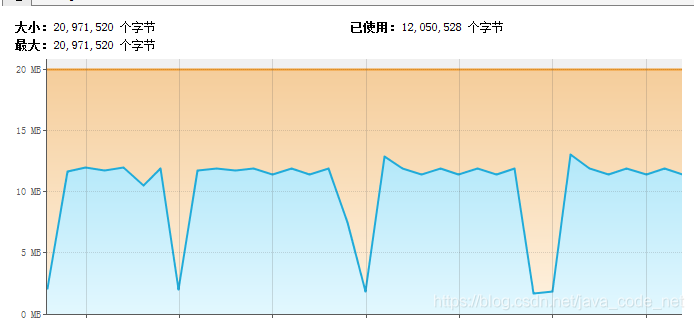
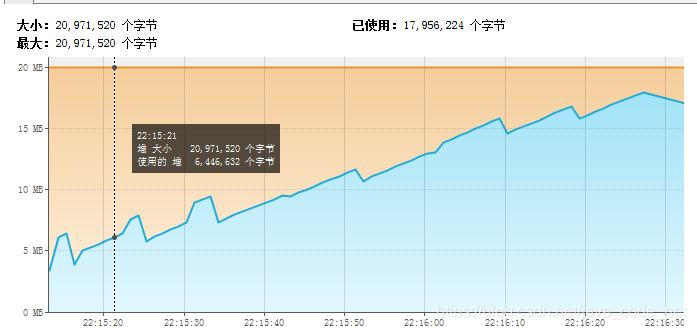
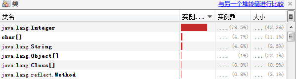
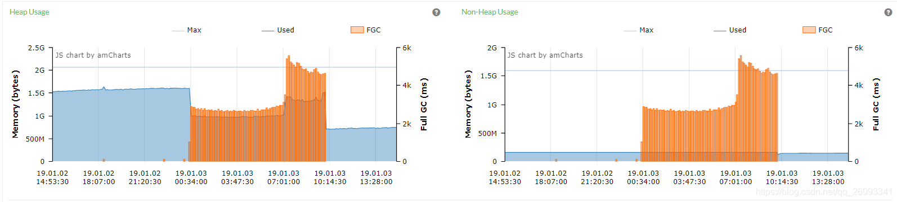
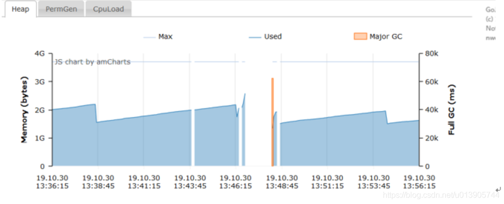
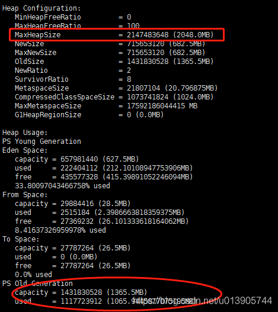
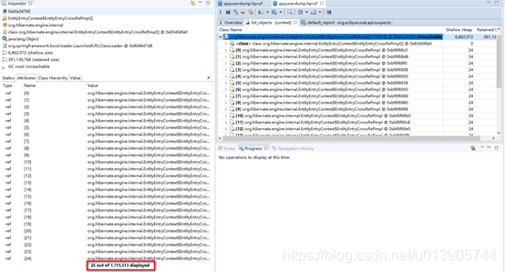

泄漏的原因本质上是长期存活对象引用短期存活对象，导致短期存活对象占用的对象无法回收

# Java堆内存泄露

来源：https://blog.csdn.net/java_code_net/article/details/89417741

首先我们来看看Java程序中最为常见的堆内存泄露。
如果想要直观的模拟出堆内存泄露，我们需要设置一个较小的堆（内存泄露是独立存在的，和对内存大小无关，不过较小的堆内存大小可以更直观的观察到内存泄露）。
我们可以通过如下两个启动参数设置堆内存大小：

```
-Xms<size>
-Xmx<size>
```

## 通过静态变量来演示内存泄露

首先我们通过如下的代码来看看看看正常Java代码运行时的内存变化情况：

```java
public class TestApplication {
  private static void test(){
      List<Integer> list = new ArrayList<Integer>();
      for(int i = 0; i < 500000; i++){
          list.add(i);
      }
  }

  public static void main(String[] args) throws InterruptedException {
      int k = 1;
      while(true){
          test();
          if(k == 10) {
              System.gc();
              k = 1;
          }
          k ++;
          Thread.sleep(1000);
      }
  }
}

```

启动参数：-Xms20m -Xmx20m
运行是的内存变化图：



在我们的代码中我们每秒调用一次test方法，这个方法中会往list中添加数据，但是在方法返回之后就处于无引用状态了（并不一定会立马进行GC），我们每10秒钟调用一次System.gc()（full GC）。从内存监控图上也能够直观的观察到堆内存的使用变化曲线。接下来我们对上面的代码做一下修改。

静态变量保存了过多不在使用的对象引用导致的内存泄露是我们编码过程中最为常见的一种内存泄露方式。下面的代码就演示了这个情况：

```java
public class TestApplication {

    private static List<Integer> list = new ArrayList<Integer>();
    private static void test(){
        for(int i = 0; i < 10000; i++){
            list.add(i);
        }
    }

    public static void main(String[] args) throws InterruptedException {
        int k = 1;
        while(true){
            test();
            if(k == 10) {
                System.gc();
                k = 1;
            }
            k ++;
            Thread.sleep(1000);
        }
    }
}

```

为了更加直观的观察内存变化，我稍微调整了一下每次插入的数据个数，启动参数仍旧和上面一下。这个时候我们能够得到如下图所示的内存变化曲线：



从曲线中我们可以发现，堆内存使用量一直在增加，并没有和前一个示例一样在full GC后释放没有使用的堆内存，每次调用test方法后添加到list中的对象都会被list所引用，所以GC是不会收集并释放内存的。

## 如何定位和解决内存泄漏

Java的内存泄漏定位一般是比较困难的，需要使用到很多的实践经验和调试技巧。下面是一些比较通用的方法：

- 可以添加-verbose:gc启动参数来输出Java程序的GC日志。通过分析这些日志，可以知道每次GC后内存是否有增加，如果在缓慢的增加的那，那就有可能是内存泄漏了（当然也需要结合当前的负载）。如果无法添加这个启动参数，也可以使用jstat来查看实时的gc日志。如果条件运行的化可以考虑使用jvisualvm图形化的观察，不过要是线上的化一般没这个条件。

- 当通过dump出堆内存，然后使用jvisualvm查看分析，一般能够分析出内存中大量存在的对象以及它的类型等。我们可以通过添加-XX:+HeapDumpOnOutOfMemoryError启动参数来自动保存发生OOM时的内存dump。
- 当确定出大对象，或者大量存在的实例类型以后，我们就需要去review代码，从实际的代码入手来定位到真正发生泄漏的代码。
- 

# springmvc重定向导致的内存泄漏

https://blog.csdn.net/qq_26093341/article/details/85696884

```java
@RequestMapping(method = RequestMethod.GET)
public String test(String redirectUrl){
    return "redirect:"+redirectUrl;
}
```

项目内一个热点接口，使用了如上代码做代码的重定向操作，而让人没想到的是：这样子的写法会有内存泄漏的风险

如果不处理，那么随着内存会耗尽。最终会导致频繁的fullgc，而OOM：gc overhead limit exceeded 

先说原因：因为redirectUrl是带参数，动态的链接，redirect会构建ViewResolver#create一个RedirectView，执行applyLifecycleMethods去initBean的时候，会使用了一个名为AdvisedBeans的ConcurrentHashMap去保存，这个map以redirect:redirectUrl为key，又没有做limit容量限制，而redirectUrl是一个动态的链接，所以每次redirect都会生成put一条数据到map中

图为pinpoint监控下，运行多天后，最近一天的内存变化图，最后内存降下来是因为修改后重启了。



解决方案之一是采用HttpServletResponse的sendRedirect就可以解决。

```java
String encodedRedirectURL = response.encodeRedirectURL(targetUrl);

response.sendRedirect(encodedRedirectURL);
```


# Springboot堆外内存泄漏

https://cloud.tencent.com/developer/article/1406119


# 错误使用命令导致的内存占用过高

[spring-boot内存占用过高_zengwende的博客-CSDN博客_springboot占用内存高](https://blog.csdn.net/zengwende/article/details/103665545)

> **Xmx设置为何未生效？**

查看部署系统的启动脚本，发现启动方式为：Java –jar $jar_file –Xms512m –Xmx1024m

正确的Java命令:

java [ options ] class [ arguments ]

java [ options ] -jar file.jar [ arguments ]

**其实到这里，也找到了此问题原因所在，Java –jar $jar_file –Xms512m –Xmx1024m被JVM解释成了程序的参数。**

手动执行: java –Xms512m –Xmx1024m –jar ems-client-1.0.jar

# JPA导致的内存泄漏

https://blog.csdn.net/u013905744/article/details/102897847

堆内存Old Generation有百万个Java Bean实例对象造成OOM（jpa使用不当造成OOM）

线上间断发生CPU飙高的问题，查看heap used，会发现在cpu飙高的时间内，机器hang住，无法响应请求



上图为pinpoint监控所示，在这2分半钟时间内发生了GC，其机器hang住

用jmap看了一下

当jvm内存为2G时



放到memoryAnalyzer（MAT）里面看一下

在unreachable jobject中



查看Object中的值，发现一个规律，那就是这些用户的cert_no全部为null

原因

查看错误日志

报错result returns more than one elements

at org.hibernate.jpa.internal.QueryImpl.getSingleResult(QueryImpl.java:539)

核心的代码就是这样一句：

```java
// 根据certNo获取用户
User user = repository.getByCertNo(certNo);
```

ORM使用的是spring data jpa

这句代码有一个严重的问题，就是**如果certNo = null，那就jpa会把表中所有cert_no is null的结果查询出来**，我们这里有100多万的User cert_no is null（这里有一个问题，jpa可能是想把100多万都取出来，但java进程这边并不能接收这么多，可能每一次放到内存中的User对象并没有这么多）

在程序中debug的时候，会发现代码运行在这里的时候明显卡顿了很久，在这个期间就是**jpa把这些对象放到内存中，然后由于一个对象无法接收这100多万的用户，导致报错：result returns more than one elements**

但这里要非常注意的是：

**这100多万的对象，放到了内存中，并且是unreachable的了，发生了memory leak内存泄漏**

**解决方案**

1. 可以看到这是jpa使用不当造成的，操作大表的时候，要特别小心，对于NPE要时刻注意

2. 如果使用mybatis，不会如此

# 堆外内存泄漏

[堆外内存泄漏排查_morris-CSDN博客](https://blog.csdn.net/u022812849/article/details/108146839)

堆外内存泄漏排查

直接内存：指的是Java应用程序通过直接方式从操作系统中申请的内存，也叫堆外内存，因为这些对象分配在Java虚拟机的堆（严格来说，应该是JVM的内存外，但是堆是这块内存中最大的）以外。

**直接内存有哪些？**

- 元空间。
- BIO中ByteBuffer分配的直接内存。
- 使用Java的Unsafe类做一些分配本地内存的操作。
- JNI或者JNA程序，直接操纵了本地内存，比如一些加密库、压缩解压等。

**JNI**（Java Native Interface）：通过使用Java本地接口（C或者C++）书写程序，可以确保代码在不同的平台上方便移植。

**JNA**（Java Native Access）：提供一组Java工具类用于在运行期间动态访问系统本地库（native library：如 Window 的 dll）而不需要编写任何Native/JNI代码。开发人员只要在一个java接口中描述目标native library的函数与结构，JNA将自动实现Java接口到native function的映射。

JNA是建立在JNI技术基础之上的一个Java类库，它使您可以方便地使用java直接访问动态链接库中的函数。原来使用JNI，你必须手工用C写一个动态链接库，在C语言中映射Java的数据类型。而在JNA中，它提供了一个动态的C语言编写的转发器，可以自动实现Java和C的数据类型映射，你不再需要编写C动态链接库。也许这也意味着，使用JNA技术比使用JNI技术调用动态链接库会有些微的性能损失。但总体影响不大，因为JNA也避免了JNI的一些平台配置的开销。

**直接内存的优缺点**
直接内存，其实就是不受JVM控制的内存。相比于堆内存有几个优势：

- 减少了垃圾回收的工作，因为垃圾回收会暂停其他的工作，能保持一个较小的堆内内存，以减少垃圾收集对应用的影响。
- 加快了复制的速度。因为堆内在flush到远程时，会先复制到直接内存（非堆内存），然后再发送，而堆外内存相当于省略掉了这个工作。
- 可以在进程间共享，减少JVM间的对象复制，使得JVM的分割部署更容易实现。
- 可以扩展至更大的内存空间，比如超过1TB甚至比主存还大的空间。

直接内存有很多好处，我们还是应该要了解它的缺点：

- 堆外内存难以控制，如果内存泄漏，那么很难排查。
- **堆外内存相对来说，不适合存储很复杂的对象，一般简单的对象比较适合**。

## ByteBuffer

```java
public class DirectMemoryOOM {

    public static void main(String[] args) throws IllegalArgumentException, IllegalAccessException {
        ByteBuffer.allocateDirect(128 * 1024 * 1024);
    }
}

```

运行时带上JVM参数-XX:MaxDirectMemorySize=100m会抛出如下异常：

```java
Exception in thread "main" java.lang.OutOfMemoryError: Direct buffer memory
	at java.nio.Bits.reserveMemory(Bits.java:694)
	at java.nio.DirectByteBuffer.<init>(DirectByteBuffer.java:123)
	at java.nio.ByteBuffer.allocateDirect(ByteBuffer.java:311)
	at com.morris.jvm.heapout.DirectMemoryOOM.main(DirectMemoryOOM.java:14)

```

如果我们没有通过`-XX:MaxDirectMemorySize`来指定最大的直接内存，那么默认的最大堆外内存是多少呢？一般来说，如果没有显示的设置`-XX:MaxDirectMemorySize`参数，通过ByteBuffer能够分配的直接内存空间大小就是堆的最大大小，也就是对应对应参数`-Xmx`，真的是这么样吗？

1. VM参数配置：`-XX:MaxDirectMemorySize=128m`，程序会正常退出。
2. VM参数配置：`-Xmx128m`，运行结果为OutOfMemoryError，这就说明了ByteBuffer能够分配的直接内存空间大小并不是`-Xmx`指定的大小。
3. VM参数配置：`-Xmx135m -Xmn100m -XX:SurvivorRatio=8`，运行结果还是OutOfMemoryError。
4. VM参数配置：`-Xmx138m -Xmn100m -XX:SurvivorRatio=8`，程序会正常退出。

总结：没有显示的设置`-XX:MaxDirectMemorySize`参数，通过ByteBuffer能够分配的直接内存空间大小就是堆的最大可使用的大小。堆的最大可使用的大小=堆的最大值（-Xmx）- 一个Survivor的大小(浪费的空间)，所以案例3会OOM，堆的最大的可使用的大小=135m-10m=125m，不能分配128M的对象，而在案例4中，堆的最大可使用的大小=138m-10m=128m ,刚好可以分配128M的对象，所有不会OOM。

## UnSafe

```java
public class UnSafeDemo {
    public static final int _1MB = 1024 * 1024;

    public static void main(String[] args) throws Exception {
        Field field = Unsafe.class.getDeclaredField("theUnsafe");
        field.setAccessible(true);
        Unsafe unsafe = (Unsafe) field.get(null);
        unsafe.allocateMemory(100 * 1024 * 1024);
    }
}

```

运行时加上`-XX:MaxDirectMemorySize=10m`参数，发现程序并没有OOM，也就是说明使用**UnSafe API分配的内存不受`-XX:MaxDirectMemorySize`参数的控制**。

## JNI

```java
package com.morris.jvm.heapout;

import com.sun.management.OperatingSystemMXBean;
import com.sun.net.httpserver.HttpContext;
import com.sun.net.httpserver.HttpServer;

import java.io.*;
import java.lang.management.ManagementFactory;
import java.net.InetSocketAddress;
import java.util.Random;
import java.util.concurrent.ThreadLocalRandom;
import java.util.zip.GZIPInputStream;
import java.util.zip.GZIPOutputStream;

public class LeakDemo {

    /**
     * 构造随机的字符串
     */
    public static String randomString(int strLength) {
        Random rnd = ThreadLocalRandom.current();
        StringBuilder ret = new StringBuilder();
        for (int i = 0; i < strLength; i++) {
            boolean isChar = (rnd.nextInt(2) % 2 == 0);
            if (isChar) {
                int choice = rnd.nextInt(2) % 2 == 0 ? 65 : 97;
                ret.append((char) (choice + rnd.nextInt(26)));
            } else {
                ret.append(rnd.nextInt(10));
            }
        }
        return ret.toString();
    }

    //复制方法
    public static int copy(InputStream input, OutputStream output) throws IOException {
        long count = copyLarge(input, output);
        return count > 2147483647L ? -1 : (int) count;
    }

    //复制方法
    public static long copyLarge(InputStream input, OutputStream output) throws IOException {
        byte[] buffer = new byte[4096];
        long count = 0L;

        int n;
        for (; -1 != (n = input.read(buffer)); count += (long) n) {
            output.write(buffer, 0, n);
        }

        return count;
    }

    //解压
    public static String decompress(byte[] input) throws Exception {
        ByteArrayOutputStream out = new ByteArrayOutputStream();
        copy(new GZIPInputStream(new ByteArrayInputStream(input)), out);
        return new String(out.toByteArray());
    }

    //压缩
    public static byte[] compress(String str) throws Exception {
        ByteArrayOutputStream bos = new ByteArrayOutputStream();
        GZIPOutputStream gzip = new GZIPOutputStream(bos);
        try {
            gzip.write(str.getBytes());
            gzip.finish();
            byte[] b = bos.toByteArray();
            return b;
        } finally {
            try {
                gzip.close();
            } catch (Exception ex) {
            }
            try {
                bos.close();
            } catch (Exception ex) {
            }
        }
    }

    private static OperatingSystemMXBean osmxb = (OperatingSystemMXBean) ManagementFactory.getOperatingSystemMXBean();

    //通过MXbean来判断获取内存使用率(系统)
    public static int memoryLoad() {
        double totalvirtualMemory = osmxb.getTotalPhysicalMemorySize();
        double freePhysicalMemorySize = osmxb.getFreePhysicalMemorySize();

        double value = freePhysicalMemorySize / totalvirtualMemory;
        int percentMemoryLoad = (int) ((1 - value) * 100);
        return percentMemoryLoad;
    }


    private static volatile int RADIO = 60;

    public static void main(String[] args) throws Exception {

        //构造1kb的随机字符串
        int BLOCK_SIZE = 1024;
        String str = randomString(BLOCK_SIZE / Byte.SIZE);
        //字符串进行压缩
        byte[] bytes = compress(str);
        for (; ; ) {
            int percent = memoryLoad();
            if (percent > RADIO) { // 如果操作系统内存使用率达到阈值，则等待1s
                System.out.println("memory used >" + RADIO + "  hold 1s");
                Thread.sleep(1000);
            } else {
                //不断对字符串进行解压
                decompress(bytes);
                Thread.sleep(1);
            }
        }
    }
}

```

演示程序的简单说明：程序将会申请1kb的随机字符串，然后持续解压。为了避免让操作系统陷入假死状态，我们每次都会判断操作系统内存使用率，在达到60%的时候，我们将挂起程序，这样方便用工具来分析。

启动参数：`java -XX:+PrintGC -Xmx1G -Xmn1G -XX:+AlwaysPreTouch -XX:MaxMetaspaceSize=10M -XX:MaxDirectMemorySize=10M LeakDemo`

参数说明：

- -XX:+PrintGC：打印GC日志。
- -Xmx1G：限制堆的最大值为1G。
- -Xmn1G：限制堆的最小值为1G。
- -XX:MaxMetaspaceSize=10M：限制元空间的最大值为10M。
- -XX:MaxDirectMemorySize=10M：限制直接内存的最大值为10M。
- -XX:+AlwaysPreTouch：如果不设置这个参数，JVM的内存只有真正在使用的时候，才会分配给它。如果设置这个参数，在JVM启动的时候，就把它所有的内存在操作系统分配了。在堆比较大的时候，会加大启动时间，但在这个场景中，我们为了减少内存动态分配的影响，把这个参数添加上。

这个程序很快就打印了以下的显示，这个证明操作系统内存使用率，达到了60%。

```
Java HotSpot(TM) 64-Bit Server VM warning: MaxNewSize (1048576k) is equal to or greater than the entire heap (1048576k).  A new max generation size of 1048064k will be used.
memory used >80  hold 1s
memory used >80  hold 1s
memory used >80  hold 1s
... ...

```

下面通过一些命令和工具分析内存泄漏的原因。

## top命令

先使用top命令查看哪个进程的内存占用过高：

```
# top
top - 11:14:34 up 277 days, 50 min,  2 users,  load average: 0.00, 0.00, 0.00
Tasks: 143 total,   1 running, 141 sleeping,   1 stopped,   0 zombie
Cpu(s):  0.3%us,  0.3%sy,  0.0%ni, 99.3%id,  0.0%wa,  0.0%hi,  0.0%si,  0.0%st
Mem:   3921488k total,  2458504k used,  1462984k free,   327152k buffers
Swap:  4063228k total,    58672k used,  4004556k free,   434392k cached

  PID USER      PR  NI  VIRT  RES  SHR S %CPU %MEM    TIME+  COMMAND                                                                                                                                                                                                         
17238 root      20   0 4287m 1.3g  11m S  7.9 34.9   0:02.69 java                                                                                                                                                                                                             
    1 root      20   0 19360 1032  792 S  0.0  0.0   0:05.59 init   

```

发现一个进程号为17238的java进程占用内存较高。

top命令中几个指标说明：

- VIRT（virtual memory usage）：虚拟内存，进程申请的虚拟内存大小，包括进程使用的库、代码、数据等，假如进程申请100m的内存，但实际只使用了10m，那么它会增长100m，而不是实际的使用量。
- RES（resident memory usage）：常驻内存（物理内存），如果申请100m的内存，实际使用10m，它只增长10m。
- %MEM：进程使用的物理内存占操作系统物理内存的百分比。

如果进程较多，可以使用`top -p 17238`命令，只观察这一个进程。

```
# top -p 17238
top - 11:19:04 up 277 days, 54 min,  2 users,  load average: 0.00, 0.00, 0.00
Tasks:   1 total,   0 running,   1 sleeping,   0 stopped,   0 zombie
Cpu(s):  0.2%us,  0.0%sy,  0.0%ni, 99.8%id,  0.0%wa,  0.0%hi,  0.0%si,  0.0%st
Mem:   3921488k total,  3176908k used,   744580k free,   327152k buffers
Swap:  4063228k total,    58672k used,  4004556k free,   434392k cached

  PID USER      PR  NI  VIRT  RES  SHR S %CPU %MEM    TIME+  COMMAND                                                                                                                                                                                                         
17238 root      20   0 6975m 2.0g  11m S  0.3 53.1   0:08.24 java       

```

当控制台打印`memory used >80 hold 1s`时，此时进程17238占用的物理内存达到最大值2G。

## jmap命令

既然java进程占用的内存较大，在jvm中占用内存最大的区域为堆，存在内存泄漏可能性最大的也是堆，所以使用jvm提供的jmap指令来查看堆的情况。

```
# jmap -heap 17238
Attaching to process ID 17238, please wait...
Debugger attached successfully.
Server compiler detected.
JVM version is 25.241-b07

using thread-local object allocation.
Parallel GC with 2 thread(s)

Heap Configuration:
   MinHeapFreeRatio         = 0
   MaxHeapFreeRatio         = 100
   MaxHeapSize              = 1073741824 (1024.0MB)
   NewSize                  = 1073217536 (1023.5MB)
   MaxNewSize               = 1073217536 (1023.5MB)
   OldSize                  = 524288 (0.5MB)
   NewRatio                 = 2
   SurvivorRatio            = 8
   MetaspaceSize            = 10485760 (10.0MB)
   CompressedClassSpaceSize = 2097152 (2.0MB)
   MaxMetaspaceSize         = 10485760 (10.0MB)
   G1HeapRegionSize         = 0 (0.0MB)

Heap Usage:
PS Young Generation
Eden Space:
   capacity = 805830656 (768.5MB)
   used     = 274035832 (261.34093475341797MB)
   free     = 531794824 (507.15906524658203MB)
   34.00662781436799% used
From Space:
   capacity = 133693440 (127.5MB)
   used     = 0 (0.0MB)
   free     = 133693440 (127.5MB)
   0.0% used
To Space:
   capacity = 133693440 (127.5MB)
   used     = 0 (0.0MB)
   free     = 133693440 (127.5MB)
   0.0% used
PS Old Generation
   capacity = 524288 (0.5MB)
   used     = 0 (0.0MB)
   free     = 524288 (0.5MB)
   0.0% used

820 interned Strings occupying 55872 bytes.

```

从堆的日志中可以发现，JVM的堆和元空间总共使用内存1.1G左右，说明不是堆内存泄漏。

## jstack命令

既然不是堆内存泄露，那么是不是栈的内存泄漏了呢？

```
# jstack 17238
2020-08-21 11:46:21
Full thread dump Java HotSpot(TM) 64-Bit Server VM (25.241-b07 mixed mode):

"Attach Listener" #8 daemon prio=9 os_prio=0 tid=0x00007f0544001000 nid=0x449d waiting on condition [0x0000000000000000]
   java.lang.Thread.State: RUNNABLE

"Service Thread" #7 daemon prio=9 os_prio=0 tid=0x00007f057c0ba000 nid=0x444f runnable [0x0000000000000000]
   java.lang.Thread.State: RUNNABLE

"C1 CompilerThread1" #6 daemon prio=9 os_prio=0 tid=0x00007f057c0b7000 nid=0x444e waiting on condition [0x0000000000000000]
   java.lang.Thread.State: RUNNABLE

"C2 CompilerThread0" #5 daemon prio=9 os_prio=0 tid=0x00007f057c0b4800 nid=0x444d waiting on condition [0x0000000000000000]
   java.lang.Thread.State: RUNNABLE

"Signal Dispatcher" #4 daemon prio=9 os_prio=0 tid=0x00007f057c0af800 nid=0x444c runnable [0x0000000000000000]
   java.lang.Thread.State: RUNNABLE

"Finalizer" #3 daemon prio=8 os_prio=0 tid=0x00007f057c081800 nid=0x444b in Object.wait() [0x00007f055fefd000]
   java.lang.Thread.State: WAITING (on object monitor)
	at java.lang.Object.wait(Native Method)
	- waiting on <0x00000000c0088ee0> (a java.lang.ref.ReferenceQueue$Lock)
	at java.lang.ref.ReferenceQueue.remove(ReferenceQueue.java:144)
	- locked <0x00000000c0088ee0> (a java.lang.ref.ReferenceQueue$Lock)
	at java.lang.ref.ReferenceQueue.remove(ReferenceQueue.java:165)
	at java.lang.ref.Finalizer$FinalizerThread.run(Finalizer.java:216)

"Reference Handler" #2 daemon prio=10 os_prio=0 tid=0x00007f057c07d000 nid=0x444a in Object.wait() [0x00007f055fffe000]
   java.lang.Thread.State: WAITING (on object monitor)
	at java.lang.Object.wait(Native Method)
	- waiting on <0x00000000c0086c00> (a java.lang.ref.Reference$Lock)
	at java.lang.Object.wait(Object.java:502)
	at java.lang.ref.Reference.tryHandlePending(Reference.java:191)
	- locked <0x00000000c0086c00> (a java.lang.ref.Reference$Lock)
	at java.lang.ref.Reference$ReferenceHandler.run(Reference.java:153)

"main" #1 prio=5 os_prio=0 tid=0x00007f057c009000 nid=0x4446 waiting on condition [0x00007f0583977000]
   java.lang.Thread.State: TIMED_WAITING (sleeping)
	at java.lang.Thread.sleep(Native Method)
	at LeakDemo.main(LeakDemo.java:130)

"VM Thread" os_prio=0 tid=0x00007f057c073800 nid=0x4449 runnable 

"GC task thread#0 (ParallelGC)" os_prio=0 tid=0x00007f057c01e800 nid=0x4447 runnable 

"GC task thread#1 (ParallelGC)" os_prio=0 tid=0x00007f057c020800 nid=0x4448 runnable 

"VM Periodic Task Thread" os_prio=0 tid=0x00007f057c0bd000 nid=0x4450 waiting on condition 

JNI global references: 5

```

从栈的日志中可以发现，这个进程总共开启了10多个线程，在jvm中每个线程分配的栈的大小（-Xss）默认为1M，说明不是栈内存泄漏。

到这里基本上可以确定应该是直接内存发生了泄漏。

## NMT参数

NMT（NativeMemoryTracking）是JVM提供的用来追踪Native内存的使用情况。通过在启动参数上加入-XX:NativeMemoryTracking=detail就可以启用，然后使用jcmd命令，就可查看内存分配。

先把程序关闭，加上-XX:NativeMemoryTracking=detail参数重新启动：

```
# jcmd 17845 VM.native_memory summary
17845:

Native Memory Tracking:

Total: reserved=2416216KB, committed=1117248KB
-                 Java Heap (reserved=1048576KB, committed=1048576KB)
                            (mmap: reserved=1048576KB, committed=1048576KB) 
 
-                     Class (reserved=1059970KB, committed=8066KB)
                            (classes #414)
                            (malloc=3202KB #280) 
                            (mmap: reserved=1056768KB, committed=4864KB) 
 
-                    Thread (reserved=12388KB, committed=12388KB)
                            (thread #13)
                            (stack: reserved=12336KB, committed=12336KB)
                            (malloc=38KB #64) 
                            (arena=14KB #22)
 
-                      Code (reserved=249713KB, committed=2649KB)
                            (malloc=113KB #447) 
                            (mmap: reserved=249600KB, committed=2536KB) 
 
-                        GC (reserved=40417KB, committed=40417KB)
                            (malloc=3465KB #112) 
                            (mmap: reserved=36952KB, committed=36952KB) 
 
-                  Compiler (reserved=137KB, committed=137KB)
                            (malloc=6KB #31) 
                            (arena=131KB #5)
 
-                  Internal (reserved=3290KB, committed=3290KB)
                            (malloc=3258KB #1328) 
                            (mmap: reserved=32KB, committed=32KB) 
 
-                    Symbol (reserved=1373KB, committed=1373KB)
                            (malloc=917KB #92) 
                            (arena=456KB #1)
 
-    Native Memory Tracking (reserved=177KB, committed=177KB)
                            (malloc=114KB #1618) 
                            (tracking overhead=63KB)
 
-               Arena Chunk (reserved=174KB, committed=174KB)
                            (malloc=174KB) 


```

可惜的是，这个名字让人振奋的工具并不能如它描述的一样，看到我们这种泄漏的场景。上面日志中这点小小的空间，是不能和2GB的内存占用相比的。

## perf命令

下面介绍一个神器`perf`，它除了能够进行一些性能分析，它还能帮助我们找到相应的`native`调用，这么突出的堆外内存使用问题，肯定能找到相应的调用函数。

安装：`yum install -y perf`。

当java进程启动时，我们使用命令`perf record -g -p 2747`开启监控栈函数调用，当程序内存使用的阈值增加到80%，使用Ctrl+C结束perf命令，这时会在当前目录下生成一个文件perf.data。

然后执行`perf report -i perf.data`查看报告：

```
Samples: 64K of event 'cpu-clock', Event count (approx.): 16226750000                                                                                                                                                                                                         
  Children      Self  Command  Shared Object       Symbol                                                                                                                                                                                                                     
+   69.64%     0.05%  java     [kernel.kallsyms]   [k] system_call_fastpath
+   42.45%     0.08%  java     libc-2.17.so        [.] __GI___libc_read
+   42.22%     0.03%  java     [kernel.kallsyms]   [k] sys_read
+   42.14%     0.13%  java     [kernel.kallsyms]   [k] vfs_read
+   41.66%     0.08%  java     [kernel.kallsyms]   [k] proc_reg_read
+   36.66%     0.20%  java     [kernel.kallsyms]   [k] seq_read
+   36.22%     0.33%  java     [kernel.kallsyms]   [k] meminfo_proc_show
+   28.52%    28.51%  java     [kernel.kallsyms]   [k] get_vmalloc_info
+   13.59%     0.00%  java     [unknown]           [k] 0x702f006f666e696d
+   13.35%     0.07%  java     libc-2.17.so        [.] __fopen_internal
+   13.04%     0.07%  java     libc-2.17.so        [.] __GI___libc_open
+   12.88%     0.04%  java     [kernel.kallsyms]   [k] sys_open
+   12.78%     0.17%  java     [kernel.kallsyms]   [k] do_sys_open
+   11.80%     0.04%  java     [kernel.kallsyms]   [k] do_filp_open
+   11.70%     0.09%  java     [kernel.kallsyms]   [k] path_openat
+    8.40%     0.48%  java     [kernel.kallsyms]   [k] do_last
+    7.95%     0.00%  java     [kernel.kallsyms]   [k] page_fault
+    7.95%     0.01%  java     [kernel.kallsyms]   [k] do_page_fault
+    7.81%     1.41%  java     [kernel.kallsyms]   [k] __do_page_fault
+    6.60%     0.32%  java     libjvm.so           [.] JavaCalls::call_helper
+    6.33%     0.12%  java     [kernel.kallsyms]   [k] seq_printf
+    6.30%     0.00%  java     libpthread-2.17.so  [.] start_thread
+    6.21%     0.05%  java     [kernel.kallsyms]   [k] seq_vprintf
+    6.08%     0.00%  java     perf-2747.map       [.] 0x00007fb799150574
+    6.02%     0.00%  java     perf-2747.map       [.] 0x00007fb799121c46
+    5.91%     0.35%  java     [kernel.kallsyms]   [k] handle_mm_fault
+    5.78%     1.05%  java     [kernel.kallsyms]   [k] vsnprintf
+    5.74%     0.07%  java     libc-2.17.so        [.] __GI___munmap
+    5.71%     0.08%  java     libzip.so           [.] Java_java_util_zip_Inflater_inflateBytes
+    5.68%     0.00%  java     libjli.so           [.] JavaMain
+    5.68%     0.00%  java     libjvm.so           [.] jni_CallStaticVoidMethod
+    5.68%     0.00%  java     libjvm.so           [.] jni_invoke_static
+    5.58%     0.03%  java     [kernel.kallsyms]   [k] sys_munmap
+    5.39%     0.03%  java     [kernel.kallsyms]   [k] vm_munmap
+    5.21%     0.25%  java     [kernel.kallsyms]   [k] do_munmap
+    5.14%     0.07%  java     [kernel.kallsyms]   [k] proc_root_lookup
+    5.12%     0.01%  java     [kernel.kallsyms]   [k] lookup_real
+    5.09%     0.03%  java     [kernel.kallsyms]   [k] proc_lookup
+    4.99%     0.46%  java     [kernel.kallsyms]   [k] proc_lookup_de
+    4.95%     0.24%  java     libc-2.17.so        [.] __GI___libc_close
+    4.74%     0.00%  java     perf-2747.map       [.] 0x00007fb799146471
+    4.67%     1.35%  java     libzip.so           [.] inflate
+    4.47%     0.15%  java     libjvm.so           [.] JVM_Sleep
+    4.45%     0.31%  java     [kernel.kallsyms]   [k] __alloc_pages_nodemask
+    4.19%     0.00%  java     perf-2747.map       [.] 0x00007fb7990007a7
+    4.15%     0.09%  java     [kernel.kallsyms]   [k] alloc_pages_vma
+    4.06%     0.06%  java     [kernel.kallsyms]   [k] do_notify_resume
+    4.06%     0.00%  java     [kernel.kallsyms]   [k] int_signal
+    3.99%     0.09%  java     [kernel.kallsyms]   [k] task_work_run
+    3.94%     0.26%  java     libjvm.so           [.] os::sleep
+    3.89%     0.02%  java     [kernel.kallsyms]   [k] ____fput

```

一些JNI程序或者JDK内的模块，都会调用相应的本地函数，在Linux上，这些函数库的后缀都是so，windows下函数库的后缀是dll。

我们依次浏览所有可疑的资源，发现了“libzip.so”，还发现了不少相关的调用。搜索zip（输入 / 进入搜索模式），结果如下：

```
Samples: 64K of event 'cpu-clock', Event count (approx.): 16226750000                                                                                                                                                                                                         
  Children      Self  Comm  Shared Ob Symbol                                                                                                                                                                                                                                 
+    5.71%     0.08%  java  libzip.so  [.] Java_java_util_zip_Inflater_inflateBytes                                                                                                                                                                                          
     0.23%     0.04%  java  libzip.so  [.] Java_java_util_zip_Inflater_init                                                                                                                                                                                                  
+   42.22%     0.03%  java  [kernel.kallsyms]   [k] sys_read    

```

我们发现这些本地调用都是由`java.util.zip.Inflater#inflateBytes()`方法产生的，然后在代码中追踪哪些地方调用了这个方法或者类，一步一步分析。

## 内存泄漏的原因

GZIPInputStream使用Inflater申请堆外内存、我们没有调用close()方法来主动释放。如果忘记关闭，Inflater对象的生命会延续到下一次GC，在此过程中，堆外内存会一直增长，而GC迟迟没有发生。

```java
public static String decompress(byte[] input) throws Exception {
    ByteArrayOutputStream out = new ByteArrayOutputStream();
    copy(new GZIPInputStream(new ByteArrayInputStream(input)), out);
    return new String(out.toByteArray());
}
```

只需要将上面的代码改成如下即可：

```java
public static String decompress(byte[] input) throws Exception {

    try (
        ByteArrayOutputStream out = new ByteArrayOutputStream();
        GZIPInputStream gzip = new GZIPInputStream(new ByteArrayInputStream(input))
    ) {
        copy(gzip, out);
        return new String(out.toByteArray());
    }
}

```

## 总结

对堆外内存划分为3块：

- 元空间：主要是方法区和常量池的存储之地，可以使用“MaxMetaspaceSize”参数来限制它的大小。
- 直接内存：主要是通过DirectByteBuffer申请的内存，可以使用“MaxDirectMemorySize”参数来限制它的大小。
- 其他堆外内存：主要是指使用了Unsafe或者其他JNI手段直接申请的内存。这种情况，就没有任何参数能够阻挡它们，要么靠它自己去释放一些内存，要么等待操作系统对它的审判了。